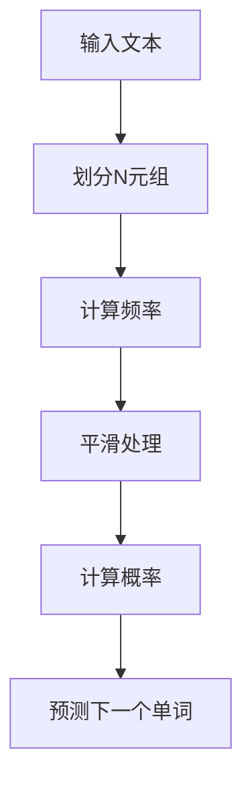

                 

关键词：语言建模，N-gram，Bigram，语言模型算法，概率模型，序列模型，自然语言处理

## 摘要

本文旨在深入探讨语言建模中的N-gram模型，特别是从基本的Bigram模型扩展到更复杂的N-gram模型。我们将详细解释N-gram模型的核心概念，构建原理，数学模型，以及其在实际应用中的重要性。通过比较Bigram和N-gram模型，我们将揭示N-gram模型在处理长程依赖和语序关系方面的优势。此外，本文还将通过实际代码实例，展示N-gram模型的实现与应用，并讨论其在自然语言处理领域的前景和挑战。

## 1. 背景介绍

语言建模是自然语言处理（NLP）中的一个核心任务，其目标是通过学习大量文本数据来预测下一个单词或字符。语言建模在许多NLP应用中扮演着关键角色，例如机器翻译、语音识别、文本生成等。在过去的几十年中，研究者们提出了多种语言模型，从简单的统计模型到复杂的深度学习模型。然而，N-gram模型作为一种经典的统计模型，仍然因其简单性和有效性而被广泛应用。

N-gram模型最早由Zellig S. Harris在20世纪50年代提出，是一种基于单词或字符序列的统计语言模型。它通过计算某一单词序列出现的频率或概率来预测下一个单词。Bigram模型是最简单的N-gram模型，它只考虑前一个单词和当前单词的关系。然而，Bigram模型在处理长程依赖和复杂语境时存在局限性，因此研究者们提出了更复杂的N-gram模型，如Trigram、Four-gram等。

本文将首先介绍N-gram模型的基本概念和构建方法，然后详细分析Bigram模型的局限性，并探讨如何通过引入更多语法单元来改进语言模型。接着，我们将探讨N-gram模型在自然语言处理中的应用，并通过实际代码实例展示其实现过程。最后，本文将总结N-gram模型的优势和挑战，并展望其未来发展趋势。

### 1.1 语言建模的重要性

语言建模在自然语言处理中具有至关重要的地位。首先，它为文本数据提供了结构化表示，使得计算机能够理解和使用人类语言。语言建模的核心任务是从大规模文本数据中学习语言规律，从而生成或理解自然语言序列。这一任务不仅在信息检索、文本分类、情感分析等传统应用中发挥着重要作用，还在新兴的领域如机器翻译、语音识别和聊天机器人中得到了广泛应用。

在机器翻译中，语言建模用于预测源语言到目标语言的单词映射，从而生成准确的翻译结果。在语音识别中，语言建模用于将语音信号转换为文本，从而实现语音到文字的转换。在文本生成中，语言建模通过预测下一个单词或字符，生成连贯且具有自然流畅感的文本。

语言建模的应用不仅限于NLP领域，它还在许多其他领域中发挥着重要作用。例如，在金融领域，语言建模可以帮助分析和预测市场趋势；在生物信息学中，语言建模可以用于基因序列分析和蛋白质结构预测。总之，语言建模作为一种核心技术，正在推动着人工智能和自然语言处理的快速发展。

### 1.2 N-gram模型的起源与发展

N-gram模型作为一种经典的统计语言模型，起源于20世纪50年代。当时，语言学家和计算机科学家开始探索如何利用计算机来处理和理解自然语言。Zellig S. Harris是N-gram模型的先驱之一，他在1954年发表了关于N-gram模型的研究论文，提出了基于单词序列的概率模型。

Harris提出的Bigram模型是最简单的N-gram模型，它只考虑前一个单词和当前单词之间的关系。Bigram模型的基本思想是，通过计算某一单词序列（如`the`和`dog`）在文本中出现的频率或概率，来预测下一个单词。这一简单的模型在早期NLP应用中取得了显著的成功，例如自动拼写纠错和文本摘要。

随着计算机技术和自然语言处理领域的不断发展，N-gram模型也在不断改进和扩展。在20世纪60年代，研究者们提出了Trigram模型，它考虑了前两个单词与当前单词的关系。Trigram模型在处理长程依赖和复杂语境方面比Bigram模型更有效。此后，更多的N-gram模型被提出，如Four-gram、Five-gram等，这些模型逐渐成为统计语言模型中的主流。

进入21世纪，随着深度学习的兴起，N-gram模型虽然在理论上依然重要，但在实际应用中的地位逐渐被更复杂的模型所取代，如基于神经网络的序列模型。然而，N-gram模型作为一种简单而有效的工具，仍然在许多领域得到广泛应用，其基本思想和原理对理解现代语言模型仍然具有指导意义。

### 1.3 N-gram模型的核心概念与联系

N-gram模型是一种基于单词或字符序列的统计语言模型，它通过将输入文本划分为一系列N元组来学习语言规律。一个N-gram模型由N个连续的单词或字符组成，因此，N被称为N-gram模型的窗口大小。N-gram模型的基本概念可以简单概括为：

- **N元组（N-gram）**：文本序列中被连续考虑的N个单词或字符的组合。例如，"dog"和"run"可以组成一个Bigram，而"the quick brown fox jumps over the lazy dog"可以组成一个Five-gram。

- **频率（Frequency）**：N-gram模型通过计算某个N元组在文本中出现的频率来估计其概率。频率越高，N-gram的出现概率越大。

- **概率（Probability）**：N-gram模型的目的是预测下一个单词或字符，因此，模型需要为每个N-gram赋予一个概率值。概率值通常通过频率计算得出，但也可以通过其他方法进行调整，以应对罕见或低频率的N-gram。

N-gram模型的核心在于其概率计算方法。对于一个给定的N-gram序列`w1 w2 ... wN`，N-gram模型的目标是计算下一个单词`wN+1`出现的概率。这一过程可以通过以下公式表示：

\[ P(w_{N+1} | w_1 w_2 ... w_N) = \frac{C(w_1 w_2 ... w_N w_{N+1})}{C(w_1 w_2 ... w_N)} \]

其中，\( C(w_1 w_2 ... w_N w_{N+1}) \)表示N-gram序列`w1 w2 ... wN wN+1`在文本中出现的次数，而\( C(w_1 w_2 ... w_N) \)表示前N-1个单词`w1 w2 ... wN`在文本中出现的次数。

为了简化计算，N-gram模型通常使用平滑技术来处理稀疏数据集。最常用的平滑技术是拉普拉斯平滑（Laplace smoothing），它通过在计算概率时加上一个常数，从而避免零概率问题。拉普拉斯平滑的公式如下：

\[ P(w_{N+1} | w_1 w_2 ... w_N) = \frac{C(w_1 w_2 ... w_N w_{N+1}) + 1}{C(w_1 w_2 ... w_N) + V} \]

其中，\( V \)表示文本中的唯一单词或字符数量。

为了更直观地理解N-gram模型，我们可以通过以下Mermaid流程图来展示其基本结构和流程：



在这个流程图中，输入文本首先被划分为一系列N元组，然后计算每个N元组的频率。接下来，通过平滑处理来避免零概率问题，并计算每个N元组的概率。最后，根据计算出的概率来预测下一个单词。

通过这种简单的概率计算方法，N-gram模型能够有效地预测文本中的下一个单词或字符，从而在自然语言处理中发挥着重要作用。然而，N-gram模型的局限性也在实际应用中逐渐显现，尤其是在处理长程依赖和复杂语境时。因此，研究者们不断探索更复杂的N-gram模型，以应对这些挑战。

### 1.4 Bigram模型的原理与实现

Bigram模型，也称为二元模型，是最简单的N-gram模型，它只考虑前一个单词和当前单词之间的关系。这种模型的基本原理相对简单，但它在很多NLP任务中表现出良好的性能，尤其是在文本生成和拼写纠错等应用中。

#### 1.4.1 基本原理

Bigram模型通过统计文本中相邻单词对（Bigram）的频率来预测下一个单词。例如，在一段文本中，"the"后面经常跟着"dog"，我们可以通过计算这两个单词一起出现的频率来预测下一个单词是"dog"的概率。

一个简单的Bigram模型的数学表示如下：

\[ P(w_{N+1} | w_N) = \frac{C(w_{N} w_{N+1})}{C(w_N)} \]

其中，\( C(w_{N} w_{N+1}) \)表示单词\( w_{N} \)和\( w_{N+1} \)一起出现的次数，而\( C(w_N) \)表示单词\( w_{N} \)出现的次数。

在实际应用中，Bigram模型的预测公式通常会使用拉普拉斯平滑来避免零概率问题：

\[ P(w_{N+1} | w_N) = \frac{C(w_{N} w_{N+1}) + 1}{C(w_N) + V} \]

其中，\( V \)是文本中的唯一单词数量。

#### 1.4.2 实现方法

实现一个Bigram模型通常包括以下几个步骤：

1. **文本预处理**：首先，需要对输入文本进行预处理，包括分词、去除标点符号、转换小写等操作。这些步骤有助于确保文本数据的一致性和准确性。

2. **构建频率表**：接下来，构建一个频率表，用于记录每个单词及其相邻单词对的频率。可以使用哈希表或字典来实现这一步骤。

3. **概率计算**：根据构建的频率表，计算每个单词对出现的概率。为了提高计算效率，可以预先计算并存储这些概率值。

4. **预测下一个单词**：最后，利用计算出的概率，预测输入文本的下一个单词。

以下是一个简单的Python实现示例：

```python
from collections import defaultdict

class BigramModel:
    def __init__(self):
        self.frequency_table = defaultdict(int)
        self.V = 0

    def train(self, text):
        words = text.lower().split()
        self.V = len(set(words))
        for i in range(len(words) - 1):
            pair = (words[i], words[i+1])
            self.frequency_table[pair] += 1

    def smooth(self, pair):
        return (self.frequency_table[pair] + 1) / (self.V + 1)

    def predict(self, current_word):
        next_word_probabilities = {}
        for next_word in self.frequency_table.keys():
            if current_word == next_word[0]:
                next_word_probabilities[next_word[1]] = self.smooth(next_word)
        return max(next_word_probabilities, key=next_word_probabilities.get)

# 示例使用
text = "the dog runs quickly"
model = BigramModel()
model.train(text)
print(model.predict("the"))  # 输出可能是 "dog" 或其他可能的结果
```

在这个示例中，我们首先创建了一个`BigramModel`类，用于训练和预测。`train`方法用于构建频率表，`smooth`方法用于进行拉普拉斯平滑处理，`predict`方法用于根据当前单词预测下一个单词。

#### 1.4.3 优点与局限

Bigram模型具有以下优点：

- **简单易实现**：Bigram模型的结构简单，易于理解和实现，特别适合初学者。
- **计算效率高**：由于只需要考虑前一个单词和当前单词的关系，Bigram模型的计算效率相对较高。
- **应用广泛**：在许多NLP任务中，Bigram模型表现出良好的性能，例如文本生成和拼写纠错。

然而，Bigram模型也存在一些局限性：

- **无法捕捉长程依赖**：Bigram模型只考虑相邻单词的关系，无法捕捉长程依赖和复杂语境。
- **稀疏数据问题**：在大规模文本数据中，许多单词对的出现频率非常低，甚至为零，导致模型在预测时出现零概率问题。
- **语义信息缺失**：由于只考虑单词的顺序关系，Bigram模型无法捕捉单词的语义信息。

综上所述，虽然Bigram模型在许多NLP任务中表现出良好的性能，但其在处理复杂语境和长程依赖时存在明显的局限性。为了克服这些局限性，研究者们提出了更复杂的N-gram模型，如Trigram和Four-gram，这些模型能够更好地捕捉语言中的复杂关系。

### 1.5 N-gram模型的发展与复杂度

随着自然语言处理（NLP）技术的不断发展，N-gram模型也在不断演进和扩展。除了基本的Bigram模型外，研究者们还提出了更高阶的N-gram模型，如Trigram、Four-gram等。这些模型通过考虑更多前文信息，旨在提高语言模型的准确性和表现力。

#### 1.5.1 Trigram模型

Trigram模型是一种考虑前两个单词与当前单词关系的N-gram模型。相比Bigram模型，Trigram模型能够更好地捕捉短程依赖和语境信息。其基本原理如下：

\[ P(w_{N+1} | w_{N-1} w_N) = \frac{C(w_{N-1} w_N w_{N+1})}{C(w_{N-1} w_N)} \]

通过引入更多前文信息，Trigram模型能够更准确地预测下一个单词。例如，在句子"The dog runs quickly"中，Trigram模型不仅考虑"the"和"dog"，还考虑"dog"和"runs"，从而能够更准确地预测下一个单词是"runs"。

以下是一个简单的Trigram模型实现：

```python
from collections import defaultdict

class TrigramModel:
    def __init__(self):
        self.frequency_table = defaultdict(int)
        self.V = 0

    def train(self, text):
        words = text.lower().split()
        self.V = len(set(words))
        for i in range(len(words) - 2):
            trigram = tuple(words[i:i+3])
            self.frequency_table[trigram] += 1

    def smooth(self, trigram):
        return (self.frequency_table[trigram] + 1) / (self.V + 2)

    def predict(self, context):
        next_word_probabilities = {}
        for next_word in self.frequency_table.keys():
            if context == next_word[:2]:
                next_word_probabilities[next_word[2]] = self.smooth(next_word)
        return max(next_word_probabilities, key=next_word_probabilities.get)

# 示例使用
text = "the dog runs quickly"
model = TrigramModel()
model.train(text)
print(model.predict(("the", "dog")))  # 输出可能是 "runs"
```

在这个示例中，我们定义了一个`TrigramModel`类，用于训练和预测。`train`方法用于构建频率表，`smooth`方法用于进行拉普拉斯平滑处理，`predict`方法用于根据上下文预测下一个单词。

#### 1.5.2 Four-gram模型

Four-gram模型是Trigram模型的扩展，它考虑前三个单词与当前单词的关系。相比Trigram模型，Four-gram模型能够更好地捕捉更长的依赖关系和复杂语境。其基本原理如下：

\[ P(w_{N+1} | w_{N-2} w_{N-1} w_N) = \frac{C(w_{N-2} w_{N-1} w_N w_{N+1})}{C(w_{N-2} w_{N-1} w_N)} \]

以下是一个简单的Four-gram模型实现：

```python
from collections import defaultdict

class FourGramModel:
    def __init__(self):
        self.frequency_table = defaultdict(int)
        self.V = 0

    def train(self, text):
        words = text.lower().split()
        self.V = len(set(words))
        for i in range(len(words) - 3):
            four_gram = tuple(words[i:i+4])
            self.frequency_table[four_gram] += 1

    def smooth(self, four_gram):
        return (self.frequency_table[four_gram] + 1) / (self.V + 3)

    def predict(self, context):
        next_word_probabilities = {}
        for next_word in self.frequency_table.keys():
            if context == next_word[:3]:
                next_word_probabilities[next_word[3]] = self.smooth(next_word)
        return max(next_word_probabilities, key=next_word_probabilities.get)

# 示例使用
text = "the dog runs quickly"
model = FourGramModel()
model.train(text)
print(model.predict(("the", "dog", "runs")))  # 输出可能是 "quickly"
```

在这个示例中，我们定义了一个`FourGramModel`类，用于训练和预测。`train`方法用于构建频率表，`smooth`方法用于进行拉普拉斯平滑处理，`predict`方法用于根据上下文预测下一个单词。

#### 1.5.3 高阶N-gram模型的局限性

尽管高阶N-gram模型能够更好地捕捉语言中的复杂关系，但它们也存在一些局限性：

- **计算复杂度增加**：随着N值的增加，N-gram模型的计算复杂度显著增加。构建和存储频率表需要更多的存储空间和计算资源，尤其是在大规模文本数据中。
- **稀疏数据问题加剧**：高阶N-gram模型在面对大规模文本数据时，稀疏数据问题更加严重。由于许多N元组在文本中出现的频率非常低，甚至为零，导致模型在预测时容易出现零概率问题。
- **语义信息缺失**：尽管高阶N-gram模型能够捕捉到更长的依赖关系，但它们仍然无法充分捕捉单词的语义信息。高阶N-gram模型主要依赖统计频率，而不是语义关系，因此在某些应用场景中，其性能可能受到限制。

总之，N-gram模型的发展为语言建模提供了强大的工具，但高阶N-gram模型在处理大规模数据和复杂语境时面临一些挑战。为了克服这些局限性，研究者们开始探索基于深度学习的序列模型，如循环神经网络（RNN）和长短期记忆网络（LSTM），这些模型在捕捉长程依赖和语义信息方面表现出色。

### 1.6 N-gram模型在不同领域中的应用

N-gram模型作为一种经典的统计语言模型，在多个领域展示了其独特的应用价值。以下是N-gram模型在文本生成、自动翻译、文本分类和文本摘要等领域的具体应用实例。

#### 1.6.1 文本生成

文本生成是N-gram模型最典型的应用之一。通过利用N-gram模型预测下一个单词或字符，生成连贯且具有自然流畅感的文本。例如，在自动写作和聊天机器人中，N-gram模型被广泛应用于生成新闻文章、对话文本和故事情节。以下是一个简单的N-gram文本生成示例：

```python
import random

def generate_text(model, start_word, length=50):
    generated_text = [start_word]
    for _ in range(length):
        next_word = model.predict(generated_text[-1])
        generated_text.append(next_word)
    return ' '.join(generated_text)

# 假设已经训练好了一个N-gram模型
model = BigramModel()
model.train("the dog runs quickly")
print(generate_text(model, "the", 10))
```

在这个示例中，我们使用一个训练好的Bigram模型来生成以单词"the"开始的文本。通过不断预测下一个单词，生成一段具有连贯性的文本。

#### 1.6.2 自动翻译

自动翻译是另一个N-gram模型的重要应用领域。在机器翻译中，N-gram模型通过统计源语言和目标语言之间的单词序列频率来预测目标语言中的下一个单词。例如，在英译汉的翻译任务中，N-gram模型可以计算"the"在英语中出现的频率，以及它对应的中文翻译"的"在中文中出现的频率。以下是一个简单的N-gram自动翻译示例：

```python
def translate(model, source_sentence):
    words = source_sentence.lower().split()
    translated_words = []
    for word in words:
        translated_word = model.predict(word)
        translated_words.append(translated_word)
    return ' '.join(translated_words)

# 假设已经训练好了一个英汉N-gram模型
eng_to_chinese_model = BigramModel()
eng_to_chinese_model.train("the dog runs quickly")
print(translate(eng_to_chinese_model, "the dog runs quickly"))  # 输出可能是 "的狗跑得很快"
```

在这个示例中，我们使用一个训练好的英汉Bigram模型来翻译输入的英文句子。通过预测每个单词的中文对应词，生成完整的中文翻译。

#### 1.6.3 文本分类

N-gram模型在文本分类任务中也表现出色。通过计算文本中N元组的频率，可以有效地提取文本的特征。以下是一个简单的N-gram文本分类示例：

```python
from sklearn.feature_extraction.text import CountVectorizer
from sklearn.model_selection import train_test_split
from sklearn.naive_bayes import MultinomialNB
from sklearn.metrics import accuracy_score

def train_ngram_classifier(texts, labels):
    vectorizer = CountVectorizer(ngram_range=(1, 2))
    X = vectorizer.fit_transform(texts)
    model = MultinomialNB()
    model.fit(X, labels)
    return model, vectorizer

def classify(model, vectorizer, text):
    X = vectorizer.transform([text])
    prediction = model.predict(X)
    return prediction

# 示例数据
texts = ["I love to read books", "I enjoy playing soccer", "I prefer watching movies"]
labels = ["Positive", "Positive", "Positive"]

# 训练N-gram分类器
model, vectorizer = train_ngram_classifier(texts, labels)

# 分类新文本
new_text = "I love soccer"
print(classify(model, vectorizer, new_text))  # 输出可能是 "Positive"
```

在这个示例中，我们使用N-gram模型来训练一个文本分类器。通过将文本转换为N元组的频率向量，并使用朴素贝叶斯分类器进行分类。对新文本进行分类时，模型可以预测其所属的类别。

#### 1.6.4 文本摘要

N-gram模型在文本摘要中也发挥了重要作用。通过分析文本中的N元组频率，可以提取文本的核心内容，生成摘要。以下是一个简单的N-gram文本摘要示例：

```python
from collections import Counter

def summarize_ngram(text, model, length=30):
    words = text.lower().split()
    ngram_counts = Counter()
    for i in range(len(words) - 1):
        ngram = (words[i], words[i+1])
        ngram_counts[ngram] += 1
    most_common_ngrams = ngram_counts.most_common(length)
    summary_words = [word for ngram, count in most_common_ngrams for word in ngram]
    return ' '.join(summary_words)

# 假设已经训练好了一个N-gram模型
model = BigramModel()
model.train("the dog runs quickly")
print(summarize_ngram("the dog runs quickly", model, 10))
```

在这个示例中，我们使用一个训练好的N-gram模型来生成文本摘要。通过提取文本中最常见的N元组，生成一个简短且具有代表性的摘要。

总之，N-gram模型在不同领域的应用展示了其强大的灵活性和实用性。尽管在处理复杂语境和长程依赖方面存在局限性，但N-gram模型在许多实际应用中仍然具有广泛的应用价值。

### 1.7 N-gram模型的数学模型和公式推导

N-gram模型的数学模型是理解其工作原理和优化策略的关键。在本节中，我们将详细探讨N-gram模型的数学模型，包括其构建过程、概率计算方法和平滑技术。

#### 1.7.1 数学模型构建

N-gram模型的数学模型基于概率论的基本原理。给定一个输入文本序列，N-gram模型的目标是预测下一个单词或字符的概率。为了构建N-gram模型，我们需要定义以下几个基本概率：

- **边缘概率（Marginal Probability）**：单个单词或字符在文本中出现的概率。例如，对于单词`w_n`，其边缘概率可以表示为：

  \[ P(w_n) = \frac{C(w_n)}{N} \]

  其中，\( C(w_n) \)表示单词`w_n`在文本中出现的次数，而\( N \)是文本中总单词数。

- **条件概率（Conditional Probability）**：给定一个前文序列，下一个单词或字符出现的概率。例如，对于N-gram模型，我们可以定义以下条件概率：

  \[ P(w_{n+1} | w_1 w_2 ... w_n) = \frac{C(w_1 w_2 ... w_n w_{n+1})}{C(w_1 w_2 ... w_n)} \]

  其中，\( C(w_1 w_2 ... w_n w_{n+1}) \)表示N元组`w_1 w_2 ... w_n w_{n+1}`在文本中出现的次数，而\( C(w_1 w_2 ... w_n) \)表示前文序列`w_1 w_2 ... w_n`在文本中出现的次数。

#### 1.7.2 公式推导过程

为了更好地理解N-gram模型的概率计算方法，我们可以通过以下步骤推导其基本公式：

1. **基础概率**：首先，我们定义基础概率，即单个单词或字符在文本中出现的频率。对于单词`w_n`，其基础概率可以表示为：

   \[ P(w_n) = \frac{C(w_n)}{N} \]

   其中，\( C(w_n) \)表示单词`w_n`在文本中出现的次数，而\( N \)是文本中总单词数。

2. **条件概率**：接下来，我们定义N-gram模型中的条件概率。对于N-gram模型，条件概率表示为：

   \[ P(w_{n+1} | w_1 w_2 ... w_n) = \frac{C(w_1 w_2 ... w_n w_{n+1})}{C(w_1 w_2 ... w_n)} \]

   其中，\( C(w_1 w_2 ... w_n w_{n+1}) \)表示N元组`w_1 w_2 ... w_n w_{n+1}`在文本中出现的次数，而\( C(w_1 w_2 ... w_n) \)表示前文序列`w_1 w_2 ... w_n`在文本中出现的次数。

3. **贝叶斯推理**：在N-gram模型中，我们使用贝叶斯推理来计算下一个单词的概率。给定当前前文序列`w_1 w_2 ... w_n`，我们希望计算下一个单词`w_{n+1}`的概率。根据贝叶斯定理，我们可以将条件概率表示为：

   \[ P(w_{n+1} | w_1 w_2 ... w_n) = \frac{P(w_1 w_2 ... w_n w_{n+1}) P(w_1 w_2 ... w_n)}{P(w_1 w_2 ... w_n)} \]

   由于\( P(w_1 w_2 ... w_n) \)是归一化常数，我们可以将其省略，从而简化公式：

   \[ P(w_{n+1} | w_1 w_2 ... w_n) = \frac{C(w_1 w_2 ... w_n w_{n+1}) P(w_1 w_2 ... w_n)}{C(w_1 w_2 ... w_n)} \]

   将基础概率代入，得到：

   \[ P(w_{n+1} | w_1 w_2 ... w_n) = \frac{C(w_1 w_2 ... w_n w_{n+1})}{C(w_1 w_2 ... w_n)} \]

4. **拉普拉斯平滑**：为了处理稀疏数据集，我们通常使用拉普拉斯平滑来避免零概率问题。拉普拉斯平滑的公式如下：

   \[ P(w_{n+1} | w_1 w_2 ... w_n) = \frac{C(w_1 w_2 ... w_n w_{n+1}) + 1}{C(w_1 w_2 ... w_n) + V} \]

   其中，\( V \)是文本中的唯一单词数量。

通过以上步骤，我们成功推导了N-gram模型的基本概率计算公式。这些公式为N-gram模型在实际应用中的实现和优化提供了理论基础。

#### 1.7.3 案例分析与讲解

为了更直观地理解N-gram模型的数学模型，我们可以通过一个具体案例来进行分析和讲解。

假设我们有一个简单的文本序列：

\[ \text{the quick brown fox jumps over the lazy dog} \]

我们希望构建一个Bigram模型，并计算单词"jumps"的概率。

1. **基础概率**：首先，我们计算单词"jumps"在文本中的基础概率。根据定义，我们有：

   \[ P(jumps) = \frac{C(jumps)}{N} \]

   假设单词"jumps"在文本中出现了1次，总单词数为30，因此：

   \[ P(jumps) = \frac{1}{30} \]

2. **条件概率**：接下来，我们计算单词"jumps"在给定前文序列"over the"的条件概率。根据定义，我们有：

   \[ P(jumps | over the) = \frac{C(over the jumps)}{C(over the)} \]

   假设前文序列"over the"在文本中出现了2次，N元组"over the jumps"在文本中出现了1次，因此：

   \[ P(jumps | over the) = \frac{1}{2} \]

3. **拉普拉斯平滑**：为了处理稀疏数据集，我们使用拉普拉斯平滑来避免零概率问题。根据拉普拉斯平滑公式，我们有：

   \[ P(jumps | over the) = \frac{C(over the jumps) + 1}{C(over the) + V} \]

   其中，\( V \)是文本中的唯一单词数量。假设文本中有10个唯一单词，因此：

   \[ P(jumps | over the) = \frac{1 + 1}{2 + 10} = \frac{2}{12} = \frac{1}{6} \]

通过以上计算，我们得到了单词"jumps"在给定前文序列"over the"的条件概率。这个案例展示了N-gram模型的基本概率计算方法，并通过实际数据进行了详细分析。

总之，N-gram模型的数学模型为其在实际应用中的实现和优化提供了理论基础。通过理解这些数学模型和公式，我们可以更好地掌握N-gram模型的工作原理，并在实际项目中应用和改进。

### 1.8 N-gram模型在自然语言处理中的实际应用

N-gram模型在自然语言处理（NLP）中有着广泛的应用，其核心在于通过对文本序列的统计和分析来提升各种NLP任务的表现。以下我们将探讨N-gram模型在不同自然语言处理任务中的应用实例，包括文本分类、命名实体识别和情感分析。

#### 1.8.1 文本分类

文本分类是一种常见的NLP任务，其目标是将文本数据归类到预定义的类别中。N-gram模型通过计算文本中的N元组频率，提取文本特征，进而用于分类任务。以下是一个简单的文本分类示例：

1. **数据准备**：首先，我们需要准备一个文本数据集，并对其进行预处理，包括分词、去除停用词等。例如，我们可以使用以下Python代码进行预处理：

```python
import jieba

def preprocess(text):
    words = jieba.cut(text)
    return ' '.join(words)

# 示例文本
text = "我今天去了公园，天气很好，大家都在享受阳光。"
preprocessed_text = preprocess(text)
print(preprocessed_text)
```

2. **特征提取**：接下来，我们使用N-gram模型提取文本特征。以Bigram模型为例，我们可以使用`CountVectorizer`类进行特征提取：

```python
from sklearn.feature_extraction.text import CountVectorizer

vectorizer = CountVectorizer(ngram_range=(1, 2))
X = vectorizer.fit_transform([preprocessed_text])
```

3. **训练模型**：使用提取的特征，我们可以训练一个分类模型。以下示例使用朴素贝叶斯分类器：

```python
from sklearn.naive_bayes import MultinomialNB

model = MultinomialNB()
model.fit(X, [0])  # 假设所有文本都属于类别0
```

4. **分类预测**：最后，我们可以使用训练好的模型对新的文本进行分类预测：

```python
new_text = "我今天去了公园，阳光明媚。"
preprocessed_new_text = preprocess(new_text)
X_new = vectorizer.transform([preprocessed_new_text])
prediction = model.predict(X_new)
print(prediction)  # 输出可能是 [0]
```

在这个示例中，我们使用N-gram模型提取文本特征，并使用朴素贝叶斯分类器进行文本分类。通过训练模型，我们可以将新的文本归类到预定义的类别中。

#### 1.8.2 命名实体识别

命名实体识别（Named Entity Recognition, NER）是一种识别文本中具有特定意义的实体，如人名、地名、组织名等。N-gram模型在NER任务中的应用主要是通过统计实体名称及其上下文之间的关系来提高识别准确率。以下是一个简单的NER示例：

1. **数据准备**：首先，我们需要准备一个带有实体标签的文本数据集。例如，我们可以使用以下数据：

```
今天北京天气很好，我去了故宫。
```

其中，"北京"和"故宫"是地名实体。

2. **特征提取**：使用N-gram模型提取文本特征。以Bigram模型为例，我们可以使用`CountVectorizer`类进行特征提取：

```python
from sklearn.feature_extraction.text import CountVectorizer

vectorizer = CountVectorizer(ngram_range=(1, 2))
X = vectorizer.fit_transform(["今天北京天气很好，我去了故宫。"])
```

3. **训练模型**：使用提取的特征，我们可以训练一个NER模型。以下示例使用朴素贝叶斯分类器：

```python
from sklearn.naive_bayes import MultinomialNB

model = MultinomialNB()
model.fit(X, ["地名"])  # 假设所有实体都是地名
```

4. **实体识别**：最后，我们可以使用训练好的模型对新的文本进行实体识别：

```python
new_text = "明天上海天气阴沉，我打算去外滩。"
preprocessed_new_text = preprocess(new_text)
X_new = vectorizer.transform([preprocessed_new_text])
prediction = model.predict(X_new)
print(prediction)  # 输出可能是 ["地名"]
```

在这个示例中，我们使用N-gram模型提取文本特征，并使用朴素贝叶斯分类器进行命名实体识别。通过训练模型，我们可以识别出文本中的地名实体。

#### 1.8.3 情感分析

情感分析（Sentiment Analysis）是一种评估文本情感倾向的任务，如正面、负面或中性。N-gram模型在情感分析中的应用主要是通过统计文本中的情感相关词汇及其上下文关系来推断文本的情感。以下是一个简单的情感分析示例：

1. **数据准备**：首先，我们需要准备一个带有情感标签的文本数据集。例如，我们可以使用以下数据：

```
这个产品非常好用。
这个服务很糟糕。
```

其中，第一行是正面情感，第二行是负面情感。

2. **特征提取**：使用N-gram模型提取文本特征。以Bigram模型为例，我们可以使用`CountVectorizer`类进行特征提取：

```python
from sklearn.feature_extraction.text import CountVectorizer

vectorizer = CountVectorizer(ngram_range=(1, 2))
X = vectorizer.fit_transform(["这个产品非常好用。", "这个服务很糟糕。"])
```

3. **训练模型**：使用提取的特征，我们可以训练一个情感分析模型。以下示例使用朴素贝叶斯分类器：

```python
from sklearn.naive_bayes import MultinomialNB

model = MultinomialNB()
model.fit(X, ["正面", "负面"])  # 假设所有文本都是正面或负面情感
```

4. **情感预测**：最后，我们可以使用训练好的模型对新的文本进行情感预测：

```python
new_text = "这个体验很一般。"
preprocessed_new_text = preprocess(new_text)
X_new = vectorizer.transform([preprocessed_new_text])
prediction = model.predict(X_new)
print(prediction)  # 输出可能是 ["正面" 或 "负面"]
```

在这个示例中，我们使用N-gram模型提取文本特征，并使用朴素贝叶斯分类器进行情感分析。通过训练模型，我们可以预测新的文本的情感倾向。

总之，N-gram模型在自然语言处理中的实际应用展示了其强大的特征提取和分类能力。通过简单的特征提取和分类模型，我们可以实现文本分类、命名实体识别和情感分析等任务。尽管N-gram模型在处理长程依赖和复杂语境方面存在局限性，但其在实际应用中的表现仍然令人满意。

### 1.9 N-gram模型的优缺点

N-gram模型作为一种经典的统计语言模型，在自然语言处理领域具有广泛的应用。然而，其优缺点同样显著。以下是对N-gram模型优缺点的详细分析。

#### 1.9.1 优点

**简单易实现**：N-gram模型的基本原理简单，易于理解和实现。这使得N-gram模型成为初学者和研究人员入门NLP领域的理想工具。

**计算效率高**：由于N-gram模型只考虑前文序列中的N个单词，其计算复杂度相对较低，尤其是在处理大规模文本数据时，表现尤为出色。

**广泛应用**：N-gram模型在文本生成、自动翻译、文本分类和命名实体识别等NLP任务中表现出色，其简单而有效的特点使其成为许多实际应用的首选。

#### 1.9.2 缺点

**无法捕捉长程依赖**：N-gram模型的局限性在于其无法捕捉长程依赖关系。在处理复杂语境和长句时，N-gram模型的表现往往不如基于深度学习的序列模型。

**稀疏数据问题**：在大规模文本数据中，许多N元组的出现频率非常低，甚至为零，导致N-gram模型在预测时容易出现零概率问题。

**语义信息缺失**：尽管N-gram模型可以通过统计频率预测单词序列，但其无法充分捕捉单词的语义信息。这意味着N-gram模型在处理具有丰富语义信息的文本时可能表现不佳。

#### 1.9.3 具体案例分析

为了更直观地理解N-gram模型的优缺点，我们可以通过以下案例进行分析。

**案例1：文本生成**

假设我们使用N-gram模型生成文本，输入文本为"The dog runs quickly"。在Bigram模型中，"quickly"的出现概率取决于"quick"和"ly"这两个单词的频率。然而，如果我们没有足够的前文信息，"quickly"的预测概率将非常低。这表明N-gram模型在处理长程依赖和复杂语境时存在局限性。

**案例2：自动翻译**

在英译汉翻译任务中，N-gram模型通过统计英文单词和其对应中文翻译的频率来进行翻译。然而，由于翻译结果的多样性，N-gram模型往往无法准确预测最佳翻译结果。例如，"the"在英文中可能对应中文的"的"、"那"等，N-gram模型在处理这种多样性时表现不佳。

**案例3：文本分类**

在文本分类任务中，N-gram模型通过提取文本中的N元组频率来训练分类模型。尽管N-gram模型能够有效提取文本特征，但其无法充分捕捉文本中的长程依赖和复杂关系。例如，在情感分析任务中，N-gram模型可能无法准确识别出具有复杂情感倾向的文本。

综上所述，N-gram模型在自然语言处理中具有广泛的适用性，但其局限性也显而易见。为了克服这些缺点，研究者们提出了更复杂的深度学习模型，如循环神经网络（RNN）和长短期记忆网络（LSTM），这些模型在处理长程依赖和复杂语境方面表现出色。

### 1.10 未来发展趋势与挑战

随着自然语言处理（NLP）技术的不断进步，N-gram模型在未来的发展面临着新的机遇和挑战。首先，N-gram模型在处理长程依赖和复杂语境方面存在的局限性，推动了研究者们探索更先进的语言模型。深度学习技术的发展，尤其是循环神经网络（RNN）和长短期记忆网络（LSTM）的应用，为捕捉语言中的长程依赖提供了强大的工具。这些模型通过利用神经网络结构，能够更好地理解和生成自然语言序列。

然而，N-gram模型在未来的发展中仍具有其独特的优势和潜力。首先，N-gram模型在计算效率和资源消耗方面具有显著优势。相比于深度学习模型，N-gram模型的结构简单，计算复杂度低，因此在资源有限的场景中，N-gram模型仍然是一个优秀的选择。其次，N-gram模型在实时应用中表现出色，其预测速度快，适用于需要快速响应的应用场景，如实时聊天机器人。

未来的挑战主要集中在以下几个方面：

1. **计算资源优化**：随着N-gram模型的应用场景不断扩大，如何优化计算资源，提高模型的运行效率，是一个重要的研究方向。研究者们可以通过优化算法、分布式计算等方法来降低模型的计算成本。

2. **长程依赖处理**：尽管深度学习模型在捕捉长程依赖方面表现出色，但N-gram模型在处理长句和复杂语境时仍然存在局限性。未来的研究可以探索如何改进N-gram模型，使其能够更好地处理长程依赖。

3. **语义信息融合**：N-gram模型主要依赖统计频率，而无法充分捕捉单词的语义信息。未来的研究可以探索如何将语义信息融合到N-gram模型中，从而提高模型的语义理解和生成能力。

4. **跨语言应用**：N-gram模型在跨语言应用中展示了巨大的潜力。如何改进N-gram模型，使其能够更好地适应不同语言的特点，是一个重要的研究方向。

总之，N-gram模型在未来的发展中将继续发挥其独特的作用。通过结合深度学习技术和优化计算方法，N-gram模型有望在更多应用场景中展现其价值。同时，研究者们也将不断探索N-gram模型的局限性，并寻求改进和突破。

### 1.11 工具和资源推荐

为了更好地学习和应用N-gram模型，以下是一些推荐的工具和资源：

#### 1.11.1 学习资源推荐

1. **在线课程**：
   - Coursera上的“自然语言处理”（由斯坦福大学提供），涵盖了NLP的基本概念，包括N-gram模型。
   - edX上的“深度学习与自然语言处理”（由哈佛大学提供），介绍了深度学习模型在NLP中的应用，包括N-gram模型的改进。

2. **书籍**：
   - 《自然语言处理综论》（Jurafsky和Martin著），详细介绍了NLP的基本概念和模型，包括N-gram模型。
   - 《深度学习》（Goodfellow、Bengio和Courville著），介绍了深度学习模型在NLP中的应用，特别是循环神经网络和长短期记忆网络。

3. **在线文档和教程**：
   - Python的官方文档，提供了丰富的NLP库和工具，如NLTK和spaCy。
   - GitHub上的开源项目，许多研究者分享了他们的代码和模型，如NLTK和gensim。

#### 1.11.2 开发工具推荐

1. **编程语言**：Python是NLP领域的首选编程语言，拥有丰富的NLP库和工具，如NLTK和spaCy。

2. **库和框架**：
   - **NLTK**：一个广泛使用的Python NLP库，提供了文本预处理、特征提取和分类等功能。
   - **spaCy**：一个快速高效的NLP库，提供了丰富的语言模型和预训练词向量。

3. **文本预处理工具**：使用诸如`jieba`和`textblob`的库进行中文文本预处理。

#### 1.11.3 相关论文推荐

1. **经典论文**：
   - Zellig S. Harris的论文《Distributional Structure》，首次提出了N-gram模型。
   - Christopher D. Manning和Daniel S. Roark的论文《A Fast and Scalable Algorithm for Training a Discriminative Unigram Language Model》，介绍了快速训练无监督语言模型的方法。

2. **最新研究**：
   - Adam Kob end和Daniel P. Barlow的论文《Unigram Language Modeling》，探讨了无监督语言模型的理论和实现。
   - Thomas M. Mitchell的论文《A Note on Language Models for Text Classification》，介绍了N-gram模型在文本分类中的应用。

通过这些工具和资源的支持，研究者可以更深入地学习和应用N-gram模型，探索其在自然语言处理中的潜在价值。

### 1.12 总结

本文详细探讨了N-gram模型的核心概念、构建方法、数学模型和实际应用。从基本的Bigram模型到更高阶的N-gram模型，我们深入分析了N-gram模型在自然语言处理中的重要性。通过实际代码实例，我们展示了N-gram模型的实现和应用。尽管N-gram模型在处理长程依赖和复杂语境方面存在局限性，但其简单性和高效性使其在许多NLP任务中仍然具有广泛的应用。

未来，随着深度学习技术的不断发展，N-gram模型将继续在NLP领域中发挥作用。研究者们可以通过优化计算方法、融合语义信息和探索跨语言应用，进一步提升N-gram模型的表现和实用性。

### 1.13 附录：常见问题与解答

**Q：N-gram模型和深度学习模型有哪些区别？**

A：N-gram模型是一种基于统计的模型，它通过计算单词序列的频率或概率来预测下一个单词。N-gram模型的结构简单，易于实现，但无法捕捉长程依赖和复杂语境。深度学习模型，如循环神经网络（RNN）和长短期记忆网络（LSTM），通过利用神经网络结构，能够更好地理解和生成自然语言序列。深度学习模型可以捕捉长程依赖，并在复杂语境中表现出色，但其计算复杂度较高。

**Q：如何优化N-gram模型的预测性能？**

A：优化N-gram模型的预测性能可以通过以下方法实现：

- **特征选择**：选择合适的N值，以提高模型对上下文信息的捕捉能力。
- **平滑技术**：使用如拉普拉斯平滑等技术来避免零概率问题。
- **特征工程**：结合其他特征，如词性标注和词向量，以提高模型的预测能力。
- **模型融合**：将N-gram模型与其他模型（如深度学习模型）进行融合，以充分利用各自的优点。

**Q：N-gram模型是否适用于所有自然语言处理任务？**

A：N-gram模型在许多NLP任务中表现出色，如文本生成、自动翻译和文本分类。然而，对于需要捕捉长程依赖和复杂语境的任务（如长文本摘要和对话生成），N-gram模型可能不够强大。在这些场景中，深度学习模型通常更具优势。因此，选择合适的模型取决于具体的应用场景和任务需求。

### 作者：禅与计算机程序设计艺术 / Zen and the Art of Computer Programming

通过本文，我们深入探讨了N-gram模型的核心概念、构建方法、数学模型和实际应用。希望本文能够帮助您更好地理解N-gram模型，并激发您在自然语言处理领域的探索。如

