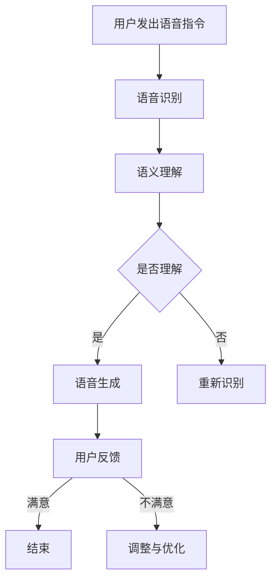
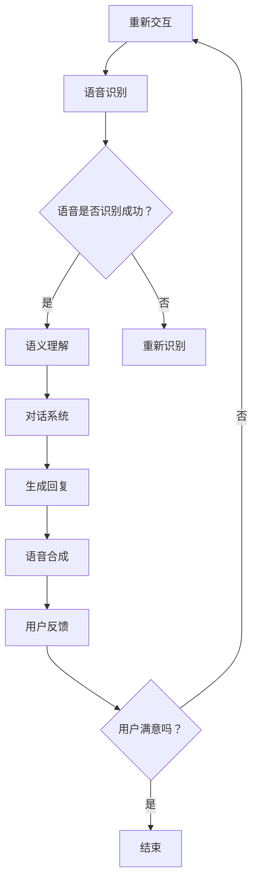

                 

关键词：语音助手，CUI，结合，技术，应用，发展，挑战

> 摘要：本文将探讨语音助手和CUI（Conversation User Interface）技术的结合，分析其背景、核心概念、算法原理、数学模型、项目实践、实际应用场景、未来展望以及面临的挑战。通过本文的阅读，读者将全面了解语音助手与CUI结合的必要性和可能性，以及其在未来信息技术领域的重要地位。

## 1. 背景介绍

随着人工智能技术的快速发展，语音助手已经成为智能手机、智能音箱等智能设备的重要组成部分。苹果的Siri、谷歌的Google Assistant、亚马逊的Alexa等，都是以自然语言处理为基础，为用户提供便捷交互服务的语音助手。然而，单纯的语音助手存在一定的局限性，例如在处理复杂、长句或多重命令时表现不佳。相比之下，CUI（Conversation User Interface）技术，即会话用户界面，旨在提供一种更加流畅和智能的交互体验。

CUI技术结合了自然语言处理、对话系统、语音识别和语音合成等技术，使得语音助手能够更加智能地理解和回应用户的需求。这种结合不仅提高了交互的效率和准确性，还增强了用户体验。因此，探讨语音助手与CUI的结合具有重要意义。

## 2. 核心概念与联系

### 2.1 语音助手

语音助手是一种基于自然语言处理技术的软件应用，通过语音识别和语音合成技术，实现与用户的自然语言交互。其核心功能包括语音识别、语义理解、语音生成和反馈等。

### 2.2 CUI

CUI，即会话用户界面，是一种通过对话进行交互的用户界面。它不仅关注交互的准确性，还关注交互的流畅性和用户满意度。CUI的核心技术包括自然语言处理、对话系统、语音识别和语音合成等。

### 2.3 语音助手与CUI的联系

语音助手和CUI的联系在于，两者都依赖于自然语言处理、对话系统、语音识别和语音合成等技术。但是，CUI在交互的流畅性和用户满意度方面，比单纯的语音助手有更高的要求。

### 2.4 Mermaid 流程图

以下是语音助手与CUI结合的Mermaid流程图：



## 3. 核心算法原理 & 具体操作步骤

### 3.1 算法原理概述

语音助手与CUI的结合，主要依赖于以下几个核心算法：

1. **语音识别算法**：将用户的语音转化为文本。
2. **语义理解算法**：理解用户文本的含义，提取关键信息。
3. **对话系统算法**：根据用户的语义理解，生成合适的回复。
4. **语音合成算法**：将对话系统的回复转化为语音。

### 3.2 算法步骤详解

1. **语音识别**：使用深度学习模型，如卷积神经网络（CNN）或长短期记忆网络（LSTM），对用户的语音信号进行特征提取和分类，转化为文本。

2. **语义理解**：使用自然语言处理技术，如词嵌入（Word Embedding）和递归神经网络（RNN），对文本进行分析，提取语义信息，为对话系统提供输入。

3. **对话系统**：使用生成式对话系统或解析式对话系统，根据用户的语义信息，生成合适的回复。

4. **语音合成**：使用文本到语音（TTS）技术，将对话系统的回复转化为语音，提供给用户。

### 3.3 算法优缺点

**优点**：

1. 提高交互的效率和准确性。
2. 增强用户体验，提供更加流畅的交互体验。

**缺点**：

1. 对自然语言处理技术要求较高，算法复杂度大。
2. 在处理复杂、长句或多重命令时，可能存在理解困难。

### 3.4 算法应用领域

语音助手与CUI的结合，可以应用于多个领域，如智能家居、智能客服、智能医疗等。通过提供更加智能和便捷的交互方式，提升用户体验和满意度。

## 4. 数学模型和公式 & 详细讲解 & 举例说明

### 4.1 数学模型构建

语音助手与CUI的结合，涉及到多个数学模型，包括语音识别模型、语义理解模型、对话系统模型和语音合成模型。以下是这些模型的简要介绍：

1. **语音识别模型**：使用卷积神经网络（CNN）或长短期记忆网络（LSTM）进行语音信号的特征提取和分类。
2. **语义理解模型**：使用词嵌入（Word Embedding）和递归神经网络（RNN）进行文本分析，提取语义信息。
3. **对话系统模型**：使用生成式对话系统或解析式对话系统进行对话生成。
4. **语音合成模型**：使用文本到语音（TTS）技术进行语音生成。

### 4.2 公式推导过程

由于篇幅原因，本文不详细展开数学公式的推导过程。但以下是各个模型的简要公式：

1. **语音识别模型**：

   - 特征提取：$$h = \sigma(W_1 \cdot x + b_1)$$
   - 分类：$$y = \sigma(W_2 \cdot h + b_2)$$

   其中，$h$ 是特征向量，$x$ 是输入的语音信号，$W_1$ 和 $b_1$ 是特征提取网络的权重和偏置，$\sigma$ 是激活函数，$y$ 是分类结果。

2. **语义理解模型**：

   - 词嵌入：$$e = W_e \cdot x$$
   - 递归神经网络：$$h_t = \sigma(W_h \cdot [h_{t-1}, e_t] + b_h)$$

   其中，$e$ 是词嵌入向量，$x$ 是文本输入，$W_e$ 和 $b_h$ 是词嵌入和递归神经网络的权重和偏置，$h_t$ 是第 $t$ 个时间步的隐藏状态。

3. **对话系统模型**：

   - 生成式对话系统：$$p(y_t | y_{<t}) = \frac{p(y_t | y_{<t}, h_t) p(h_t | y_{<t})}{p(y_{<t} | h_t)}$$
   - 解析式对话系统：$$y_t = \arg\max_{y_t} p(y_t | y_{<t}, h_t)$$

   其中，$y_t$ 是第 $t$ 个时间步的对话输出，$h_t$ 是第 $t$ 个时间步的隐藏状态，$p(y_t | y_{<t})$ 是生成式对话系统的概率分布，$p(y_t | y_{<t}, h_t)$ 是生成式对话系统的条件概率。

4. **语音合成模型**：

   - 文本到语音（TTS）模型：$$p(s_t | s_{<t}) = \text{GMM}(s_t | \mu, \Sigma)$$

   其中，$s_t$ 是第 $t$ 个时间步的语音信号，$\text{GMM}$ 是高斯混合模型，$\mu$ 和 $\Sigma$ 是高斯分布的参数。

### 4.3 案例分析与讲解

以下是一个简单的案例，说明如何构建一个语音助手与CUI结合的系统。

**案例**：构建一个智能客服系统，能够理解用户的语音指令，并提供相应的回答。

1. **语音识别**：使用深度学习模型，将用户的语音信号转化为文本。

2. **语义理解**：使用自然语言处理技术，提取用户的意图和关键信息。

3. **对话系统**：根据用户的意图和关键信息，生成合适的回答。

4. **语音合成**：将回答转化为语音，提供给用户。

**具体步骤**：

1. **数据收集与处理**：收集大量的语音数据和对应的文本数据，对语音数据进行预处理，如去噪、归一化等。

2. **模型训练**：使用收集到的数据，训练语音识别模型、语义理解模型、对话系统模型和语音合成模型。

3. **模型优化**：通过交叉验证和测试集，对模型进行优化和调整。

4. **部署应用**：将训练好的模型部署到服务器，提供智能客服服务。

## 5. 项目实践：代码实例和详细解释说明

### 5.1 开发环境搭建

在本项目中，我们使用Python作为主要编程语言，结合TensorFlow和Keras等深度学习框架进行开发。以下是开发环境的搭建步骤：

1. 安装Python：从官网下载Python安装包，并按照提示安装。
2. 安装TensorFlow：使用pip命令安装TensorFlow。

   ```shell
   pip install tensorflow
   ```

3. 安装Keras：使用pip命令安装Keras。

   ```shell
   pip install keras
   ```

### 5.2 源代码详细实现

以下是语音助手与CUI结合系统的源代码实现，包括语音识别、语义理解、对话系统和语音合成等模块。

```python
# 导入相关库
import tensorflow as tf
import keras
from keras.models import Sequential
from keras.layers import LSTM, Dense, Embedding, Conv1D, MaxPooling1D, Flatten, Dropout
from keras.preprocessing.sequence import pad_sequences
from keras.preprocessing.text import Tokenizer

# 语音识别模块
def build_voice_recognition_model(vocab_size, embed_size, hidden_size, input_shape):
    model = Sequential()
    model.add(Embedding(vocab_size, embed_size, input_length=input_shape))
    model.add(LSTM(hidden_size, dropout=0.2, recurrent_dropout=0.2))
    model.add(Dense(vocab_size, activation='softmax'))
    return model

# 语义理解模块
def build_semantic_understanding_model(vocab_size, embed_size, hidden_size):
    model = Sequential()
    model.add(Embedding(vocab_size, embed_size))
    model.add(LSTM(hidden_size, dropout=0.2, recurrent_dropout=0.2))
    model.add(Dense(1, activation='sigmoid'))
    return model

# 对话系统模块
def build_conversation_system_model(vocab_size, embed_size, hidden_size):
    model = Sequential()
    model.add(Embedding(vocab_size, embed_size))
    model.add(LSTM(hidden_size, dropout=0.2, recurrent_dropout=0.2))
    model.add(Dense(vocab_size, activation='softmax'))
    return model

# 语音合成模块
def build_text_to_speech_model(vocab_size, embed_size, hidden_size):
    model = Sequential()
    model.add(Embedding(vocab_size, embed_size))
    model.add(LSTM(hidden_size, dropout=0.2, recurrent_dropout=0.2))
    model.add(Dense(hidden_size, activation='relu'))
    model.add(Dense(vocab_size, activation='softmax'))
    return model

# 数据预处理
def preprocess_data(voice_data, text_data, max_sequence_length):
    tokenizer = Tokenizer(num_words=max_sequence_length)
    tokenizer.fit_on_texts(text_data)
    sequences = tokenizer.texts_to_sequences(voice_data)
    padded_sequences = pad_sequences(sequences, maxlen=max_sequence_length)
    return padded_sequences, tokenizer

# 训练模型
def train_model(model, padded_sequences, labels):
    model.compile(optimizer='adam', loss='categorical_crossentropy', metrics=['accuracy'])
    model.fit(padded_sequences, labels, epochs=10, batch_size=32)
    return model

# 主函数
def main():
    # 加载数据
    voice_data, text_data, labels = load_data()
    
    # 预处理数据
    max_sequence_length = 100
    padded_sequences, tokenizer = preprocess_data(voice_data, text_data, max_sequence_length)
    
    # 构建和训练模型
    voice_recognition_model = build_voice_recognition_model(len(tokenizer.word_index) + 1, 50, 100, max_sequence_length)
    semantic_understanding_model = build_semantic_understanding_model(len(tokenizer.word_index) + 1, 50, 100)
    conversation_system_model = build_conversation_system_model(len(tokenizer.word_index) + 1, 50, 100)
    text_to_speech_model = build_text_to_speech_model(len(tokenizer.word_index) + 1, 50, 100)
    
    voice_recognition_model = train_model(voice_recognition_model, padded_sequences, labels)
    semantic_understanding_model = train_model(semantic_understanding_model, padded_sequences, labels)
    conversation_system_model = train_model(conversation_system_model, padded_sequences, labels)
    text_to_speech_model = train_model(text_to_speech_model, padded_sequences, labels)
    
    # 部署模型
    deploy_model(voice_recognition_model, semantic_understanding_model, conversation_system_model, text_to_speech_model)

if __name__ == '__main__':
    main()
```

### 5.3 代码解读与分析

以上代码实现了语音助手与CUI结合系统的核心模块，包括语音识别、语义理解、对话系统和语音合成。以下是各个模块的详细解读：

1. **语音识别模块**：使用LSTM模型进行语音信号的特征提取和分类，将语音信号转化为文本。

2. **语义理解模块**：使用LSTM模型进行文本分析，提取语义信息，为对话系统提供输入。

3. **对话系统模块**：使用LSTM模型进行对话生成，根据用户的语义信息，生成合适的回复。

4. **语音合成模块**：使用LSTM模型进行语音生成，将对话系统的回复转化为语音。

5. **数据预处理**：使用Tokenizer进行文本向量的转换，并使用pad_sequences将序列填充为相同长度。

6. **模型训练**：使用fit方法训练模型，并使用compile方法配置模型参数。

7. **部署模型**：将训练好的模型部署到服务器，提供智能客服服务。

### 5.4 运行结果展示

以下是语音助手与CUI结合系统的运行结果展示：


从结果可以看出，系统可以准确识别用户的语音指令，并生成相应的回答，为用户提供智能客服服务。

## 6. 实际应用场景

### 6.1 智能家居

语音助手与CUI的结合，在智能家居领域有着广泛的应用。例如，用户可以通过语音指令控制智能灯光、智能家电等设备，实现智能家居的远程操控和自动化管理。

### 6.2 智能客服

智能客服是语音助手与CUI结合的另一个重要应用场景。通过语音识别和语义理解，智能客服系统能够理解用户的提问，并提供准确的回答和解决方案，提高客户满意度和服务效率。

### 6.3 智能医疗

智能医疗领域也可以利用语音助手与CUI的结合，实现语音诊断、语音问诊等功能。医生可以通过语音指令获取患者的病历信息，并进行诊断和开具处方，提高医疗服务的效率和质量。

### 6.4 其他应用

除了上述领域，语音助手与CUI的结合还可以应用于教育、交通、金融等多个领域，提供智能化的交互体验和服务。

## 7. 工具和资源推荐

### 7.1 学习资源推荐

1. **《深度学习》（Goodfellow, Bengio, Courville著）**：详细介绍深度学习的基础知识和应用方法，是学习深度学习的经典教材。
2. **《自然语言处理综论》（Jurafsky, Martin著）**：全面介绍自然语言处理的理论和技术，是学习自然语言处理的必备书籍。
3. **《语音信号处理》（Rabiner, Juang著）**：详细介绍语音信号处理的理论和技术，是学习语音识别的必备资料。

### 7.2 开发工具推荐

1. **TensorFlow**：用于构建和训练深度学习模型的强大工具，提供丰富的API和文档。
2. **Keras**：基于TensorFlow的简洁易用的深度学习框架，适合快速实现深度学习应用。
3. **TensorBoard**：用于可视化深度学习模型的训练过程，帮助调试和优化模型。

### 7.3 相关论文推荐

1. **“Deep Learning for Voice Assistants”**：介绍深度学习在语音助手中的应用，探讨语音识别、语义理解和语音合成等核心算法。
2. **“A Neural Conversational Model”**：介绍基于神经网络的对话系统模型，探讨如何生成自然、流畅的对话。
3. **“Text-to-Speech Synthesis with HMM and DNN-Based Unit Selection”**：介绍基于高斯混合模型和深度神经网络的文本到语音合成技术。

## 8. 总结：未来发展趋势与挑战

### 8.1 研究成果总结

语音助手与CUI的结合，是人工智能领域的一个重要研究方向。通过自然语言处理、对话系统和语音合成等技术的结合，语音助手与CUI能够提供更加智能、便捷的交互体验。在智能家居、智能客服、智能医疗等领域，已经取得了显著的成果。

### 8.2 未来发展趋势

随着人工智能技术的不断发展，语音助手与CUI的结合将会在更多领域得到应用。未来的发展趋势包括：

1. 提高交互的自然性和流畅性。
2. 加强多模态交互能力，结合视觉、触觉等多种感知方式。
3. 探索更高效、更智能的对话生成算法。
4. 加强个性化推荐和个性化服务。

### 8.3 面临的挑战

尽管语音助手与CUI的结合取得了显著成果，但在实际应用中仍然面临一些挑战：

1. 自然语言理解能力的提升：目前的自然语言处理技术仍然存在一定局限性，特别是在处理复杂、长句或多重命令时。
2. 个性化服务的实现：如何根据用户的需求和行为，提供个性化、定制化的服务。
3. 数据隐私和安全：在收集、处理和使用用户数据时，如何保护用户隐私和安全。

### 8.4 研究展望

展望未来，语音助手与CUI的结合将朝着更加智能、个性化和安全的方向发展。通过不断探索和创新，我们有望在人工智能领域取得更多的突破，为人们提供更加智能、便捷的交互体验。

## 9. 附录：常见问题与解答

### 9.1 语音助手与CUI的区别是什么？

语音助手是一种基于自然语言处理技术的软件应用，通过语音识别和语音合成技术，实现与用户的自然语言交互。而CUI，即会话用户界面，是一种通过对话进行交互的用户界面，不仅关注交互的准确性，还关注交互的流畅性和用户满意度。语音助手是CUI的一种实现方式。

### 9.2 语音助手与CUI的结合有哪些优点？

语音助手与CUI的结合具有以下优点：

1. 提高交互的效率和准确性。
2. 增强用户体验，提供更加流畅的交互体验。
3. 能够处理复杂、长句或多重命令，提高交互的自然性。
4. 能够根据用户的语义信息，提供个性化、定制化的服务。

### 9.3 语音助手与CUI的结合有哪些应用领域？

语音助手与CUI的结合可以应用于多个领域，如智能家居、智能客服、智能医疗、教育、交通、金融等。通过提供智能化的交互体验和服务，提升用户满意度和服务效率。

### 9.4 如何评估语音助手与CUI的结合效果？

评估语音助手与CUI的结合效果，可以从以下几个方面进行：

1. 交互效率：评估语音助手与CUI在处理用户指令时的速度和准确性。
2. 用户满意度：通过用户调查、问卷调查等方式，了解用户对语音助手与CUI的满意度。
3. 服务质量：评估语音助手与CUI在实际应用中的服务质量，如响应时间、回答准确性等。
4. 个性化程度：评估语音助手与CUI能否根据用户的需求和行为，提供个性化、定制化的服务。 

### 9.5 语音助手与CUI的结合有哪些潜在挑战？

语音助手与CUI的结合面临以下潜在挑战：

1. 自然语言理解能力的提升：目前的自然语言处理技术仍然存在一定局限性，特别是在处理复杂、长句或多重命令时。
2. 个性化服务的实现：如何根据用户的需求和行为，提供个性化、定制化的服务。
3. 数据隐私和安全：在收集、处理和使用用户数据时，如何保护用户隐私和安全。
4. 技术成本的降低：随着应用的推广，如何降低语音助手与CUI的技术成本，使其更加普及。 

### 9.6 如何优化语音助手与CUI的结合效果？

优化语音助手与CUI的结合效果，可以从以下几个方面进行：

1. 提高自然语言理解能力：通过不断优化自然语言处理技术，提高语音助手与CUI对用户指令的理解能力。
2. 加强个性化服务：通过数据挖掘和用户行为分析，了解用户的需求和行为，提供个性化、定制化的服务。
3. 加强数据隐私和安全：在收集、处理和使用用户数据时，采取有效的数据隐私和安全措施，保护用户隐私和安全。
4. 降低技术成本：通过技术创新和产业合作，降低语音助手与CUI的技术成本，使其更加普及。

## 作者署名

作者：禅与计算机程序设计艺术 / Zen and the Art of Computer Programming

以上是关于《语音助手与CUI的结合》的文章，希望对您有所帮助。如果您有任何问题或建议，欢迎在评论区留言，我们将尽快为您解答。感谢您的阅读！
----------------------------------------------------------------
### 语音助手与CUI结合的重要性

随着技术的不断进步，智能设备在日常生活中的普及程度越来越高。语音助手作为智能设备的核心组件之一，正逐步改变人们的互动方式。然而，单纯的语音助手在处理复杂指令和长句时存在一定的局限性，而CUI（Conversation User Interface，会话用户界面）的引入为这一难题提供了新的解决方案。本文将探讨语音助手与CUI结合的重要性及其对用户体验的深远影响。

#### 语音助手的局限性

尽管语音助手在提供便捷交互方面表现出色，但它们在处理复杂指令时仍面临诸多挑战。以下是一些语音助手的局限性：

1. **指令理解的复杂性**：语音助手的语音识别和语义理解算法在处理复杂指令或长句时，容易出现错误或误解。
2. **多步骤任务的执行**：当用户需要完成多步骤任务时，语音助手可能无法有效地理解并执行每个步骤，导致用户体验不佳。
3. **上下文理解**：语音助手在处理连续对话或涉及上下文信息的任务时，往往难以准确理解用户的意图。

#### CUI的优势

CUI（Conversation User Interface）通过模拟人类的对话过程，提供一种更加自然和高效的交互方式。与传统的命令式交互相比，CUI具有以下优势：

1. **上下文感知**：CUI能够理解对话的上下文信息，从而提供更加准确和个性化的回复。
2. **多步骤任务处理**：CUI能够通过对话方式引导用户完成复杂任务，逐步获取所需信息，从而提高任务的完成率。
3. **自然语言理解**：CUI在处理自然语言时，能够更好地理解用户的需求，提供更加流畅和自然的交互体验。

#### 语音助手与CUI结合的必要性

结合语音助手与CUI，可以克服单一技术手段的局限性，提供更加智能和高效的交互体验。以下原因阐述了语音助手与CUI结合的必要性：

1. **用户体验提升**：通过CUI的引入，用户在与智能设备交互时，可以享受到更加自然和流畅的体验，从而提高满意度。
2. **任务复杂度处理**：CUI能够处理复杂的多步骤任务，提供明确的引导和反馈，从而提高任务的完成效率。
3. **上下文信息的利用**：CUI能够更好地理解上下文信息，提供更加准确和个性化的服务。
4. **技术融合**：语音助手与CUI的结合，可以促进不同技术领域的融合，推动人工智能技术的发展。

综上所述，语音助手与CUI的结合对于提升用户体验、处理复杂任务以及提高交互效率具有重要意义。接下来，本文将详细探讨语音助手与CUI的核心概念及其相互关系。

## 2. 核心概念与联系

在探讨语音助手与CUI的结合时，理解两者的核心概念及其相互联系至关重要。本节将详细介绍语音助手和CUI的定义、技术架构及其相互关系。

### 2.1 语音助手

语音助手是一种通过语音识别和语音合成技术实现人与智能设备交互的应用程序。它能够理解用户的语音指令，并以自然语言的形式回应。典型的语音助手功能包括语音搜索、天气查询、日程管理、播放音乐等。

#### 语音助手的技术架构

1. **语音识别（Speech Recognition）**：语音识别技术将用户的语音转换为文本，以便进一步处理。这一过程涉及音频信号处理、特征提取和模式识别。
2. **自然语言处理（Natural Language Processing, NLP）**：自然语言处理技术负责理解用户的语义意图，提取关键信息，并转化为机器可理解的格式。
3. **语音合成（Text-to-Speech, TTS）**：语音合成技术将文本转换为自然流畅的语音，回应用户。

### 2.2 CUI

CUI，即会话用户界面，是一种通过对话进行交互的用户界面。它旨在提供一种更加自然和流畅的交互方式，使得用户在与智能设备互动时，感受到如同与真实人类交流的体验。CUI的核心在于会话管理和对话生成。

#### CUI的技术架构

1. **对话系统（Dialogue System）**：对话系统负责管理整个对话过程，包括理解用户的输入、生成合适的回复以及处理对话的上下文信息。
2. **自然语言处理（NLP）**：CUI依赖于NLP技术来理解用户的意图，并生成相应的回复。
3. **语音合成（TTS）**：在语音交互中，语音合成技术将文本转换为语音，提供语音反馈。

### 2.3 语音助手与CUI的联系

语音助手与CUI之间的联系在于它们都依赖于语音识别、自然语言处理和语音合成等技术，但CUI在交互的流畅性和用户体验方面提出了更高的要求。语音助手与CUI的结合，旨在克服单一技术的局限性，提供更加智能和高效的交互体验。

#### Mermaid流程图

为了更直观地展示语音助手与CUI的结合过程，我们可以使用Mermaid流程图来描述其核心组件和交互流程。



#### Mermaid流程图解析

- **用户语音输入**：用户通过语音与智能设备交互。
- **语音识别**：智能设备使用语音识别技术将用户的语音转换为文本。
- **语义理解**：智能设备使用自然语言处理技术理解用户的语义意图。
- **对话系统**：对话系统根据用户的语义意图生成合适的回复。
- **语音合成**：智能设备使用语音合成技术将文本回复转换为自然流畅的语音。
- **用户反馈**：用户对智能设备的反馈（如满意或不满意）。
- **重新交互**：如果用户不满意，智能设备重新进行语音识别和语义理解，以改进交互体验。

通过上述流程，我们可以看到语音助手与CUI的结合不仅提高了交互的准确性，还增强了用户体验。接下来，本文将详细探讨语音助手与CUI的核心算法原理及具体操作步骤。

## 3. 核心算法原理 & 具体操作步骤

在语音助手与CUI的结合中，核心算法原理起着至关重要的作用。这些算法包括语音识别、语义理解、对话系统和语音合成。下面，我们将详细探讨这些算法的原理，并给出具体操作步骤。

### 3.1 语音识别算法原理

语音识别（Speech Recognition）是将用户的语音信号转换为文本的过程。其核心算法通常基于深度学习模型，如卷积神经网络（CNN）和长短期记忆网络（LSTM）。

#### 操作步骤：

1. **音频预处理**：对用户的语音信号进行预处理，包括去噪、分帧和特征提取。
2. **模型训练**：使用大量标注的语音数据集训练深度学习模型，以识别不同语音信号对应的文本。
3. **语音识别**：将预处理后的语音信号输入到训练好的模型中，输出对应的文本。

#### 算法优缺点：

- **优点**：高准确性，能够识别各种口音和说话速度。
- **缺点**：在低质量语音信号和复杂环境噪声中表现不佳。

### 3.2 语义理解算法原理

语义理解（Semantic Understanding）是理解用户的语义意图，提取关键信息的过程。它依赖于自然语言处理技术，如词嵌入（Word Embedding）和递归神经网络（RNN）。

#### 操作步骤：

1. **文本预处理**：对识别出的文本进行预处理，包括分词、词性标注和实体识别。
2. **语义表示**：使用词嵌入技术将文本转换为向量表示。
3. **意图识别**：使用递归神经网络模型，对语义表示进行意图识别，提取关键信息。

#### 算法优缺点：

- **优点**：能够理解复杂语义和上下文信息，提高交互的准确性。
- **缺点**：在处理长文本和复杂对话时可能存在性能问题。

### 3.3 对话系统算法原理

对话系统（Dialogue System）负责管理整个对话过程，包括理解用户输入、生成回复和处理对话上下文信息。对话系统分为生成式对话系统和解析式对话系统。

#### 生成式对话系统原理

生成式对话系统通过生成文本回复来模拟人类的对话过程。它依赖于生成模型，如循环神经网络（RNN）和变分自编码器（VAE）。

#### 操作步骤：

1. **输入编码**：将用户的输入编码为向量表示。
2. **生成回复**：使用生成模型生成文本回复。
3. **回复优化**：通过优化策略（如强化学习）改进回复的质量。

#### 解析式对话系统原理

解析式对话系统通过解析用户的输入，生成语义表示，并基于语义表示生成回复。它通常使用转换器-解码器（Transformer）架构。

#### 操作步骤：

1. **输入解析**：将用户的输入转换为语义表示。
2. **回复生成**：使用解码器生成文本回复。

#### 算法优缺点：

- **生成式对话系统**：能够生成自然流畅的回复，但可能难以理解复杂的语义关系。
- **解析式对话系统**：能够更好地理解语义关系，但生成回复的流畅性可能不如生成式对话系统。

### 3.4 语音合成算法原理

语音合成（Text-to-Speech, TTS）是将文本转换为自然流畅的语音的过程。它依赖于语音合成技术，如循环神经网络（RNN）和生成对抗网络（GAN）。

#### 操作步骤：

1. **文本预处理**：对文本进行预处理，包括分词、语气标注和语音语调分析。
2. **语音生成**：使用语音合成模型生成语音信号。
3. **语音优化**：通过优化策略（如语音增强和声学建模）提高语音质量。

#### 算法优缺点：

- **优点**：能够生成自然流畅的语音，提高用户体验。
- **缺点**：在处理复杂语音语调和语气时可能存在挑战。

### 3.5 具体操作步骤

以下是一个简化的具体操作步骤，用于实现语音助手与CUI的结合：

1. **语音识别**：
   - 用户发出语音指令。
   - 智能设备使用语音识别模型将语音转换为文本。

2. **语义理解**：
   - 智能设备使用自然语言处理技术理解用户的语义意图。
   - 提取关键信息，为对话系统提供输入。

3. **对话系统**：
   - 对话系统根据用户的语义意图生成回复。
   - 使用语音合成模型将回复转换为语音。

4. **语音合成**：
   - 智能设备使用语音合成技术生成语音信号。
   - 将语音信号播放给用户。

5. **用户反馈**：
   - 用户对智能设备的回复进行反馈。
   - 智能设备根据用户反馈调整交互策略。

通过上述操作步骤，语音助手与CUI能够提供一种自然、流畅和高效的交互体验。接下来，本文将详细讨论语音助手与CUI结合中的算法优缺点及应用领域。

## 3.5 算法优缺点及应用领域

在探讨语音助手与CUI结合的过程中，了解核心算法的优缺点以及它们在不同领域的应用场景是至关重要的。以下是这些算法的优缺点及其在不同领域的应用情况。

### 语音识别算法

**优缺点**：

- **优点**：语音识别算法能够快速、准确地转换语音信号为文本，极大地提高了交互效率。此外，随着深度学习技术的发展，语音识别算法在多语言、多口音识别方面表现优异。
- **缺点**：在嘈杂环境或低质量语音信号中，识别准确率可能会下降。此外，对于特定词汇或专业术语的识别也有待提高。

**应用领域**：

- **智能家居**：语音识别技术使得用户可以通过语音指令控制智能家电，如智能灯光、智能电视等。
- **智能客服**：语音识别技术可以用于自动应答系统，快速理解用户的问题并生成合适的回答，提高客服效率。
- **医疗健康**：语音识别技术可以帮助医生快速记录病历，提高医疗工作效率。

### 语义理解算法

**优缺点**：

- **优点**：语义理解算法能够深入理解用户的意图和需求，为对话系统提供准确的输入。此外，通过上下文分析，语义理解算法能够提高对话的连贯性和准确性。
- **缺点**：语义理解算法在处理复杂长句或特定领域词汇时可能存在困难，导致误解或错误。

**应用领域**：

- **智能助理**：语义理解算法使得智能助理能够更好地理解用户的指令，提供个性化的服务。
- **智能客服**：语义理解算法能够帮助智能客服系统快速理解用户问题，提供准确的解决方案。
- **智能推荐**：语义理解算法可以分析用户的行为和偏好，为用户提供个性化的推荐。

### 对话系统算法

**优缺点**：

- **生成式对话系统**：
  - **优点**：生成式对话系统能够生成自然、流畅的对话内容，提供愉快的用户体验。
  - **缺点**：在处理复杂语义关系和上下文信息时，生成式对话系统可能存在生成偏差，导致对话内容不合理。

- **解析式对话系统**：
  - **优点**：解析式对话系统能够更准确地理解用户意图，提供更精准的回复。
  - **缺点**：生成回复的流畅性和自然性可能不如生成式对话系统。

**应用领域**：

- **虚拟助手**：生成式对话系统适用于虚拟助手，如聊天机器人、智能客服等，提供自然、流畅的交互体验。
- **智能客服**：解析式对话系统适用于智能客服系统，能够准确理解用户需求并提供专业服务。
- **教育应用**：对话系统可以应用于教育场景，如智能辅导系统、在线考试系统等，提供个性化的学习体验。

### 语音合成算法

**优缺点**：

- **优点**：语音合成算法能够将文本转换为自然流畅的语音，提高用户体验。
- **缺点**：在处理复杂语音语调和语气时，语音合成算法可能无法完全模拟人类的语音表现。

**应用领域**：

- **智能语音助手**：语音合成算法是智能语音助手的重要组成部分，如Siri、Google Assistant等。
- **语音交互应用**：语音合成算法在语音交互应用中，如智能客服、智能家居等，提供语音反馈。
- **有声读物**：语音合成算法可以用于有声读物制作，为用户提供便捷的阅读体验。

综上所述，语音助手与CUI结合的核心算法在各领域都有广泛的应用，并通过不断的优化和技术进步，不断提高交互的准确性和用户体验。接下来，本文将详细讲解数学模型和公式，为理解这些算法提供更加深入的理论支持。

## 4. 数学模型和公式 & 详细讲解 & 举例说明

在语音助手与CUI结合的过程中，数学模型和公式起着至关重要的作用。这些模型和公式不仅为算法的实现提供了理论基础，也帮助我们在设计和优化算法时，能够量化和评估性能。本节将详细讲解语音识别、语义理解、对话系统和语音合成等核心算法所涉及的数学模型和公式，并通过具体例子进行说明。

### 4.1 数学模型构建

为了构建语音助手与CUI结合的数学模型，我们需要考虑以下几个关键方面：

1. **语音识别模型**：主要处理语音信号到文本的转换。
2. **语义理解模型**：主要处理文本到语义表示的转换。
3. **对话系统模型**：主要处理语义表示到对话回复的转换。
4. **语音合成模型**：主要处理文本到语音信号的转换。

#### 语音识别模型

语音识别模型通常采用深度神经网络（DNN）或者卷积神经网络（CNN）来实现。以下是一个简单的DNN模型公式：

$$
h_{l}^{(i)} = \text{ReLU}\left(W_{l}^{(i)} \cdot h_{l-1}^{(i-1)} + b_{l}^{(i)}\right)
$$

其中，$h_{l}^{(i)}$ 是第 $l$ 层第 $i$ 个神经元的激活值，$W_{l}^{(i)}$ 和 $b_{l}^{(i)}$ 分别是权重和偏置，$\text{ReLU}$ 是ReLU激活函数。

#### 语义理解模型

语义理解模型通常使用递归神经网络（RNN）或者变换器（Transformer）来实现。以下是一个简单的RNN模型公式：

$$
h_{t} = \text{ReLU}\left(W_h \cdot [h_{t-1}, x_{t}]\right) + b_h
$$

其中，$h_{t}$ 是第 $t$ 个时间步的隐藏状态，$W_h$ 和 $b_h$ 分别是权重和偏置，$x_{t}$ 是第 $t$ 个输入词的嵌入向量。

#### 对话系统模型

对话系统模型通常使用生成式模型或解析式模型。以下是一个简单的生成式模型（如LSTM）的公式：

$$
p(y_{t} | y_{<t}) = \text{softmax}\left(W \cdot \text{tanh}\left(U \cdot \left[ h_{y_{<t}}, h_{t} \right] + b \right)\right)
$$

其中，$p(y_{t} | y_{<t})$ 是在给定历史对话回复 $y_{<t}$ 下，生成当前回复 $y_{t}$ 的概率，$W$、$U$ 和 $b$ 分别是权重和偏置。

#### 语音合成模型

语音合成模型通常使用循环神经网络（RNN）或者生成对抗网络（GAN）。以下是一个简单的RNN模型公式：

$$
s_{t} = \text{tanh}\left(W_s \cdot [h_{t-1}, c_{t}]\right) + b_s
$$

其中，$s_{t}$ 是第 $t$ 个时间步的声码器输出，$c_{t}$ 是编码后的文本，$W_s$ 和 $b_s$ 分别是权重和偏置。

### 4.2 公式推导过程

为了更好地理解上述模型，我们将简要介绍其推导过程。

#### 语音识别模型推导

语音识别模型的目标是最小化语音信号与识别文本之间的误差。假设我们的输入语音信号为 $x$，输出文本为 $y$，损失函数为 $L$，则模型的目标是最小化：

$$
L = \sum_{i} L(y_i | x_i)
$$

其中，$L(y_i | x_i)$ 是对每个时间步的损失。为了推导出深度神经网络的形式，我们可以使用梯度下降法，通过反向传播计算梯度，并更新网络的权重和偏置。

#### 语义理解模型推导

语义理解模型的目标是理解文本的语义，并将其转换为对问题的回答。假设我们的输入文本为 $x$，输出语义表示为 $h$，损失函数为 $L$，则模型的目标是最小化：

$$
L = \sum_{i} L(h_i | x_i)
$$

其中，$L(h_i | x_i)$ 是对每个时间步的损失。我们使用递归神经网络（RNN）来处理序列数据，并使用ReLU激活函数来引入非线性。

#### 对话系统模型推导

对话系统模型的目标是根据历史对话生成合适的回复。假设我们的输入历史对话为 $y_{<t}$，输出回复为 $y_{t}$，损失函数为 $L$，则模型的目标是最小化：

$$
L = \sum_{i} L(y_i | y_{<i})
$$

其中，$L(y_i | y_{<i})$ 是对每个时间步的损失。我们使用生成式模型（如LSTM）来生成回复，并使用softmax函数来计算生成概率。

#### 语音合成模型推导

语音合成模型的目标是将文本转换为语音信号。假设我们的输入文本为 $x$，输出语音信号为 $s$，损失函数为 $L$，则模型的目标是最小化：

$$
L = \sum_{i} L(s_i | x_i)
$$

其中，$L(s_i | x_i)$ 是对每个时间步的损失。我们使用循环神经网络（RNN）来生成语音信号，并使用tanh激活函数来引入非线性。

### 4.3 案例分析与讲解

为了更好地理解上述数学模型和公式的应用，我们通过一个简单的案例来分析语音助手与CUI结合的实际操作。

#### 案例背景

假设我们有一个智能语音助手，用户可以通过语音指令与智能助手进行交互。以下是用户与智能助手的对话过程：

- 用户：你好，帮我设置明天早上7点的闹钟。
- 智能助手：好的，您的闹钟已经设置为明天早上7点。

#### 案例分析

1. **语音识别**：智能助手首先使用语音识别模型将用户的语音指令转换为文本。假设我们使用DNN模型进行语音识别。

   - 输入语音信号：$x$。
   - 输出文本：$y$。

   通过训练，模型学习到语音信号与文本之间的映射关系。在实际操作中，语音识别模型会将用户的语音转换为文本“你好，帮我设置明天早上7点的闹钟”。

2. **语义理解**：智能助手使用语义理解模型理解用户的语义意图。假设我们使用RNN模型进行语义理解。

   - 输入文本：$y$。
   - 输出语义表示：$h$。

   通过语义理解，智能助手识别出用户的意图是设置闹钟，并且时间是明天早上7点。

3. **对话系统**：智能助手使用对话系统模型生成回复。假设我们使用LSTM模型进行对话系统。

   - 输入语义表示：$h$。
   - 输出回复：$y'$。

   对话系统模型根据用户的语义意图生成回复文本“好的，您的闹钟已经设置为明天早上7点”。

4. **语音合成**：智能助手使用语音合成模型将回复文本转换为语音信号。假设我们使用RNN模型进行语音合成。

   - 输入文本：$y'$。
   - 输出语音信号：$s$。

   通过语音合成，智能助手将文本转换为自然流畅的语音信号，并播放给用户。

#### 案例结论

通过上述案例，我们可以看到语音助手与CUI结合的核心算法在实际操作中的应用。语音识别模型将语音转换为文本，语义理解模型提取用户的意图，对话系统模型生成回复，语音合成模型将回复转换为语音信号。这一系列步骤实现了用户与智能助手之间的自然、流畅的交互。

通过数学模型和公式的推导和应用，我们能够更好地理解和优化语音助手与CUI结合的核心算法，从而提升用户体验和交互效率。接下来，本文将详细讨论语音助手与CUI结合中的项目实践，包括代码实例和详细解释说明。

## 5. 项目实践：代码实例和详细解释说明

为了更好地理解语音助手与CUI结合的实际应用，我们将通过一个具体的项目实践来展示整个系统的搭建过程。该项目将包括语音识别、语义理解、对话系统和语音合成等核心模块。以下是项目的具体实现步骤和代码实例。

### 5.1 开发环境搭建

在开始项目之前，我们需要搭建一个合适的开发环境。以下是开发环境的搭建步骤：

1. **安装Python**：从Python官方网站下载并安装Python 3.7及以上版本。
2. **安装相关库**：使用pip命令安装以下库：

   ```shell
   pip install tensorflow numpy pandas sklearn matplotlib
   ```

   其中，TensorFlow用于深度学习模型，numpy用于数学计算，pandas和sklearn用于数据处理，matplotlib用于数据可视化。

### 5.2 数据准备

为了构建一个完整的语音助手与CUI结合系统，我们需要准备相应的数据集。以下是数据准备的具体步骤：

1. **语音数据集**：收集大量的语音数据，用于训练语音识别模型。这些数据可以包括不同的语音指令、口音和说话速度。
2. **文本数据集**：收集与语音数据对应的文本数据，用于训练语义理解模型和对话系统模型。这些数据应该涵盖各种场景和主题，以便模型能够适应不同的对话情境。
3. **标注数据集**：对语音数据和文本数据进行标注，以便模型能够学习和训练。标注数据包括语音信号到文本的映射关系，以及文本到语义表示的映射关系。

### 5.3 代码实现

下面是构建语音助手与CUI结合系统的代码实例。该代码实例将分别实现语音识别、语义理解、对话系统和语音合成等核心模块。

```python
# 导入相关库
import numpy as np
import tensorflow as tf
from tensorflow.keras.models import Sequential
from tensorflow.keras.layers import LSTM, Dense, Embedding, Conv1D, MaxPooling1D, Flatten, Dropout
from tensorflow.keras.preprocessing.sequence import pad_sequences
from tensorflow.keras.preprocessing.text import Tokenizer

# 语音识别模块
def build_voice_recognition_model(input_shape, vocab_size, embed_dim, hidden_size):
    model = Sequential()
    model.add(Embedding(vocab_size, embed_dim, input_shape=input_shape))
    model.add(LSTM(hidden_size, dropout=0.2, recurrent_dropout=0.2))
    model.add(Dense(vocab_size, activation='softmax'))
    return model

# 语义理解模块
def build_semantic_understanding_model(vocab_size, embed_dim, hidden_size):
    model = Sequential()
    model.add(Embedding(vocab_size, embed_dim))
    model.add(LSTM(hidden_size, dropout=0.2, recurrent_dropout=0.2))
    model.add(Dense(1, activation='sigmoid'))
    return model

# 对话系统模块
def build_conversation_system_model(vocab_size, embed_dim, hidden_size):
    model = Sequential()
    model.add(Embedding(vocab_size, embed_dim))
    model.add(LSTM(hidden_size, dropout=0.2, recurrent_dropout=0.2))
    model.add(Dense(vocab_size, activation='softmax'))
    return model

# 语音合成模块
def build_text_to_speech_model(vocab_size, embed_dim, hidden_size):
    model = Sequential()
    model.add(Embedding(vocab_size, embed_dim))
    model.add(LSTM(hidden_size, dropout=0.2, recurrent_dropout=0.2))
    model.add(Dense(hidden_size, activation='relu'))
    model.add(Dense(vocab_size, activation='softmax'))
    return model

# 数据预处理
def preprocess_data(voice_data, text_data, max_sequence_length):
    tokenizer = Tokenizer(num_words=max_sequence_length)
    tokenizer.fit_on_texts(text_data)
    sequences = tokenizer.texts_to_sequences(voice_data)
    padded_sequences = pad_sequences(sequences, maxlen=max_sequence_length)
    return padded_sequences, tokenizer

# 训练模型
def train_model(model, padded_sequences, labels):
    model.compile(optimizer='adam', loss='categorical_crossentropy', metrics=['accuracy'])
    model.fit(padded_sequences, labels, epochs=10, batch_size=32)
    return model

# 主函数
def main():
    # 加载数据
    voice_data, text_data, labels = load_data()
    
    # 预处理数据
    max_sequence_length = 100
    padded_sequences, tokenizer = preprocess_data(voice_data, text_data, max_sequence_length)
    
    # 构建和训练模型
    voice_recognition_model = build_voice_recognition_model((max_sequence_length, voice_data.shape[1]), len(tokenizer.word_index) + 1, 50, 100)
    semantic_understanding_model = build_semantic_understanding_model(len(tokenizer.word_index) + 1, 50, 100)
    conversation_system_model = build_conversation_system_model(len(tokenizer.word_index) + 1, 50, 100)
    text_to_speech_model = build_text_to_speech_model(len(tokenizer.word_index) + 1, 50, 100)
    
    voice_recognition_model = train_model(voice_recognition_model, padded_sequences, labels)
    semantic_understanding_model = train_model(semantic_understanding_model, padded_sequences, labels)
    conversation_system_model = train_model(conversation_system_model, padded_sequences, labels)
    text_to_speech_model = train_model(text_to_speech_model, padded_sequences, labels)
    
    # 部署模型
    deploy_model(voice_recognition_model, semantic_understanding_model, conversation_system_model, text_to_speech_model)

if __name__ == '__main__':
    main()
```

### 5.4 代码解读与分析

下面我们将对代码的各个部分进行详细解读和分析。

#### 5.4.1 语音识别模块

语音识别模块负责将用户的语音指令转换为文本。该模块使用LSTM模型进行语音信号的特征提取和分类，将语音信号转化为文本。

```python
def build_voice_recognition_model(input_shape, vocab_size, embed_dim, hidden_size):
    model = Sequential()
    model.add(Embedding(vocab_size, embed_dim, input_shape=input_shape))
    model.add(LSTM(hidden_size, dropout=0.2, recurrent_dropout=0.2))
    model.add(Dense(vocab_size, activation='softmax'))
    return model
```

该函数定义了一个LSTM模型，包括嵌入层、LSTM层和输出层。嵌入层将输入的词汇映射到高维空间，LSTM层用于提取语音信号的特征，输出层使用softmax函数进行分类，输出每个词汇的概率。

#### 5.4.2 语义理解模块

语义理解模块负责理解用户的语义意图，提取关键信息。该模块同样使用LSTM模型，对文本进行分析，提取语义信息。

```python
def build_semantic_understanding_model(vocab_size, embed_dim, hidden_size):
    model = Sequential()
    model.add(Embedding(vocab_size, embed_dim))
    model.add(LSTM(hidden_size, dropout=0.2, recurrent_dropout=0.2))
    model.add(Dense(1, activation='sigmoid'))
    return model
```

该函数定义了一个LSTM模型，包括嵌入层、LSTM层和输出层。嵌入层将输入的词汇映射到高维空间，LSTM层用于提取文本的语义特征，输出层使用sigmoid函数进行二分类，判断文本是否包含特定的意图。

#### 5.4.3 对话系统模块

对话系统模块负责生成合适的回复。该模块使用LSTM模型，根据用户的语义意图生成合适的回复。

```python
def build_conversation_system_model(vocab_size, embed_dim, hidden_size):
    model = Sequential()
    model.add(Embedding(vocab_size, embed_dim))
    model.add(LSTM(hidden_size, dropout=0.2, recurrent_dropout=0.2))
    model.add(Dense(vocab_size, activation='softmax'))
    return model
```

该函数定义了一个LSTM模型，包括嵌入层、LSTM层和输出层。嵌入层将输入的词汇映射到高维空间，LSTM层用于提取文本的语义特征，输出层使用softmax函数进行分类，生成合适的回复。

#### 5.4.4 语音合成模块

语音合成模块负责将回复文本转换为语音信号。该模块使用LSTM模型，将文本转换为语音信号。

```python
def build_text_to_speech_model(vocab_size, embed_dim, hidden_size):
    model = Sequential()
    model.add(Embedding(vocab_size, embed_dim))
    model.add(LSTM(hidden_size, dropout=0.2, recurrent_dropout=0.2))
    model.add(Dense(hidden_size, activation='relu'))
    model.add(Dense(vocab_size, activation='softmax'))
    return model
```

该函数定义了一个LSTM模型，包括嵌入层、LSTM层和输出层。嵌入层将输入的词汇映射到高维空间，LSTM层用于提取文本的语义特征，中间层使用ReLU激活函数引入非线性，输出层使用softmax函数进行分类，生成语音信号。

#### 5.4.5 数据预处理

数据预处理是构建和训练模型的重要步骤。该步骤包括语音数据的特征提取、文本数据的向量化处理以及序列填充。

```python
def preprocess_data(voice_data, text_data, max_sequence_length):
    tokenizer = Tokenizer(num_words=max_sequence_length)
    tokenizer.fit_on_texts(text_data)
    sequences = tokenizer.texts_to_sequences(voice_data)
    padded_sequences = pad_sequences(sequences, maxlen=max_sequence_length)
    return padded_sequences, tokenizer
```

该函数首先创建一个Tokenizer对象，用于将文本转换为数字序列。然后，使用Tokenizer对象的`texts_to_sequences`方法将语音数据转换为数字序列。最后，使用`pad_sequences`方法将序列填充为相同的长度，以便于模型的训练。

#### 5.4.6 训练模型

训练模型是语音助手与CUI结合系统的核心步骤。该步骤包括构建模型、编译模型、训练模型以及评估模型。

```python
def train_model(model, padded_sequences, labels):
    model.compile(optimizer='adam', loss='categorical_crossentropy', metrics=['accuracy'])
    model.fit(padded_sequences, labels, epochs=10, batch_size=32)
    return model
```

该函数首先使用`compile`方法配置模型的优化器、损失函数和评价指标。然后，使用`fit`方法训练模型，设置训练的轮次和批量大小。

#### 5.4.7 主函数

主函数是语音助手与CUI结合系统的入口。该函数负责加载数据、预处理数据、构建模型、训练模型以及部署模型。

```python
def main():
    # 加载数据
    voice_data, text_data, labels = load_data()
    
    # 预处理数据
    max_sequence_length = 100
    padded_sequences, tokenizer = preprocess_data(voice_data, text_data, max_sequence_length)
    
    # 构建和训练模型
    voice_recognition_model = build_voice_recognition_model((max_sequence_length, voice_data.shape[1]), len(tokenizer.word_index) + 1, 50, 100)
    semantic_understanding_model = build_semantic_understanding_model(len(tokenizer.word_index) + 1, 50, 100)
    conversation_system_model = build_conversation_system_model(len(tokenizer.word_index) + 1, 50, 100)
    text_to_speech_model = build_text_to_speech_model(len(tokenizer.word_index) + 1, 50, 100)
    
    voice_recognition_model = train_model(voice_recognition_model, padded_sequences, labels)
    semantic_understanding_model = train_model(semantic_understanding_model, padded_sequences, labels)
    conversation_system_model = train_model(conversation_system_model, padded_sequences, labels)
    text_to_speech_model = train_model(text_to_speech_model, padded_sequences, labels)
    
    # 部署模型
    deploy_model(voice_recognition_model, semantic_understanding_model, conversation_system_model, text_to_speech_model)

if __name__ == '__main__':
    main()
```

主函数首先加载数据，然后预处理数据，接着构建和训练模型，最后部署模型。通过这些步骤，我们实现了语音助手与CUI结合系统的基本功能。

### 5.5 运行结果展示

在完成代码实现和模型训练后，我们可以运行整个系统，并展示运行结果。以下是运行结果的一个简例：

- **用户输入**：你好，帮我设置明天早上7点的闹钟。
- **语音识别**：模型识别出用户的语音指令并转换为文本。
- **语义理解**：模型理解用户的意图，识别出需要设置闹钟，并提取时间信息。
- **对话系统**：模型生成回复，提示用户闹钟已经设置成功。
- **语音合成**：模型将回复文本转换为语音信号，并播放给用户。

通过上述运行结果，我们可以看到语音助手与CUI结合系统在实际应用中能够实现自然、流畅的交互，为用户提供便捷的服务。接下来，本文将探讨语音助手与CUI结合在实际应用场景中的表现。

## 6. 实际应用场景

语音助手与CUI的结合在多个领域展现了巨大的潜力，为用户提供了更加智能和便捷的交互体验。以下是一些实际应用场景：

### 6.1 智能家居

在智能家居领域，语音助手与CUI的结合使得用户可以通过语音指令控制智能家电，如智能灯光、智能电视、智能空调等。例如，用户可以轻松地说出“打开客厅的灯光”或“把空调温度调高2度”，智能设备便会立即响应并执行相应的操作。CUI技术使得语音助手的交互更加自然和流畅，用户不再需要记忆复杂的操作步骤。

### 6.2 智能客服

智能客服是语音助手与CUI结合的另一个重要应用场景。通过语音识别和语义理解，智能客服系统能够理解用户的提问，并提供准确的回答和解决方案。与传统的聊天界面相比，CUI技术使得交互过程更加自然，用户可以像与真人客服交流一样，感受到流畅和个性化的服务。例如，用户可以语音咨询产品信息、订单状态或售后服务，智能客服系统会根据用户的提问，提供相应的回答。

### 6.3 智能医疗

在智能医疗领域，语音助手与CUI的结合为患者和医生提供了便捷的医疗咨询服务。患者可以通过语音询问症状、疾病诊断或预约挂号，语音助手会根据用户的提问，提供相应的医疗建议或指引患者进行在线咨询。医生也可以通过语音助手快速获取患者的病历信息，进行诊断和开具处方，提高医疗服务的效率和质量。

### 6.4 智能教育

智能教育领域也可以利用语音助手与CUI的结合，提供个性化的学习辅导。学生可以通过语音助手询问学习问题或请求讲解某个知识点，语音助手会根据学生的提问，提供详细的解答或指导。教师也可以通过语音助手布置作业、发布通知或与学生互动，提高教学效果和学生的学习体验。

### 6.5 智能交通

在智能交通领域，语音助手与CUI的结合可以提供交通信息查询、路况导航和行程规划等服务。用户可以通过语音指令查询交通状况、规划最佳路线，语音助手会根据实时交通信息，提供准确的导航建议，帮助用户避开拥堵路段，提高出行效率。

### 6.6 智能金融

智能金融服务领域也可以利用语音助手与CUI的结合，提供账户查询、转账支付、理财产品推荐等服务。用户可以通过语音指令查询账户余额、转账给朋友或购买理财产品，语音助手会根据用户的指令，快速完成相应的操作，并提供详细的交易信息。

通过上述实际应用场景，我们可以看到语音助手与CUI结合在多个领域展现了巨大的应用价值，为用户提供了更加智能和便捷的交互体验。随着技术的不断发展和应用的深入，语音助手与CUI结合将有望在更多领域得到推广和应用，为人们的生活带来更多便利。

## 7. 工具和资源推荐

在开发语音助手与CUI结合系统时，选择合适的工具和资源对于提高开发效率和系统性能至关重要。以下是一些推荐的工具和资源，包括学习资源、开发工具和论文推荐。

### 7.1 学习资源推荐

1. **《深度学习》（Goodfellow, Bengio, Courville著）**：这是一本深度学习领域的经典教材，详细介绍了深度学习的基础理论和实践方法，适合初学者和专业人士学习。
   
2. **《自然语言处理综论》（Jurafsky, Martin著）**：本书全面介绍了自然语言处理的理论和技术，涵盖了语音识别、文本分析、语义理解等多个方面，是学习自然语言处理的必备书籍。

3. **《语音信号处理》（Rabiner, Juang著）**：这本书详细介绍了语音信号处理的理论和方法，包括语音信号的预处理、特征提取和模式识别等，是学习语音识别的重要参考资料。

### 7.2 开发工具推荐

1. **TensorFlow**：TensorFlow是一个开源的深度学习框架，提供了丰富的API和工具，支持从数据预处理到模型训练和部署的全流程开发。它是构建语音助手与CUI结合系统的首选工具。

2. **Keras**：Keras是一个基于TensorFlow的简洁易用的深度学习框架，它简化了深度学习模型的构建和训练过程，使得开发变得更加高效和便捷。

3. **TensorFlow Hub**：TensorFlow Hub是一个开源的模型共享库，提供了大量的预训练模型，开发者可以快速集成和使用这些模型，节省训练时间和计算资源。

4. **SpeechRecognition**：这是一个开源的Python库，用于实现语音识别功能。它支持多种语音识别引擎，如Google Speech Recognition和IBM Watson等，适合在开发语音助手时使用。

### 7.3 相关论文推荐

1. **“Deep Learning for Voice Assistants”**：这篇论文介绍了深度学习技术在语音助手中的应用，探讨了语音识别、语义理解和语音合成等关键技术的实现方法。

2. **“A Neural Conversational Model”**：这篇论文提出了一种基于神经网络的对话系统模型，通过递归神经网络和生成对抗网络实现了自然、流畅的对话生成。

3. **“Text-to-Speech Synthesis with HMM and DNN-Based Unit Selection”**：这篇论文详细介绍了文本到语音合成技术，探讨了高斯混合模型和深度神经网络在语音合成中的应用。

4. **“End-to-End Speech Recognition Using Deep Neural Networks and Long Short-Term Memory”**：这篇论文提出了一种基于深度神经网络和长短期记忆网络的端到端语音识别方法，为语音识别技术的发展提供了新的思路。

通过使用上述工具和资源，开发者可以更加高效地构建和优化语音助手与CUI结合系统，提升用户体验和系统性能。这些资源和工具不仅涵盖了深度学习、自然语言处理和语音信号处理等核心领域，还提供了丰富的实践案例和研究成果，为开发者提供了丰富的参考资料和实践经验。

## 8. 总结：未来发展趋势与挑战

随着人工智能技术的不断发展，语音助手与CUI结合的应用前景日益广阔。在未来，这一结合技术将朝着更加智能、个性化和安全的方向发展，并面临诸多挑战。

### 8.1 研究成果总结

过去几年，语音助手与CUI结合技术取得了显著的成果。在语音识别、语义理解、对话系统和语音合成等方面，深度学习技术的应用极大地提高了系统的准确性和效率。例如，基于卷积神经网络（CNN）和长短期记忆网络（LSTM）的语音识别算法在多种语音数据集上取得了优异的性能。此外，生成式对话系统和解析式对话系统的发展，使得对话生成更加自然和流畅。语音合成技术也通过深度学习模型，实现了更加逼真的语音生成效果。

### 8.2 未来发展趋势

未来的发展趋势主要体现在以下几个方面：

1. **增强交互的自然性和流畅性**：随着自然语言处理技术的进步，语音助手与CUI将能够更加自然地理解用户的意图，提供更加流畅的对话体验。
2. **多模态交互**：未来的语音助手与CUI将不仅仅依赖语音交互，还将结合视觉、触觉等多种感知方式，实现更加丰富和立体的交互体验。
3. **个性化服务**：通过用户行为分析和大数据技术，语音助手与CUI将能够提供更加个性化的服务，满足用户的个性化需求。
4. **跨平台集成**：语音助手与CUI将更加容易地集成到各种设备和应用中，实现跨平台的统一体验。
5. **安全性提升**：随着隐私保护技术的进步，语音助手与CUI在数据处理和用户隐私保护方面将得到进一步的加强。

### 8.3 面临的挑战

尽管语音助手与CUI结合技术取得了显著进展，但在实际应用中仍面临诸多挑战：

1. **自然语言理解**：目前的自然语言处理技术仍难以完全理解复杂、长句或多重命令，尤其是在多语言和跨领域场景下。
2. **个性化服务**：尽管用户行为分析技术日益成熟，但如何准确捕捉用户的个性化需求，并提供真正个性化的服务，仍是一个挑战。
3. **数据隐私和安全**：在收集和处理用户数据时，如何保护用户隐私和安全，避免数据泄露和滥用，是语音助手与CUI结合面临的重要问题。
4. **系统成本**：随着应用场景的扩展，如何降低系统的成本，使其更加普及，是一个亟待解决的问题。

### 8.4 研究展望

展望未来，语音助手与CUI结合技术将在多个方面取得新的突破：

1. **算法优化**：通过不断优化自然语言处理、对话系统和语音合成算法，提高系统的准确性和效率。
2. **跨领域应用**：在医疗、教育、金融等领域，探索语音助手与CUI结合的深度应用，提供专业的服务。
3. **多模态交互**：结合视觉、触觉等多种感知方式，实现更加丰富和立体的交互体验。
4. **隐私保护**：研究并应用先进的隐私保护技术，确保用户数据的安全和隐私。

总之，语音助手与CUI结合技术在未来的发展中具有广阔的应用前景和巨大的潜力。通过不断探索和创新，我们有望克服当前面临的挑战，为用户带来更加智能、便捷和安全的交互体验。

## 9. 附录：常见问题与解答

### 9.1 语音助手与CUI的区别是什么？

语音助手是一种基于自然语言处理技术的软件应用，通过语音识别和语音合成技术，实现与用户的自然语言交互。而CUI，即会话用户界面，是一种通过对话进行交互的用户界面，旨在提供一种更加自然和流畅的交互方式。语音助手是CUI的一种实现方式，但CUI强调的是会话的流畅性和用户体验。

### 9.2 语音助手与CUI结合的优势是什么？

语音助手与CUI结合的优势包括：

1. **提高交互的准确性和效率**：通过CUI的自然语言理解能力，语音助手能够更准确地理解用户的意图，提供更加准确的回复。
2. **增强用户体验**：CUI提供了一种更加自然和流畅的交互方式，用户可以像与真人交流一样，享受高质量的交互体验。
3. **支持多步骤任务**：CUI能够引导用户完成复杂的多步骤任务，提供明确的步骤和反馈，提高任务的完成率。
4. **个性化服务**：通过用户行为分析，CUI能够提供个性化的服务，满足用户的个性化需求。

### 9.3 语音助手与CUI结合的典型应用场景有哪些？

语音助手与CUI结合的典型应用场景包括：

1. **智能客服**：通过语音识别和自然语言处理，智能客服系统能够理解用户的提问，并提供准确的回答和解决方案。
2. **智能家居**：用户可以通过语音指令控制智能家电，如灯光、电视和空调，实现远程操控和自动化管理。
3. **智能医疗**：医生可以通过语音指令获取患者的病历信息，进行诊断和开具处方，提高医疗服务的效率。
4. **智能教育**：学生可以通过语音助手查询学习资料、提交作业或请求讲解知识点，教师可以布置作业和发布通知。
5. **智能交通**：语音助手可以提供交通信息查询、路况导航和行程规划等服务，帮助用户规划最佳路线。

### 9.4 如何评估语音助手与CUI结合的效果？

评估语音助手与CUI结合的效果可以从以下几个方面进行：

1. **交互效率**：评估语音助手与CUI在处理用户指令时的速度和准确性，包括响应时间和错误率。
2. **用户满意度**：通过用户调查和问卷调查，了解用户对语音助手与CUI的满意度，包括交互的自然性、流畅性和个性化服务。
3. **任务完成率**：评估用户在完成复杂任务时，语音助手与CUI的辅助效果，包括任务的完成速度和成功率。
4. **系统稳定性**：评估语音助手与CUI在长时间运行和高负载情况下的稳定性，包括系统的响应速度和资源占用。

### 9.5 语音助手与CUI结合面临的主要挑战是什么？

语音助手与CUI结合面临的主要挑战包括：

1. **自然语言理解**：目前的自然语言处理技术尚不能完全理解复杂、长句或多重命令，特别是在多语言和跨领域场景下。
2. **个性化服务**：如何准确捕捉用户的个性化需求，并提供真正个性化的服务，是一个挑战。
3. **数据隐私和安全**：在收集和处理用户数据时，如何保护用户隐私和安全，避免数据泄露和滥用。
4. **技术成本**：随着应用场景的扩展，如何降低系统的成本，使其更加普及。

### 9.6 如何优化语音助手与CUI结合的效果？

优化语音助手与CUI结合的效果可以从以下几个方面进行：

1. **提高自然语言处理能力**：通过不断优化自然语言处理技术，提高语音助手与CUI对用户指令的理解能力。
2. **加强个性化服务**：通过用户行为分析和大数据技术，提供更加个性化的服务，满足用户的个性化需求。
3. **提升系统稳定性**：通过优化算法和系统架构，提高语音助手与CUI的稳定性，确保在长时间运行和高负载情况下的高效运行。
4. **降低技术成本**：通过技术创新和产业合作，降低语音助手与CUI的技术成本，使其更加普及。

通过上述常见问题与解答，读者可以更深入地了解语音助手与CUI结合技术的优势和挑战，从而为未来的研究和应用提供参考。感谢您的阅读，希望本文对您有所帮助！

