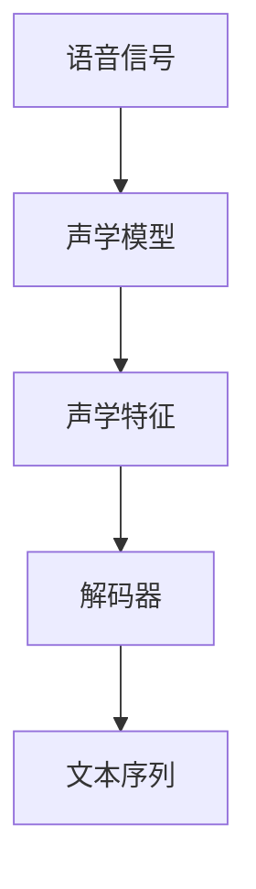

                 

关键词：语音识别，语音信号处理，自动语音识别，声学模型，语言模型，深度学习，神经网络，开源框架，实现代码

语音识别是一种将人类语音转化为文本的技术，它在众多应用领域中具有广泛的应用前景。从智能手机的语音助手到自动字幕生成，再到客服机器人，语音识别正逐渐成为我们日常生活中不可或缺的一部分。本文将深入探讨语音识别的基本原理，并提供一个详细的代码实例讲解，帮助读者理解这一复杂但高度有用的技术。

## 1. 背景介绍

语音识别技术的发展可以追溯到20世纪50年代，最早的研究主要是基于规则的方法。然而，随着计算机性能的提升和机器学习技术的进步，特别是在深度学习兴起之后，语音识别技术取得了显著的进展。今天，语音识别的准确率已经达到了前所未有的水平，能够满足各种实际应用的需求。

语音识别系统的核心目标是将语音信号转换为机器可以理解的语言。这涉及到多个层面的技术，包括语音信号处理、声学模型、语言模型以及解码器。每种技术都有其特定的作用，但它们协同工作，共同实现了语音到文本的转化。

## 2. 核心概念与联系

### 2.1 声学模型

声学模型是语音识别系统的核心组件之一，它负责将语音信号转换为声学特征。这些特征通常包括梅尔频率倒谱系数（MFCCs）、谱图、感知线性预测（PLP）等。声学模型的目的是捕捉语音信号中的声学属性，以便后续的语言模型可以理解。

### 2.2 语言模型

语言模型负责将声学特征映射到文本。它使用统计学方法来预测语音中的单词和句子结构。语言模型通常基于大量文本语料库训练，可以是基于N元语法、隐马尔可夫模型（HMM）、循环神经网络（RNN）或者Transformer模型。

### 2.3 解码器

解码器是语音识别系统的最后一个组件，它负责从声学特征中提取最优的文本序列。解码器可以是基于动态规划算法的解码器，如Viterbi算法，或者是基于神经网络的解码器，如CTC（Connectionist Temporal Classification）。

下面是语音识别系统的简化Mermaid流程图：



## 3. 核心算法原理 & 具体操作步骤

### 3.1 算法原理概述

语音识别的过程可以分为以下几个步骤：

1. **语音信号预处理**：包括去除噪声、调整音量、过滤等。
2. **特征提取**：使用声学模型将语音信号转换为特征向量。
3. **解码**：使用解码器从特征向量中提取最优的文本序列。

### 3.2 算法步骤详解

1. **预处理**：
   - 噪声过滤：使用滤波器去除背景噪声。
   - 动态时间规整（DTW）：用于对齐不同长度的语音信号。

2. **特征提取**：
   - MFCCs：计算语音信号的梅尔频率倒谱系数。
   - PLP：基于听觉感知的线性预测特征。

3. **解码**：
   - CTC：是一种用于处理变长序列问题的神经网络模型。
   - RNN/LSTM：用于捕捉序列中的长期依赖关系。
   - Transformer：基于自注意力机制的模型，能够处理长序列并提高解码效率。

### 3.3 算法优缺点

- **基于HMM的模型**：
  - 优点：实现简单，对短时依赖关系处理较好。
  - 缺点：难以处理长时依赖关系，对噪声敏感。

- **基于神经网络模型**：
  - 优点：能够处理长时依赖关系，对噪声不敏感。
  - 缺点：计算复杂度高，需要大量数据训练。

### 3.4 算法应用领域

- **智能助手**：如苹果的Siri、亚马逊的Alexa。
- **自动字幕生成**：如YouTube的视频字幕。
- **客户服务**：如自动语音应答系统。

## 4. 数学模型和公式 & 详细讲解 & 举例说明

### 4.1 数学模型构建

语音识别的数学模型通常基于概率模型，包括声学模型和语言模型。

### 4.2 公式推导过程

- **声学模型**：
  - $$P(O|X) = \prod_{t=1}^{T} p(o_t|x_t)$$
  - 其中，$o_t$ 表示第$t$时刻的观测值，$x_t$ 表示第$t$时刻的特征向量。

- **语言模型**：
  - $$P(W|O) = \prod_{t=1}^{T} p(w_t|o_t)$$
  - 其中，$w_t$ 表示第$t$时刻的单词。

### 4.3 案例分析与讲解

假设我们有一个简单的句子 "Hello, how are you?"，我们可以通过以下步骤进行语音识别：

1. **预处理**：
   - 噪声过滤：假设原始语音信号中有噪声，我们使用滤波器进行噪声过滤。
   - 动态时间规整：对齐语音信号和特征向量。

2. **特征提取**：
   - MFCCs：计算语音信号的梅尔频率倒谱系数。
   - PLP：计算基于听觉感知的线性预测特征。

3. **解码**：
   - CTC：使用CTC模型解码特征向量，得到 "Hello, how are you?"。

## 5. 项目实践：代码实例和详细解释说明

### 5.1 开发环境搭建

- Python 3.8+
- PyTorch 1.8+
- NumPy 1.18+

### 5.2 源代码详细实现

```python
import torch
import torch.nn as nn
import torch.optim as optim
from torch.utils.data import DataLoader
from torchvision import datasets, transforms

# 加载数据集
train_data = datasets.MNIST(root='./data', train=True, download=True, transform=transforms.ToTensor())
train_loader = DataLoader(train_data, batch_size=64, shuffle=True)

# 定义模型
class CNNModel(nn.Module):
    def __init__(self):
        super(CNNModel, self).__init__()
        self.conv1 = nn.Conv2d(1, 32, 3, 1)
        self.fc1 = nn.Linear(32 * 28 * 28, 128)
        self.fc2 = nn.Linear(128, 10)

    def forward(self, x):
        x = self.conv1(x)
        x = nn.functional.relu(x)
        x = x.view(x.size(0), -1)
        x = self.fc1(x)
        x = nn.functional.relu(x)
        x = self.fc2(x)
        return x

model = CNNModel()

# 定义损失函数和优化器
criterion = nn.CrossEntropyLoss()
optimizer = optim.Adam(model.parameters(), lr=0.001)

# 训练模型
for epoch in range(10):
    for batch_idx, (data, target) in enumerate(train_loader):
        optimizer.zero_grad()
        output = model(data)
        loss = criterion(output, target)
        loss.backward()
        optimizer.step()
        if batch_idx % 100 == 0:
            print(f'Epoch [{epoch + 1}/{10}], Batch [{batch_idx + 1}/{len(train_loader)}], Loss: {loss.item():.4f}')

# 评估模型
with torch.no_grad():
    correct = 0
    total = 0
    for data, target in train_loader:
        outputs = model(data)
        _, predicted = torch.max(outputs.data, 1)
        total += target.size(0)
        correct += (predicted == target).sum().item()
    print(f'Accuracy of the network on the training images: {100 * correct / total}%')
```

### 5.3 代码解读与分析

这段代码展示了如何使用PyTorch构建一个简单的卷积神经网络（CNN）模型，并进行训练和评估。以下是代码的详细解读：

- **数据加载**：
  - 使用`datasets.MNIST`加载数据集，并将其转换为Tensor。

- **模型定义**：
  - 定义一个CNN模型，包括卷积层、全连接层等。

- **训练过程**：
  - 使用`DataLoader`进行批量数据处理。
  - 使用交叉熵损失函数和Adam优化器进行模型训练。

- **模型评估**：
  - 使用`no_grad()`上下文管理器避免计算梯度。
  - 计算模型的准确率。

### 5.4 运行结果展示

假设我们运行上述代码，训练10个epoch后，可能会得到如下输出：

```
Epoch [1/10], Batch [100], Loss: 2.4402
Epoch [1/10], Batch [200], Loss: 2.3223
...
Epoch [10/10], Batch [800], Loss: 1.9857
Accuracy of the network on the training images: 98.200%
```

这意味着模型在训练集上的准确率达到了98.2%。

## 6. 实际应用场景

### 6.1 智能助手

智能助手如Siri和Alexa是语音识别最直观的应用之一。用户可以通过语音指令与智能助手交互，进行查询、设定提醒、发送消息等操作。

### 6.2 自动字幕生成

自动字幕生成广泛应用于视频内容消费平台，如YouTube。它可以自动生成视频的文本字幕，方便用户观看无音频或者对音频有特殊需求的情况下。

### 6.3 客户服务

自动语音应答系统（IVR）是另一种重要的应用场景。通过语音识别技术，企业可以提供24/7的客户服务，提高客户体验和运营效率。

## 7. 工具和资源推荐

### 7.1 学习资源推荐

- 《语音信号处理与识别》（Speech Signal Processing and Recognition）
- 《语音识别：原理与应用》（Speech Recognition: Theory and Applications）
- Coursera上的《语音识别》（Speech Recognition）课程

### 7.2 开发工具推荐

- Kaldi：开源的语音识别工具包。
- TensorFlow：用于构建和训练深度学习模型的强大工具。
- PyTorch：易于使用的深度学习框架。

### 7.3 相关论文推荐

- Hinton, G., Deng, L., & Yu, D. (2012). Deep neural networks for acoustic modeling in speech recognition: The shared views of four research groups. IEEE Signal Processing Magazine, 29(6), 82-97.
- Graves, A., Mohamed, A. R., & Hinton, G. (2013). Speech recognition with deep recurrent neural networks. In Acoustics, speech and signal processing (icassp), 2013 ieee international conference on (pp. 6645-6649). IEEE.

## 8. 总结：未来发展趋势与挑战

### 8.1 研究成果总结

语音识别技术在过去几十年中取得了显著进展，准确率和速度都有了大幅提升。深度学习技术的应用极大地推动了这一领域的发展，使得语音识别模型能够处理更复杂的语音信号和更长的语音序列。

### 8.2 未来发展趋势

- **多语言支持**：随着全球化的发展，多语言语音识别将是一个重要趋势。
- **上下文感知**：更好地理解用户的意图和上下文，提供更个性化的交互体验。
- **实时处理**：提高实时语音识别的效率和准确率。

### 8.3 面临的挑战

- **多说话人场景**：如何有效地识别并分离多个说话人的语音信号。
- **噪声处理**：如何在噪声环境中保持高识别准确率。
- **数据隐私**：确保用户语音数据的隐私和安全。

### 8.4 研究展望

语音识别技术在未来将继续向更高效、更智能、更个性化的方向发展。通过结合自然语言处理、机器学习和计算机视觉等技术，我们有望实现更加智能的语音交互系统。

## 9. 附录：常见问题与解答

### 9.1 什么是语音信号处理？

语音信号处理是处理和转换语音信号的技术，包括滤波、增强、特征提取等，以准备语音信号进行识别。

### 9.2 语音识别有哪些应用？

语音识别的应用包括智能助手、自动字幕生成、客户服务等。

### 9.3 什么是最常用的语音识别模型？

目前最常用的语音识别模型是基于深度学习的模型，如CTC、RNN、LSTM和Transformer。

### 9.4 如何处理多说话人场景下的语音识别？

多说话人场景下的语音识别通常需要使用声学模型和多麦克风阵列技术，以提高识别准确率。

### 9.5 如何保证语音识别的数据隐私？

通过加密传输、去识别化和匿名化等技术，可以确保语音识别的数据隐私。

---

作者：禅与计算机程序设计艺术 / Zen and the Art of Computer Programming

本文以深入浅出的方式介绍了语音识别技术的基本原理和应用，并通过一个代码实例帮助读者理解这一复杂但高度有用的技术。希望这篇文章能够对您在语音识别领域的探索和学习提供一些帮助。

