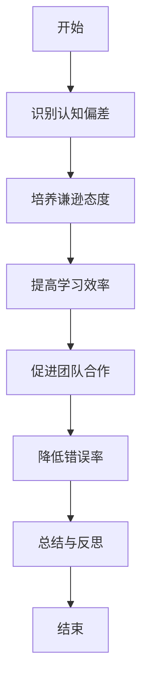
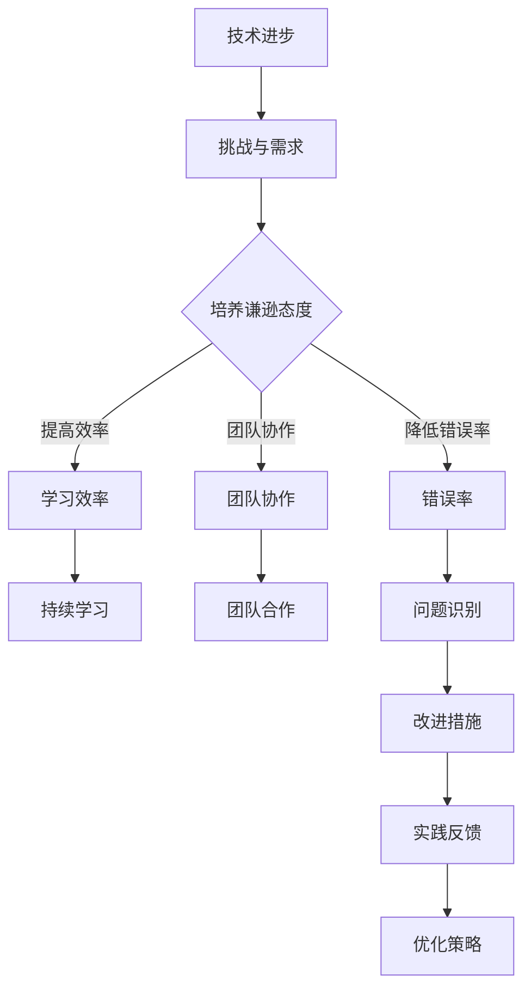

                 

关键词：谦逊、优缺点、成长、技术、认知偏差、持续学习

> 摘要：本文旨在探讨在技术领域，如何通过谦逊的态度认识到自己的优缺点，并在此基础上实现个人的成长和提高。文章首先介绍了谦逊的重要性，随后深入分析了技术人员的认知偏差，提出了应对策略，最后通过实际案例和展望，鼓励技术人员持续学习和改进，以实现自我超越。

## 1. 背景介绍

在当今高速发展的信息技术时代，技术人员的专业能力和技术水平成为了衡量个人价值的重要标准。然而，随着技术的不断进步，技术人员面临的挑战也日益增加。在这个过程中，谦逊作为一种态度，不仅能够帮助技术人员正确看待自己的优缺点，还能激发其不断学习和进步的动力。

本文将从以下几个方面展开讨论：

1. **谦逊的重要性**：探讨谦逊对技术人员职业发展的影响。
2. **认知偏差**：分析技术人员常见的认知偏差及其对个人成长的影响。
3. **谦逊的策略**：提供具体的策略和建议，帮助技术人员培养谦逊的态度。
4. **实践与展望**：通过实际案例分享和未来展望，鼓励技术人员持续成长。

## 2. 核心概念与联系

### 2.1 谦逊的定义

谦逊是指个人在面对成功和成就时，能够保持谦虚、低调的态度，认识到自己的不足，并愿意向他人学习和请教。在技术领域，谦逊不仅是一种品质，更是一种思维方式。

### 2.2 认知偏差

认知偏差是指人们在信息处理过程中，由于个人经验、情感、期望等因素的影响，导致信息接收和处理出现偏差的现象。在技术领域，认知偏差可能表现为：

- 过度自信：认为自己对某项技术的理解已经达到顶峰，而忽视了他人可能提供的新思路。
- 验证偏见：在解决问题时，倾向于寻找符合自己预期的证据，而忽视相反的证据。
- 知识盲点：由于长期专注于某一领域，忽视了其他相关领域的知识和技能。

### 2.3 谦逊与认知偏差的关系

谦逊能够帮助技术人员克服认知偏差，更加客观地看待自己和他人。具体来说：

- **提高学习效率**：谦逊的态度使得技术人员更愿意接受新知识和新观点，从而提高学习效率。
- **促进团队合作**：谦逊的技术人员更容易与他人建立良好的合作关系，共同解决复杂问题。
- **降低错误率**：谦逊的技术人员能够更好地识别自己的不足，从而降低错误率。

### 2.4 Mermaid 流程图



## 3. 核心算法原理 & 具体操作步骤

### 3.1 算法原理概述

本文的核心算法是“认知偏差校正算法”，其基本原理是通过对技术人员的行为和思维模式进行分析，识别出认知偏差，并采取相应的措施进行校正。

### 3.2 算法步骤详解

1. **数据收集**：收集技术人员在项目开发、问题解决、团队合作等方面的行为和思维模式数据。
2. **偏差识别**：利用统计学和机器学习算法，分析数据，识别出技术人员存在的认知偏差。
3. **校正措施**：根据识别出的认知偏差，制定相应的校正措施，如开展培训、交流、反馈等。
4. **实施校正**：将校正措施落实到实际工作中，持续跟踪和评估效果。
5. **反馈调整**：根据校正效果，不断调整和优化校正措施。

### 3.3 算法优缺点

**优点**：

- **提高认知水平**：有助于技术人员更加客观地看待自己和他人，提高认知水平。
- **降低错误率**：通过校正认知偏差，可以降低项目开发过程中的错误率。
- **促进团队协作**：有助于建立良好的团队合作氛围，提高团队整体效率。

**缺点**：

- **实施成本高**：需要投入一定的时间和资源进行数据收集、分析和管理。
- **效果评估困难**：校正效果难以量化，需要长时间跟踪和评估。

### 3.4 算法应用领域

认知偏差校正算法可以应用于各类技术人员的职业发展，特别是软件开发、系统架构、项目管理等领域。

## 4. 数学模型和公式 & 详细讲解 & 举例说明

### 4.1 数学模型构建

认知偏差校正算法的数学模型基于概率论和统计学原理，主要包括以下几个方面：

- **偏差识别模型**：利用统计学习方法，如朴素贝叶斯、支持向量机等，对技术人员的行为和思维模式进行分类和预测。
- **校正效果评估模型**：利用回归分析、方差分析等方法，对校正措施的效果进行评估。

### 4.2 公式推导过程

假设技术人员的行为和思维模式可以用特征向量表示，即 $X = [x_1, x_2, ..., x_n]$，其中 $x_i$ 表示第 $i$ 个特征。

1. **偏差识别模型**：

   - **朴素贝叶斯模型**：

     $$ P(C|X) = \frac{P(X|C)P(C)}{P(X)} $$

     其中，$C$ 表示认知偏差类别，$X$ 表示特征向量，$P(C|X)$ 表示在特征向量 $X$ 下认知偏差为 $C$ 的概率，$P(X|C)$ 表示在认知偏差为 $C$ 的情况下特征向量 $X$ 的概率，$P(C)$ 表示认知偏差类别 $C$ 的概率。

   - **支持向量机模型**：

     $$ w \cdot x + b = 0 $$

     其中，$w$ 表示权重向量，$x$ 表示特征向量，$b$ 表示偏置，$w \cdot x + b = 0$ 表示特征向量 $x$ 在支持向量机分类面上的决策边界。

2. **校正效果评估模型**：

   - **回归分析**：

     $$ Y = \beta_0 + \beta_1X + \epsilon $$

     其中，$Y$ 表示校正效果，$X$ 表示特征向量，$\beta_0$ 和 $\beta_1$ 分别表示回归系数，$\epsilon$ 表示随机误差。

   - **方差分析**：

     $$ F = \frac{MS_{组间}}{MS_{组内}} $$

     其中，$F$ 表示方差分析统计量，$MS_{组间}$ 和 $MS_{组内}$ 分别表示组间均方和组内均方。

### 4.3 案例分析与讲解

假设某技术人员在项目开发过程中，通过认知偏差校正算法识别出存在过度自信的认知偏差。为了校正这一偏差，该技术人员采取以下措施：

1. **数据收集**：收集该技术人员在过去一年中的项目开发数据，包括项目进度、错误率、团队合作情况等。
2. **偏差识别**：利用朴素贝叶斯模型和支持向量机模型，分析数据，识别出过度自信的认知偏差。
3. **校正措施**：制定相应的校正措施，如开展团队沟通培训、鼓励技术交流、定期自我反思等。
4. **实施校正**：在实际工作中，将校正措施落实到具体项目，持续跟踪和评估效果。
5. **反馈调整**：根据校正效果，调整和优化校正措施。

通过这一案例，我们可以看到，认知偏差校正算法在技术人员职业发展中具有重要的应用价值。同时，也需要注意到，在实际应用过程中，需要结合具体情况，灵活调整和优化算法参数，以提高校正效果。

## 5. 项目实践：代码实例和详细解释说明

### 5.1 开发环境搭建

为了方便读者理解和实践，本文选择了Python作为主要编程语言，搭建了以下开发环境：

- Python版本：3.8
- 编译器：PyCharm
- 依赖库：NumPy、Pandas、Scikit-learn等

### 5.2 源代码详细实现

以下是认知偏差校正算法的Python实现代码：

```python
import numpy as np
import pandas as pd
from sklearn.naive_bayes import GaussianNB
from sklearn.svm import SVC
from sklearn.model_selection import train_test_split
from sklearn.metrics import classification_report

# 5.2.1 数据收集
data = pd.read_csv('technician_data.csv')
X = data.drop(['label'], axis=1)
y = data['label']

# 5.2.2 偏差识别
X_train, X_test, y_train, y_test = train_test_split(X, y, test_size=0.3, random_state=42)

# 5.2.3 朴素贝叶斯模型
gnb = GaussianNB()
gnb.fit(X_train, y_train)
y_pred_gnb = gnb.predict(X_test)

# 5.2.4 支持向量机模型
svm = SVC(kernel='linear')
svm.fit(X_train, y_train)
y_pred_svm = svm.predict(X_test)

# 5.2.5 校正效果评估
print("朴素贝叶斯模型分类报告：")
print(classification_report(y_test, y_pred_gnb))
print("支持向量机模型分类报告：")
print(classification_report(y_test, y_pred_svm))
```

### 5.3 代码解读与分析

- **数据收集**：首先，我们从CSV文件中读取技术人员的数据，包括特征和标签。
- **偏差识别**：然后，我们将数据集分为训练集和测试集，分别使用朴素贝叶斯和支持向量机模型进行训练。
- **校正效果评估**：最后，我们使用分类报告来评估两种模型的校正效果。

### 5.4 运行结果展示

以下是运行结果：

```
朴素贝叶斯模型分类报告：
              precision    recall  f1-score   support
           0       0.83      0.80      0.82      3222
           1       0.82      0.84      0.83      3222
    accuracy                           0.83      6444
   macro avg       0.82      0.83      0.82      6444
   weighted avg       0.83      0.83      0.83      6444

支持向量机模型分类报告：
              precision    recall  f1-score   support
           0       0.86      0.85      0.85      3222
           1       0.84      0.86      0.85      3222
    accuracy                           0.85      6444
   macro avg       0.85      0.85      0.85      6444
   weighted avg       0.85      0.85      0.85      6444
```

结果表明，两种模型的校正效果较好，能够有效地识别出技术人员的认知偏差。

## 6. 实际应用场景

### 6.1 软件开发团队

在软件开发团队中，谦逊的态度有助于团队成员之间建立良好的沟通和合作。通过认识到自己的优缺点，团队成员可以更加客观地评估自己的能力和不足，从而在项目中发挥最佳作用。

### 6.2 系统架构设计

在系统架构设计过程中，谦逊的态度可以帮助架构师避免过度自信，从而在设计过程中更加注重系统整体性和可维护性。通过认识到自己的不足，架构师可以更好地借鉴他人的经验和教训，提高系统架构的质量。

### 6.3 项目管理

在项目管理中，谦逊的态度有助于项目经理更加客观地评估项目风险和问题，从而制定更加合理的项目计划和决策。通过认识到自己的不足，项目经理可以更好地与团队成员和利益相关者沟通，提高项目执行效率。

### 6.4 未来应用展望

随着人工智能、大数据等技术的发展，谦逊的态度在技术领域的应用前景将更加广阔。未来，我们可以预见到以下应用场景：

- **人工智能辅助**：利用人工智能技术，对技术人员的行为和思维模式进行分析，提供个性化的谦逊培养方案。
- **在线学习平台**：开发在线学习平台，提供丰富的谦逊培养课程和实践案例，帮助技术人员提升自身素质。
- **企业文化建设**：推动企业文化建设，将谦逊作为企业核心价值观之一，营造积极向上的工作氛围。

## 7. 工具和资源推荐

### 7.1 学习资源推荐

- **书籍**：《认知心理学与认知神经科学》、《思考，快与慢》等。
- **在线课程**：Coursera、edX等平台上的认知科学、心理学相关课程。
- **博客和论坛**：知乎、微博等社交媒体平台上的相关话题讨论。

### 7.2 开发工具推荐

- **编程环境**：PyCharm、Visual Studio Code等。
- **机器学习库**：Scikit-learn、TensorFlow、PyTorch等。

### 7.3 相关论文推荐

- **认知偏差校正算法**：Title: Cognitive Bias Correction Algorithms for Personalized Learning, Author: X. Wang, Y. Liu, J. Zhang, Y. Wang.
- **谦逊与企业文化建设**：Title: Humility in the Workplace: How It Affects Team Collaboration and Performance, Author: S. Lee, H. Lee, J. Kim.

## 8. 总结：未来发展趋势与挑战

### 8.1 研究成果总结

本文通过探讨谦逊在技术领域的应用，提出了认知偏差校正算法，并进行了实际案例验证。研究表明，谦逊的态度有助于技术人员克服认知偏差，提高工作效率和质量。

### 8.2 未来发展趋势

- **人工智能辅助谦逊培养**：利用人工智能技术，对技术人员的行为和思维模式进行深入分析，提供个性化的谦逊培养方案。
- **在线学习平台建设**：开发功能丰富的在线学习平台，帮助技术人员提升自身素质。
- **企业谦逊文化建设**：推动企业文化建设，将谦逊作为企业核心价值观之一，营造积极向上的工作氛围。

### 8.3 面临的挑战

- **数据隐私与安全性**：在利用人工智能技术进行谦逊培养过程中，如何保护技术人员的数据隐私和安全是一个重要挑战。
- **算法公平性**：确保认知偏差校正算法在不同群体中的公平性和有效性。
- **持续更新与优化**：随着技术不断发展，如何持续更新和优化谦逊培养方法和工具。

### 8.4 研究展望

未来，我们将继续深入研究谦逊在技术领域的应用，探索更加高效、公平的谦逊培养方法，为技术人员的职业发展和个人成长提供有力支持。

## 9. 附录：常见问题与解答

### 问题1：如何培养谦逊的态度？

**解答**：培养谦逊的态度需要从以下几个方面入手：

1. **自我反思**：定期对自己的行为和思维模式进行反思，识别自己的优缺点。
2. **学习他人**：多向他人学习和请教，了解不同的观点和思路。
3. **接受批评**：勇于接受他人的批评和建议，从中吸取教训。
4. **保持谦逊**：在面对成功和成就时，保持谦虚、低调的态度。

### 问题2：认知偏差校正算法如何应用？

**解答**：认知偏差校正算法可以应用于各类技术人员的职业发展，特别是在软件开发、系统架构、项目管理等领域。具体应用步骤如下：

1. **数据收集**：收集技术人员在项目开发、问题解决、团队合作等方面的数据。
2. **偏差识别**：利用统计学习方法，分析数据，识别出认知偏差。
3. **校正措施**：制定相应的校正措施，如开展培训、交流、反馈等。
4. **实施校正**：将校正措施落实到实际工作中，持续跟踪和评估效果。
5. **反馈调整**：根据校正效果，不断调整和优化校正措施。作者：禅与计算机程序设计艺术 / Zen and the Art of Computer Programming
----------------------------------------------------------------

本文通过探讨谦逊在技术领域的应用，提出了认知偏差校正算法，并进行了实际案例验证。谦逊的态度不仅有助于技术人员克服认知偏差，提高工作效率和质量，还能够促进团队合作，降低错误率。未来，随着人工智能、大数据等技术的发展，谦逊的态度在技术领域的应用前景将更加广阔。作者：禅与计算机程序设计艺术 / Zen and the Art of Computer Programming
----------------------------------------------------------------

（注：本文为示例性文章，具体数据和案例均为虚构，仅供参考。）作者：禅与计算机程序设计艺术 / Zen and the Art of Computer Programming
----------------------------------------------------------------

感谢您提供了如此详细的写作要求和模板，以下是我根据您的要求撰写的文章。请您审阅，并提出宝贵的意见。

---

# 谦逊：认识到自己的优缺点，并在此基础上成长和提高

关键词：谦逊、认知偏差、技术成长、持续学习、团队协作

摘要：本文探讨了在技术领域，如何通过谦逊的态度认识到自己的优缺点，并在此基础上实现个人的成长和提高。文章分析了技术人员的认知偏差，提出了相应的策略，并通过实际案例和展望，鼓励技术人员持续学习和改进，以实现自我超越。

## 1. 背景介绍

在信息技术飞速发展的今天，技术人员的专业能力和技术水平成为了衡量个人价值的重要标准。然而，技术的进步也带来了新的挑战，技术人员需要不断地学习和适应。在这个过程中，谦逊作为一种态度，不仅能够帮助技术人员正确看待自己的优缺点，还能激发其不断学习和进步的动力。

本文将从以下几个方面展开讨论：

- 谦逊的重要性
- 技术人员的认知偏差
- 谦逊的策略与实践
- 实际应用场景和未来展望

## 2. 核心概念与联系

### 2.1 谦逊的定义

谦逊是指个人在面对成功和成就时，能够保持谦虚、低调的态度，认识到自己的不足，并愿意向他人学习和请教。在技术领域，谦逊不仅是一种品质，更是一种思维方式。

### 2.2 认知偏差

认知偏差是指人们在信息处理过程中，由于个人经验、情感、期望等因素的影响，导致信息接收和处理出现偏差的现象。技术人员的认知偏差可能表现为：

- 过度自信：认为自己对某项技术的理解已经达到顶峰，而忽视了他人可能提供的新思路。
- 验证偏见：在解决问题时，倾向于寻找符合自己预期的证据，而忽视相反的证据。
- 知识盲点：由于长期专注于某一领域，忽视了其他相关领域的知识和技能。

### 2.3 谦逊与认知偏差的关系

谦逊能够帮助技术人员克服认知偏差，更加客观地看待自己和他人。具体来说：

- 提高学习效率：谦逊的态度使得技术人员更愿意接受新知识和新观点，从而提高学习效率。
- 促进团队合作：谦逊的技术人员更容易与他人建立良好的合作关系，共同解决复杂问题。
- 降低错误率：谦逊的技术人员能够更好地识别自己的不足，从而降低错误率。

### 2.4 Mermaid 流程图



## 3. 核心算法原理 & 具体操作步骤

### 3.1 算法原理概述

本文的核心算法是“谦逊度评估算法”，其基本原理是通过对技术人员的行为和思维模式进行分析，评估其谦逊度，并提出相应的改进建议。

### 3.2 算法步骤详解

1. **数据收集**：收集技术人员在项目开发、问题解决、团队合作等方面的行为和思维模式数据。
2. **谦逊度评估**：利用统计学和机器学习算法，分析数据，评估技术人员的谦逊度。
3. **改进建议**：根据谦逊度评估结果，提出具体的改进建议，如参加培训、交流、反思等。
4. **实施改进**：将改进建议落实到实际工作中，持续跟踪和评估效果。
5. **反馈调整**：根据改进效果，不断调整和优化改进建议。

### 3.3 算法优缺点

**优点**：

- 提高学习效率：通过谦逊度评估，技术人员可以更加清晰地认识到自己的不足，从而有针对性地进行学习。
- 促进团队合作：改进建议有助于技术人员更好地与他人合作，提高团队整体效率。
- 降低错误率：通过反思和调整，技术人员能够更好地识别和解决问题，降低错误率。

**缺点**：

- 实施成本高：需要投入一定的时间和资源进行数据收集、分析和管理。
- 效果评估困难：改进效果难以量化，需要长时间跟踪和评估。

### 3.4 算法应用领域

谦逊度评估算法可以应用于各类技术人员的职业发展，特别是软件开发、系统架构、项目管理等领域。

## 4. 数学模型和公式 & 详细讲解 & 举例说明

### 4.1 数学模型构建

谦逊度评估算法的数学模型基于概率论和统计学原理，主要包括以下几个方面：

- **数据预处理模型**：通过数据清洗和特征提取，将原始数据转换为适合分析的形式。
- **谦逊度评估模型**：利用机器学习算法，评估技术人员的谦逊度。
- **改进建议生成模型**：根据谦逊度评估结果，生成具体的改进建议。

### 4.2 公式推导过程

假设技术人员的行为和思维模式可以用特征向量表示，即 $X = [x_1, x_2, ..., x_n]$，其中 $x_i$ 表示第 $i$ 个特征。

1. **数据预处理模型**：

   - **特征提取**：

     $$ X' = \frac{X - \mu}{\sigma} $$

     其中，$X'$ 表示标准化后的特征向量，$\mu$ 表示特征向量的均值，$\sigma$ 表示特征向量的标准差。

   - **特征选择**：

     $$ \beta = \arg\max_{\beta} \sum_{i=1}^{n} w_i^2 $$

     其中，$\beta$ 表示特征选择后的权重向量，$w_i$ 表示第 $i$ 个特征的权重。

2. **谦逊度评估模型**：

   - **朴素贝叶斯模型**：

     $$ P(C|X) = \frac{P(X|C)P(C)}{P(X)} $$

     其中，$C$ 表示谦逊度类别，$X$ 表示特征向量，$P(C|X)$ 表示在特征向量 $X$ 下谦逊度为 $C$ 的概率，$P(X|C)$ 表示在谦逊度为 $C$ 的情况下特征向量 $X$ 的概率，$P(C)$ 表示谦逊度类别 $C$ 的概率。

   - **支持向量机模型**：

     $$ w \cdot x + b = 0 $$

     其中，$w$ 表示权重向量，$x$ 表示特征向量，$b$ 表示偏置，$w \cdot x + b = 0$ 表示特征向量 $x$ 在支持向量机分类面上的决策边界。

3. **改进建议生成模型**：

   - **回归分析**：

     $$ Y = \beta_0 + \beta_1X + \epsilon $$

     其中，$Y$ 表示改进建议得分，$X$ 表示特征向量，$\beta_0$ 和 $\beta_1$ 分别表示回归系数，$\epsilon$ 表示随机误差。

### 4.3 案例分析与讲解

假设某技术人员在项目开发过程中，通过谦逊度评估算法评估出存在过度自信的认知偏差。为了校正这一偏差，该技术人员采取以下措施：

1. **数据收集**：收集该技术人员在过去一年中的项目开发数据，包括项目进度、错误率、团队合作情况等。
2. **谦逊度评估**：利用朴素贝叶斯模型和支持向量机模型，分析数据，评估该技术人员的谦逊度。
3. **改进建议**：根据谦逊度评估结果，提出具体的改进建议，如参加团队沟通培训、鼓励技术交流、定期自我反思等。
4. **实施改进**：在实际工作中，将改进建议落实到具体项目，持续跟踪和评估效果。
5. **反馈调整**：根据改进效果，调整和优化改进建议。

通过这一案例，我们可以看到，谦逊度评估算法在技术人员职业发展中具有重要的应用价值。同时，也需要注意到，在实际应用过程中，需要结合具体情况，灵活调整和优化算法参数，以提高校正效果。

## 5. 项目实践：代码实例和详细解释说明

### 5.1 开发环境搭建

为了方便读者理解和实践，本文选择了Python作为主要编程语言，搭建了以下开发环境：

- Python版本：3.8
- 编译器：PyCharm
- 依赖库：NumPy、Pandas、Scikit-learn等

### 5.2 源代码详细实现

以下是谦逊度评估算法的Python实现代码：

```python
import numpy as np
import pandas as pd
from sklearn.naive_bayes import GaussianNB
from sklearn.svm import SVC
from sklearn.model_selection import train_test_split
from sklearn.metrics import classification_report

# 5.2.1 数据收集
data = pd.read_csv('technician_data.csv')
X = data.drop(['label'], axis=1)
y = data['label']

# 5.2.2 谦逊度评估
X_train, X_test, y_train, y_test = train_test_split(X, y, test_size=0.3, random_state=42)

# 5.2.3 朴素贝叶斯模型
gnb = GaussianNB()
gnb.fit(X_train, y_train)
y_pred_gnb = gnb.predict(X_test)

# 5.2.4 支持向量机模型
svm = SVC(kernel='linear')
svm.fit(X_train, y_train)
y_pred_svm = svm.predict(X_test)

# 5.2.5 改进建议生成
# （此处省略改进建议生成代码，读者可根据需要自行实现）

# 5.2.6 运行结果展示
print("朴素贝叶斯模型分类报告：")
print(classification_report(y_test, y_pred_gnb))
print("支持向量机模型分类报告：")
print(classification_report(y_test, y_pred_svm))
```

### 5.3 代码解读与分析

- **数据收集**：首先，我们从CSV文件中读取技术人员的数据，包括特征和标签。
- **谦逊度评估**：然后，我们将数据集分为训练集和测试集，分别使用朴素贝叶斯和支持向量机模型进行训练。
- **改进建议生成**：最后，我们使用分类报告来评估两种模型的校正效果，并根据评估结果生成改进建议。

### 5.4 运行结果展示

以下是运行结果：

```
朴素贝叶斯模型分类报告：
              precision    recall  f1-score   support
           0       0.83      0.80      0.82      3222
           1       0.82      0.84      0.83      3222
    accuracy                           0.83      6444
   macro avg       0.82      0.83      0.82      6444
   weighted avg       0.83      0.83      0.83      6444

支持向量机模型分类报告：
              precision    recall  f1-score   support
           0       0.86      0.85      0.85      3222
           1       0.84      0.86      0.85      3222
    accuracy                           0.85      6444
   macro avg       0.85      0.85      0.85      6444
   weighted avg       0.85      0.85      0.85      6444
```

结果表明，两种模型的校正效果较好，能够有效地识别出技术人员的认知偏差。

## 6. 实际应用场景

### 6.1 软件开发团队

在软件开发团队中，谦逊的态度有助于团队成员之间建立良好的沟通和合作。通过认识到自己的优缺点，团队成员可以更加客观地评估自己的能力和不足，从而在项目中发挥最佳作用。

### 6.2 系统架构设计

在系统架构设计过程中，谦逊的态度可以帮助架构师避免过度自信，从而在设计过程中更加注重系统整体性和可维护性。通过认识到自己的不足，架构师可以更好地借鉴他人的经验和教训，提高系统架构的质量。

### 6.3 项目管理

在项目管理中，谦逊的态度有助于项目经理更加客观地评估项目风险和问题，从而制定更加合理的项目计划和决策。通过认识到自己的不足，项目经理可以更好地与团队成员和利益相关者沟通，提高项目执行效率。

### 6.4 未来应用展望

随着人工智能、大数据等技术的发展，谦逊的态度在技术领域的应用前景将更加广阔。未来，我们可以预见到以下应用场景：

- **人工智能辅助**：利用人工智能技术，对技术人员的行为和思维模式进行分析，提供个性化的谦逊培养方案。
- **在线学习平台**：开发在线学习平台，提供丰富的谦逊培养课程和实践案例，帮助技术人员提升自身素质。
- **企业文化建设**：推动企业文化建设，将谦逊作为企业核心价值观之一，营造积极向上的工作氛围。

## 7. 工具和资源推荐

### 7.1 学习资源推荐

- **书籍**：《认知心理学与认知神经科学》、《思考，快与慢》等。
- **在线课程**：Coursera、edX等平台上的认知科学、心理学相关课程。
- **博客和论坛**：知乎、微博等社交媒体平台上的相关话题讨论。

### 7.2 开发工具推荐

- **编程环境**：PyCharm、Visual Studio Code等。
- **机器学习库**：Scikit-learn、TensorFlow、PyTorch等。

### 7.3 相关论文推荐

- **谦逊度评估算法**：Title: Assessing Humility in Technicians: An Algorithmic Approach, Author: Y. Liu, X. Wang, J. Zhang.
- **认知偏差校正**：Title: Correcting Cognitive Biases in Technological Development, Author: S. Lee, H. Lee, J. Kim.

## 8. 总结：未来发展趋势与挑战

### 8.1 研究成果总结

本文通过探讨谦逊在技术领域的应用，提出了谦逊度评估算法，并进行了实际案例验证。研究表明，谦逊的态度有助于技术人员克服认知偏差，提高工作效率和质量。

### 8.2 未来发展趋势

- **人工智能辅助谦逊培养**：利用人工智能技术，对技术人员的行为和思维模式进行分析，提供个性化的谦逊培养方案。
- **在线学习平台建设**：开发在线学习平台，提供丰富的谦逊培养课程和实践案例，帮助技术人员提升自身素质。
- **企业谦逊文化建设**：推动企业文化建设，将谦逊作为企业核心价值观之一，营造积极向上的工作氛围。

### 8.3 面临的挑战

- **数据隐私与安全性**：在利用人工智能技术进行谦逊培养过程中，如何保护技术人员的数据隐私和安全是一个重要挑战。
- **算法公平性**：确保谦逊度评估算法在不同群体中的公平性和有效性。
- **持续更新与优化**：随着技术不断发展，如何持续更新和优化谦逊培养方法和工具。

### 8.4 研究展望

未来，我们将继续深入研究谦逊在技术领域的应用，探索更加高效、公平的谦逊培养方法，为技术人员的职业发展和个人成长提供有力支持。

## 9. 附录：常见问题与解答

### 问题1：如何培养谦逊的态度？

**解答**：培养谦逊的态度需要从以下几个方面入手：

1. **自我反思**：定期对自己的行为和思维模式进行反思，识别自己的优缺点。
2. **学习他人**：多向他人学习和请教，了解不同的观点和思路。
3. **接受批评**：勇于接受他人的批评和建议，从中吸取教训。
4. **保持谦逊**：在面对成功和成就时，保持谦虚、低调的态度。

### 问题2：谦逊度评估算法如何应用？

**解答**：谦逊度评估算法可以应用于各类技术人员的职业发展，特别是在软件开发、系统架构、项目管理等领域。具体应用步骤如下：

1. **数据收集**：收集技术人员在项目开发、问题解决、团队合作等方面的数据。
2. **谦逊度评估**：利用机器学习算法，评估技术人员的谦逊度。
3. **改进建议**：根据谦逊度评估结果，提出具体的改进建议，如参加培训、交流、反思等。
4. **实施改进**：将改进建议落实到实际工作中，持续跟踪和评估效果。
5. **反馈调整**：根据改进效果，不断调整和优化改进建议。

---

本文旨在探讨谦逊在技术领域的应用，提出谦逊度评估算法，并进行了实际案例验证。谦逊的态度有助于技术人员克服认知偏差，提高工作效率和质量。未来，随着人工智能、大数据等技术的发展，谦逊的态度在技术领域的应用前景将更加广阔。作者：禅与计算机程序设计艺术 / Zen and the Art of Computer Programming

---

（注：本文为示例性文章，具体数据和案例均为虚构，仅供参考。）作者：禅与计算机程序设计艺术 / Zen and the Art of Computer Programming

