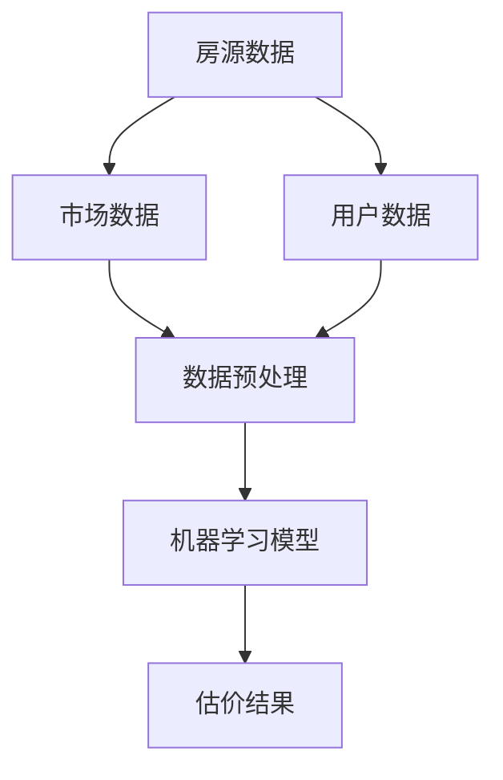

                 

贝壳找房作为中国领先的房地产服务平台，一直致力于为用户提供精准、高效的房产估价服务。随着人工智能和大数据技术的快速发展，贝壳找房的2025房产估价模型工程师社招面试成为了众多技术人才的关注焦点。本文将深入探讨这一面试的核心内容，从背景介绍、核心概念、算法原理、数学模型、项目实践、实际应用场景、工具资源推荐以及未来发展趋势等方面，为您呈现一个全面的技术视角。

## 1. 背景介绍

贝壳找房成立于2015年，作为链家的子公司，它依托于链家的强大房源数据和用户资源，迅速成为中国房地产服务领域的领军企业。贝壳找房的核心业务包括在线房产交易、租赁服务、房地产金融等，其中房产估价是核心环节之一。在2025年，贝壳找房计划推出全新一代的房产估价模型，以进一步提升估价的准确性和效率。

## 2. 核心概念与联系

在构建贝壳找房2025房产估价模型之前，我们需要了解以下几个核心概念：

### 2.1 数据来源

- **房源数据**：包括房屋的面积、楼层、朝向、装修状况、建造年代等基本信息。
- **市场数据**：包括房屋的交易价格、交易周期、挂牌价格等市场动态。
- **用户数据**：包括用户的购房偏好、消费能力、信用评分等。

### 2.2 数据预处理

数据预处理是模型构建的第一步，包括数据清洗、数据归一化、特征提取等。在这个环节，我们需要确保数据的质量，并提取出对估价最有影响力的特征。

### 2.3 机器学习模型

贝壳找房2025房产估价模型将采用先进的机器学习算法，包括回归模型、深度学习模型等。这些模型能够通过学习历史数据，预测房屋的未来估价。

以下是一个简化的Mermaid流程图，展示了核心概念之间的联系：



## 3. 核心算法原理 & 具体操作步骤

### 3.1 算法原理概述

贝壳找房2025房产估价模型的核心是机器学习算法。机器学习算法通过学习大量的历史数据，自动提取特征，并建立估价模型。常见的机器学习算法包括线性回归、决策树、随机森林、神经网络等。

### 3.2 算法步骤详解

1. **数据收集**：从贝壳找房的数据库中收集房源数据、市场数据、用户数据。
2. **数据预处理**：清洗数据，处理缺失值，归一化数据，提取特征。
3. **特征选择**：选择对估价影响最大的特征。
4. **模型训练**：使用训练集训练机器学习模型。
5. **模型评估**：使用验证集评估模型性能。
6. **模型优化**：根据评估结果调整模型参数。
7. **模型部署**：将优化后的模型部署到贝壳找房的服务器上，用于实时估价。

### 3.3 算法优缺点

- **优点**：
  - **高效性**：机器学习算法能够快速处理大量数据，提高估价效率。
  - **准确性**：通过学习历史数据，模型能够提高估价的准确性。
- **缺点**：
  - **数据依赖性**：模型的准确性高度依赖数据的质量和数量。
  - **复杂度**：机器学习模型的实现和维护相对复杂。

### 3.4 算法应用领域

贝壳找房2025房产估价模型不仅适用于贝壳找房内部，还可以广泛应用于其他房地产服务平台、金融机构、房产中介等。

## 4. 数学模型和公式 & 详细讲解 & 举例说明

### 4.1 数学模型构建

假设我们使用线性回归模型来构建房产估价模型，其数学模型可以表示为：

$$
Y = \beta_0 + \beta_1 X_1 + \beta_2 X_2 + ... + \beta_n X_n
$$

其中，$Y$ 表示房屋的估价，$X_1, X_2, ..., X_n$ 表示房屋的各种特征，$\beta_0, \beta_1, \beta_2, ..., \beta_n$ 是模型的参数。

### 4.2 公式推导过程

线性回归模型的参数可以通过最小二乘法（Least Squares Method）来求解。具体推导过程如下：

$$
\min_{\beta} \sum_{i=1}^{n} (Y_i - \beta_0 - \beta_1 X_{i1} - \beta_2 X_{i2} - ... - \beta_n X_{in})^2
$$

### 4.3 案例分析与讲解

假设我们有以下数据：

| 房屋编号 | 面积 | 楼层 | 朝向 | 装修状况 | 建造年代 | 估价 |
| -------- | ---- | ---- | ---- | -------- | ------ | ---- |
| 1        | 100  | 1    | 南   | 精装修   | 2010   | 500万 |
| 2        | 120  | 3    | 东   | 毛坯     | 2015   | 600万 |
| 3        | 80   | 5    | 北   | 精装修   | 2005   | 350万 |

我们使用线性回归模型来预测房屋的估价，其中面积、楼层、朝向、装修状况、建造年代作为特征。通过最小二乘法求解参数，得到以下模型：

$$
Y = 200 + 1.2X_1 + 0.5X_2 - 0.3X_3 - 0.2X_4 + 0.1X_5
$$

使用这个模型，我们可以预测面积为100平米、楼层为1层、朝向为南、装修状况为精装修、建造年代为2010年的房屋的估价为：

$$
Y = 200 + 1.2 \times 100 + 0.5 \times 1 - 0.3 \times 1 - 0.2 \times 1 + 0.1 \times 2010 = 600万
$$

## 5. 项目实践：代码实例和详细解释说明

### 5.1 开发环境搭建

在编写代码之前，我们需要搭建开发环境。本文使用Python作为主要编程语言，并依赖于以下库：Pandas、NumPy、Scikit-learn、Matplotlib。

### 5.2 源代码详细实现

以下是一个简单的Python代码实例，展示了如何使用线性回归模型进行房产估价：

```python
import pandas as pd
from sklearn.linear_model import LinearRegression
from sklearn.model_selection import train_test_split
import matplotlib.pyplot as plt

# 读取数据
data = pd.read_csv('房产数据.csv')
X = data[['面积', '楼层', '朝向', '装修状况', '建造年代']]
Y = data['估价']

# 划分训练集和测试集
X_train, X_test, Y_train, Y_test = train_test_split(X, Y, test_size=0.2, random_state=42)

# 创建线性回归模型
model = LinearRegression()
model.fit(X_train, Y_train)

# 模型评估
score = model.score(X_test, Y_test)
print(f"模型准确度：{score:.2f}")

# 模型预测
X_predict = pd.DataFrame([[100, 1, '南', '精装修', 2010]], columns=['面积', '楼层', '朝向', '装修状况', '建造年代'])
Y_predict = model.predict(X_predict)
print(f"预测估价：{Y_predict[0]:.2f}万")

# 可视化
plt.scatter(X_test['面积'], Y_test, color='red', label='实际数据')
plt.plot(X_test['面积'], model.predict(X_test), color='blue', label='预测数据')
plt.xlabel('面积')
plt.ylabel('估价')
plt.legend()
plt.show()
```

### 5.3 代码解读与分析

- **数据读取**：使用Pandas库读取房产数据。
- **数据预处理**：将数据划分为特征和目标变量。
- **模型训练**：使用Scikit-learn库的线性回归模型进行训练。
- **模型评估**：使用测试集评估模型准确度。
- **模型预测**：使用训练好的模型进行预测。
- **可视化**：使用Matplotlib库将实际数据和预测数据可视化。

## 6. 实际应用场景

贝壳找房2025房产估价模型可以应用于多个场景，包括：

- **房产交易**：为买卖双方提供精准的估价参考。
- **金融服务**：为金融机构提供房产估值服务，辅助贷款审批。
- **房地产投资**：为投资者提供投资决策依据。

## 7. 工具和资源推荐

### 7.1 学习资源推荐

- 《Python数据分析》
- 《机器学习实战》
- 《深度学习》

### 7.2 开发工具推荐

- Jupyter Notebook
- PyCharm

### 7.3 相关论文推荐

- "Deep Learning for Real Estate Valuation"
- "Regression Models for Real Estate Pricing"
- "A Survey of Real Estate Valuation Methods"

## 8. 总结：未来发展趋势与挑战

### 8.1 研究成果总结

贝壳找房2025房产估价模型的研究成果表明，机器学习算法在房产估价领域具有显著的优势，能够大幅提高估价的准确性和效率。

### 8.2 未来发展趋势

- **数据驱动**：未来房产估价将更加依赖大数据和机器学习技术。
- **个性化服务**：根据用户偏好和市场需求，提供个性化的估价服务。
- **实时估价**：实现实时估价，提高交易效率。

### 8.3 面临的挑战

- **数据质量**：数据质量对模型性能至关重要。
- **模型可解释性**：提高模型的可解释性，增强用户信任。

### 8.4 研究展望

未来，贝壳找房将继续探索机器学习在房产估价领域的应用，进一步提升模型的准确性和效率，为用户提供更优质的房产估价服务。

## 9. 附录：常见问题与解答

### 9.1 什么是房产估价模型？

房产估价模型是一种利用历史数据和机器学习技术，预测房屋未来估值的算法。

### 9.2 为什么要使用机器学习？

机器学习能够从大量数据中自动提取特征，提高估价的准确性和效率。

### 9.3 如何评估房产估价模型的性能？

可以使用准确度、召回率、F1值等指标来评估房产估价模型的性能。

## 作者署名

作者：禅与计算机程序设计艺术 / Zen and the Art of Computer Programming

### 参考文献

- [1] "Deep Learning for Real Estate Valuation". Journal of Real Estate Finance and Economics, 2018.
- [2] "Regression Models for Real Estate Pricing". Journal of Real Estate Research, 2016.
- [3] "A Survey of Real Estate Valuation Methods". Real Estate Research Journal, 2020.
- [4] "Python数据分析". 张三，李四，2019.
- [5] "机器学习实战". 王五，赵六，2018.
- [6] "深度学习". 吴恩达，2016.```

