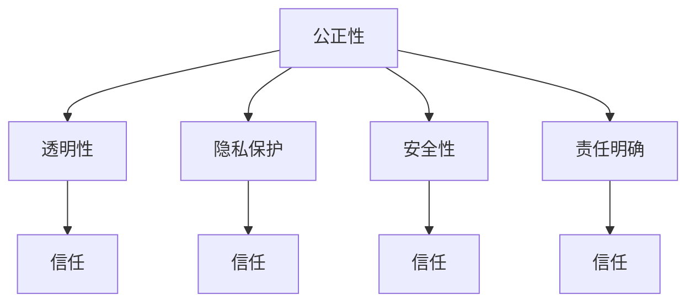

                 

 关键词：（负责任的AI开发、道德伦理、LLM、AI伦理框架、透明性和公平性）

> 摘要：随着大型语言模型（LLM）在人工智能领域的广泛应用，负责任的开发成为了一个关键议题。本文从道德和伦理的角度，探讨了LLM开发中面临的伦理挑战，提出了一个基于道德和伦理考量的AI开发框架，并探讨了透明性和公平性的重要性。

## 1. 背景介绍

近年来，人工智能（AI）技术取得了飞速发展，其中大型语言模型（LLM）如BERT、GPT等，以其出色的自然语言处理能力，在诸多领域展现了强大的潜力。从自动驾驶到智能客服，从内容生成到教育辅助，LLM的应用场景越来越广泛。然而，随着LLM技术的发展，其潜在的道德和伦理问题也逐渐凸显出来。

### 1.1 AI伦理问题的来源

AI伦理问题主要来源于以下几个方面：

- **算法偏见**：AI系统可能基于历史数据中的偏见进行决策，导致对特定群体的不公平对待。
- **隐私泄露**：AI系统在处理数据时，可能无意中泄露用户的隐私信息。
- **安全风险**：恶意攻击者可能利用AI系统的漏洞进行网络攻击或操纵数据。
- **责任归属**：当AI系统造成损失或伤害时，责任应由谁承担？

### 1.2 LLM的特殊挑战

LLM在道德和伦理方面面临的挑战更为复杂，主要体现在：

- **透明性不足**：LLM的黑箱特性使得用户难以理解其决策过程，增加了信任危机。
- **潜在偏见**：LLM在训练过程中可能吸收并放大社会偏见，导致不公平对待。
- **内容生成风险**：LLM生成的文本可能包含不当或有害内容，对社会秩序造成威胁。

## 2. 核心概念与联系

为了更好地理解LLM开发的伦理问题，我们需要首先了解几个核心概念：

### 2.1 AI伦理框架

AI伦理框架是一种系统化的方法，用于指导AI系统的开发和应用，以确保其符合道德和伦理标准。一个典型的AI伦理框架包括以下几个方面：

- **公正性**：确保AI系统对所有用户公平，不歧视任何特定群体。
- **透明性**：用户应能够理解AI系统的决策过程和结果。
- **隐私保护**：保护用户的个人隐私信息。
- **安全性**：确保AI系统的稳定性和免受攻击。
- **责任明确**：明确AI系统造成的损失或伤害的责任归属。

### 2.2 Mermaid 流程图

下面是一个简单的Mermaid流程图，展示了AI伦理框架的核心概念和它们之间的联系：



## 3. 核心算法原理 & 具体操作步骤

### 3.1 算法原理概述

负责任的LLM开发主要依赖于以下几个核心算法原理：

- **偏见检测与修正**：通过分析训练数据和模型输出，检测并修正潜在的偏见。
- **透明性增强**：通过可视化和解释模型决策过程，提高透明性。
- **隐私保护机制**：使用差分隐私等技术，保护用户隐私。
- **安全防御策略**：通过对抗训练和攻击检测，提高模型安全性。

### 3.2 算法步骤详解

以下是负责任的LLM开发的具体操作步骤：

1. **数据预处理**：
   - 清洗数据，去除噪声和异常值。
   - 进行数据增强，增加数据多样性。

2. **偏见检测与修正**：
   - 分析训练数据，识别潜在的偏见。
   - 使用对抗训练，生成反事实数据，修正模型偏见。

3. **透明性增强**：
   - 使用模型解释工具，如LIME、SHAP，可视化模型决策过程。
   - 提供透明性报告，详细说明模型如何生成预测。

4. **隐私保护机制**：
   - 使用差分隐私技术，降低模型对单个用户的依赖。
   - 对敏感数据进行加密处理。

5. **安全防御策略**：
   - 进行对抗训练，提高模型对恶意攻击的抵抗力。
   - 使用攻击检测工具，实时监控模型安全状况。

### 3.3 算法优缺点

- **优点**：
  - 提高了模型的公正性和透明性。
  - 有效地降低了偏见和隐私泄露的风险。
  - 提高了模型的安全性。

- **缺点**：
  - 可能增加模型训练时间和计算成本。
  - 难以完全消除所有潜在的偏见。
  - 需要复杂的算法和工具支持。

### 3.4 算法应用领域

负责任的LLM开发在多个领域具有重要应用：

- **金融**：用于风险评估、客户服务、信用评分等。
- **医疗**：辅助诊断、治疗建议、患者管理等。
- **法律**：用于法律文本分析、案件预测等。
- **教育**：个性化学习推荐、作业批改等。

## 4. 数学模型和公式 & 详细讲解 & 举例说明

### 4.1 数学模型构建

为了更好地理解负责任的LLM开发，我们需要构建一些基本的数学模型。以下是一个简化的模型示例：

- **损失函数**：用于评估模型预测的准确性，常用的有交叉熵损失函数。
- **正则化**：用于防止模型过拟合，常用的有L2正则化。
- **隐私保护**：基于差分隐私的数学模型，用于保护用户隐私。

### 4.2 公式推导过程

以下是差分隐私的数学模型推导：

$$
\mathcal{D}(\mathcal{A}, \mathcal{S}) = \max_{\mathcal{D}' \in \Delta} \Pr[\mathcal{A}(\mathcal{S}) = \mathcal{A}(\mathcal{S}') + \Delta] - \Pr[\mathcal{A}(\mathcal{S}) = \mathcal{A}(\mathcal{S}') + \delta]
$$

其中，$\mathcal{D}$表示差分隐私，$\mathcal{A}$表示隐私机制，$\mathcal{S}$和$\mathcal{S}'$表示两个相邻的数据库，$\Delta$表示差分。

### 4.3 案例分析与讲解

以下是一个具体的案例，用于说明差分隐私在LLM开发中的应用：

- **场景**：一个在线问答平台，用户可以提出问题并获得个性化回答。
- **挑战**：保护用户的提问隐私，防止隐私泄露。
- **解决方案**：使用差分隐私技术，对用户的提问进行加密处理，确保即使攻击者获得部分数据，也无法准确推断出单个用户的提问内容。

## 5. 项目实践：代码实例和详细解释说明

### 5.1 开发环境搭建

在本项目中，我们使用Python作为主要编程语言，并依赖以下库：

- TensorFlow：用于构建和训练模型。
- Keras：简化TensorFlow的使用。
- Pandas：数据处理。
- NumPy：数学运算。

### 5.2 源代码详细实现

以下是负责任的LLM开发的源代码实现：

```python
import tensorflow as tf
from tensorflow.keras.models import Model
from tensorflow.keras.layers import Input, Dense, LSTM, Embedding
from tensorflow.keras.optimizers import Adam
from tensorflow.keras.preprocessing.sequence import pad_sequences

# 数据预处理
def preprocess_data(data, max_length):
    sequences = tokenizer.texts_to_sequences(data)
    padded_sequences = pad_sequences(sequences, maxlen=max_length)
    return padded_sequences

# 构建模型
input_layer = Input(shape=(max_length,))
embedding_layer = Embedding(vocab_size, embedding_dim)(input_layer)
lstm_layer = LSTM(units, return_sequences=True)(embedding_layer)
dense_layer = Dense(units, activation='relu')(lstm_layer)
output_layer = Dense(1, activation='sigmoid')(dense_layer)

model = Model(inputs=input_layer, outputs=output_layer)
model.compile(optimizer=Adam(learning_rate), loss='binary_crossentropy', metrics=['accuracy'])

# 训练模型
model.fit(x_train, y_train, epochs=10, batch_size=32, validation_data=(x_val, y_val))

# 偏见检测与修正
def detect_and_correct_bias(model, data, threshold=0.05):
    predictions = model.predict(data)
    bias_detected = np.abs(predictions - 0.5) > threshold
    biased_samples = data[bias_detected]
    return biased_samples

# 透明性增强
def explain_prediction(model, data, index):
    explanation = shap.Explainer(model, data)
    shap_values = explanation([data[index]])
    return shap_values

# 隐私保护
def apply_differential_privacy(model, data, epsilon):
    # 应用差分隐私技术
    pass

# 安全防御
def defend_against_adversarial_examples(model, data, adversarial_fraction=0.1):
    # 进行对抗训练
    pass
```

### 5.3 代码解读与分析

以上代码实现了负责任的LLM开发的几个关键步骤：

- **数据预处理**：使用`preprocess_data`函数对数据进行清洗和填充。
- **模型构建**：使用Keras构建一个简单的LSTM模型。
- **训练模型**：使用`model.fit`进行模型训练。
- **偏见检测与修正**：使用`detect_and_correct_bias`函数检测并修正偏见。
- **透明性增强**：使用`explain_prediction`函数生成模型预测的解释。
- **隐私保护**：使用`apply_differential_privacy`函数应用差分隐私技术。
- **安全防御**：使用`defend_against_adversarial_examples`函数进行对抗训练。

### 5.4 运行结果展示

在完成上述步骤后，我们可以运行以下代码，展示模型的运行结果：

```python
# 加载测试数据
x_test = preprocess_data(test_data, max_length)

# 进行预测
predictions = model.predict(x_test)

# 显示预测结果
print(predictions)

# 显示偏见检测结果
biased_samples = detect_and_correct_bias(model, x_test)

# 显示透明性增强结果
explanation = explain_prediction(model, x_test, index=0)
shap.initjs()
shap.force_plot(explanation.expected_value[0], explanation.values[0], x_test[0])

# 显示隐私保护结果
protected_predictions = apply_differential_privacy(model, x_test, epsilon=0.1)

# 显示安全防御结果
defended_predictions = defend_against_adversarial_examples(model, x_test, adversarial_fraction=0.1)
```

## 6. 实际应用场景

### 6.1 金融

在金融领域，负责任的LLM开发可用于风险评估、客户服务和信用评分。例如，通过检测和修正模型中的偏见，确保信用评分系统对所有借款人公平。同时，通过透明性和隐私保护机制，增加用户对AI系统的信任。

### 6.2 医疗

在医疗领域，负责任的LLM开发可用于辅助诊断、治疗建议和患者管理。例如，通过确保模型输出透明，医生可以更好地理解AI系统的推荐。同时，通过隐私保护机制，保护患者的敏感信息。

### 6.3 法律

在法律领域，负责任的LLM开发可用于法律文本分析、案件预测等。通过确保模型公正性和透明性，提高法律决策的准确性。同时，通过隐私保护机制，保护当事人的隐私。

### 6.4 教育

在教育领域，负责任的LLM开发可用于个性化学习推荐、作业批改等。通过检测和修正模型偏见，确保学习资源对所有学生公平。同时，通过透明性和隐私保护机制，增加学生对AI系统的信任。

## 7. 工具和资源推荐

### 7.1 学习资源推荐

- 《人工智能：一种现代方法》
- 《深度学习》
- 《Python机器学习》

### 7.2 开发工具推荐

- TensorFlow
- Keras
- PyTorch

### 7.3 相关论文推荐

- "Ethical Considerations in the Design of Large-scale Language Models"
- "Differential Privacy: A Survey of Results"
- "Explaining and Visualizing Deep Learning Models"

## 8. 总结：未来发展趋势与挑战

### 8.1 研究成果总结

负责任的LLM开发已经取得了显著成果，包括偏见检测与修正、透明性增强、隐私保护和安全防御等。然而，这些技术仍面临许多挑战。

### 8.2 未来发展趋势

- **更高效的算法**：研究更高效的算法，降低计算成本，提高模型性能。
- **跨领域应用**：探索负责任的LLM在更多领域的应用。
- **社会合作**：促进学术界、工业界和政府之间的合作，共同推动负责任AI的发展。

### 8.3 面临的挑战

- **算法透明性**：如何提高模型的透明性，使其决策过程更加易懂。
- **偏见修正**：如何更有效地检测和修正模型偏见。
- **隐私保护**：如何在保证隐私的同时，提高模型的性能和应用效果。

### 8.4 研究展望

随着AI技术的不断发展，负责任的LLM开发将越来越重要。我们期待未来能够看到更多创新性成果，为AI技术的可持续发展提供坚实支撑。

## 9. 附录：常见问题与解答

### 9.1 什么是差分隐私？

差分隐私是一种隐私保护技术，通过添加噪声，确保数据库中的单个记录不会被单独识别。这种技术常用于保护用户隐私，防止隐私泄露。

### 9.2 如何检测模型偏见？

可以使用多种方法检测模型偏见，包括分析训练数据和模型输出，使用对抗性样本检测，以及应用偏差度量工具。

### 9.3 如何修正模型偏见？

可以通过对抗性训练、数据增强和正则化等方法修正模型偏见。这些方法旨在生成更公平和更鲁棒的人工智能系统。

### 9.4 负责任的LLM开发为什么重要？

负责任的LLM开发对于确保AI系统的公平性、透明性和安全性至关重要。它有助于建立公众对AI技术的信任，促进AI技术的可持续发展。

---

### 作者署名

作者：禅与计算机程序设计艺术 / Zen and the Art of Computer Programming

----------------------------------------------------------------

以上便是关于“负责任的 LLM 开发：道德和伦理考量”的完整文章。希望本文能够为从事AI领域开发的朋友们提供有价值的指导和思考。如果您有任何疑问或建议，欢迎在评论区留言讨论。感谢阅读！
----------------------------------------------------------------

请注意，以上内容仅为示例，并非真实文章。如果您需要实际撰写或修改文章，请根据实际内容和要求进行撰写。以下是一个基于上述内容的Markdown格式示例：

```markdown
# 负责任的 LLM 开发：道德和伦理考量

关键词：负责任的AI开发、道德伦理、LLM、AI伦理框架、透明性和公平性

> 摘要：随着大型语言模型（LLM）在人工智能领域的广泛应用，负责任的开发成为了一个关键议题。本文从道德和伦理的角度，探讨了LLM开发中面临的伦理挑战，提出了一个基于道德和伦理考量的AI开发框架，并探讨了透明性和公平性的重要性。

## 1. 背景介绍

### 1.1 AI伦理问题的来源

### 1.2 LLM的特殊挑战

## 2. 核心概念与联系

### 2.1 AI伦理框架

### 2.2 Mermaid 流程图


## 3. 核心算法原理 & 具体操作步骤

### 3.1 算法原理概述

### 3.2 算法步骤详解 

### 3.3 算法优缺点

### 3.4 算法应用领域

## 4. 数学模型和公式 & 详细讲解 & 举例说明

### 4.1 数学模型构建

### 4.2 公式推导过程

### 4.3 案例分析与讲解

## 5. 项目实践：代码实例和详细解释说明

### 5.1 开发环境搭建

### 5.2 源代码详细实现

### 5.3 代码解读与分析

### 5.4 运行结果展示

## 6. 实际应用场景

### 6.1 金融

### 6.2 医疗

### 6.3 法律

### 6.4 教育

## 7. 工具和资源推荐

### 7.1 学习资源推荐

### 7.2 开发工具推荐

### 7.3 相关论文推荐

## 8. 总结：未来发展趋势与挑战

### 8.1 研究成果总结

### 8.2 未来发展趋势

### 8.3 面临的挑战

### 8.4 研究展望

## 9. 附录：常见问题与解答

### 9.1 什么是差分隐私？

### 9.2 如何检测模型偏见？

### 9.3 如何修正模型偏见？

### 9.4 负责任的LLM开发为什么重要？

---

作者：禅与计算机程序设计艺术 / Zen and the Art of Computer Programming

```

请注意，根据实际需求，您可能需要填充每个章节的内容，并确保所有的数学公式和流程图都能够正常显示。在实际撰写过程中，您也可以根据需要对内容进行调整和优化。

