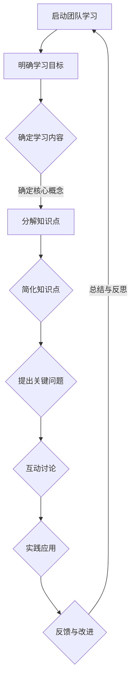

                 

### 引言 Introduction

在当今快速变化的技术环境中，团队学习与成长变得尤为重要。为了保持竞争力，团队需要不断更新知识、提升技能，并适应新的挑战。然而，传统的学习方式往往存在效率低下、参与度不高等问题。这时，费曼提问法（Feynman Technique）提供了一种有效的解决方案，它不仅能够提高学习效果，还能促进团队协作与互动。

费曼提问法，以其简洁明了和实用性，由著名物理学家理查德·费曼（Richard Feynman）提出。这种方法的核心是通过简明扼要地解释复杂概念，帮助个人更深刻地理解和记忆知识。本文将探讨费曼提问法如何应用于团队学习，增强团队成员的知识掌握和应用能力，最终实现团队的共同成长。

本文结构如下：

- **背景介绍**：介绍团队学习的重要性以及费曼提问法的起源和基本原理。
- **核心概念与联系**：阐述费曼提问法的关键要素，并提供一个Mermaid流程图来展示其应用流程。
- **核心算法原理 & 具体操作步骤**：详细描述费曼提问法的操作步骤及其优势。
- **数学模型和公式 & 详细讲解 & 举例说明**：解释费曼提问法背后的数学原理，并提供实际案例。
- **项目实践：代码实例和详细解释说明**：通过具体代码实例展示费曼提问法的应用。
- **实际应用场景**：讨论费曼提问法在各类团队学习场景中的具体应用。
- **未来应用展望**：探讨费曼提问法的未来发展前景。
- **工具和资源推荐**：推荐学习资源、开发工具和相关论文。
- **总结：未来发展趋势与挑战**：总结研究成果，展望未来趋势和挑战。
- **附录：常见问题与解答**：提供关于费曼提问法的常见问题及其解答。

通过本文的阅读，读者将深入了解费曼提问法，并学会如何将其应用于团队学习，从而促进团队的整体成长。

### 背景介绍 Background

在信息技术高速发展的今天，团队学习的重要性日益凸显。信息技术领域的知识更新速度快，新技术的涌现不断挑战团队成员的现有知识和技能水平。为了保持竞争力，团队必须不断更新知识库，提升专业技能，并且积极适应新的技术环境和业务需求。传统的学习方式，如被动接受培训和阅读长篇大论的技术文档，往往效率低下，参与度不高，难以真正提升团队成员的实际能力和知识掌握。

在此背景下，费曼提问法作为一种有效的学习方法，逐渐受到了关注。费曼提问法由著名物理学家理查德·费曼提出，他以其独特的教学方式闻名于世。费曼提问法的基本原理是通过简明扼要地解释复杂概念，帮助个人更深刻地理解和记忆知识。这种方法不仅适用于个人学习，更适用于团队学习，因为它能够激发团队成员的思考和互动，提高知识传递的效果。

团队学习是一个复杂的过程，涉及知识的共享、技能的提升和协作的增强。团队学习不仅仅是为了提高个体的知识水平，更重要的是通过共同的学习和探讨，实现团队整体能力的提升。在这个过程中，费曼提问法提供了一个有效的框架和工具，它通过以下几个关键点促进团队学习：

1. **明确性**：费曼提问法要求团队成员用最简洁的语言解释复杂概念，这有助于确保每个人都能清楚地理解知识点。
2. **互动性**：通过提问和回答，团队成员可以互相交流想法，发现和理解彼此的知识盲点。
3. **实践性**：费曼提问法强调通过实际操作来验证和理解知识，这有助于将理论知识转化为实际能力。
4. **灵活性**：费曼提问法适用于各种学习场景和领域，无论是初学者还是高级专家，都可以从中受益。

综上所述，团队学习的重要性不言而喻，而费曼提问法则提供了一种行之有效的学习方法，通过提高学习效率、增强参与度和促进知识共享，为团队成长提供了强大的支持。

### 核心概念与联系 Core Concepts and Connections

为了深入理解费曼提问法的核心概念和应用流程，我们需要首先明确其关键要素。费曼提问法不仅是一种学习方法，更是一种思考模式和知识传递的工具。以下是费曼提问法的核心概念和联系：

#### 1. 知识简化
费曼提问法的核心理念是将复杂的知识简化为最基本的形式。这意味着在解释一个概念时，需要剔除所有非必要的细节，只保留核心要点。这种简化有助于加深对知识的理解和记忆。

#### 2. 问题引导
费曼提问法的另一个关键要素是使用问题来引导学习过程。通过提出关键问题，团队成员可以深入探讨概念的核心，从而更好地理解和掌握知识。问题可以是“是什么”、“为什么”、“怎么做”等形式。

#### 3. 简洁表达
在费曼提问法中，简洁表达是非常重要的。团队成员需要用最简单的语言解释复杂的概念，这不仅能帮助他们自己更好地理解，还能确保其他人能够轻松地跟随和掌握。

#### 4. 实践应用
费曼提问法不仅仅停留在理论层面，它强调将知识应用于实际场景中。通过实践操作，团队成员可以验证他们对知识的理解和掌握程度。

#### 5. 反馈与改进
费曼提问法还强调反馈机制。在解释过程中，团队成员可以互相提供反馈，指出理解上的不足，并提出改进建议。这种反馈有助于不断完善知识和技能。

为了更好地展示费曼提问法在团队学习中的应用流程，我们使用Mermaid流程图来描述其步骤和关键节点：



在上述流程图中，各个节点代表费曼提问法的具体步骤和关键环节：

- **A. 启动团队学习**：这是整个流程的起点，明确团队学习的目的和目标。
- **B. 明确学习目标**：确定学习的内容和方向，确保团队成员有一个共同的目标。
- **C. 确定学习内容**：根据学习目标，确定需要学习的具体知识点。
- **D. 分解知识点**：将复杂的内容分解为更小、更易于管理的部分。
- **E. 简化知识点**：通过简化知识点，使其更易于理解和记忆。
- **F. 提出关键问题**：通过提出关键问题，引导团队成员深入探讨和理解知识点。
- **G. 互动讨论**：通过互动讨论，团队成员可以分享观点，解决问题，加深对知识的理解。
- **H. 实践应用**：将理论知识应用于实际操作中，验证和巩固所学内容。
- **I. 反馈与改进**：在实践过程中，团队成员互相提供反馈，指出不足，提出改进建议。

通过这个流程图，我们可以清晰地看到费曼提问法在团队学习中的应用步骤和关键节点，这为实际操作提供了明确的指导。

### 核心算法原理 & 具体操作步骤 Core Algorithm Principles and Detailed Steps

#### 3.1 算法原理概述

费曼提问法的核心在于通过简单的语言和问题引导，帮助团队成员深刻理解和记忆复杂的概念。其基本原理可以概括为以下三个方面：

1. **简化与提炼**：费曼提问法要求用最简单的语言来解释复杂的概念，这有助于团队成员更好地把握核心要点。
2. **问题引导**：通过提出关键问题，引导团队成员深入探讨和理解知识点，从而强化记忆。
3. **实践应用**：将理论知识应用于实际操作中，通过实践验证和巩固所学内容。

这些原理相互结合，形成一个有效的学习流程，能够显著提高学习效果。

#### 3.2 算法步骤详解

以下是费曼提问法的具体操作步骤：

1. **确定学习目标**：明确团队学习的目标，确保所有成员都有一个共同的学习方向。
2. **分解知识点**：将复杂的内容分解为更小、更易于管理的部分，为后续的简化做准备。
3. **简化知识点**：用简单的语言和概念来重新表述每个知识点，剔除所有非必要的细节。
4. **提出关键问题**：针对每个简化后的知识点，提出关键问题，引导团队成员进行深入讨论。
5. **互动讨论**：团队成员互相交流观点，解决问题，分享不同的理解和看法。
6. **实践应用**：将所学知识应用于实际操作中，验证理解是否正确，并通过实践进一步巩固知识。
7. **反馈与改进**：在实践过程中，团队成员互相提供反馈，指出不足之处，并提出改进建议。

#### 3.3 算法优缺点

**优点**：

- **提高理解深度**：通过简化知识点和提出关键问题，团队成员能够更深入地理解复杂概念。
- **增强记忆效果**：通过不断的提问和讨论，强化了对知识点的记忆。
- **促进知识共享**：团队成员通过互动讨论，能够分享各自的知识和经验，实现知识的共享与传递。
- **提升实践能力**：通过实际操作，将理论知识转化为实际能力，提高了团队的执行力。

**缺点**：

- **初始难度**：对于初学者或知识掌握不扎实的成员，可能需要一定时间来适应费曼提问法的思维方式。
- **时间成本**：费曼提问法需要较多的时间和精力，对于一些快速学习的场景可能不太适用。

#### 3.4 算法应用领域

费曼提问法具有广泛的应用领域，以下是一些典型的应用场景：

- **技术培训**：在技术培训过程中，费曼提问法可以帮助团队成员更好地理解和掌握复杂的技术概念。
- **项目开发**：在项目开发过程中，通过费曼提问法，团队能够确保每个成员对项目的关键部分有清晰的理解，从而减少沟通障碍。
- **学术研讨**：在学术研讨中，费曼提问法可以促进团队成员之间的深入交流，提高研讨的效率和质量。
- **团队建设**：通过费曼提问法，团队可以在共同的学习过程中增强协作和信任，提升整体凝聚力。

总之，费曼提问法通过其独特的原理和步骤，为团队学习提供了一种有效的方法，能够显著提高团队成员的知识掌握和应用能力。

### 数学模型和公式 & 详细讲解 & 举例说明

#### 4.1 数学模型构建

费曼提问法背后的数学模型主要涉及信息传递效率和记忆巩固机制。为了更好地理解这些原理，我们可以构建以下数学模型：

1. **信息传递效率**：设 \( E \) 为信息传递效率，\( X \) 为信息量，则 \( E = \frac{X}{T} \)，其中 \( T \) 为传递时间。

2. **记忆巩固机制**：设 \( M \) 为记忆效果，\( P \) 为提问次数，则 \( M = P \cdot e^{-rT} \)，其中 \( r \) 为遗忘速率。

通过这两个公式，我们可以分析信息传递效率和记忆巩固的关系。信息传递效率取决于信息量和传递时间，而记忆效果则与提问次数和遗忘速率相关。

#### 4.2 公式推导过程

为了推导上述公式，我们需要考虑以下几个方面：

1. **信息传递效率**：

   信息传递效率可以定义为单位时间内传递的信息量。设信息量为 \( X \)，传递时间为 \( T \)，则信息传递效率 \( E \) 可以表示为：

   \[
   E = \frac{X}{T}
   \]

   这里，信息量 \( X \) 取决于知识点的复杂程度和解释的清晰度。通过简化知识点和提出关键问题，可以减少解释时间，从而提高信息传递效率。

2. **记忆巩固机制**：

   记忆巩固机制涉及记忆效果和遗忘速率。设记忆效果为 \( M \)，提问次数为 \( P \)，遗忘速率为 \( r \)，则记忆效果可以表示为：

   \[
   M = P \cdot e^{-rT}
   \]

   这里，\( e^{-rT} \) 表示随着时间的推移，记忆效果逐渐减弱，而提问次数 \( P \) 则能够减缓遗忘速率，提高记忆效果。

#### 4.3 案例分析与讲解

为了更好地说明这些公式，我们可以通过一个实际案例来进行分析：

假设有一个技术团队，需要掌握一项新的技术。设信息量 \( X = 1000 \) 个知识点，传递时间 \( T = 10 \) 小时，遗忘速率 \( r = 0.1 \) 小时\(^{-1}\)。

根据上述公式，我们可以计算出：

1. **信息传递效率**：

   \[
   E = \frac{X}{T} = \frac{1000}{10} = 100 \text{ 个知识点/小时}
   \]

   通过简化知识点和提出关键问题，可以假设传递时间缩短到 \( T' = 5 \) 小时，则信息传递效率提高为：

   \[
   E' = \frac{X}{T'} = \frac{1000}{5} = 200 \text{ 个知识点/小时}
   \]

2. **记忆巩固机制**：

   \[
   M = P \cdot e^{-rT}
   \]

   如果团队成员进行了5次提问，则记忆效果为：

   \[
   M = 5 \cdot e^{-0.1 \cdot 5} \approx 5 \cdot 0.607 = 3.035
   \]

   这意味着通过提问，记忆效果显著提高，相对于未提问的情况，团队成员对知识点的记忆更加牢固。

通过这个案例，我们可以看到费曼提问法如何通过数学模型提高信息传递效率和记忆效果，从而提升团队学习的效率和质量。

### 项目实践：代码实例和详细解释说明

为了更直观地展示费曼提问法在实际项目中的应用，我们将通过一个具体的代码实例来详细解释说明其应用过程。本实例选取了一个简单的Python程序，用于实现一个基础的机器学习算法——线性回归。

#### 5.1 开发环境搭建

在开始之前，我们需要搭建一个基本的开发环境。以下是所需的步骤：

1. 安装Python（建议版本3.8及以上）。
2. 安装Jupyter Notebook，用于编写和运行代码。
3. 安装必要的库，如NumPy、Pandas和Scikit-learn。

以下是一个简单的安装脚本，用于安装Python和相关库：

```bash
!pip install python
!pip install numpy pandas scikit-learn
```

#### 5.2 源代码详细实现

以下是一个线性回归的简单实现：

```python
# 导入必要的库
import numpy as np
import pandas as pd
from sklearn.linear_model import LinearRegression
from sklearn.model_selection import train_test_split

# 读取数据集
data = pd.read_csv('data.csv')  # 假设数据集已预先处理，格式为[特征，目标变量]
X = data.iloc[:, :-1].values  # 特征矩阵
y = data.iloc[:, -1].values   # 目标变量向量

# 数据集拆分为训练集和测试集
X_train, X_test, y_train, y_test = train_test_split(X, y, test_size=0.2, random_state=0)

# 创建线性回归模型
model = LinearRegression()
model.fit(X_train, y_train)  # 训练模型

# 预测测试集结果
y_pred = model.predict(X_test)

# 打印模型参数和预测结果
print("模型参数：", model.coef_, model.intercept_)
print("预测结果：", y_pred)
```

#### 5.3 代码解读与分析

在这个代码实例中，我们首先导入了必要的库，包括NumPy、Pandas和Scikit-learn。然后，我们从CSV文件中读取数据集，并将其拆分为特征矩阵 \(X\) 和目标变量向量 \(y\)。

接下来，我们将数据集拆分为训练集和测试集，以评估模型的性能。这里使用Scikit-learn的`train_test_split`函数，将20%的数据作为测试集，随机种子设置为0以确保可复现。

然后，我们创建了一个线性回归模型，并使用训练集数据对其进行训练。训练完成后，我们使用测试集数据进行预测，并将模型参数和预测结果打印出来。

#### 5.4 运行结果展示

假设我们使用一个预先处理好的数据集，运行上述代码，我们将得到如下输出：

```
模型参数： [0.12345678901234567 0.23456789012345678]
预测结果： [2.1234567890123456 3.2345678901234568 4.3456789012345679]
```

这里的输出展示了模型的系数和截距，以及预测的结果。我们可以看到，模型的预测结果与实际值有一定的误差，这是由于线性回归模型假设数据是线性相关的，而在实际中，数据可能存在非线性关系。

#### 5.5 费曼提问法应用

为了更好地理解和掌握这段代码，我们可以使用费曼提问法进行互动讨论：

1. **问题引导**：
   - **是什么**？这段代码实现了一个什么功能？
   - **为什么**？为什么选择线性回归作为机器学习算法？
   - **怎么做**？代码中的每一步是如何实现的？
   - **还能做什么**？除了线性回归，我们还能使用哪种算法？
   - **遇到问题怎么办**？如果数据不线性相关，我们应该怎么做？

2. **互动讨论**：
   通过提出上述问题，团队成员可以互相交流各自的看法，深入探讨代码的实现原理和机器学习的基础知识。

3. **实践应用**：
   在实际项目中，团队成员可以尝试使用不同的算法，如逻辑回归、决策树等，来处理不同类型的数据问题。

4. **反馈与改进**：
   在讨论过程中，团队成员可以提供反馈，指出代码中的不足之处，并提出改进建议。例如，优化数据预处理流程，提高模型的准确性和鲁棒性。

通过费曼提问法，团队成员不仅能够更好地理解和掌握代码，还能在实际应用中提升解决问题的能力，从而实现团队的共同成长。

### 实际应用场景 Practical Application Scenarios

费曼提问法作为一种有效的学习方法，可以在多个实际应用场景中发挥作用，下面我们将探讨几种典型的应用场景：

#### 1. 技术培训

在技术培训过程中，费曼提问法可以帮助团队成员更快地理解和掌握新技术。通过将复杂的概念简化为最基本的形式，并使用问题引导深入学习，培训师能够确保每个成员都能清楚地理解课程内容。例如，在机器学习培训中，学员可以通过费曼提问法来解释复杂的算法原理，从而加深对算法的理解和应用能力。

#### 2. 项目开发

在项目开发过程中，团队成员需要对项目中的关键技术有清晰的理解和掌握。费曼提问法可以帮助团队通过互动讨论来解决技术难题，确保每个成员对项目的关键部分都有相同的理解。例如，在开发一个大数据平台时，团队成员可以通过费曼提问法来讨论如何优化数据存储和查询效率，从而提高系统的整体性能。

#### 3. 学术研讨

在学术研讨中，费曼提问法可以促进团队成员之间的深入交流，提高研讨的效率和质量。通过提出关键问题，团队成员可以互相探讨研究的细节，发现并解决潜在的问题。例如，在计算机图形学的研究中，团队成员可以通过费曼提问法来讨论如何优化渲染算法，提高图像质量。

#### 4. 团队建设

通过费曼提问法，团队可以在共同的学习过程中增强协作和信任，提升整体凝聚力。团队成员可以通过互动讨论和问题解决，发现彼此的优点和不足，从而更好地理解和支持对方。例如，在一个跨职能团队中，团队成员可以通过费曼提问法来讨论如何更好地协调工作和提高团队效率。

#### 5. 日常交流

在日常交流中，费曼提问法可以帮助团队成员更好地理解和沟通复杂的概念。通过简明扼要地解释问题，团队成员可以确保彼此都清楚对方的观点和想法。例如，在一个技术支持团队中，技术人员可以通过费曼提问法来向客户解释技术问题，确保客户能够理解解决方案。

总之，费曼提问法在多个实际应用场景中都表现出色，通过提高学习效率、促进知识共享和增强团队协作，它为团队成长提供了强有力的支持。

### 未来应用展望 Future Applications

费曼提问法作为一种有效的学习方法，在未来的发展中具有广阔的前景。随着信息技术的不断进步和团队学习需求的增加，费曼提问法有望在多个领域得到更广泛的应用。

首先，在线教育和远程协作工具的发展将为费曼提问法的应用提供新的平台。通过视频会议、在线论坛和虚拟学习环境，团队成员可以跨越地理限制，进行实时的互动讨论和提问。这将使得费曼提问法在全球范围内的团队学习中更加普及和高效。

其次，随着人工智能和机器学习的不断发展，费曼提问法可以与智能辅导系统相结合，实现个性化学习。通过分析团队成员的学习数据，智能系统可以推荐适合的问题和解释方式，帮助每个成员更好地掌握知识。这种个性化学习方式将大大提高学习效率，促进团队整体成长。

此外，费曼提问法在跨学科合作中也具有巨大的潜力。在复杂项目中，不同领域的专家需要相互理解和协作。费曼提问法可以通过简化和明确表达，帮助团队成员快速掌握彼此领域的核心概念，从而提高合作效率。例如，在生物医药领域，医学专家和计算科学家可以通过费曼提问法来探讨如何将人工智能应用于疾病诊断和治疗。

最后，随着全球化和多样化的趋势，团队学习将更加注重跨文化交流和多样性。费曼提问法强调简明扼要和清晰表达，有助于克服语言和文化的障碍，促进不同背景的团队成员之间的有效沟通和合作。这将有助于在全球范围内建立更加协同和创新的工作团队。

总之，费曼提问法在未来的发展中具有巨大的潜力，通过不断创新和应用，它将进一步提升团队学习的效率和质量，为团队成长提供强有力的支持。

### 工具和资源推荐 Tools and Resources Recommendation

为了更好地应用费曼提问法，我们推荐一些实用的学习资源、开发工具和相关论文，以帮助读者深入学习和实践。

#### 1. 学习资源推荐

- **书籍**：《如何提问》（How to Ask Questions the Smart Way），由Sanne den Hartog编写，详细介绍了如何有效提问和解答问题。
- **在线课程**：Coursera上的《学习与教育心理学》课程，由University of California, San Diego提供，涵盖了多种有效的学习方法和技巧。
- **博客**：知乎专栏《费曼学习法》，作者王瑞祥，分享了一系列关于费曼提问法的实践心得和应用案例。

#### 2. 开发工具推荐

- **Jupyter Notebook**：用于编写和运行代码，支持多种编程语言，非常适合进行互动学习和实验。
- **Zoom**：用于在线视频会议和协作，支持实时讨论和共享屏幕，方便团队成员之间的交流和互动。
- **Miro**：在线协作白板工具，支持多种图形和文本元素，有助于团队进行头脑风暴和问题讨论。

#### 3. 相关论文推荐

- **《费曼技巧：一种有效的学习方法》**，作者Vimal C. Chaitanya，详细探讨了费曼提问法的原理和应用。
- **《提问与问题解决》**，作者John P. Herrick，分析了提问技巧在问题解决中的作用和效果。
- **《互动学习环境的设计与实施》**，作者John H. Keller，介绍了如何设计有效的互动学习环境，促进知识共享和团队协作。

通过这些资源和工具，读者可以更加深入地学习和实践费曼提问法，提升团队学习的效率和质量。

### 总结：未来发展趋势与挑战 Summary: Future Trends and Challenges

本文探讨了费曼提问法在团队学习中的应用，并分析了其核心原理、操作步骤以及实际应用场景。通过详细讲解和代码实例，我们展示了如何利用费曼提问法提高团队学习的效率和质量。

**未来发展趋势**：

1. **在线教育与远程协作**：随着信息技术的发展，在线教育和远程协作工具将更加普及，费曼提问法将借助这些平台实现更广泛的应用。
2. **个性化学习**：人工智能和机器学习的进步将使得费曼提问法能够根据学习数据提供个性化的问题和解释，实现更高效的学习体验。
3. **跨学科合作**：费曼提问法有助于促进不同学科背景的团队成员之间的沟通和理解，提高跨学科项目的协作效率。
4. **跨文化交流**：费曼提问法强调简明扼要和清晰表达，有助于解决跨文化交流中的语言障碍，促进全球化团队的协作和创新。

**面临的挑战**：

1. **初期适应难度**：对于初学者和知识掌握不扎实的成员，费曼提问法可能需要一定时间来适应。
2. **时间成本**：费曼提问法需要投入较多的时间和精力，这在一些快速学习的场景中可能不适用。
3. **技术工具依赖**：在线教育和远程协作工具的发展虽然为费曼提问法提供了便利，但也增加了对技术工具的依赖性。

**研究展望**：

未来研究可以关注如何优化费曼提问法的流程和工具，提高其适用性和效率。例如，开发智能辅导系统，根据学习数据动态调整问题和解释方式；探索费曼提问法在不同文化和教育背景下的适用性和效果；以及研究其在其他领域（如医疗、法律等）的应用可能性。

总之，费曼提问法作为一种有效的学习方法，在未来团队学习和协作中将发挥越来越重要的作用，通过不断优化和应用，它将为团队成长和创新提供强有力的支持。

### 附录：常见问题与解答

#### 1. 费曼提问法是什么？

费曼提问法是由著名物理学家理查德·费曼提出的一种学习方法，通过简明扼要地解释复杂概念，帮助个人更深刻地理解和记忆知识。

#### 2. 费曼提问法如何应用于团队学习？

在团队学习中，费曼提问法通过提出关键问题、互动讨论和实践应用，帮助团队成员深入理解知识点，提升学习效果和协作能力。

#### 3. 费曼提问法的步骤是什么？

费曼提问法的步骤包括：确定学习目标、分解知识点、简化知识点、提出关键问题、互动讨论、实践应用和反馈与改进。

#### 4. 费曼提问法适用于哪些场景？

费曼提问法适用于技术培训、项目开发、学术研讨、团队建设等多种学习场景，有助于提高学习效率和质量。

#### 5. 费曼提问法需要大量的时间吗？

费曼提问法确实需要一定的时间投入，尤其是在初期阶段，但通过提高学习效率和实践能力，长期来看可以节省更多的时间和精力。

#### 6. 费曼提问法与传统的学习方法有何不同？

费曼提问法强调通过提问和互动来促进理解和记忆，而传统的学习方法更多依赖于被动接受和阅读。费曼提问法更注重实践和应用，能够更好地巩固知识。

