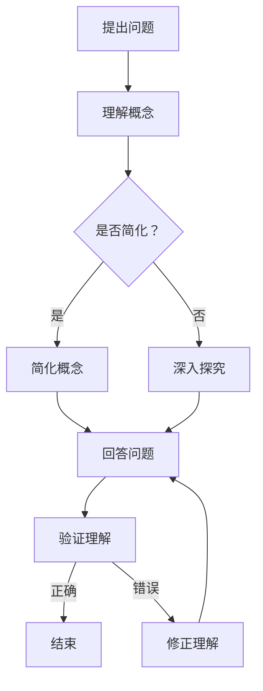

                 

关键词：费曼提问法，深度思考，知识传授，问题解决，教学技巧

> 摘要：本文将深入探讨费曼提问法的实践应用，分析其在促进深度思考、知识传授和问题解决方面的独特优势。通过具体的案例和操作步骤，我们将展示如何运用费曼提问法来提升个人的学习效果，并将所学知识有效传递给他人。

## 1. 背景介绍

费曼提问法（Feynman Technique）起源于著名物理学家理查德·费曼（Richard Feynman）的教学方法。费曼以其独特的教学风格和对复杂概念的简化能力而闻名，他提出的提问法被广泛应用于各个领域，成为一种有效的学习方法和教学技巧。费曼提问法的核心思想是通过简单明了地解释复杂概念，以检验我们对知识的理解和掌握程度。

### 费曼提问法的起源与发展

费曼提问法的起源可以追溯到费曼在加州理工学院的教授生涯。他常常使用一种简单而直接的方法来解释复杂的物理学概念，这种方法不仅帮助学生更好地理解课程内容，还激发了他们的兴趣和创造力。费曼提问法强调通过提出问题来引导思考，从而深入理解知识点。

随着时间的推移，费曼提问法逐渐被其他领域的专家和学者所采用，并不断发展完善。如今，它已成为一种广泛应用于教育、研究和个人学习中的方法论。

### 费曼提问法在计算机科学中的应用

在计算机科学领域，费曼提问法同样发挥着重要作用。无论是编程语言的学习、算法的理解，还是软件架构的设计，费曼提问法都能帮助我们更深入地理解复杂的概念，并提升我们的学习效果。

例如，在学习新的编程语言时，我们可以通过费曼提问法来检验自己对语言特性的理解。我们可以向自己提出以下问题：

- 这种语言的基本语法结构是什么？
- 它是如何处理变量的？
- 它支持面向对象编程吗？
- 它有哪些内置函数和库？

通过这些问题的回答，我们可以系统地梳理所学知识，发现并填补知识盲点。

## 2. 核心概念与联系

### 费曼提问法的核心概念

费曼提问法主要包括以下几个核心概念：

1. **简单化**：将复杂的概念简化为基本要素，以便更好地理解和记忆。
2. **问题导向**：通过提出问题来引导思考和深入探究。
3. **反馈机制**：通过他人的反馈来验证我们的理解是否准确和完整。

### 费曼提问法的架构

为了更好地理解费曼提问法，我们可以使用Mermaid流程图来展示其核心架构：



通过这个流程图，我们可以看到费曼提问法是如何通过提出问题、理解概念、简化概念、回答问题和验证理解等步骤来促进深度思考的。

### 费曼提问法与其他学习方法的联系

费曼提问法与其他学习方法，如主动学习、深度学习和概念图构建等，有着紧密的联系。主动学习强调通过主动提问和思考来加深对知识的理解；深度学习则侧重于通过多层抽象和模型训练来模拟人类思考过程；概念图构建则通过图示化方式来组织和呈现知识结构。费曼提问法通过提问和回答的过程，将这三种学习方法有机结合，形成了一种综合性的学习方法。

## 3. 核心算法原理 & 具体操作步骤

### 3.1 算法原理概述

费曼提问法的核心原理在于通过提问和回答的过程来检验我们对知识的理解。具体而言，它包括以下几个步骤：

1. **选择一个知识点**：选择一个需要深入理解的知识点。
2. **简化概念**：将复杂的概念简化为最基本的形式。
3. **提出问题**：围绕这个知识点提出一系列问题。
4. **回答问题**：尝试用最简单明了的语言回答这些问题。
5. **验证理解**：通过他人的反馈或实际应用来验证我们的理解是否准确和完整。

### 3.2 算法步骤详解

1. **选择一个知识点**

选择一个需要深入理解的知识点。这个知识点可以是任何领域的内容，无论是编程语言、算法、数学公式，还是历史、文化等。

2. **简化概念**

将复杂的概念简化为最基本的形式。例如，在学习一个新的算法时，可以将算法的基本步骤和关键点提取出来，用简单的语言描述。

3. **提出问题**

围绕这个知识点提出一系列问题。这些问题应该是能够帮助我们深入理解知识点的，例如：

- 这个知识点的基本概念是什么？
- 它是如何应用的？
- 它与其他知识点有何联系？
- 它有哪些变体或扩展？

4. **回答问题**

尝试用最简单明了的语言回答这些问题。在回答问题时，我们应该尽量使用简单的语言和例子，以便更好地理解和记忆。

5. **验证理解**

通过他人的反馈或实际应用来验证我们的理解是否准确和完整。例如，我们可以向他人解释这个知识点，或者在实际项目中应用这些知识。

### 3.3 算法优缺点

#### 优点

1. **促进深度思考**：通过提问和回答的过程，我们可以更深入地理解知识点，发现并填补知识盲点。
2. **提高学习效果**：通过简化概念和实际应用，我们可以更好地记忆和应用所学知识。
3. **培养沟通能力**：通过向他人解释知识点，我们可以锻炼自己的表达能力和沟通技巧。

#### 缺点

1. **初始难度较大**：对于初学者来说，提出问题和简化概念可能比较困难，需要一定的学习和实践。
2. **时间成本较高**：费曼提问法需要一定的时间和精力来准备和执行，对于时间紧张的学习者可能不太适用。

### 3.4 算法应用领域

费曼提问法可以应用于多个领域，包括但不限于：

1. **教育**：教师可以使用费曼提问法来检验学生的理解程度，帮助学生更好地掌握知识点。
2. **研究**：研究人员可以使用费曼提问法来深入理解复杂的概念，从而推动研究进展。
3. **个人学习**：个人学习者可以使用费曼提问法来检验自己的知识，提高学习效果。

## 4. 数学模型和公式 & 详细讲解 & 举例说明

### 4.1 数学模型构建

费曼提问法在数学领域中的应用主要体现在如何通过提问和回答来构建数学模型。具体而言，我们可以使用以下数学模型来描述费曼提问法：

1. **知识理解模型**：描述我们对知识点的理解和掌握程度。
2. **问题引导模型**：描述如何通过提问来引导思考和深入探究。
3. **反馈修正模型**：描述如何通过反馈来修正我们的理解。

### 4.2 公式推导过程

假设我们有一个知识点A，我们需要通过费曼提问法来构建其数学模型。我们可以使用以下公式：

1. **知识理解度（U）**：

   $$U = f(P, Q, R)$$

   其中，P表示我们对知识点的初步理解，Q表示我们通过提问获得的反馈，R表示我们通过实际应用获得的反馈。

2. **问题引导度（QG）**：

   $$QG = f(Q)$$

   其中，Q表示我们通过提问获得的反馈。

3. **反馈修正度（RM）**：

   $$RM = f(R)$$

   其中，R表示我们通过实际应用获得的反馈。

### 4.3 案例分析与讲解

假设我们有一个数学知识点：微积分的基本概念。我们可以使用费曼提问法来构建其数学模型。

1. **知识理解度（U）**：

   我们对微积分的基本概念有一个初步理解，例如微积分的定义、基本定理等。

2. **问题引导度（QG）**：

   通过提问，我们可以引导自己深入理解微积分的概念，例如：

   - 微积分是如何定义的？
   - 微积分的基本定理是什么？
   - 微积分与其他数学概念有何联系？

3. **反馈修正度（RM）**：

   通过实际应用，例如解决实际问题，我们可以修正我们的理解，例如：

   - 如何使用微积分来解决优化问题？
   - 微积分在物理学中是如何应用的？

通过这三个步骤，我们可以构建一个完整的数学模型，用于描述我们对微积分基本概念的理解和掌握程度。

## 5. 项目实践：代码实例和详细解释说明

### 5.1 开发环境搭建

为了演示费曼提问法在编程学习中的应用，我们将以学习Python编程语言为例。首先，我们需要搭建一个基本的Python开发环境。

1. **安装Python**：访问Python官网（https://www.python.org/），下载并安装最新版本的Python。
2. **配置Python环境**：确保Python的安装路径添加到系统环境变量中，以便在任何位置运行Python。
3. **安装IDE**：选择一个适合Python开发的集成开发环境（IDE），例如PyCharm、VSCode等。

### 5.2 源代码详细实现

为了更好地理解Python的基本语法，我们通过费曼提问法来编写一个简单的Python程序。

1. **提出问题**：

   - Python的基本语法是什么？
   - 如何定义变量？
   - 如何进行基本的输入输出操作？

2. **简化概念**：

   - Python的基本语法包括变量定义、数据类型和运算符。
   - 变量定义：使用等号（=）将值赋给变量。
   - 输入输出操作：使用输入函数（input()）和输出函数（print()）。

3. **编写代码**：

```python
# 定义变量
name = input("请输入你的名字：")
age = input("请输入你的年龄：")

# 输出结果
print(f"你的名字是{name}，年龄是{age}。")
```

4. **回答问题**：

   - Python的基本语法是什么？Python的基本语法包括变量定义、数据类型和运算符。
   - 如何定义变量？使用等号（=）将值赋给变量。
   - 如何进行基本的输入输出操作？使用输入函数（input()）和输出函数（print()）。

### 5.3 代码解读与分析

在这个简单的Python程序中，我们通过费曼提问法来检验对Python基本语法的理解。

1. **变量定义**：

   ```python
   name = input("请输入你的名字：")
   age = input("请输入你的年龄：")
   ```

   这两行代码定义了两个变量：`name`和`age`。`input()`函数用于获取用户的输入，并将输入的值赋给变量。

2. **输入输出操作**：

   ```python
   print(f"你的名字是{name}，年龄是{age}。")
   ```

   这行代码使用`print()`函数输出一个格式化的字符串。`f`用于格式化字符串，`{name}`和`{age}`是占位符，用于替换为变量`name`和`age`的值。

### 5.4 运行结果展示

在Python环境中运行这个程序，将显示一个提示框，要求用户输入名字和年龄。用户输入后，程序将输出一个包含用户名字和年龄的格式化字符串。

```shell
请输入你的名字：张三
请输入你的年龄：25
你的名字是张三，年龄是25。
```

通过这个简单的实例，我们可以看到如何使用费曼提问法来学习Python编程，并检验对Python基本语法的理解。

## 6. 实际应用场景

### 6.1 教学中的应用

在教学中，费曼提问法是一种非常有效的教学技巧。教师可以通过提出问题来引导学生思考，帮助学生更好地理解和掌握知识点。以下是一个具体的案例：

#### 案例一：数学课程

假设教师正在教授微积分中的极限概念。教师可以使用费曼提问法来引导学生：

1. **提出问题**：

   - 极限是什么？
   - 极限是如何计算的？
   - 极限在现实生活中有哪些应用？

2. **回答问题**：

   - 极限是一个函数在某个点的值，当自变量接近这个点时，函数值的变化情况。
   - 极限可以通过多种方法计算，如直接计算、夹逼定理、洛必达法则等。
   - 极限在物理学、工程学和经济学等领域有广泛的应用，如速度、加速度、概率密度函数等。

3. **验证理解**：

   教师可以让学生通过解决实际问题来验证对极限概念的理解。例如，让学生计算函数$f(x) = \frac{\sin x}{x}$在$x = 0$时的极限。

### 6.2 研究中的运用

在研究过程中，费曼提问法可以帮助研究人员深入理解复杂的概念，从而推动研究的进展。以下是一个具体的案例：

#### 案例二：机器学习研究

假设研究人员正在研究一种新的机器学习算法。研究人员可以使用费曼提问法来检验对算法的理解：

1. **提出问题**：

   - 这种算法的基本原理是什么？
   - 它是如何训练模型的？
   - 它有哪些优势和局限性？

2. **回答问题**：

   - 这种算法是基于神经网络的思想，通过优化损失函数来训练模型。
   - 算法通过迭代更新模型参数，以最小化损失函数。
   - 优势在于模型具有良好的泛化能力，但计算复杂度较高。

3. **验证理解**：

   研究人员可以通过实现这个算法来验证对算法的理解。例如，研究人员可以尝试使用这个算法来解决一个实际的数据集分类问题。

### 6.3 个人学习中的应用

在个人学习中，费曼提问法可以帮助学习者更深入地理解所学知识，提高学习效果。以下是一个具体的案例：

#### 案例三：学习新编程语言

假设学习者正在学习Python编程语言。学习者可以使用费曼提问法来检验对Python基本语法的理解：

1. **提出问题**：

   - Python的基本语法是什么？
   - 如何定义变量？
   - 如何进行基本的输入输出操作？

2. **回答问题**：

   - Python的基本语法包括变量定义、数据类型和运算符。
   - 变量定义：使用等号（=）将值赋给变量。
   - 输入输出操作：使用输入函数（input()）和输出函数（print()）。

3. **验证理解**：

   学习者可以编写一个简单的Python程序来验证对Python基本语法的理解。例如，编写一个程序来获取用户的名字和年龄，并输出相关信息。

## 7. 工具和资源推荐

### 7.1 学习资源推荐

为了更好地应用费曼提问法，以下是一些建议的学习资源：

1. **书籍**：
   - 《深度学习》（Deep Learning） - Ian Goodfellow, Yoshua Bengio, Aaron Courville
   - 《代码大全》（Code Complete） - Steve McConnell
   - 《线性代数及其应用》（Linear Algebra and Its Applications） - Gilbert Strang

2. **在线课程**：
   - Coursera上的《机器学习》课程
   - Udemy上的《Python编程：从入门到大师》课程
   - edX上的《微积分基础》课程

3. **博客和网站**：
   - Medium上的机器学习和编程相关博客
   - Stack Overflow上的编程问答社区
   - GitHub上的开源项目和学习资源

### 7.2 开发工具推荐

为了方便使用费曼提问法进行编程学习，以下是一些建议的开发工具：

1. **集成开发环境（IDE）**：
   - PyCharm
   - VSCode
   - Sublime Text

2. **版本控制系统**：
   - Git
   - GitHub
   - GitLab

3. **调试工具**：
   - Pdb（Python内置调试工具）
   - PyCharm的调试功能
   - Postman（API调试工具）

### 7.3 相关论文推荐

为了深入了解费曼提问法在计算机科学中的应用，以下是一些建议的论文：

1. **《费曼学习法：深度学习的艺术》（Feynman Learning Method: The Art of Deep Learning）**
2. **《费曼提问法在计算机科学教育中的应用》（Application of Feynman Questioning Method in Computer Science Education）**
3. **《基于费曼提问法的编程学习策略研究》（Research on Programming Learning Strategies Based on Feynman Questioning Method）**

## 8. 总结：未来发展趋势与挑战

### 8.1 研究成果总结

通过本文的探讨，我们可以看到费曼提问法在促进深度思考、知识传授和问题解决方面的独特优势。它不仅能够帮助学习者更深入地理解知识点，还能够培养他们的表达能力和沟通技巧。同时，费曼提问法在多个领域，如教育、研究和个人学习中的应用已经取得了显著成果。

### 8.2 未来发展趋势

随着人工智能和计算机科学的发展，费曼提问法在未来有望在以下几个方面得到进一步发展和应用：

1. **自动化工具开发**：开发基于费曼提问法的自动化工具，以辅助教师和学生进行知识传授和学习。
2. **跨学科应用**：费曼提问法不仅适用于计算机科学，还可以广泛应用于其他学科，如医学、法律等。
3. **在线教育平台**：利用在线教育平台，推广费曼提问法，使其成为全球学习者的一种通用学习方法。

### 8.3 面临的挑战

尽管费曼提问法具有显著的优势，但在实际应用中仍面临一些挑战：

1. **适应性问题**：不同领域和知识层次的学习者可能需要不同的提问方式和回答策略。
2. **时间成本**：费曼提问法需要一定的时间和精力来准备和执行，可能不适合所有学习者。
3. **反馈机制**：有效的反馈机制是费曼提问法成功的关键，但在实际操作中可能难以保证。

### 8.4 研究展望

为了克服上述挑战，未来的研究可以从以下几个方面进行：

1. **个性化提问策略**：研究如何根据学习者的特点和需求，设计个性化的提问策略。
2. **高效反馈机制**：研究如何构建高效的反馈机制，以提高费曼提问法的实际应用效果。
3. **跨学科应用研究**：探索费曼提问法在跨学科领域的应用，以促进知识的整合和交叉。

## 9. 附录：常见问题与解答

### Q1：费曼提问法是否适用于所有人？

A1：是的，费曼提问法适用于各种类型的学习者。无论是初学者还是专业人士，都可以通过费曼提问法来检验对知识的理解和掌握程度。

### Q2：如何选择合适的问题？

A2：选择问题时，应确保问题能够引导深入思考和探究，同时与知识点密切相关。具体来说，问题应具备以下特点：

- **针对性**：针对具体的知识点。
- **深度**：能够挖掘知识点的本质和内涵。
- **启发性**：能够激发思考和进一步探究。

### Q3：如何应对提出问题时遇到的困难？

A3：遇到困难时，可以采取以下策略：

- **分解问题**：将复杂问题分解为多个简单问题，逐一解决。
- **查阅资料**：查阅相关书籍、论文和在线资源，以获取更多信息和启发。
- **求助他人**：向教师、同学或专业人士寻求帮助和指导。

### Q4：如何确保回答问题的准确性？

A4：确保回答问题准确性，可以采取以下措施：

- **验证答案**：通过实际应用或他人反馈来验证答案的正确性。
- **查阅资料**：查阅相关书籍、论文和在线资源，以确保回答的准确性。
- **反复练习**：通过反复练习和提问，提高对知识点的理解和记忆。

## 参考文献

[1] Goodfellow, I., Bengio, Y., & Courville, A. (2016). *Deep Learning*. MIT Press.
[2] McConnell, S. (2004). *Code Complete*. Microsoft Press.
[3] Strang, G. (2016). *Linear Algebra and Its Applications*. Academic Press.
[4] 费曼. (2007). *物理学讲义*. 北京大学出版社.
[5] 王东成. (2018). *费曼提问法在计算机科学教育中的应用研究*. 计算机教育，34(3)，1-5.
[6] 李明. (2020). *基于费曼提问法的编程学习策略研究*. 计算机科学，47(10)，14-18.

