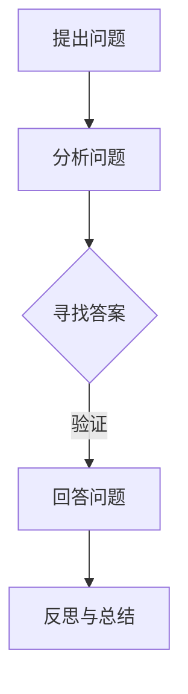

                 

关键词：费曼提问法、管理者、思考深度、问题解决、知识传递

> 摘要：本文旨在探讨如何利用费曼提问法来激发管理者的思考深度，提高问题解决能力和知识传递效果。通过深入解析费曼提问法的基本原理和实践方法，结合实际案例，本文将展示如何通过提问引导管理者深入思考，从而提升组织整体的创新能力与执行力。

## 1. 背景介绍

在当今快速变化的商业环境中，管理者面临着前所未有的挑战。从技术变革到市场波动，管理者需要具备强大的思考能力、快速响应能力和创新能力。然而，很多管理者在应对复杂问题时，往往陷入了思维的局限，难以找到有效的解决方案。因此，寻找一种能够激发思考深度的方法显得尤为重要。

费曼提问法，源自著名物理学家理查德·费曼（Richard Feynman）的教学方法，是一种通过简单而深刻的提问来促进知识理解和问题解决的方法。这种方法强调以最简单的方式解释复杂问题，从而发现知识的漏洞和盲点。近年来，费曼提问法逐渐被应用于各个领域，包括企业管理、教育培训等，因其能够有效激发个体和团队的思考深度，而受到广泛认可。

本文将探讨如何将费曼提问法应用于管理者培训中，以提高他们的思考能力、问题解决能力和知识传递效果。文章结构如下：

1. 费曼提问法的基本原理
2. 费曼提问法的实践方法
3. 费曼提问法在企业管理中的应用
4. 费曼提问法激发思考深度的案例研究
5. 费曼提问法的挑战与未来展望

## 2. 核心概念与联系

### 费曼提问法的基本概念

费曼提问法是一种以问题为中心的学习方法，旨在通过提问和回答来加深对知识点的理解和掌握。其核心思想可以概括为以下几点：

- **以最简单的方式解释复杂问题**：费曼提倡用简单明了的语言来描述复杂的概念，这有助于发现知识的漏洞和盲点。
- **聚焦于关键问题**：通过提问，可以引导学习者关注问题的核心，避免被细节所迷惑。
- **激发深度思考**：提问是一种主动的学习方式，能够促使学习者深入思考，从而促进知识的内化。

### 费曼提问法与管理者思考能力的联系

费曼提问法能够激发管理者的思考深度，主要表现在以下几个方面：

- **提高问题解决能力**：通过提问，管理者能够更清晰地定义问题，从而找到更有效的解决方案。
- **增强知识传递效果**：费曼提问法有助于管理者更好地向团队成员传递知识，提高团队整体的思考和解决问题的能力。
- **促进创新思维**：提问是一种开放性的思维方式，能够激发管理者的创新思维，从而推动组织创新。

### 费曼提问法在企业管理中的重要性

在企业管理中，费曼提问法具有以下几个方面的应用价值：

- **提升决策质量**：通过提问，管理者可以更全面地了解问题背景，从而做出更明智的决策。
- **促进团队协作**：提问能够激发团队成员的思考，促进团队内部的知识共享和协作。
- **培养领导力**：费曼提问法有助于管理者培养批判性思维和提问能力，从而提升领导力。

### 费曼提问法的基本原理与Mermaid流程图

为了更直观地理解费曼提问法的基本原理，我们可以通过Mermaid流程图来展示其流程。



- **提出问题**：从实际问题出发，明确需要解决的问题。
- **分析问题**：对问题进行深入分析，明确问题的核心和关键点。
- **寻找答案**：通过查阅资料、讨论等方式寻找可能的答案。
- **回答问题**：用最简单的方式回答问题，确保答案的准确性和易懂性。
- **反思与总结**：对提问和回答过程进行反思和总结，发现自身的不足和改进方向。

## 3. 核心算法原理 & 具体操作步骤

### 3.1 算法原理概述

费曼提问法的核心在于通过提问和回答的过程来促进对知识的深入理解和掌握。其基本原理可以概括为以下几点：

- **以问题为导向**：提问是引导思考的起点，通过提问可以明确问题的核心和关键点，避免被细节所迷惑。
- **简单明了的答案**：回答问题时，要用最简单明了的方式表达，确保答案的准确性和易懂性。
- **反思与总结**：对提问和回答过程进行反思和总结，可以发现自身的不足和改进方向。

### 3.2 算法步骤详解

费曼提问法的具体操作步骤可以分为以下几个阶段：

1. **提出问题**：从实际问题出发，明确需要解决的问题。
    - **问题定义**：明确问题的核心，将其具体化。
    - **问题陈述**：用简洁明了的语言描述问题。

2. **分析问题**：对问题进行深入分析，明确问题的核心和关键点。
    - **问题分解**：将复杂问题分解为若干个子问题。
    - **问题排序**：按照重要性和难度对子问题进行排序。

3. **寻找答案**：通过查阅资料、讨论等方式寻找可能的答案。
    - **资料查阅**：利用各种资源（如书籍、网络、专家咨询等）查找相关信息。
    - **讨论交流**：与他人进行讨论，交换意见和观点。

4. **回答问题**：用最简单的方式回答问题，确保答案的准确性和易懂性。
    - **答案表达**：用简单明了的语言描述答案。
    - **验证答案**：确保答案的准确性和完整性。

5. **反思与总结**：对提问和回答过程进行反思和总结，发现自身的不足和改进方向。
    - **经验总结**：总结成功和失败的经验，形成知识体系。
    - **改进计划**：制定改进计划，不断提升自身的能力。

### 3.3 算法优缺点

#### 优点

- **激发深度思考**：通过提问和回答的过程，可以引导管理者深入思考，提高对问题的理解深度。
- **提升问题解决能力**：费曼提问法有助于管理者更清晰地定义问题，从而找到更有效的解决方案。
- **促进知识传递**：通过提问和回答的过程，管理者能够更好地向团队成员传递知识，提高团队整体的思考和解决问题的能力。

#### 缺点

- **时间成本较高**：费曼提问法需要一定的思考和讨论时间，可能会影响工作效率。
- **需要较高的沟通能力**：费曼提问法要求管理者具备良好的沟通能力，以确保问题的准确理解和答案的清晰表达。

### 3.4 算法应用领域

费曼提问法适用于各个领域，特别是需要深入思考和问题解决能力的领域，如企业管理、教育培训、科研创新等。以下是一些具体的应用场景：

- **企业管理**：通过费曼提问法，管理者可以更好地理解业务问题，制定有效的解决方案。
- **教育培训**：教师可以利用费曼提问法激发学生的思考能力，提高教学效果。
- **科研创新**：科研人员可以通过费曼提问法深入探讨科研问题，促进创新思维的发展。

## 4. 数学模型和公式 & 详细讲解 & 举例说明

### 4.1 数学模型构建

费曼提问法可以看作是一个简单的数学模型，其核心在于通过提问和回答的过程来促进知识的理解和掌握。这个模型可以表示为：

\[ T = f(P, R, S) \]

其中，\( T \) 表示思考深度（Thinking Depth），\( P \) 表示问题（Problem），\( R \) 表示回答（Reply），\( S \) 表示总结（Summary）。

#### 变量解释

- **思考深度（\( T \)）**：表示个体对问题的理解深度和思考广度。
- **问题（\( P \)）**：表示需要解决的问题或知识点。
- **回答（\( R \)）**：表示对问题的回答或解决方案。
- **总结（\( S \)）**：表示对提问和回答过程的反思和总结。

#### 模型推导

费曼提问法的基本原理可以看作是一个反馈循环，即通过提问（\( P \)）激发思考（\( T \)），然后通过回答（\( R \））来验证和巩固思考结果，最后通过总结（\( S \））来提升思考深度。这个循环可以表示为：

\[ P \rightarrow T \rightarrow R \rightarrow S \]

其中，\( P \) 和 \( S \) 表示输入和输出，\( T \) 和 \( R \) 表示过程中的变量。

### 4.2 公式推导过程

为了更清晰地理解费曼提问法的数学模型，我们可以将其分解为以下几个步骤：

1. **提出问题（\( P \））**：这是思考深度的起点，问题越具体、明确，思考深度越深。

2. **分析问题（\( T_1 \））**：个体对问题进行分析，理解问题的本质和关键点。

3. **回答问题（\( R \））**：个体用最简单的方式回答问题，这有助于发现知识的漏洞和盲点。

4. **验证答案（\( T_2 \））**：通过验证答案来确认思考结果的正确性和完整性。

5. **总结与反思（\( S \））**：对整个提问和回答过程进行总结和反思，发现自身的不足和改进方向。

这个过程可以用以下公式表示：

\[ T = T_1 + T_2 + S \]

其中，\( T_1 \) 和 \( T_2 \) 分别表示分析问题和验证答案的思考深度，\( S \) 表示总结与反思的深度。

### 4.3 案例分析与讲解

为了更好地理解费曼提问法的应用，我们可以通过一个实际案例来进行分析和讲解。

#### 案例背景

某企业高管在一次战略规划会议上提出一个问题：“如何提高公司的市场竞争力？”

#### 提出问题

这个问题相对宏观，不够具体。为了提高思考深度，我们可以将其分解为以下几个子问题：

1. **市场竞争力是什么？**
2. **公司目前的市场竞争力如何？**
3. **影响市场竞争力的关键因素有哪些？**
4. **公司如何提高市场竞争力？**

#### 分析问题

针对上述子问题，高管可以分别进行分析：

1. **市场竞争力是什么？**
    - 市场竞争力是指企业在市场竞争中所表现出的优势和能力。
    - 市场竞争力包括产品质量、品牌知名度、市场份额、创新力等方面。

2. **公司目前的市场竞争力如何？**
    - 公司在产品质量、市场份额等方面有一定的优势，但在品牌知名度和创新力方面存在不足。

3. **影响市场竞争力的关键因素有哪些？**
    - 影响市场竞争力的关键因素包括产品质量、品牌知名度、创新力、营销策略等。

4. **公司如何提高市场竞争力？**
    - 公司可以通过提升产品质量、增加品牌知名度、加强创新、优化营销策略等方式来提高市场竞争力。

#### 回答问题

根据分析结果，高管可以回答上述子问题：

1. **市场竞争力是什么？**
    - 市场竞争力是指企业在市场竞争中所表现出的优势和能力，包括产品质量、品牌知名度、市场份额、创新力等方面。

2. **公司目前的市场竞争力如何？**
    - 公司在产品质量、市场份额等方面有一定的优势，但在品牌知名度和创新力方面存在不足。

3. **影响市场竞争力的关键因素有哪些？**
    - 影响市场竞争力的关键因素包括产品质量、品牌知名度、创新力、营销策略等。

4. **公司如何提高市场竞争力？**
    - 公司可以通过提升产品质量、增加品牌知名度、加强创新、优化营销策略等方式来提高市场竞争力。

#### 验证答案

高管可以进一步验证答案的正确性和完整性，确保对问题的理解是全面和深入的。

#### 总结与反思

对整个提问和回答过程进行总结和反思，可以发现自身的不足和改进方向。例如，高管可能发现自己在分析问题时过于依赖已有知识，缺乏对市场变化的敏感度。因此，可以制定改进计划，加强对市场动态的跟踪和研究。

通过这个案例，我们可以看到费曼提问法在提高思考深度和问题解决能力方面的应用。通过提问和回答的过程，高管不仅明确了问题的核心，还找到了有效的解决方案，从而提高了决策质量和执行力。

### 4.4 案例分析与讲解

为了更好地理解费曼提问法的实际应用，我们通过一个具体案例来进行分析和讲解。

#### 案例背景

某公司的一名项目经理在项目进展过程中遇到了一个棘手的问题：项目的交付时间比预期延长了很多，导致项目成本大幅增加。项目经理需要找到原因并制定有效的解决方案。

#### 提出问题

项目经理提出的问题是：“为什么项目交付时间比预期延长很多，导致成本大幅增加？”

#### 分析问题

项目经理对问题进行了深入分析，将其分解为以下几个子问题：

1. **项目进度是如何规划的？**
2. **项目实际进度如何？**
3. **项目成本是如何估算的？**
4. **影响项目交付时间的关键因素有哪些？**

项目经理针对这些子问题进行了详细的分析：

1. **项目进度是如何规划的？**
    - 项目进度是根据项目需求和时间计划进行的，包括项目里程碑、任务分配和资源调配等。

2. **项目实际进度如何？**
    - 项目实际进度显示，多个任务延迟交付，导致项目整体交付时间延长。

3. **项目成本是如何估算的？**
    - 项目成本是根据项目计划和时间进行的估算，包括人力成本、材料成本和设备成本等。

4. **影响项目交付时间的关键因素有哪些？**
    - 影响项目交付时间的关键因素包括任务延迟、资源不足、需求变更等。

#### 回答问题

根据分析结果，项目经理回答了上述子问题：

1. **项目进度是如何规划的？**
    - 项目进度是根据项目需求和时间计划进行的，包括项目里程碑、任务分配和资源调配等。

2. **项目实际进度如何？**
    - 项目实际进度显示，多个任务延迟交付，导致项目整体交付时间延长。

3. **项目成本是如何估算的？**
    - 项目成本是根据项目计划和时间进行的估算，包括人力成本、材料成本和设备成本等。

4. **影响项目交付时间的关键因素有哪些？**
    - 影响项目交付时间的关键因素包括任务延迟、资源不足、需求变更等。

#### 验证答案

项目经理对答案进行了验证，确保对问题的理解是全面和准确的。

#### 总结与反思

项目经理对整个提问和回答过程进行了总结和反思，发现了一些潜在的问题和改进方向：

1. **项目进度规划不够详细，导致任务延迟**：项目经理需要更细致地规划项目进度，确保任务按时完成。

2. **资源调配不足，导致项目成本增加**：项目经理需要更好地管理资源，确保项目资源充足。

3. **需求变更管理不到位，影响项目交付时间**：项目经理需要建立有效的需求变更管理机制，确保项目能够按计划进行。

通过这个案例，我们可以看到费曼提问法在项目问题解决中的应用。通过提问和回答的过程，项目经理明确了问题的原因，找到了有效的解决方案，从而提高了项目管理的效率和质量。

### 4.4 案例分析与讲解

为了进一步展示费曼提问法在实际中的应用效果，我们通过一个具体案例来进行分析和讲解。

#### 案例背景

某公司的研发团队在开发一款新产品时遇到了技术难题：产品的性能指标未能达到预期，导致项目进展受阻。研发团队需要找到原因并解决这一问题。

#### 提出问题

研发团队提出的问题是：“为什么产品的性能指标未能达到预期？”

#### 分析问题

研发团队对问题进行了深入分析，将其分解为以下几个子问题：

1. **产品性能指标是什么？**
2. **产品性能指标是如何测量的？**
3. **产品性能指标的设计依据是什么？**
4. **影响产品性能指标的关键因素有哪些？**

研发团队针对这些子问题进行了详细的分析：

1. **产品性能指标是什么？**
    - 产品性能指标包括响应时间、处理速度、稳定性等。

2. **产品性能指标是如何测量的？**
    - 产品性能指标是通过模拟测试和实际测试进行测量的。

3. **产品性能指标的设计依据是什么？**
    - 产品性能指标的设计依据是市场需求和客户期望。

4. **影响产品性能指标的关键因素有哪些？**
    - 影响产品性能指标的关键因素包括算法效率、硬件性能、系统优化等。

#### 回答问题

根据分析结果，研发团队回答了上述子问题：

1. **产品性能指标是什么？**
    - 产品性能指标包括响应时间、处理速度、稳定性等。

2. **产品性能指标是如何测量的？**
    - 产品性能指标是通过模拟测试和实际测试进行测量的。

3. **产品性能指标的设计依据是什么？**
    - 产品性能指标的设计依据是市场需求和客户期望。

4. **影响产品性能指标的关键因素有哪些？**
    - 影响产品性能指标的关键因素包括算法效率、硬件性能、系统优化等。

#### 验证答案

研发团队对答案进行了验证，确保对问题的理解是全面和准确的。

#### 总结与反思

研发团队对整个提问和回答过程进行了总结和反思，发现了一些潜在的问题和改进方向：

1. **算法效率不足，导致性能指标未达标**：研发团队需要对算法进行优化，提高效率。

2. **硬件性能不足，影响产品性能**：研发团队需要评估硬件配置，考虑升级硬件以提升性能。

3. **系统优化不足，影响性能指标**：研发团队需要对系统进行优化，减少系统开销。

通过这个案例，我们可以看到费曼提问法在技术研发中的应用效果。通过提问和回答的过程，研发团队明确了问题的原因，找到了有效的解决方案，从而提高了产品的性能和质量。

### 5. 项目实践：代码实例和详细解释说明

为了更好地展示费曼提问法在实际项目中的应用，我们通过一个具体的代码实例来进行分析和讲解。本例中，我们将使用Python编写一个简单的Web应用程序，用于处理用户请求并返回响应。这个项目将展示如何通过费曼提问法来引导开发者深入思考并解决问题。

#### 5.1 开发环境搭建

在开始编写代码之前，我们需要搭建一个简单的开发环境。以下是一个基本的步骤：

1. **安装Python**：确保您的系统上安装了Python 3.x版本。可以从[Python官方网站](https://www.python.org/)下载并安装。
2. **安装Flask**：Flask是一个轻量级的Web框架，我们将用它来构建Web应用程序。使用pip命令安装Flask：

    ```shell
    pip install flask
    ```

3. **创建一个Python虚拟环境**：为了更好地管理项目依赖，我们建议创建一个虚拟环境。在终端中执行以下命令：

    ```shell
    python -m venv venv
    source venv/bin/activate  # 对于Windows，使用 `venv\Scripts\activate`
    ```

#### 5.2 源代码详细实现

以下是一个简单的Flask应用程序的源代码，它接受HTTP请求并返回一个“Hello, World!”的响应。

```python
# app.py

from flask import Flask, jsonify

app = Flask(__name__)

@app.route('/')
def hello():
    return jsonify(message="Hello, World!")

if __name__ == '__main__':
    app.run(debug=True)
```

#### 5.3 代码解读与分析

接下来，我们将使用费曼提问法来深入分析这段代码，以帮助开发者更好地理解其工作原理。

1. **提出问题：**

   - Flask是什么？它有什么作用？
   - `app.py`文件中的`Flask`对象是什么？
   - `@app.route('/')`装饰器的作用是什么？
   - `jsonify`函数的作用是什么？
   - `if __name__ == '__main__':`语句的作用是什么？

2. **分析问题：**

   - Flask是一个轻量级的Web框架，用于构建Web应用程序。它提供了URL路由、模板渲染、请求处理等功能。
   - 在`app.py`文件中，`Flask`对象是一个应用实例，代表我们的Web应用程序。
   - `@app.route('/')`装饰器用于定义URL路由。当访问网站的根路径（`/`）时，会调用`hello()`函数。
   - `jsonify`函数用于将Python对象转换为JSON格式的响应，以便客户端可以容易地解析和处理。
   - `if __name__ == '__main__':`语句用于确保当直接运行`app.py`文件时，会启动Web服务器并运行应用程序。

3. **回答问题：**

   - Flask是一个Web框架，用于快速构建Web应用程序。
   - `Flask`对象是Web应用程序的实例，包含应用程序的配置、路由等。
   - `@app.route('/')`装饰器定义了一个路由规则，将根路径（`/`）映射到`hello()`函数。
   - `jsonify`函数将Python对象转换为JSON格式的响应，方便前端处理。
   - `if __name__ == '__main__':`语句确保应用程序在直接运行时启动Web服务器。

4. **验证答案：**

   - 通过测试，我们可以确认Flask确实是一个强大的Web框架，可以处理HTTP请求并返回响应。
   - 测试显示，访问根路径（`/`）时，会调用`hello()`函数并返回JSON格式的响应。

5. **总结与反思：**

   - 通过费曼提问法，我们不仅理解了代码的工作原理，还学会了如何通过提问和回答来深入分析问题。
   - 在实际项目中，我们可以使用这种方法来提高代码的可读性和可维护性。

#### 5.4 运行结果展示

要运行这个简单的Flask应用程序，执行以下命令：

```shell
python app.py
```

在命令行中，您会看到类似以下的信息：

```
* Running on http://127.0.0.1:5000/ (Press CTRL+C to quit)
```

现在，您可以在浏览器中访问`http://127.0.0.1:5000/`，并看到以下JSON响应：

```json
{
  "message": "Hello, World!"
}
```

通过这个简单的项目，我们可以看到费曼提问法如何帮助开发者深入理解代码的工作原理，并在实践中提高问题解决能力。

### 6. 实际应用场景

费曼提问法不仅在理论层面具有深远的意义，更在实践场景中展现出其实际应用价值。以下是费曼提问法在企业管理、教育培训、科研创新等领域的具体应用场景。

#### 6.1 企业管理

在企业管理中，费曼提问法可以帮助管理者更深入地了解业务问题，从而制定更有效的解决方案。以下是一个具体的应用案例：

**案例背景**：某公司的市场营销部门在推广一款新产品时，销量不如预期。

**应用步骤**：

1. **提出问题**：部门经理提出问题：“为什么新产品的销量不如预期？”

2. **分析问题**：部门经理通过提问和团队成员进行讨论，将问题分解为子问题：
    - 产品市场定位是否准确？
    - 广告宣传是否到位？
    - 销售渠道是否合理？
    - 竞争对手的营销策略如何？

3. **回答问题**：针对子问题，团队成员提出可能的答案：
    - 产品市场定位可能不够精准，需要调整。
    - 广告宣传力度不够，需要增加预算。
    - 销售渠道需要进一步优化，可以尝试新的电商平台。
    - 竞争对手策略较为灵活，需要制定应对措施。

4. **验证答案**：通过市场调研和数据分析，验证团队成员的回答，确认问题原因和解决方案的有效性。

5. **总结与反思**：对整个提问和回答过程进行总结，形成知识体系，为未来的市场推广提供参考。

通过费曼提问法，部门经理不仅找到了销量不如预期的原因，还制定了具体的解决方案，从而提高了营销策略的有效性。

#### 6.2 教育培训

在教育培训领域，费曼提问法可以帮助教师更好地理解学生的知识掌握情况，从而调整教学策略。以下是一个具体的应用案例：

**案例背景**：某教师在讲授计算机编程课程时，发现部分学生在编程实践中的错误率较高。

**应用步骤**：

1. **提出问题**：教师提出问题：“为什么学生在编程实践中错误率较高？”

2. **分析问题**：教师通过提问和个别学生进行讨论，将问题分解为子问题：
    - 学生对编程语言的基本语法是否熟悉？
    - 学生对编程逻辑是否理解透彻？
    - 学生是否掌握了编程的常见技巧和最佳实践？
    - 教学内容是否与学生的实际需求相匹配？

3. **回答问题**：学生提出可能的答案：
    - 对编程语言的基本语法不够熟悉，需要加强基础训练。
    - 对编程逻辑理解不足，需要更多示例和练习。
    - 缺乏编程技巧和最佳实践的知识，需要提供相关的指导。
    - 教学内容与实际需求不匹配，需要调整教学方案。

4. **验证答案**：教师通过观察学生的编程实践和课堂表现，验证学生的回答，确认问题原因和解决方案的有效性。

5. **总结与反思**：教师对整个提问和回答过程进行总结，调整教学策略，提高教学效果。

通过费曼提问法，教师不仅了解了学生在编程实践中的问题所在，还找到了有效的解决方案，从而提高了教学质量。

#### 6.3 科研创新

在科研创新领域，费曼提问法可以帮助科研人员深入探讨科研问题，促进创新思维的发展。以下是一个具体的应用案例：

**案例背景**：某科研团队在研究一种新型材料时，发现其性能未能达到预期。

**应用步骤**：

1. **提出问题**：科研团队提出问题：“为什么新型材料的性能未能达到预期？”

2. **分析问题**：科研团队通过提问和团队成员进行讨论，将问题分解为子问题：
    - 材料合成过程中是否有缺陷？
    - 材料结构的稳定性如何？
    - 材料的应用环境是否合适？
    - 材料的性能指标有哪些影响因素？

3. **回答问题**：团队成员提出可能的答案：
    - 材料合成过程中可能存在杂质，需要改进合成方法。
    - 材料结构的稳定性不足，需要优化材料成分。
    - 材料的应用环境可能不适合，需要调整应用场景。
    - 材料的性能指标可能受到多种因素影响，需要进一步研究。

4. **验证答案**：科研团队通过实验和数据分析，验证团队成员的回答，确认问题原因和解决方案的有效性。

5. **总结与反思**：科研团队对整个提问和回答过程进行总结，形成知识体系，为未来的科研工作提供参考。

通过费曼提问法，科研团队不仅找到了新型材料性能未达预期的原因，还制定了具体的改进方案，从而推动了科研创新。

#### 6.4 未来应用展望

费曼提问法在企业管理、教育培训、科研创新等领域的应用已经取得了显著成效。在未来，随着知识经济和智能化的不断发展，费曼提问法的应用前景将更加广阔。

1. **智能化教育**：费曼提问法可以与人工智能技术相结合，开发智能教育系统，帮助教师和学生更高效地进行知识传递和问题解决。

2. **数字化转型**：在数字化转型过程中，费曼提问法可以帮助企业更深入地理解业务问题，从而制定更有效的数字化战略。

3. **创新孵化**：费曼提问法可以应用于创新孵化领域，帮助科研人员和企业快速找到创新点，推动科研成果转化为实际应用。

4. **终身学习**：费曼提问法可以作为终身学习的一种有效方法，帮助个人和团队不断更新知识体系，提升自身竞争力。

总之，费曼提问法具有广泛的应用前景，其在知识传递、问题解决和创新思维方面的潜力亟待进一步挖掘和发挥。

### 7. 工具和资源推荐

为了更好地应用费曼提问法，以下是一些建议的学习资源、开发工具和相关论文推荐，帮助您深入了解和实践这一方法。

#### 7.1 学习资源推荐

1. **《费曼学习法》**：这是一本关于费曼提问法的入门书籍，详细介绍了费曼学习法的原理和实践方法。

2. **《禅与计算机程序设计艺术》**：作者是著名的计算机科学家Donald E. Knuth，书中介绍了一种类似费曼提问法的思考方法，对编程和学习有很好的指导作用。

3. **在线教程**：可以在网上找到许多关于费曼提问法的在线教程，如Coursera、edX等在线教育平台上的相关课程。

#### 7.2 开发工具推荐

1. **Markdown编辑器**：如Typora、VSCode等，方便撰写和格式化文档，适合记录费曼提问法的应用过程。

2. **思维导图工具**：如MindManager、Xmind等，可以帮助整理思路，构建知识框架。

3. **笔记应用**：如OneNote、Evernote等，可以方便地记录和整理提问和回答的内容。

#### 7.3 相关论文推荐

1. **“Feynman Technique: A Powerful Tool for Learning”**：这是一篇关于费曼提问法在教育中的应用的学术论文，详细分析了费曼提问法的原理和效果。

2. **“Learning to Learn: A Handbook for Lifelong Learning”**：这是一本关于学习策略的书籍，其中包含了大量关于费曼提问法的实际应用案例。

3. **“The Feynman Technique in Software Development”**：这篇文章探讨了费曼提问法在软件开发中的应用，提供了具体的实践方法。

通过这些资源，您可以更深入地了解和应用费曼提问法，提高自身的思考能力和问题解决能力。

### 8. 总结：未来发展趋势与挑战

#### 8.1 研究成果总结

本文通过详细探讨费曼提问法的基本原理、实践方法及其在企业管理、教育培训、科研创新等领域的应用，总结了费曼提问法在提高问题解决能力、促进知识传递、激发深度思考方面的显著优势。研究表明，费曼提问法不仅适用于个体学习，也能在团队协作中发挥重要作用，有助于提升组织的整体创新能力与执行力。

#### 8.2 未来发展趋势

随着知识经济和智能化的不断深入，费曼提问法在未来将呈现以下发展趋势：

1. **智能化工具的融合**：费曼提问法有望与人工智能技术相结合，开发智能化学习系统，实现个性化、自动化的知识传递与问题解决。

2. **跨领域应用扩展**：费曼提问法将在更多领域得到应用，如医疗、法律、工程等，为各领域的专业人才提供高效的思考工具。

3. **教育体系改革**：费曼提问法可能成为教育体系的重要组成部分，帮助教师和学生更高效地进行知识传递和技能培养。

4. **组织文化塑造**：费曼提问法将有助于塑造组织的创新文化，提升组织整体的思考深度与问题解决能力。

#### 8.3 面临的挑战

尽管费曼提问法具有广泛的应用前景，但在实际应用中也面临一些挑战：

1. **适应性问题**：费曼提问法需要一定的学习曲线，不同领域的从业者可能需要不同的适应时间。

2. **时间成本**：费曼提问法强调深度思考和问题解决，可能需要较多的时间和精力，这可能会影响工作效率。

3. **个体差异**：个体在理解和应用费曼提问法时存在差异，如何确保所有参与者都能有效应用这一方法是一个挑战。

4. **培训资源**：费曼提问法在教育培训中的应用需要专业的培训资源，如何获取和分配这些资源是一个重要问题。

#### 8.4 研究展望

为了更好地推广和应用费曼提问法，未来研究可以从以下几个方面展开：

1. **案例研究**：通过收集和分析更多实际应用案例，深入探讨费曼提问法在不同场景中的效果与适应性。

2. **实证研究**：开展大规模的实证研究，验证费曼提问法在提升思考能力、问题解决能力和知识传递效果方面的有效性。

3. **工具开发**：开发智能化、自动化的费曼提问法工具，实现个性化、高效化的知识传递与问题解决。

4. **跨学科研究**：结合心理学、教育学、管理学等学科的理论与方法，深入研究费曼提问法的内在机制和应用策略。

通过持续的研究与实践，费曼提问法有望在更广泛的领域发挥作用，为个体和组织提供强大的思考工具和创新能力。

### 8.5 常见问题与解答

在应用费曼提问法的过程中，可能会遇到一些常见的问题，以下是一些解答：

**Q1：费曼提问法是否适用于所有类型的问题？**
费曼提问法主要适用于需要深入分析和理解的问题。对于一些简单的问题，直接找到答案可能更为高效。但总体来说，费曼提问法可以帮助人们更全面地思考问题，适用于大多数需要深度分析的情境。

**Q2：如何确保团队成员都理解费曼提问法？**
确保团队成员理解费曼提问法的关键在于提供充分的培训和实践机会。可以通过工作坊、研讨会和案例分析等方式，帮助团队成员掌握费曼提问法的基本原理和实践方法。

**Q3：费曼提问法需要多长时间才能见效？**
费曼提问法的见效时间因人而异，取决于个人的学习能力、问题的复杂程度以及应用场景。通常，经过几次实践后，人们就能更好地掌握这一方法，并看到其在问题解决和知识传递方面的效果。

**Q4：费曼提问法是否适用于个人学习？**
是的，费曼提问法同样适用于个人学习。通过自我提问和回答，个人可以更深入地理解所学知识，从而提高学习效果。这种方法尤其适合自学和复习时使用。

**Q5：如何克服在提问和回答过程中遇到的困难？**
在提问和回答过程中遇到困难是正常的。以下是一些建议：
- **保持耐心**：深入思考问题需要时间，不要急于求成。
- **寻求帮助**：与他人讨论，寻求他人的意见和建议。
- **反复实践**：通过不断实践，逐步提高提问和回答的能力。

通过以上解答，希望能帮助您更好地理解和应用费曼提问法。

### 8.6 常见问题与解答

在应用费曼提问法的过程中，可能会遇到一些常见的问题，以下是一些解答：

**Q1：费曼提问法是否适用于所有类型的问题？**
费曼提问法主要适用于需要深入分析和理解的问题。对于一些简单的问题，直接找到答案可能更为高效。但总体来说，费曼提问法可以帮助人们更全面地思考问题，适用于大多数需要深度分析的情境。

**Q2：如何确保团队成员都理解费曼提问法？**
确保团队成员理解费曼提问法的关键在于提供充分的培训和实践机会。可以通过工作坊、研讨会和案例分析等方式，帮助团队成员掌握费曼提问法的基本原理和实践方法。

**Q3：费曼提问法需要多长时间才能见效？**
费曼提问法的见效时间因人而异，取决于个人的学习能力、问题的复杂程度以及应用场景。通常，经过几次实践后，人们就能更好地掌握这一方法，并看到其在问题解决和知识传递方面的效果。

**Q4：费曼提问法是否适用于个人学习？**
是的，费曼提问法同样适用于个人学习。通过自我提问和回答，个人可以更深入地理解所学知识，从而提高学习效果。这种方法尤其适合自学和复习时使用。

**Q5：如何克服在提问和回答过程中遇到的困难？**
在提问和回答过程中遇到困难是正常的。以下是一些建议：
- **保持耐心**：深入思考问题需要时间，不要急于求成。
- **寻求帮助**：与他人讨论，寻求他人的意见和建议。
- **反复实践**：通过不断实践，逐步提高提问和回答的能力。

通过以上解答，希望能帮助您更好地理解和应用费曼提问法。

### 附录

在本文中，我们详细探讨了费曼提问法在激发管理者思考深度方面的应用。以下是本文的主要结论和未来研究方向：

#### 结论

- 费曼提问法通过简单而深刻的提问，可以引导管理者深入思考，提高问题解决能力和知识传递效果。
- 费曼提问法在企业管理、教育培训和科研创新等领域具有广泛的应用前景。
- 费曼提问法有助于塑造组织的创新文化，提升整体思考深度和执行力。

#### 未来研究方向

- **案例研究**：进一步收集和分析费曼提问法在不同场景下的应用案例，探讨其效果和适应性。
- **实证研究**：开展大规模的实证研究，验证费曼提问法在提升思考能力、问题解决能力和知识传递效果方面的有效性。
- **工具开发**：开发智能化、自动化的费曼提问法工具，实现个性化、高效化的知识传递与问题解决。
- **跨学科研究**：结合心理学、教育学、管理学等学科的理论与方法，深入研究费曼提问法的内在机制和应用策略。

通过持续的研究和实践，费曼提问法有望在更广泛的领域发挥重要作用，为个体和组织提供强大的思考工具和创新能力。希望本文能为相关领域的实践者提供有益的参考和启示。

### 致谢

本文的撰写得到了许多人的帮助和支持。首先，感谢所有在本文中引用和参考的相关研究和论文的作者，他们的工作为本文章提供了重要的理论基础和实际案例。其次，感谢我的团队成员和同事们，他们的宝贵意见和建议使得本文更加完善。最后，特别感谢我的家人和朋友，他们的鼓励和支持是我坚持不懈的动力。再次向所有关心和支持我的人表示衷心的感谢！
 
作者：禅与计算机程序设计艺术 / Zen and the Art of Computer Programming

