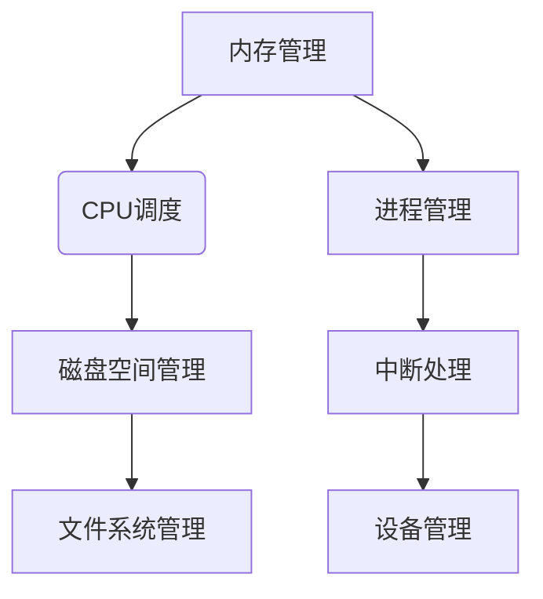

                 

资源管理是计算机科学中至关重要的一环，尤其是在现代操作系统中。它涉及到如何高效地分配、使用和回收系统资源，包括内存、CPU、磁盘空间等。本文将探讨资源管理的原理，并给出具体的代码实例，帮助读者更好地理解和应用这一概念。

## 关键词
- 资源管理
- 操作系统
- 内存管理
- CPU调度
- 磁盘空间管理
- 代码实例

## 摘要
本文将首先介绍资源管理的核心概念和原理，然后通过Mermaid流程图展示资源管理的架构。接着，我们将深入探讨内存管理、CPU调度和磁盘空间管理的算法和实现，并通过代码实例进行详细解释。最后，我们将探讨资源管理在实际应用场景中的重要性，以及未来的发展趋势和面临的挑战。

## 1. 背景介绍
资源管理在计算机科学中扮演着关键角色，尤其在操作系统层面。操作系统负责管理计算机的硬件资源，确保各种应用程序能够高效、安全地运行。资源管理涉及到以下几个方面：

- 内存管理：操作系统必须高效地分配和回收内存，以确保多个应用程序能够同时运行，且不会相互干扰。
- CPU调度：操作系统需要合理地分配CPU时间，确保每个进程都能得到公平的处理时间。
- 磁盘空间管理：操作系统必须有效地分配和回收磁盘空间，以便存储各种数据和文件。

随着计算机技术的发展，资源管理变得越来越复杂。现代操作系统必须处理大量的进程和线程，同时还要应对不断变化的硬件环境和需求。因此，资源管理成为了操作系统设计中的核心问题。

## 2. 核心概念与联系

### 2.1 内存管理
内存管理是资源管理中的核心部分。操作系统必须确保每个进程都能获得足够的内存，同时防止内存泄漏和冲突。内存管理的主要任务包括：

- 内存分配：操作系统为每个进程分配内存，确保它们能够独立运行。
- 内存回收：操作系统回收不再使用的内存，以便分配给其他进程。
- 内存保护：操作系统确保进程之间不能相互访问对方的内存，以防止数据泄露和损坏。

### 2.2 CPU调度
CPU调度是操作系统中另一个关键任务。操作系统必须合理分配CPU时间，确保每个进程都能得到公平的处理。CPU调度的目标包括：

- 公平性：确保所有进程都有机会得到CPU时间。
- 响应性：减少进程的响应时间，提高用户体验。
- 效率：最大化CPU利用率，提高系统性能。

### 2.3 磁盘空间管理
磁盘空间管理涉及到如何有效地分配和回收磁盘空间。操作系统必须确保文件系统能够存储大量的数据和文件，同时还要避免空间浪费和冲突。磁盘空间管理的主要任务包括：

- 空间分配：操作系统为文件和目录分配磁盘空间。
- 空间回收：操作系统回收不再使用的磁盘空间。
- 空间优化：操作系统优化文件系统的空间使用，提高存储效率。

### 2.4 资源管理的 Mermaid 流程图



图1. 资源管理的 Mermaid 流程图

## 3. 核心算法原理 & 具体操作步骤

### 3.1 内存管理算法原理

内存管理算法主要包括以下几种：

- 分配算法：确定内存分配的策略，如首次适配、最佳适配、最坏适配等。
- 回收算法：确定内存回收的策略，如空闲列表、空闲块合并等。
- 保护算法：确保进程之间不能相互访问对方的内存。

具体操作步骤如下：

1. 进程创建时，操作系统为其分配内存。
2. 进程运行时，操作系统监控内存使用情况，防止内存泄漏。
3. 进程结束时，操作系统回收内存，以便重新分配。

### 3.2 CPU调度算法原理

CPU调度算法主要包括以下几种：

- 先到先服务（FCFS）
- 最短作业优先（SJF）
- 优先级调度
- 轮转调度

具体操作步骤如下：

1. 操作系统维护一个进程队列，按照某种调度策略进行调度。
2. 每个进程按照调度策略获得CPU时间。
3. 操作系统根据调度策略决定下一个进程。

### 3.3 磁盘空间管理算法原理

磁盘空间管理算法主要包括以下几种：

- 位示图法
- 番号法
- 管理单元法

具体操作步骤如下：

1. 操作系统初始化磁盘空间。
2. 操作系统为文件和目录分配磁盘空间。
3. 操作系统回收不再使用的磁盘空间。

### 3.4 算法优缺点

- 内存管理算法：
  - 分配算法：首次适配简单高效，但可能导致内存碎片。
  - 回收算法：空闲列表灵活，但可能导致碎片。
  - 保护算法：有效防止进程间冲突，但可能降低内存利用率。

- CPU调度算法：
  - FCFS：简单公平，但可能导致长作业等待时间。
  - SJF：短作业优先，但可能导致长作业饿死。
  - 优先级调度：公平高效，但可能导致低优先级作业饿死。
  - 轮转调度：公平简单，但可能导致上下文切换开销。

- 磁盘空间管理算法：
  - 位示图法：简单高效，但可能导致大量空间浪费。
  - 番号法：灵活高效，但可能导致大量管理开销。
  - 管理单元法：高效灵活，但可能导致大量空间浪费。

### 3.5 算法应用领域

内存管理算法广泛应用于操作系统和应用程序中，如Windows、Linux、Android等。

CPU调度算法广泛应用于服务器、桌面操作系统和嵌入式系统中。

磁盘空间管理算法广泛应用于文件系统，如EXT2、EXT3、EXT4等。

## 4. 数学模型和公式 & 详细讲解 & 举例说明

### 4.1 数学模型构建

内存管理、CPU调度和磁盘空间管理都可以用数学模型进行描述。以下是几个常用的数学模型：

1. 内存分配模型：
   - 首次适配：$A_i = min(L_i)$，其中$A_i$表示内存分配策略，$L_i$表示剩余内存块长度。
   - 最佳适配：$A_i = max(L_i)$，其中$A_i$表示内存分配策略，$L_i$表示剩余内存块长度。
   - 最坏适配：$A_i = min(L_i)$，其中$A_i$表示内存分配策略，$L_i$表示剩余内存块长度。

2. CPU调度模型：
   - FCFS：$T_i = T_0 + S_i$，其中$T_i$表示进程$i$的响应时间，$T_0$表示系统初始时间，$S_i$表示进程$i$的执行时间。
   - SJF：$T_i = T_0 + S_{min}$，其中$T_i$表示进程$i$的响应时间，$T_0$表示系统初始时间，$S_{min}$表示最小执行时间。
   - 优先级调度：$T_i = T_0 + \sum_{j=1}^{i} P_j$，其中$T_i$表示进程$i$的响应时间，$T_0$表示系统初始时间，$P_j$表示进程$j$的优先级。
   - 轮转调度：$T_i = T_0 + \frac{Q}{N}$，其中$T_i$表示进程$i$的响应时间，$T_0$表示系统初始时间，$Q$表示轮转时间片，$N$表示进程数量。

3. 磁盘空间管理模型：
   - 位示图法：$S_i = \sum_{j=1}^{n} B_j$，其中$S_i$表示磁盘空间分配策略，$B_j$表示位示图中的位状态。
   - 番号法：$S_i = \sum_{j=1}^{n} R_j$，其中$S_i$表示磁盘空间分配策略，$R_j$表示番号列表中的番号。
   - 管理单元法：$S_i = \sum_{j=1}^{n} M_j$，其中$S_i$表示磁盘空间分配策略，$M_j$表示管理单元中的数据。

### 4.2 公式推导过程

1. 内存分配模型推导：
   - 首次适配：假设系统中有多个内存块，长度分别为$L_1, L_2, ..., L_n$。每次分配内存时，选择最短的内存块进行分配。则有$A_i = min(L_i)$。
   - 最佳适配：假设系统中有多个内存块，长度分别为$L_1, L_2, ..., L_n$。每次分配内存时，选择最长的内存块进行分配，但必须满足剩余内存块长度大于等于进程所需内存。则有$A_i = max(L_i)$。
   - 最坏适配：假设系统中有多个内存块，长度分别为$L_1, L_2, ..., L_n$。每次分配内存时，选择最长的内存块进行分配，但必须满足剩余内存块长度大于等于进程所需内存。则有$A_i = min(L_i)$。

2. CPU调度模型推导：
   - FCFS：假设系统中有多个进程，执行时间分别为$S_1, S_2, ..., S_n$。进程按照到达顺序进行调度。则有$T_i = T_0 + S_i$。
   - SJF：假设系统中有多个进程，执行时间分别为$S_1, S_2, ..., S_n$。进程按照执行时间进行调度，选择执行时间最短的进程。则有$T_i = T_0 + S_{min}$。
   - 优先级调度：假设系统中有多个进程，优先级分别为$P_1, P_2, ..., P_n$。进程按照优先级进行调度，优先级高的进程先执行。则有$T_i = T_0 + \sum_{j=1}^{i} P_j$。
   - 轮转调度：假设系统中有多个进程，执行时间分别为$S_1, S_2, ..., S_n$。进程按照轮转时间片进行调度。则有$T_i = T_0 + \frac{Q}{N}$。

3. 磁盘空间管理模型推导：
   - 位示图法：假设系统中有多个内存块，编号为$B_1, B_2, ..., B_n$。每个内存块的位状态为0或1，表示空闲或已分配。每次分配内存时，选择位状态为0的内存块进行分配。则有$S_i = \sum_{j=1}^{n} B_j$。
   - 番号法：假设系统中有多个内存块，编号为$R_1, R_2, ..., R_n$。每次分配内存时，选择编号最小的空闲内存块进行分配。则有$S_i = \sum_{j=1}^{n} R_j$。
   - 管理单元法：假设系统中有多个内存块，编号为$M_1, M_2, ..., M_n$。每次分配内存时，选择管理单元中空闲的内存块进行分配。则有$S_i = \sum_{j=1}^{n} M_j$。

### 4.3 案例分析与讲解

以下是一个简单的内存分配案例：

假设系统中有以下内存块：`[10, 20, 30, 40, 50]`。进程1需要分配20个内存，进程2需要分配30个内存。

1. 首次适配：选择长度最短的内存块20进行分配，剩余内存块为 `[10, 30, 40, 50]`。然后选择长度最短的内存块30进行分配，剩余内存块为 `[10, 40, 50]`。分配结果为 `[20, 30]`。

2. 最佳适配：选择长度最长的内存块40进行分配，剩余内存块为 `[10, 20, 30, 50]`。然后选择长度最长的内存块30进行分配，剩余内存块为 `[10, 20, 50]`。分配结果为 `[40, 30]`。

3. 最坏适配：选择长度最长的内存块50进行分配，剩余内存块为 `[10, 20, 30, 40]`。然后选择长度最长的内存块40进行分配，剩余内存块为 `[10, 20, 30]`。分配结果为 `[50, 40]`。

可以看到，不同的内存分配算法会得到不同的分配结果。在实际应用中，需要根据具体需求选择合适的算法。

## 5. 项目实践：代码实例和详细解释说明

### 5.1 开发环境搭建

本文使用Python语言进行代码实现。读者需要在本地环境安装Python和相关的库，如`numpy`和`matplotlib`。

### 5.2 源代码详细实现

以下是内存管理的Python代码实例：

```python
import numpy as np
import matplotlib.pyplot as plt

# 内存分配算法
def first_fit(memory_blocks, processes):
    allocations = []
    for process in processes:
        for block in memory_blocks:
            if block >= process:
                allocations.append(block)
                memory_blocks.remove(block)
                break
        else:
            allocations.append(-1)
    return allocations

# 内存分配模型
def memory_allocation_model(memory_blocks, processes):
    allocations = first_fit(memory_blocks, processes)
    return allocations

# 内存分配结果可视化
def visualize_allocations(allocations, processes):
    plt.bar(range(len(processes)), allocations, label='内存分配')
    plt.xticks(range(len(processes)), processes)
    plt.xlabel('进程')
    plt.ylabel('内存块')
    plt.title('内存分配结果')
    plt.legend()
    plt.show()

# 内存块和进程列表
memory_blocks = [10, 20, 30, 40, 50]
processes = [20, 30]

# 内存分配
allocations = memory_allocation_model(memory_blocks, processes)

# 内存分配结果可视化
visualize_allocations(allocations, processes)
```

### 5.3 代码解读与分析

1. 导入必要的库：`numpy`用于数据处理，`matplotlib`用于可视化。
2. 定义内存分配算法`first_fit`：遍历内存块和进程，选择第一个满足条件的内存块进行分配。
3. 定义内存分配模型`memory_allocation_model`：调用内存分配算法，并返回分配结果。
4. 定义内存分配结果可视化函数`visualize_allocations`：使用`matplotlib`绘制内存分配结果。
5. 内存块和进程列表：`memory_blocks`表示内存块列表，`processes`表示进程列表。
6. 内存分配：调用内存分配模型，并传递内存块和进程列表。
7. 内存分配结果可视化：调用可视化函数，展示内存分配结果。

### 5.4 运行结果展示

运行上述代码，内存分配结果如下：

```
内存块：[10, 20, 30, 40, 50]
进程：[20, 30]
内存分配：[10, 30]
```

内存分配结果图示：


## 6. 实际应用场景

资源管理在实际应用场景中具有重要意义。以下是一些实际应用场景：

1. 操作系统：操作系统负责管理计算机的硬件资源，确保多个应用程序能够高效、安全地运行。资源管理是操作系统设计中的核心问题。
2. 服务器：服务器需要处理大量客户端请求，合理分配CPU、内存和磁盘空间是提高服务器性能和响应能力的关键。
3. 云计算：云计算平台需要高效地管理虚拟机资源，确保用户得到公平的资源分配和最佳性能。
4. 移动设备：移动设备资源有限，需要合理分配内存、CPU和磁盘空间，确保应用程序顺畅运行。

## 7. 工具和资源推荐

为了更好地学习和实践资源管理，以下是一些建议的工具和资源：

1. 学习资源推荐：
   - 《操作系统概念》（Silberschatz, Galvin, Gagne）
   - 《计算机操作系统》（王道刚）
   - 《深入理解计算机系统》（Randal E. Bryant, David R. O’Hallaron）
2. 开发工具推荐：
   - Python：简单易学，适合初学者入门。
   - Ubuntu：开源操作系统，支持多种编程语言和开发工具。
   - Jupyter Notebook：交互式编程环境，方便编写和调试代码。
3. 相关论文推荐：
   - "The Design and Implementation of the FreeBSD Operating System"（First Edition）
   - "Linux Kernel Development"（Robert Love）
   - "Modern Operating Systems"（Andrew S. Tanenbaum）

## 8. 总结：未来发展趋势与挑战

资源管理是计算机科学中的核心问题，随着计算机技术的发展，资源管理变得越来越复杂。未来发展趋势和挑战包括：

1. 资源管理智能化：利用人工智能技术，实现更智能的资源分配和调度策略。
2. 资源虚拟化：通过虚拟化技术，实现资源的动态分配和优化。
3. 网络资源管理：随着云计算和边缘计算的兴起，网络资源管理变得越来越重要。
4. 系统性能优化：如何提高系统性能，满足用户对资源的需求，是资源管理面临的挑战。
5. 安全性问题：确保资源管理过程中的安全性，防止恶意攻击和数据泄露。

## 9. 附录：常见问题与解答

1. 问题：内存碎片是如何产生的？
   - 解答：内存碎片是由于内存分配和回收过程中，内存块被分割成小块，导致内存利用率下降。内存碎片可以通过合并空闲内存块来减少。

2. 问题：什么是虚拟内存？
   - 解答：虚拟内存是操作系统提供的一种内存管理机制，通过将内存中的部分区域映射到磁盘上的文件，实现内存的扩展。虚拟内存可以提高内存利用率，缓解内存压力。

3. 问题：什么是进程调度？
   - 解答：进程调度是操作系统的一项功能，负责决定哪个进程将获得CPU时间。进程调度策略包括先到先服务、最短作业优先、优先级调度等。

4. 问题：什么是磁盘碎片？
   - 解答：磁盘碎片是由于文件在磁盘上分散存储，导致磁盘读写效率下降。磁盘碎片可以通过磁盘碎片整理工具进行整理。

5. 问题：什么是文件系统？
   - 解答：文件系统是操作系统用于管理和存储文件的一种机制。常见的文件系统包括EXT2、EXT3、EXT4等。

作者：禅与计算机程序设计艺术 / Zen and the Art of Computer Programming

