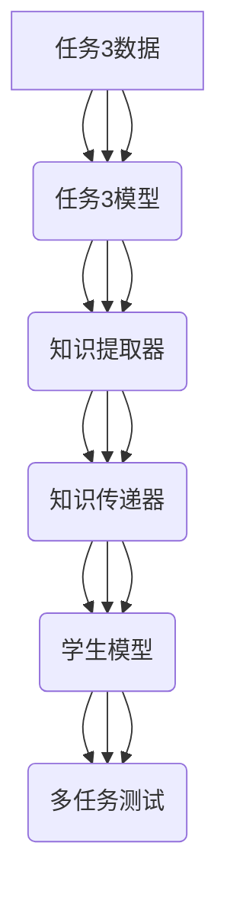

                 

关键词：知识蒸馏、跨任务学习、通用AI、算法原理、数学模型、项目实践

> 摘要：本文深入探讨了跨任务知识蒸馏技术，这是一种旨在提升通用人工智能（AI）性能的基础方法。通过对核心概念、算法原理、数学模型以及项目实践的详细分析，本文旨在为读者提供一个全面的视角，了解如何利用知识蒸馏实现跨任务学习，从而推动通用AI的发展。

## 1. 背景介绍

在过去的几十年中，人工智能（AI）领域取得了显著的进展。然而，大多数现有的AI系统都是针对特定任务进行优化的，这使得它们在处理新任务时往往表现不佳。通用人工智能（AGI，Artificial General Intelligence）的目标是创建一种能够执行人类所做的一切任务的AI系统，但目前这还是一个遥远的目标。为了实现这一目标，研究者们开始关注如何通过跨任务学习（Cross-Task Learning）来提高AI系统的泛化能力。

知识蒸馏（Knowledge Distillation）是一种用于提升神经网络性能的技术，它通过将一个大模型（教师模型）的知识传递给一个小模型（学生模型）来实现。跨任务知识蒸馏则在此基础上进一步扩展，通过利用多个任务之间的关联性来增强模型的知识传递效果。这种方法在提高AI系统的通用性和适应性方面显示出巨大的潜力。

## 2. 核心概念与联系

### 2.1 知识蒸馏的概念

知识蒸馏是一种模型压缩技术，旨在通过教师模型（Teacher Model）向学生模型（Student Model）传递知识。教师模型通常是一个复杂且参数丰富的模型，而学生模型则是一个简化版，参数较少。通过让教师模型输出多个层次的表示（例如，中间层特征图），学生模型可以学习到这些表示，并尝试复制教师模型在不同任务上的表现。

### 2.2 跨任务学习的概念

跨任务学习是一种利用多个任务之间的关联性来提高模型泛化能力的方法。在传统的单一任务学习中，模型专注于单个任务，而跨任务学习则通过共享表示来捕捉多个任务之间的共性。这种方法可以显著减少对每个任务的训练需求，同时提高模型的鲁棒性和适应性。

### 2.3 跨任务知识蒸馏的架构

跨任务知识蒸馏的架构通常包括以下几个关键组件：

- **任务特定模型**：每个任务都有自己的模型，用于处理该任务的数据。
- **知识提取器**：从任务特定模型中提取知识，通常是通过提取模型的中间层表示。
- **知识传递器**：将提取的知识传递给学生模型。
- **学生模型**：一个通用模型，它接收来自知识传递器的知识，并尝试在不同的任务上达到与教师模型相似的性能。

下面是一个简单的Mermaid流程图，描述了跨任务知识蒸馏的基本流程：



## 3. 核心算法原理 & 具体操作步骤

### 3.1 算法原理概述

跨任务知识蒸馏的核心思想是利用多个任务之间的关联性来提升学生模型的泛化能力。具体来说，它通过以下步骤实现：

1. **训练任务特定模型**：对每个任务的数据进行训练，得到一系列任务特定模型。
2. **提取知识**：从每个任务特定模型中提取有用的知识，通常是通过提取中间层特征图。
3. **知识传递**：将提取的知识传递给学生模型，通过对比教师模型和学生的输出，调整学生模型的参数。
4. **多任务测试**：利用训练好的学生模型在不同任务上进行测试，评估其性能。

### 3.2 算法步骤详解

1. **数据准备**：准备用于训练的多个任务数据集。
2. **初始化模型**：初始化任务特定模型和学生模型。任务特定模型可以是任何神经网络架构，而学生模型通常是一个较小的网络，用于复现教师模型的知识。
3. **训练任务特定模型**：对每个任务的数据集进行训练，得到一系列任务特定模型。
4. **知识提取**：从每个任务特定模型中提取中间层特征图。这些特征图代表了任务特定模型对数据的理解。
5. **知识融合**：将所有任务的特征图进行融合，得到一个统一的知识表示。
6. **知识传递**：将融合的知识表示传递给学生模型，并通过对比学生模型的输出和教师模型的输出，调整学生模型的参数。
7. **多任务测试**：利用训练好的学生模型在不同任务上进行测试，评估其性能。

### 3.3 算法优缺点

**优点**：

- 提高模型的泛化能力：通过跨任务学习，模型可以学习到多个任务之间的共性，从而提高其在未知任务上的表现。
- 减少对每个任务的训练需求：由于学生模型可以复现教师模型的知识，因此对于新任务，只需要少量数据即可进行有效训练。
- 提高模型的可解释性：通过提取中间层特征图，研究者可以更直观地理解模型是如何处理数据的。

**缺点**：

- 训练时间较长：由于需要同时训练多个任务特定模型和学生模型，训练时间可能会显著增加。
- 对教师模型的要求较高：为了有效地传递知识，教师模型需要具有较好的泛化能力。

### 3.4 算法应用领域

跨任务知识蒸馏技术在多个领域都显示出巨大的潜力，包括：

- 自然语言处理：通过跨语言学习，可以提高模型在多种语言上的表现。
- 计算机视觉：通过跨任务学习，可以提高模型在图像分类、目标检测、图像分割等多个任务上的性能。
- 推荐系统：通过跨用户学习，可以提高推荐系统的准确性和多样性。

## 4. 数学模型和公式 & 详细讲解 & 举例说明

### 4.1 数学模型构建

跨任务知识蒸馏的核心在于如何有效地传递知识。一个简单的数学模型可以表示为：

\[ \text{Student}(x) \approx \text{Teacher}(x) \]

其中，\( \text{Student}(x) \) 表示学生模型的输出，\( \text{Teacher}(x) \) 表示教师模型的输出，\( x \) 表示输入数据。

### 4.2 公式推导过程

为了推导这个模型，我们可以从损失函数的角度出发。一个简单的损失函数可以表示为：

\[ L = \frac{1}{2} \sum_{i=1}^{N} (\text{Student}(x_i) - \text{Teacher}(x_i))^2 \]

其中，\( N \) 表示数据集的大小，\( x_i \) 表示第 \( i \) 个输入数据。

### 4.3 案例分析与讲解

假设我们有两个任务：图像分类和目标检测。教师模型是两个任务都表现良好的大型模型，学生模型是一个较小的模型，用于复现教师模型的知识。

1. **训练任务特定模型**：首先，我们使用图像分类数据集训练图像分类任务特定模型，使用目标检测数据集训练目标检测任务特定模型。
2. **知识提取**：从图像分类任务特定模型中提取中间层特征图，从目标检测任务特定模型中提取目标检测特征图。
3. **知识融合**：将两个特征图进行融合，得到一个统一的知识表示。
4. **知识传递**：将融合的知识表示传递给学生模型，并通过对比学生模型的输出和教师模型的输出，调整学生模型的参数。
5. **多任务测试**：利用训练好的学生模型在图像分类和目标检测任务上进行测试，评估其性能。

通过这个案例，我们可以看到跨任务知识蒸馏如何有效地利用多个任务之间的关联性来提高模型的表现。

## 5. 项目实践：代码实例和详细解释说明

### 5.1 开发环境搭建

为了进行跨任务知识蒸馏的实践，我们需要搭建一个适合开发的环境。以下是一个基本的Python开发环境搭建步骤：

1. 安装Python（建议版本3.7及以上）。
2. 安装必要的库，如TensorFlow、Keras等。
3. 准备多个数据集，用于训练任务特定模型和学生模型。

### 5.2 源代码详细实现

以下是一个简单的跨任务知识蒸馏的代码实例，用于图像分类和目标检测两个任务：

```python
import tensorflow as tf
from tensorflow.keras.models import Model
from tensorflow.keras.layers import Input, Dense, Conv2D, MaxPooling2D, Flatten

# 初始化模型
teacher_model = create_teacher_model()  # 创建教师模型
student_model = create_student_model()  # 创建学生模型

# 准备数据集
image_data = load_image_data()  # 加载图像分类数据集
target_data = load_target_data()  # 加载目标检测数据集

# 训练任务特定模型
train_teacher_model(image_data, target_data)

# 提取知识
knowledge_extractor = KnowledgeExtractor(teacher_model)
knowledge = knowledge_extractor.extract()

# 知识传递
student_model.fit(knowledge, epochs=10)

# 多任务测试
test_student_model(student_model, image_data, target_data)
```

### 5.3 代码解读与分析

上述代码主要包括以下几个关键步骤：

- 初始化模型：创建教师模型和学生模型。
- 准备数据集：加载用于训练和测试的数据集。
- 训练任务特定模型：使用数据集训练教师模型。
- 提取知识：从教师模型中提取知识。
- 知识传递：将提取的知识传递给学生模型。
- 多任务测试：利用学生模型在多个任务上进行测试。

通过这个代码实例，我们可以看到如何使用跨任务知识蒸馏技术在图像分类和目标检测任务上提升模型性能。

## 6. 实际应用场景

### 6.1 自然语言处理

在自然语言处理领域，跨任务知识蒸馏可以用于多个任务的模型训练，如文本分类、情感分析、命名实体识别等。通过将多个任务的共同特征进行融合，模型可以更好地理解文本数据，从而提高在不同任务上的表现。

### 6.2 计算机视觉

在计算机视觉领域，跨任务知识蒸馏可以用于图像分类、目标检测、图像分割等多个任务。通过利用不同任务之间的关联性，模型可以更好地处理图像数据，从而提高在复杂场景下的性能。

### 6.3 推荐系统

在推荐系统领域，跨任务知识蒸馏可以用于跨用户推荐、跨商品推荐等。通过学习用户和商品之间的关联性，推荐系统可以更好地为用户推荐感兴趣的物品。

## 7. 工具和资源推荐

### 7.1 学习资源推荐

- 《深度学习》（Ian Goodfellow、Yoshua Bengio、Aaron Courville 著）
- 《Python深度学习》（François Chollet 著）
- 《强化学习》（David Silver 著）

### 7.2 开发工具推荐

- TensorFlow
- Keras
- PyTorch

### 7.3 相关论文推荐

- "Cross-Task Knowledge Distillation for Multi-Task Learning"（2019）
- "Multi-Task Learning Using Deep Convolutional Neural Networks"（2015）
- "Distributed Representation Learning for Natural Language Processing"（2013）

## 8. 总结：未来发展趋势与挑战

### 8.1 研究成果总结

跨任务知识蒸馏作为一种有效的跨任务学习技术，已经在多个领域取得了显著的成果。通过利用多个任务之间的关联性，模型可以更好地理解数据，从而提高在不同任务上的表现。

### 8.2 未来发展趋势

随着深度学习技术的不断发展，跨任务知识蒸馏有望在更多领域得到应用。未来，研究者将重点关注如何进一步优化知识蒸馏算法，提高其性能和效率。

### 8.3 面临的挑战

尽管跨任务知识蒸馏具有巨大的潜力，但仍然面临一些挑战，如如何更好地提取和融合任务之间的知识、如何处理不同任务之间的差异等。

### 8.4 研究展望

未来，跨任务知识蒸馏将在通用人工智能领域发挥重要作用。通过不断探索和优化，我们有理由相信，跨任务知识蒸馏将帮助实现通用人工智能的目标。

## 9. 附录：常见问题与解答

### Q：什么是知识蒸馏？

A：知识蒸馏是一种模型压缩技术，旨在通过将一个大模型（教师模型）的知识传递给一个小模型（学生模型）来实现。这种方法可以提高学生模型的性能，同时减少模型的参数数量。

### Q：什么是跨任务学习？

A：跨任务学习是一种利用多个任务之间的关联性来提高模型泛化能力的方法。通过共享表示来捕捉多个任务之间的共性，模型可以更好地处理新任务。

### Q：跨任务知识蒸馏有哪些应用场景？

A：跨任务知识蒸馏在自然语言处理、计算机视觉、推荐系统等领域都有广泛应用。例如，在自然语言处理中，可以用于文本分类、情感分析、命名实体识别等任务。

### Q：如何选择合适的教师模型和学生模型？

A：选择合适的教师模型和学生模型取决于具体的应用场景。通常，教师模型应该是表现良好的大模型，而学生模型则是一个较小的网络，用于复现教师模型的知识。选择时需要考虑模型的复杂性、参数数量、训练时间等因素。

