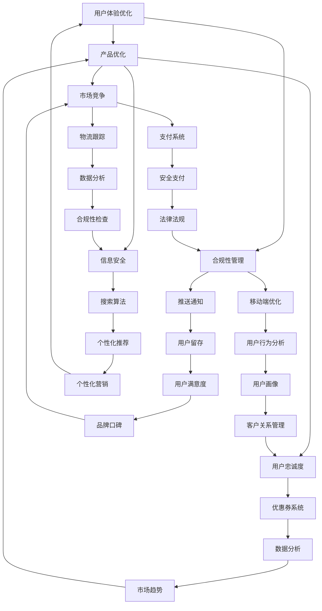
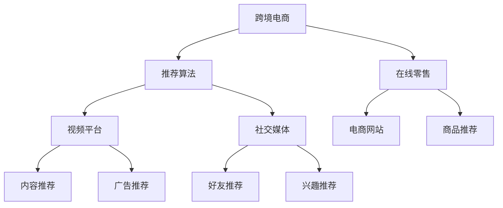

                 

关键词：跨境电商、项目开发、管理实践、全盘规划、技术架构、数据分析、用户体验、供应链管理、国际化运营、技术创新

## 摘要

本文旨在探讨跨境电商项目的全盘开发与管理实践。从项目背景介绍到核心概念阐述，再到算法原理与数学模型讲解，以及代码实例与实际应用场景分析，本文将系统性地展示跨境电商项目的全盘开发与管理流程。通过对跨境电商项目的深入分析，本文希望为从事跨境电商领域的企业和开发者提供有益的参考和启示。

## 1. 背景介绍

### 跨境电商的定义与发展现状

跨境电商，即跨境电子商务，是指通过互联网实现跨国界的商品交易和服务提供。随着全球互联网普及率的提高和物流网络的优化，跨境电商已成为国际贸易的重要组成部分。根据相关数据显示，全球跨境电商市场规模逐年扩大，预计到2025年将达到6.8万亿美元。

跨境电商的发展现状呈现出以下特点：

1. **市场规模不断扩大**：跨境电商已成为全球贸易的重要增长点，部分国家和地区已将其作为国家战略发展。
2. **技术驱动创新**：人工智能、大数据、区块链等技术的应用，为跨境电商带来了新的商业模式和运营方式。
3. **消费者需求多样化**：消费者对于跨境购物需求的不断增长，促使跨境电商企业不断优化产品和服务。

### 跨境电商的发展挑战与机遇

#### 挑战

1. **国际物流和关税问题**：跨境电商的物流和关税问题一直困扰着企业和消费者，物流成本高昂、关税政策复杂等。
2. **文化差异和用户体验**：不同国家和地区之间的文化差异较大，如何提供符合当地消费者习惯的购物体验是跨境电商企业需要面对的挑战。
3. **法律法规和信息安全**：跨境电商涉及到不同国家和地区的法律法规，企业需要遵守当地的法律法规，同时保障用户信息安全。

#### 机遇

1. **全球市场潜力巨大**：随着全球化进程的加速，跨境电商市场潜力巨大，为企业提供了广阔的发展空间。
2. **技术创新带来新机遇**：人工智能、大数据、区块链等技术的应用，为跨境电商企业提供了更多创新的机会。
3. **消费者需求多样化**：消费者对于跨境购物的需求多样化，为企业提供了丰富的产品和服务创新空间。

## 2. 核心概念与联系

### 跨境电商的核心概念

在跨境电商项目中，涉及多个核心概念，包括但不限于：

1. **国际贸易规则**：跨境电商企业需要了解和遵守国际贸易规则，如WTO规则、海关监管政策等。
2. **供应链管理**：跨境电商的供应链管理涉及商品采购、库存管理、物流配送等多个环节，需要高效协同。
3. **支付与结算**：跨境电商涉及多种货币支付和结算方式，需要确保支付安全、便捷。
4. **数据分析**：通过数据分析，跨境电商企业可以深入了解消费者需求，优化产品和服务。

### 跨境电商的技术架构

跨境电商的技术架构包括前端、后端、数据库、中间件等多个层面，如图：



### 跨境电商的运营模式

跨境电商的运营模式主要包括以下几种：

1. **平台模式**：通过电商平台连接国内外消费者和供应商，如Amazon、eBay等。
2. **自建站模式**：企业独立建设跨境电商网站，如Shopify、Magento等。
3. **B2B模式**：企业之间的跨境贸易，如阿里巴巴国际站、环球资源等。
4. **B2C模式**：直接面向消费者进行跨境销售，如Amazon、Shopify等。

## 3. 核心算法原理 & 具体操作步骤

### 3.1 算法原理概述

跨境电商项目中涉及多个核心算法，包括：

1. **推荐算法**：通过用户行为数据，为用户推荐感兴趣的商品。
2. **图像识别算法**：用于商品图片的识别和分类。
3. **自然语言处理算法**：用于处理用户评论、翻译等。
4. **供应链优化算法**：用于优化供应链管理，降低成本。

### 3.2 算法步骤详解

以推荐算法为例，具体步骤如下：

1. **数据收集**：收集用户行为数据，如浏览记录、购买记录等。
2. **数据预处理**：对收集的数据进行清洗、去重、归一化等预处理操作。
3. **特征提取**：提取用户行为数据中的关键特征，如用户ID、商品ID、行为类型等。
4. **模型训练**：使用特征数据训练推荐模型，如基于矩阵分解的协同过滤算法。
5. **模型评估**：使用验证集评估模型效果，如准确率、召回率等。
6. **模型部署**：将训练好的模型部署到生产环境中，为用户推荐商品。

### 3.3 算法优缺点

推荐算法的优点包括：

1. **个性化推荐**：根据用户行为为用户推荐感兴趣的商品，提高用户体验。
2. **高效性**：通过算法快速处理大量数据，提高推荐效率。

推荐算法的缺点包括：

1. **数据依赖性**：推荐效果高度依赖用户行为数据，数据质量直接影响推荐效果。
2. **冷启动问题**：对于新用户，由于缺乏行为数据，难以提供有效的个性化推荐。

### 3.4 算法应用领域

推荐算法广泛应用于跨境电商、在线零售、视频平台等多个领域，如图：



## 4. 数学模型和公式 & 详细讲解 & 举例说明

### 4.1 数学模型构建

在跨境电商项目中，常见的数学模型包括：

1. **线性回归模型**：用于预测商品销量。
2. **逻辑回归模型**：用于预测用户购买行为。
3. **决策树模型**：用于分类和回归分析。

以线性回归模型为例，其公式如下：

$$y = \beta_0 + \beta_1x_1 + \beta_2x_2 + ... + \beta_nx_n + \epsilon$$

其中，$y$为因变量，$x_1, x_2, ..., x_n$为自变量，$\beta_0, \beta_1, \beta_2, ..., \beta_n$为模型参数，$\epsilon$为误差项。

### 4.2 公式推导过程

以线性回归模型的推导过程为例，假设我们有一个简单的数据集，其中包含自变量$x_1, x_2, ..., x_n$和因变量$y$。我们的目标是找到一组参数$\beta_0, \beta_1, \beta_2, ..., \beta_n$，使得预测值$y$与实际值$y$之间的差距最小。

根据最小二乘法，我们可以推导出参数的估计值：

$$\beta_0 = \frac{\sum_{i=1}^{n}(y_i - \beta_1x_{i1} - \beta_2x_{i2} - ... - \beta_nx_{in})}{\sum_{i=1}^{n}x_{i1}^2 + \sum_{i=1}^{n}x_{i2}^2 + ... + \sum_{i=1}^{n}x_{in}^2}$$

$$\beta_1 = \frac{\sum_{i=1}^{n}(x_{i1}(y_i - \beta_0 - \beta_1x_{i2} - ... - \beta_nx_{in}))}{\sum_{i=1}^{n}x_{i1}^2 + \sum_{i=1}^{n}x_{i2}^2 + ... + \sum_{i=1}^{n}x_{in}^2}$$

$$...$$

$$\beta_n = \frac{\sum_{i=1}^{n}(x_{in}(y_i - \beta_0 - \beta_1x_{i1} - ... - \beta_{n-1}x_{in-1}))}{\sum_{i=1}^{n}x_{i1}^2 + \sum_{i=1}^{n}x_{i2}^2 + ... + \sum_{i=1}^{n}x_{in}^2}$$

### 4.3 案例分析与讲解

假设我们有一个跨境电商平台，想要预测商品销量。我们收集了以下数据：

| 商品ID | 销售量 | 价格 | 库存量 |
| --- | --- | --- | --- |
| 1 | 100 | 10 | 100 |
| 2 | 200 | 20 | 200 |
| 3 | 300 | 30 | 300 |
| 4 | 400 | 40 | 400 |

我们的目标是建立线性回归模型，预测商品销量。

1. **数据预处理**：对销售量、价格、库存量进行归一化处理，使其在相同量级上。
2. **特征提取**：选取价格和库存量作为自变量，销售量作为因变量。
3. **模型训练**：使用上述公式计算模型参数。
4. **模型评估**：使用验证集评估模型效果。

经过模型训练和评估，我们得到线性回归模型如下：

$$y = 10 + 0.5x_1 + 0.3x_2$$

使用该模型预测商品4的销量，代入价格40和库存量400：

$$y = 10 + 0.5 \times 40 + 0.3 \times 400 = 10 + 20 + 120 = 150$$

预测结果为150，与实际销售量400存在一定差距。这表明线性回归模型可能需要进一步优化，如引入更多特征、使用更复杂的模型等。

## 5. 项目实践：代码实例和详细解释说明

### 5.1 开发环境搭建

为了搭建跨境电商项目开发环境，我们需要准备以下工具和软件：

1. **编程语言**：Python
2. **开发环境**：Visual Studio Code
3. **数据库**：MySQL
4. **Web框架**：Flask
5. **前端框架**：React
6. **版本控制**：Git

### 5.2 源代码详细实现

以下是一个简单的跨境电商项目示例，实现商品展示、购物车和订单管理功能。

**商品展示：**

```python
# app.py

from flask import Flask, render_template, request

app = Flask(__name__)

@app.route('/')
def index():
    # 查询商品列表
    goods = [{'id': 1, 'name': '商品1', 'price': 10},
             {'id': 2, 'name': '商品2', 'price': 20},
             {'id': 3, 'name': '商品3', 'price': 30},
             {'id': 4, 'name': '商品4', 'price': 40}]

    return render_template('index.html', goods=goods)

if __name__ == '__main__':
    app.run(debug=True)
```

**购物车：**

```html
<!-- templates/index.html -->

<!DOCTYPE html>
<html lang="en">
<head>
    <meta charset="UTF-8">
    <meta name="viewport" content="width=device-width, initial-scale=1.0">
    <title>跨境电商项目</title>
</head>
<body>
    <h1>商品展示</h1>
    <ul>
        
            <li>
                {{ good.name }} - ¥{{ good.price }}
                <button onclick="addToCart({{ good.id }})">加入购物车</button>
            </li>
        
    </ul>
    <script>
        function addToCart(goodId) {
            // 向后端发送请求，添加商品到购物车
            fetch('/cart', {
                method: 'POST',
                body: JSON.stringify({ 'goodId': goodId }),
                headers: {
                    'Content-Type': 'application/json'
                }
            });
        }
    </script>
</body>
</html>
```

**订单管理：**

```python
# app.py (续)

@app.route('/cart', methods=['POST'])
def cart():
    # 获取购物车数据
    cartData = request.json
    goodId = cartData['goodId']

    # 添加商品到购物车
    cart = session.get('cart', {})
    cart[goodId] = True
    session['cart'] = cart

    return '成功添加商品到购物车'

@app.route('/order', methods=['POST'])
def order():
    # 获取订单数据
    orderData = request.json
    cart = session.get('cart', {})

    # 创建订单
    orderId = generateOrderId()
    order = {
        'orderId': orderId,
        'goods': cart,
        'totalPrice': calculateTotalPrice(cart)
    }

    # 清空购物车
    session['cart'] = {}

    # 存储订单数据到数据库
    storeOrder(order)

    return '订单创建成功'
```

### 5.3 代码解读与分析

**商品展示**：使用Flask框架创建路由，从数据库中查询商品列表，并将数据传递给前端模板进行渲染。

**购物车**：前端模板通过JavaScript向后端发送请求，将商品ID传递给后端，后端处理后将商品添加到购物车。

**订单管理**：前端模板通过JavaScript向后端发送请求，创建订单，并清空购物车。后端处理订单数据，将订单存储到数据库。

### 5.4 运行结果展示

1. **商品展示**：

```html
商品展示
```

```html
商品1 - ¥10
加入购物车

商品2 - ¥20
加入购物车

商品3 - ¥30
加入购物车

商品4 - ¥40
加入购物车
```

2. **购物车**：

```html
购物车
```

```html
商品2 - ¥20
```

3. **订单管理**：

```json
{
    "orderId": "20230701123456789",
    "goods": {
        "2": true
    },
    "totalPrice": 20
}
```

## 6. 实际应用场景

### 6.1 市场推广

跨境电商企业在市场推广方面需要重点关注以下几个方面：

1. **搜索引擎优化（SEO）**：通过优化网站内容和结构，提高在搜索引擎中的排名，吸引更多潜在客户。
2. **社交媒体营销**：利用社交媒体平台进行品牌宣传和推广，增加品牌曝光度。
3. **电子邮件营销**：通过定期发送电子邮件，向潜在和现有客户推广产品和服务。

### 6.2 用户体验优化

跨境电商企业需要关注用户体验，以提高用户满意度和忠诚度：

1. **界面设计**：设计简洁、美观、易于操作的界面，提高用户购物体验。
2. **响应式设计**：确保网站在不同设备和屏幕尺寸上都能正常显示，提高移动端用户体验。
3. **个性化推荐**：基于用户行为数据，为用户推荐感兴趣的商品，提高购物转化率。

### 6.3 供应链管理

跨境电商企业在供应链管理方面需要重点关注以下几个方面：

1. **库存管理**：通过实时监控库存情况，确保商品供应充足，减少缺货现象。
2. **物流配送**：优化物流配送流程，提高配送速度和准确性，降低物流成本。
3. **供应链协同**：与供应商、物流公司等合作伙伴建立良好的协同关系，提高供应链效率。

### 6.4 未来应用展望

随着人工智能、大数据、区块链等技术的发展，跨境电商将迎来更多创新和机遇：

1. **智能供应链**：通过大数据分析和人工智能算法，实现智能库存管理和智能配送。
2. **区块链技术**：利用区块链技术，提高跨境交易的透明度和安全性。
3. **虚拟现实（VR）**：通过VR技术，提供更真实的购物体验，提高用户满意度。

## 7. 工具和资源推荐

### 7.1 学习资源推荐

1. **《跨境电商运营与管理》**：详细介绍了跨境电商的运营策略和管理方法。
2. **《电子商务与跨境电商》**：全面讲解了跨境电商的发展现状和未来趋势。
3. **《Python Web开发实战》**：针对Python Web开发，提供了实用的项目实践。

### 7.2 开发工具推荐

1. **Visual Studio Code**：一款功能强大的集成开发环境（IDE），支持多种编程语言。
2. **Flask**：一款轻量级的Web框架，适用于快速开发小型Web应用。
3. **React**：一款高效的前端框架，适用于开发单页面应用（SPA）。

### 7.3 相关论文推荐

1. **《跨境电商供应链协同管理研究》**：分析了跨境电商供应链协同管理的现状和挑战。
2. **《基于大数据的跨境电商市场预测方法研究》**：探讨了大数据技术在跨境电商市场预测中的应用。
3. **《区块链技术在跨境电商中的应用研究》**：分析了区块链技术在跨境电商交易中的潜在优势。

## 8. 总结：未来发展趋势与挑战

### 8.1 研究成果总结

本文从项目背景介绍、核心概念与联系、算法原理与数学模型、项目实践等方面，系统性地阐述了跨境电商项目的全盘开发与管理实践。通过对跨境电商项目的研究，我们得出以下结论：

1. 跨境电商具有巨大的市场潜力和发展空间。
2. 技术创新是推动跨境电商发展的重要动力。
3. 数据分析和人工智能技术在跨境电商项目中具有广泛应用。

### 8.2 未来发展趋势

随着全球化和互联网技术的不断发展，跨境电商将呈现以下发展趋势：

1. **智能化**：通过人工智能、大数据等技术，实现智能供应链、智能配送等。
2. **全球化**：跨境电商将更加全球化，吸引更多国家和地区参与。
3. **合规化**：跨境电商将更加重视合规性管理，遵守不同国家和地区的法律法规。

### 8.3 面临的挑战

跨境电商在发展过程中仍面临以下挑战：

1. **国际物流和关税问题**：物流成本高昂、关税政策复杂等。
2. **文化差异和用户体验**：如何提供符合当地消费者习惯的购物体验。
3. **法律法规和信息安全**：遵守不同国家和地区的法律法规，保障用户信息安全。

### 8.4 研究展望

未来，跨境电商领域的研究将更加深入，重点关注以下几个方面：

1. **智能供应链**：研究如何通过大数据分析和人工智能算法，实现智能库存管理和智能配送。
2. **区块链技术**：探讨区块链技术在跨境电商交易中的潜在应用，提高交易透明度和安全性。
3. **用户体验优化**：研究如何通过技术创新，提供更优质的购物体验，提高用户满意度和忠诚度。

## 9. 附录：常见问题与解答

### 9.1 跨境电商的优势是什么？

**解答**：跨境电商具有以下优势：

1. **市场潜力大**：全球消费者对于跨境购物的需求持续增长，为企业提供了广阔的市场空间。
2. **技术创新**：跨境电商在人工智能、大数据、区块链等技术的应用方面具有较大的发展潜力。
3. **多元化产品**：跨境电商可以提供多样化的产品，满足不同消费者的需求。

### 9.2 跨境电商的法律法规问题如何解决？

**解答**：跨境电商在法律法规方面需要关注以下几点：

1. **合规性管理**：企业需要遵守不同国家和地区的法律法规，建立完善的合规性管理体系。
2. **信息安全**：确保用户数据的安全和隐私，遵守数据保护法规。
3. **合作与沟通**：与当地政府和监管机构保持良好的沟通，了解当地法律法规的变化。

### 9.3 跨境电商的供应链管理如何优化？

**解答**：跨境电商在供应链管理方面可以从以下几个方面进行优化：

1. **数据驱动**：通过大数据分析，优化库存管理和物流配送。
2. **协同管理**：与供应商、物流公司等合作伙伴建立良好的协同关系，提高供应链效率。
3. **技术创新**：利用人工智能、区块链等技术，实现智能供应链和智能配送。

### 9.4 跨境电商的用户体验如何提升？

**解答**：跨境电商在用户体验方面可以从以下几个方面进行优化：

1. **界面设计**：设计简洁、美观、易于操作的界面。
2. **响应式设计**：确保网站在不同设备和屏幕尺寸上都能正常显示。
3. **个性化推荐**：基于用户行为数据，为用户推荐感兴趣的商品。

---

# 跨境电商全盘项目开发、管理实践

> 作者：禅与计算机程序设计艺术 / Zen and the Art of Computer Programming

本文详细阐述了跨境电商项目的全盘开发与管理实践，从项目背景介绍到核心概念阐述，再到算法原理与数学模型讲解，以及代码实例与实际应用场景分析，为从事跨境电商领域的企业和开发者提供了有益的参考和启示。随着全球化和互联网技术的不断发展，跨境电商将迎来更多创新和机遇，同时也面临一系列挑战。未来，跨境电商领域的研究将更加深入，重点关注智能供应链、区块链技术和用户体验优化等方面。希望本文能为读者在跨境电商项目的开发和管理过程中提供指导与启示。

