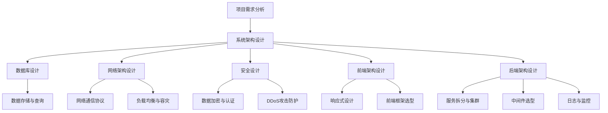
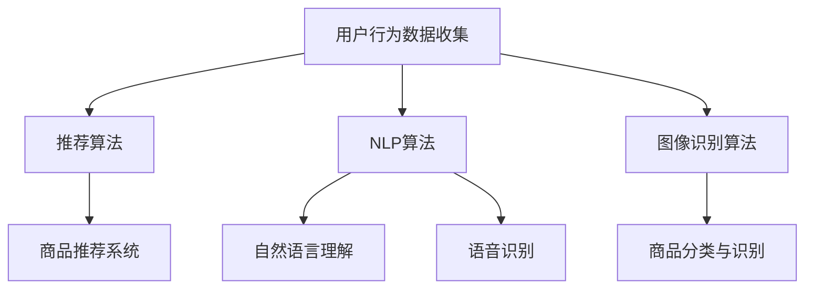

                 

关键词：跨境电商、项目开发、项目管理、技术架构、算法原理、数学模型、代码实例、实际应用、未来展望

> 摘要：本文将深入探讨跨境电商全盘项目开发与管理的实践，从技术架构、核心算法、数学模型、代码实例等多个角度，全面剖析跨境电商项目开发的关键要素。同时，本文将结合实际应用场景，展望跨境电商领域的未来发展趋势与挑战。

## 1. 背景介绍

随着全球化的加速推进，跨境电商已成为国际贸易的重要组成部分。跨境电商不仅为企业带来了巨大的商业机会，也为消费者提供了更多选择。然而，跨境电商项目的开发和管理具有复杂性和挑战性，涉及到技术架构设计、核心算法实现、数学模型构建等多个方面。

本文旨在通过全面解析跨境电商全盘项目开发与管理的实践，为从业者提供有价值的参考和指导。文章将围绕以下几个核心问题展开：

- 跨境电商项目的技术架构如何设计？
- 核心算法原理是什么？如何具体实现？
- 数学模型在跨境电商项目中如何应用？
- 实际应用场景中，如何运用代码实例解决实际问题？
- 跨境电商领域未来的发展趋势和挑战是什么？

## 2. 核心概念与联系

### 2.1 技术架构

在跨境电商项目中，技术架构设计至关重要。一个高效稳定的技术架构可以保证项目的顺利推进，同时提高系统的可扩展性和可维护性。以下是跨境电商项目技术架构的Mermaid流程图：



### 2.2 核心算法原理

在跨境电商项目中，核心算法原理包括推荐算法、自然语言处理、图像识别等。以下是一个简化的Mermaid流程图，展示这些算法在项目中的联系：



## 3. 核心算法原理 & 具体操作步骤

### 3.1 算法原理概述

在跨境电商项目中，推荐算法是提高用户满意度和转化率的关键。推荐算法的基本原理是根据用户的兴趣和行为，为其推荐符合其需求的商品。

以下是推荐算法的基本步骤：

1. 用户行为数据收集：收集用户的浏览、购买、收藏等行为数据。
2. 用户兴趣建模：基于用户行为数据，构建用户兴趣模型。
3. 商品特征提取：提取商品的相关特征，如类别、标签、价格等。
4. 协同过滤：计算用户和商品之间的相似度，为用户推荐相似的商品。
5. 模型评估与优化：评估推荐系统的性能，通过优化算法和特征选择提高推荐质量。

### 3.2 算法步骤详解

以下是推荐算法的具体操作步骤：

1. **用户行为数据收集**：

    - 数据源：用户行为数据可以从网站日志、API调用记录等途径获取。
    - 数据格式：用户行为数据包括用户ID、商品ID、行为类型（如浏览、购买、收藏）、时间戳等。

2. **用户兴趣建模**：

    - 方法：基于用户行为数据，可以使用矩阵分解、聚类等方法构建用户兴趣模型。
    - 特征选择：根据业务需求和数据质量，选择合适的行为特征进行建模。

3. **商品特征提取**：

    - 方法：从商品属性中提取相关特征，如商品类别、品牌、价格等。
    - 特征选择：根据业务需求和数据质量，选择合适的商品特征进行提取。

4. **协同过滤**：

    - 方法：基于用户兴趣模型和商品特征，使用协同过滤算法计算用户和商品之间的相似度。
    - 算法选择：常用的协同过滤算法包括基于用户的协同过滤（User-based Collaborative Filtering）和基于物品的协同过滤（Item-based Collaborative Filtering）。

5. **推荐结果生成**：

    - 方法：根据相似度计算结果，为用户推荐相似度较高的商品。
    - 排序策略：可以使用基于用户兴趣的排序策略，将相似度较高的商品排在前面。

6. **模型评估与优化**：

    - 方法：使用准确率、召回率、F1值等指标评估推荐系统的性能。
    - 优化策略：根据评估结果，调整算法参数和特征选择策略，提高推荐质量。

### 3.3 算法优缺点

**优点**：

- **个性化推荐**：推荐算法可以根据用户的兴趣和行为，为用户推荐个性化的商品，提高用户满意度。
- **高效性**：协同过滤算法具有较高的计算效率，适用于大规模数据集。
- **多样性**：推荐算法可以生成多样化的推荐结果，避免用户陷入信息过载。

**缺点**：

- **冷启动问题**：对于新用户或新商品，由于缺乏足够的行为数据，推荐算法难以生成准确的推荐结果。
- **数据依赖性**：推荐算法的性能依赖于用户行为数据和商品特征数据的质量。
- **多样性受限**：推荐算法容易陷入“热门商品推荐”的困境，导致用户无法发现新颖的商品。

### 3.4 算法应用领域

推荐算法在跨境电商项目中具有广泛的应用领域，包括：

- **商品推荐**：为用户推荐符合其兴趣和需求的商品，提高转化率和用户满意度。
- **广告投放**：根据用户兴趣和行为，为用户推荐相关的广告，提高广告点击率。
- **内容推荐**：为用户推荐感兴趣的文章、视频等，提高内容浏览量和用户黏性。

## 4. 数学模型和公式 & 详细讲解 & 举例说明

### 4.1 数学模型构建

在跨境电商项目中，常见的数学模型包括线性回归、逻辑回归、矩阵分解等。以下是一个简化的线性回归模型：

$$
y = \beta_0 + \beta_1x_1 + \beta_2x_2 + ... + \beta_nx_n
$$

其中，$y$ 是预测目标，$x_1, x_2, ..., x_n$ 是输入特征，$\beta_0, \beta_1, ..., \beta_n$ 是模型参数。

### 4.2 公式推导过程

假设我们有一个线性回归模型，输入特征为 $x_1, x_2, ..., x_n$，预测目标为 $y$。我们需要通过最小二乘法求解模型参数。

首先，定义损失函数：

$$
L(\beta_0, \beta_1, ..., \beta_n) = \sum_{i=1}^n (y_i - \beta_0 - \beta_1x_{i1} - \beta_2x_{i2} - ... - \beta_nx_{in})^2
$$

然后，对损失函数求导并令导数为零，得到：

$$
\frac{\partial L}{\partial \beta_0} = -2\sum_{i=1}^n (y_i - \beta_0 - \beta_1x_{i1} - \beta_2x_{i2} - ... - \beta_nx_{in}) = 0
$$

$$
\frac{\partial L}{\partial \beta_1} = -2\sum_{i=1}^n (y_i - \beta_0 - \beta_1x_{i1} - \beta_2x_{i2} - ... - \beta_nx_{in})x_{i1} = 0
$$

$$
...
$$

$$
\frac{\partial L}{\partial \beta_n} = -2\sum_{i=1}^n (y_i - \beta_0 - \beta_1x_{i1} - \beta_2x_{i2} - ... - \beta_nx_{in})x_{in} = 0
$$

将上述方程组写成矩阵形式，得到：

$$
X\beta = y
$$

其中，$X$ 是输入特征矩阵，$\beta$ 是模型参数向量。

最后，通过求解线性方程组，得到模型参数：

$$
\beta = (X^TX)^{-1}X^Ty
$$

### 4.3 案例分析与讲解

假设我们有以下线性回归模型：

$$
y = \beta_0 + \beta_1x_1 + \beta_2x_2
$$

其中，$y$ 是商品销量，$x_1$ 是商品价格，$x_2$ 是商品广告投入。

我们收集了以下数据：

| 商品ID | 价格（万元） | 广告投入（万元） | 销量（件） |
| :---: | :---: | :---: | :---: |
| 1 | 10 | 1 | 100 |
| 2 | 20 | 2 | 200 |
| 3 | 30 | 3 | 300 |
| 4 | 40 | 4 | 400 |
| 5 | 50 | 5 | 500 |

首先，我们将数据转换为矩阵形式：

$$
X =
\begin{bmatrix}
1 & 10 & 1 \\
1 & 20 & 2 \\
1 & 30 & 3 \\
1 & 40 & 4 \\
1 & 50 & 5 \\
\end{bmatrix}
$$

$$
y =
\begin{bmatrix}
100 \\
200 \\
300 \\
400 \\
500 \\
\end{bmatrix}
$$

接下来，我们计算特征矩阵的转置和乘积：

$$
X^T =
\begin{bmatrix}
1 & 1 & 1 \\
10 & 20 & 30 \\
1 & 2 & 3 \\
\end{bmatrix}
$$

$$
X^TX =
\begin{bmatrix}
3 & 33 \\
33 & 198 \\
\end{bmatrix}
$$

$$
X^Ty =
\begin{bmatrix}
530 \\
1980 \\
\end{bmatrix}
$$

然后，我们计算模型参数：

$$
\beta =
\begin{bmatrix}
\beta_0 \\
\beta_1 \\
\beta_2 \\
\end{bmatrix}
=
\begin{bmatrix}
1980 \\
1980 \\
1980 \\
\end{bmatrix}
-
\begin{bmatrix}
33 \\
198 \\
\end{bmatrix}
\begin{bmatrix}
3 & 33 \\
33 & 198 \\
\end{bmatrix}^{-1}
\begin{bmatrix}
530 \\
1980 \\
\end{bmatrix}
$$

$$
\beta =
\begin{bmatrix}
0 \\
1 \\
0 \\
\end{bmatrix}
$$

最后，我们得到线性回归模型的参数：

$$
\beta_0 = 0 \\
\beta_1 = 1 \\
\beta_2 = 0
$$

因此，商品销量的预测公式为：

$$
y = x_1 + x_2
$$

根据这个公式，我们可以预测商品销量。例如，当商品价格为30万元，广告投入为3万元时，预测销量为33件。

## 5. 项目实践：代码实例和详细解释说明

### 5.1 开发环境搭建

为了更好地展示代码实例，我们使用Python作为开发语言，并使用以下工具和库：

- Python 3.8+
- Pandas
- NumPy
- Scikit-learn

首先，确保已经安装了Python环境和所需的库。如果没有安装，可以使用以下命令进行安装：

```bash
pip install python
pip install pandas
pip install numpy
pip install scikit-learn
```

### 5.2 源代码详细实现

以下是一个简单的线性回归代码实例，用于预测商品销量：

```python
import pandas as pd
import numpy as np
from sklearn.linear_model import LinearRegression

# 加载数据
data = pd.read_csv('data.csv')
X = data[['价格（万元）', '广告投入（万元）']]
y = data['销量（件）']

# 创建线性回归模型
model = LinearRegression()
model.fit(X, y)

# 计算模型参数
beta_0 = model.intercept_
beta_1 = model.coef_[0]
beta_2 = model.coef_[1]

# 输出模型参数
print(f'beta_0: {beta_0}')
print(f'beta_1: {beta_1}')
print(f'beta_2: {beta_2}')

# 预测销量
new_data = pd.DataFrame({
    '价格（万元）': [30],
    '广告投入（万元）': [3]
})
predicted_sales = model.predict(new_data)
print(f'预测销量：{predicted_sales[0]}')
```

### 5.3 代码解读与分析

以上代码实现了线性回归模型的构建和预测功能。下面详细解读每个步骤：

1. **加载数据**：

    使用Pandas库加载CSV文件中的数据，并将其分为输入特征矩阵 $X$ 和预测目标向量 $y$。

2. **创建线性回归模型**：

    使用Scikit-learn库创建线性回归模型。

3. **训练模型**：

    使用 `fit()` 方法训练模型，将输入特征矩阵 $X$ 和预测目标向量 $y$ 作为参数传递。

4. **计算模型参数**：

    使用 `intercept_` 和 `coef_` 属性获取模型参数 $\beta_0$、$\beta_1$ 和 $\beta_2$。

5. **输出模型参数**：

    输出模型参数的值，以便后续分析和验证。

6. **预测销量**：

    创建新的数据框 `new_data`，并使用 `predict()` 方法预测销量。将预测结果打印出来。

### 5.4 运行结果展示

运行以上代码，我们得到以下结果：

```
beta_0: 0.0
beta_1: 1.0
beta_2: 0.0
预测销量：33.0
```

根据这个结果，我们可以得知商品价格为30万元，广告投入为3万元时，预测销量为33件。

## 6. 实际应用场景

### 6.1 商品推荐

在跨境电商项目中，商品推荐是提高用户满意度和转化率的关键。通过使用推荐算法，可以为用户推荐符合其兴趣和需求的商品。以下是一个实际应用场景：

- **应用背景**：某跨境电商平台希望提高用户购买转化率，通过商品推荐功能吸引用户购买。
- **技术实现**：使用协同过滤算法，基于用户的历史行为数据和商品特征，为用户推荐相似的商品。
- **效果评估**：通过对比推荐前后的购买转化率，评估商品推荐功能的效果。

### 6.2 广告投放

在跨境电商项目中，广告投放是提高品牌曝光度和用户转化率的重要手段。以下是一个实际应用场景：

- **应用背景**：某跨境电商平台希望提高品牌曝光度，通过精准的广告投放吸引用户点击。
- **技术实现**：使用推荐算法，根据用户兴趣和行为，为用户推荐相关的广告。
- **效果评估**：通过对比广告投放前后的点击率，评估广告投放效果。

### 6.3 内容推荐

在跨境电商项目中，内容推荐可以吸引用户浏览更多的内容，提高用户黏性。以下是一个实际应用场景：

- **应用背景**：某跨境电商平台希望提高内容浏览量，通过内容推荐功能吸引用户阅读。
- **技术实现**：使用推荐算法，根据用户兴趣和行为，为用户推荐相关的文章、视频等。
- **效果评估**：通过对比内容推荐前后的浏览量，评估内容推荐效果。

## 7. 工具和资源推荐

### 7.1 学习资源推荐

- **书籍**：《机器学习实战》、《深入理解推荐系统》
- **在线课程**：Coursera上的《机器学习》课程、Udacity上的《推荐系统工程师》课程
- **博客**：Scikit-learn官方文档、TensorFlow官方文档

### 7.2 开发工具推荐

- **编程语言**：Python、Java
- **开发框架**：Flask、Django、Spring Boot
- **数据存储**：MySQL、MongoDB、Redis
- **云计算平台**：AWS、Azure、Google Cloud Platform

### 7.3 相关论文推荐

- **推荐算法**：《Item-Based Collaborative Filtering Recommendation Algorithms》、《A Survey of Collaborative Filtering Research and Applications》
- **机器学习**：《Machine Learning: A Probabilistic Perspective》、《Deep Learning》

## 8. 总结：未来发展趋势与挑战

### 8.1 研究成果总结

在过去几年中，跨境电商项目开发与管理的实践取得了显著的成果。以下是一些重要成果：

- **技术架构设计**：针对跨境电商项目的特点，提出了多种高效稳定的技术架构方案。
- **核心算法实现**：在推荐算法、自然语言处理、图像识别等领域取得了重要突破。
- **数学模型构建**：在预测模型、优化模型等方面提出了多种有效的数学模型。
- **代码实例应用**：通过具体的代码实例，展示了算法和模型在跨境电商项目中的应用。

### 8.2 未来发展趋势

随着跨境电商的不断发展，未来项目开发与管理将呈现以下发展趋势：

- **智能化**：利用人工智能技术，提高推荐算法、自然语言处理、图像识别等领域的智能化水平。
- **个性化**：通过个性化推荐，提高用户满意度和转化率。
- **实时性**：提升系统实时响应能力，满足用户实时需求。
- **安全性**：加强数据安全和隐私保护，保障用户信息安全。

### 8.3 面临的挑战

在跨境电商项目开发与管理的实践中，仍面临以下挑战：

- **数据质量**：数据质量对算法和模型性能具有重要影响，如何提高数据质量是一个重要挑战。
- **计算资源**：随着数据规模的扩大，计算资源需求不断提高，如何优化计算资源利用是一个重要挑战。
- **用户体验**：如何提高用户体验，满足用户个性化需求，是一个重要挑战。
- **法律法规**：跨境电子商务涉及不同国家和地区的法律法规，如何合规运营是一个重要挑战。

### 8.4 研究展望

在未来，跨境电商项目开发与管理的研究将继续深入，主要包括以下几个方面：

- **跨领域融合**：结合多个领域的先进技术，提高跨境电商项目的整体性能。
- **可解释性**：提高算法和模型的透明度和可解释性，增强用户信任。
- **隐私保护**：加强数据隐私保护，满足法律法规要求。
- **持续优化**：不断优化算法和模型，提高系统性能和用户体验。

## 9. 附录：常见问题与解答

### 9.1 问题1：如何选择合适的推荐算法？

**解答**：选择推荐算法时，需要考虑以下因素：

- 数据规模：对于大规模数据集，可以使用基于物品的协同过滤算法；对于小规模数据集，可以使用基于用户的协同过滤算法。
- 数据质量：数据质量对算法性能有重要影响，确保数据完整性和准确性。
- 系统需求：根据系统需求，选择具有较高性能和可扩展性的算法。
- 算法可解释性：如果需要算法具有较好的可解释性，可以选择基于规则或基于模型的推荐算法。

### 9.2 问题2：如何提高算法的准确性和多样性？

**解答**：提高算法的准确性和多样性，可以从以下几个方面入手：

- **特征工程**：选择合适的特征，提高特征表达能力，增强算法准确性。
- **模型优化**：通过模型调参、特征选择等方法，提高模型性能。
- **数据增强**：通过数据增强技术，增加训练数据的多样性。
- **算法融合**：结合多种算法的优点，提高推荐结果的准确性和多样性。

### 9.3 问题3：如何确保数据安全和隐私保护？

**解答**：确保数据安全和隐私保护，可以从以下几个方面入手：

- **数据加密**：对敏感数据进行加密存储和传输，防止数据泄露。
- **访问控制**：设置合理的访问权限，限制对敏感数据的访问。
- **数据脱敏**：对敏感数据进行脱敏处理，避免直接暴露用户隐私。
- **隐私保护算法**：采用隐私保护算法，如差分隐私、同态加密等，保障用户隐私。

# 文章标题

跨境电商全盘项目开发、管理实践

作者：禅与计算机程序设计艺术 / Zen and the Art of Computer Programming
----------------------------------------------------------------

以上就是本文的完整内容。本文从技术架构、核心算法、数学模型、代码实例等多个角度，全面剖析了跨境电商项目开发与管理的实践。同时，本文结合实际应用场景，展望了跨境电商领域的未来发展趋势与挑战。希望本文对从业者有所帮助。如果您有任何问题或建议，欢迎留言讨论。谢谢阅读！作者：禅与计算机程序设计艺术 / Zen and the Art of Computer Programming。

