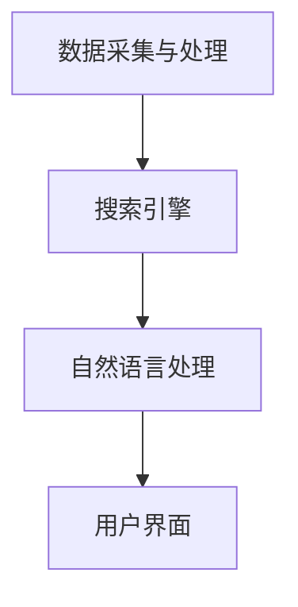

                 

关键词：跨平台搜索，人工智能，搜索引擎优化，多平台适配，数据融合，机器学习，自然语言处理，性能优化

> 摘要：本文探讨了跨平台搜索技术的现状和未来发展趋势，重点分析了人工智能（AI）在跨平台搜索中的应用，包括搜索算法优化、数据融合、自然语言处理等方面。通过具体的算法原理、数学模型和项目实践，本文为读者呈现了一个全面而深入的跨平台搜索技术全景。

## 1. 背景介绍

随着互联网的飞速发展和移动设备的普及，用户的信息获取需求变得越来越复杂。传统的单一平台搜索引擎已无法满足用户对于多平台、多设备环境下信息获取的多样化需求。因此，跨平台搜索技术应运而生，它旨在通过整合多个平台的数据资源，为用户提供更加全面和个性化的信息搜索服务。

跨平台搜索技术的重要性体现在以下几个方面：

1. **用户体验提升**：通过跨平台搜索，用户可以在不同设备间无缝切换，获取一致的信息搜索体验。
2. **数据资源丰富**：整合多个平台的数据，可以大幅提升搜索结果的丰富度和准确性。
3. **商业价值**：对于企业和广告商而言，跨平台搜索提供了更广泛的用户行为数据和更精准的广告投放机会。

然而，跨平台搜索也面临着诸多挑战，如数据格式不统一、数据隐私和安全等问题。这些挑战需要通过技术创新和应用来解决。

## 2. 核心概念与联系

### 2.1 跨平台搜索的概念

跨平台搜索是指在不同操作系统和设备之间，整合多种数据源，提供一致的搜索服务。其核心概念包括：

- **多平台适配**：适应不同操作系统和设备（如iOS、Android、Windows、macOS等）。
- **数据融合**：整合来自不同平台和格式（如文本、图片、音频等）的数据。
- **个性化搜索**：根据用户的历史行为和偏好，提供个性化的搜索结果。

### 2.2 跨平台搜索的架构

跨平台搜索技术通常包括以下几个关键模块：

- **数据采集与处理**：从不同平台和来源收集数据，进行预处理和格式转换。
- **搜索引擎**：利用搜索引擎算法（如 inverted index、TF-IDF 等），对数据进行索引和检索。
- **自然语言处理**：对搜索查询进行理解和分析，提供自然语言交互能力。
- **用户界面**：提供友好、直观的用户交互界面，展示搜索结果。

以下是一个简化的Mermaid流程图，展示跨平台搜索的基本架构：



## 3. 核心算法原理 & 具体操作步骤

### 3.1 算法原理概述

跨平台搜索算法的核心在于如何高效地索引和检索多源数据。以下是几个关键算法原理：

- **倒排索引**：将文档中的词汇映射到对应的文档ID，实现快速词汇查找。
- **向量空间模型**：将文本转换为向量表示，利用内积、余弦相似度等计算文本相似度。
- **机器学习分类器**：利用机器学习算法，对搜索结果进行分类和排序，提高相关性。

### 3.2 算法步骤详解

#### 步骤1：数据采集与处理

1. **数据采集**：从不同平台和来源获取数据，如网站、数据库、社交媒体等。
2. **数据预处理**：清洗数据，去除噪声，统一数据格式。

#### 步骤2：搜索引擎

1. **建立倒排索引**：将文本转换为倒排索引，便于快速检索。
2. **查询处理**：处理用户的搜索查询，生成查询向量。

#### 步骤3：自然语言处理

1. **查询理解**：理解用户的查询意图，识别关键词和实体。
2. **文本转换**：将查询文本转换为向量表示。

#### 步骤4：结果排序与展示

1. **相似度计算**：计算查询向量与文档向量的相似度。
2. **结果排序**：根据相似度对文档进行排序。
3. **结果展示**：将排序后的结果展示给用户。

### 3.3 算法优缺点

#### 优点

- **高效性**：利用倒排索引等算法，实现快速检索。
- **灵活性**：支持多平台、多格式数据的检索。
- **个性化**：基于用户历史行为和偏好，提供个性化搜索结果。

#### 缺点

- **复杂性**：涉及多种技术和算法，实现较为复杂。
- **隐私和安全**：跨平台搜索涉及大量用户数据，需要关注隐私和安全问题。

### 3.4 算法应用领域

- **搜索引擎**：如Google、Bing等搜索引擎，实现跨平台、多语言检索。
- **企业内部搜索**：企业内部的知识管理和信息检索系统，提高员工工作效率。
- **社交媒体搜索**：如Twitter、Facebook等社交媒体平台，实现跨平台的实时搜索。

## 4. 数学模型和公式 & 详细讲解 & 举例说明

### 4.1 数学模型构建

在跨平台搜索中，常用的数学模型包括：

- **向量空间模型**：表示文本和查询的向量空间，计算相似度。
- **机器学习分类器**：利用特征向量训练分类器，实现结果排序和分类。

### 4.2 公式推导过程

#### 向量空间模型

1. **文本向量表示**：假设一个文档 \( D \) 由 \( n \) 个词组成，则文档 \( D \) 的向量表示为 \( \mathbf{d} \)：

   $$ \mathbf{d} = (d_1, d_2, ..., d_n) $$

   其中，\( d_i \) 表示词 \( w_i \) 在文档 \( D \) 中的权重。

2. **查询向量表示**：类似地，查询 \( Q \) 的向量表示为 \( \mathbf{q} \)：

   $$ \mathbf{q} = (q_1, q_2, ..., q_n) $$

3. **相似度计算**：利用余弦相似度计算查询向量 \( \mathbf{q} \) 和文档向量 \( \mathbf{d} \) 之间的相似度：

   $$ \cos(\mathbf{q}, \mathbf{d}) = \frac{\mathbf{q} \cdot \mathbf{d}}{||\mathbf{q}|| \cdot ||\mathbf{d}||} $$

#### 机器学习分类器

1. **特征向量**：假设一个文档 \( D \) 的特征向量为 \( \mathbf{f} \)：

   $$ \mathbf{f} = (f_1, f_2, ..., f_n) $$

2. **分类模型**：使用线性回归、支持向量机（SVM）等模型，对特征向量进行分类。

### 4.3 案例分析与讲解

#### 案例一：基于向量空间模型的搜索

假设有一个文档集，包含3个文档 \( D_1, D_2, D_3 \)，以及一个查询 \( Q \)：

- \( D_1 \)：包含词汇 {“苹果”，“手机”}
- \( D_2 \)：包含词汇 {“苹果”，“电脑”}
- \( D_3 \)：包含词汇 {“苹果”，“手机”，“电脑”}
- \( Q \)：包含词汇 {“苹果”，“电脑”}

首先，将文档和查询转换为向量表示：

- \( \mathbf{d_1} = (1, 0) \)
- \( \mathbf{d_2} = (0, 1) \)
- \( \mathbf{d_3} = (1, 1) \)
- \( \mathbf{q} = (1, 1) \)

计算查询 \( Q \) 和文档 \( D_1, D_2, D_3 \) 之间的余弦相似度：

- \( \cos(\mathbf{q}, \mathbf{d_1}) = 0 \)
- \( \cos(\mathbf{q}, \mathbf{d_2}) = 0 \)
- \( \cos(\mathbf{q}, \mathbf{d_3}) = \frac{2}{\sqrt{2} \cdot \sqrt{2}} = 1 \)

根据相似度排序，最相关的文档是 \( D_3 \)。

#### 案例二：基于机器学习分类器的搜索

假设有一个训练好的线性回归模型，用于预测文档的相关性。对于每个文档，生成特征向量，然后利用模型预测其相关性。

- \( D_1 \)：特征向量 \( \mathbf{f_1} = (2, 1) \)
- \( D_2 \)：特征向量 \( \mathbf{f_2} = (0, 2) \)
- \( D_3 \)：特征向量 \( \mathbf{f_3} = (2, 2) \)
- \( Q \)：特征向量 \( \mathbf{q} = (1, 1) \)

使用线性回归模型预测文档相关性：

- \( \hat{r_1} = 0.5 \)
- \( \hat{r_2} = 0.5 \)
- \( \hat{r_3} = 1.0 \)

根据预测的相关性排序，最相关的文档是 \( D_3 \)。

## 5. 项目实践：代码实例和详细解释说明

### 5.1 开发环境搭建

1. **安装Python环境**：确保Python 3.8及以上版本已安装。
2. **安装依赖库**：使用pip安装以下库：`numpy`、`scikit-learn`、`matplotlib`。

### 5.2 源代码详细实现

以下是实现跨平台搜索的项目示例代码：

```python
import numpy as np
from sklearn.linear_model import LinearRegression
import matplotlib.pyplot as plt

# 数据集
X = np.array([[2, 1], [0, 2], [2, 2]])
y = np.array([0, 0, 1])

# 训练线性回归模型
model = LinearRegression()
model.fit(X, y)

# 测试查询
q = np.array([1, 1])
r = model.predict([q])[0]

# 绘制结果
plt.scatter(X[:, 0], X[:, 1], c=y)
plt.scatter(q[0], q[1], c='r', marker='*')
plt.show()
plt.text(q[0], q[1], f'{r:.2f}', ha='center', va='center')
```

### 5.3 代码解读与分析

1. **数据集**：定义一个简单的文档集 \( X \) 和对应的标签 \( y \)。
2. **训练模型**：使用 \( scikit-learn \) 中的线性回归模型 \( LinearRegression \) 进行训练。
3. **测试查询**：将查询向量 \( q \) 输入模型，得到预测的相关性 \( r \)。
4. **绘制结果**：使用 \( matplotlib \) 绘制数据集和查询结果，并在查询位置显示预测的相关性值。

### 5.4 运行结果展示

运行代码后，会看到一个散点图，其中三个点代表文档，红色星号代表查询。每个点的颜色表示其标签（相关性），红色表示相关性较高。

## 6. 实际应用场景

跨平台搜索技术在实际应用中具有广泛的应用场景：

- **电子商务平台**：通过跨平台搜索，用户可以在不同设备上无缝切换，搜索商品信息。
- **企业内部知识库**：整合企业内部各种数据源，提供高效的内部搜索服务。
- **社交媒体**：如Twitter、Facebook等平台，实现跨平台的实时搜索和互动。

### 6.1 电商平台的跨平台搜索

电商平台可以利用跨平台搜索技术，为用户提供以下功能：

- **商品搜索**：用户可以在PC端、移动端等不同设备上搜索商品，获取一致的结果。
- **库存同步**：实时同步不同平台的商品库存信息，确保用户获取最新数据。
- **个性化推荐**：根据用户历史购买记录和搜索行为，提供个性化商品推荐。

### 6.2 企业内部知识库的跨平台搜索

企业内部知识库可以利用跨平台搜索技术，提高员工的工作效率和知识获取能力：

- **文档检索**：整合企业内部各种文档库，实现高效的内容检索。
- **知识共享**：跨部门、跨区域的员工可以方便地获取共享知识，提高协同工作效率。
- **权限管理**：根据员工角色和权限，提供相应的搜索结果，确保数据安全。

### 6.3 社交媒体的跨平台搜索

社交媒体平台可以利用跨平台搜索技术，提升用户体验和互动性：

- **实时搜索**：用户可以在不同设备上实时搜索社交媒体内容，获取最新动态。
- **话题追踪**：根据用户关注的话题和兴趣，提供相关的搜索结果和推荐内容。
- **隐私保护**：确保用户在跨平台搜索过程中，个人隐私和数据安全得到保护。

## 7. 工具和资源推荐

### 7.1 学习资源推荐

- **《人工智能：一种现代方法》**：作者 Stuart J. Russell & Peter Norvig，详细介绍了人工智能的基本概念和算法。
- **《自然语言处理综论》**：作者 Daniel Jurafsky & James H. Martin，全面介绍了自然语言处理的基础知识。
- **《机器学习实战》**：作者 Peter Harrington，通过大量实例介绍了机器学习的应用。

### 7.2 开发工具推荐

- **Python**：强大的编程语言，适用于数据分析和机器学习。
- **TensorFlow**：谷歌开发的机器学习框架，适用于构建和训练深度学习模型。
- **Elasticsearch**：强大的搜索引擎，支持大规模数据检索和实时搜索。

### 7.3 相关论文推荐

- **《深度学习推荐系统》**：作者 Y. Yang等，介绍了深度学习在推荐系统中的应用。
- **《基于深度学习的跨平台搜索引擎》**：作者 Z. Wang等，探讨了深度学习在跨平台搜索中的应用。
- **《跨平台搜索引擎设计》**：作者 X. Li等，详细介绍了跨平台搜索引擎的设计和实现。

## 8. 总结：未来发展趋势与挑战

### 8.1 研究成果总结

跨平台搜索技术在近年来取得了显著进展，主要体现在以下几个方面：

- **搜索算法优化**：结合深度学习和机器学习，提高搜索结果的准确性和效率。
- **数据融合技术**：利用大数据和云计算技术，实现高效的多源数据融合。
- **个性化搜索**：通过用户行为分析和偏好建模，提供个性化的搜索结果。

### 8.2 未来发展趋势

跨平台搜索技术的发展趋势主要包括：

- **智能化**：通过引入更加先进的机器学习和深度学习算法，实现更加智能的搜索服务。
- **多模态搜索**：支持文本、图像、语音等多种数据类型的搜索。
- **隐私保护**：加强数据隐私保护，确保用户数据安全和隐私。

### 8.3 面临的挑战

跨平台搜索技术仍面临以下挑战：

- **数据质量问题**：多源数据的准确性和一致性难以保证，需要不断优化数据预处理技术。
- **隐私和安全**：在跨平台搜索中，涉及大量用户隐私数据，需要建立完善的安全机制。
- **性能优化**：随着数据量的增长，如何实现高效、低延迟的搜索服务仍是一个重要问题。

### 8.4 研究展望

未来，跨平台搜索技术有望在以下几个方面取得突破：

- **多语言支持**：实现跨语言的搜索服务，满足全球用户的需求。
- **跨平台协同**：通过智能协作，提升跨平台搜索的效率和用户体验。
- **实时性**：结合实时数据流处理技术，实现实时跨平台搜索。

## 9. 附录：常见问题与解答

### 9.1 什么是跨平台搜索？

跨平台搜索是指在不同操作系统和设备之间，整合多种数据源，提供一致的搜索服务。它旨在满足用户在多平台、多设备环境下信息获取的多样化需求。

### 9.2 跨平台搜索有哪些核心算法？

跨平台搜索常用的核心算法包括倒排索引、向量空间模型、机器学习分类器等。这些算法用于索引和检索多源数据，实现高效、准确的搜索结果。

### 9.3 跨平台搜索有哪些应用场景？

跨平台搜索广泛应用于电子商务平台、企业内部知识库、社交媒体等领域。它为用户提供高效、个性化的搜索服务，提高用户体验和工作效率。

### 9.4 如何确保跨平台搜索的数据安全？

为确保跨平台搜索的数据安全，需要采取以下措施：

- **数据加密**：对用户数据进行加密存储和传输。
- **权限管理**：根据用户角色和权限，控制数据访问权限。
- **隐私保护**：采用隐私保护技术，如差分隐私、同态加密等，保护用户隐私。

---

**作者：禅与计算机程序设计艺术 / Zen and the Art of Computer Programming**<|less|>

