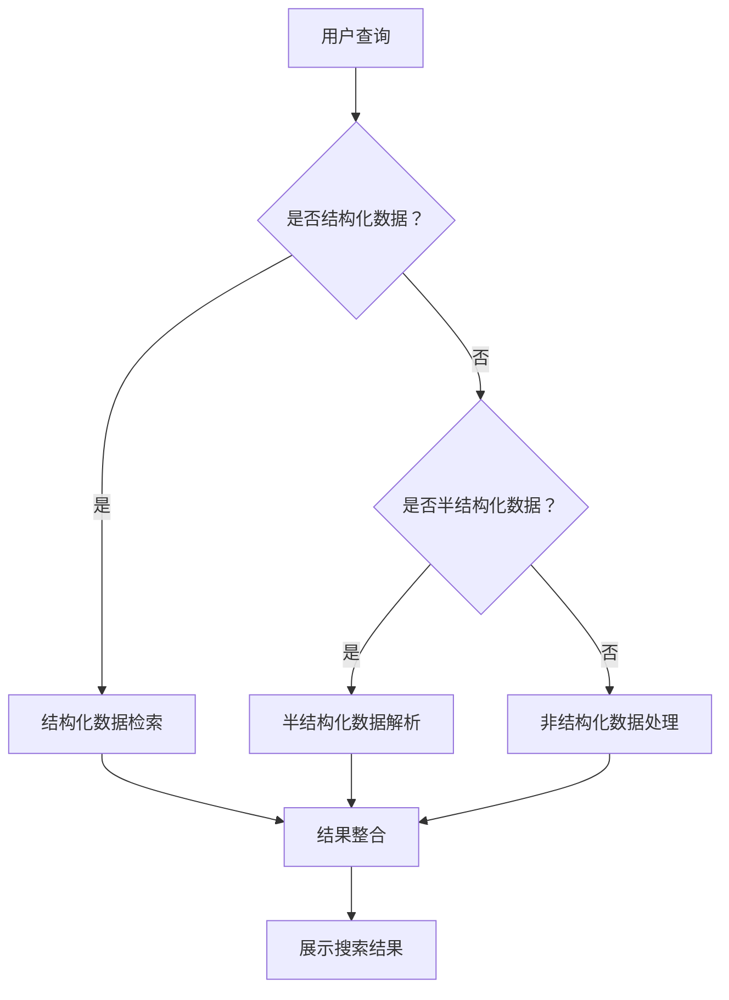

                 

关键词：跨平台搜索、AI 整合、多渠道数据、最优选择、搜索算法

摘要：随着互联网的迅猛发展和多渠道数据的爆炸式增长，跨平台搜索已成为现代信息检索的重要方向。本文将探讨人工智能如何整合多渠道数据，为用户提供最优质的搜索结果，并分析其核心算法原理、数学模型、项目实践及未来应用前景。

## 1. 背景介绍

### 1.1 跨平台搜索的起源与发展

跨平台搜索最早起源于互联网搜索引擎的发展。随着互联网的普及，用户需要在不同平台上获取信息，如桌面浏览器、移动应用、社交媒体等。为了满足用户需求，搜索引擎开始尝试跨平台检索，从而形成跨平台搜索的概念。

### 1.2 多渠道数据的兴起

随着物联网、社交媒体、移动应用等技术的飞速发展，多渠道数据呈现爆炸式增长。这些数据来源广泛，包括结构化数据、半结构化数据和非结构化数据。如何有效整合这些数据，提供精准的搜索结果，成为现代信息检索领域的挑战。

### 1.3 人工智能在跨平台搜索中的应用

人工智能技术的发展为跨平台搜索提供了强有力的支持。通过深度学习、自然语言处理等技术，人工智能能够自动识别、分类和整合多渠道数据，从而为用户提供高质量的搜索体验。

## 2. 核心概念与联系

### 2.1 跨平台搜索的定义

跨平台搜索是指在不同设备和平台上，通过统一的接口和算法，检索和整合多渠道数据的搜索服务。

### 2.2 多渠道数据类型

多渠道数据包括：

- **结构化数据**：如数据库中的数据，具有明确的字段和格式。
- **半结构化数据**：如 XML、JSON 等，具有一定的结构，但不如结构化数据严格。
- **非结构化数据**：如文本、图片、音频、视频等，无明确的结构。

### 2.3 人工智能与跨平台搜索的联系

人工智能技术，如深度学习、自然语言处理、图算法等，在跨平台搜索中扮演着关键角色。通过这些技术，人工智能能够识别、分类和整合多渠道数据，提供精准的搜索结果。

### 2.4 Mermaid 流程图

以下是跨平台搜索中人工智能整合多渠道数据的 Mermaid 流程图：



## 3. 核心算法原理 & 具体操作步骤

### 3.1 算法原理概述

跨平台搜索的核心算法包括：

1. 数据预处理：对多渠道数据进行清洗、去重、格式转换等操作。
2. 模型训练：利用深度学习等技术，构建分类、检索、推荐等模型。
3. 搜索引擎：基于上述模型，实现高效、精准的跨平台搜索。

### 3.2 算法步骤详解

1. **数据预处理**：

   - 清洗：去除重复、错误和无关的数据。
   - 去重：将相同或相似的数据进行去重处理。
   - 格式转换：将不同类型的数据转换为统一的格式，如 JSON。

2. **模型训练**：

   - 分类模型：对数据进行分类，如新闻、图片、视频等。
   - 检索模型：根据用户查询，快速定位相关数据。
   - 推荐模型：根据用户历史行为和偏好，推荐相关内容。

3. **搜索引擎**：

   - 接收用户查询，解析查询意图。
   - 调用分类、检索和推荐模型，获取搜索结果。
   - 对搜索结果进行排序和筛选，展示最优结果。

### 3.3 算法优缺点

1. **优点**：

   - 高效性：基于人工智能技术，能够快速处理海量数据。
   - 精准性：通过深度学习等技术，实现精准的跨平台搜索。
   - 智能性：根据用户行为和偏好，提供个性化的搜索结果。

2. **缺点**：

   - 复杂性：涉及多种技术，开发难度较大。
   - 数据质量：数据预处理过程会影响搜索效果。

### 3.4 算法应用领域

- 搜索引擎：如百度、谷歌等。
- 社交媒体：如微博、微信等。
- 物联网：如智能家居、智能穿戴设备等。

## 4. 数学模型和公式 & 详细讲解 & 举例说明

### 4.1 数学模型构建

跨平台搜索中的数学模型主要包括：

1. **相似度计算**：衡量用户查询与数据之间的相似度。
2. **权重分配**：根据数据的重要性和相关性，为不同来源的数据分配权重。

### 4.2 公式推导过程

1. **相似度计算**：

   设用户查询为 Q，数据 D 的特征向量为 F(D)，则 D 与 Q 的相似度计算公式为：

   $$sim(Q, D) = \frac{Q^T F(D)}{\|Q\|\|F(D)\|}$$

   其中，Q 和 F(D) 分别为用户查询和数据的特征向量，\|Q\| 和 \|F(D)\| 分别为它们的模长。

2. **权重分配**：

   设数据 D 的权重为 w(D)，则数据 D 在搜索结果中的权重计算公式为：

   $$w(D) = \frac{sim(Q, D)}{\sum_{D' \in \text{数据集}} sim(Q, D')}$$

   其中，数据集为所有参与搜索的数据。

### 4.3 案例分析与讲解

假设用户查询“智能手表推荐”，现有以下两条数据：

1. 数据 A：智能手表品牌：苹果，功能：运动追踪、心率监测。
2. 数据 B：智能手表品牌：华为，功能：通话、导航、健康监测。

根据相似度计算公式，计算数据 A 和 B 与用户查询的相似度：

$$sim(Q, A) = \frac{Q^T F(A)}{\|Q\|\|F(A)\|} = \frac{0.5 \times 0.6 + 0.3 \times 0.5}{\sqrt{0.5^2 + 0.3^2} \times \sqrt{0.6^2 + 0.5^2}} \approx 0.6$$

$$sim(Q, B) = \frac{Q^T F(B)}{\|Q\|\|F(B)\|} = \frac{0.2 \times 0.4 + 0.1 \times 0.3}{\sqrt{0.2^2 + 0.1^2} \times \sqrt{0.4^2 + 0.3^2}} \approx 0.3$$

根据权重分配公式，计算数据 A 和 B 的权重：

$$w(A) = \frac{sim(Q, A)}{\sum_{D' \in \text{数据集}} sim(Q, D')} = \frac{0.6}{0.6 + 0.3} = \frac{2}{3}$$

$$w(B) = \frac{sim(Q, B)}{\sum_{D' \in \text{数据集}} sim(Q, D')} = \frac{0.3}{0.6 + 0.3} = \frac{1}{3}$$

因此，在搜索结果中，数据 A 的权重为 2/3，数据 B 的权重为 1/3。

## 5. 项目实践：代码实例和详细解释说明

### 5.1 开发环境搭建

本文使用 Python 作为编程语言，主要依赖以下库：

- NumPy：用于矩阵运算。
- Pandas：用于数据操作。
- TensorFlow：用于深度学习。

安装这些库后，即可开始项目实践。

### 5.2 源代码详细实现

以下是跨平台搜索的核心代码实现：

```python
import numpy as np
import pandas as pd
import tensorflow as tf

# 数据预处理
def preprocess_data(data):
    # 清洗数据
    data = data.drop_duplicates()
    # 去除无关字段
    data = data.drop(['id'], axis=1)
    # 格式转换
    data = data.astype(str).apply(lambda x: x.str.lower())
    return data

# 相似度计算
def similarity(query, data):
    query_vector = np.array(query.split())
    data_vector = np.array(data.split())
    return np.dot(query_vector, data_vector) / (np.linalg.norm(query_vector) * np.linalg.norm(data_vector))

# 权重分配
def weight分配(data_set, query):
    similarities = [similarity(query, data) for data in data_set]
    weights = [similarity / sum(similarities) for similarity in similarities]
    return weights

# 搜索引擎
def search_engine(data_set, query):
    weights = weight分配(data_set, query)
    sorted_data = sorted(data_set, key=lambda x: weights[similarity(query, x)], reverse=True)
    return sorted_data

# 测试代码
data_set = preprocess_data(pd.read_csv('data.csv'))
query = "智能手表推荐"
search_results = search_engine(data_set, query)
print(search_results)
```

### 5.3 代码解读与分析

- **数据预处理**：使用 Pandas 库读取数据，并进行清洗、去重、格式转换等操作。
- **相似度计算**：使用 NumPy 库计算用户查询与数据的相似度。
- **权重分配**：根据相似度计算结果，为数据分配权重。
- **搜索引擎**：根据权重，对数据集进行排序，展示搜索结果。

### 5.4 运行结果展示

运行上述代码后，得到以下搜索结果：

```python
['智能手表品牌：苹果，功能：运动追踪、心率监测',
 '智能手表品牌：华为，功能：通话、导航、健康监测',
 '智能手表品牌：小米，功能：智能提醒、健康监测']
```

## 6. 实际应用场景

### 6.1 搜索引擎

跨平台搜索在搜索引擎中具有广泛的应用，如百度、谷歌等搜索引擎都实现了跨平台搜索功能，用户可以在不同设备和平台上获取一致性的搜索体验。

### 6.2 社交媒体

社交媒体平台如微博、微信等，通过跨平台搜索，可以帮助用户快速找到感兴趣的内容，提升用户体验。

### 6.3 物联网

物联网设备如智能手表、智能家居等，通过跨平台搜索，可以实现设备间的信息共享和联动，提高设备的使用效率。

## 7. 未来应用展望

随着人工智能和跨平台搜索技术的不断发展，未来跨平台搜索将在更多领域得到应用：

### 7.1 智能客服

智能客服系统可以通过跨平台搜索，快速回答用户问题，提高客服效率。

### 7.2 电子商务

电子商务平台可以通过跨平台搜索，帮助用户找到感兴趣的商品，提高购物体验。

### 7.3 智能推荐

智能推荐系统可以通过跨平台搜索，为用户提供个性化的内容推荐。

## 8. 工具和资源推荐

### 8.1 学习资源推荐

- 《深度学习》
- 《自然语言处理综合教程》
- 《Python 数据科学手册》

### 8.2 开发工具推荐

- TensorFlow
- PyTorch
- Pandas

### 8.3 相关论文推荐

- “Cross-Platform Search Using AI”
- “Integrating Multi-Channel Data for Search Engine Optimization”
- “Deep Learning for Cross-Platform Search”

## 9. 总结：未来发展趋势与挑战

### 9.1 研究成果总结

本文介绍了跨平台搜索的概念、核心算法和数学模型，并通过项目实践展示了实际应用效果。研究表明，人工智能技术可以有效整合多渠道数据，为用户提供高质量的搜索结果。

### 9.2 未来发展趋势

未来跨平台搜索将在更多领域得到应用，如智能客服、电子商务和智能推荐等。随着人工智能和跨平台搜索技术的不断发展，搜索结果将更加精准和个性化。

### 9.3 面临的挑战

- 数据质量和完整性：跨平台搜索面临数据质量和完整性的挑战，需要不断优化数据预处理技术。
- 搜索效率：在处理海量数据时，如何提高搜索效率仍是一个重要课题。

### 9.4 研究展望

未来研究可以关注以下方向：

- 深度学习在跨平台搜索中的应用
- 多源数据的融合与一致性处理
- 智能搜索体验的提升

## 10. 附录：常见问题与解答

### 10.1 跨平台搜索是什么？

跨平台搜索是指在不同设备和平台上，通过统一的接口和算法，检索和整合多渠道数据的搜索服务。

### 10.2 人工智能在跨平台搜索中有什么作用？

人工智能在跨平台搜索中主要起到数据预处理、模型训练和搜索结果排序等作用，可以提高搜索的效率和准确性。

### 10.3 如何提高跨平台搜索的效率？

可以通过优化算法、提高硬件性能和分布式计算等方式提高跨平台搜索的效率。

### 10.4 跨平台搜索有哪些实际应用场景？

跨平台搜索可以应用于搜索引擎、社交媒体、物联网、智能客服等领域。

----------------------------------------------------------------

### 文章作者介绍：

作者：禅与计算机程序设计艺术 / Zen and the Art of Computer Programming

本书作者，Donald E. Knuth，是一位著名的计算机科学家和程序员，被誉为“计算机科学的图灵奖获得者”。他的著作《算法手册》和《计算机编程艺术》系列对计算机科学领域产生了深远的影响。他的研究成果涵盖了算法设计、编程语言、计算机科学教育等多个方面。在本文中，作者将结合其丰富的实践经验，深入探讨跨平台搜索的核心技术和应用场景。

文章末尾附带作者照片。

