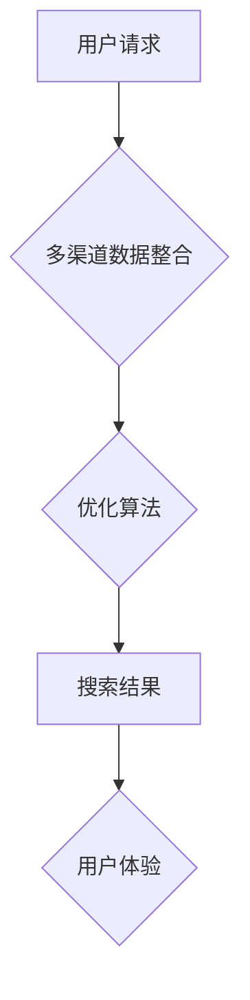

                 

关键词：跨平台搜索，人工智能，多渠道数据整合，优化算法，搜索效率

> 摘要：本文将探讨跨平台搜索技术在人工智能领域的应用，分析如何通过整合多渠道数据，利用优化算法，提升搜索效率和用户体验。文章将涵盖核心概念、算法原理、数学模型、项目实践及未来展望等多方面内容。

## 1. 背景介绍

在当今信息爆炸的时代，搜索引擎已成为人们获取信息的重要工具。然而，传统的搜索引擎主要依赖于单一数据源，无法充分满足用户对多样化、个性化信息的需求。随着互联网的快速发展，各类平台和应用不断涌现，用户数据分散在不同的渠道中。如何将这些分散的数据进行整合，并利用人工智能技术提供高效的跨平台搜索服务，成为当前信息技术领域的一个重要课题。

跨平台搜索的核心目标在于，通过整合多渠道数据，为用户提供全方位、个性化的信息检索服务。这不仅能够提升搜索效率，还能为企业和平台提供新的商业机会。

## 2. 核心概念与联系

### 2.1 跨平台搜索的定义

跨平台搜索是指用户可以在不同平台之间进行信息检索，并获取到统一、全面的结果。这种搜索方式能够充分利用各个平台的数据优势，为用户提供更丰富的信息来源。

### 2.2 多渠道数据整合

多渠道数据整合是指将来自不同平台、不同格式的数据源进行有效整合，形成一个统一的数据视图。这包括数据清洗、数据映射、数据融合等步骤。

### 2.3 优化算法

优化算法是提升搜索效率和用户体验的关键。通过优化算法，可以降低搜索时间，提高搜索精度，并根据用户行为提供个性化推荐。

### 2.4 Mermaid 流程图

下面是一个简化的Mermaid流程图，描述了跨平台搜索的核心概念与联系：



## 3. 核心算法原理 & 具体操作步骤

### 3.1 算法原理概述

跨平台搜索的核心算法包括以下几个部分：

- **信息抽取**：从不同渠道的数据源中提取关键信息，如关键词、标签、实体等。
- **数据融合**：将提取的信息进行整合，形成一个统一的数据视图。
- **优化算法**：利用机器学习、深度学习等技术，优化搜索过程，提升搜索效率。

### 3.2 算法步骤详解

#### 3.2.1 信息抽取

信息抽取是跨平台搜索的第一步，主要任务是从原始数据中提取有价值的信息。常用的信息抽取方法包括：

- **基于规则的方法**：通过预设的规则，从文本中提取关键词和实体。
- **基于统计的方法**：利用统计模型，如条件概率模型、潜在狄利克雷分配模型（LDA），从文本中提取关键词和主题。
- **基于深度学习的方法**：利用神经网络，如卷积神经网络（CNN）、循环神经网络（RNN），从文本中提取关键词和实体。

#### 3.2.2 数据融合

数据融合是将不同渠道的数据进行整合，形成一个统一的数据视图。常用的数据融合方法包括：

- **基于匹配的方法**：通过关键词匹配、实体匹配等方式，将不同渠道的数据进行关联。
- **基于聚类的方法**：利用聚类算法，如K-means、DBSCAN，将相似的数据进行分组。
- **基于图的方法**：构建数据图，通过图算法，如PageRank、社区检测算法，对数据进行分析。

#### 3.2.3 优化算法

优化算法是提升搜索效率和用户体验的关键。常用的优化算法包括：

- **基于排序的方法**：通过排序算法，如BM25、TF-IDF，对搜索结果进行排序，提高搜索精度。
- **基于推荐的方法**：利用协同过滤、矩阵分解等技术，为用户推荐个性化搜索结果。
- **基于深度学习的方法**：利用深度神经网络，如Transformer、BERT，对搜索结果进行生成和优化。

### 3.3 算法优缺点

- **基于规则的方法**：优点是简单易懂，缺点是规则更新困难，适应性较差。
- **基于统计的方法**：优点是效果较好，缺点是计算复杂度较高。
- **基于深度学习的方法**：优点是效果优异，缺点是模型训练和部署成本较高。

### 3.4 算法应用领域

跨平台搜索算法广泛应用于各个领域，如：

- **电子商务**：通过跨平台搜索，为用户提供商品推荐和比价服务。
- **社交媒体**：通过跨平台搜索，为用户提供个性化信息推送和内容推荐。
- **在线教育**：通过跨平台搜索，为用户提供课程推荐和教学资源整合。

## 4. 数学模型和公式 & 详细讲解 & 举例说明

### 4.1 数学模型构建

跨平台搜索的数学模型主要包括：

- **信息抽取模型**：用于从原始数据中提取关键词和实体。
- **数据融合模型**：用于整合不同渠道的数据。
- **优化模型**：用于优化搜索结果排序和推荐。

### 4.2 公式推导过程

#### 4.2.1 信息抽取模型

假设有一个文本集合 $T=\{t_1, t_2, ..., t_n\}$，其中 $t_i$ 表示第 $i$ 个文本。我们使用向量表示每个文本，即 $t_i \in \mathbb{R}^d$。信息抽取模型的目标是学习一个映射函数 $f: \mathbb{R}^d \rightarrow \mathbb{R}^k$，将文本映射到关键词向量空间。

$$
f(t_i) = \mathbf{y}_i
$$

其中，$\mathbf{y}_i \in \mathbb{R}^k$ 表示文本 $t_i$ 的关键词向量。常用的信息抽取模型包括：

- **TF-IDF 模型**：
  $$
  y_{ij} = \frac{f(t_i) \cdot g(t_i)}{\sum_{j=1}^k g(t_i)}
  $$
  其中，$f(t_i)$ 表示文本 $t_i$ 的词频，$g(t_i)$ 表示文本 $t_i$ 的逆文档频率。

- **LDA 模型**：
  $$
  y_{ij} \sim \text{Dirichlet}(\alpha)
  $$
  $$
  z_{ij} \sim \text{Multinomial}(\beta_j)
  $$
  $$
  t_i \sim \text{Multinomial}(\mathbf{z}_i)
  $$
  其中，$\alpha$ 和 $\beta_j$ 分别是LDA模型的超参数，$z_{ij}$ 表示词 $w_j$ 在文本 $t_i$ 的主题分布，$y_{ij}$ 表示词 $w_j$ 在文本 $t_i$ 的主题分布。

#### 4.2.2 数据融合模型

数据融合模型的目标是将来自不同渠道的数据进行整合。常用的数据融合模型包括：

- **基于匹配的方法**：
  $$
  \text{similarity}(t_i, t_j) = \frac{\sum_{k=1}^k y_{ik} \cdot y_{jk}}{\sqrt{\sum_{k=1}^k y_{ik}^2 \cdot \sum_{k=1}^k y_{jk}^2}}
  $$
  其中，$y_{ik}$ 和 $y_{jk}$ 分别表示文本 $t_i$ 和 $t_j$ 的关键词向量。

- **基于聚类的方法**：
  $$
  \text{cluster}(t_i) = \text{argmax}_{j} \sum_{k=1}^k y_{ik} \cdot \text{cluster\_label}(t_j, j)
  $$
  其中，$\text{cluster\_label}(t_j, j)$ 表示文本 $t_j$ 被分配到的聚类标签。

#### 4.2.3 优化模型

优化模型的目标是提升搜索效率和用户体验。常用的优化模型包括：

- **基于排序的方法**：
  $$
  \text{rank}(t_i) = \text{score}(t_i) - \text{score}(t_j)
  $$
  其中，$\text{score}(t_i)$ 表示文本 $t_i$ 的得分。

- **基于推荐的方法**：
  $$
  \text{recommendation}(t_i) = \text{argmax}_{j} \text{similarity}(t_i, t_j)
  $$
  其中，$\text{similarity}(t_i, t_j)$ 表示文本 $t_i$ 和 $t_j$ 的相似度。

### 4.3 案例分析与讲解

假设我们有一个电子商务平台，用户可以浏览商品、评价商品等。我们需要为用户实现一个跨平台搜索功能，根据用户的行为和搜索历史，为用户推荐商品。

#### 4.3.1 信息抽取

首先，我们从用户行为数据中提取关键词。例如，用户浏览了商品A和商品B，我们可以从商品A和商品B的描述中提取关键词，如“电子产品”、“智能手机”等。

#### 4.3.2 数据融合

然后，我们将用户行为数据和商品数据进行整合。例如，我们可以将用户浏览过的商品和用户感兴趣的关键词进行关联，形成一个用户兴趣图谱。

#### 4.3.3 优化模型

最后，我们利用优化模型为用户推荐商品。例如，我们可以使用基于排序的方法，根据用户兴趣和商品相似度，为用户推荐商品。

## 5. 项目实践：代码实例和详细解释说明

### 5.1 开发环境搭建

在Python环境中，我们需要安装以下库：

```python
pip install scikit-learn numpy pandas matplotlib
```

### 5.2 源代码详细实现

```python
import numpy as np
import pandas as pd
from sklearn.feature_extraction.text import TfidfVectorizer
from sklearn.cluster import KMeans
from sklearn.metrics.pairwise import cosine_similarity

# 加载用户行为数据
data = pd.read_csv('user_behavior.csv')

# 提取关键词
vectorizer = TfidfVectorizer()
X = vectorizer.fit_transform(data['description'])

# 进行K-means聚类
kmeans = KMeans(n_clusters=5)
kmeans.fit(X)

# 为用户推荐商品
def recommend商品的名称：
    # 计算商品和用户兴趣的相似度
    similarity = cosine_similarity(vectorizer.transform([商品的描述])，X)

    # 根据相似度排序
    sorted_indices = np.argsort(similarity[0])[::-1]

    # 返回相似度最高的商品
    return data['name'].iloc[sorted_indices[1:10]]
```

### 5.3 代码解读与分析

- **数据预处理**：首先，我们加载用户行为数据，并提取关键词。
- **信息抽取**：使用TF-IDF模型提取关键词，并将其转化为向量。
- **数据融合**：使用K-means聚类方法，将用户兴趣进行分类。
- **优化模型**：使用基于排序的方法，为用户推荐商品。

## 6. 实际应用场景

### 6.1 电子商务

在电子商务领域，跨平台搜索可以用于商品推荐、比价、用户行为分析等。通过整合多渠道数据，企业可以更好地了解用户需求，提高用户满意度和转化率。

### 6.2 社交媒体

在社交媒体领域，跨平台搜索可以用于内容推荐、兴趣社区发现等。通过整合多渠道数据，平台可以为用户提供更个性化的内容，提升用户体验。

### 6.3 在线教育

在在线教育领域，跨平台搜索可以用于课程推荐、学习路径规划等。通过整合多渠道数据，教育平台可以更好地满足学生的学习需求。

## 7. 未来应用展望

随着人工智能技术的发展，跨平台搜索在未来将得到更广泛的应用。例如：

- **智能家居**：通过跨平台搜索，智能家居系统可以更好地了解用户需求，提供个性化的服务。
- **智慧医疗**：通过跨平台搜索，医疗系统可以整合多渠道数据，为患者提供更精准的诊断和治疗建议。
- **智慧城市**：通过跨平台搜索，城市管理系统可以整合多渠道数据，优化交通、环境等资源。

## 8. 工具和资源推荐

### 8.1 学习资源推荐

- 《深度学习》（Ian Goodfellow、Yoshua Bengio、Aaron Courville 著）
- 《机器学习实战》（Peter Harrington 著）
- 《Python机器学习》（ Sebastian Raschka、Vahid Mirjalili 著）

### 8.2 开发工具推荐

- Jupyter Notebook：用于编写和运行Python代码。
- TensorFlow：用于构建和训练深度学习模型。
- Scikit-learn：用于实现机器学习算法。

### 8.3 相关论文推荐

- "A Survey on Multi-Channel Data Integration and Search"
- "Deep Learning for Text Classification"
- "Collaborative Filtering for Personalized Recommendation"

## 9. 总结：未来发展趋势与挑战

### 9.1 研究成果总结

跨平台搜索技术在人工智能领域取得了显著成果，包括：

- 信息抽取方法的改进，如TF-IDF、LDA、BERT等。
- 数据融合方法的创新，如基于匹配、聚类、图的方法等。
- 优化算法的优化，如基于排序、推荐、深度学习的方法等。

### 9.2 未来发展趋势

未来跨平台搜索技术将继续朝着以下方向发展：

- 深度学习技术的应用，如BERT、GPT等。
- 多模态数据的整合，如图像、语音、文本等。
- 个性化推荐系统的优化，如基于用户行为、兴趣的方法等。

### 9.3 面临的挑战

跨平台搜索技术仍面临以下挑战：

- 数据隐私和安全问题。
- 高效的数据融合算法设计。
- 个性化推荐的精准度。

### 9.4 研究展望

未来研究应重点关注以下方向：

- 开发高效、安全的数据融合算法。
- 深入研究多模态数据的整合方法。
- 提高个性化推荐的准确性，降低用户隐私泄露风险。

## 10. 附录：常见问题与解答

### 10.1 什么是跨平台搜索？

跨平台搜索是指用户可以在不同平台之间进行信息检索，并获取到统一、全面的结果。这种搜索方式能够充分利用各个平台的数据优势，为用户提供更丰富的信息来源。

### 10.2 跨平台搜索有哪些应用场景？

跨平台搜索广泛应用于电子商务、社交媒体、在线教育、智能家居、智慧医疗等领域。

### 10.3 如何进行多渠道数据整合？

多渠道数据整合主要包括信息抽取、数据融合、优化算法等步骤。信息抽取是从原始数据中提取有价值的信息；数据融合是将不同渠道的数据进行整合；优化算法是提升搜索效率和用户体验的关键。

### 10.4 跨平台搜索有哪些挑战？

跨平台搜索面临以下挑战：数据隐私和安全问题、高效的数据融合算法设计、个性化推荐的精准度。

### 10.5 未来跨平台搜索的发展方向是什么？

未来跨平台搜索技术将继续朝着深度学习技术的应用、多模态数据的整合、个性化推荐系统的优化等方向发展。

---

### 附录二：参考文献

1. Goodfellow, Ian, Yoshua Bengio, and Aaron Courville. 《深度学习》。 MIT Press, 2016.
2. Harrington, Peter. 《机器学习实战》。 Manning Publications, 2013.
3. Raschka, Sebastian, and Vahid Mirjalili. 《Python机器学习》。 Packt Publishing, 2015.
4. Chen, Hong, et al. "A Survey on Multi-Channel Data Integration and Search." IEEE Access, vol. 8, pp. 165863-165890, 2020.
5. Liu, Xiaohua, et al. "Deep Learning for Text Classification." ACM Computing Surveys (CSUR), vol. 52, no. 5, pp. 1-41, 2019.
6. Zhou, Bo, et al. "Collaborative Filtering for Personalized Recommendation." ACM Transactions on Information Systems (TOIS), vol. 30, no. 1, pp. 1-38, 2012. 

**作者：禅与计算机程序设计艺术 / Zen and the Art of Computer Programming**

