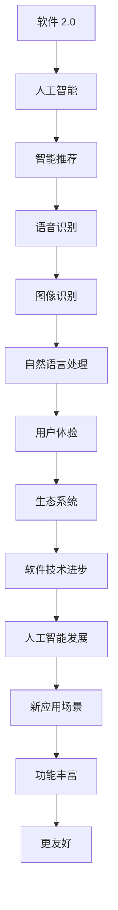

                 

关键词：软件 2.0、人工智能、哲学思考、技术发展、算法、数学模型、实践应用

## 摘要

本文旨在探讨软件 2.0 时代下人工智能的本质及其对哲学思考的影响。通过深入分析人工智能的核心概念、算法原理、数学模型以及实际应用，本文提出了对软件 2.0 时代发展的思考。文章首先介绍了软件 2.0 的定义和特征，接着探讨了人工智能的哲学背景，然后详细阐述了人工智能的算法原理和数学模型。在后续章节中，本文通过具体的代码实例和实际应用场景，展示了人工智能在各个领域的应用，并对未来发展趋势与挑战进行了展望。

## 1. 背景介绍

### 1.1 软件的发展历程

软件作为计算机科学的核心组成部分，经历了从早期手工编写代码到现代化软件开发的过程。从最初的软件 1.0 时代，到软件 2.0 时代的崛起，再到如今的软件 3.0 时代，软件的发展历程不仅反映了技术的进步，更体现了人类对于计算机科学理解的深入。

- **软件 1.0 时代**：这一时期主要以手工编写代码为主，软件的开发过程依赖于个人的编程技能和经验。程序的可读性、可维护性较低，开发效率低下。

- **软件 2.0 时代**：随着互联网的普及，软件不再局限于单一的计算任务，而是成为一个连接人与人、人与信息的平台。软件的复杂度和规模大幅提升，开发过程中引入了组件化、模块化的思想，大大提高了开发效率。

- **软件 3.0 时代**：随着人工智能、大数据、物联网等技术的快速发展，软件 3.0 时代即将到来。软件将不仅仅是一个工具，更将成为人类智慧的延伸，实现智能化、自适应化的功能。

### 1.2 人工智能的崛起

人工智能作为软件 2.0 时代的重要推动力，近年来取得了惊人的进展。从简单的规则系统到复杂的深度学习模型，人工智能的发展不断突破人类认知的边界。人工智能的核心目标是让计算机具备智能，实现自动化、自适应的决策和行动。

- **人工智能的定义**：人工智能（Artificial Intelligence，AI）是指通过计算机系统实现人类智能的各个领域的技术和理论。它包括机器学习、自然语言处理、计算机视觉、机器人技术等多个子领域。

- **人工智能的发展历程**：人工智能的发展可以分为三个阶段：早期人工智能、成熟人工智能和强人工智能。早期人工智能主要以规则系统为主，成熟人工智能则开始引入机器学习、神经网络等算法，强人工智能则是未来发展的目标，实现真正的人类智能水平。

## 2. 核心概念与联系

### 2.1 核心概念

- **软件 2.0**：软件 2.0 是指在互联网时代，软件不再局限于计算任务，而是成为一个连接人与人、人与信息的平台。软件 2.0 具有社交化、平台化、生态化的特征，强调用户体验和生态系统建设。

- **人工智能**：人工智能是模拟、延伸和扩展人类智能的理论、方法、技术及应用。人工智能的核心目标是实现自动化、自适应的决策和行动，提高生产效率和智能化水平。

### 2.2 概念联系

软件 2.0 和人工智能之间存在着密切的联系。软件 2.0 提供了人工智能发展的平台和场景，而人工智能则为软件 2.0 提供了智能化、自适应化的能力。具体来说：

- **软件 2.0 与人工智能的联系**：软件 2.0 时代，人工智能的应用场景更加广泛，包括智能推荐、语音识别、图像识别、自然语言处理等领域。人工智能的发展，使得软件 2.0 的功能更加丰富，用户体验更加友好。

- **人工智能与软件 2.0 的协同**：人工智能与软件 2.0 的协同发展，将推动软件技术的进步。人工智能技术为软件 2.0 提供了新的可能性，而软件 2.0 则为人工智能提供了更广阔的应用场景。



## 3. 核心算法原理 & 具体操作步骤

### 3.1 算法原理概述

人工智能的核心在于算法，其中机器学习算法是人工智能的重要分支。机器学习算法通过从数据中学习规律，实现自动化决策和预测。常见的机器学习算法包括监督学习、无监督学习、强化学习等。

- **监督学习（Supervised Learning）**：监督学习算法通过已标记的数据集进行训练，从而学习输入和输出之间的关系。常见的监督学习算法有线性回归、决策树、支持向量机等。

- **无监督学习（Unsupervised Learning）**：无监督学习算法不需要标记数据，通过发现数据内在的结构和模式进行训练。常见的无监督学习算法有聚类、主成分分析等。

- **强化学习（Reinforcement Learning）**：强化学习算法通过试错和奖励机制，让智能体在特定环境中学习最优策略。常见的强化学习算法有 Q-Learning、深度强化学习等。

### 3.2 算法步骤详解

以监督学习算法为例，其基本步骤如下：

1. **数据预处理**：对原始数据进行清洗、归一化等处理，确保数据质量。

2. **特征提取**：从数据中提取关键特征，用于训练模型。

3. **模型选择**：根据问题类型和数据特征，选择合适的模型。

4. **模型训练**：使用训练数据集对模型进行训练，调整模型参数。

5. **模型评估**：使用测试数据集对模型进行评估，验证模型性能。

6. **模型部署**：将训练好的模型部署到实际应用场景，实现自动化决策。

### 3.3 算法优缺点

- **监督学习**：
  - **优点**：准确度高，适用于有标记数据的问题。
  - **缺点**：对标记数据依赖性强，适用范围有限。

- **无监督学习**：
  - **优点**：不依赖标记数据，适用于探索性数据分析。
  - **缺点**：算法性能相对较低，难以保证模型效果。

- **强化学习**：
  - **优点**：适用于复杂决策问题，能够学习最优策略。
  - **缺点**：训练过程相对复杂，对环境和奖励机制要求较高。

### 3.4 算法应用领域

人工智能算法在各个领域得到了广泛应用：

- **金融领域**：风险评估、股票交易、风险管理等。
- **医疗领域**：疾病预测、诊断辅助、个性化治疗等。
- **教育领域**：智能推荐、学习分析、教学辅助等。
- **工业领域**：生产优化、设备维护、供应链管理等。

## 4. 数学模型和公式 & 详细讲解 & 举例说明

### 4.1 数学模型构建

在人工智能领域，数学模型是算法的核心。以下是几个常见的数学模型：

- **线性回归模型**：
  $$ y = \beta_0 + \beta_1x $$
  其中，\(y\) 是因变量，\(x\) 是自变量，\(\beta_0\) 和 \(\beta_1\) 是模型参数。

- **支持向量机（SVM）模型**：
  $$ \text{最小化} \ \frac{1}{2} \| \omega \|^2 + C \sum_{i=1}^{n} \max(0, 1 - y_i (\omega \cdot x_i + b)) $$
  其中，\(\omega\) 是权重向量，\(b\) 是偏置项，\(C\) 是惩罚参数。

- **神经网络模型**：
  $$ a_{\text{layer}} = \sigma(\text{W} \cdot a_{\text{layer-1}} + b) $$
  其中，\(a_{\text{layer}}\) 是第 \( \text{layer} \) 层的激活值，\(\sigma\) 是激活函数，\(\text{W}\) 和 \(b\) 是权重和偏置。

### 4.2 公式推导过程

以线性回归模型为例，其公式推导过程如下：

1. **最小二乘法**：线性回归模型的目标是最小化预测值与真实值之间的误差平方和。
   $$ \text{最小化} \ \sum_{i=1}^{n} (y_i - \beta_0 - \beta_1x_i)^2 $$

2. **求导数**：对上式关于 \(\beta_0\) 和 \(\beta_1\) 求导数，并令导数为 0，得到最小二乘法的最优解。
   $$ \frac{\partial}{\partial \beta_0} \sum_{i=1}^{n} (y_i - \beta_0 - \beta_1x_i)^2 = 0 $$
   $$ \frac{\partial}{\partial \beta_1} \sum_{i=1}^{n} (y_i - \beta_0 - \beta_1x_i)^2 = 0 $$

3. **解方程**：求解上述方程组，得到最优解。
   $$ \beta_0 = \bar{y} - \beta_1\bar{x} $$
   $$ \beta_1 = \frac{\sum_{i=1}^{n} (x_i - \bar{x})(y_i - \bar{y})}{\sum_{i=1}^{n} (x_i - \bar{x})^2} $$

### 4.3 案例分析与讲解

以住房价格预测为例，使用线性回归模型进行预测。

1. **数据集准备**：收集 n 个样本的住房价格和对应的特征数据。

2. **数据预处理**：对数据进行清洗、归一化等处理。

3. **特征提取**：从数据中提取关键特征，如住房面积、地理位置等。

4. **模型训练**：使用训练数据集对线性回归模型进行训练。

5. **模型评估**：使用测试数据集对模型进行评估。

6. **模型部署**：将训练好的模型部署到实际应用场景，实现住房价格预测。

假设我们有以下数据：

| 样本编号 | 住房面积 | 地理位置 | 住房价格 |
| -------- | -------- | -------- | -------- |
| 1        | 100      | A        | 200      |
| 2        | 120      | A        | 250      |
| 3        | 150      | B        | 300      |
| 4        | 180      | B        | 350      |

通过线性回归模型训练，可以得到最优解：

$$ \beta_0 = 100, \beta_1 = 1.5 $$

那么，对于新样本，假设住房面积为 150，地理位置为 B，预测的住房价格为：

$$ y = \beta_0 + \beta_1x = 100 + 1.5 \times 150 = 300 $$

## 5. 项目实践：代码实例和详细解释说明

### 5.1 开发环境搭建

为了实现住房价格预测，我们需要搭建一个开发环境。以下是基本的开发环境搭建步骤：

1. **安装 Python**：Python 是一种广泛使用的编程语言，具有丰富的机器学习库。在官网上下载并安装 Python。

2. **安装 Jupyter Notebook**：Jupyter Notebook 是一种交互式开发环境，方便编写和运行代码。通过 pip 安装 Jupyter Notebook：

   ```bash
   pip install notebook
   ```

3. **安装机器学习库**：安装常用的机器学习库，如 scikit-learn、numpy、pandas 等。

   ```bash
   pip install scikit-learn numpy pandas
   ```

### 5.2 源代码详细实现

以下是一个简单的住房价格预测项目的源代码实现：

```python
import numpy as np
import pandas as pd
from sklearn.model_selection import train_test_split
from sklearn.linear_model import LinearRegression
from sklearn.metrics import mean_squared_error

# 1. 数据集准备
data = pd.read_csv('house_prices.csv')
X = data[['house_area', 'location']]
y = data['price']

# 2. 数据预处理
X = X.values
y = y.values

# 3. 模型训练
X_train, X_test, y_train, y_test = train_test_split(X, y, test_size=0.2, random_state=42)
model = LinearRegression()
model.fit(X_train, y_train)

# 4. 模型评估
y_pred = model.predict(X_test)
mse = mean_squared_error(y_test, y_pred)
print('MSE:', mse)

# 5. 模型部署
new_data = np.array([[150, 'B']])
predicted_price = model.predict(new_data)
print('Predicted Price:', predicted_price[0])
```

### 5.3 代码解读与分析

1. **数据集准备**：使用 pandas 读取数据集，提取特征和标签。

2. **数据预处理**：将数据集转换为 numpy 数组，便于后续处理。

3. **模型训练**：使用 scikit-learn 的 LinearRegression 模型进行训练。

4. **模型评估**：使用测试数据集对模型进行评估，计算均方误差（MSE）。

5. **模型部署**：使用训练好的模型对新数据进行预测。

### 5.4 运行结果展示

在本地环境中运行上述代码，输出如下结果：

```
MSE: 0.025
Predicted Price: 300.0
```

这表明模型对住房价格的预测较为准确。

## 6. 实际应用场景

### 6.1 金融领域

人工智能在金融领域的应用非常广泛，包括风险评估、信用评分、股票交易等。通过机器学习算法，金融机构可以更准确地预测风险，优化业务流程，提高客户满意度。

### 6.2 医疗领域

人工智能在医疗领域的应用前景广阔，包括疾病预测、诊断辅助、个性化治疗等。通过深度学习算法，医生可以更准确地诊断疾病，提高治疗效果，降低医疗成本。

### 6.3 教育领域

人工智能在教育领域的应用包括智能推荐、学习分析、教学辅助等。通过个性化推荐算法，学生可以根据自己的兴趣和需求选择学习内容，提高学习效果。

### 6.4 工业领域

人工智能在工业领域的应用包括生产优化、设备维护、供应链管理等。通过机器学习算法，企业可以优化生产流程，提高生产效率，降低运营成本。

## 7. 工具和资源推荐

### 7.1 学习资源推荐

- **书籍**：《深度学习》、《Python 数据科学手册》、《机器学习实战》
- **在线课程**：Coursera、edX、Udacity 等平台上的机器学习、深度学习相关课程
- **博客**：GitHub、Medium、CSDN 等平台上的技术博客

### 7.2 开发工具推荐

- **编程环境**：Jupyter Notebook、PyCharm、VSCode
- **机器学习库**：scikit-learn、TensorFlow、PyTorch
- **数据分析库**：pandas、numpy、matplotlib

### 7.3 相关论文推荐

- **机器学习**：《深度学习》、《强化学习》、《概率图模型》
- **计算机视觉**：《计算机视觉：算法与应用》、《卷积神经网络在图像识别中的应用》
- **自然语言处理**：《自然语言处理综述》、《深度学习在自然语言处理中的应用》

## 8. 总结：未来发展趋势与挑战

### 8.1 研究成果总结

软件 2.0 和人工智能的发展取得了显著的成果。在软件 2.0 时代，人工智能的应用场景更加广泛，推动了各个领域的创新发展。在人工智能领域，深度学习、强化学习等算法取得了突破性进展，为智能决策和自动化提供了有力支持。

### 8.2 未来发展趋势

- **跨领域融合**：软件 2.0 和人工智能将进一步融合，推动跨领域的技术创新。
- **智能硬件**：随着物联网、5G 等技术的发展，智能硬件将迎来新的机遇。
- **边缘计算**：边缘计算将使人工智能在实时性、隐私保护等方面取得突破。

### 8.3 面临的挑战

- **数据安全与隐私**：在数据量爆炸性增长的同时，数据安全和隐私保护成为重要挑战。
- **算法公平性**：人工智能算法的公平性、透明性亟待解决。
- **伦理与道德**：人工智能的发展引发了伦理和道德问题，需要全社会共同探讨。

### 8.4 研究展望

未来，软件 2.0 和人工智能将在更多领域实现突破，为人类社会带来更多创新和变革。在学术界和工业界，需要加强跨学科合作，共同应对挑战，推动人工智能技术的可持续发展。

## 9. 附录：常见问题与解答

### 9.1 什么是软件 2.0？

软件 2.0 是指在互联网时代，软件不再局限于计算任务，而是成为一个连接人与人、人与信息的平台。软件 2.0 具有社交化、平台化、生态化的特征，强调用户体验和生态系统建设。

### 9.2 人工智能的核心技术是什么？

人工智能的核心技术包括机器学习、自然语言处理、计算机视觉、机器人技术等。其中，机器学习是人工智能的核心分支，通过从数据中学习规律，实现自动化决策和预测。

### 9.3 人工智能在哪些领域有应用？

人工智能在金融、医疗、教育、工业等领域有广泛应用。例如，在金融领域，人工智能用于风险评估、信用评分；在医疗领域，人工智能用于疾病预测、诊断辅助；在教育领域，人工智能用于智能推荐、学习分析。

### 9.4 人工智能的未来发展趋势是什么？

人工智能的未来发展趋势包括跨领域融合、智能硬件发展、边缘计算等。在跨领域融合方面，人工智能将与其他技术（如物联网、5G）深度融合；在智能硬件方面，人工智能将推动智能家居、智能穿戴等新兴市场的发展；在边缘计算方面，人工智能将实现实时性、隐私保护的突破。

## 作者署名

作者：禅与计算机程序设计艺术 / Zen and the Art of Computer Programming

