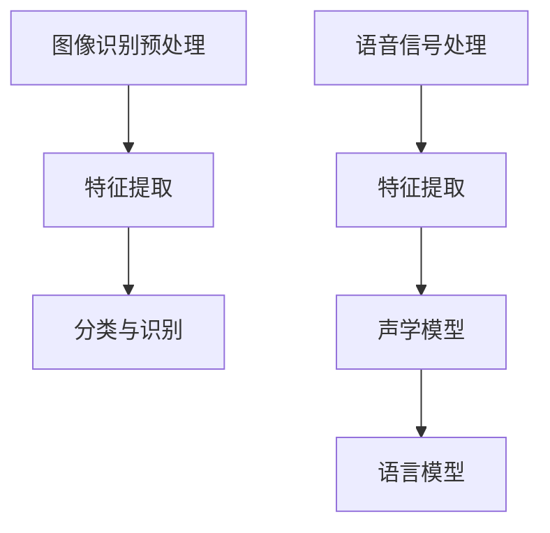

                 

关键词：软件 2.0，图像识别，语音识别，人工智能，深度学习，计算机视觉，自然语言处理，应用领域，未来展望

> 摘要：本文将深入探讨软件 2.0 时代图像识别和语音识别技术的应用领域，从核心概念、算法原理、数学模型到实际应用，全面解析这两大领域的现状和未来发展趋势，旨在为读者提供一幅清晰的技术蓝图。

## 1. 背景介绍

随着互联网的普及和信息技术的发展，软件正在从传统 1.0 时代向 2.0 时代迈进。软件 2.0 的核心在于将软件与用户、数据、硬件等元素深度结合，实现智能化、个性化和高效化。在这一背景下，图像识别和语音识别作为人工智能的重要应用领域，正日益受到广泛关注。

图像识别是指计算机通过算法对图像进行分析和处理，从中提取特征并识别出图像中的对象或场景。语音识别则是将人类语音转化为计算机可处理的文本或命令。随着深度学习、卷积神经网络等技术的不断发展，图像识别和语音识别的准确率和应用场景得到了极大的扩展。

## 2. 核心概念与联系

为了更好地理解图像识别和语音识别，我们需要从核心概念和架构入手。

### 2.1 核心概念

- **图像识别**：图像识别是指从图像中识别出特定对象或场景的技术。核心概念包括特征提取、特征匹配、分类等。
- **语音识别**：语音识别是指将人类语音转化为计算机可处理的文本或命令的技术。核心概念包括语音信号处理、特征提取、声学模型、语言模型等。

### 2.2 核心架构

- **图像识别架构**：
  - **预处理**：包括图像去噪、增强、缩放等。
  - **特征提取**：通过卷积神经网络、深度学习等方法提取图像特征。
  - **分类与识别**：利用特征匹配和分类算法识别图像中的对象或场景。

- **语音识别架构**：
  - **语音信号处理**：包括预处理、分帧、加窗等。
  - **特征提取**：通过梅尔频率倒谱系数（MFCC）等算法提取语音特征。
  - **声学模型与语言模型**：声学模型用于建模语音信号，语言模型用于建模文本。

下面是一个简单的 Mermaid 流程图，展示了图像识别和语音识别的核心架构：



## 3. 核心算法原理 & 具体操作步骤

### 3.1 算法原理概述

图像识别和语音识别的核心算法包括卷积神经网络（CNN）、循环神经网络（RNN）、深度学习等。

- **卷积神经网络（CNN）**：CNN 是一种特殊的多层神经网络，主要用于图像识别。它通过卷积层提取图像特征，并通过池化层减少参数数量，提高计算效率。
- **循环神经网络（RNN）**：RNN 是一种用于处理序列数据的神经网络，特别适用于语音识别。它通过循环结构保存前一个时刻的信息，从而更好地处理序列数据。
- **深度学习**：深度学习是一种基于多层神经网络的机器学习方法，通过多层的非线性变换提取特征，实现复杂的模式识别。

### 3.2 算法步骤详解

- **图像识别算法步骤**：
  1. **数据预处理**：对图像进行去噪、增强、缩放等预处理。
  2. **特征提取**：利用 CNN 等算法提取图像特征。
  3. **分类与识别**：通过特征匹配和分类算法识别图像中的对象或场景。

- **语音识别算法步骤**：
  1. **语音信号处理**：对语音信号进行预处理，包括分帧、加窗、去除静音等。
  2. **特征提取**：利用 MFCC 等算法提取语音特征。
  3. **声学模型与语言模型训练**：通过大量语音数据训练声学模型和语言模型。
  4. **识别**：利用声学模型和语言模型将语音信号转化为文本或命令。

### 3.3 算法优缺点

- **图像识别算法**：
  - **优点**：高准确率，广泛的应用场景。
  - **缺点**：计算复杂度高，对硬件资源要求较高。

- **语音识别算法**：
  - **优点**：实时性强，易于与用户交互。
  - **缺点**：受噪声和环境干扰较大，准确率相对较低。

### 3.4 算法应用领域

- **图像识别应用领域**：人脸识别、车牌识别、安防监控、医疗诊断等。
- **语音识别应用领域**：智能助手、语音翻译、语音搜索、智能家居等。

## 4. 数学模型和公式 & 详细讲解 & 举例说明

### 4.1 数学模型构建

图像识别和语音识别的数学模型主要包括特征提取、分类与识别等。

- **特征提取**：
  - **卷积神经网络**：$f(x) = \sigma(W_1 \cdot x + b_1)$，其中 $\sigma$ 是激活函数，$W_1$ 是卷积核，$b_1$ 是偏置。
  - **循环神经网络**：$h_t = \sigma(W_2 h_{t-1} + W_1 x_t + b_2)$，其中 $h_t$ 是当前时刻的隐藏状态，$x_t$ 是输入特征。

- **分类与识别**：
  - **支持向量机（SVM）**：$w \cdot x + b = 0$，其中 $w$ 是权重向量，$x$ 是特征向量，$b$ 是偏置。
  - **神经网络**：$y = \sigma(\sum_{i=1}^{n} w_i x_i + b)$，其中 $y$ 是输出，$w_i$ 是权重，$x_i$ 是输入特征，$\sigma$ 是激活函数。

### 4.2 公式推导过程

以卷积神经网络为例，其特征提取过程如下：

1. **输入层**：$x = [x_1, x_2, \ldots, x_n]$，其中 $x_i$ 是输入图像的像素值。
2. **卷积层**：$f(x) = \sigma(W_1 \cdot x + b_1)$，其中 $W_1$ 是卷积核，$b_1$ 是偏置。
3. **池化层**：$p(x) = \max(f(x))$，其中 $p(x)$ 是池化后的特征。
4. **全连接层**：$y = \sigma(\sum_{i=1}^{n} w_i p_i + b_2)$，其中 $w_i$ 是权重，$p_i$ 是池化后的特征，$b_2$ 是偏置。

### 4.3 案例分析与讲解

假设我们有一个 28x28 像素的图像，需要通过卷积神经网络对其进行分类。

1. **输入层**：$x = [x_1, x_2, \ldots, x_{784}]$，其中 $x_i$ 是图像的像素值。
2. **卷积层**：使用 5x5 的卷积核，提取 32 个特征图。$f(x) = \sigma(W_1 \cdot x + b_1)$，其中 $W_1$ 是 5x5 的卷积核，$b_1$ 是 32 维的偏置。
3. **池化层**：使用 2x2 的最大池化，将特征图压缩为 14x14。
4. **全连接层**：使用 128 个神经元，对池化后的特征进行分类。$y = \sigma(\sum_{i=1}^{128} w_i p_i + b_2)$，其中 $w_i$ 是 128 维的权重，$p_i$ 是池化后的特征，$b_2$ 是 128 维的偏置。

通过这样的模型，我们可以将图像识别为不同类别。

## 5. 项目实践：代码实例和详细解释说明

### 5.1 开发环境搭建

为了实现图像识别和语音识别，我们需要搭建一个开发环境。这里以 Python 为主要编程语言，使用 TensorFlow 和 Keras 库进行深度学习模型的训练和预测。

1. **安装 Python**：下载并安装 Python 3.7 或以上版本。
2. **安装 TensorFlow**：在终端执行 `pip install tensorflow`。
3. **安装 Keras**：在终端执行 `pip install keras`。

### 5.2 源代码详细实现

下面是一个简单的图像识别代码实例：

```python
import numpy as np
import tensorflow as tf
from tensorflow.keras.models import Sequential
from tensorflow.keras.layers import Conv2D, MaxPooling2D, Flatten, Dense

# 加载数据集
(x_train, y_train), (x_test, y_test) = tf.keras.datasets.mnist.load_data()

# 预处理数据
x_train = x_train / 255.0
x_test = x_test / 255.0

# 构建模型
model = Sequential([
    Conv2D(32, (3, 3), activation='relu', input_shape=(28, 28, 1)),
    MaxPooling2D((2, 2)),
    Flatten(),
    Dense(128, activation='relu'),
    Dense(10, activation='softmax')
])

# 编译模型
model.compile(optimizer='adam', loss='sparse_categorical_crossentropy', metrics=['accuracy'])

# 训练模型
model.fit(x_train, y_train, epochs=5, batch_size=32, validation_data=(x_test, y_test))

# 评估模型
test_loss, test_acc = model.evaluate(x_test, y_test, verbose=2)
print(f"Test accuracy: {test_acc:.2f}")
```

### 5.3 代码解读与分析

1. **导入库**：导入必要的库，包括 NumPy、TensorFlow 和 Keras。
2. **加载数据集**：使用 TensorFlow 的 `mnist` 数据集，这是一个手写数字数据集。
3. **预处理数据**：将图像数据归一化，即将像素值缩放到 [0, 1] 范围内。
4. **构建模型**：使用 Keras 的 `Sequential` 模型，添加卷积层、池化层、全连接层等。
5. **编译模型**：设置优化器、损失函数和评估指标。
6. **训练模型**：使用 `fit` 函数训练模型，设置训练轮数、批量大小和验证数据。
7. **评估模型**：使用 `evaluate` 函数评估模型在测试数据上的表现。

通过这个简单的实例，我们可以了解图像识别的基本流程和实现方法。

## 6. 实际应用场景

图像识别和语音识别在实际应用中具有广泛的应用场景，下面是一些典型的例子：

- **人脸识别**：用于安防监控、身份验证、智能门禁等。
- **车牌识别**：用于交通监控、违章处理、车辆管理等。
- **医疗诊断**：用于疾病检测、医学影像分析、基因分析等。
- **语音助手**：用于智能音箱、智能手机、车载系统等。
- **语音翻译**：用于跨语言交流、国际会议、旅游翻译等。

随着技术的不断发展，这些应用场景将得到进一步的拓展和优化。

### 6.4 未来应用展望

随着软件 2.0 时代的到来，图像识别和语音识别技术将继续向更高精度、更高效率、更广泛的应用领域发展。未来，我们有望看到：

- **更高效的算法**：通过优化算法和模型结构，提高图像识别和语音识别的效率。
- **更多应用场景**：图像识别和语音识别将在更多领域得到应用，如医疗、金融、教育等。
- **更智能的交互**：通过结合多模态识别技术，实现更智能、更自然的用户交互。

## 7. 工具和资源推荐

### 7.1 学习资源推荐

- **书籍**：
  - 《深度学习》（Ian Goodfellow、Yoshua Bengio、Aaron Courville 著）
  - 《神经网络与深度学习》（邱锡鹏 著）
- **在线课程**：
  - [TensorFlow 官方教程](https://www.tensorflow.org/tutorials)
  - [Keras 官方教程](https://keras.io/getting-started/quickstart-guide/)
- **博客和论坛**：
  - [CSDN](https://www.csdn.net/)
  - [GitHub](https://github.com/)

### 7.2 开发工具推荐

- **编程语言**：Python
- **深度学习框架**：TensorFlow、PyTorch
- **文本处理库**：NLTK、spaCy
- **图像处理库**：OpenCV、Pillow

### 7.3 相关论文推荐

- "Deep Learning for Image Recognition: A Comprehensive Review"
- "Recurrent Neural Networks for Speech Recognition"
- "Convolutional Neural Networks for Image Recognition"

## 8. 总结：未来发展趋势与挑战

### 8.1 研究成果总结

图像识别和语音识别技术在过去几十年取得了显著的进展。随着深度学习、卷积神经网络等技术的应用，图像识别和语音识别的准确率和应用场景得到了极大的扩展。

### 8.2 未来发展趋势

未来，图像识别和语音识别技术将继续向更高精度、更高效率、更广泛的应用领域发展。同时，多模态识别技术、边缘计算等技术也将为图像识别和语音识别带来新的发展机遇。

### 8.3 面临的挑战

尽管图像识别和语音识别技术取得了显著的进展，但仍面临一些挑战。例如，受噪声和环境干扰的影响、数据质量和标注问题、计算资源消耗等。

### 8.4 研究展望

未来，我们需要继续深入研究图像识别和语音识别技术，探索更高效的算法、更丰富的应用场景，以及更智能的交互方式。同时，加强跨学科合作，推动技术创新，为人工智能领域的发展贡献力量。

## 9. 附录：常见问题与解答

### 9.1 图像识别和语音识别有什么区别？

图像识别和语音识别都是人工智能的重要分支，但它们针对的数据类型不同。图像识别主要处理图像数据，识别图像中的对象或场景；语音识别则处理语音数据，将语音转化为文本或命令。

### 9.2 深度学习在图像识别和语音识别中的应用有哪些？

深度学习在图像识别和语音识别中得到了广泛应用。图像识别中，深度学习通过卷积神经网络提取图像特征，实现对象识别、场景分类等任务；语音识别中，深度学习通过循环神经网络处理语音序列，实现语音到文本的转换。

### 9.3 如何提高图像识别和语音识别的准确率？

提高图像识别和语音识别的准确率可以从以下几个方面入手：

1. **数据质量**：确保训练数据的质量，去除噪声和异常值。
2. **模型结构**：选择合适的模型结构和参数，优化模型性能。
3. **特征提取**：改进特征提取方法，提取更有代表性的特征。
4. **训练策略**：采用更有效的训练策略，如迁移学习、数据增强等。

通过以上措施，可以有效提高图像识别和语音识别的准确率。

### 9.4 图像识别和语音识别有哪些应用领域？

图像识别和语音识别的应用领域非常广泛，包括但不限于：

- **人脸识别**：用于安防监控、身份验证、智能门禁等。
- **车牌识别**：用于交通监控、违章处理、车辆管理等。
- **医疗诊断**：用于疾病检测、医学影像分析、基因分析等。
- **语音助手**：用于智能音箱、智能手机、车载系统等。
- **语音翻译**：用于跨语言交流、国际会议、旅游翻译等。

随着技术的不断发展，这些应用领域将得到进一步的拓展和优化。

[作者：禅与计算机程序设计艺术 / Zen and the Art of Computer Programming]  
----------------------------------------------------------------


