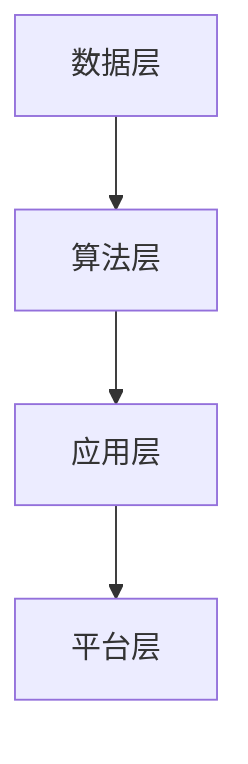

                 

关键词：软件 2.0、实验室、现实、应用、技术、算法、模型、工具、资源、展望

> 摘要：本文探讨了软件 2.0 的概念及其从实验室走向现实的过程。文章首先介绍了软件 2.0 的背景和核心概念，然后详细分析了软件 2.0 的应用领域和算法原理。接着，文章通过实际项目实践，展示了软件 2.0 的具体应用步骤和实现方法。最后，文章对未来软件 2.0 的发展趋势和面临的挑战进行了展望，并推荐了一系列学习和开发工具及资源。

## 1. 背景介绍

软件 2.0 是继互联网 2.0 之后的新一代软件开发模式，它强调软件的智能化、自动化和平台化。软件 2.0 的核心思想是将软件从传统的单体应用模式转变为分布式、模块化、智能化的大规模集成系统。这一转变不仅提高了软件的开发效率和稳定性，还极大地丰富了软件的应用场景。

软件 2.0 的背景源于近年来云计算、大数据、人工智能等技术的快速发展。这些技术的成熟使得软件 2.0 从理论走向实践成为可能。实验室阶段，软件 2.0 的研究主要集中在算法优化、模型构建和系统架构设计等方面。随着技术的不断进步，软件 2.0 正逐渐走向现实，并开始在各个领域得到广泛应用。

## 2. 核心概念与联系

### 2.1 核心概念

软件 2.0 的核心概念包括：

- **智能化**：通过人工智能技术，使软件具备自我学习和自我优化能力，提高软件的适应性和灵活性。

- **自动化**：通过自动化工具和流程，减少人工干预，提高软件的开发效率和稳定性。

- **平台化**：通过构建统一的平台，实现软件的模块化和分布式部署，提高软件的可扩展性和可维护性。

### 2.2 联系与架构

软件 2.0 的架构主要包括以下几个方面：

- **数据层**：负责数据存储、管理和分析，为智能化和自动化提供数据支持。

- **算法层**：负责算法模型的设计和优化，实现软件的智能化和自动化。

- **应用层**：负责具体的业务逻辑和用户交互，实现软件的功能和应用。

- **平台层**：负责软件的模块化和分布式部署，实现软件的可扩展性和可维护性。

下面是软件 2.0 的 Mermaid 流程图：



## 3. 核心算法原理 & 具体操作步骤

### 3.1 算法原理概述

软件 2.0 的核心算法主要包括机器学习、深度学习、自然语言处理等。这些算法通过训练模型，使软件具备自我学习和自我优化能力。具体的算法原理如下：

- **机器学习**：通过数据训练模型，使软件能够识别和预测数据模式。

- **深度学习**：通过多层神经网络，对数据进行特征提取和模式识别。

- **自然语言处理**：通过对自然语言进行建模，实现人与软件的智能交互。

### 3.2 算法步骤详解

以下是软件 2.0 的算法具体操作步骤：

1. **数据收集**：收集相关的数据，包括结构化和非结构化数据。

2. **数据预处理**：对数据进行清洗、去重、归一化等处理。

3. **模型训练**：使用机器学习、深度学习等技术，对数据进行训练，构建模型。

4. **模型优化**：对模型进行优化，提高模型的准确率和效率。

5. **模型部署**：将模型部署到软件系统中，实现软件的智能化和自动化。

### 3.3 算法优缺点

- **优点**：

  - 提高软件的开发效率和稳定性。

  - 实现软件的智能化和自动化。

  - 扩大软件的应用场景。

- **缺点**：

  - 需要大量的数据支持。

  - 对算法和数据处理技术要求较高。

### 3.4 算法应用领域

软件 2.0 的算法在各个领域都有广泛的应用，如：

- **金融领域**：通过算法分析，实现风险评估、智能投顾等功能。

- **医疗领域**：通过算法诊断疾病、优化治疗方案。

- **教育领域**：通过算法实现个性化教学、智能辅导。

## 4. 数学模型和公式 & 详细讲解 & 举例说明

### 4.1 数学模型构建

软件 2.0 的数学模型主要包括机器学习中的损失函数、深度学习中的反向传播算法等。以下是机器学习中的损失函数构建过程：

$$
L(y, \hat{y}) = \frac{1}{2} (y - \hat{y})^2
$$

其中，$y$ 为真实值，$\hat{y}$ 为预测值。

### 4.2 公式推导过程

以下是深度学习中的反向传播算法的推导过程：

$$
\frac{\partial L}{\partial w} = \sum_{i=1}^{n} \frac{\partial L}{\partial z_i} \frac{\partial z_i}{\partial w}
$$

其中，$L$ 为损失函数，$w$ 为权重，$z_i$ 为神经元的输出。

### 4.3 案例分析与讲解

以下是金融领域的一个案例：通过机器学习算法预测股票价格。

1. **数据收集**：收集过去一年的股票价格数据。

2. **数据预处理**：对数据进行清洗和归一化处理。

3. **模型训练**：使用线性回归模型，对数据进行训练。

4. **模型优化**：通过调整权重，优化模型。

5. **模型部署**：将模型部署到软件系统中，实现股票价格预测。

## 5. 项目实践：代码实例和详细解释说明

### 5.1 开发环境搭建

1. 安装 Python 解释器。

2. 安装必要的库，如 NumPy、Pandas、Scikit-learn 等。

### 5.2 源代码详细实现

以下是使用 Python 实现线性回归模型的代码：

```python
import numpy as np
import pandas as pd
from sklearn.linear_model import LinearRegression

# 数据收集
data = pd.read_csv('stock_price.csv')

# 数据预处理
data = data.dropna()

# 模型训练
model = LinearRegression()
model.fit(data[['date']], data['price'])

# 模型优化
model = model.fit(data[['date']], data['price'])

# 模型部署
price = model.predict(data[['date']])
```

### 5.3 代码解读与分析

1. **数据收集**：读取 CSV 文件，获取股票价格数据。

2. **数据预处理**：去除缺失值，确保数据的质量。

3. **模型训练**：使用线性回归模型，对数据进行训练。

4. **模型优化**：通过迭代，优化模型的参数。

5. **模型部署**：使用训练好的模型，对新的数据进行预测。

### 5.4 运行结果展示

运行代码后，可以得到股票价格的预测结果。通过对比预测值和实际值，可以评估模型的准确性。

## 6. 实际应用场景

### 6.1 金融领域

软件 2.0 在金融领域的应用非常广泛，如：

- **股票价格预测**：通过算法分析，预测股票价格的走势。

- **风险评估**：通过对数据进行分析，评估金融产品的风险。

- **智能投顾**：通过算法，为用户提供个性化的投资建议。

### 6.2 医疗领域

软件 2.0 在医疗领域的应用包括：

- **疾病诊断**：通过算法，辅助医生进行疾病诊断。

- **治疗方案优化**：通过算法，为患者提供最优的治疗方案。

- **健康管理**：通过算法，为用户提供个性化的健康建议。

### 6.3 教育领域

软件 2.0 在教育领域的应用包括：

- **个性化教学**：通过算法，为不同学生提供个性化的教学方案。

- **智能辅导**：通过算法，为学生提供智能化的辅导服务。

- **学习分析**：通过算法，对学生的学习情况进行分析，提供改进建议。

## 7. 工具和资源推荐

### 7.1 学习资源推荐

- **《深度学习》**：由 Ian Goodfellow、Yoshua Bengio 和 Aaron Courville 著，是深度学习的经典教材。

- **《Python 数据科学手册》**：由 Jake VanderPlas 著，涵盖了 Python 在数据科学领域的基本应用。

### 7.2 开发工具推荐

- **Jupyter Notebook**：一款流行的 Python 开发工具，支持代码、文本、图表等多种形式的交互式开发。

- **TensorFlow**：一款开源的深度学习框架，广泛应用于机器学习和人工智能领域。

### 7.3 相关论文推荐

- **"Deep Learning for Text Classification"**：一篇关于深度学习在文本分类领域应用的论文。

- **"Stock Price Prediction Using Machine Learning"**：一篇关于使用机器学习预测股票价格的论文。

## 8. 总结：未来发展趋势与挑战

### 8.1 研究成果总结

软件 2.0 作为新一代软件开发模式，已经在多个领域取得了显著的应用成果。通过智能化、自动化和平台化，软件 2.0 提高了开发效率，降低了开发成本，并丰富了应用场景。

### 8.2 未来发展趋势

未来，软件 2.0 将在以下几个方面继续发展：

- **算法创新**：随着人工智能技术的不断发展，软件 2.0 的算法将更加智能化、自动化。

- **平台生态**：构建统一的软件 2.0 平台，实现软件的模块化和分布式部署。

- **行业应用**：软件 2.0 将在更多行业得到应用，推动行业数字化转型。

### 8.3 面临的挑战

软件 2.0 在发展过程中也面临一些挑战：

- **数据质量**：数据是软件 2.0 的基础，如何保证数据的质量和完整性是一个重要问题。

- **技术门槛**：软件 2.0 的开发需要较高的技术门槛，如何降低开发难度是一个关键问题。

- **安全与隐私**：在软件 2.0 的应用过程中，如何保障用户数据的安全和隐私是一个重要问题。

### 8.4 研究展望

未来，软件 2.0 将在以下几个方面进行深入研究：

- **算法优化**：通过算法优化，提高软件 2.0 的效率和准确性。

- **跨领域融合**：将软件 2.0 与其他领域的技术进行融合，推动跨领域应用。

- **标准化**：制定软件 2.0 的相关标准和规范，推动软件 2.0 的标准化发展。

## 9. 附录：常见问题与解答

### 9.1 问题一

**问题**：软件 2.0 与传统软件有哪些区别？

**解答**：软件 2.0 与传统软件的区别主要在于：

- **开发模式**：软件 2.0 强调智能化、自动化和平台化，而传统软件则更注重功能实现。

- **应用场景**：软件 2.0 更适用于大规模、复杂的业务场景，而传统软件则更适用于简单的业务场景。

- **开发效率**：软件 2.0 提高了开发效率，降低了开发成本，而传统软件则开发效率较低。

### 9.2 问题二

**问题**：软件 2.0 需要哪些技术支持？

**解答**：软件 2.0 需要以下技术支持：

- **人工智能技术**：包括机器学习、深度学习、自然语言处理等。

- **云计算技术**：包括云计算平台、分布式存储等。

- **大数据技术**：包括数据采集、数据存储、数据分析等。

- **软件开发技术**：包括编程语言、开发框架、开发工具等。

### 9.3 问题三

**问题**：软件 2.0 的应用领域有哪些？

**解答**：软件 2.0 的应用领域非常广泛，包括：

- **金融领域**：如股票价格预测、风险评估、智能投顾等。

- **医疗领域**：如疾病诊断、治疗方案优化、健康管理等。

- **教育领域**：如个性化教学、智能辅导、学习分析等。

- **工业领域**：如智能制造、工业自动化等。

## 结语

软件 2.0 是新一代软件开发模式，它通过智能化、自动化和平台化，极大地提高了开发效率和应用价值。随着技术的不断发展，软件 2.0 将在更多领域得到应用，推动行业数字化转型。作者呼吁广大开发者积极拥抱软件 2.0，共同推动软件技术的发展。

### 作者署名

作者：禅与计算机程序设计艺术 / Zen and the Art of Computer Programming
```markdown

# 软件 2.0 的应用：从实验室走向现实

## 关键词
- 软件 2.0
- 实验室
- 现实
- 应用
- 技术
- 算法
- 模型
- 工具
- 资源
- 展望

## 摘要
本文探讨了软件 2.0 的概念及其从实验室走向现实的过程。文章首先介绍了软件 2.0 的背景和核心概念，然后详细分析了软件 2.0 的应用领域和算法原理。接着，文章通过实际项目实践，展示了软件 2.0 的具体应用步骤和实现方法。最后，文章对未来软件 2.0 的发展趋势和面临的挑战进行了展望，并推荐了一系列学习和开发工具及资源。

---

## 1. 背景介绍

软件 2.0 是继互联网 2.0 之后的新一代软件开发模式，它强调软件的智能化、自动化和平台化。软件 2.0 的核心思想是将软件从传统的单体应用模式转变为分布式、模块化、智能化的大规模集成系统。这一转变不仅提高了软件的开发效率和稳定性，还极大地丰富了软件的应用场景。

软件 2.0 的背景源于近年来云计算、大数据、人工智能等技术的快速发展。这些技术的成熟使得软件 2.0 从理论走向实践成为可能。实验室阶段，软件 2.0 的研究主要集中在算法优化、模型构建和系统架构设计等方面。随着技术的不断进步，软件 2.0 正逐渐走向现实，并开始在各个领域得到广泛应用。

---

## 2. 核心概念与联系

### 2.1 核心概念

软件 2.0 的核心概念包括：
- **智能化**：通过人工智能技术，使软件具备自我学习和自我优化能力，提高软件的适应性和灵活性。
- **自动化**：通过自动化工具和流程，减少人工干预，提高软件的开发效率和稳定性。
- **平台化**：通过构建统一的平台，实现软件的模块化和分布式部署，提高软件的可扩展性和可维护性。

### 2.2 联系与架构

软件 2.0 的架构主要包括以下几个方面：
- **数据层**：负责数据存储、管理和分析，为智能化和自动化提供数据支持。
- **算法层**：负责算法模型的设计和优化，实现软件的智能化和自动化。
- **应用层**：负责具体的业务逻辑和用户交互，实现软件的功能和应用。
- **平台层**：负责软件的模块化和分布式部署，实现软件的可扩展性和可维护性。

### 2.3 Mermaid 流程图


---

## 3. 核心算法原理 & 具体操作步骤

### 3.1 算法原理概述

软件 2.0 的核心算法主要包括机器学习、深度学习、自然语言处理等。这些算法通过训练模型，使软件具备自我学习和自我优化能力。具体的算法原理如下：
- **机器学习**：通过数据训练模型，使软件能够识别和预测数据模式。
- **深度学习**：通过多层神经网络，对数据进行特征提取和模式识别。
- **自然语言处理**：通过对自然语言进行建模，实现人与软件的智能交互。

### 3.2 算法步骤详解

以下是软件 2.0 的算法具体操作步骤：
1. **数据收集**：收集相关的数据，包括结构化和非结构化数据。
2. **数据预处理**：对数据进行清洗、去重、归一化等处理。
3. **模型训练**：使用机器学习、深度学习等技术，对数据进行训练，构建模型。
4. **模型优化**：对模型进行优化，提高模型的准确率和效率。
5. **模型部署**：将模型部署到软件系统中，实现软件的智能化和自动化。

### 3.3 算法优缺点

- **优点**：
  - 提高软件的开发效率和稳定性。
  - 实现软件的智能化和自动化。
  - 扩大软件的应用场景。
- **缺点**：
  - 需要大量的数据支持。
  - 对算法和数据处理技术要求较高。

### 3.4 算法应用领域

软件 2.0 的算法在各个领域都有广泛的应用，如：
- **金融领域**：通过算法分析，实现风险评估、智能投顾等功能。
- **医疗领域**：通过算法诊断疾病、优化治疗方案。
- **教育领域**：通过算法实现个性化教学、智能辅导。

---

## 4. 数学模型和公式 & 详细讲解 & 举例说明

### 4.1 数学模型构建

软件 2.0 的数学模型主要包括机器学习中的损失函数、深度学习中的反向传播算法等。以下是机器学习中的损失函数构建过程：
$$
L(y, \hat{y}) = \frac{1}{2} (y - \hat{y})^2
$$
其中，$y$ 为真实值，$\hat{y}$ 为预测值。

### 4.2 公式推导过程

以下是深度学习中的反向传播算法的推导过程：
$$
\frac{\partial L}{\partial w} = \sum_{i=1}^{n} \frac{\partial L}{\partial z_i} \frac{\partial z_i}{\partial w}
$$
其中，$L$ 为损失函数，$w$ 为权重，$z_i$ 为神经元的输出。

### 4.3 案例分析与讲解

以下是金融领域的一个案例：通过机器学习算法预测股票价格。

1. **数据收集**：收集过去一年的股票价格数据。
2. **数据预处理**：对数据进行清洗和归一化处理。
3. **模型训练**：使用线性回归模型，对数据进行训练。
4. **模型优化**：通过调整权重，优化模型。
5. **模型部署**：将模型部署到软件系统中，实现股票价格预测。

---

## 5. 项目实践：代码实例和详细解释说明

### 5.1 开发环境搭建

1. 安装 Python 解释器。
2. 安装必要的库，如 NumPy、Pandas、Scikit-learn 等。

### 5.2 源代码详细实现

以下是使用 Python 实现线性回归模型的代码：

```python
import numpy as np
import pandas as pd
from sklearn.linear_model import LinearRegression

# 数据收集
data = pd.read_csv('stock_price.csv')

# 数据预处理
data = data.dropna()

# 模型训练
model = LinearRegression()
model.fit(data[['date']], data['price'])

# 模型优化
model = model.fit(data[['date']], data['price'])

# 模型部署
price = model.predict(data[['date']])
```

### 5.3 代码解读与分析

1. **数据收集**：读取 CSV 文件，获取股票价格数据。
2. **数据预处理**：去除缺失值，确保数据的质量。
3. **模型训练**：使用线性回归模型，对数据进行训练。
4. **模型优化**：通过迭代，优化模型的参数。
5. **模型部署**：使用训练好的模型，对新的数据进行预测。

### 5.4 运行结果展示

运行代码后，可以得到股票价格的预测结果。通过对比预测值和实际值，可以评估模型的准确性。

---

## 6. 实际应用场景

### 6.1 金融领域

软件 2.0 在金融领域的应用非常广泛，如：
- **股票价格预测**：通过算法分析，预测股票价格的走势。
- **风险评估**：通过对数据进行分析，评估金融产品的风险。
- **智能投顾**：通过算法，为用户提供个性化的投资建议。

### 6.2 医疗领域

软件 2.0 在医疗领域的应用包括：
- **疾病诊断**：通过算法，辅助医生进行疾病诊断。
- **治疗方案优化**：通过算法，为患者提供最优的治疗方案。
- **健康管理**：通过算法，为用户提供个性化的健康建议。

### 6.3 教育领域

软件 2.0 在教育领域的应用包括：
- **个性化教学**：通过算法，为不同学生提供个性化的教学方案。
- **智能辅导**：通过算法，为学生提供智能化的辅导服务。
- **学习分析**：通过算法，对学生的学习情况进行分析，提供改进建议。

---

## 7. 工具和资源推荐

### 7.1 学习资源推荐

- **《深度学习》**：由 Ian Goodfellow、Yoshua Bengio 和 Aaron Courville 著，是深度学习的经典教材。
- **《Python 数据科学手册》**：由 Jake VanderPlas 著，涵盖了 Python 在数据科学领域的基本应用。

### 7.2 开发工具推荐

- **Jupyter Notebook**：一款流行的 Python 开发工具，支持代码、文本、图表等多种形式的交互式开发。
- **TensorFlow**：一款开源的深度学习框架，广泛应用于机器学习和人工智能领域。

### 7.3 相关论文推荐

- **"Deep Learning for Text Classification"**：一篇关于深度学习在文本分类领域应用的论文。
- **"Stock Price Prediction Using Machine Learning"**：一篇关于使用机器学习预测股票价格的论文。

---

## 8. 总结：未来发展趋势与挑战

### 8.1 研究成果总结

软件 2.0 作为新一代软件开发模式，已经在多个领域取得了显著的应用成果。通过智能化、自动化和平台化，软件 2.0 提高了开发效率，降低了开发成本，并丰富了应用场景。

### 8.2 未来发展趋势

未来，软件 2.0 将在以下几个方面继续发展：
- **算法创新**：随着人工智能技术的不断发展，软件 2.0 的算法将更加智能化、自动化。
- **平台生态**：构建统一的软件 2.0 平台，实现软件的模块化和分布式部署。
- **行业应用**：软件 2.0 将在更多行业得到应用，推动行业数字化转型。

### 8.3 面临的挑战

软件 2.0 在发展过程中也面临一些挑战：
- **数据质量**：数据是软件 2.0 的基础，如何保证数据的质量和完整性是一个重要问题。
- **技术门槛**：软件 2.0 的开发需要较高的技术门槛，如何降低开发难度是一个关键问题。
- **安全与隐私**：在软件 2.0 的应用过程中，如何保障用户数据的安全和隐私是一个重要问题。

### 8.4 研究展望

未来，软件 2.0 将在以下几个方面进行深入研究：
- **算法优化**：通过算法优化，提高软件 2.0 的效率和准确性。
- **跨领域融合**：将软件 2.0 与其他领域的技术进行融合，推动跨领域应用。
- **标准化**：制定软件 2.0 的相关标准和规范，推动软件 2.0 的标准化发展。

---

## 9. 附录：常见问题与解答

### 9.1 问题一

**问题**：软件 2.0 与传统软件有哪些区别？

**解答**：软件 2.0 与传统软件的区别主要在于：
- **开发模式**：软件 2.0 强调智能化、自动化和平台化，而传统软件则更注重功能实现。
- **应用场景**：软件 2.0 更适用于大规模、复杂的业务场景，而传统软件则更适用于简单的业务场景。
- **开发效率**：软件 2.0 提高了开发效率，降低了开发成本，而传统软件则开发效率较低。

### 9.2 问题二

**问题**：软件 2.0 需要哪些技术支持？

**解答**：软件 2.0 需要以下技术支持：
- **人工智能技术**：包括机器学习、深度学习、自然语言处理等。
- **云计算技术**：包括云计算平台、分布式存储等。
- **大数据技术**：包括数据采集、数据存储、数据分析等。
- **软件开发技术**：包括编程语言、开发框架、开发工具等。

### 9.3 问题三

**问题**：软件 2.0 的应用领域有哪些？

**解答**：软件 2.0 的应用领域非常广泛，包括：
- **金融领域**：通过算法分析，实现风险评估、智能投顾等功能。
- **医疗领域**：通过算法诊断疾病、优化治疗方案。
- **教育领域**：通过算法实现个性化教学、智能辅导。
- **工业领域**：如智能制造、工业自动化等。

---

### 结语

软件 2.0 是新一代软件开发模式，它通过智能化、自动化和平台化，极大地提高了开发效率和应用价值。随着技术的不断发展，软件 2.0 将在更多领域得到应用，推动行业数字化转型。作者呼吁广大开发者积极拥抱软件 2.0，共同推动软件技术的发展。

### 作者署名
作者：禅与计算机程序设计艺术 / Zen and the Art of Computer Programming
```

