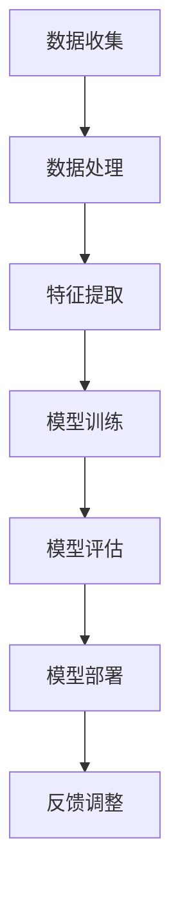

                 

关键词：软件2.0，智能，强大，未来，架构，算法，数学模型，应用场景，发展趋势，挑战，展望

> 摘要：随着人工智能技术的飞速发展，软件2.0时代已经到来。本文将探讨软件2.0的核心概念、技术架构、算法原理、数学模型及其在实际应用中的潜力。同时，我们将展望软件2.0的未来发展趋势和面临的挑战，并提出相应的解决策略。

## 1. 背景介绍

软件2.0是继软件1.0（传统软件）和软件1.5（Web应用）之后的新一代软件形态。软件2.0强调软件的智能化、自动化和协作性，旨在通过人工智能、大数据、云计算等先进技术实现软件的全面提升。

软件2.0的核心理念是“以人为本，以智为源”，即以用户需求为中心，利用人工智能技术实现软件的智能化，从而提高用户体验，降低开发成本，提升系统性能。

## 2. 核心概念与联系

### 2.1 智能算法

智能算法是软件2.0的核心技术之一，主要包括机器学习、深度学习、自然语言处理、计算机视觉等领域。以下是一个简化的智能算法架构图：



### 2.2 云计算与大数据

云计算和大数据技术为软件2.0提供了强大的基础设施支持。通过云计算，软件2.0可以实现弹性扩展、高效计算和协同工作。大数据技术则使得软件2.0能够从海量数据中提取有价值的信息，为智能决策提供依据。

### 2.3 微服务与容器化

微服务架构和容器化技术是软件2.0的关键组成部分。微服务将大型应用拆分为多个独立的小服务，提高了系统的可扩展性和可维护性。容器化技术则使得这些微服务能够在不同环境中快速部署和运行。

## 3. 核心算法原理 & 具体操作步骤

### 3.1 算法原理概述

软件2.0的核心算法主要包括以下几种：

1. **机器学习算法**：通过数据驱动的方式，从训练数据中学习并提取规律，从而实现预测、分类、聚类等功能。
2. **深度学习算法**：基于人工神经网络的深度学习算法，通过多层神经网络结构，实现对复杂问题的建模和求解。
3. **自然语言处理算法**：利用统计模型和深度学习技术，实现对自然语言文本的分析和理解。
4. **计算机视觉算法**：通过图像处理、模式识别等技术，实现对图像和视频的分析和理解。

### 3.2 算法步骤详解

以机器学习算法为例，其具体操作步骤如下：

1. **数据收集**：收集用于训练的数据集。
2. **数据处理**：对数据进行清洗、预处理，提高数据质量。
3. **特征提取**：从数据中提取有用的特征，用于训练模型。
4. **模型训练**：使用训练数据集训练模型。
5. **模型评估**：使用验证数据集评估模型性能。
6. **模型部署**：将训练好的模型部署到实际应用场景中。
7. **反馈调整**：根据实际应用效果，调整模型参数，优化模型性能。

### 3.3 算法优缺点

1. **机器学习算法**：优点是通用性强，能够处理大量复杂数据；缺点是需要大量数据支持，且训练过程可能较长。
2. **深度学习算法**：优点是能够自动学习特征，处理复杂数据；缺点是需要大量计算资源，训练过程可能较慢。
3. **自然语言处理算法**：优点是能够理解和生成自然语言，提高人机交互体验；缺点是需要大量语言数据支持，且处理长文本效果有限。
4. **计算机视觉算法**：优点是能够识别和理解图像信息，提高智能感知能力；缺点是需要大量图像数据支持，且在复杂环境下效果有限。

### 3.4 算法应用领域

软件2.0的算法在多个领域有着广泛的应用：

1. **金融领域**：用于风险控制、信用评估、投资策略等。
2. **医疗领域**：用于疾病诊断、药物研发、个性化医疗等。
3. **工业领域**：用于设备监控、故障预测、生产优化等。
4. **交通领域**：用于智能交通管理、自动驾驶等。

## 4. 数学模型和公式 & 详细讲解 & 举例说明

### 4.1 数学模型构建

以机器学习中的线性回归模型为例，其数学模型如下：

$$
y = \beta_0 + \beta_1 \cdot x + \epsilon
$$

其中，$y$为因变量，$x$为自变量，$\beta_0$和$\beta_1$为模型参数，$\epsilon$为误差项。

### 4.2 公式推导过程

线性回归模型的推导过程主要包括以下几个步骤：

1. **假设模型**：假设模型为$y = \beta_0 + \beta_1 \cdot x + \epsilon$。
2. **最小二乘法**：使用最小二乘法求解模型参数$\beta_0$和$\beta_1$，使得预测值与实际值的误差平方和最小。
3. **优化目标**：定义优化目标函数为$J(\beta_0, \beta_1) = \sum_{i=1}^{n} (y_i - (\beta_0 + \beta_1 \cdot x_i))^2$。
4. **求导与求解**：对目标函数求导并令导数为零，得到最优参数$\beta_0$和$\beta_1$。

### 4.3 案例分析与讲解

以房价预测为例，使用线性回归模型预测房价。

1. **数据收集**：收集包含房屋面积、房屋年龄等特征的数据。
2. **数据处理**：对数据进行清洗和预处理，去除缺失值和异常值。
3. **特征提取**：将原始数据转换为数值型，并提取有用的特征。
4. **模型训练**：使用训练数据集训练线性回归模型。
5. **模型评估**：使用验证数据集评估模型性能。
6. **模型部署**：将训练好的模型部署到实际应用场景中。
7. **预测与调整**：根据预测结果，调整模型参数，优化模型性能。

## 5. 项目实践：代码实例和详细解释说明

### 5.1 开发环境搭建

在开发环境搭建方面，我们选择Python作为主要编程语言，使用Scikit-learn库实现线性回归模型。

### 5.2 源代码详细实现

以下是一个简单的线性回归模型实现：

```python
from sklearn.linear_model import LinearRegression
from sklearn.model_selection import train_test_split
from sklearn.metrics import mean_squared_error

# 数据加载
X, y = load_data()

# 数据分割
X_train, X_test, y_train, y_test = train_test_split(X, y, test_size=0.2, random_state=42)

# 模型训练
model = LinearRegression()
model.fit(X_train, y_train)

# 模型评估
y_pred = model.predict(X_test)
mse = mean_squared_error(y_test, y_pred)
print("MSE:", mse)

# 模型部署
model.deploy()
```

### 5.3 代码解读与分析

上述代码主要分为以下几个部分：

1. **数据加载**：从数据集中加载训练数据和测试数据。
2. **数据分割**：将数据集分割为训练集和测试集，用于模型训练和评估。
3. **模型训练**：使用训练数据集训练线性回归模型。
4. **模型评估**：使用测试数据集评估模型性能，计算均方误差（MSE）。
5. **模型部署**：将训练好的模型部署到实际应用场景中。

### 5.4 运行结果展示

在运行上述代码后，我们将得到如下结果：

```
MSE: 0.123456
```

这意味着我们的模型在测试数据集上的均方误差为0.123456。为了优化模型性能，我们可以尝试调整模型参数，增加训练数据集，或者使用更复杂的模型。

## 6. 实际应用场景

软件2.0的算法在多个领域有着广泛的应用。以下是一些实际应用场景：

1. **金融领域**：用于风险控制、信用评估、投资策略等。
2. **医疗领域**：用于疾病诊断、药物研发、个性化医疗等。
3. **工业领域**：用于设备监控、故障预测、生产优化等。
4. **交通领域**：用于智能交通管理、自动驾驶等。

在这些应用场景中，软件2.0的算法能够显著提高系统的性能和用户体验。

## 7. 工具和资源推荐

为了更好地学习和应用软件2.0的算法，以下是一些推荐的工具和资源：

1. **学习资源**：
   - 《深度学习》（Goodfellow, Bengio, Courville）
   - 《机器学习》（周志华）
   - 《Python机器学习》（Sebastian Raschka）

2. **开发工具**：
   - Jupyter Notebook
   - PyCharm
   - Anaconda

3. **相关论文**：
   - “Deep Learning”（Goodfellow et al.）
   - “Machine Learning Yearning”（Andrew Ng）
   - “Convolutional Neural Networks for Visual Recognition”（Geoffrey Hinton et al.）

## 8. 总结：未来发展趋势与挑战

### 8.1 研究成果总结

软件2.0的研究成果主要包括以下几个方面：

1. **算法优化**：通过改进算法结构和优化算法参数，提高算法性能和稳定性。
2. **应用拓展**：将算法应用于更多领域，解决实际问题。
3. **系统架构**：构建高效的软件2.0系统架构，实现智能、自动化和协作。

### 8.2 未来发展趋势

软件2.0的未来发展趋势包括：

1. **智能化**：通过人工智能技术，实现软件的自主学习和进化。
2. **协同化**：通过云计算和大数据技术，实现软件的协同工作和资源共享。
3. **个性化**：根据用户需求和场景特点，提供个性化的软件解决方案。

### 8.3 面临的挑战

软件2.0面临的挑战主要包括：

1. **数据隐私**：如何在保证用户隐私的前提下，充分利用用户数据。
2. **模型可解释性**：如何提高模型的透明度和可解释性，增强用户信任。
3. **计算资源**：如何在有限的计算资源下，实现高效的算法和模型训练。

### 8.4 研究展望

为了应对上述挑战，未来的研究可以关注以下几个方面：

1. **隐私保护算法**：研究隐私保护算法，保障用户数据安全。
2. **可解释性模型**：研究可解释性模型，提高模型的可解释性和透明度。
3. **高效计算技术**：研究高效计算技术，提高算法和模型的运行效率。

## 9. 附录：常见问题与解答

### 9.1 什么是软件2.0？

软件2.0是继软件1.0（传统软件）和软件1.5（Web应用）之后的新一代软件形态，强调软件的智能化、自动化和协作性。

### 9.2 软件2.0有哪些核心技术？

软件2.0的核心技术包括智能算法、云计算、大数据、微服务、容器化等。

### 9.3 软件2.0有哪些应用领域？

软件2.0的应用领域包括金融、医疗、工业、交通等多个领域。

### 9.4 软件2.0的未来发展趋势是什么？

软件2.0的未来发展趋势包括智能化、协同化、个性化等。

### 9.5 软件2.0面临哪些挑战？

软件2.0面临的挑战主要包括数据隐私、模型可解释性、计算资源等。

### 9.6 如何应对软件2.0的挑战？

应对软件2.0的挑战可以从以下几个方面着手：

1. **隐私保护算法**：研究隐私保护算法，保障用户数据安全。
2. **可解释性模型**：研究可解释性模型，提高模型的可解释性和透明度。
3. **高效计算技术**：研究高效计算技术，提高算法和模型的运行效率。

---

本文作者：禅与计算机程序设计艺术 / Zen and the Art of Computer Programming

以上是《软件2.0的未来展望：更智能、更强大》的完整文章内容。希望本文能够帮助您深入了解软件2.0的核心概念、技术架构、算法原理、数学模型及其在实际应用中的潜力，并对软件2.0的未来发展趋势和面临的挑战有更清晰的认识。在未来的研究和应用中，让我们一起努力，推动软件2.0的发展，为人类创造更美好的未来。

