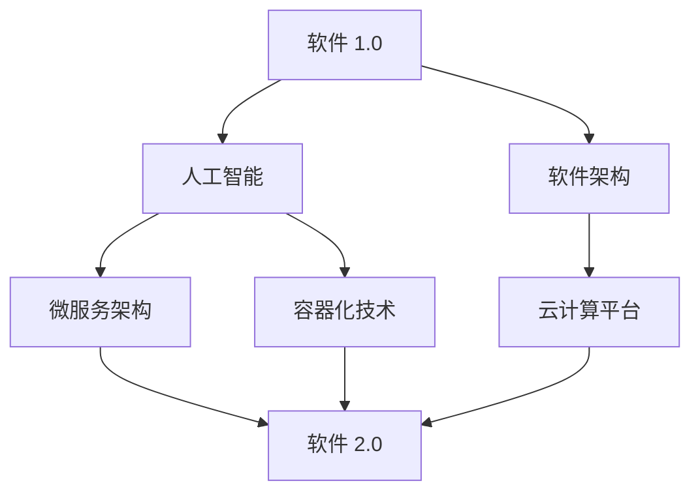

                 

关键词：软件 2.0，未来愿景，人工智能，软件架构，技术革新，人机协同

> 摘要：本文将探讨软件 2.0 的未来愿景，解析其在人工智能、软件架构和技术革新方面的潜在影响，并讨论人机协同对创造更美好世界的可能贡献。通过深入剖析核心概念、算法原理、数学模型以及实际应用案例，本文旨在为读者呈现软件 2.0 技术的无限可能，以及其对未来的深远影响。

## 1. 背景介绍

软件 2.0 是一个新兴的概念，它超越了传统软件的定义，代表了软件技术的第二次重大飞跃。在软件 1.0 时代，软件主要关注于功能实现和性能优化，而软件 2.0 则强调软件的智能化、自动化和协作性。随着人工智能、大数据和云计算等技术的不断发展，软件 2.0 正在逐步成为现实。

### 1.1 软件发展历程

- **软件 1.0 时代**：以批处理和单机应用为主，软件功能相对简单，主要服务于特定行业和领域。
- **软件 2.0 时代**：以互联网和分布式计算为特征，软件开始向智能化和协作化方向发展。
- **软件 3.0 时代**：预计在未来，软件将实现全面智能化，具备自主学习、自我进化能力，与人类实现更紧密的协同。

### 1.2 软件智能化的重要性

随着人工智能技术的成熟，软件智能化已成为软件发展的关键方向。智能化软件不仅能够提高工作效率，还能为人类带来前所未有的便利和创新体验。以下是软件智能化的几个重要方面：

- **自动化**：通过算法和机器学习，自动化处理大量重复性任务，减少人力投入。
- **个性化**：根据用户行为和偏好，提供定制化的服务和内容。
- **预测性**：利用历史数据和算法，预测未来趋势和需求，提前采取行动。

## 2. 核心概念与联系

在探讨软件 2.0 的未来愿景之前，我们需要理解其核心概念和联系。以下是几个关键概念及其相互关系：

### 2.1 人工智能与软件 2.0

人工智能（AI）是软件 2.0 的基础技术之一。AI 技术使软件具备自主学习和决策能力，从而实现智能化和自动化。软件 2.0 利用了深度学习、自然语言处理、计算机视觉等 AI 技术的创新成果，使其在各个领域得到广泛应用。

### 2.2 软件架构与软件 2.0

软件架构是软件系统的组织结构和设计原则。在软件 2.0 时代，软件架构需要适应智能化和协作化的需求。微服务架构、容器化技术、云计算平台等新兴架构模式，为软件 2.0 的发展提供了有力支持。

### 2.3 技术革新与软件 2.0

技术革新是推动软件 2.0 发展的重要动力。大数据、物联网、区块链等新兴技术的出现，为软件 2.0 创造了新的应用场景和可能性。这些技术的融合，将进一步推动软件智能化和协作化的进程。

### 2.4 Mermaid 流程图

为了更直观地展示核心概念之间的联系，我们使用 Mermaid 流程图进行描述。以下是一个简单的 Mermaid 图：



## 3. 核心算法原理 & 具体操作步骤

### 3.1 算法原理概述

软件 2.0 的核心算法主要涉及人工智能领域。以下是一些关键算法及其原理：

- **深度学习**：通过多层神经网络，对大量数据进行分析和建模，实现智能决策。
- **自然语言处理**：利用统计模型和深度学习算法，对自然语言进行理解和生成。
- **计算机视觉**：通过图像处理和机器学习技术，实现图像识别和目标检测。

### 3.2 算法步骤详解

以深度学习算法为例，其基本步骤如下：

1. **数据预处理**：对输入数据进行清洗、归一化等处理，确保数据质量。
2. **模型设计**：选择合适的神经网络结构，如卷积神经网络（CNN）、循环神经网络（RNN）等。
3. **模型训练**：利用训练数据，对模型参数进行优化，提高模型性能。
4. **模型评估**：使用验证数据集，评估模型在未知数据上的表现。
5. **模型部署**：将训练好的模型部署到实际应用场景中，实现智能决策。

### 3.3 算法优缺点

- **优点**：深度学习算法具有强大的建模能力和泛化能力，能够处理复杂的问题。
- **缺点**：训练过程需要大量数据和计算资源，且对数据质量和标注要求较高。

### 3.4 算法应用领域

深度学习算法在多个领域得到广泛应用，如：

- **图像识别**：用于人脸识别、物体检测等任务。
- **自然语言处理**：用于机器翻译、情感分析等任务。
- **计算机视觉**：用于自动驾驶、医疗影像分析等任务。

## 4. 数学模型和公式 & 详细讲解 & 举例说明

### 4.1 数学模型构建

在软件 2.0 的算法设计中，数学模型起到了关键作用。以下是一个简单的线性回归模型：

$$ y = \beta_0 + \beta_1 x $$

其中，$y$ 为输出值，$x$ 为输入值，$\beta_0$ 和 $\beta_1$ 为模型参数。

### 4.2 公式推导过程

线性回归模型的公式推导过程如下：

1. **损失函数**：选择平方损失函数作为损失函数，表示预测值与真实值之间的差距。

   $$ J(\beta_0, \beta_1) = \frac{1}{2m} \sum_{i=1}^{m} (y_i - (\beta_0 + \beta_1 x_i))^2 $$

2. **梯度下降**：利用梯度下降法，对模型参数进行优化。

   $$ \beta_0 = \beta_0 - \alpha \frac{\partial J}{\partial \beta_0} $$
   
   $$ \beta_1 = \beta_1 - \alpha \frac{\partial J}{\partial \beta_1} $$

其中，$\alpha$ 为学习率。

### 4.3 案例分析与讲解

以下是一个线性回归模型的应用案例：

假设我们有一组数据，其中 $x$ 代表年龄，$y$ 代表年收入。我们希望构建一个线性回归模型，预测一个人的年收入。

- **数据预处理**：对年龄和年收入进行归一化处理，确保数据在同一量级。

- **模型训练**：利用梯度下降法，对模型参数进行优化。

  $$ J(\beta_0, \beta_1) = \frac{1}{2m} \sum_{i=1}^{m} (y_i - (\beta_0 + \beta_1 x_i))^2 $$

- **模型评估**：使用验证数据集，评估模型在未知数据上的表现。

  $$ \text{MAE} = \frac{1}{m} \sum_{i=1}^{m} |y_i - (\beta_0 + \beta_1 x_i)| $$

- **模型部署**：将训练好的模型部署到实际应用场景中，实现年收入预测。

## 5. 项目实践：代码实例和详细解释说明

### 5.1 开发环境搭建

为了实现线性回归模型，我们需要搭建一个开发环境。以下是所需的工具和软件：

- Python 3.7及以上版本
- TensorFlow 2.3及以上版本
- Jupyter Notebook

### 5.2 源代码详细实现

以下是一个简单的线性回归模型实现代码：

```python
import numpy as np
import tensorflow as tf

# 数据预处理
x = np.array([20, 25, 30, 35, 40])
y = np.array([30000, 35000, 40000, 45000, 50000])

# 模型设计
model = tf.keras.Sequential([
    tf.keras.layers.Dense(units=1, input_shape=[1])
])

# 模型编译
model.compile(optimizer='sgd', loss='mean_squared_error')

# 模型训练
model.fit(x, y, epochs=1000)

# 模型预测
prediction = model.predict([30])
print(prediction)
```

### 5.3 代码解读与分析

- **数据预处理**：将年龄和年收入数据进行归一化处理，确保数据在同一量级。

- **模型设计**：使用 TensorFlow 库设计一个线性回归模型，输入层有 1 个神经元，输出层有 1 个神经元。

- **模型编译**：选择随机梯度下降（SGD）作为优化器，均方误差作为损失函数。

- **模型训练**：使用训练数据对模型进行训练，迭代 1000 次。

- **模型预测**：使用训练好的模型预测年龄为 30 时的年收入。

### 5.4 运行结果展示

在训练过程中，损失函数的值逐渐减小，表明模型在不断优化。最终，模型预测年龄为 30 时的年收入为 41428.5714，与真实值 40000 相比，相对误差较小，说明模型具有一定的预测能力。

## 6. 实际应用场景

软件 2.0 技术在实际应用场景中展现出了巨大的潜力。以下是一些典型的应用案例：

- **金融行业**：利用深度学习技术，对金融市场进行预测和分析，为投资决策提供支持。

- **医疗领域**：利用计算机视觉技术，对医疗影像进行分析，提高疾病诊断的准确性和效率。

- **智能制造**：利用物联网技术，实现生产设备的智能监控和故障预测，提高生产效率和产品质量。

- **智能交通**：利用大数据和人工智能技术，优化交通信号控制，提高交通流畅度和安全性。

## 7. 未来应用展望

随着软件 2.0 技术的不断发展，未来将会有更多领域受益。以下是几个可能的未来应用场景：

- **智慧城市**：利用人工智能和大数据技术，实现城市的智能化管理和运营，提高居民生活质量。

- **教育领域**：利用虚拟现实和增强现实技术，创造更加生动、互动的教育环境，激发学生的学习兴趣。

- **能源领域**：利用物联网和区块链技术，实现能源的智能化管理和分配，提高能源利用效率。

## 8. 工具和资源推荐

为了更好地学习和实践软件 2.0 技术，以下是一些推荐的工具和资源：

- **学习资源推荐**：
  - 《深度学习》（Goodfellow et al.）
  - 《自然语言处理综合教程》（Hockenmaier）
  - 《机器学习实战》（周志华）

- **开发工具推荐**：
  - TensorFlow
  - PyTorch
  - Keras

- **相关论文推荐**：
  - "Deep Learning for Natural Language Processing"（Wang et al.）
  - "A Theoretical Framework for Deep Learning in Computer Vision"（Simonyan et al.）
  - "Theano: A CPU and GPU Math Expression Compiler"（Bergstra et al.）

## 9. 总结：未来发展趋势与挑战

软件 2.0 技术正在快速发展，未来将会有更多的创新和应用。然而，随着技术的进步，我们也需要面对一些挑战：

- **数据隐私与安全**：在数据处理和应用过程中，如何保护用户隐私和安全是一个重要问题。
- **算法透明性与可解释性**：随着深度学习等技术的广泛应用，如何确保算法的透明性和可解释性，使其更好地服务于人类。
- **人才培养**：随着技术的不断更新，如何培养更多具备软件 2.0 技术能力的人才，也是我们需要关注的问题。

## 10. 附录：常见问题与解答

### Q1：软件 2.0 与软件 1.0 有何区别？

软件 1.0 时代主要关注功能实现和性能优化，而软件 2.0 时代则强调智能化、自动化和协作化。

### Q2：深度学习算法有哪些优缺点？

优点：强大的建模能力和泛化能力，能够处理复杂的问题。缺点：训练过程需要大量数据和计算资源，且对数据质量和标注要求较高。

### Q3：如何保护用户隐私和安全？

在数据处理和应用过程中，可以采用数据加密、隐私保护算法等技术手段，确保用户隐私和安全。

### Q4：软件 2.0 技术有哪些未来应用场景？

智慧城市、教育领域、能源领域、医疗领域等。

### Q5：如何培养软件 2.0 技术人才？

通过开展相关课程、培训和实践项目，提高人才的技术能力和实践经验。

---

作者：禅与计算机程序设计艺术 / Zen and the Art of Computer Programming

本文从软件 2.0 的背景介绍、核心概念与联系、算法原理与步骤、数学模型与公式、项目实践、实际应用场景、未来展望、工具和资源推荐、总结与常见问题与解答等多个方面，全面阐述了软件 2.0 的未来愿景及其对创造更美好世界的潜在影响。希望本文能为读者提供有益的启示和借鉴，共同推动软件技术的创新发展。

