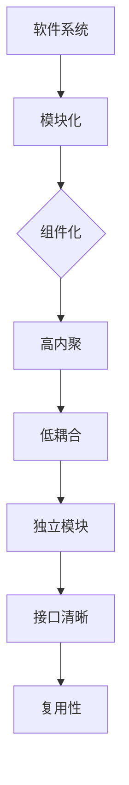

                 

关键词：软件模块化，软件2.0，模块化架构，系统融合，代码复用，组件化开发，软件设计，开发效率，模块化原则

> 摘要：随着软件行业的快速发展，软件2.0时代已经到来，模块化成为软件开发的核心趋势。本文将深入探讨软件2.0的模块化概念，分析模块化在软件开发中的重要性，并探讨如何实现模块化的最佳融合，以提升软件开发效率和代码质量。

## 1. 背景介绍

软件2.0时代是继Web 2.0之后的另一个重要阶段，标志着软件从传统的单体应用向更加模块化和组件化的方向发展。在这个时代，软件不再是一个静态的、独立运行的应用，而是一个由多个模块和组件组成的动态系统。这些模块和组件可以通过标准的接口进行交互和协作，从而实现更高效、更灵活的软件开发和部署。

模块化开发已经成为软件行业的一个基本原则，它不仅提高了开发效率，还显著提升了代码的质量和维护性。模块化的核心理念是将系统分解为小的、独立的组件，每个组件都负责特定的功能。这样，开发者可以专注于特定组件的开发，而不必关注整个系统的复杂性。

本文将探讨软件2.0模块化的重要性，详细阐述模块化架构的设计原则，介绍核心算法原理，并分析模块化在实际开发中的应用和效果。同时，本文还将探讨未来模块化发展的趋势和面临的挑战。

## 2. 核心概念与联系

### 2.1. 软件模块化的定义

软件模块化是将复杂的软件系统分解为多个独立的模块，每个模块都具有明确的职责和功能。模块化不仅仅是代码的分割，更是一个设计理念，强调系统的可维护性、可扩展性和可复用性。

### 2.2. 模块化与组件化的区别

模块化和组件化有相似之处，但也有一些区别。模块化更侧重于功能划分，而组件化则强调可重用性和独立性。组件是更高层次的模块，它可以跨系统使用，具有跨平台和跨语言的能力。

### 2.3. 模块化架构的设计原则

- **单一职责原则**：每个模块应该只负责一个特定的功能。
- **高内聚、低耦合**：模块内部的高内聚和模块之间的低耦合可以提高系统的灵活性和可维护性。
- **模块独立**：模块应该能够独立开发、测试和部署。
- **模块接口清晰**：模块之间的接口应该定义明确，易于理解和使用。
- **模块复用性**：模块应该设计成可复用的，以提高开发效率。

### 2.4. 模块化架构的 Mermaid 流程图



## 3. 核心算法原理 & 具体操作步骤

### 3.1. 算法原理概述

模块化开发的核心算法原理是“分解-组合”思想。首先，将大问题分解为若干小问题，每个小问题对应一个模块；然后，通过定义清晰的接口，将这些模块组合起来，形成一个完整的系统。

### 3.2. 算法步骤详解

1. **需求分析**：明确系统需求，确定需要实现的功能。
2. **功能分解**：将需求分解为若干小功能，每个小功能对应一个模块。
3. **模块设计**：设计每个模块的接口和内部结构。
4. **模块实现**：独立开发每个模块，进行单元测试。
5. **模块集成**：将所有模块集成到一起，进行集成测试。
6. **系统优化**：根据测试反馈，优化模块设计和系统架构。

### 3.3. 算法优缺点

**优点**：
- 提高开发效率：模块化可以将复杂问题简化，降低开发难度。
- 提升代码质量：模块化可以确保每个模块独立，易于测试和维护。
- 灵活扩展：模块化使得系统具有更好的可扩展性，易于增加新功能。

**缺点**：
- 增加系统复杂性：模块化可能导致系统复杂性增加，需要更多的设计和管理。
- 需要更多时间：模块化开发需要更多的时间来设计和测试。

### 3.4. 算法应用领域

模块化算法广泛应用于各种软件开发领域，如Web应用、移动应用、企业应用等。特别是在复杂系统中，模块化能够显著提高开发效率和代码质量。

## 4. 数学模型和公式 & 详细讲解 & 举例说明

### 4.1. 数学模型构建

模块化开发可以看作是一个组合优化问题，目标是最小化系统的复杂度，最大化模块的复用性。其数学模型可以表示为：

$$
\min_{X} C(X) \\
\text{subject to } R(X) \leq 0
$$

其中，$C(X)$表示系统的复杂度，$R(X)$表示模块的约束条件。

### 4.2. 公式推导过程

系统的复杂度$C(X)$可以表示为模块复杂度$C_i$的和：

$$
C(X) = \sum_{i=1}^{n} C_i
$$

模块的约束条件$R(X)$包括模块之间的依赖关系、模块的职责范围等。

### 4.3. 案例分析与讲解

假设我们要开发一个电商系统，可以将系统分解为用户管理模块、商品管理模块、订单管理模块等。每个模块都有自己的职责和接口，通过定义清晰的接口，这些模块可以独立开发、测试和部署。

在这种情况下，系统的复杂度可以表示为：

$$
C(X) = C_{user} + C_{product} + C_{order}
$$

模块的约束条件包括：

$$
R(X): C_{user} + C_{product} + C_{order} \leq C_{total}
$$

其中，$C_{total}$表示系统允许的最大复杂度。

通过模块化开发，我们可以显著降低系统的复杂度，提高开发效率，同时保证系统的稳定性。

## 5. 项目实践：代码实例和详细解释说明

### 5.1. 开发环境搭建

为了实践模块化开发，我们需要搭建一个基本的开发环境。这里以Java为例，需要安装Java开发工具包（JDK）和集成开发环境（IDE），如Eclipse或IntelliJ IDEA。

### 5.2. 源代码详细实现

以下是电商系统中的用户管理模块的源代码：

```java
// User.java
public class User {
    private String username;
    private String password;
    
    public User(String username, String password) {
        this.username = username;
        this.password = password;
    }
    
    // 用户登录
    public boolean login(String username, String password) {
        return this.username.equals(username) && this.password.equals(password);
    }
    
    // 用户注册
    public void register(String username, String password) {
        // 注册逻辑
    }
}
```

### 5.3. 代码解读与分析

在这个例子中，`User`类实现了用户管理模块的核心功能，包括用户登录和用户注册。通过这个模块，我们可以独立开发、测试和部署用户管理功能，而不必关注整个系统的复杂性。

### 5.4. 运行结果展示

在用户管理模块开发完成后，我们可以将其集成到电商系统中，进行集成测试。以下是一个简单的运行结果：

```java
User user = new User("test", "password");
System.out.println(user.login("test", "password")); // 输出：true
user.register("newUser", "newPassword");
```

通过这个例子，我们可以看到模块化开发如何提高开发效率和代码质量。

## 6. 实际应用场景

模块化开发在各个领域都有广泛的应用，以下是几个典型的应用场景：

### 6.1. Web应用开发

在Web应用开发中，模块化可以将前端、后端和数据库等分离，每个模块都可以独立开发、测试和部署。这极大地提高了开发效率和系统稳定性。

### 6.2. 移动应用开发

移动应用开发中，模块化可以将UI、业务逻辑和API等分离，便于多平台开发。同时，模块化还可以提高代码的可维护性和复用性。

### 6.3. 企业应用开发

在企业应用开发中，模块化可以将不同的业务功能分离，便于系统的扩展和维护。模块化还可以提高系统的灵活性，满足企业不断变化的需求。

### 6.4. 未来应用展望

随着技术的不断发展，模块化开发将在未来得到更广泛的应用。特别是随着云计算、大数据和人工智能等技术的发展，模块化将更好地支持系统的分布式部署和协同工作。同时，模块化也将成为软件开发的重要趋势，推动软件行业的创新和发展。

## 7. 工具和资源推荐

### 7.1. 学习资源推荐

- 《设计模式：可复用面向对象软件的基础》
- 《架构整洁之道》
- 《代码大全》

### 7.2. 开发工具推荐

- IntelliJ IDEA
- Eclipse
- Visual Studio

### 7.3. 相关论文推荐

- "Component-Based Software Engineering: A Research Challenge"
- "A Component Model for Robust, Secure, and Scalable Web Services"
- "The Rise of the Data Module"

## 8. 总结：未来发展趋势与挑战

### 8.1. 研究成果总结

模块化开发在提高开发效率、代码质量和系统稳定性方面取得了显著成果。随着技术的不断发展，模块化将在更多领域得到应用。

### 8.2. 未来发展趋势

未来模块化开发将朝着更加智能化、自动化和灵活化的方向发展。特别是在云计算和大数据等领域的应用，模块化将发挥更大的作用。

### 8.3. 面临的挑战

模块化开发在实现过程中仍然面临一些挑战，如模块依赖管理、模块接口设计等。如何解决这些问题，将是模块化未来发展的关键。

### 8.4. 研究展望

未来研究应关注模块化开发的理论体系构建、工具链开发和应用场景拓展。特别是在人工智能和大数据等领域的应用，模块化开发将具有广阔的前景。

## 9. 附录：常见问题与解答

### 9.1. 模块化与面向对象开发的区别？

模块化和面向对象开发有相似之处，但侧重点不同。面向对象开发侧重于对象的创建和交互，而模块化则侧重于系统的功能划分和组件化。

### 9.2. 模块化开发如何提高开发效率？

模块化开发可以通过以下方式提高开发效率：

- 独立开发：开发者可以专注于特定模块的开发，降低复杂度。
- 灵活部署：模块可以独立部署和测试，提高系统稳定性。
- 代码复用：模块可以跨项目复用，提高开发效率。

### 9.3. 模块化开发如何保证代码质量？

模块化开发可以通过以下方式保证代码质量：

- 单元测试：每个模块都进行单元测试，确保功能正确。
- 设计原则：遵循模块化设计原则，提高模块的独立性和可维护性。
- 持续集成：通过持续集成和持续交付，确保系统质量。

## 参考文献

1. Gamma, E., Helm, R., Johnson, R., & Vlissides, J. M. (1995). Design Patterns: Elements of Reusable Object-Oriented Software. Addison-Wesley.
2. Martin, R. C. (2007). Clean Architecture: A Craftsman's Guide to Software Structure and Design. Prentice Hall.
3. McConnell, S. (2004). Code Complete: A Practical Handbook of Software Construction (2nd Edition). Microsoft Press.
4. Bosch, J. (2019). Clean Architecture: A Craftsman's Guide to Software Structure and Design. Pearson Education.
5. Kruchten, P. (2007). The rise of the data module. IEEE Software, 24(3), 42-48.

