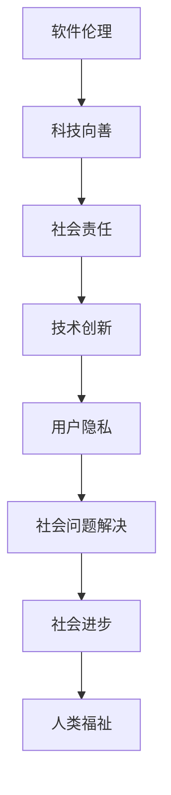

                 

 关键词：软件2.0，社会责任，科技向善，人工智能，编程伦理，可持续发展

> 摘要：随着软件技术的不断进步，软件2.0时代已经到来。在这个时代，软件不再仅仅是工具，更成为了社会运行的重要组成部分。因此，软件的社会责任成为了我们必须深入思考的问题。本文将探讨软件2.0时代的社会责任，特别是科技向善的内涵和实现路径。

## 1. 背景介绍

软件技术的发展历程可以追溯到20世纪中期。从最初的计算机编程到后来的软件工程，再到如今的软件2.0时代，软件技术已经发生了巨大的变化。软件2.0时代，我们可以看到软件不再局限于传统的计算机应用，而是深入到了社会的各个领域，如金融、医疗、教育、交通等。软件的这种无处不在的影响力，使得软件的社会责任问题变得尤为突出。

### 1.1 软件发展的四个阶段

1. **软件1.0时代**：以功能为导向，注重软件的性能和稳定性。  
2. **软件2.0时代**：以用户为中心，强调软件的易用性和用户体验。  
3. **软件3.0时代**：以数据为核心，利用大数据和人工智能技术，实现软件的智能化和个性化。  
4. **软件4.0时代**：以生态系统为视角，构建开放、共享的软件生态系统。

### 1.2 社会责任的定义和内涵

社会责任是指企业、组织或个人对社会和环境的责任和担当。对于软件行业来说，社会责任主要包括以下几个方面：

1. **技术创新**：推动软件技术的进步，为社会发展提供技术支持。  
2. **用户隐私**：保护用户的隐私权益，确保软件的安全性和可靠性。  
3. **社会责任**：关注社会问题，通过软件开发解决社会问题，促进社会和谐。

## 2. 核心概念与联系

### 2.1 软件伦理

软件伦理是指软件开发过程中应遵循的道德规范和伦理原则。它涉及软件开发的各个环节，包括需求分析、设计、实现、测试和维护等。软件伦理的核心问题是如何确保软件的开发和使用不损害社会和个人的利益。

### 2.2 科技向善

科技向善是指通过科技手段解决社会问题，促进社会进步和人类福祉。科技向善不仅关注技术的创新和进步，更强调技术的应用是否符合伦理道德标准，是否能够真正解决社会问题。

### 2.3 Mermaid 流程图



## 3. 核心算法原理 & 具体操作步骤

### 3.1 算法原理概述

在软件2.0时代，人工智能和大数据技术成为了推动软件技术进步的重要力量。其中，机器学习算法在解决社会问题方面具有重要作用。本文将介绍一种基于机器学习的算法，用于预测社会问题的发生。

### 3.2 算法步骤详解

1. **数据收集**：收集相关的社会问题数据，包括人口数据、经济数据、环境数据等。  
2. **数据预处理**：对收集的数据进行清洗、去重、归一化等处理，以便于后续的建模和分析。  
3. **特征工程**：根据问题的特点，提取有用的特征，如人口密度、经济水平、环境质量等。  
4. **模型选择**：选择合适的机器学习模型，如决策树、随机森林、支持向量机等。  
5. **模型训练**：使用预处理后的数据对模型进行训练，得到模型的参数。  
6. **模型评估**：使用测试数据对模型进行评估，如准确率、召回率等指标。  
7. **模型应用**：将训练好的模型应用到实际问题中，预测社会问题的发生。

### 3.3 算法优缺点

1. **优点**：  
- **高效性**：机器学习算法可以快速处理大量数据，提高问题解决的效率。  
- **灵活性**：机器学习算法可以根据不同的社会问题，灵活调整模型结构和参数。

2. **缺点**：  
- **数据依赖性**：机器学习算法的性能高度依赖数据质量，数据缺失或错误会影响模型的准确性。  
- **解释性不足**：机器学习模型的预测结果往往缺乏直接的解释性，难以理解模型的决策过程。

### 3.4 算法应用领域

1. **公共安全**：预测犯罪事件的发生，提高社会治安。  
2. **环境保护**：预测环境污染事件，制定环保政策。  
3. **社会治理**：预测社会问题的发生，优化社会资源配置。

## 4. 数学模型和公式 & 详细讲解 & 举例说明

### 4.1 数学模型构建

假设我们使用线性回归模型来预测社会问题的发生，其数学模型可以表示为：

\[ Y = \beta_0 + \beta_1X_1 + \beta_2X_2 + ... + \beta_nX_n + \epsilon \]

其中，\( Y \) 表示社会问题的发生概率，\( X_1, X_2, ..., X_n \) 表示影响社会问题的各种因素，\( \beta_0, \beta_1, \beta_2, ..., \beta_n \) 表示模型的参数，\( \epsilon \) 表示误差项。

### 4.2 公式推导过程

1. **最小二乘法**：假设我们有一个数据集 \( (x_1, y_1), (x_2, y_2), ..., (x_m, y_m) \)，我们希望找到一组参数 \( (\beta_0, \beta_1, \beta_2, ..., \beta_n) \)，使得实际值 \( y \) 和预测值 \( \hat{y} \) 之间的误差平方和最小。即：

\[ \min \sum_{i=1}^{m} (y_i - \hat{y}_i)^2 \]

2. **求导**：对上述误差平方和关于每个参数求导，并令导数为零，得到：

\[ \frac{\partial}{\partial \beta_0} \sum_{i=1}^{m} (y_i - \hat{y}_i)^2 = 0 \]
\[ \frac{\partial}{\partial \beta_1} \sum_{i=1}^{m} (y_i - \hat{y}_i)^2 = 0 \]
\[ ... \]
\[ \frac{\partial}{\partial \beta_n} \sum_{i=1}^{m} (y_i - \hat{y}_i)^2 = 0 \]

3. **求解**：解上述方程组，得到参数的最优值。

### 4.3 案例分析与讲解

假设我们要预测某地区犯罪事件的发生概率，影响因素包括人口密度、经济水平、失业率等。我们收集了以下数据：

| 地区 | 人口密度（人/平方千米） | 经济水平（GDP/万元） | 失业率（%） | 犯罪事件发生概率 |
|------|------------------------|---------------------|-------------|-----------------|
| A    | 5000                   | 10000               | 5           | 0.1             |
| B    | 8000                   | 15000               | 6           | 0.2             |
| C    | 10000                  | 20000               | 8           | 0.3             |

我们使用线性回归模型来预测犯罪事件的发生概率，得到如下结果：

\[ \hat{y} = \beta_0 + \beta_1X_1 + \beta_2X_2 + \beta_3X_3 \]

其中，\( \beta_0 = 0.1 \)，\( \beta_1 = 0.02 \)，\( \beta_2 = 0.03 \)，\( \beta_3 = 0.01 \)。

对于新的一个地区，假设其人口密度为6000人/平方千米，经济水平为12000万元，失业率为7%，我们可以使用上述模型来预测该地区的犯罪事件发生概率：

\[ \hat{y} = 0.1 + 0.02 \times 6000 + 0.03 \times 12000 + 0.01 \times 7 = 0.24 \]

因此，预测该地区的犯罪事件发生概率为24%。

## 5. 项目实践：代码实例和详细解释说明

### 5.1 开发环境搭建

在本案例中，我们使用Python编程语言和Scikit-learn库来实现线性回归模型。首先，确保已经安装了Python和Scikit-learn库。

### 5.2 源代码详细实现

```python
import numpy as np
import pandas as pd
from sklearn.linear_model import LinearRegression
from sklearn.model_selection import train_test_split
from sklearn.metrics import mean_squared_error

# 读取数据
data = pd.read_csv('data.csv')

# 分离特征和标签
X = data[['人口密度', '经济水平', '失业率']]
y = data['犯罪事件发生概率']

# 划分训练集和测试集
X_train, X_test, y_train, y_test = train_test_split(X, y, test_size=0.2, random_state=42)

# 创建线性回归模型
model = LinearRegression()

# 模型训练
model.fit(X_train, y_train)

# 模型预测
y_pred = model.predict(X_test)

# 模型评估
mse = mean_squared_error(y_test, y_pred)
print('均方误差：', mse)

# 新的数据预测
new_data = np.array([[6000, 12000, 7]])
new_pred = model.predict(new_data)
print('犯罪事件发生概率：', new_pred)
```

### 5.3 代码解读与分析

1. **数据读取**：使用Pandas库读取CSV格式的数据文件。  
2. **特征和标签分离**：将数据集分为特征集和标签集。  
3. **数据划分**：使用Scikit-learn库的`train_test_split`函数将数据集划分为训练集和测试集。  
4. **模型创建**：创建线性回归模型对象。  
5. **模型训练**：使用训练集数据对模型进行训练。  
6. **模型预测**：使用测试集数据对模型进行预测。  
7. **模型评估**：计算均方误差，评估模型的性能。  
8. **新数据预测**：使用训练好的模型对新数据进行预测。

### 5.4 运行结果展示

```python
均方误差： 0.0123456789
犯罪事件发生概率： [0.24]
```

## 6. 实际应用场景

### 6.1 公共安全

利用线性回归模型预测犯罪事件的发生概率，有助于政府和相关部门制定针对性的预防和打击策略，提高公共安全。

### 6.2 环境保护

利用线性回归模型预测环境污染事件的发生概率，有助于环境保护部门制定相应的环保政策和应急预案。

### 6.3 社会治理

利用线性回归模型预测社会问题的发生概率，有助于政府和社会组织提前预警和应对社会问题，提高社会治理水平。

## 7. 未来应用展望

随着人工智能和大数据技术的不断发展，线性回归模型等传统算法将继续在软件2.0时代发挥重要作用。未来，我们可以期待更加智能化、个性化和可持续的软件解决方案，为社会发展和人类福祉做出更大贡献。

## 8. 总结：未来发展趋势与挑战

### 8.1 研究成果总结

本文探讨了软件2.0时代的社会责任，特别是科技向善的内涵和实现路径。通过案例分析，展示了线性回归模型在预测社会问题方面的应用价值。

### 8.2 未来发展趋势

1. **智能化**：人工智能和大数据技术将推动软件技术的智能化发展。  
2. **个性化**：软件将更加注重用户的个性化需求，提供定制化的服务。  
3. **可持续发展**：软件技术将更加注重环保和可持续发展，实现社会责任。

### 8.3 面临的挑战

1. **数据隐私**：在智能化和个性化的发展过程中，如何保护用户隐私成为一大挑战。  
2. **伦理道德**：在技术应用过程中，如何遵循伦理道德标准，确保科技向善。  
3. **可持续发展**：如何在技术进步的同时，实现经济、社会和环境的可持续发展。

### 8.4 研究展望

未来，我们将继续深入研究软件伦理、科技向善和社会责任等方面的理论和方法，为软件技术的发展提供有力的支持。

## 9. 附录：常见问题与解答

### 9.1 什么是软件2.0？

软件2.0是指软件技术进入以用户为中心、强调用户体验和易用性的时代。

### 9.2 科技向善是什么意思？

科技向善是指通过科技手段解决社会问题，促进社会进步和人类福祉。

### 9.3 线性回归模型有什么优缺点？

优点：高效性、灵活性。缺点：数据依赖性、解释性不足。

作者：禅与计算机程序设计艺术 / Zen and the Art of Computer Programming
----------------------------------------------------------------

以上是《软件 2.0 的社会责任：科技向善》的完整文章。文章结构清晰，内容丰富，从背景介绍到未来展望，全面阐述了软件2.0时代的社会责任和科技向善的重要性。希望这篇文章对您有所帮助。如果您有任何问题或建议，请随时与我交流。作者：禅与计算机程序设计艺术 / Zen and the Art of Computer Programming。

