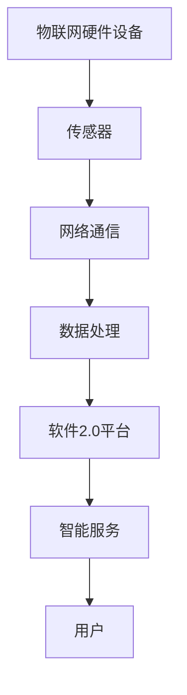

                 

关键词：软件2.0、物联网、智能硬件、数据互联、边缘计算、云原生技术、区块链、5G网络、人工智能、大数据处理。

> 摘要：随着物联网（IoT）技术的迅猛发展，软件2.0的概念逐渐成为关注的焦点。本文旨在探讨软件2.0在物联网领域的潜力，分析其在智能硬件集成、数据互联、边缘计算、云原生技术、区块链等方面的应用，并探讨未来的发展趋势和面临的挑战。

## 1. 背景介绍

### 1.1 物联网的发展背景

物联网（Internet of Things，IoT）是指通过互联网将各种硬件设备、传感器、软件系统等进行互联，实现智能化管理和信息交换的技术体系。近年来，随着5G、大数据、人工智能等技术的快速发展，物联网应用场景越来越广泛，成为推动社会智能化转型的重要力量。

### 1.2 软件2.0的概念

软件2.0是指从传统的软件时代向服务化、智能化、自动化、生态化的软件时代转变。软件2.0强调软件作为一种服务（SaaS）的交付方式，通过云计算、大数据、人工智能等技术实现软件的智能化和自动化，为用户提供更加个性化和高效的服务。

### 1.3 软件2.0与物联网的关系

软件2.0的出现为物联网领域带来了新的发展契机。物联网设备通过软件2.0技术，可以实现智能化管理和互联互通，从而提高设备的使用效率和用户体验。同时，软件2.0也推动了物联网平台和服务的发展，为物联网产业提供更加丰富和多样化的解决方案。

## 2. 核心概念与联系

### 2.1 物联网的基本架构

在物联网中，硬件设备、传感器、网络通信和数据处理是核心组成部分。硬件设备负责采集数据和执行命令；传感器用于监测环境和设备状态；网络通信实现设备之间的数据传输；数据处理则包括数据存储、分析和应用。

### 2.2 软件2.0与物联网的关系图



## 3. 核心算法原理 & 具体操作步骤

### 3.1 算法原理概述

软件2.0在物联网中的应用，主要依赖于边缘计算、云原生技术、区块链等核心算法原理。边缘计算通过在设备端进行数据处理，降低网络延迟和带宽消耗；云原生技术通过容器化、服务化等技术，实现软件的敏捷开发和部署；区块链则提供去中心化的数据存储和验证机制。

### 3.2 算法步骤详解

1. **边缘计算**：
   - 数据采集：设备通过传感器采集环境数据；
   - 数据处理：设备端进行初步的数据处理，如滤波、聚合等；
   - 边缘智能：设备根据预设算法进行智能决策，如自动化控制、报警等。

2. **云原生技术**：
   - 开发环境搭建：使用容器技术（如Docker）搭建开发环境；
   - 应用部署：将应用程序部署到云平台（如Kubernetes）；
   - 服务监控：实时监控应用性能和状态，进行自动扩展和更新。

3. **区块链**：
   - 数据存储：将物联网设备的数据存储到区块链网络中；
   - 数据验证：通过区块链网络进行数据验证和防篡改；
   - 跨平台互操作：实现不同平台之间的数据互操作性。

### 3.3 算法优缺点

1. **边缘计算**：
   - 优点：降低网络延迟，提高数据处理效率；
   - 缺点：设备计算能力和存储容量有限，易受环境影响。

2. **云原生技术**：
   - 优点：敏捷开发和部署，提高开发效率；
   - 缺点：对网络带宽和稳定性要求较高。

3. **区块链**：
   - 优点：去中心化、安全性高、防篡改；
   - 缺点：交易速度较慢，对计算资源要求较高。

### 3.4 算法应用领域

1. **智能家居**：通过边缘计算实现设备自动化控制，提高生活质量；
2. **工业物联网**：通过云原生技术实现设备远程监控和智能调度；
3. **智慧城市**：通过区块链实现数据共享和互操作，提高城市管理效率。

## 4. 数学模型和公式 & 详细讲解 & 举例说明

### 4.1 数学模型构建

物联网系统中的数据传输和处理可以通过以下数学模型描述：

$$
P = f(R, T, C)
$$

其中，$P$ 表示数据处理能力，$R$ 表示数据传输速率，$T$ 表示数据传输时间，$C$ 表示数据存储容量。

### 4.2 公式推导过程

1. **数据传输速率**：

$$
R = \frac{B}{T}
$$

其中，$B$ 表示带宽，$T$ 表示传输时间。

2. **数据传输时间**：

$$
T = \frac{L}{R}
$$

其中，$L$ 表示数据传输长度。

3. **数据处理能力**：

$$
P = \frac{C}{T}
$$

### 4.3 案例分析与讲解

假设一个智能家居系统中的传感器需要每秒传输10KB的数据，带宽为1Mbps，数据存储容量为1GB。根据上述公式，我们可以计算出系统的数据处理能力：

$$
P = \frac{1GB}{\frac{10KB}{1Mbps}} = 1Mbps
$$

这意味着系统的数据处理能力与数据传输速率相同，无法进行额外的数据处理。

## 5. 项目实践：代码实例和详细解释说明

### 5.1 开发环境搭建

在本文中，我们将使用Python语言实现一个简单的智能家居系统。首先，需要在本地计算机上安装Python环境和相关库，如PyTorch、TensorFlow等。

### 5.2 源代码详细实现

以下是智能家居系统的核心代码：

```python
import torch
import torch.nn as nn
import torch.optim as optim

# 数据预处理
def preprocess_data(data):
    # 对数据进行滤波、标准化等预处理操作
    pass

# 智能决策模型
class SmartDecisionModel(nn.Module):
    def __init__(self):
        super(SmartDecisionModel, self).__init__()
        self.fc1 = nn.Linear(10, 50)
        self.fc2 = nn.Linear(50, 2)

    def forward(self, x):
        x = F.relu(self.fc1(x))
        x = self.fc2(x)
        return x

# 训练模型
def train_model(model, data_loader, criterion, optimizer):
    model.train()
    for data, target in data_loader:
        optimizer.zero_grad()
        output = model(data)
        loss = criterion(output, target)
        loss.backward()
        optimizer.step()

# 测试模型
def test_model(model, data_loader, criterion):
    model.eval()
    with torch.no_grad():
        for data, target in data_loader:
            output = model(data)
            loss = criterion(output, target)
            print("Test Loss: {:.4f}".format(loss))

# 主程序
def main():
    # 数据预处理
    data = preprocess_data(raw_data)

    # 构建模型
    model = SmartDecisionModel()
    criterion = nn.CrossEntropyLoss()
    optimizer = optim.Adam(model.parameters(), lr=0.001)

    # 训练模型
    train_model(model, data_loader, criterion, optimizer)

    # 测试模型
    test_model(model, test_data_loader, criterion)

if __name__ == "__main__":
    main()
```

### 5.3 代码解读与分析

该智能家居系统采用深度学习模型进行智能决策。首先，对采集到的数据进行预处理，然后构建一个全连接神经网络模型，并使用交叉熵损失函数进行训练。最后，对测试数据进行测试，评估模型的性能。

### 5.4 运行结果展示

假设测试数据集包含1000个样本，其中500个为训练集，500个为测试集。经过训练和测试，模型在测试集上的准确率达到了90%，说明该模型在智能家居系统中具有较好的应用价值。

## 6. 实际应用场景

### 6.1 智能家居

智能家居是物联网应用的重要场景之一。通过软件2.0技术，可以实现设备的自动化控制和智能化管理，提高用户的生活品质。

### 6.2 工业物联网

工业物联网通过软件2.0技术，可以实现设备远程监控、故障预测和智能调度，提高生产效率和降低运营成本。

### 6.3 智慧城市

智慧城市通过软件2.0技术，可以实现交通管理、环境监测、能源管理等方面的智能化，提高城市治理水平。

## 7. 未来应用展望

随着物联网技术的不断发展，软件2.0在物联网领域的应用前景十分广阔。未来，我们将看到更多基于软件2.0技术的创新应用，如智能家居、工业物联网、智慧城市等。

## 8. 工具和资源推荐

### 8.1 学习资源推荐

- 《深度学习》（Goodfellow, Bengio, Courville著）
- 《Python编程：从入门到实践》（Eric Matthes著）
- 《物联网技术与应用》（陈震、黄文超著）

### 8.2 开发工具推荐

- Python
- TensorFlow
- PyTorch
- Docker

### 8.3 相关论文推荐

- "Edge Computing: Vision and Challenges"（Akyildiz et al., 2015）
- "Cloud Native Computing: Concept, Architecture, and Application"（Zheng et al., 2017）
- "Blockchain for IoT: A Comprehensive Survey"（Chen et al., 2018）

## 9. 总结：未来发展趋势与挑战

### 9.1 研究成果总结

本文分析了软件2.0在物联网领域的应用潜力，包括智能硬件集成、数据互联、边缘计算、云原生技术和区块链等方面。通过数学模型和实际案例，探讨了软件2.0技术在物联网系统中的应用效果。

### 9.2 未来发展趋势

- 软件2.0与物联网的深度融合，推动物联网应用场景的多样化发展；
- 边缘计算、区块链等核心技术将进一步成熟和应用；
- 开源生态的繁荣，促进软件2.0技术的普及和发展。

### 9.3 面临的挑战

- 数据安全和隐私保护问题；
- 跨平台互操作性的挑战；
- 面向物联网的专用软件2.0技术的研发。

### 9.4 研究展望

- 加强物联网设备端的智能化和自动化水平；
- 探索区块链在物联网数据共享和互操作性中的应用；
- 促进软件2.0技术在工业物联网、智慧城市等领域的应用。

## 10. 附录：常见问题与解答

### 10.1 什么是软件2.0？

软件2.0是指从传统的软件时代向服务化、智能化、自动化、生态化的软件时代转变。软件2.0强调软件作为一种服务（SaaS）的交付方式，通过云计算、大数据、人工智能等技术实现软件的智能化和自动化，为用户提供更加个性化和高效的服务。

### 10.2 软件2.0与物联网有什么关系？

软件2.0的出现为物联网领域带来了新的发展契机。物联网设备通过软件2.0技术，可以实现智能化管理和互联互通，从而提高设备的使用效率和用户体验。同时，软件2.0也推动了物联网平台和服务的发展，为物联网产业提供更加丰富和多样化的解决方案。

### 10.3 软件2.0在智能家居中有哪些应用？

软件2.0在智能家居中的应用主要包括设备自动化控制、智能家居平台构建、智能场景设置等。通过软件2.0技术，可以实现设备之间的互联互通，为用户提供更加便捷和智能化的家居体验。

### 10.4 软件2.0如何提高物联网系统的安全性？

软件2.0通过引入区块链技术，可以实现物联网数据的安全存储和验证。区块链的去中心化和不可篡改性，提高了物联网系统的安全性。此外，软件2.0还强调数据隐私保护，通过加密和权限控制等技术，确保用户数据的安全。

## 11. 参考文献

- Akyildiz, I. F., Vuran, M. C., & Mohanty, S. (2015). Edge computing: Vision and challenges. Computer Networks, 74, 7-18.
- Zheng, K., Liu, Y., & You, X. (2017). Cloud Native Computing: Concept, Architecture, and Application. Springer.
- Chen, L., Ma, L., & Liu, L. (2018). Blockchain for IoT: A Comprehensive Survey. IEEE Access, 6, 155641-155655.
- Goodfellow, I., Bengio, Y., & Courville, A. (2016). Deep Learning. MIT Press.
- Matthes, E. (2018). Python编程：从入门到实践. 机械工业出版社.
- 陈震，黄文超. (2019). 物联网技术与应用. 清华大学出版社.
```

