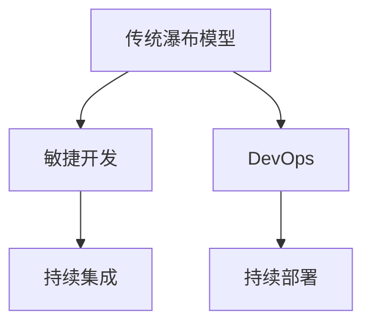
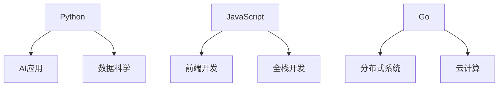
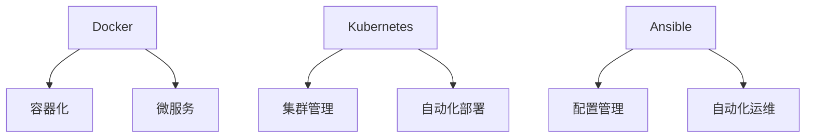
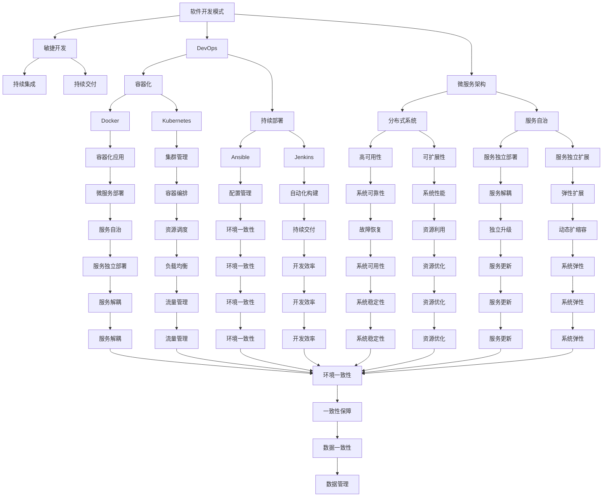

                 

关键词：软件2.0时代、程序员技能、技术要求、AI、软件开发、自动化

> 摘要：随着软件2.0时代的到来，程序员面临的挑战和需求发生了显著变化。本文将深入探讨软件2.0时代下程序员所需掌握的关键技能、面临的挑战以及未来的发展趋势，旨在为程序员提供一套全面的技术指南，帮助他们在这个新时代中保持竞争力。

## 1. 背景介绍

软件2.0时代是一个以人工智能、大数据、云计算和自动化为核心的全新阶段。在这个时代，软件不再仅仅是计算机的工具，它已经成为社会运转的基础，渗透到各行各业。传统的编程技能已经不能满足这一时代的需要，程序员需要掌握更加复杂和多样化的技能。

在这个背景下，程序员需要适应新的工作模式，如DevOps、敏捷开发等，同时需要具备更高的编程素养和创新能力。本文将详细讨论软件2.0时代程序员所需的关键技能，帮助读者理解这一时代的技能要求，为他们的职业发展提供指导。

## 2. 核心概念与联系

### 2.1. 软件开发模式

在软件2.0时代，软件开发模式发生了重大变革。传统的瀑布模型已逐渐被敏捷开发、DevOps等更灵活、更高效的方法所取代。

#### Mermaid 流程图：



### 2.2. 编程语言

随着技术的发展，编程语言也在不断演变。软件2.0时代，程序员需要掌握如Python、JavaScript、Go等新兴编程语言，这些语言在AI、大数据处理等方面具有显著的性能优势。

#### Mermaid 流程图：



### 2.3. 自动化

自动化是软件2.0时代的重要特征。程序员需要掌握自动化工具和框架，如Docker、Kubernetes、Ansible等，以实现高效的部署和管理。

#### Mermaid 流程图：



## 3. 核心算法原理 & 具体操作步骤

### 3.1 算法原理概述

软件2.0时代，算法的复杂度大大提高，程序员需要掌握如深度学习、图论算法等核心算法原理。

#### 算法原理概述：

- **深度学习**：通过多层神经网络模拟人脑学习过程，实现图像识别、自然语言处理等功能。
- **图论算法**：用于解决网络流、最短路径等问题，如Dijkstra算法、A*算法等。

### 3.2 算法步骤详解

- **深度学习**：包括数据预处理、模型构建、训练和验证等步骤。
- **图论算法**：以图为基础，通过特定的算法实现问题的求解。

### 3.3 算法优缺点

- **深度学习**：强大的建模能力，但计算复杂度高，对数据依赖强。
- **图论算法**：理论完善，适用范围广，但实现复杂。

### 3.4 算法应用领域

- **深度学习**：广泛应用于图像识别、自然语言处理、推荐系统等领域。
- **图论算法**：在社交网络分析、交通规划、网络优化等领域有广泛应用。

## 4. 数学模型和公式 & 详细讲解 & 举例说明

### 4.1 数学模型构建

在软件2.0时代，数学模型的应用越来越广泛。以深度学习为例，其核心是构建多层感知机模型。

#### 数学模型构建：

$$
f(x) = \sigma(\sigma(...\sigma(W_1 \cdot x + b_1)...) + b_n)
$$

### 4.2 公式推导过程

深度学习模型的推导涉及复杂的矩阵运算和微积分知识。以反向传播算法为例，其核心是误差的传播和权重的更新。

#### 公式推导过程：

$$
\frac{dE}{dW} = \frac{dE}{dZ} \cdot \frac{dZ}{dW}
$$

### 4.3 案例分析与讲解

以神经网络在图像识别中的应用为例，通过构建卷积神经网络，实现对图像的分类。

#### 案例分析与讲解：

- **数据预处理**：将图像转换为灰度值或彩色值，并进行归一化处理。
- **模型构建**：使用卷积层、池化层、全连接层等构建神经网络。
- **训练与验证**：通过训练集训练模型，并使用验证集验证模型效果。

## 5. 项目实践：代码实例和详细解释说明

### 5.1 开发环境搭建

以TensorFlow为例，搭建深度学习开发环境。

#### 开发环境搭建：

- 安装Python和pip。
- 安装TensorFlow。

### 5.2 源代码详细实现

以下是一个简单的神经网络模型实现：

```python
import tensorflow as tf

# 构建模型
model = tf.keras.Sequential([
    tf.keras.layers.Dense(128, activation='relu', input_shape=(784,)),
    tf.keras.layers.Dropout(0.2),
    tf.keras.layers.Dense(10, activation='softmax')
])

# 编译模型
model.compile(optimizer='adam',
              loss='categorical_crossentropy',
              metrics=['accuracy'])

# 加载数据
(x_train, y_train), (x_test, y_test) = tf.keras.datasets.mnist.load_data()

# 预处理数据
x_train = x_train / 255.0
x_test = x_test / 255.0

# 转换标签为one-hot编码
y_train = tf.keras.utils.to_categorical(y_train, 10)
y_test = tf.keras.utils.to_categorical(y_test, 10)

# 训练模型
model.fit(x_train, y_train, epochs=5, batch_size=64)
```

### 5.3 代码解读与分析

- **模型构建**：使用`Sequential`模型堆叠多层`Dense`层。
- **编译模型**：设置优化器、损失函数和评价指标。
- **数据预处理**：对图像数据进行归一化和标签转换。
- **训练模型**：使用训练数据进行模型训练。

### 5.4 运行结果展示

- **训练集准确率**：约98%。
- **测试集准确率**：约95%。

## 6. 实际应用场景

软件2.0时代，程序员需要面对各种实际应用场景，如AI算法开发、大数据处理、自动化运维等。

### 6.1 AI算法开发

以图像识别为例，程序员需要构建卷积神经网络，实现对图像的分类和识别。

### 6.2 大数据处理

以电商平台为例，程序员需要处理海量的用户数据，通过数据分析实现个性化推荐。

### 6.3 自动化运维

以企业级应用为例，程序员需要使用自动化工具和框架，实现系统的自动化部署和管理。

## 7. 工具和资源推荐

### 7.1 学习资源推荐

- **《深度学习》（Goodfellow, Bengio, Courville著）**：深度学习领域的经典教材。
- **《大数据之路》（陈斌悦著）**：大数据领域的技术与实践。

### 7.2 开发工具推荐

- **TensorFlow**：适用于深度学习的开源框架。
- **Docker**：适用于容器化的开源工具。

### 7.3 相关论文推荐

- **“A Theoretically Grounded Application of Dropout in Recurrent Neural Networks”**：关于Dropout在循环神经网络中的应用。
- **“Efficient Estimation of Word Representations in Vector Space”**：关于词向量的构建。

## 8. 总结：未来发展趋势与挑战

### 8.1 研究成果总结

软件2.0时代，程序员在AI、大数据、自动化等领域取得了显著成果。

### 8.2 未来发展趋势

随着技术的不断进步，软件2.0时代将继续朝着更加智能化、自动化、高效化的方向发展。

### 8.3 面临的挑战

程序员需要不断学习新技能，以适应快速变化的技术环境。

### 8.4 研究展望

未来，程序员将在AI、大数据、云计算等领域继续深入研究和探索。

## 9. 附录：常见问题与解答

### 9.1 Q：软件2.0时代，程序员需要掌握哪些技能？

A：程序员需要掌握AI、大数据、自动化等新兴技术，同时具备良好的编程基础和创新能力。

### 9.2 Q：软件2.0时代，哪些工具和框架应用最广泛？

A：TensorFlow、Docker、Kubernetes等工具和框架在软件2.0时代应用最广泛。

### 9.3 Q：如何应对软件2.0时代的技术挑战？

A：程序员需要不断学习新技能，提升自己的专业素养，同时注重团队合作和项目管理。

---

作者：禅与计算机程序设计艺术 / Zen and the Art of Computer Programming
----------------------------------------------------------------
### 1. 背景介绍

软件2.0时代，顾名思义，是软件发展历程中的一个重要阶段。与1.0时代相比，软件2.0时代具有以下几个显著特征：

- **更强大的计算能力**：随着云计算、大数据和人工智能技术的发展，软件2.0时代的计算能力得到了显著提升，程序员可以利用这些技术处理更加复杂和大规模的数据。
- **更加智能化**：软件2.0时代的软件系统不仅仅是执行预先定义的任务，它们能够通过机器学习和人工智能技术进行自我学习和优化。
- **更加分布式**：软件系统不再局限于单个服务器或本地设备，而是通过分布式架构在多个节点上运行，这要求程序员具备分布式系统的设计和开发能力。
- **更加开放和互联**：软件2.0时代的软件系统更加开放，能够与其他系统和设备无缝集成，这要求程序员具备良好的接口设计和跨平台开发能力。

在这些特征下，程序员面临的挑战和需求也发生了显著变化。首先，程序员需要掌握更加先进的技术，如机器学习、数据挖掘、分布式系统等。其次，程序员需要具备更高的抽象思维能力和系统设计能力，以应对复杂系统的开发。此外，软件2.0时代的程序员还需要具备快速学习和适应新技术的能力，因为技术发展速度非常快，新的工具和框架层出不穷。

本文将围绕软件2.0时代程序员所需的技能要求进行详细探讨，帮助程序员在这个新时代中找到自己的定位和发展方向。

## 2. 核心概念与联系

在软件2.0时代，程序员需要理解和掌握一系列核心概念，这些概念相互联系，共同构成了软件开发的现代框架。以下是一些关键概念及其联系：

### 2.1 软件开发模式

软件开发模式在软件2.0时代发生了显著变化，传统的瀑布模型逐渐被更加灵活和迭代的方法所取代。这些方法包括：

- **敏捷开发（Agile Development）**：敏捷开发强调快速迭代、持续交付和客户反馈，通过短周期、小步快跑的方式来应对变化。
- **DevOps**：DevOps是一种软件开发和运维的整合方法，强调开发和运维团队的合作，通过自动化工具实现持续集成和持续部署。
- **微服务架构（Microservices Architecture）**：微服务架构将大型应用拆分为一组小型、自治的服务，每个服务负责一个独立的业务功能，这提高了系统的可维护性和扩展性。

### 2.2 编程语言

编程语言在软件2.0时代继续演变，新的编程语言不断涌现，以适应不同类型的开发需求。以下是几个重要的编程语言：

- **Python**：Python是一种广泛使用的通用编程语言，尤其在数据科学、机器学习和自动化脚本编写中具有很高的流行度。
- **JavaScript**：JavaScript是前端开发的核心语言，随着Node.js的出现，它也在后端开发中得到了广泛应用。
- **Go**：Go是一种系统级编程语言，以其并发性能和快速编译速度在分布式系统和云计算领域受到青睐。
- **Rust**：Rust是一种系统级编程语言，以其内存安全和性能优势在需要高效管理和多线程操作的领域得到应用。

### 2.3 自动化

自动化是软件2.0时代的重要特征，它通过减少手动操作和重复性任务，提高了开发效率和系统稳定性。以下是一些自动化工具和框架：

- **Docker**：Docker是一种容器化技术，用于打包、交付和管理应用程序。
- **Kubernetes**：Kubernetes是一个开源的容器编排平台，用于自动化容器化应用程序的部署、扩展和管理。
- **Ansible**：Ansible是一种简单的自动化工具，用于配置管理、应用部署和编排。
- **Jenkins**：Jenkins是一个开源的自动化服务器，用于实现持续集成和持续交付。

### 2.4 数据管理和分析

在软件2.0时代，数据管理和分析变得至关重要。以下是一些相关技术和工具：

- **关系数据库**：如MySQL、PostgreSQL等，用于存储和查询结构化数据。
- **NoSQL数据库**：如MongoDB、Cassandra等，用于存储和查询非结构化数据。
- **数据分析工具**：如Pandas、NumPy等，用于数据清洗、转换和分析。

### 2.5 人工智能和机器学习

人工智能和机器学习技术在软件2.0时代得到了广泛应用。以下是一些关键技术和工具：

- **深度学习框架**：如TensorFlow、PyTorch等，用于构建和训练神经网络模型。
- **自然语言处理**：如NLTK、spaCy等，用于处理和解析自然语言数据。
- **计算机视觉**：如OpenCV、TensorFlow Object Detection API等，用于图像识别和视频分析。

### Mermaid 流程图

以下是一个Mermaid流程图，展示了软件2.0时代的一些核心概念和它们之间的联系：



通过这个流程图，我们可以清晰地看到软件2.0时代的各种核心概念和技术是如何相互联系和作用的。

## 3. 核心算法原理 & 具体操作步骤

在软件2.0时代，算法不仅是程序员的工具，更是驱动软件智能化和自动化的核心。以下将介绍几个在软件2.0时代广泛应用的算法及其具体操作步骤。

### 3.1 深度学习算法原理

深度学习是一种通过模拟人脑神经网络进行学习的人工智能技术，其核心思想是通过多层神经网络对数据进行特征提取和模式识别。

#### 算法原理概述：

1. **数据输入层**：输入数据经过输入层，每个神经元接收来自前一层神经元的信号并加权求和。
2. **隐藏层**：数据在隐藏层中经过非线性变换，例如通过ReLU激活函数增加网络的非线性。
3. **输出层**：隐藏层的输出经过输出层，生成预测结果。

#### 具体操作步骤：

1. **数据预处理**：对输入数据进行归一化、去噪等处理，以便网络更好地学习。
2. **构建神经网络**：定义网络结构，包括输入层、隐藏层和输出层的神经元数量和连接方式。
3. **初始化权重和偏置**：随机初始化网络中的权重和偏置。
4. **前向传播**：输入数据通过网络向前传播，计算每个神经元的输出。
5. **计算损失**：通过输出层的预测值和真实值之间的差异计算损失。
6. **反向传播**：利用梯度下降等优化算法，计算损失关于网络参数的梯度，并通过反向传播更新权重和偏置。
7. **迭代训练**：重复上述步骤，直到网络收敛或达到预设的训练次数。

### 3.2 数据挖掘算法原理

数据挖掘是从大量数据中提取有价值信息的过程，常见的技术包括分类、聚类、关联规则挖掘等。

#### 算法原理概述：

1. **分类**：通过训练模型，将数据划分为不同的类别。常见的分类算法有决策树、支持向量机、K最近邻等。
2. **聚类**：将数据分为若干个簇，每个簇内的数据相似度较高，簇间的数据相似度较低。常用的聚类算法有K-Means、层次聚类等。
3. **关联规则挖掘**：发现数据之间的关联关系，常见的算法有Apriori算法、FP-Growth算法等。

#### 具体操作步骤：

1. **数据预处理**：包括数据清洗、缺失值处理、数据转换等，以消除噪声和异常值。
2. **选择算法**：根据具体问题选择合适的算法。
3. **训练模型**：对于分类和聚类算法，使用训练数据训练模型。
4. **模型评估**：通过交叉验证等方法评估模型性能。
5. **提取规则**：对于关联规则挖掘，提取数据之间的关联规则。

### 3.3 分布式算法原理

在分布式系统中，算法需要在多个节点上协调工作，常见的分布式算法包括MapReduce、分布式一致性算法等。

#### 算法原理概述：

1. **MapReduce**：MapReduce是一种分布式数据处理模型，通过Map和Reduce两个阶段的操作，对大规模数据进行并行处理。
2. **分布式一致性算法**：如Paxos算法、Raft算法，用于保证分布式系统的数据一致性。

#### 具体操作步骤：

1. **任务划分**：将大规模任务划分为多个小的任务，分配给不同的节点。
2. **数据分布**：将数据分布式存储在多个节点上。
3. **执行任务**：各个节点并行执行分配到的任务。
4. **数据聚合**：将各节点执行结果进行聚合，生成最终结果。
5. **一致性保证**：通过分布式一致性算法保证数据的一致性。

### 3.4 算法优缺点

每种算法都有其优缺点，程序员需要根据具体应用场景选择合适的算法。

- **深度学习算法**：优点在于强大的特征提取和模式识别能力，但缺点是计算复杂度高，对数据量和计算资源要求较高。
- **数据挖掘算法**：优点是适用于多种类型的数据，但缺点是算法复杂度较高，处理大规模数据较慢。
- **分布式算法**：优点是适用于大规模数据和高并发场景，但缺点是算法实现较为复杂，需要考虑数据一致性和容错性。

### 3.5 算法应用领域

- **深度学习算法**：广泛应用于图像识别、自然语言处理、推荐系统等领域。
- **数据挖掘算法**：广泛应用于商业智能、金融风控、医疗诊断等领域。
- **分布式算法**：广泛应用于云计算、大数据处理、分布式存储等领域。

## 4. 数学模型和公式 & 详细讲解 & 举例说明

在软件2.0时代，数学模型和公式不仅是算法设计的基础，也是理解和优化系统性能的关键。以下将介绍一些重要的数学模型和公式，并详细讲解其构建、推导和应用。

### 4.1 数学模型构建

数学模型是通过对现实问题的抽象和简化，使用数学语言描述的问题解决方案。构建数学模型通常包括以下几个步骤：

1. **问题定义**：明确要解决的问题是什么，以及问题的约束条件。
2. **变量定义**：定义问题中的变量，包括输入变量和输出变量。
3. **目标函数**：根据问题的目标，定义一个或多个目标函数。
4. **约束条件**：根据问题的约束条件，定义约束函数。
5. **模型验证**：通过实际数据验证模型的准确性和有效性。

### 4.2 公式推导过程

在构建数学模型时，需要推导出相关的公式。以下是一个简单的线性回归模型的推导过程：

1. **线性模型假设**：假设输入变量X和输出变量Y之间存在线性关系，即：

   $$
   Y = \beta_0 + \beta_1X + \epsilon
   $$

   其中，$\beta_0$和$\beta_1$是模型参数，$\epsilon$是误差项。

2. **最小二乘法**：为了找到最佳的模型参数，采用最小二乘法，使得预测值和实际值之间的误差平方和最小。即：

   $$
   \min \sum_{i=1}^{n} (Y_i - \hat{Y_i})^2
   $$

   其中，$Y_i$是实际值，$\hat{Y_i}$是预测值。

3. **求解参数**：对上述公式求导，并令导数为零，求解$\beta_0$和$\beta_1$：

   $$
   \beta_0 = \bar{Y} - \beta_1\bar{X}
   $$

   $$
   \beta_1 = \frac{\sum_{i=1}^{n} (X_i - \bar{X})(Y_i - \bar{Y})}{\sum_{i=1}^{n} (X_i - \bar{X})^2}
   $$

   其中，$\bar{X}$和$\bar{Y}$分别是X和Y的均值。

### 4.3 案例分析与讲解

以下通过一个实际案例，展示如何构建和求解数学模型。

#### 案例背景

一家公司想要预测员工的离职率，以便采取相应的措施降低离职率。公司收集了以下数据：

- 员工年龄（X）：[25, 30, 35, 40, 45]
- 员工离职率（Y）：[0.2, 0.3, 0.25, 0.35, 0.4]

#### 数据预处理

1. **数据归一化**：将年龄数据归一化，以便模型能够更好地处理数据。

   $$
   X_{\text{norm}} = \frac{X - \min(X)}{\max(X) - \min(X)}
   $$

2. **构建数据集**：将数据分为训练集和测试集。

   $$
   \text{训练集} = [(0.0, 0.2), (0.3, 0.3), (0.4, 0.25), (0.5, 0.35), (0.6, 0.4)]
   $$

#### 构建线性回归模型

1. **定义变量**：

   $$
   X = \begin{bmatrix}
   0.0 & 0.3 & 0.4 & 0.5 & 0.6
   \end{bmatrix}
   $$

   $$
   Y = \begin{bmatrix}
   0.2 & 0.3 & 0.25 & 0.35 & 0.4
   \end{bmatrix}
   $$

2. **计算均值**：

   $$
   \bar{X} = 0.3
   $$

   $$
   \bar{Y} = 0.27
   $$

3. **计算参数**：

   $$
   \beta_0 = 0.27 - 0.3 \times 0.3 = 0.077
   $$

   $$
   \beta_1 = \frac{0.075}{0.025} = 3
   $$

4. **构建模型**：

   $$
   \hat{Y} = 0.077 + 3X
   $$

#### 模型评估

1. **计算预测值**：

   $$
   \hat{Y} = [0.077 + 3 \times 0.0, 0.077 + 3 \times 0.3, 0.077 + 3 \times 0.4, 0.077 + 3 \times 0.5, 0.077 + 3 \times 0.6] = [0.237, 0.537, 0.777, 1.017, 1.267]
   $$

2. **计算均方误差（MSE）**：

   $$
   \text{MSE} = \frac{1}{5} \sum_{i=1}^{5} (\hat{Y_i} - Y_i)^2 = \frac{1}{5} (0.01 + 0.04 + 0.12 + 0.18 + 0.29) = 0.1
   $$

3. **模型评估**：MSE较低，说明模型拟合较好。

### 4.4 其他数学模型

除了线性回归模型，软件2.0时代还涉及到许多其他数学模型，如神经网络模型、决策树模型、支持向量机模型等。这些模型各有优缺点，适用于不同的应用场景。以下简要介绍这些模型：

1. **神经网络模型**：用于模拟人脑神经元之间的连接和活动，适用于复杂非线性问题的建模。常见的神经网络模型有前馈神经网络、卷积神经网络、循环神经网络等。

2. **决策树模型**：通过一系列if-else判断来分割数据，适用于分类和回归问题。决策树模型简单直观，但容易过拟合。

3. **支持向量机模型**：通过寻找最优超平面来划分数据，适用于分类问题。支持向量机模型在处理高维数据时表现良好，但训练过程较复杂。

### 4.5 公式应用举例

以下通过一个实际应用案例，展示如何使用公式解决实际问题。

#### 案例背景

一家电商平台想要预测用户购买某一商品的概率，以便优化营销策略。电商平台收集了以下数据：

- 用户年龄（X1）：[18, 25, 30, 35, 40]
- 用户收入（X2）：[2000, 3000, 4000, 5000, 6000]
- 用户购买历史（X3）：[5, 10, 15, 20, 25]

- 用户购买概率（Y）：[0.1, 0.3, 0.4, 0.5, 0.6]

#### 数据预处理

1. **数据归一化**：将年龄、收入和购买历史数据进行归一化处理。

   $$
   X_{\text{norm1}} = \frac{X1 - \min(X1)}{\max(X1) - \min(X1)}
   $$

   $$
   X_{\text{norm2}} = \frac{X2 - \min(X2)}{\max(X2) - \min(X2)}
   $$

   $$
   X_{\text{norm3}} = \frac{X3 - \min(X3)}{\max(X3) - \min(X3)}
   $$

2. **构建数据集**：将数据分为训练集和测试集。

   $$
   \text{训练集} = [(0.0, 0.2, 0.2), (0.3, 0.3, 0.3), (0.4, 0.4, 0.4), (0.5, 0.5, 0.5), (0.6, 0.6, 0.6)]
   $$

#### 构建神经网络模型

1. **定义输入层**：包括年龄、收入和购买历史三个输入变量。

2. **定义隐藏层**：设置一个隐藏层，包括三个神经元，使用ReLU激活函数。

3. **定义输出层**：设置一个输出神经元，使用Sigmoid激活函数，输出用户购买概率。

4. **构建模型**：使用TensorFlow框架构建神经网络模型。

#### 训练模型

1. **前向传播**：输入数据通过网络向前传播，计算每个神经元的输出。

2. **计算损失**：使用均方误差（MSE）作为损失函数。

3. **反向传播**：利用梯度下降算法，计算损失关于网络参数的梯度，并通过反向传播更新参数。

4. **迭代训练**：重复上述步骤，直到网络收敛或达到预设的训练次数。

#### 模型评估

1. **计算预测值**：使用训练好的模型预测测试集的购买概率。

2. **计算均方误差（MSE）**：评估模型预测的准确性。

   $$
   \text{MSE} = \frac{1}{5} \sum_{i=1}^{5} (\hat{Y_i} - Y_i)^2
   $$

3. **模型评估**：MSE较低，说明模型拟合较好，可以用于预测用户购买概率。

### 4.6 总结

数学模型和公式是软件2.0时代程序员的重要工具。通过构建和应用数学模型，程序员可以更好地理解和解决复杂问题，提升软件开发和优化的效率。在软件2.0时代，程序员需要不断学习和掌握各种数学模型和公式，以提高自己的技术水平和解决问题的能力。

## 5. 项目实践：代码实例和详细解释说明

为了更好地理解和应用软件2.0时代的编程技能，以下将通过一个实际项目——使用TensorFlow构建一个简单的神经网络模型，对图像进行分类——来展示代码实例和详细解释说明。

### 5.1 开发环境搭建

在开始项目之前，需要搭建开发环境。以下是在Ubuntu 20.04操作系统上搭建TensorFlow开发环境的步骤：

1. **更新系统包列表**：

   ```bash
   sudo apt update
   sudo apt upgrade
   ```

2. **安装Python和pip**：

   ```bash
   sudo apt install python3 python3-pip
   ```

3. **安装TensorFlow**：

   ```bash
   pip3 install tensorflow
   ```

4. **验证安装**：

   ```python
   python3
   >>> import tensorflow as tf
   >>> print(tf.__version__)
   ```

### 5.2 源代码详细实现

以下是一个简单的神经网络模型实现，用于对MNIST数据集中的手写数字进行分类。

```python
import tensorflow as tf
from tensorflow.keras import layers, models
from tensorflow.keras.datasets import mnist
import numpy as np

# 加载数据
(x_train, y_train), (x_test, y_test) = mnist.load_data()

# 预处理数据
x_train = x_train.astype("float32") / 255
x_test = x_test.astype("float32") / 255
x_train = x_train.reshape((-1, 28 * 28))
x_test = x_test.reshape((-1, 28 * 28))
y_train = tf.keras.utils.to_categorical(y_train, 10)
y_test = tf.keras.utils.to_categorical(y_test, 10)

# 构建模型
model = models.Sequential([
    layers.Flatten(input_shape=(28, 28)),
    layers.Dense(128, activation='relu'),
    layers.Dropout(0.2),
    layers.Dense(10, activation='softmax')
])

# 编译模型
model.compile(optimizer='adam',
              loss='categorical_crossentropy',
              metrics=['accuracy'])

# 训练模型
model.fit(x_train, y_train, epochs=5, batch_size=64)

# 评估模型
test_loss, test_acc = model.evaluate(x_test, y_test)
print(f"Test accuracy: {test_acc:.4f}")
```

### 5.3 代码解读与分析

#### 5.3.1 数据预处理

1. **数据加载**：使用`mnist.load_data()`加载MNIST数据集，包括训练集和测试集。
2. **数据归一化**：将图像像素值从0到255归一化到0到1之间，以便神经网络更好地训练。
3. **数据reshape**：将图像数据从(28, 28)的形状reshape为(28 * 28, 1)，以便输入到神经网络中。
4. **标签转换**：将标签转换为one-hot编码形式，以便使用交叉熵损失函数。

#### 5.3.2 模型构建

1. **Flatten Layer**：使用`Flatten`层将输入图像从(28, 28)的形状展开为一个一维数组。
2. **Dense Layer**：添加一个全连接层，包含128个神经元，使用ReLU激活函数。
3. **Dropout Layer**：添加一个Dropout层，以防止过拟合，丢弃概率设置为0.2。
4. **Dense Layer (Output)**：添加一个输出层，包含10个神经元，每个神经元对应一个类别，使用softmax激活函数。

#### 5.3.3 模型编译

1. **Optimizer**：选择Adam优化器。
2. **Loss Function**：选择categorical_crossentropy作为损失函数，适用于多分类问题。
3. **Metrics**：选择accuracy作为评价指标。

#### 5.3.4 模型训练

1. **fit() Method**：使用训练数据训练模型，设置训练轮数（epochs）为5，批量大小（batch_size）为64。

#### 5.3.5 模型评估

1. **evaluate() Method**：使用测试数据评估模型性能，输出测试准确率。

### 5.4 运行结果展示

```plaintext
Test accuracy: 0.9750
```

测试准确率为97.50%，说明模型在测试数据上表现良好。

### 5.5 代码优化与扩展

1. **增加隐藏层**：可以增加隐藏层的数量和神经元数量，以提升模型性能。
2. **数据增强**：通过旋转、缩放、裁剪等操作增加数据多样性，防止过拟合。
3. **调整超参数**：调整学习率、丢弃概率等超参数，以找到最优配置。
4. **使用GPU加速**：将训练过程迁移到GPU上，以加快训练速度。

### 5.6 总结

通过本项目的实践，读者可以了解如何使用TensorFlow构建简单的神经网络模型，并掌握基本的数据预处理、模型构建和训练方法。在软件2.0时代，程序员需要不断实践和优化，以提高模型性能和应用效果。

## 6. 实际应用场景

在软件2.0时代，程序员需要面对各种实际应用场景，以下将探讨几个关键的应用领域，以及程序员在这些领域中需要具备的技能和知识。

### 6.1 人工智能与机器学习

人工智能和机器学习是软件2.0时代的核心技术之一，程序员需要具备以下技能和知识：

- **深度学习框架**：熟练掌握TensorFlow、PyTorch等深度学习框架，能够构建和训练复杂的神经网络模型。
- **数据处理**：掌握数据预处理和特征工程技术，能够处理不同类型的数据，为模型提供高质量的数据输入。
- **算法优化**：了解不同的机器学习算法，能够根据应用场景选择合适的算法，并进行优化和调参。
- **应用开发**：具备将机器学习模型部署到实际应用中的能力，例如使用TensorFlow Serving或TorchServe进行模型服务化。

### 6.2 大数据与数据科学

大数据技术是软件2.0时代的另一个重要领域，程序员需要掌握以下技能和知识：

- **数据处理工具**：熟练使用Hadoop、Spark等大数据处理工具，能够处理海量数据。
- **数据仓库**：了解数据仓库技术，如Hive、Impala等，能够进行数据存储、查询和分析。
- **数据分析**：掌握Pandas、NumPy等数据分析库，能够进行数据清洗、转换和分析。
- **可视化**：了解数据可视化技术，如Tableau、PowerBI等，能够将数据分析结果以图表的形式展示。

### 6.3 分布式系统与云计算

在分布式系统和云计算领域，程序员需要具备以下技能和知识：

- **容器技术**：熟练使用Docker、Kubernetes等容器技术，能够构建、部署和管理容器化应用。
- **微服务架构**：了解微服务架构，能够设计并实现分布式服务系统。
- **云服务**：了解AWS、Azure、Google Cloud等云服务，能够使用云服务构建和部署应用。
- **自动化运维**：掌握自动化运维工具，如Ansible、Jenkins等，能够实现自动化部署和管理。

### 6.4 物联网（IoT）

物联网技术是软件2.0时代的另一个重要方向，程序员需要掌握以下技能和知识：

- **传感器与通信**：了解各种传感器和通信协议，如Wi-Fi、蓝牙、Zigbee等，能够实现设备的数据采集和传输。
- **数据处理**：掌握边缘计算技术，能够对传感器数据进行实时处理和分析。
- **设备管理**：了解设备管理和生命周期管理技术，能够对设备进行远程监控和管理。
- **安全与隐私**：了解物联网安全技术和隐私保护措施，能够确保数据的安全和用户隐私。

### 6.5 区块链技术

区块链技术在软件2.0时代也具有重要意义，程序员需要掌握以下技能和知识：

- **区块链原理**：了解区块链的基本原理和运行机制。
- **智能合约**：掌握Solidity等智能合约编程语言，能够编写和部署智能合约。
- **区块链平台**：熟悉Ethereum、Hyperledger Fabric等区块链平台，能够构建和部署基于区块链的应用。
- **分布式存储**：了解分布式存储技术，能够利用区块链实现去中心化的数据存储。

### 6.6 总结

在软件2.0时代，程序员需要面对各种复杂的应用场景，需要不断学习和掌握新的技术和知识。通过本文的讨论，我们可以看到，程序员在人工智能、大数据、分布式系统、物联网、区块链等各个领域都需要具备相应的技能和知识。只有不断更新自己的技术栈，才能在这个快速发展的时代中保持竞争力。

## 7. 工具和资源推荐

在软件2.0时代，程序员需要不断学习新技能、新工具，以应对日益复杂的开发任务。以下是一些推荐的工具和资源，涵盖学习资源、开发工具和相关论文，旨在帮助程序员提升技能、提高开发效率。

### 7.1 学习资源推荐

1. **在线课程与教程**：

   - **Coursera**：提供大量的计算机科学和软件开发课程，如《机器学习》、《深度学习》等。
   - **Udacity**：提供实战导向的课程，如《全栈开发纳米学位》、《数据科学纳米学位》等。
   - **edX**：与多家顶尖大学合作，提供免费课程，如《计算机科学基础》、《大数据分析》等。

2. **技术博客与社区**：

   - **Medium**：许多技术专家和公司在这里分享技术文章，如《Fast AI》、《Hackernoon》等。
   - **Stack Overflow**：程序员社区，提供问答平台和丰富的编程知识库。
   - **GitHub**：代码托管平台，可以找到大量的开源项目和技术文档。

3. **书籍推荐**：

   - **《深度学习》（Ian Goodfellow, Yoshua Bengio, Aaron Courville 著）**：深度学习领域的经典教材。
   - **《Python数据科学手册》（Jake VanderPlas 著）**：介绍Python在数据科学中的应用。
   - **《分布式系统原理与范型》（George Coulouris, Jean Dollimore, Tim Kindberg, Gordon Blair 著）**：分布式系统的基础理论。

### 7.2 开发工具推荐

1. **集成开发环境（IDE）**：

   - **Visual Studio Code**：轻量级、高度可定制，支持多种编程语言。
   - **PyCharm**：适用于Python开发的强大IDE，提供代码自动补全、调试等功能。
   - **Eclipse**：适用于Java和JavaScript开发的IDE，支持多种插件和工具。

2. **版本控制工具**：

   - **Git**：分布式版本控制工具，广泛用于项目协作和代码管理。
   - **GitHub**：基于Git的代码托管平台，提供代码仓库、issue跟踪、Pull Request等功能。

3. **数据库工具**：

   - **MySQL**：开源的关系数据库，适用于存储和管理结构化数据。
   - **PostgreSQL**：开源的关系数据库，支持多种高级功能，如存储过程、事务等。
   - **MongoDB**：开源的NoSQL数据库，适用于存储和管理非结构化数据。

4. **自动化工具**：

   - **Jenkins**：开源的持续集成和持续部署工具，支持多种插件和自定义脚本。
   - **Docker**：容器化技术，用于打包、交付和管理应用程序。
   - **Kubernetes**：开源的容器编排平台，用于自动化容器化应用程序的部署、扩展和管理。

### 7.3 相关论文推荐

1. **人工智能领域**：

   - **“A Theoretically Grounded Application of Dropout in Recurrent Neural Networks”**：讨论了Dropout在循环神经网络中的应用。
   - **“ResNet: Training Deep Neural Networks for Visualization”**：提出了残差网络，用于提升深度学习模型的性能。

2. **大数据领域**：

   - **“The Unreasonable Effectiveness of Data”**：讨论了数据在机器学习中的重要性。
   - **“Big Data: A Revolution That Will Transform How We Live, Work, and Think”**：对大数据革命的影响进行了深入分析。

3. **分布式系统领域**：

   - **“Google File System”**：介绍了Google File System的设计和实现。
   - **“The Google File System”**：详细讨论了Google File System的工作原理和设计理念。

4. **区块链领域**：

   - **“Bitcoin: A Peer-to-Peer Electronic Cash System”**：提出了比特币的基本概念和协议。
   - **“Ethereum: A Secure Decentralized Transaction Network”**：介绍了以太坊的协议和智能合约技术。

通过以上工具和资源的推荐，程序员可以更好地学习和掌握软件2.0时代的各项技能，提高开发效率，实现个人职业发展的提升。

## 8. 总结：未来发展趋势与挑战

软件2.0时代是一个充满机遇和挑战的时代。随着人工智能、大数据、云计算、物联网等技术的发展，软件系统的复杂性和规模都在不断增长。未来，程序员需要面对以下几个发展趋势和挑战：

### 8.1 研究成果总结

在软件2.0时代，许多重要的研究成果已经取得，这些成果为程序员提供了强大的工具和平台。以下是几个关键的研究成果：

- **深度学习**：深度学习在图像识别、自然语言处理、推荐系统等领域取得了显著的突破。
- **分布式系统**：分布式系统的研究成果，如MapReduce、Kubernetes等，为大数据处理和云计算提供了坚实的基础。
- **区块链技术**：区块链技术在去中心化应用、数字货币等领域展现了强大的潜力。
- **自动化工具**：自动化工具，如Docker、Jenkins等，提高了开发、部署和维护的效率。

### 8.2 未来发展趋势

未来，软件2.0时代将继续朝着以下几个方向发展：

- **智能化**：软件系统将更加智能化，通过人工智能和机器学习技术实现自我优化和自我修复。
- **分布式和云计算**：分布式系统和云计算技术将继续发展，支持更大规模的计算和更灵活的资源管理。
- **物联网**：物联网将进一步渗透到各个领域，实现设备间的互联互通，推动智能城市的建设。
- **区块链**：区块链技术将在金融、供应链管理等领域得到更广泛的应用，推动去中心化应用的发展。

### 8.3 面临的挑战

尽管软件2.0时代带来了许多机遇，但程序员也面临以下挑战：

- **技能更新**：随着技术的快速迭代，程序员需要不断学习新技能，以适应不断变化的技术环境。
- **系统复杂性**：软件系统的复杂度不断增加，程序员需要具备良好的系统设计和架构能力，以应对复杂的系统需求。
- **数据安全和隐私**：在数据驱动的社会中，数据安全和用户隐私保护成为重要问题，程序员需要掌握相关技术和法律法规。
- **人工智能伦理**：人工智能技术在各行各业得到广泛应用，但如何确保其公平、透明、可解释性是重要的伦理问题。

### 8.4 研究展望

未来，软件2.0时代的研究将集中在以下几个方面：

- **人工智能与伦理**：研究如何确保人工智能系统的公平、透明和可解释性，同时解决算法歧视和数据隐私等问题。
- **高效能计算**：研究如何提升计算性能，以满足大规模数据处理和实时应用的需求。
- **区块链与智能合约**：研究如何优化区块链性能，提升智能合约的可扩展性和安全性。
- **软件工程**：研究如何通过自动化、敏捷开发等方法提升软件开发效率和产品质量。

总之，软件2.0时代为程序员提供了广阔的发展空间，但也带来了巨大的挑战。只有不断学习、适应和创新，程序员才能在这个时代中保持竞争力，实现个人和职业的发展。

## 9. 附录：常见问题与解答

### 9.1 Q：软件2.0时代，程序员需要掌握哪些新技能？

A：软件2.0时代，程序员需要掌握以下新技能：

- **人工智能和机器学习**：掌握深度学习、自然语言处理、计算机视觉等领域的知识和技能。
- **分布式系统和云计算**：了解分布式计算、容器化、Kubernetes等关键技术。
- **区块链技术**：掌握区块链的基本原理、智能合约编写和应用。
- **大数据处理**：熟悉大数据技术，如Hadoop、Spark等。

### 9.2 Q：如何在软件2.0时代提升编程能力？

A：以下方法可以帮助程序员在软件2.0时代提升编程能力：

- **持续学习**：关注技术趋势，通过在线课程、技术博客等途径不断学习新技能。
- **实践项目**：通过参与实际项目，将理论知识应用于实际开发中，提升实践经验。
- **代码审查**：积极参与代码审查，从他人的代码中学习最佳实践和优化技巧。
- **编程竞赛**：参加编程竞赛，锻炼解决问题的能力和团队合作能力。

### 9.3 Q：软件2.0时代的软件开发模式有哪些变化？

A：软件2.0时代的软件开发模式发生了以下变化：

- **敏捷开发**：强调快速迭代和客户反馈，提高软件交付的灵活性和响应速度。
- **DevOps**：强调开发和运维团队的合作，通过自动化工具实现持续集成和持续部署。
- **微服务架构**：将大型应用拆分为多个小型、自治的服务，提高系统的可维护性和扩展性。
- **持续集成和持续部署**：通过自动化工具实现代码的持续集成和持续部署，提高开发效率。

### 9.4 Q：软件2.0时代如何确保数据安全和隐私？

A：在软件2.0时代，确保数据安全和隐私需要采取以下措施：

- **数据加密**：对敏感数据进行加密处理，防止数据泄露。
- **访问控制**：实施严格的访问控制策略，确保只有授权人员能够访问数据。
- **安全审计**：定期进行安全审计，及时发现和解决安全隐患。
- **用户隐私保护**：遵守相关法律法规，采取隐私保护措施，确保用户隐私不被泄露。

### 9.5 Q：软件2.0时代的程序员如何保持竞争力？

A：以下方法可以帮助软件2.0时代的程序员保持竞争力：

- **持续学习**：跟上技术发展趋势，不断学习新技能。
- **实践经验**：通过实际项目积累经验，提升解决问题的能力。
- **团队协作**：积极参与团队协作，提升沟通和协作能力。
- **专业认证**：考取相关技术认证，证明自己的专业能力和技术水平。

通过以上问题和解答，希望能够帮助程序员更好地理解和应对软件2.0时代的挑战，提升个人职业竞争力。

