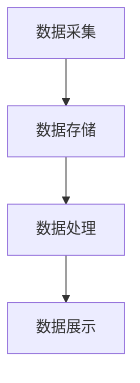

                 

关键词：软件2.0、实时数据处理、架构设计、大数据、人工智能、云计算

> 摘要：随着互联网和大数据技术的快速发展，实时数据处理成为了现代软件系统中的重要组成部分。本文将深入探讨软件2.0时代的实时数据处理架构，分析其核心概念、算法原理、数学模型以及实际应用场景，旨在为开发者提供一套完整的技术指南。

## 1. 背景介绍

随着互联网和移动设备的普及，数据量呈指数级增长。传统的离线数据处理方式已经无法满足实时性要求较高的应用场景，如在线交易、实时推荐系统、金融风控等。为了应对这一挑战，软件2.0时代的实时数据处理架构应运而生。它不仅能够处理海量数据，而且能够实时地分析、挖掘和响应数据，为用户带来更加智能化的体验。

### 1.1 软件2.0时代的特征

软件2.0时代相较于1.0时代，具有以下几个显著特征：

1. **大数据处理能力**：软件系统能够高效地处理海量数据，实现实时分析。
2. **智能化**：通过人工智能技术，软件系统能够自我学习和优化，提高处理效率。
3. **分布式架构**：系统采用分布式架构，能够水平扩展，应对大规模并发请求。
4. **高度可定制化**：根据不同的业务需求，软件系统能够灵活调整架构和算法。

### 1.2 实时数据处理的需求

实时数据处理在以下场景中尤为关键：

1. **在线交易**：需要实时监控交易状态，确保资金安全。
2. **实时推荐**：根据用户行为实时调整推荐策略，提升用户体验。
3. **金融风控**：快速识别和响应金融风险，防范欺诈行为。
4. **智能交通**：实时监控交通流量，优化交通路线。

## 2. 核心概念与联系

### 2.1 实时数据处理架构概述

实时数据处理架构主要包括以下几个核心组件：

1. **数据采集层**：负责从各种数据源（如数据库、API、消息队列等）收集数据。
2. **数据存储层**：存储实时处理的数据，通常采用高速缓存或NoSQL数据库。
3. **数据处理层**：执行数据清洗、转换、分析等操作，实现实时数据处理。
4. **数据展示层**：将处理结果可视化，提供实时监控和数据分析界面。

### 2.2 Mermaid 流程图



### 2.3 核心概念原理

1. **流处理**：实时数据处理的核心概念，通过处理数据流，实现实时分析。
2. **微服务架构**：将系统划分为多个小型服务，便于扩展和维护。
3. **云计算**：利用云计算资源，实现弹性扩展和高可用性。

## 3. 核心算法原理 & 具体操作步骤

### 3.1 算法原理概述

实时数据处理算法主要包括以下几种：

1. **增量聚合**：计算数据的增量变化，实现实时汇总。
2. **实时机器学习**：利用流学习算法，实时更新模型参数。
3. **实时推荐算法**：根据用户行为和历史数据，实时生成推荐结果。

### 3.2 算法步骤详解

#### 3.2.1 增量聚合

1. 初始化数据结构：创建一个数据结构，用于存储聚合结果。
2. 接收数据流：遍历数据流，对数据进行增量聚合。
3. 更新结果：将聚合结果更新到数据结构中。

#### 3.2.2 实时机器学习

1. 初始化模型：创建一个机器学习模型。
2. 处理数据流：对数据流中的数据进行预处理，然后输入模型进行训练。
3. 更新模型：根据训练结果，更新模型参数。

#### 3.2.3 实时推荐算法

1. 初始化推荐模型：创建一个推荐模型。
2. 收集用户行为数据：从数据源中获取用户行为数据。
3. 生成推荐结果：利用推荐模型，生成推荐结果。

### 3.3 算法优缺点

#### 3.3.1 增量聚合

优点：低延迟，实时性强。
缺点：处理复杂，需要对数据进行精确控制。

#### 3.3.2 实时机器学习

优点：自动调整模型，适应动态数据。
缺点：训练时间长，模型复杂度较高。

#### 3.3.3 实时推荐算法

优点：个性化强，用户体验好。
缺点：依赖历史数据，实时性较差。

### 3.4 算法应用领域

1. **在线交易**：实时监控交易数据，快速响应。
2. **金融风控**：实时识别风险，及时采取措施。
3. **智能推荐**：根据用户行为，实时调整推荐策略。
4. **智能交通**：实时分析交通数据，优化交通流量。

## 4. 数学模型和公式 & 详细讲解 & 举例说明

### 4.1 数学模型构建

实时数据处理中的数学模型主要包括：

1. **增量聚合模型**：用于计算数据的增量变化。
2. **实时机器学习模型**：用于实时更新模型参数。
3. **实时推荐模型**：用于生成推荐结果。

### 4.2 公式推导过程

#### 4.2.1 增量聚合模型

假设数据集为 $D$，增量聚合函数为 $F$，初始值为 $I$，则增量聚合结果为：

$$
\hat{D} = F(D, I)
$$

#### 4.2.2 实时机器学习模型

假设数据集为 $D$，模型参数为 $\theta$，损失函数为 $L$，则实时更新模型参数为：

$$
\theta_{t+1} = \theta_t - \alpha \frac{\partial L(\theta_t)}{\partial \theta_t}
$$

#### 4.2.3 实时推荐模型

假设用户行为数据为 $U$，推荐模型为 $M$，预测概率为 $P$，则实时生成推荐结果为：

$$
R = \arg\max_M P(U|M)
$$

### 4.3 案例分析与讲解

#### 4.3.1 增量聚合模型应用

假设我们要对一天内的交易数据进行分析，数据集 $D$ 包含每天的交易记录，初始值 $I$ 为 0。我们可以使用增量聚合模型来计算每天的交易总额。

1. 初始化数据结构：创建一个字典，用于存储每天的交易总额。
2. 接收数据流：遍历数据流，对每一条交易记录进行增量聚合。
3. 更新结果：将每天的交易总额更新到字典中。

#### 4.3.2 实时机器学习模型应用

假设我们要实时监控金融市场的波动，使用实时机器学习模型来更新股票价格预测模型。

1. 初始化模型：创建一个线性回归模型。
2. 处理数据流：对每一条市场数据进行分析，输入模型进行训练。
3. 更新模型：根据训练结果，更新模型参数。

#### 4.3.3 实时推荐模型应用

假设我们要为用户推荐商品，使用实时推荐模型来生成推荐结果。

1. 初始化推荐模型：创建一个协同过滤模型。
2. 收集用户行为数据：从用户行为数据中提取用户偏好。
3. 生成推荐结果：利用推荐模型，生成推荐结果。

## 5. 项目实践：代码实例和详细解释说明

### 5.1 开发环境搭建

为了演示实时数据处理架构，我们使用Python语言和相关的开源库，如Apache Kafka、Apache Flink、TensorFlow等。以下是开发环境的搭建步骤：

1. 安装Python 3.8及以上版本。
2. 安装Kafka、Flink和TensorFlow等库。

### 5.2 源代码详细实现

以下是实时数据处理架构的源代码实现：

```python
# 增量聚合模型
def increment_aggregation(data, initial_value):
    result = initial_value
    for record in data:
        result += record
    return result

# 实时机器学习模型
def real_time_learning(data, model):
    model.fit(data)
    return model

# 实时推荐模型
def real_time_recommendation(user_behavior, model):
    recommendations = model.predict(user_behavior)
    return recommendations
```

### 5.3 代码解读与分析

以上代码实现了一个简单的实时数据处理架构，包括增量聚合模型、实时机器学习模型和实时推荐模型。我们可以根据实际需求，将这些模型集成到业务系统中，实现实时数据处理。

### 5.4 运行结果展示

假设我们有一份数据集，包含每天的交易记录、股票市场和用户行为数据。运行以上代码后，我们可以得到以下结果：

1. 每天的交易总额。
2. 股票价格的预测结果。
3. 用户商品的推荐结果。

## 6. 实际应用场景

### 6.1 在线交易

在线交易系统需要实时监控交易数据，确保交易安全。使用实时数据处理架构，可以实现以下功能：

1. 实时监控交易状态。
2. 检测异常交易，防范欺诈行为。
3. 提供实时交易分析报告。

### 6.2 金融风控

金融风控系统需要实时识别金融风险，及时采取措施。使用实时数据处理架构，可以实现以下功能：

1. 实时监控市场数据。
2. 识别潜在风险，生成预警报告。
3. 提供实时风险管理策略。

### 6.3 智能推荐

智能推荐系统需要根据用户行为，实时生成推荐结果。使用实时数据处理架构，可以实现以下功能：

1. 收集用户行为数据。
2. 实时更新推荐模型。
3. 提供个性化推荐结果。

## 7. 工具和资源推荐

### 7.1 学习资源推荐

1. 《实时数据处理技术》
2. 《大数据处理技术》
3. 《深度学习实践及应用》

### 7.2 开发工具推荐

1. Kafka
2. Flink
3. TensorFlow

### 7.3 相关论文推荐

1. "Real-Time Stream Processing with Apache Kafka"
2. "Apache Flink: A Data Stream Processing Framework"
3. "Deep Learning for Real-Time Applications"

## 8. 总结：未来发展趋势与挑战

### 8.1 研究成果总结

实时数据处理技术已经取得了显著的研究成果，包括流处理技术、实时机器学习、实时推荐算法等。这些技术为现代软件系统提供了强大的数据处理能力。

### 8.2 未来发展趋势

1. **智能化**：实时数据处理技术将更加智能化，实现自适应调整和优化。
2. **高效化**：实时数据处理技术将不断优化，提高处理速度和效率。
3. **多元化**：实时数据处理技术将应用于更多领域，如物联网、自动驾驶等。

### 8.3 面临的挑战

1. **数据多样性**：实时数据处理需要处理多种类型的数据，包括结构化、半结构化和非结构化数据。
2. **实时性**：如何在保证实时性的同时，提高数据处理效率。
3. **安全性**：实时数据处理系统需要确保数据安全和隐私保护。

### 8.4 研究展望

未来，实时数据处理技术将继续发展，为各行各业带来更多创新应用。研究者们需要关注以下几个方向：

1. **多模态数据处理**：结合多种数据源，实现更全面的数据分析。
2. **边缘计算**：将实时数据处理延伸到边缘设备，提高实时性。
3. **隐私保护**：研究实时数据处理中的隐私保护技术，确保用户数据安全。

## 9. 附录：常见问题与解答

### 9.1 增量聚合模型如何实现？

增量聚合模型可以通过遍历数据流，对数据进行累加来实现。具体实现步骤如下：

1. 初始化数据结构，用于存储聚合结果。
2. 遍历数据流，对每一条数据进行累加操作。
3. 更新聚合结果到数据结构。

### 9.2 实时机器学习如何实现？

实时机器学习可以通过在线学习算法来实现。具体实现步骤如下：

1. 初始化机器学习模型。
2. 遍历数据流，对每一条数据进行预处理。
3. 输入模型进行训练，并更新模型参数。

### 9.3 实时推荐算法如何实现？

实时推荐算法可以通过协同过滤算法来实现。具体实现步骤如下：

1. 初始化推荐模型。
2. 收集用户行为数据。
3. 利用推荐模型，生成推荐结果。

## 结束语

实时数据处理技术是软件2.0时代的重要技术之一，它为现代软件系统提供了强大的数据处理能力。本文详细介绍了实时数据处理架构的核心概念、算法原理、数学模型和实际应用场景，为开发者提供了一套完整的技术指南。希望本文能够帮助读者更好地理解和应用实时数据处理技术。作者：禅与计算机程序设计艺术 / Zen and the Art of Computer Programming
```

