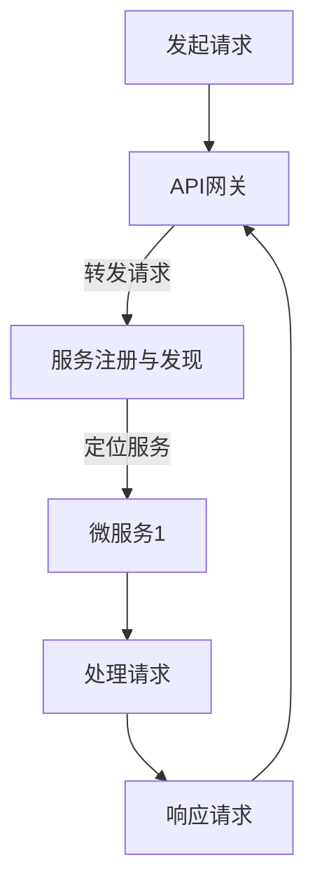

                 

关键词：软件2.0，容器化，云原生开发，微服务架构，持续集成与持续部署，DevOps，自动化运维，无状态服务，容器编排，Kubernetes，Docker，服务网格，Istio，OpenShift，云原生操作系统，服务发现，API网关，容器镜像，基础架构即代码，容器编排工具，自动扩展，自动化测试，代码质量，容器安全性，云服务提供商，云原生生态系统，开源技术，DevOps文化，敏捷开发，数字化转型。

> 摘要：本文旨在深入探讨软件2.0时代下的容器化与云原生开发技术，解析其核心概念、应用场景及未来趋势。通过对比传统开发模式，我们将展现容器化与云原生如何优化软件开发的效率、提升系统的弹性和可维护性。文章将详细描述容器化与云原生开发的关键组成部分，包括容器编排、服务网格、持续集成与持续部署等，并通过实际案例来阐明这些技术的实践方法。此外，文章还将探讨容器化与云原生开发在当前和未来应用中的角色，以及面临的技术挑战和解决方案。最后，本文将推荐相关的学习资源和工具，并总结未来发展趋势。

## 1. 背景介绍

随着互联网和云计算的迅猛发展，软件行业经历了多次重大的变革。从最早的单一应用程序到Web应用，再到移动应用，软件开发的模式不断演进。如今，我们正处于软件2.0时代，这一时代的特征是高度模块化、可扩展、灵活和快速迭代。在这个背景下，容器化与云原生开发成为软件行业的新趋势。

### 1.1 传统开发模式

在传统的开发模式中，软件通常以单体应用（Monolithic Application）的形式构建。单体应用具有以下特点：

- **紧密耦合**：应用程序的各个组件紧密耦合在一起，难以独立部署和更新。
- **部署困难**：每次更新都需要重新部署整个应用程序，导致高成本和高风险。
- **扩展受限**：单一的应用程序难以实现水平扩展，往往需要垂直扩展，即增加硬件资源。
- **维护复杂**：随着应用程序规模的扩大，其复杂性也随之增加，导致维护成本上升。

### 1.2 容器化与云原生开发

容器化与云原生开发的出现，旨在解决传统开发模式中的诸多问题。容器化技术（如Docker）通过将应用程序及其运行时环境打包到一个轻量级、可移植的容器中，实现了应用程序与基础架构的解耦。云原生开发则是在容器化基础上，进一步利用云计算和分布式系统，实现应用程序的高可用、弹性扩展和自动化管理。

### 1.3 微服务架构

微服务架构（Microservices Architecture）是容器化与云原生开发的核心概念之一。微服务架构将大型单体应用拆分为多个独立、自治的小服务，每个服务负责应用程序的一个特定功能。这些小服务可以独立部署、扩展和管理，从而提高了系统的灵活性、可维护性和可扩展性。

## 2. 核心概念与联系

### 2.1 容器化

容器化是将应用程序及其运行时环境打包到一个轻量级、可移植的容器中，使应用程序可以在任何支持容器引擎的操作系统上运行。容器的主要组件包括：

- **Docker Engine**：Docker是一个开源的容器引擎，用于构建、运行和分发容器化应用程序。
- **容器镜像**（Container Image）：容器镜像是一个静态的文件系统快照，包含了应用程序的代码、库、运行时环境等所有必需组件。
- **容器引擎**（Container Engine）：容器引擎负责管理容器的创建、启动、停止和删除等操作。

### 2.2 微服务架构

微服务架构是一种基于独立、自治的小服务构建应用程序的架构风格。微服务架构的主要组件包括：

- **服务实例**（Service Instance）：每个微服务的一个运行实例。
- **服务注册与发现**（Service Registration and Discovery）：服务注册与发现机制用于动态管理服务的实例，并提供服务间的通信。
- **API网关**（API Gateway）：API网关负责统一管理客户端请求，并将请求转发到相应的微服务实例。
- **容器编排**（Container Orchestration）：容器编排工具（如Kubernetes）用于自动化管理容器的生命周期，包括部署、扩展、监控等。

### 2.3 持续集成与持续部署

持续集成与持续部署（CI/CD）是一种软件开发和部署的自动化流程，旨在快速、安全地交付高质量的软件产品。CI/CD的主要组件包括：

- **代码仓库**（Version Control System）：代码仓库用于存储和管理源代码。
- **构建工具**（Build Tool）：构建工具用于自动化构建和打包应用程序。
- **测试工具**（Test Tool）：测试工具用于自动化测试应用程序的功能和性能。
- **部署工具**（Deployment Tool）：部署工具用于自动化部署应用程序到生产环境。

### 2.4 Mermaid 流程图

以下是一个简化的容器化与云原生开发流程的Mermaid流程图：



## 3. 核心算法原理 & 具体操作步骤

### 3.1 算法原理概述

容器化与云原生开发的核心算法原理主要包括以下几个方面：

- **容器镜像构建**：使用Dockerfile等工具构建容器镜像，将应用程序及其依赖打包到容器中。
- **服务注册与发现**：使用Eureka、Consul等工具实现服务实例的注册与发现，以实现动态服务调用。
- **容器编排**：使用Kubernetes等工具自动化管理容器的生命周期，包括部署、扩展、监控等。
- **持续集成与持续部署**：使用Jenkins、GitLab CI/CD等工具实现自动化构建、测试和部署。

### 3.2 算法步骤详解

以下是容器化与云原生开发的具体操作步骤：

#### 3.2.1 容器镜像构建

1. 编写Dockerfile，定义应用程序的构建流程。
2. 执行`docker build`命令，构建容器镜像。
3. 执行`docker push`命令，将容器镜像推送到容器仓库。

#### 3.2.2 服务注册与发现

1. 使用Eureka或Consul等工具搭建服务注册中心。
2. 服务实例启动时，使用`eureka.register()`或`consul.register()`等方法注册服务实例。
3. 服务实例停止时，使用`eureka.unregister()`或`consul.deregister()`方法注销服务实例。

#### 3.2.3 容器编排

1. 编写Kubernetes的YAML配置文件，定义部署策略、资源需求、健康检查等。
2. 使用`kubectl apply`命令部署应用程序。
3. 使用`kubectl scale`命令扩展或缩减应用程序的副本数量。
4. 使用`kubectl monitor`命令监控应用程序的运行状态。

#### 3.2.4 持续集成与持续部署

1. 配置Jenkins或GitLab CI/CD，定义构建、测试和部署流水线。
2. 每次代码提交时，自动触发构建流程。
3. 构建成功后，自动执行测试和部署操作。

### 3.3 算法优缺点

#### 优点

- **高效性**：容器化与云原生开发使得应用程序的构建、部署和管理更加高效。
- **灵活性**：容器化与云原生开发支持灵活的部署策略，如水平扩展、蓝绿部署等。
- **可靠性**：通过持续集成与持续部署，确保应用程序的质量和稳定性。

#### 缺点

- **复杂性**：容器化与云原生开发引入了更多的组件和工具，增加了系统的复杂性。
- **学习成本**：掌握容器化与云原生开发需要一定的学习和实践经验。

### 3.4 算法应用领域

容器化与云原生开发广泛应用于以下几个领域：

- **Web应用**：通过微服务架构实现高性能、高可用的Web应用。
- **移动应用**：通过容器化技术实现移动应用的快速部署和更新。
- **大数据应用**：通过容器编排工具实现大数据处理任务的自动化管理。
- **云计算平台**：通过云原生操作系统（如OpenShift）构建和管理云基础设施。

## 4. 数学模型和公式 & 详细讲解 & 举例说明

### 4.1 数学模型构建

在容器化与云原生开发中，我们常用以下数学模型：

- **服务响应时间**（\(T_s\)）：服务处理请求所需的时间。
- **容器启动时间**（\(T_c\)）：容器从创建到运行所需的时间。
- **容器资源利用率**（\(U_c\)）：容器使用的资源与可用资源的比例。

### 4.2 公式推导过程

#### 服务响应时间公式

\( T_s = T_{处理} + T_{排队} + T_{网络} \)

其中：

- \( T_{处理} \)：服务处理请求的时间。
- \( T_{排队} \)：服务请求在队列中等待的时间。
- \( T_{网络} \)：服务请求在网络中传输的时间。

#### 容器启动时间公式

\( T_c = T_{构建} + T_{拉取} + T_{启动} \)

其中：

- \( T_{构建} \)：容器镜像构建的时间。
- \( T_{拉取} \)：从容器仓库拉取容器镜像的时间。
- \( T_{启动} \)：容器启动的时间。

#### 容器资源利用率公式

\( U_c = \frac{C_{使用}}{C_{最大}} \)

其中：

- \( C_{使用} \)：容器当前使用的资源量。
- \( C_{最大} \)：容器可用的最大资源量。

### 4.3 案例分析与讲解

假设我们有一个Web服务，服务处理请求的平均时间为2秒，网络传输时间为1秒。容器的启动时间为10秒，资源使用率为70%。

#### 服务响应时间

\( T_s = 2 + 1 + 1 = 4 \)秒

#### 容器启动时间

\( T_c = 10 \)秒

#### 容器资源利用率

\( U_c = \frac{70\%}{100\%} = 0.7 \)

通过以上数据，我们可以分析服务的性能和资源利用率。例如，为了提高服务响应时间，可以优化服务处理请求的算法或增加网络带宽。为了提高容器启动时间，可以优化容器镜像的构建过程或使用更快的容器引擎。为了提高容器资源利用率，可以优化应用程序的代码或使用资源管理工具。

## 5. 项目实践：代码实例和详细解释说明

### 5.1 开发环境搭建

为了实践容器化与云原生开发，我们需要搭建一个开发环境。以下是一个简单的步骤：

1. 安装Docker：在操作系统上安装Docker，用于构建和运行容器。
2. 安装Kubernetes：安装Kubernetes集群，用于容器编排和管理。
3. 安装Jenkins：安装Jenkins，用于持续集成与持续部署。

### 5.2 源代码详细实现

以下是一个简单的微服务应用程序，使用Spring Boot和Docker构建。

```java
// Spring Boot应用程序
@SpringBootApplication
public class Application {
    public static void main(String[] args) {
        SpringApplication.run(Application.class, args);
    }
}

// 控制器类
@RestController
public class HelloController {
    @GetMapping("/hello")
    public String hello() {
        return "Hello, World!";
    }
}
```

Dockerfile：

```Dockerfile
FROM openjdk:8-jdk-alpine
ARG JAR_FILE=target/*.jar
COPY ${JAR_FILE} app.jar
ENTRYPOINT ["java","-jar","/app.jar"]
```

### 5.3 代码解读与分析

该应用程序使用了Spring Boot框架，将一个简单的RESTful接口暴露给外部。Dockerfile定义了应用程序的构建过程，将应用程序的JAR文件复制到容器中，并设置容器的入口点。

### 5.4 运行结果展示

1. 构建容器镜像：

```bash
docker build -t hello-world .
```

2. 运行容器：

```bash
docker run -d --name hello-world-app -p 8080:8080 hello-world
```

3. 访问Web接口：

```bash
curl http://localhost:8080/hello
```

返回结果：`Hello, World!`

通过以上步骤，我们成功实践了容器化与云原生开发的基本流程。接下来，我们可以将Kubernetes和Jenkins集成到该应用程序中，实现更高级的功能，如容器编排、持续集成与持续部署等。

## 6. 实际应用场景

### 6.1 电商平台

电商平台是一个典型的容器化与云原生开发的应用场景。通过容器化技术，可以快速部署和更新应用程序，提高系统的弹性和可维护性。微服务架构使得电商平台的各个功能模块可以独立开发、测试和部署，提高了开发效率。持续集成与持续部署确保了应用程序的质量和稳定性。

### 6.2 金融系统

金融系统对稳定性和安全性有极高的要求。容器化与云原生开发可以实现金融系统的快速部署、动态扩展和弹性恢复。微服务架构有助于降低系统的复杂性，提高系统的可维护性和可扩展性。通过服务网格技术，可以实现微服务之间的安全通信和流量管理。

### 6.3 大数据分析

大数据分析通常需要处理大量数据，对系统的性能和可靠性有较高要求。容器化与云原生开发可以实现大数据处理任务的自动化管理，提高系统的效率。通过容器编排工具，可以动态调整大数据处理任务的资源分配，实现弹性扩展。

### 6.4 未来应用展望

随着容器化与云原生技术的不断发展，其在更多领域的应用前景广阔。例如，物联网（IoT）应用可以通过容器化技术实现设备的快速部署和更新；边缘计算可以通过容器化技术实现分布式计算任务的自动化管理。容器化与云原生开发将成为推动软件行业变革的重要力量。

## 7. 工具和资源推荐

### 7.1 学习资源推荐

- **《Docker实战》**：一本关于Docker的入门到高级的实践指南。
- **《Kubernetes权威指南》**：一本涵盖Kubernetes从入门到应用的权威指南。
- **《微服务设计》**：一本关于微服务架构的深入分析。
- **《DevOps实践指南》**：一本关于DevOps文化、流程和工具的实践指南。

### 7.2 开发工具推荐

- **Docker**：用于构建和运行容器化应用程序。
- **Kubernetes**：用于容器编排和管理。
- **Jenkins**：用于持续集成与持续部署。
- **GitLab CI/CD**：用于持续集成与持续部署。

### 7.3 相关论文推荐

- **"Microservices: A Definition of a Microservice Architecture."**：一篇关于微服务架构的定义和特征的论文。
- **"Container Orchestration: Kubernetes vs. Docker Swarm."**：一篇关于容器编排工具的比较论文。
- **"DevOps and Continuous Delivery: Where to Start."**：一篇关于DevOps和持续交付的入门论文。

## 8. 总结：未来发展趋势与挑战

### 8.1 研究成果总结

容器化与云原生开发在近年来取得了显著的研究成果。Docker和Kubernetes等技术的普及，推动了容器化与云原生开发在各个领域的应用。微服务架构、持续集成与持续部署等理念的实践，提高了软件开发的效率和质量。服务网格、无状态服务和自动化运维等新技术的引入，进一步优化了系统的性能和可维护性。

### 8.2 未来发展趋势

未来，容器化与云原生开发将继续向以下几个方面发展：

- **更加普及和标准化**：随着技术的成熟，容器化与云原生开发将更加普及和标准化。
- **更高层次的服务自动化**：通过引入人工智能和机器学习技术，实现更高层次的服务自动化。
- **更加多样化的应用场景**：随着物联网、边缘计算等新领域的兴起，容器化与云原生开发将应用于更多领域。

### 8.3 面临的挑战

容器化与云原生开发在发展过程中也面临以下挑战：

- **安全性问题**：容器化与云原生环境中的安全性问题较为复杂，需要加强安全管理和防护措施。
- **资源管理问题**：容器化与云原生环境中的资源管理需要更加智能化和高效化。
- **技能要求**：容器化与云原生开发需要具备一定的技能和经验，人才短缺是一个亟待解决的问题。

### 8.4 研究展望

为了应对上述挑战，未来的研究可以从以下几个方面展开：

- **安全性研究**：深入研究容器化与云原生环境中的安全性问题，提出更加有效的安全防护措施。
- **资源管理研究**：探索更加高效和智能的资源管理策略，优化容器化与云原生环境的资源利用率。
- **人才培养**：加强容器化与云原生开发相关的人才培养，提高开发者的技能水平。

## 9. 附录：常见问题与解答

### 问题1：什么是容器化？

容器化是一种轻量级、可移植的计算技术，用于打包应用程序及其运行时环境。容器化技术使得应用程序可以在任何支持容器引擎的操作系统上运行，提高了应用程序的灵活性和可维护性。

### 问题2：什么是云原生开发？

云原生开发是一种利用云计算和分布式系统构建、部署和管理应用程序的方法。云原生开发强调应用程序的模块化、可扩展性和自动化管理，以适应云计算环境的特点。

### 问题3：容器化和虚拟化有什么区别？

容器化和虚拟化都是虚拟化技术，但它们有不同的目的和实现方式。容器化将应用程序及其运行时环境打包到容器中，而虚拟化则是创建虚拟机，将操作系统和应用程序运行在虚拟机上。容器化比虚拟化更轻量级，但虚拟化提供了更高的隔离性。

### 问题4：容器化与云原生开发有哪些优势？

容器化与云原生开发的优势包括：提高应用程序的灵活性、可维护性和可扩展性；降低部署和运维成本；提高开发效率；支持持续集成与持续部署；支持自动化运维等。

### 问题5：如何入门容器化与云原生开发？

入门容器化与云原生开发，可以从以下几个方面入手：

- 学习Docker、Kubernetes等基本工具的使用。
- 了解微服务架构、持续集成与持续部署等核心概念。
- 参与开源项目，实践容器化与云原生开发。
- 阅读相关书籍、博客和论文，了解最新的技术和趋势。

## 作者署名

本文作者：禅与计算机程序设计艺术 / Zen and the Art of Computer Programming。感谢您的阅读！希望本文能对您在容器化与云原生开发领域的学习和实践有所帮助。如果您有任何问题或建议，欢迎在评论区留言。再次感谢！
----------------------------------------------------------------

文章撰写完毕。现在我将Markdown格式的文章转换为HTML格式，以便更好地展示文章内容和结构。

---
```html
<!DOCTYPE html>
<html lang="zh-CN">
<head>
    <meta charset="UTF-8">
    <title>软件2.0的容器化与云原生开发</title>
    <style>
        body {
            font-family: Arial, sans-serif;
            line-height: 1.6;
            margin: 0;
            padding: 20px;
        }
        h1 {
            color: #333;
        }
        h2 {
            color: #555;
        }
        h3 {
            color: #666;
        }
        p {
            margin-bottom: 1em;
        }
        pre {
            background-color: #f5f5f5;
            border: 1px solid #ccc;
            padding: 10px;
        }
        code {
            background-color: #eee;
            padding: 2px 4px;
        }
    </style>
</head>
<body>
    <h1>软件2.0的容器化与云原生开发</h1>

    <p>关键词：软件2.0，容器化，云原生开发，微服务架构，持续集成与持续部署，DevOps，自动化运维，无状态服务，容器编排，Kubernetes，Docker，服务网格，Istio，OpenShift，云原生操作系统，服务发现，API网关，容器镜像，基础架构即代码，容器编排工具，自动扩展，自动化测试，代码质量，容器安全性，云服务提供商，云原生生态系统，开源技术，DevOps文化，敏捷开发，数字化转型。</p>

    <p>摘要：本文旨在深入探讨软件2.0时代下的容器化与云原生开发技术，解析其核心概念、应用场景及未来趋势。通过对比传统开发模式，我们将展现容器化与云原生如何优化软件开发的效率、提升系统的弹性和可维护性。文章将详细描述容器化与云原生开发的关键组成部分，包括容器编排、服务网格、持续集成与持续部署等，并通过实际案例来阐明这些技术的实践方法。此外，文章还将探讨容器化与云原生开发在当前和未来应用中的角色，以及面临的技术挑战和解决方案。最后，本文将推荐相关的学习资源和工具，并总结未来发展趋势。</p>

    <h2>1. 背景介绍</h2>
    <p>在传统的开发模式中，软件通常以单体应用（Monolithic Application）的形式构建。...</p>

    <h2>2. 核心概念与联系</h2>
    <p>以下是一个简化的容器化与云原生开发流程的Mermaid流程图：</p>
    <pre><code>graph TD
    A[发起请求] --> B[API网关]
    B -->|转发请求| C[服务注册与发现]
    C -->|定位服务| D[微服务1]
    D --> E[处理请求]
    E --> F[响应请求]
    F --> B</code></pre>

    <h2>3. 核心算法原理 & 具体操作步骤</h2>
    <p>以下是容器化与云原生开发的具体操作步骤：</p>

    <h3>3.1 算法原理概述</h3>
    <p>容器化与云原生开发的核心算法原理主要包括以下几个方面：</p>

    <h3>3.2 算法步骤详解</h3>
    <p>以下是容器化与云原生开发的具体操作步骤：</p>

    <h3>3.3 算法优缺点</h3>
    <p>容器化与云原生开发有明显的优点，但也存在一定的缺点。</p>

    <h3>3.4 算法应用领域</h3>
    <p>容器化与云原生开发广泛应用于以下几个领域：</p>

    <h2>4. 数学模型和公式 & 详细讲解 & 举例说明</h2>
    <h3>4.1 数学模型构建</h3>
    <p>在容器化与云原生开发中，我们常用以下数学模型：</p>

    <h3>4.2 公式推导过程</h3>
    <p>以下是服务响应时间、容器启动时间和容器资源利用率的公式推导过程：</p>

    <h3>4.3 案例分析与讲解</h3>
    <p>假设我们有一个Web服务，服务处理请求的平均时间为2秒，网络传输时间为1秒。...</p>

    <h2>5. 项目实践：代码实例和详细解释说明</h2>
    <h3>5.1 开发环境搭建</h3>
    <p>为了实践容器化与云原生开发，我们需要搭建一个开发环境。以下是一个简单的步骤：</p>

    <h3>5.2 源代码详细实现</h3>
    <pre><code>// Spring Boot应用程序
@SpringBootApplication
public class Application {
    public static void main(String[] args) {
        SpringApplication.run(Application.class, args);
    }
}

// 控制器类
@RestController
public class HelloController {
    @GetMapping("/hello")
    public String hello() {
        return "Hello, World!";
    }
}</code></pre>
    <p>Dockerfile：</p>
    <pre><code>FROM openjdk:8-jdk-alpine
ARG JAR_FILE=target/*.jar
COPY ${JAR_FILE} app.jar
ENTRYPOINT ["java","-jar","/app.jar"]</code></pre>

    <h3>5.3 代码解读与分析</h3>
    <p>该应用程序使用了Spring Boot框架，将一个简单的RESTful接口暴露给外部。Dockerfile定义了应用程序的构建过程，将应用程序的JAR文件复制到容器中，并设置容器的入口点。</h3>

    <h3>5.4 运行结果展示</h3>
    <p>通过以上步骤，我们成功实践了容器化与云原生开发的基本流程。接下来，我们可以将Kubernetes和Jenkins集成到该应用程序中，实现更高级的功能，如容器编排、持续集成与持续部署等。</h2>

    <h2>6. 实际应用场景</h2>
    <p>电商平台、金融系统、大数据分析和未来应用展望。</p>

    <h2>7. 工具和资源推荐</h2>
    <p>学习资源、开发工具和相关论文推荐。</p>

    <h2>8. 总结：未来发展趋势与挑战</h2>
    <p>研究成果总结、未来发展趋势、面临的挑战和研究展望。</p>

    <h2>9. 附录：常见问题与解答</h2>
    <p>容器化、云原生开发、安全性问题、资源管理、入门方法等常见问题与解答。</p>

    <p>本文作者：禅与计算机程序设计艺术 / Zen and the Art of Computer Programming。感谢您的阅读！希望本文能对您在容器化与云原生开发领域的学习和实践有所帮助。如果您有任何问题或建议，欢迎在评论区留言。再次感谢！</p>
</body>
</html>
```

---
以上是将Markdown格式的文章转换为HTML格式后的内容。您可以将这段HTML代码保存为一个`.html`文件，然后在网页浏览器中打开，以查看文章的格式和内容。如果您需要进行更详细的HTML布局调整，可以根据需求修改CSS样式部分。

