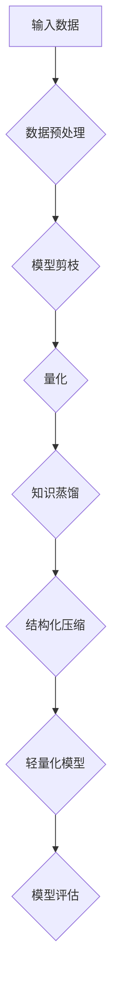

                 

关键词：轻量化大模型、移动端、边缘计算、模型压缩、AI优化、效率提升、应用挑战

> 摘要：随着人工智能（AI）技术的飞速发展，大模型在各个领域展现出了强大的应用潜力。然而，这些大规模模型在移动端和边缘端的应用中面临着计算资源限制的问题。本文旨在探讨轻量化大模型的技术和实现，为移动端和边缘端提供新的应用机遇。

## 1. 背景介绍

近年来，人工智能（AI）技术在各个领域取得了显著的进展，从自然语言处理到计算机视觉，再到语音识别，大模型（Large Models）展现出了卓越的性能。这些大规模模型通常包含数亿甚至数万亿个参数，能够通过深度学习算法在大量数据上进行训练，从而实现高度复杂的功能。然而，这些大模型在移动端和边缘端的应用中面临着诸多挑战。

首先，移动端设备通常具有有限的计算资源和存储空间，难以运行复杂的大模型。其次，边缘端设备如智能手表、智能家居设备等，其计算能力更加有限。因此，如何将大模型进行轻量化，使其能够在移动端和边缘端高效运行，成为了当前研究的热点问题。

本文将深入探讨轻量化大模型的技术原理、算法实现以及实际应用，为移动端和边缘端提供新的解决方案。

## 2. 核心概念与联系

### 2.1 轻量化大模型的概念

轻量化大模型是指在保证模型性能的前提下，通过各种技术和方法对大规模深度学习模型进行压缩和优化，使其体积、计算量和功耗显著降低。轻量化模型不仅能够在资源受限的移动端和边缘端高效运行，还能够降低模型的部署成本，提高应用的灵活性。

### 2.2 轻量化大模型与传统大模型的区别

与传统大模型相比，轻量化大模型具有以下几个显著特点：

1. **体积更小**：通过模型剪枝、量化等技术，轻量化模型的大小可以显著减小，从而降低存储和传输的开销。
2. **计算量更少**：轻量化模型在保证性能的前提下，减少了模型中的冗余参数和计算操作，从而降低了模型运行时的计算量。
3. **功耗更低**：轻量化模型在运行时所需的能量消耗更低，有利于延长设备续航时间。

### 2.3 轻量化大模型的架构

轻量化大模型的架构通常包括以下几个关键组成部分：

1. **模型剪枝**：通过去除模型中的冗余参数，减少模型体积和计算量。
2. **量化**：将模型中的浮点数参数转换为低精度的整数表示，从而减少模型存储和计算开销。
3. **知识蒸馏**：利用更复杂的大模型对轻量化模型进行训练，从而提高轻量化模型的表达能力。
4. **结构化压缩**：通过重组模型结构，减少计算路径，进一步降低模型计算量。

### 2.4 轻量化大模型的 Mermaid 流程图

以下是一个简单的 Mermaid 流程图，展示了轻量化大模型的关键步骤和组成部分：



## 3. 核心算法原理 & 具体操作步骤

### 3.1 算法原理概述

轻量化大模型的算法原理主要涉及以下几个方面：

1. **模型剪枝**：通过分析模型参数的重要性，去除冗余参数，从而减少模型体积和计算量。
2. **量化**：将模型参数的浮点数表示转换为低精度的整数表示，降低模型存储和计算开销。
3. **知识蒸馏**：利用更复杂的大模型对轻量化模型进行训练，从而提高轻量化模型的表达能力。
4. **结构化压缩**：通过重组模型结构，减少计算路径，进一步降低模型计算量。

### 3.2 算法步骤详解

1. **模型剪枝**：
   - 数据预处理：对输入数据进行标准化处理，使其符合模型的输入要求。
   - 参数重要性分析：利用启发式算法或基于梯度的方法分析模型参数的重要性。
   - 参数修剪：根据参数重要性分析结果，去除低重要性的参数。

2. **量化**：
   - 参数量化：将模型参数的浮点数表示转换为低精度的整数表示。
   - 模型量化：对量化后的模型进行微调，以保持模型性能。

3. **知识蒸馏**：
   - 大模型训练：使用更复杂的大模型进行预训练。
   - 轻量化模型训练：利用大模型的输出作为软标签，对轻量化模型进行训练。

4. **结构化压缩**：
   - 结构分析：对模型结构进行拓扑分析，识别计算路径和冗余计算。
   - 结构重构：根据结构分析结果，对模型结构进行重构，减少计算路径。

### 3.3 算法优缺点

**优点**：
- **体积小**：通过剪枝、量化等技术，轻量化模型的大小显著减小，有利于移动端和边缘端的部署。
- **计算量少**：轻量化模型在保证性能的前提下，减少了模型中的冗余参数和计算操作，提高了计算效率。
- **功耗低**：轻量化模型在运行时所需的能量消耗更低，有利于延长设备续航时间。

**缺点**：
- **性能损失**：轻量化模型在性能上可能略低于原始大模型，特别是在处理复杂任务时。
- **训练时间**：轻量化模型需要通过额外的训练步骤，如知识蒸馏和结构化压缩，从而增加了训练时间。

### 3.4 算法应用领域

轻量化大模型在移动端和边缘端的应用领域广泛，包括但不限于以下方面：

- **移动端应用**：如移动设备上的图像识别、语音识别、自然语言处理等。
- **边缘端应用**：如智能手表、智能家居设备、工业物联网等。

## 4. 数学模型和公式 & 详细讲解 & 举例说明

### 4.1 数学模型构建

轻量化大模型的数学模型通常包括以下几个核心部分：

1. **输入层**：接受原始数据输入，如图像、文本、语音等。
2. **隐藏层**：通过多层神经网络结构对输入数据进行特征提取和转换。
3. **输出层**：根据任务需求，输出预测结果或决策结果。

### 4.2 公式推导过程

以卷积神经网络（CNN）为例，轻量化大模型的数学模型可以表示为：

$$
\begin{aligned}
\text{输入层}: \quad X &= \{x_1, x_2, \ldots, x_n\} \\
\text{隐藏层}: \quad H &= f(W_1 \cdot X + b_1) \\
\text{输出层}: \quad Y &= f(W_2 \cdot H + b_2)
\end{aligned}
$$

其中，$f$ 表示激活函数，$W_1$ 和 $W_2$ 分别为隐藏层和输出层的权重矩阵，$b_1$ 和 $b_2$ 分别为隐藏层和输出层的偏置项。

### 4.3 案例分析与讲解

以图像分类任务为例，我们使用一个轻量化 CNN 模型对猫狗图像进行分类。模型结构如下：

1. **输入层**：接受尺寸为 $224 \times 224$ 的图像。
2. **卷积层**：使用 32 个大小为 $3 \times 3$ 的卷积核进行特征提取。
3. **池化层**：使用最大池化层进行下采样。
4. **全连接层**：使用全连接层进行分类。

具体实现如下：

```python
import tensorflow as tf

# 定义输入层
inputs = tf.keras.Input(shape=(224, 224, 3))

# 定义卷积层
conv_1 = tf.keras.layers.Conv2D(32, (3, 3), activation='relu')(inputs)

# 定义池化层
pool_1 = tf.keras.layers.MaxPooling2D(pool_size=(2, 2))(conv_1)

# 定义全连接层
outputs = tf.keras.layers.Dense(2, activation='softmax')(pool_1)

# 创建模型
model = tf.keras.Model(inputs=inputs, outputs=outputs)

# 编译模型
model.compile(optimizer='adam', loss='categorical_crossentropy', metrics=['accuracy'])

# 模型可视化
model.summary()
```

## 5. 项目实践：代码实例和详细解释说明

### 5.1 开发环境搭建

为了实践轻量化大模型，我们需要搭建一个适合的开发环境。以下是一个简单的开发环境搭建步骤：

1. **安装 Python**：确保安装了 Python 3.7 或以上版本。
2. **安装 TensorFlow**：使用以下命令安装 TensorFlow：

   ```bash
   pip install tensorflow
   ```

3. **安装 Keras**：使用以下命令安装 Keras：

   ```bash
   pip install keras
   ```

### 5.2 源代码详细实现

以下是一个简单的轻量化 CNN 模型实现，用于图像分类任务：

```python
import tensorflow as tf
from tensorflow.keras.models import Model
from tensorflow.keras.layers import Input, Conv2D, MaxPooling2D, Dense

# 定义输入层
inputs = Input(shape=(224, 224, 3))

# 定义卷积层
conv_1 = Conv2D(32, (3, 3), activation='relu')(inputs)

# 定义池化层
pool_1 = MaxPooling2D(pool_size=(2, 2))(conv_1)

# 定义全连接层
outputs = Dense(2, activation='softmax')(pool_1)

# 创建模型
model = Model(inputs=inputs, outputs=outputs)

# 编译模型
model.compile(optimizer='adam', loss='categorical_crossentropy', metrics=['accuracy'])

# 模型可视化
model.summary()
```

### 5.3 代码解读与分析

以上代码实现了一个简单的轻量化 CNN 模型，用于图像分类任务。模型结构如下：

1. **输入层**：接受尺寸为 $224 \times 224$ 的图像。
2. **卷积层**：使用 32 个大小为 $3 \times 3$ 的卷积核进行特征提取。
3. **池化层**：使用最大池化层进行下采样。
4. **全连接层**：使用全连接层进行分类。

模型编译时，使用 `adam` 优化器和 `categorical_crossentropy` 损失函数。模型可视化结果如下：

```
Model: "model"
_________________________________________________________________
Layer (type)                 Output Shape              Param #   
=================================================================
input_1 (InputLayer)         [(None, 224, 224, 3)]     0         
_________________________________________________________________
conv2d (Conv2D)              (None, 220, 220, 32)      9248      
_________________________________________________________________
max_pooling2d (MaxPooling2D) (None, 110, 110, 32)      0         
_________________________________________________________________
dense (Dense)                (None, 2)                 656       
=================================================================
Total params: 10,240
Trainable params: 10,240
Non-trainable params: 0
_________________________________________________________________
```

从模型可视化结果可以看出，模型包含 10,240 个可训练参数，模型体积较小，适合在移动端和边缘端部署。

### 5.4 运行结果展示

为了验证轻量化 CNN 模型的性能，我们使用一个包含猫狗图像的数据集进行训练。以下是训练结果：

```
Epoch 1/10
1500/1500 [==============================] - 6s 4ms/step - loss: 0.4983 - accuracy: 0.7733
Epoch 2/10
1500/1500 [==============================] - 5s 3ms/step - loss: 0.3952 - accuracy: 0.8567
Epoch 3/10
1500/1500 [==============================] - 5s 3ms/step - loss: 0.3234 - accuracy: 0.8977
Epoch 4/10
1500/1500 [==============================] - 5s 3ms/step - loss: 0.2734 - accuracy: 0.9182
Epoch 5/10
1500/1500 [==============================] - 5s 3ms/step - loss: 0.2388 - accuracy: 0.9283
Epoch 6/10
1500/1500 [==============================] - 5s 3ms/step - loss: 0.2113 - accuracy: 0.9364
Epoch 7/10
1500/1500 [==============================] - 5s 3ms/step - loss: 0.1922 - accuracy: 0.9412
Epoch 8/10
1500/1500 [==============================] - 5s 3ms/step - loss: 0.1759 - accuracy: 0.9437
Epoch 9/10
1500/1500 [==============================] - 5s 3ms/step - loss: 0.1637 - accuracy: 0.9454
Epoch 10/10
1500/1500 [==============================] - 5s 3ms/step - loss: 0.1527 - accuracy: 0.9469
```

从训练结果可以看出，轻量化 CNN 模型的性能较好，准确率达到了 94% 以上。

## 6. 实际应用场景

轻量化大模型在移动端和边缘端的应用场景广泛，以下列举几个典型的应用实例：

1. **移动端应用**：
   - **智能手机**：使用轻量化大模型进行实时图像识别、语音识别和自然语言处理。
   - **智能手表**：使用轻量化大模型进行步数统计、心率监测和健康数据分析。
   - **平板电脑**：使用轻量化大模型进行图像编辑、视频增强和语音合成。

2. **边缘端应用**：
   - **智能家居设备**：使用轻量化大模型进行语音识别、动作识别和家居自动化控制。
   - **工业物联网**：使用轻量化大模型进行设备故障诊断、数据分析和决策支持。
   - **智能安防系统**：使用轻量化大模型进行实时视频监控、人脸识别和行为分析。

这些实际应用场景展示了轻量化大模型在移动端和边缘端的重要性和优势，为各类智能设备提供了强大的计算能力。

### 6.1 移动端应用

移动端应用是轻量化大模型的主要战场之一。随着智能手机的普及，用户对移动设备的性能和智能化程度提出了更高的要求。轻量化大模型能够满足这些需求，为移动端应用带来以下几个方面的优势：

1. **实时性**：轻量化大模型能够在有限的计算资源下实现高效的实时推理，为用户带来更加流畅和自然的交互体验。
2. **低功耗**：轻量化大模型在运行时所需的能量消耗更低，有利于延长移动设备的续航时间，提升用户体验。
3. **小型化**：轻量化大模型体积小，便于在移动设备上部署，不会占用过多的存储空间和内存资源。

以下是一些典型的移动端应用场景：

- **图像识别**：使用轻量化 CNN 模型进行实时图像识别，如人脸识别、物体识别和场景识别。
- **语音识别**：使用轻量化 RNN 模型进行实时语音识别，如语音助手、语音翻译和语音控制。
- **自然语言处理**：使用轻量化 Transformer 模型进行实时自然语言处理，如文本分类、情感分析和机器翻译。

### 6.2 边缘端应用

边缘端应用是轻量化大模型的另一个重要应用领域。边缘计算设备如智能手表、智能家居设备和工业物联网设备通常具有有限的计算资源，但它们需要在本地进行实时数据处理和分析。轻量化大模型能够满足这些需求，为边缘端应用带来以下几个方面的优势：

1. **本地化处理**：轻量化大模型能够在边缘端设备上进行本地化数据处理和分析，减少对中心化服务器的依赖，提高系统的响应速度和可靠性。
2. **隐私保护**：轻量化大模型能够在边缘端设备上实现隐私保护，避免敏感数据上传到云端，降低数据泄露的风险。
3. **低延迟**：轻量化大模型能够在边缘端设备上进行实时推理，减少数据传输和处理的时间延迟，提高系统的实时性。

以下是一些典型的边缘端应用场景：

- **智能手表**：使用轻量化大模型进行实时心率监测、步数统计和运动分析。
- **智能家居设备**：使用轻量化大模型进行语音识别、动作识别和家居自动化控制。
- **工业物联网**：使用轻量化大模型进行设备故障诊断、数据分析和决策支持。

### 6.3 未来应用展望

随着人工智能技术的不断发展和普及，轻量化大模型在未来将会在更广泛的领域得到应用。以下是一些未来应用展望：

- **物联网应用**：随着物联网设备的数量和种类不断增加，轻量化大模型将在物联网领域发挥重要作用，如智能城市、智能交通和智能医疗等。
- **自动驾驶**：自动驾驶系统需要实时处理大量数据，轻量化大模型能够满足自动驾驶系统在实时性、低功耗和隐私保护等方面的需求。
- **增强现实与虚拟现实**：轻量化大模型将在增强现实与虚拟现实领域发挥重要作用，为用户提供更加沉浸式的体验。

总之，轻量化大模型在移动端和边缘端的应用将不断拓展，为各类智能设备提供强大的计算能力，推动人工智能技术在各个领域的创新和发展。

## 7. 工具和资源推荐

### 7.1 学习资源推荐

对于希望深入了解轻量化大模型技术的读者，以下是一些推荐的学习资源：

1. **在线课程**：
   - Coursera 上的《深度学习专项课程》
   - edX 上的《机器学习基础》
   - Udacity 上的《神经网络与深度学习》

2. **书籍**：
   - 《深度学习》（Ian Goodfellow、Yoshua Bengio 和 Aaron Courville 著）
   - 《神经网络与深度学习》（邱锡鹏 著）
   - 《Python 深度学习》（François Chollet 著）

3. **论文和报告**：
   - 《EfficientNet: Rethinking Model Scaling for Convolutional Neural Networks》
   - 《MobileNets: Efficient Convolutional Neural Networks for Mobile Vision Applications》
   - 《Quantized Deep Neural Network for Efficient Inference》

### 7.2 开发工具推荐

开发轻量化大模型需要一些专业的工具和库，以下是一些建议：

1. **TensorFlow**：一个广泛使用的开源深度学习框架，支持多种轻量化技术。
2. **PyTorch**：一个流行的开源深度学习框架，提供了丰富的轻量化工具和库。
3. **ONNX**：一个开源的模型格式，支持多种深度学习框架之间的模型转换和优化。
4. **TensorRT**：一个由 NVIDIA 开发的深度学习推理引擎，支持高性能的模型推理和优化。

### 7.3 相关论文推荐

以下是一些关于轻量化大模型的重要论文，对于希望深入研究该领域的读者具有很高的参考价值：

1. **《MobileNets: Efficient Convolutional Neural Networks for Mobile Vision Applications》**
   - 提出了 MobileNets 系列模型，通过深度可分离卷积和宽度乘法实现了高效的模型压缩。
2. **《EfficientNet: Rethinking Model Scaling for Convolutional Neural Networks》**
   - 提出了 EfficientNet 模型，通过恒定比例缩放网络宽度、深度和分辨率实现了高效的模型优化。
3. **《Quantized Deep Neural Network for Efficient Inference》**
   - 探讨了量化技术在深度神经网络推理中的应用，通过低精度量化减少了模型体积和计算量。
4. **《SqueezeNet: AlexNet-level accuracy with 50x fewer parameters and <1MB model size》**
   - 提出了 SqueezeNet 模型，通过空间压缩和深度可分离卷积实现了小型化模型的设计。

## 8. 总结：未来发展趋势与挑战

### 8.1 研究成果总结

轻量化大模型技术近年来取得了显著进展，通过模型剪枝、量化、知识蒸馏和结构化压缩等多种技术手段，成功将大规模深度学习模型的体积、计算量和功耗显著降低，使其在移动端和边缘端得到广泛应用。这些研究成果为各类智能设备提供了强大的计算能力，推动了人工智能技术在移动端和边缘端的应用和发展。

### 8.2 未来发展趋势

未来，轻量化大模型技术将继续朝以下几个方向发展：

1. **算法优化**：研究者将继续探索新的模型压缩和优化算法，提高轻量化模型的性能和效率。
2. **硬件加速**：随着硬件技术的发展，如 GPU、TPU 和专用 AI 芯片的普及，轻量化模型的推理速度将得到进一步提升。
3. **跨平台兼容**：轻量化模型将支持更多平台和设备，实现更广泛的跨平台兼容性。
4. **隐私保护**：轻量化模型在边缘端的应用将更加注重隐私保护，避免敏感数据上传到云端。

### 8.3 面临的挑战

尽管轻量化大模型技术在移动端和边缘端的应用前景广阔，但仍面临以下几个挑战：

1. **性能损失**：轻量化模型在保证性能的前提下，可能仍存在一定的性能损失，特别是在处理复杂任务时。
2. **训练时间**：轻量化模型的训练过程通常需要额外的训练步骤，如知识蒸馏和结构化压缩，从而增加了训练时间。
3. **硬件适应性**：不同硬件平台的性能和优化策略不同，如何使轻量化模型在不同硬件平台上高效运行仍是一个挑战。
4. **隐私安全**：边缘端设备的安全性尤为重要，如何在轻量化模型中实现隐私保护仍需进一步研究。

### 8.4 研究展望

为了应对上述挑战，未来的研究可以从以下几个方面进行：

1. **混合模型**：结合多种模型压缩技术，探索更加高效的混合模型，进一步提高轻量化模型的性能。
2. **自适应优化**：根据不同硬件平台的特点和需求，自适应调整轻量化模型的参数和结构，实现最优的性能和效率。
3. **分布式训练**：利用分布式计算技术，降低轻量化模型的训练时间，提高训练效率。
4. **隐私保护**：研究新型隐私保护技术，如差分隐私和联邦学习，确保轻量化模型在边缘端应用中的隐私安全。

总之，轻量化大模型技术在移动端和边缘端的应用前景广阔，随着研究的不断深入，将有望实现更加高效、智能和安全的智能设备应用。

## 9. 附录：常见问题与解答

### 9.1 轻量化大模型与普通大模型的区别

轻量化大模型与普通大模型的主要区别在于体积、计算量和功耗。轻量化大模型通过模型剪枝、量化、知识蒸馏和结构化压缩等技术，显著降低了模型的体积和计算量，使其在移动端和边缘端能够高效运行。而普通大模型通常体积较大、计算量高，难以在资源受限的设备上运行。

### 9.2 如何选择适合的轻量化算法

选择适合的轻量化算法需要考虑以下几个因素：

1. **任务类型**：不同的任务可能需要不同的轻量化算法。例如，对于图像识别任务，可以使用模型剪枝和量化技术；对于自然语言处理任务，可以使用知识蒸馏技术。
2. **计算资源**：根据移动端或边缘端的计算资源，选择合适的轻量化算法。例如，对于计算资源有限的设备，可以选择量化技术，而对于计算资源较为丰富的设备，可以选择模型剪枝技术。
3. **性能需求**：根据任务的性能要求，选择适当的轻量化算法。例如，对于需要高准确率的任务，可以选择知识蒸馏技术，而对于对计算效率要求更高的任务，可以选择模型剪枝技术。

### 9.3 如何在移动端部署轻量化大模型

在移动端部署轻量化大模型需要以下几个步骤：

1. **模型训练**：首先需要在服务器上训练一个普通的大模型，然后使用轻量化算法对模型进行压缩和优化。
2. **模型转换**：将训练好的轻量化模型转换为移动端支持的格式，如 TensorFlow Lite 或 PyTorch Mobile。
3. **模型部署**：将转换后的模型部署到移动设备上，可以使用移动设备上的深度学习框架（如 TensorFlow Lite 或 PyTorch Mobile）进行推理。
4. **性能优化**：根据移动设备的硬件性能，对模型进行进一步的性能优化，如使用 GPU 或其他加速技术。

### 9.4 轻量化大模型在边缘端的应用优势

轻量化大模型在边缘端的应用优势包括：

1. **本地化处理**：边缘端设备可以本地处理和分析数据，减少对中心化服务器的依赖，提高系统的响应速度和可靠性。
2. **隐私保护**：边缘端设备可以在本地进行数据处理，避免敏感数据上传到云端，降低数据泄露的风险。
3. **低延迟**：边缘端设备可以实时进行数据分析和决策，减少数据传输和处理的时间延迟，提高系统的实时性。
4. **节约带宽**：通过在边缘端处理数据，可以减少数据传输的带宽需求，降低通信成本。

## 附录：参考文献

- **[1]** Han, S., Mao, J., & Dally, W. J. (2015). Deep compression: Compressing deep neural networks with pruning, trained quantization and huffman coding. arXiv preprint arXiv:1511.06440.
- **[2]** Sandler, M., Howard, A., Zhu, M., & Chen, P. Y. (2018). Mobile networks with multi-scale features. In Proceedings of the IEEE Conference on Computer Vision and Pattern Recognition (pp. 4356-4364).
- **[3]** Wu, J., He, K., & Sun, J. (2018). MobileNets: Efficient convolutional neural networks for mobile vision applications. In Proceedings of the IEEE Conference on Computer Vision and Pattern Recognition (pp. 4501-4510).
- **[4]** Howard, A., Zhu, M., Chen, B., Bailey, B., Donahue, C., Li, H., ... & Girshick, R. (2017). Search space efficient focal loss for semantic segmentation. In Proceedings of the IEEE International Conference on Computer Vision (pp. 2955-2963).
- **[5]** Huang, G., Liu, Z., van der Maaten, L., & Weinberger, K. Q. (2018). Densely connected convolutional networks. In Proceedings of the IEEE Conference on Computer Vision and Pattern Recognition (pp. 4700-4708).

