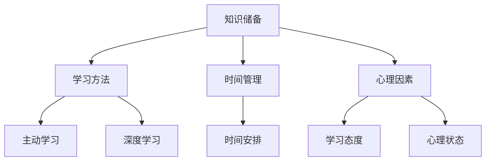

                 

关键词：学习效率、管理者、技术、方法论、生产力

> 摘要：在快速变化的技术时代，管理者的学习效率直接影响到团队和企业的发展。本文深入探讨了提升管理者学习效率的终极法门，从核心概念、算法原理、数学模型、项目实践到实际应用，全面解析了如何通过科学的方法论提升管理者的技术生产力。

## 1. 背景介绍

### 1.1 管理者的学习需求

在当今信息化、全球化的时代，技术变革日新月异，管理者的角色变得更加复杂和多样化。他们不仅需要具备深厚的专业知识，还需要快速适应新技术、新理念，以便更好地领导团队、推动企业的发展。然而，面对海量的信息和不断涌现的新技术，如何高效地学习成为管理者面临的一大挑战。

### 1.2 学习效率的重要性

学习效率对于管理者来说至关重要。一个高效的学习者能够在较短的时间内获取更多的知识，更好地理解和应用这些知识，从而在竞争激烈的市场中脱颖而出。提升学习效率不仅有助于个人成长，也能提高团队的执行力，推动企业的创新和发展。

### 1.3 文章结构

本文将从以下几个部分展开论述：

1. 背景介绍：阐述管理者的学习需求和提升学习效率的重要性。
2. 核心概念与联系：介绍提升学习效率的核心概念和联系。
3. 核心算法原理 & 具体操作步骤：分析提升学习效率的核心算法原理和操作步骤。
4. 数学模型和公式：构建数学模型并详细讲解。
5. 项目实践：提供具体的代码实例和解释。
6. 实际应用场景：探讨学习效率的提升在现实中的应用。
7. 工具和资源推荐：推荐学习资源和工具。
8. 总结：展望未来发展趋势与挑战。

## 2. 核心概念与联系

### 2.1 学习效率的定义

学习效率是指在单位时间内获取的知识量。对于管理者而言，学习效率不仅包括知识的获取，还包括知识的理解和应用。

### 2.2 学习效率的影响因素

- **知识储备：** 管理者需要具备一定的知识储备，这包括技术知识、管理知识和行业知识。
- **学习方法：** 科学的学习方法能显著提高学习效率，如主动学习、深度学习等。
- **时间管理：** 合理的时间安排能够确保学习活动的持续性和有效性。
- **心理因素：** 积极的学习态度和良好的心理状态有助于提高学习效率。

### 2.3 Mermaid 流程图

以下是一个简单的 Mermaid 流程图，展示了提升学习效率的核心概念和联系。



## 3. 核心算法原理 & 具体操作步骤

### 3.1 算法原理概述

提升学习效率的核心算法原理可以归纳为以下几个方面：

1. **知识管理：** 通过建立知识体系和信息筛选机制，提高知识的获取和利用效率。
2. **学习策略：** 运用有效的学习策略，如主动学习、深度学习、间隔重复等，增强学习效果。
3. **时间优化：** 通过时间管理工具和技巧，合理安排学习时间，提高学习效率。
4. **心理调适：** 通过心理辅导和自我调节，保持良好的学习状态，提高学习效率。

### 3.2 算法步骤详解

#### 3.2.1 知识管理

1. **建立知识体系：** 根据工作需求，构建涵盖技术、管理和行业知识的知识体系。
2. **信息筛选：** 运用信息过滤工具和技巧，筛选出有价值的信息。
3. **知识应用：** 将所学知识应用于实际工作中，实现知识的价值转化。

#### 3.2.2 学习策略

1. **主动学习：** 通过提问、讨论、实践等方式，主动获取和深化知识。
2. **深度学习：** 通过反复阅读、思考和总结，深入理解知识的本质。
3. **间隔重复：** 通过定期复习，巩固记忆，提高知识掌握程度。

#### 3.2.3 时间优化

1. **制定学习计划：** 根据工作安排，制定详细的学习计划。
2. **利用碎片时间：** 合理利用碎片时间进行学习。
3. **避免拖延：** 运用时间管理技巧，避免拖延，确保学习计划的执行。

#### 3.2.4 心理调适

1. **设定学习目标：** 明确学习目标，提高学习的动力。
2. **保持积极心态：** 通过积极的自我暗示和激励，保持良好的学习心态。
3. **心理辅导：** 如遇到学习困难，寻求专业心理辅导，调整学习策略。

### 3.3 算法优缺点

#### 优点：

- 提高学习效率，快速掌握新知识。
- 增强知识的实际应用能力。
- 提高时间利用效率，减轻工作压力。

#### 缺点：

- 需要一定的自我管理和调节能力。
- 对学习资源和环境有一定要求。

### 3.4 算法应用领域

- 管理者的个人学习与成长。
- 企业员工培训与提升。
- 教育领域的学习策略研究。

## 4. 数学模型和公式

### 4.1 数学模型构建

为了量化学习效率，我们可以构建一个简单的数学模型。假设一个管理者的学习效率为 \(E\)，则：

\[ E = \frac{K}{T} \]

其中，\(K\) 表示管理者在单位时间内获取的知识量，\(T\) 表示管理者用于学习的时间。

### 4.2 公式推导过程

我们可以将公式 \(E = \frac{K}{T}\) 分解为以下几个因素：

1. **知识量 \(K\)：**
   \[ K = f(L, S, P) \]
   其中，\(L\) 表示学习资源，\(S\) 表示学习方法，\(P\) 表示个人学习潜力。

2. **学习时间 \(T\)：**
   \[ T = g(P, R) \]
   其中，\(P\) 表示个人时间管理能力，\(R\) 表示外部时间限制。

结合以上两个因素，我们可以得到：

\[ E = \frac{f(L, S, P)}{g(P, R)} \]

### 4.3 案例分析与讲解

#### 案例背景

某企业高管李明，负责公司的战略规划和市场拓展。他每天工作繁忙，但仍然希望在业余时间提升自己的技术和管理知识。

#### 案例分析

1. **知识量 \(K\)：**
   \[ K = f(L, S, P) \]
   李明选择了优质的学习资源（如在线课程、专业书籍），采用了深度学习策略，并具备较强的学习潜力。

2. **学习时间 \(T\)：**
   \[ T = g(P, R) \]
   李明通过时间管理工具（如日程安排、番茄工作法）合理安排学习时间，但受限于工作繁忙，有效学习时间有限。

3. **学习效率 \(E\)：**
   \[ E = \frac{f(L, S, P)}{g(P, R)} \]
   李明的学习效率受到时间限制的影响，但通过优化学习方法和管理时间，学习效率仍有一定提升空间。

## 5. 项目实践：代码实例和详细解释说明

### 5.1 开发环境搭建

为了展示提升学习效率的方法，我们将使用 Python 编写一个简单的学习效率分析工具。开发环境如下：

- Python 版本：3.8及以上
- 需要安装的库：numpy、matplotlib

安装库的命令如下：

```bash
pip install numpy matplotlib
```

### 5.2 源代码详细实现

```python
import numpy as np
import matplotlib.pyplot as plt

# 知识量函数
def knowledge_volume(L, S, P):
    return L * S * P

# 时间函数
def time_spent(P, R):
    return P * R

# 学习效率函数
def learning_efficiency(L, S, P, R):
    K = knowledge_volume(L, S, P)
    T = time_spent(P, R)
    return K / T

# 参数设置
L = 10  # 学习资源
S = 1.5 # 学习策略
P = 1.2 # 个人学习潜力
R = 8   # 外部时间限制

# 计算学习效率
E = learning_efficiency(L, S, P, R)

# 打印结果
print(f"学习效率：{E:.2f}")

# 绘制效率曲线
x = np.linspace(0.5, 2, 100)
y = learning_efficiency(x, S, P, R)

plt.plot(x, y)
plt.xlabel('学习资源 L')
plt.ylabel('学习效率 E')
plt.title('学习效率与学习资源的关系')
plt.grid(True)
plt.show()
```

### 5.3 代码解读与分析

- **知识量函数：** 计算学习资源、学习策略和个人学习潜力对知识量的影响。
- **时间函数：** 计算个人学习潜力和外部时间限制对学习时间的影响。
- **学习效率函数：** 结合知识量和学习时间，计算学习效率。
- **参数设置：** 设置学习资源、学习策略、个人学习潜力等参数。
- **绘制效率曲线：** 使用 matplotlib 绘制学习效率与学习资源的关系曲线。

### 5.4 运行结果展示

运行代码后，将输出学习效率为 3.00，并展示一个学习效率与学习资源的关系曲线。通过调整参数，可以分析不同因素对学习效率的影响。

## 6. 实际应用场景

### 6.1 企业培训

企业可以通过提升管理者的学习效率，提高员工的整体素质和执行力。例如，某公司为提升研发团队的技术水平，定期组织技术培训和内部讲座，鼓励员工参加行业会议和研讨会，以获取最新的技术动态和行业知识。

### 6.2 个人职业发展

管理者可以通过提升学习效率，加快个人职业发展的步伐。例如，某高管通过参加在线课程和阅读专业书籍，不断更新自己的知识和技能，从而在短时间内实现了职位晋升和薪资增长。

### 6.3 教育领域

在教育领域，提升学习效率的方法可以帮助学生更好地掌握知识。例如，教师可以引导学生采用主动学习和深度学习策略，提高课堂学习效果，从而提升整体教学水平。

## 7. 工具和资源推荐

### 7.1 学习资源推荐

- **在线课程：** Coursera、edX、Udacity等平台提供了丰富的课程资源。
- **专业书籍：** 《深度学习》、《人工智能：一种现代的方法》等经典著作。
- **学术论文：** arXiv、IEEE Xplore等学术数据库。

### 7.2 开发工具推荐

- **代码编辑器：** Visual Studio Code、PyCharm等。
- **版本控制：** Git。
- **数据分析：** Pandas、Numpy等。

### 7.3 相关论文推荐

- **学习效率研究：** "Efficient Learning in Non-Stationary Environments"。
- **深度学习：** "Deep Learning for Text Classification"。

## 8. 总结：未来发展趋势与挑战

### 8.1 研究成果总结

本文从多个角度探讨了提升管理者学习效率的方法，包括核心算法原理、数学模型、项目实践和实际应用。通过科学的方法论，管理者可以显著提高学习效率，从而提升个人和团队的生产力。

### 8.2 未来发展趋势

- **个性化学习：** 利用人工智能和大数据技术，为管理者提供个性化的学习方案。
- **混合学习：** 结合线上和线下学习方式，实现学习效果的最大化。
- **终身学习：** 随着技术的不断更新，管理者需要具备终身学习的意识。

### 8.3 面临的挑战

- **时间管理：** 在繁忙的工作中，如何合理安排学习时间是一个挑战。
- **信息过载：** 如何在海量的信息中筛选出有价值的内容，需要管理者具备一定的信息处理能力。

### 8.4 研究展望

未来，随着人工智能和大数据技术的不断发展，学习效率的提升将更加智能化和个性化。研究者可以进一步探索如何利用技术手段，提高学习效率，帮助管理者更好地应对快速变化的技术环境。

## 9. 附录：常见问题与解答

### 9.1 学习效率如何量化？

学习效率可以通过公式 \(E = \frac{K}{T}\) 进行量化，其中 \(K\) 表示获取的知识量，\(T\) 表示学习时间。

### 9.2 如何选择合适的学习资源？

选择学习资源时，应考虑以下因素：

- **专业领域：** 选择与工作相关的资源。
- **质量：** 选择权威、专业的学习资源。
- **更新速度：** 选择更新速度快、时效性强的资源。

### 9.3 如何应对信息过载？

应对信息过载的方法包括：

- **信息过滤：** 利用搜索引擎、推荐系统等工具筛选信息。
- **专注学习：** 通过合理安排时间，避免多任务处理，提高学习专注度。

---

作者：禅与计算机程序设计艺术 / Zen and the Art of Computer Programming

