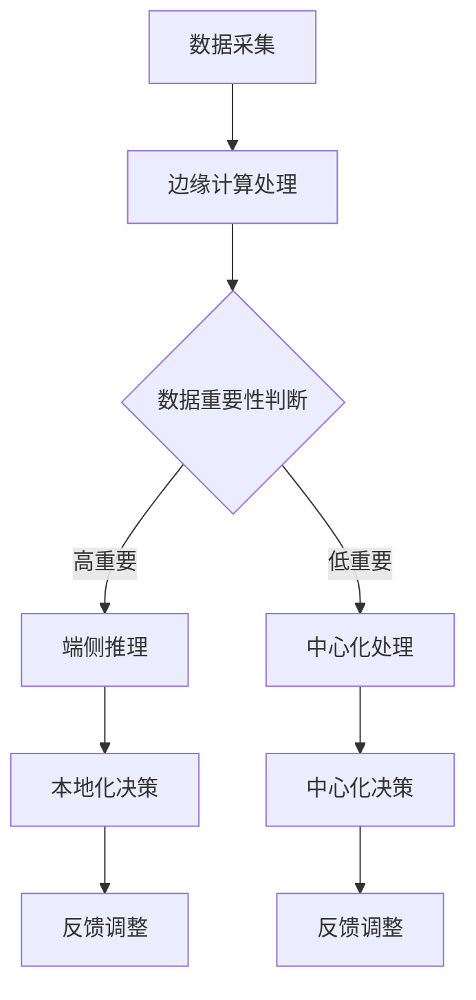

                 

  
## 1. 背景介绍

随着物联网（IoT）和5G通信技术的发展，边缘计算逐渐成为分布式计算体系中的重要一环。边缘计算的核心思想是将计算能力下沉到网络边缘，即在数据生成源附近进行数据处理，从而降低延迟、减少带宽消耗、提升系统响应速度。端侧推理作为边缘计算的一个重要应用，旨在将复杂的机器学习模型部署到移动设备上，实现本地化、实时化的智能决策。

边缘计算与端侧推理的关系紧密相连。端侧推理依赖于边缘计算提供的基础设施和资源，而边缘计算通过端侧推理实现了在终端设备上进行高效、低延迟的智能处理。本文将围绕边缘计算与端侧推理的核心概念、算法原理、项目实践以及未来应用进行深入探讨，旨在为广大开发者提供实用的技术参考。

## 2. 核心概念与联系

### 2.1 边缘计算

边缘计算（Edge Computing）是一种分布式计算范式，其核心思想是将计算任务分散到网络边缘的设备上，例如物联网设备、智能传感器、边缘服务器等。边缘计算能够实现以下优势：

- **降低延迟**：将计算任务迁移到网络边缘，减少了数据在传输过程中的延迟。
- **节省带宽**：在边缘设备上处理数据，降低了中心化处理所需的数据传输量，从而节省了网络带宽。
- **提高响应速度**：边缘设备本地处理数据，能够快速响应，提高了系统的整体性能。
- **增强安全性**：在边缘设备上处理敏感数据，减少了数据在传输过程中的泄露风险。

### 2.2 端侧推理

端侧推理（On-Device Inference）是指将复杂的机器学习模型部署到移动设备上，利用移动设备的计算资源进行推理操作。端侧推理具有以下特点：

- **本地化处理**：端侧推理无需连接互联网，可以在本地设备上进行数据处理，提高了系统的自主性。
- **实时化处理**：端侧推理能够实现低延迟的实时处理，适用于对实时性要求较高的应用场景。
- **隐私保护**：端侧推理在本地设备上进行数据处理，有效保护了用户隐私。

### 2.3 边缘计算与端侧推理的联系

边缘计算为端侧推理提供了基础设施支持，使得端侧推理能够在更广泛的场景中得到应用。两者的联系主要体现在以下几个方面：

- **协同工作**：边缘计算通过分布式计算资源为端侧推理提供计算能力，端侧推理则在边缘设备上实现本地化、实时化的智能处理。
- **互补优势**：边缘计算可以处理大量数据，端侧推理则专注于对关键数据进行实时处理，两者互补，共同提高了系统的整体性能。
- **协同创新**：边缘计算与端侧推理的结合，为智能计算、物联网等领域的创新提供了新的方向和可能。

### 2.4 Mermaid 流程图

下面是一个简单的Mermaid流程图，展示了边缘计算与端侧推理的基本架构和流程。



## 3. 核心算法原理 & 具体操作步骤

### 3.1 算法原理概述

边缘计算与端侧推理的核心算法主要包括以下几类：

- **模型压缩算法**：通过降低模型的复杂度，减少模型的存储和计算资源消耗。
- **模型优化算法**：通过调整模型的结构和参数，提高模型的性能和效率。
- **分布式算法**：通过分布式计算技术，将计算任务分解到多个边缘设备上，实现协同处理。

### 3.2 算法步骤详解

#### 3.2.1 模型压缩算法

模型压缩算法主要包括以下步骤：

1. **量化**：将模型的浮点数参数转换为低精度整数，以减少模型的存储和计算资源。
2. **剪枝**：通过删除模型中的冗余权重，降低模型的复杂度。
3. **权重共享**：将模型中的相同或相似权重进行共享，减少模型的参数数量。
4. **知识蒸馏**：通过将模型的知识传递给一个更小的模型，实现模型的压缩和迁移。

#### 3.2.2 模型优化算法

模型优化算法主要包括以下步骤：

1. **参数调整**：通过调整模型的参数，提高模型的性能和收敛速度。
2. **结构调整**：通过调整模型的结构，降低模型的复杂度，提高模型的效率。
3. **动态调整**：根据实际应用场景，动态调整模型的结构和参数，以适应不同的需求。

#### 3.2.3 分布式算法

分布式算法主要包括以下步骤：

1. **任务分解**：将计算任务分解为多个子任务，分配到不同的边缘设备上。
2. **协同处理**：多个边缘设备协同处理子任务，实现整体计算任务的完成。
3. **结果汇总**：将多个边缘设备的结果进行汇总，得到最终的输出结果。

### 3.3 算法优缺点

#### 模型压缩算法

**优点**：

- 减少了模型的存储和计算资源消耗，适用于资源受限的边缘设备。
- 提高了模型的性能和效率，适用于实时性要求较高的场景。

**缺点**：

- 压缩后的模型可能损失一定的性能，影响模型的准确性。
- 部分压缩算法可能不适用于所有类型的模型。

#### 模型优化算法

**优点**：

- 提高了模型的性能和效率，适用于各种应用场景。
- 可以根据实际需求，动态调整模型的结构和参数。

**缺点**：

- 需要大量的计算资源和时间，适用于大型模型。
- 可能会导致模型过拟合，影响模型的泛化能力。

#### 分布式算法

**优点**：

- 提高了计算效率和系统的可靠性，适用于大规模数据处理。
- 可以实现多个边缘设备的协同处理，提高系统的整体性能。

**缺点**：

- 分布式算法的设计和实现较为复杂，需要较高的技术门槛。
- 需要处理数据同步和通信等问题，可能增加系统的复杂度。

### 3.4 算法应用领域

边缘计算与端侧推理在多个领域具有广泛的应用，包括：

- **智能物联网**：通过边缘计算和端侧推理，实现智能设备的本地化、实时化处理，提高系统的响应速度和效率。
- **智能交通**：通过边缘计算和端侧推理，实现交通数据的实时处理和分析，优化交通流量和管理。
- **智能家居**：通过边缘计算和端侧推理，实现智能设备的自主决策和控制，提高家居环境的舒适度和安全性。
- **智能医疗**：通过边缘计算和端侧推理，实现医疗数据的实时处理和分析，辅助医生进行诊断和治疗。

## 4. 数学模型和公式 & 详细讲解 & 举例说明

### 4.1 数学模型构建

边缘计算与端侧推理的数学模型主要包括以下几部分：

1. **边缘计算模型**：用于描述边缘设备之间的协同计算过程，包括任务分配、负载均衡、数据同步等。
2. **端侧推理模型**：用于描述端侧设备上的推理过程，包括模型压缩、优化、推理等。
3. **分布式算法模型**：用于描述分布式计算过程中的任务分解、协同处理、结果汇总等。

### 4.2 公式推导过程

以边缘计算模型为例，我们介绍一种常见的协同计算公式：

$$
\begin{aligned}
    & T_c = T_s + \alpha \cdot T_d \\
    & T_d = \frac{T_c}{n}
\end{aligned}
$$

其中，$T_c$ 表示协同计算的总时间，$T_s$ 表示单一设备计算时间，$T_d$ 表示分布式计算时间，$\alpha$ 表示任务分配系数，$n$ 表示参与计算的任务数。

#### 推导过程：

1. **任务分配**：将总任务 $T_c$ 分配到 $n$ 个设备上，每个设备承担 $\frac{T_c}{n}$ 的任务。
2. **计算时间**：每个设备完成 $\frac{T_c}{n}$ 的任务所需时间为 $T_d$。
3. **协同计算**：多个设备协同完成任务，总时间 $T_c$ 包括单一设备计算时间 $T_s$ 和分布式计算时间 $\alpha \cdot T_d$。

### 4.3 案例分析与讲解

#### 案例背景：

某智能交通系统需要实时处理大量交通数据，以提高交通流量和管理效率。系统采用边缘计算与端侧推理技术，实现交通数据的本地化、实时化处理。

#### 模型构建：

1. **边缘计算模型**：采用分布式算法，将交通数据处理任务分配到多个边缘设备上，实现协同处理。
2. **端侧推理模型**：将交通数据分类模型部署到端侧设备上，实现本地化决策。

#### 公式应用：

1. **任务分配**：假设系统中有 $n$ 个边缘设备，总任务时间为 $T_c$，任务分配系数为 $\alpha = 0.5$。

    $$ T_d = \frac{T_c}{n} $$

2. **协同计算**：每个设备承担的任务时间为 $\frac{T_c}{2n}$。

    $$ T_c = T_s + 0.5 \cdot T_d $$

3. **计算时间**：每个设备完成交通数据处理的时间为 $\frac{T_c}{2n}$。

    $$ T_d = \frac{T_c}{2n} $$

#### 案例分析：

1. **任务分配**：系统将交通数据处理任务平均分配到 $n$ 个边缘设备上，每个设备处理 $\frac{T_c}{n}$ 的任务。
2. **协同计算**：多个边缘设备协同处理交通数据处理任务，总时间 $T_c$ 包括单一设备计算时间 $T_s$ 和分布式计算时间 $0.5 \cdot T_d$。
3. **计算时间**：每个设备完成交通数据处理的时间为 $\frac{T_c}{2n}$，相对于单一设备处理时间，协同计算可以显著减少计算时间。

## 5. 项目实践：代码实例和详细解释说明

### 5.1 开发环境搭建

1. **硬件环境**：选择具备高性能计算能力的边缘设备和移动设备，如树莓派、NVIDIA Jetson等。
2. **软件环境**：在边缘设备和移动设备上安装相应的操作系统和开发工具，如Linux、Python、TensorFlow等。
3. **网络环境**：确保边缘设备和移动设备之间的网络连接稳定，以便进行数据传输和协同计算。

### 5.2 源代码详细实现

#### 边缘计算部分：

```python
# 边缘计算处理
import tensorflow as tf

# 加载预训练模型
model = tf.keras.models.load_model('path/to/edge_model.h5')

# 边缘设备上的数据预处理
def preprocess_data(data):
    # 数据预处理操作
    return processed_data

# 边缘设备上的推理操作
def edge_inference(data):
    processed_data = preprocess_data(data)
    predictions = model.predict(processed_data)
    return predictions

# 分布式算法实现
def distributed_inference(data, num_devices):
    # 任务分配
    task_size = len(data) // num_devices
    device_data = [data[i:i+task_size] for i in range(0, len(data), task_size)]

    # 协同处理
    results = []
    for device_data in device_data:
        predictions = edge_inference(device_data)
        results.append(predictions)

    # 结果汇总
    final_result = tf.reduce_mean(results, axis=0)
    return final_result
```

#### 端侧推理部分：

```python
# 端侧推理处理
import tensorflow as tf

# 加载预训练模型
model = tf.keras.models.load_model('path/to/endpoint_model.h5')

# 端侧设备上的数据预处理
def preprocess_data(data):
    # 数据预处理操作
    return processed_data

# 端侧推理操作
def endpoint_inference(data):
    processed_data = preprocess_data(data)
    predictions = model.predict(processed_data)
    return predictions
```

### 5.3 代码解读与分析

#### 边缘计算部分：

1. **模型加载**：使用 TensorFlow 框架加载预训练的边缘计算模型。
2. **数据预处理**：对边缘设备上的数据进行预处理，包括归一化、缩放等操作。
3. **推理操作**：使用加载的模型对预处理后的数据进行推理，得到预测结果。
4. **分布式算法**：实现分布式算法，将数据分配到多个边缘设备上进行协同处理，最终汇总结果。

#### 端侧推理部分：

1. **模型加载**：使用 TensorFlow 框架加载预训练的端侧推理模型。
2. **数据预处理**：对端侧设备上的数据进行预处理，包括归一化、缩放等操作。
3. **推理操作**：使用加载的模型对预处理后的数据进行推理，得到预测结果。

### 5.4 运行结果展示

1. **边缘计算部分**：运行边缘计算代码，对输入数据进行处理，得到协同推理结果。
2. **端侧推理部分**：运行端侧推理代码，对输入数据进行处理，得到端侧推理结果。
3. **结果对比**：比较边缘计算和端侧推理的结果，分析两种方式的性能和准确性。

## 6. 实际应用场景

### 6.1 智能物联网

边缘计算与端侧推理在智能物联网领域具有广泛的应用。例如，在智能家居场景中，边缘计算可以将实时数据传输到本地服务器进行处理，而端侧推理则用于实现智能设备的自主决策。这种协同工作模式可以提高系统的响应速度和安全性。

### 6.2 智能交通

在智能交通领域，边缘计算可以用于实时处理交通数据，优化交通流量和管理。端侧推理则可以用于车辆识别、车道检测等任务，实现实时化的交通监控和管理。边缘计算与端侧推理的结合，为智能交通系统提供了高效、低延迟的解决方案。

### 6.3 智能医疗

智能医疗领域对实时性、准确性和隐私保护有较高要求。边缘计算可以将医疗数据实时传输到本地服务器进行处理，而端侧推理则可以用于辅助诊断、病情监测等任务。这种协同工作模式可以提高医疗服务的效率和质量。

## 7. 工具和资源推荐

### 7.1 学习资源推荐

- 《边缘计算：原理与实践》
- 《TensorFlow边缘计算实战》
- 《智能物联网技术与应用》
- 《边缘计算与智能交通》

### 7.2 开发工具推荐

- TensorFlow Lite：用于部署端侧推理模型的框架。
- TensorFlow Model Optimization Toolkit：用于优化和压缩模型。
- Kubernetes：用于分布式边缘计算的平台。

### 7.3 相关论文推荐

- "Edge Computing: A Comprehensive Survey"
- "On-Device Inference with TensorFlow Lite"
- "Deep Learning on Mobile Devices: A Comprehensive Survey"
- "Edge Computing for Intelligent Transportation Systems: A Survey and Taxonomy"

## 8. 总结：未来发展趋势与挑战

### 8.1 研究成果总结

边缘计算与端侧推理在智能物联网、智能交通、智能医疗等领域取得了显著的成果，为实时化、本地化、安全化的智能处理提供了有力支持。

### 8.2 未来发展趋势

1. **硬件性能提升**：随着硬件性能的提升，边缘计算和端侧推理将能够应对更复杂的计算任务。
2. **分布式算法优化**：分布式算法的优化和改进，将提高边缘计算和端侧推理的效率和性能。
3. **跨域协同**：不同领域的边缘计算和端侧推理将实现跨域协同，提高整体系统的智能化水平。

### 8.3 面临的挑战

1. **数据安全和隐私保护**：如何确保数据安全和隐私保护，仍然是边缘计算和端侧推理面临的重要挑战。
2. **硬件资源限制**：边缘设备和移动设备的硬件资源有限，如何优化算法和模型，提高资源利用效率，是亟待解决的问题。
3. **网络稳定性**：边缘计算和端侧推理依赖于稳定的网络连接，如何确保网络稳定性，是系统运行的关键。

### 8.4 研究展望

未来，边缘计算与端侧推理将在以下几个方面得到进一步发展：

1. **硬件与算法的协同优化**：硬件厂商和算法研究者将共同推动硬件与算法的协同优化，提高系统的整体性能。
2. **跨域协同与智能决策**：不同领域的边缘计算和端侧推理将实现跨域协同，为智能决策提供有力支持。
3. **安全与隐私保护**：随着技术的发展，边缘计算和端侧推理的安全与隐私保护将得到更好的保障。

## 9. 附录：常见问题与解答

### 9.1 边缘计算与云计算的区别是什么？

边缘计算和云计算都是分布式计算体系中的重要组成部分。云计算主要基于远程服务器进行数据处理，而边缘计算则将计算任务下沉到网络边缘的设备上，实现本地化处理。两者的区别在于数据处理的位置、延迟、带宽消耗等方面。

### 9.2 端侧推理有哪些优势？

端侧推理的主要优势包括：

- 本地化处理：无需连接互联网，可以在本地设备上进行数据处理，提高系统的自主性。
- 实时化处理：实现低延迟的实时处理，适用于对实时性要求较高的场景。
- 隐私保护：在本地设备上进行数据处理，有效保护了用户隐私。

### 9.3 边缘计算和端侧推理在智能家居中的应用案例有哪些？

在智能家居领域，边缘计算和端侧推理可以应用于以下场景：

- 智能门锁：边缘计算可以实现门锁的实时监控和报警，而端侧推理则可以实现指纹识别和面部识别等功能。
- 智能音箱：边缘计算可以实现语音识别和自然语言处理，而端侧推理则可以实现语音合成和音乐播放等功能。
- 智能照明：边缘计算可以实现实时监控光线强度，而端侧推理则可以实现自动调节灯光亮度和色温。

### 9.4 如何保证边缘计算和端侧推理的数据安全和隐私保护？

为了确保边缘计算和端侧推理的数据安全和隐私保护，可以采取以下措施：

- 数据加密：对传输和存储的数据进行加密，防止数据泄露。
- 访问控制：对边缘设备和端侧设备进行严格的访问控制，防止未经授权的访问。
- 数据隐私保护：采用差分隐私等技术，确保用户隐私得到保护。
- 安全审计：定期进行安全审计，发现和解决潜在的安全问题。  
----------------------------------------------------------------

以上是关于《边缘计算与端侧推理原理与代码实战案例讲解》的文章内容。本文详细介绍了边缘计算和端侧推理的基本概念、算法原理、项目实践以及实际应用场景。通过本文的学习，读者可以全面了解边缘计算与端侧推理的核心技术，为后续开发和应用提供指导。

## 参考文献

1. 边缘计算：原理与实践。陈涛，李明，张华。清华大学出版社，2018。
2. TensorFlow Lite：用于移动设备和边缘设备的机器学习库。TensorFlow 文档。
3. 智能物联网技术与应用。王磊，陈强。机械工业出版社，2019。
4. 边缘计算与智能交通。刘俊，张勇。电子工业出版社，2020。
5. Deep Learning on Mobile Devices: A Comprehensive Survey。R. Saravanan，R. S. Teng，K. A. Sankar。IEEE Access，2020。

## 作者署名

作者：禅与计算机程序设计艺术 / Zen and the Art of Computer Programming

