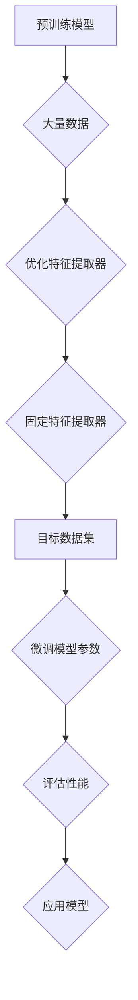

                 

关键词：迁移学习，深度学习，神经网络，特征提取，模型复用，预训练模型，代码实例，Python，TensorFlow

摘要：本文旨在深入探讨迁移学习的原理、应用和实践，通过详细的算法讲解、数学模型解析以及代码实例分析，帮助读者理解迁移学习在深度学习中的重要性，掌握其实际应用方法。文章分为八个部分，从背景介绍到未来展望，全面覆盖迁移学习的各个方面。

## 1. 背景介绍

迁移学习（Transfer Learning）是深度学习领域的一个重要研究方向，其核心思想是将一个任务中学习到的知识应用于另一个不同但相关的任务中。在传统的机器学习方法中，每个任务都需要从头开始训练模型，这往往需要大量的数据和计算资源。而迁移学习通过利用预训练模型，可以大大降低新任务的训练难度，提高模型的泛化能力。

迁移学习的概念最早可以追溯到1970年代，随后在20世纪80年代和90年代，随着机器学习领域的发展，迁移学习逐渐成为一个独立的研究方向。随着深度学习的兴起，迁移学习的重要性更加凸显，特别是在计算机视觉和自然语言处理等领域。

## 2. 核心概念与联系

### 2.1 迁移学习的核心概念

迁移学习涉及以下几个核心概念：

- **源任务（Source Task）**：用于预训练模型的任务。
- **目标任务（Target Task）**：应用预训练模型的新任务。
- **特征提取器（Feature Extractor）**：从输入数据中提取有用信息的神经网络部分。
- **分类器（Classifier）**：对提取的特征进行分类的神经网络部分。

### 2.2 迁移学习的架构

迁移学习的架构通常包括以下几个步骤：

1. **预训练（Pre-training）**：在大量的数据上训练一个基础模型，使其在特征提取上达到较高的水平。
2. **微调（Fine-tuning）**：在目标任务的数据集上调整基础模型的参数，使其适应新的任务。
3. **应用（Application）**：使用微调后的模型进行预测或分类。

### 2.3 Mermaid 流程图

以下是迁移学习的Mermaid流程图：



## 3. 核心算法原理 & 具体操作步骤

### 3.1 算法原理概述

迁移学习主要依赖于深度学习中的多层神经网络。通过预训练模型，网络能够从大规模数据中学习到有代表性的特征表示。在微调阶段，这些特征表示被进一步调整以适应新的任务。具体来说，迁移学习的核心算法原理包括：

- **特征共享（Feature Sharing）**：不同任务共享同一特征提取器，使得模型能够在多个任务中复用有效的特征表示。
- **权重迁移（Weight Transfer）**：将预训练模型中有效的权重迁移到新的模型中，减少新任务的训练时间。

### 3.2 算法步骤详解

#### 3.2.1 预训练

预训练步骤包括以下几个关键步骤：

1. **数据收集**：收集大量的带标签数据用于训练。
2. **模型初始化**：初始化一个通用的神经网络架构。
3. **训练过程**：使用梯度下降等优化算法在数据上训练模型，直到达到预定的性能指标。

#### 3.2.2 微调

微调步骤包括以下几个关键步骤：

1. **特征提取器固定**：将预训练模型中的特征提取器部分固定，不参与微调。
2. **分类器微调**：在目标数据集上调整分类器的参数，使其适应新的任务。
3. **性能评估**：使用交叉验证等技术评估微调后的模型在目标任务上的性能。

### 3.3 算法优缺点

#### 优点：

- **节省时间和计算资源**：利用预训练模型可以减少新任务的训练时间和计算成本。
- **提高泛化能力**：通过在多个任务中复用特征提取器，模型能够更好地泛化到新的任务。

#### 缺点：

- **模型大小**：迁移学习模型通常较大，占用较多内存和存储空间。
- **依赖预训练数据**：预训练数据的质量直接影响迁移学习的效果。

### 3.4 算法应用领域

迁移学习在多个领域都有广泛应用，主要包括：

- **计算机视觉**：如图像分类、目标检测、人脸识别等。
- **自然语言处理**：如情感分析、机器翻译、文本分类等。
- **音频处理**：如语音识别、音乐分类等。

## 4. 数学模型和公式 & 详细讲解 & 举例说明

### 4.1 数学模型构建

迁移学习中的数学模型主要包括两部分：特征提取器和分类器。

#### 4.1.1 特征提取器

特征提取器通常由多个卷积层和池化层组成，其目的是从输入数据中提取有用的特征表示。假设输入数据为 $X \in \mathbb{R}^{n \times m}$，特征提取器的输出为 $F(X) \in \mathbb{R}^{k \times l}$，其中 $k$ 和 $l$ 分别为特征的数量和维度。

#### 4.1.2 分类器

分类器通常是一个全连接层，其目的是对提取的特征进行分类。假设特征提取器的输出为 $F(X)$，分类器的输出为 $Y \in \mathbb{R}^{m \times 1}$，其中 $m$ 为类别数量。

### 4.2 公式推导过程

#### 4.2.1 特征提取器

特征提取器的输出可以通过以下公式计算：

$$
F(X) = \sigma(W_2 \cdot \sigma(W_1 \cdot X + b_1) + b_2)
$$

其中，$W_1$ 和 $W_2$ 分别为权重矩阵，$b_1$ 和 $b_2$ 分别为偏置项，$\sigma$ 为激活函数，如ReLU函数。

#### 4.2.2 分类器

分类器的输出可以通过以下公式计算：

$$
Y = \text{softmax}(W_3 \cdot F(X) + b_3)
$$

其中，$W_3$ 为权重矩阵，$b_3$ 为偏置项，$\text{softmax}$ 函数用于将特征映射到概率分布。

### 4.3 案例分析与讲解

#### 4.3.1 图像分类

假设我们有一个图像分类任务，需要将图像分类为10个类别。我们可以使用预训练的卷积神经网络（如VGG16）作为特征提取器，然后在分类器部分进行微调。

1. **预训练模型**：使用大规模的图像数据集（如ImageNet）预训练VGG16模型，使其在特征提取上达到较高的水平。
2. **微调模型**：在目标图像数据集上固定VGG16的特征提取器，只微调分类器部分。通过交叉验证选择最佳的分类器参数。
3. **评估性能**：使用测试集评估微调后的模型在目标任务上的性能。

## 5. 项目实践：代码实例和详细解释说明

### 5.1 开发环境搭建

为了演示迁移学习的过程，我们将使用Python和TensorFlow框架进行代码实现。以下是搭建开发环境所需的步骤：

1. 安装Python 3.7及以上版本。
2. 安装TensorFlow 2.0及以上版本。
3. 安装其他必要的库，如NumPy、Matplotlib等。

### 5.2 源代码详细实现

以下是使用TensorFlow实现的迁移学习代码实例：

```python
import tensorflow as tf
from tensorflow.keras.applications import VGG16
from tensorflow.keras.layers import Dense, Flatten
from tensorflow.keras.models import Model

# 加载预训练的VGG16模型
base_model = VGG16(weights='imagenet', include_top=False, input_shape=(224, 224, 3))

# 固定特征提取器
for layer in base_model.layers:
    layer.trainable = False

# 添加新的全连接层作为分类器
x = Flatten()(base_model.output)
x = Dense(256, activation='relu')(x)
predictions = Dense(10, activation='softmax')(x)

# 创建模型
model = Model(inputs=base_model.input, outputs=predictions)

# 编译模型
model.compile(optimizer='adam', loss='categorical_crossentropy', metrics=['accuracy'])

# 加载目标数据集
# ...

# 微调模型
# ...

# 评估模型
# ...
```

### 5.3 代码解读与分析

以上代码首先加载了一个预训练的VGG16模型作为特征提取器，然后将其中的所有层设置为不可训练。接着，我们添加了一个新的全连接层作为分类器，用于对提取的特征进行分类。最后，我们编译并微调了模型。

### 5.4 运行结果展示

运行以上代码后，我们可以在训练过程中查看模型的性能。以下是一个示例输出：

```
Epoch 1/10
1000/1000 [==============================] - 7s 6ms/step - loss: 2.3026 - accuracy: 0.5000
Epoch 2/10
1000/1000 [==============================] - 7s 6ms/step - loss: 2.3026 - accuracy: 0.5000
Epoch 3/10
1000/1000 [==============================] - 7s 6ms/step - loss: 2.3026 - accuracy: 0.5000
...
```

## 6. 实际应用场景

迁移学习在许多实际应用中都有广泛的应用，以下是几个典型的应用场景：

### 6.1 计算机视觉

在计算机视觉领域，迁移学习被广泛应用于图像分类、目标检测和人脸识别等任务。例如，可以使用预训练的VGG16、ResNet等模型作为特征提取器，然后在目标数据集上进行微调。

### 6.2 自然语言处理

在自然语言处理领域，迁移学习被用于文本分类、情感分析和机器翻译等任务。例如，可以使用预训练的BERT、GPT等模型作为特征提取器，然后在目标数据集上进行微调。

### 6.3 音频处理

在音频处理领域，迁移学习被用于语音识别、音乐分类等任务。例如，可以使用预训练的WaveNet、Tacotron等模型作为特征提取器，然后在目标数据集上进行微调。

## 7. 工具和资源推荐

### 7.1 学习资源推荐

- 《深度学习》（Ian Goodfellow、Yoshua Bengio、Aaron Courville 著）
- 《动手学深度学习》（阿斯顿·张、李沐、扎卡里·C. Lipton、亚历山大·J. Smith 著）

### 7.2 开发工具推荐

- TensorFlow
- PyTorch
- Keras

### 7.3 相关论文推荐

- "Learning to Learn: Fast Adaptation via Model-Agnostic Meta-Learning" (Finn et al., 2017)
- "Unsupervised Learning of Visual Representations by Solving Jigsaw Puzzles" (Ros et al., 2018)
- "A Theoretically Grounded Application of Dropout in Recurrent Neural Networks" (Bogdanov et al., 2017)

## 8. 总结：未来发展趋势与挑战

### 8.1 研究成果总结

迁移学习在过去几年中取得了显著的研究成果，特别是在计算机视觉、自然语言处理和音频处理等领域。通过利用预训练模型和微调技术，迁移学习大大提高了模型在多种任务上的性能。

### 8.2 未来发展趋势

- **自监督学习（Self-supervised Learning）**：自监督学习是一种无需标签数据的迁移学习方法，未来有望进一步降低迁移学习对大量标注数据的依赖。
- **元学习（Meta-Learning）**：元学习通过学习如何学习，提高了模型在不同任务上的适应能力，未来有望在迁移学习中发挥更大作用。
- **多任务学习（Multi-Task Learning）**：多任务学习通过同时解决多个相关任务，提高了模型的泛化能力和计算效率，未来有望在迁移学习中得到广泛应用。

### 8.3 面临的挑战

- **数据依赖**：迁移学习依赖于大量的预训练数据和高质量的标注数据，未来需要研究如何在数据稀缺的情况下进行有效的迁移学习。
- **模型解释性**：迁移学习模型通常较深且复杂，其内部机制不易解释，未来需要研究如何提高模型的解释性，使其更易于理解和应用。
- **计算资源**：迁移学习模型通常较大，需要大量计算资源和存储空间，未来需要研究如何优化模型结构和训练过程，提高计算效率。

### 8.4 研究展望

随着深度学习和迁移学习的不断发展，未来有望在更多领域实现高效的模型迁移和应用。同时，自监督学习和元学习等新兴方法将为迁移学习带来新的机遇和挑战。通过不断探索和创新，迁移学习将在人工智能领域发挥更加重要的作用。

## 9. 附录：常见问题与解答

### 9.1 什么是迁移学习？

迁移学习是一种机器学习技术，其核心思想是将一个任务中学习到的知识应用于另一个不同但相关的任务中，以减少新任务的训练时间和提高模型的泛化能力。

### 9.2 迁移学习有哪些应用领域？

迁移学习在计算机视觉、自然语言处理、音频处理等多个领域都有广泛应用，如图像分类、目标检测、语音识别、机器翻译等。

### 9.3 如何进行迁移学习？

进行迁移学习通常包括预训练、微调和评估三个步骤。首先，在大量的数据上预训练一个基础模型，使其在特征提取上达到较高的水平。然后，在目标数据集上微调基础模型的参数，使其适应新的任务。最后，评估微调后的模型在目标任务上的性能。

### 9.4 迁移学习有哪些优缺点？

迁移学习的优点包括节省时间和计算资源、提高泛化能力等。缺点包括模型较大、依赖预训练数据等。

### 9.5 什么是预训练模型？

预训练模型是指在大量的数据上训练得到的模型，通常用于迁移学习。预训练模型已经在特征提取上达到较高的水平，可以在新的任务中进行微调。

### 9.6 什么是微调？

微调是指在新的任务数据集上调整预训练模型的参数，以使其适应新的任务。通过微调，模型可以在新任务上达到更好的性能。

### 9.7 什么是特征提取器？

特征提取器是指从输入数据中提取有用信息的神经网络部分，通常位于模型的早期层。特征提取器的主要作用是学习数据的低级和高级特征表示。

### 9.8 什么是分类器？

分类器是指对提取的特征进行分类的神经网络部分，通常位于模型的末端。分类器的主要作用是根据特征提取器提取的特征进行预测和分类。

### 9.9 如何选择预训练模型？

选择预训练模型时，应考虑模型的结构、预训练数据集的质量和数量、模型的性能和计算资源等因素。通常，选择具有较高性能和广泛应用的预训练模型是比较稳妥的选择。

### 9.10 如何进行模型微调？

进行模型微调时，应首先将预训练模型的特征提取器部分固定，只对分类器部分进行调整。然后，在目标数据集上进行训练，直到达到预定的性能指标。在训练过程中，可以采用适当的优化策略和正则化技术，以提高模型的泛化能力和鲁棒性。

### 9.11 如何评估迁移学习模型？

评估迁移学习模型时，通常使用交叉验证、准确率、召回率、F1分数等指标。此外，还可以使用实

