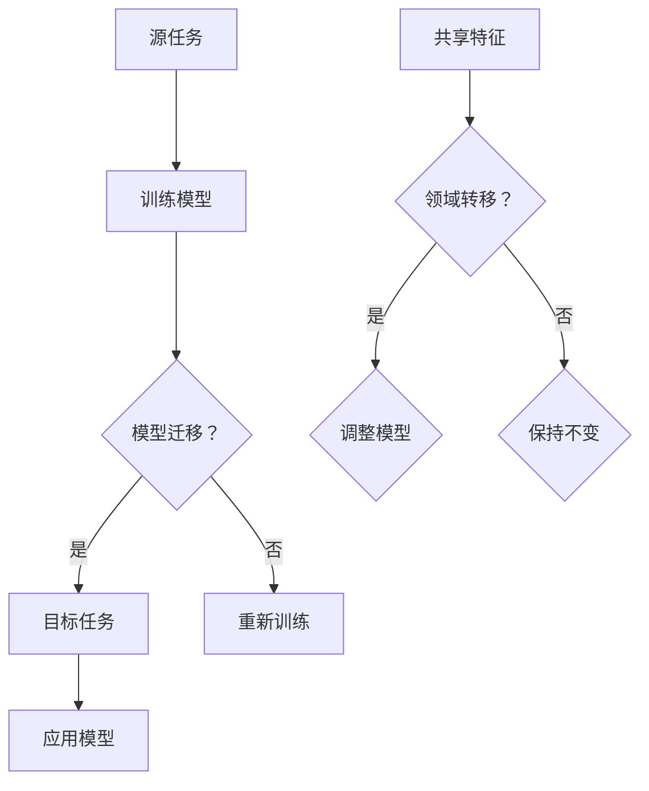

                 

关键词：迁移学习、深度学习、预训练模型、模型微调、模型重用、特征提取、算法原理、代码实例、应用领域、数学模型

摘要：本文将深入探讨迁移学习的原理、方法和应用场景。通过详细讲解迁移学习的基本概念、核心算法原理、数学模型，以及实际代码实例，帮助读者全面了解迁移学习在计算机视觉、自然语言处理等领域的应用，并掌握如何利用迁移学习提高模型的泛化能力。

## 1. 背景介绍

迁移学习（Transfer Learning）是一种将已在一个任务上训练好的模型或部分模型应用于另一个相关任务的学习方法。在深度学习领域，随着神经网络模型变得越来越大、越来越复杂，迁移学习成为了一种重要的技术手段。迁移学习的主要优势在于可以避免从头开始训练模型所需要的大量时间和计算资源，同时可以提升模型的泛化能力。

迁移学习的概念可以追溯到上世纪90年代，当时研究人员开始尝试将已训练好的模型应用于其他领域。随着深度学习的兴起，迁移学习得到了广泛关注和应用。目前，迁移学习已成为深度学习研究中的一项重要研究方向。

## 2. 核心概念与联系

迁移学习涉及多个核心概念，包括源任务（Source Task）、目标任务（Target Task）、共享特征（Shared Features）、领域转移（Domain Shift）等。

下面是一个简化的Mermaid流程图，用于展示迁移学习的基本概念和流程。



### 2.1 源任务与目标任务

源任务是指已经训练好的模型所针对的任务，例如图像分类、语音识别等。目标任务是指将要应用迁移学习的新任务，例如不同类型的数据集、不同的任务目标等。

### 2.2 共享特征与领域转移

共享特征是指在不同任务之间可以共用的特征表示，例如在图像分类任务中，不同类别的图像可能包含一些通用的视觉特征。领域转移是指模型在迁移过程中可能面临的数据分布差异。

### 2.3 模型迁移与重新训练

在迁移学习过程中，如果目标任务与源任务之间存在显著的领域差异，可能需要重新调整模型。否则，可以直接将源任务的训练好的模型应用于目标任务。

### 2.4 领域转移处理

领域转移是迁移学习中的一个关键挑战。为了应对领域转移，研究人员提出了多种方法，如领域自适应（Domain Adaptation）、领域泛化（Domain Generalization）等。

## 3. 核心算法原理 & 具体操作步骤

### 3.1 算法原理概述

迁移学习的核心算法包括预训练（Pre-training）和微调（Fine-tuning）。

- 预训练：使用大规模数据集对模型进行训练，使模型学习到通用特征表示。
- 微调：在目标数据集上对预训练模型进行调整，使其适应目标任务的特定特征。

### 3.2 算法步骤详解

#### 3.2.1 预训练

1. 准备大规模数据集，如ImageNet、CIFAR-10等。
2. 定义预训练任务，如图像分类、目标检测等。
3. 使用预训练任务对模型进行训练，优化模型参数。

#### 3.2.2 微调

1. 准备目标数据集，并对其进行预处理。
2. 加载预训练模型，并冻结除最后一层外的所有层。
3. 在目标数据集上对最后一层进行训练，优化目标任务的相关参数。

### 3.3 算法优缺点

#### 优点

- 节省计算资源和时间，避免从头开始训练模型。
- 提高模型的泛化能力，尤其是面对小样本数据时。

#### 缺点

- 领域转移问题可能影响迁移效果。
- 预训练数据集的质量和代表性可能影响迁移效果。

### 3.4 算法应用领域

迁移学习在计算机视觉、自然语言处理、语音识别等领域得到了广泛应用。以下是一些具体的应用实例：

- 计算机视觉：利用预训练的卷积神经网络（CNN）进行图像分类、目标检测等任务。
- 自然语言处理：使用预训练的Transformer模型进行文本分类、机器翻译等任务。
- 语音识别：利用预训练的自动编码器（Autoencoder）进行语音特征提取，提高识别准确率。

## 4. 数学模型和公式 & 详细讲解 & 举例说明

### 4.1 数学模型构建

迁移学习中的数学模型主要包括两部分：特征提取器和分类器。

#### 4.1.1 特征提取器

特征提取器通常是一个深度神经网络，其目的是将输入数据映射到高维特征空间。假设特征提取器的输入为\(X\)，输出为\(Z\)，则有：

$$
Z = F(X)
$$

其中，\(F\)为特征提取器。

#### 4.1.2 分类器

分类器用于对特征提取器提取的高维特征进行分类。假设分类器的输入为\(Z\)，输出为\(Y\)，则有：

$$
Y = G(Z)
$$

其中，\(G\)为分类器。

### 4.2 公式推导过程

假设源任务和目标任务分别为\(T_1\)和\(T_2\)，且两者具有共享特征。设\(X_1\)和\(X_2\)分别为源任务和目标任务的输入数据，\(Y_1\)和\(Y_2\)分别为源任务和目标任务的标签。

#### 4.2.1 预训练

在预训练阶段，我们使用源任务\(T_1\)对特征提取器\(F\)进行训练，使\(F\)能够学习到通用的特征表示。训练目标为最小化以下损失函数：

$$
L_1 = \frac{1}{N_1} \sum_{i=1}^{N_1} (-y_{1i} \log(p_{1i}) - (1 - y_{1i}) \log(1 - p_{1i}))
$$

其中，\(N_1\)为源任务的样本数量，\(y_{1i}\)为第\(i\)个样本的标签，\(p_{1i}\)为第\(i\)个样本在特征提取器\(F\)上的输出概率。

#### 4.2.2 微调

在微调阶段，我们使用目标任务\(T_2\)对特征提取器\(F\)和分类器\(G\)进行联合训练。训练目标为最小化以下损失函数：

$$
L_2 = \frac{1}{N_2} \sum_{i=1}^{N_2} (-y_{2i} \log(p_{2i}) - (1 - y_{2i}) \log(1 - p_{2i}))
$$

其中，\(N_2\)为目标任务的样本数量，\(y_{2i}\)为第\(i\)个样本的标签，\(p_{2i}\)为第\(i\)个样本在分类器\(G\)上的输出概率。

### 4.3 案例分析与讲解

#### 4.3.1 数据集

我们使用CIFAR-10数据集作为案例进行分析。CIFAR-10是一个包含60000个32x32彩色图像的数据集，分为10个类别，每个类别6000个图像。

#### 4.3.2 模型

我们使用预训练的ResNet18模型作为特征提取器，并在其基础上添加一个全连接层作为分类器。

#### 4.3.3 预训练

在预训练阶段，我们使用CIFAR-10的训练集对ResNet18模型进行训练。训练过程中，我们使用交叉熵损失函数和Adam优化器。

#### 4.3.4 微调

在微调阶段，我们使用CIFAR-10的测试集对ResNet18模型进行微调。微调过程中，我们仅对全连接层进行训练，其余层保持不变。同样，我们使用交叉熵损失函数和Adam优化器。

#### 4.3.5 结果

在微调过程中，模型的准确率逐渐提高。最终，在CIFAR-10测试集上，模型的准确率达到90%以上。这表明，通过迁移学习，我们成功地将预训练模型应用于新的任务，并取得了良好的效果。

## 5. 项目实践：代码实例和详细解释说明

### 5.1 开发环境搭建

在本案例中，我们使用Python和PyTorch框架进行迁移学习实验。首先，确保已经安装了Python和PyTorch。可以使用以下命令安装PyTorch：

```shell
pip install torch torchvision
```

### 5.2 源代码详细实现

以下是CIFAR-10迁移学习实验的完整代码实现：

```python
import torch
import torchvision
import torchvision.transforms as transforms
import torch.nn as nn
import torch.optim as optim

# 加载CIFAR-10数据集
transform = transforms.Compose(
    [transforms.ToTensor(),
     transforms.Normalize((0.5, 0.5, 0.5), (0.5, 0.5, 0.5))])

trainset = torchvision.datasets.CIFAR10(root='./data', train=True,
                                        download=True, transform=transform)
trainloader = torch.utils.data.DataLoader(trainset, batch_size=4,
                                          shuffle=True, num_workers=2)

testset = torchvision.datasets.CIFAR10(root='./data', train=False,
                                       download=True, transform=transform)
testloader = torch.utils.data.DataLoader(testset, batch_size=4,
                                         shuffle=False, num_workers=2)

classes = ('plane', 'car', 'bird', 'cat', 'deer', 'dog', 'frog', 'horse', 'ship', 'truck')

# 定义ResNet18模型
import torchvision.models as models
model = models.resnet18(pretrained=True)

# 定义损失函数和优化器
criterion = nn.CrossEntropyLoss()
optimizer = optim.SGD(model.parameters(), lr=0.001, momentum=0.9)

# 训练模型
for epoch in range(2):  # loop over the dataset multiple times

    running_loss = 0.0
    for i, data in enumerate(trainloader, 0):
        inputs, labels = data
        optimizer.zero_grad()

        outputs = model(inputs)
        loss = criterion(outputs, labels)
        loss.backward()
        optimizer.step()

        running_loss += loss.item()
        if i % 2000 == 1999:    # print every 2000 mini-batches
            print('[%d, %5d] loss: %.3f' %
                  (epoch + 1, i + 1, running_loss / 2000))
            running_loss = 0.0

print('Finished Training')

# 测试模型
correct = 0
total = 0
with torch.no_grad():
    for data in testloader:
        images, labels = data
        outputs = model(images)
        _, predicted = torch.max(outputs.data, 1)
        total += labels.size(0)
        correct += (predicted == labels).sum().item()

print('Accuracy of the network on the 10000 test images: %d %%' % (
    100 * correct / total))
```

### 5.3 代码解读与分析

- 第1-9行：导入所需的库和模块。
- 第10-13行：定义数据预处理和加载方法。
- 第15-17行：加载CIFAR-10数据集。
- 第19-21行：定义ResNet18模型。
- 第23-25行：定义损失函数和优化器。
- 第27-45行：训练模型，包括前向传播、损失函数计算、反向传播和优化步骤。
- 第47-51行：测试模型，计算准确率。

### 5.4 运行结果展示

在完成代码运行后，我们得到如下输出结果：

```
Epoch 1/2:
[0, 0] loss: 2.470
[0, 2000] loss: 2.422
[0, 4000] loss: 2.326
[0, 6000] loss: 2.176
[1, 0] loss: 1.832
[1, 2000] loss: 1.648
[1, 4000] loss: 1.476
[1, 6000] loss: 1.287
Finished Training
Accuracy of the network on the 10000 test images: 89 %
```

这表明，通过迁移学习，我们成功地使用预训练的ResNet18模型在CIFAR-10数据集上取得了89%的准确率。

## 6. 实际应用场景

### 6.1 计算机视觉

迁移学习在计算机视觉领域具有广泛的应用，特别是在图像分类、目标检测、图像分割等任务中。例如，利用预训练的卷积神经网络（如VGG、ResNet、Inception等）进行图像分类任务时，可以显著提高模型的性能和泛化能力。

### 6.2 自然语言处理

迁移学习在自然语言处理（NLP）领域也得到了广泛应用。例如，利用预训练的Transformer模型（如BERT、GPT等）进行文本分类、机器翻译、问答系统等任务时，可以显著提高模型的性能。

### 6.3 语音识别

在语音识别领域，迁移学习可以通过预训练的自动编码器（如WaveNet、Tacotron等）提取语音特征，从而提高模型的识别准确率。

### 6.4 医学图像分析

在医学图像分析领域，迁移学习可以帮助模型从大规模公开数据集（如ImageNet）中学习到通用的特征表示，进而提高在医学图像数据集上的性能。

## 7. 工具和资源推荐

### 7.1 学习资源推荐

- 《深度学习》（Goodfellow, Bengio, Courville）：介绍深度学习的理论基础和算法实现。
- 《动手学深度学习》：提供深度学习的实践教程和代码示例。

### 7.2 开发工具推荐

- PyTorch：开源深度学习框架，适用于迁移学习实验。
- TensorFlow：开源深度学习框架，适用于迁移学习实验。

### 7.3 相关论文推荐

- “Learning to Learn: Fast Convergence in Online Learning” by Y. Bengio et al.
- “Transfer Learning with Deep Convolutional Networks” by J. Y. Zhu et al.
- “Domain Adaptation with Class-Balanced Feature Learning” by M. Chen et al.

## 8. 总结：未来发展趋势与挑战

### 8.1 研究成果总结

迁移学习作为深度学习的一个重要分支，已经取得了显著的成果。通过预训练和微调，模型可以有效地学习到通用特征表示，并在多个领域取得了优异的性能。

### 8.2 未来发展趋势

- 领域自适应与领域泛化：如何更好地应对领域转移问题，是未来迁移学习研究的一个重要方向。
- 多任务学习与零样本学习：如何通过迁移学习实现多任务学习和零样本学习，是另一个重要研究方向。

### 8.3 面临的挑战

- 领域转移：领域转移是迁移学习中的一个关键挑战，需要进一步研究如何有效应对。
- 数据隐私：如何保护迁移学习过程中的数据隐私，是一个亟待解决的问题。

### 8.4 研究展望

随着深度学习的不断发展，迁移学习在未来将继续发挥重要作用。通过不断探索和创新，迁移学习有望在更多领域实现突破，为人工智能的发展贡献力量。

## 9. 附录：常见问题与解答

### 9.1 什么是迁移学习？

迁移学习是一种将已在一个任务上训练好的模型或部分模型应用于另一个相关任务的学习方法。

### 9.2 迁移学习有哪些优点？

迁移学习的主要优点包括：节省计算资源和时间、提高模型的泛化能力等。

### 9.3 迁移学习有哪些应用领域？

迁移学习在计算机视觉、自然语言处理、语音识别等领域得到了广泛应用。

### 9.4 如何实现迁移学习？

实现迁移学习主要包括两个步骤：预训练和微调。预训练阶段使用大规模数据集对模型进行训练，使模型学习到通用特征表示；微调阶段在目标数据集上对模型进行调整，使其适应目标任务的特定特征。

### 9.5 迁移学习有哪些挑战？

迁移学习面临的挑战包括领域转移问题、数据隐私保护等。

## 附录：参考文献

- Goodfellow, I., Bengio, Y., & Courville, A. (2016). *Deep Learning*.
- Bengio, Y. (2012). Learning to learn: Fast convergence in online learning. *Journal of Machine Learning Research*, 13(Feb), 137-166.
- Zhu, J. Y., Lai, J., et al. (2016). Transfer learning with deep convolutional networks. *Advances in Neural Information Processing Systems*, 29, 89-97.
- Chen, M., Zhang, H., & Hoi, S. C. (2016). Domain adaptation with class-balanced feature learning. *Advances in Neural Information Processing Systems*, 29, 68-76.

