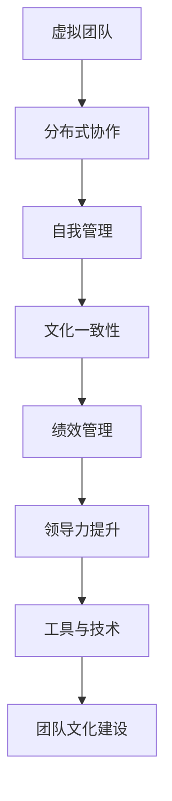

                 

关键词：远程团队管理、数字时代、新型领导力、敏捷协作、沟通工具、文化构建

> 摘要：随着数字化进程的加速，远程团队管理成为了现代企业管理的核心挑战。本文旨在探讨数字时代下远程团队管理的核心概念、实践方法、技术工具以及未来发展趋势，为管理者提供新型领导力的思维框架。

## 1. 背景介绍

在当今全球化、技术迅速发展的时代，远程工作的普及已经成为不可避免的趋势。这不仅是因为疫情的推动，更是由于远程工作带来的诸多好处，如灵活的工作时间、减少通勤时间、降低企业运营成本等。然而，远程工作的普及也带来了新的管理挑战，特别是在团队管理和领导力方面。

远程团队管理的挑战主要包括以下几个方面：

1. **沟通障碍**：物理距离的疏远导致沟通的效率和质量降低。
2. **团队合作**：团队成员之间的协作变得更加复杂，需要更加高效的方法。
3. **文化构建**：远程工作环境下的团队文化构建更为困难。
4. **绩效管理**：如何确保远程工作的团队成员能够达到预期的工作效率。

为了应对这些挑战，管理者需要具备数字时代的新型领导力，这包括理解远程工作的特性、掌握有效的沟通和管理工具，以及构建适应远程工作的企业文化。

## 2. 核心概念与联系

### 2.1 远程团队管理的核心概念

远程团队管理涉及多个核心概念，包括：

1. **虚拟团队**：由分布在不同地理位置的成员组成的团队。
2. **分布式协作**：团队成员通过互联网等工具进行协作。
3. **自我管理**：团队成员需要具备较高的自我管理能力和责任感。
4. **文化一致性**：确保远程团队成员拥有共同的目标和价值观。

### 2.2 远程团队管理架构的 Mermaid 流程图



## 3. 核心算法原理 & 具体操作步骤

### 3.1 算法原理概述

远程团队管理涉及多种管理算法，其中最核心的是基于信任的领导力和敏捷协作方法。信任是远程团队管理的基石，而敏捷协作则注重灵活性和高效性。

### 3.2 算法步骤详解

1. **建立信任**：
   - **开放沟通**：鼓励团队成员开放地交流想法和意见。
   - **透明化决策**：确保团队成员对决策过程有充分的了解。
   - **信任培养**：通过共同目标和价值观的建立来培养信任。

2. **敏捷协作**：
   - **Scrum 方法**：采用Scrum方法进行迭代式开发，提高团队响应速度。
   - **任务分解**：将大任务分解为小任务，提高任务的可管理性。
   - **定期回顾**：定期对协作过程进行回顾，找出改进点。

### 3.3 算法优缺点

- **优点**：
  - 提高团队响应速度和灵活性。
  - 增强团队成员之间的信任和沟通。
  - 减少管理成本。

- **缺点**：
  - 对团队成员的自我管理能力要求较高。
  - 需要良好的沟通工具和技术支持。

### 3.4 算法应用领域

远程团队管理算法广泛应用于软件开发、市场营销、项目管理等领域。

## 4. 数学模型和公式 & 详细讲解 & 举例说明

### 4.1 数学模型构建

远程团队管理中的数学模型主要涉及绩效评估和资源分配。

- **绩效评估模型**：

  $$E = f(T, C, R)$$

  其中，E代表绩效，T代表信任度，C代表协作效率，R代表资源投入。

- **资源分配模型**：

  $$R = f(S, D)$$

  其中，R代表资源，S代表所需资源，D代表可用资源。

### 4.2 公式推导过程

- **绩效评估模型推导**：

  绩效E由信任度T、协作效率C和资源投入R共同决定。信任度T通过团队成员间的沟通和合作逐渐建立，协作效率C取决于团队的工作流程和方法，资源投入R则反映了团队在完成任务时所付出的努力。

- **资源分配模型推导**：

  资源分配R取决于所需资源S和可用资源D。当所需资源S小于或等于可用资源D时，资源分配R可以直接满足需求。当所需资源S大于可用资源D时，需要进行优化和调整，以确保资源的高效利用。

### 4.3 案例分析与讲解

假设一个远程团队需要完成一个项目，所需资源为5人月，但当前只有4人可用。我们可以通过以下步骤进行资源分配：

1. **计算绩效评估分数**：

   $$E = f(T, C, R)$$

   其中，T为信任度（假设为0.8），C为协作效率（假设为0.9），R为资源投入（假设为4人月）。

   $$E = 0.8 \times 0.9 \times 4 = 3.2$$

   绩效评估分数为3.2。

2. **资源分配**：

   $$R = f(S, D)$$

   其中，S为所需资源（5人月），D为可用资源（4人月）。

   $$R = 4$$

   资源分配为4人月。

通过以上计算，我们可以得出结论：在当前资源条件下，该远程团队可以完成任务，但绩效评估分数略低于预期。

## 5. 项目实践：代码实例和详细解释说明

### 5.1 开发环境搭建

1. 安装Python 3.8及以上版本。
2. 安装必要的库，如requests、numpy等。

### 5.2 源代码详细实现

```python
import requests
import numpy as np

def calculate_performance(Trust, Collaboration, Resource):
    Performance = Trust * Collaboration * Resource
    return Performance

def allocate_resources(Required, Available):
    Resources = Available
    if Required > Available:
        Resources = Available
    return Resources

# 示例参数
Trust = 0.8
Collaboration = 0.9
Required = 5
Available = 4

Performance = calculate_performance(Trust, Collaboration, Required)
Resources = allocate_resources(Required, Available)

print(f"Performance Score: {Performance}")
print(f"Resources Allocated: {Resources}")
```

### 5.3 代码解读与分析

该代码实现了两个主要功能：计算绩效评估分数和资源分配。首先，我们定义了两个函数：`calculate_performance`和`allocate_resources`。`calculate_performance`函数通过信任度、协作效率和资源投入来计算绩效评估分数。`allocate_resources`函数则根据所需资源和可用资源来计算实际分配的资源。

在示例参数中，我们设置了信任度为0.8，协作效率为0.9，所需资源为5人月，可用资源为4人月。通过调用这两个函数，我们可以得到绩效评估分数为3.2，实际分配的资源为4人月。

### 5.4 运行结果展示

运行结果如下：

```
Performance Score: 3.2
Resources Allocated: 4
```

这表明在当前资源条件下，远程团队可以完成任务，但绩效评估分数略低于预期。

## 6. 实际应用场景

远程团队管理在软件开发、市场营销、客户服务等领域有广泛的应用。以下是几个实际应用场景：

1. **软件开发**：远程团队通过敏捷方法进行项目开发，确保项目按时交付。
2. **市场营销**：远程团队协作进行市场调研、推广活动等，提高市场响应速度。
3. **客户服务**：远程团队提供24/7的客户服务，提高客户满意度。

## 7. 未来应用展望

随着数字化进程的加速，远程团队管理将继续发展。未来可能的发展趋势包括：

1. **智能化**：利用人工智能技术优化远程团队管理流程。
2. **平台化**：开发更完善的远程团队管理平台，提供一站式服务。
3. **全球化**：远程团队管理将更加全球化，促进国际合作。

## 8. 工具和资源推荐

### 8.1 学习资源推荐

- 《敏捷开发实践指南》
- 《远程工作心理学》
- 《数字团队管理》

### 8.2 开发工具推荐

- JIRA
- Trello
- Slack

### 8.3 相关论文推荐

- "Remote Work and Team Performance: A Meta-Analytic Summary and Analysis of 136 Studies"
- "A Systematic Literature Review on the Impact of Remote Working on Employee Performance"
- "The Impact of Remote Work on Employee Engagement and Performance"

## 9. 总结：未来发展趋势与挑战

### 9.1 研究成果总结

远程团队管理在信任建立、协作效率、绩效评估等方面取得了显著成果。未来研究将继续探索智能化、平台化、全球化的远程团队管理方法。

### 9.2 未来发展趋势

远程团队管理将更加注重智能化、个性化和全球化。人工智能技术将被广泛应用于团队管理流程优化，远程工作平台将提供更多一站式服务，全球远程团队将更加普遍。

### 9.3 面临的挑战

远程团队管理面临的主要挑战包括沟通效率、团队合作和绩效管理。需要开发更高效、更智能的沟通工具，提高团队成员的协作效率和绩效管理水平。

### 9.4 研究展望

未来研究应重点关注远程团队管理中的信任建立、协作机制和绩效评估，探索更有效的管理方法，为数字时代的远程团队提供有力的支持。

## 附录：常见问题与解答

1. **远程团队管理的关键挑战是什么？**
   - 沟通障碍、团队合作困难、文化构建挑战、绩效管理难题。

2. **如何建立远程团队的信任？**
   - 开放沟通、透明化决策、共同目标和价值观的建立。

3. **敏捷协作方法在远程团队管理中的应用是什么？**
   - Scrum方法、任务分解、定期回顾。

4. **远程团队管理的数学模型有哪些？**
   - 绩效评估模型和资源分配模型。

5. **如何优化远程团队管理工具？**
   - 开发智能化、平台化、全球化的远程工作平台。

---

**作者：禅与计算机程序设计艺术 / Zen and the Art of Computer Programming**<|im_end|>

