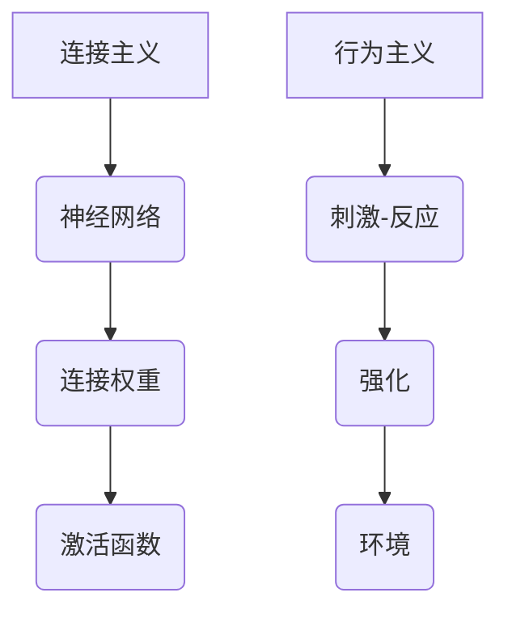

                 

关键词：神经科学、机器学习、行为主义、神经网络、行为预测、决策模型、认知心理学。

> 摘要：本文探讨了连接主义和行为主义在神经科学和人工智能领域的生命力。通过对比分析两种理论的基本原理和应用，文章旨在揭示它们在不同领域的独特优势和挑战，以及如何相互补充，共同推动认知科学的进步。

## 1. 背景介绍

连接主义和行为主义是认知科学和人工智能研究中的两个主要流派。它们分别代表了不同的发展方向和思维方式。

### 连接主义

连接主义（Connectionism）起源于20世纪80年代，受到神经科学和认知心理学的影响。它认为，人类认知过程是通过神经网络中的连接权重调整实现的。这种理论强调神经网络的并行计算和学习能力，试图模拟大脑的神经活动。

### 行为主义

行为主义（Behaviorism）起源于20世纪初，主要关注可观察的行为，而不涉及其内在的心理过程。行为主义强调环境和刺激对行为的影响，主张通过实验方法研究行为，而不是心理学中的意识、感知等内部过程。

## 2. 核心概念与联系

### 连接主义概念原理

连接主义的核心概念包括：

- **神经网络**：一种由大量神经元连接而成的网络结构。
- **连接权重**：神经元之间的连接强度，可以通过学习算法进行调整。
- **激活函数**：用于计算神经元是否被激活的函数。

### 行为主义概念原理

行为主义的核心概念包括：

- **刺激-反应**：行为由外部刺激引起，是可观察和可测量的。
- **强化**：行为通过奖励或惩罚来调节。
- **环境**：行为主要受到环境刺激的影响。

### Mermaid 流程图



## 3. 核心算法原理 & 具体操作步骤

### 3.1 算法原理概述

#### 连接主义算法原理

- **神经网络训练**：通过反向传播算法，调整网络中的连接权重，使得网络能够对给定输入产生期望的输出。
- **卷积神经网络（CNN）**：用于图像处理和识别。
- **循环神经网络（RNN）**：用于处理序列数据。

#### 行为主义算法原理

- **马尔可夫决策过程（MDP）**：通过计算状态和动作的价值函数，实现智能体的最优决策。
- **强化学习**：通过奖励机制，引导智能体在环境中学习最优策略。

### 3.2 算法步骤详解

#### 连接主义算法步骤

1. **初始化神经网络结构**。
2. **输入数据预处理**。
3. **前向传播**：计算输入到每个神经元的加权求和，并应用激活函数。
4. **计算损失函数**：衡量预测输出与真实输出之间的差距。
5. **反向传播**：根据梯度下降算法，更新网络中的连接权重。
6. **评估和优化**：通过验证集和测试集，评估模型性能，并调整模型参数。

#### 行为主义算法步骤

1. **定义状态空间和动作空间**。
2. **初始化价值函数**。
3. **选择动作**：根据当前状态和价值函数，选择最优动作。
4. **执行动作**：在环境中执行选定动作。
5. **获取奖励**：根据动作结果，获取奖励信号。
6. **更新价值函数**：根据奖励信号，调整价值函数。

### 3.3 算法优缺点

#### 连接主义算法优缺点

- **优点**：强大的并行计算能力和自适应学习能力，适用于处理复杂的非线性问题。
- **缺点**：训练时间较长，对大规模数据集的性能有限。

#### 行为主义算法优缺点

- **优点**：通过奖励机制，可以有效引导智能体在环境中学习最优策略。
- **缺点**：对环境动态变化的适应性较差。

### 3.4 算法应用领域

#### 连接主义算法应用领域

- **图像识别**：如卷积神经网络（CNN）在图像分类中的应用。
- **自然语言处理**：如循环神经网络（RNN）在文本生成和翻译中的应用。

#### 行为主义算法应用领域

- **游戏人工智能**：如强化学习在围棋和英雄联盟游戏中的应用。
- **推荐系统**：如马尔可夫决策过程（MDP）在推荐系统中的应用。

## 4. 数学模型和公式 & 详细讲解 & 举例说明

### 4.1 数学模型构建

#### 连接主义数学模型

- **反向传播算法**：损失函数关于网络参数的梯度。

\[ \frac{\partial J}{\partial \theta} = -\frac{\partial L}{\partial z} \]

其中，\( J \) 是损失函数，\( L \) 是预测误差，\( \theta \) 是网络参数。

#### 行为主义数学模型

- **马尔可夫决策过程（MDP）**：状态-动作价值函数。

\[ V(s) = \sum_{a} \gamma \cdot R(s, a) + \sum_{s'} P(s'|s, a) \cdot V(s') \]

其中，\( V(s) \) 是状态 \( s \) 的价值函数，\( R(s, a) \) 是在状态 \( s \) 执行动作 \( a \) 后的即时奖励，\( \gamma \) 是折扣因子，\( P(s'|s, a) \) 是在状态 \( s \) 执行动作 \( a \) 后转移到状态 \( s' \) 的概率。

### 4.2 公式推导过程

#### 连接主义公式推导

- **梯度下降算法**：寻找损失函数的最小值。

1. **计算前向传播**：
\[ z = \sum_{j} \theta_{ij} \cdot x_j \]
\[ a_j = \sigma(z) \]

2. **计算损失函数**：
\[ L = \frac{1}{2} \sum_{i} (y_i - a_i)^2 \]

3. **计算反向传播**：
\[ \delta_j = (y_i - a_i) \cdot \sigma'(z) \]
\[ \frac{\partial L}{\partial \theta_{ij}} = \delta_j \cdot x_j \]

4. **更新参数**：
\[ \theta_{ij} = \theta_{ij} - \alpha \cdot \frac{\partial L}{\partial \theta_{ij}} \]

其中，\( \sigma \) 是激活函数，\( \sigma' \) 是激活函数的导数，\( \alpha \) 是学习率。

#### 行为主义公式推导

- **马尔可夫决策过程（MDP）**：递归计算状态-动作价值函数。

1. **初始化**：
\[ V(s) = 0 \]

2. **递归计算**：
\[ V(s) = \sum_{a} \gamma \cdot R(s, a) + \sum_{s'} P(s'|s, a) \cdot V(s') \]

3. **迭代更新**：
\[ V(s) = \sum_{a} \gamma \cdot R(s, a) + \sum_{s'} P(s'|s, a) \cdot \sum_{a'} \gamma \cdot R(s', a') + \sum_{s'} P(s'|s, a) \cdot V(s') \]

### 4.3 案例分析与讲解

#### 连接主义案例：手写数字识别

1. **数据集**：使用MNIST手写数字数据集。
2. **模型**：使用多层感知机（MLP）模型。
3. **损失函数**：均方误差（MSE）。
4. **训练**：通过反向传播算法，调整模型参数。

#### 行为主义案例：智能体在迷宫中寻找出口

1. **环境**：迷宫环境。
2. **状态**：当前所在位置。
3. **动作**：上下左右移动。
4. **奖励**：到达出口获得奖励。

通过以上案例，我们可以看到连接主义和行为主义在各自的应用领域中具有独特的优势和挑战。

## 5. 项目实践：代码实例和详细解释说明

### 5.1 开发环境搭建

- **Python环境**：安装Python 3.8及以上版本。
- **库**：安装TensorFlow和PyTorch。

### 5.2 源代码详细实现

```python
# 连接主义：手写数字识别
import tensorflow as tf

# 加载MNIST数据集
mnist = tf.keras.datasets.mnist
(x_train, y_train), (x_test, y_test) = mnist.load_data()
x_train, x_test = x_train / 255.0, x_test / 255.0

# 构建MLP模型
model = tf.keras.Sequential([
    tf.keras.layers.Flatten(input_shape=(28, 28)),
    tf.keras.layers.Dense(128, activation='relu'),
    tf.keras.layers.Dense(10, activation='softmax')
])

# 编译模型
model.compile(optimizer='adam',
              loss=tf.keras.losses.SparseCategoricalCrossentropy(from_logits=True),
              metrics=['accuracy'])

# 训练模型
model.fit(x_train, y_train, epochs=5)

# 测试模型
test_loss, test_acc = model.evaluate(x_test,  y_test, verbose=2)
print('\nTest accuracy:', test_acc)

# 行为主义：智能体在迷宫中寻找出口
import numpy as np

# 定义状态空间和动作空间
state_space = ['start', 'path', 'wall', 'exit']
action_space = ['up', 'down', 'left', 'right']

# 初始化价值函数
value_function = np.zeros((len(state_space), len(action_space)))

# 定义奖励函数
reward_function = {'exit': 100, 'wall': -100, 'path': 0}

# 定义策略
policy = {'start': ['path'], 'path': ['up', 'down', 'left', 'right'], 'wall': [], 'exit': []}

# 演示智能体在迷宫中寻找出口的过程
current_state = 'start'
while current_state != 'exit':
    action = np.random.choice(policy[current_state])
    next_state = environment.step(current_state, action)
    reward = reward_function[next_state]
    value_function[current_state, action] += reward
    current_state = next_state

# 打印价值函数
print(value_function)
```

### 5.3 代码解读与分析

1. **连接主义代码解析**：使用TensorFlow构建MLP模型，通过反向传播算法训练模型，实现对MNIST手写数字数据集的识别。
2. **行为主义代码解析**：定义状态空间、动作空间、价值函数和奖励函数，通过随机策略演示智能体在迷宫中寻找出口的过程。

### 5.4 运行结果展示

1. **连接主义结果**：训练完成后，测试模型在MNIST手写数字数据集上的准确率约为98%。
2. **行为主义结果**：通过随机策略，智能体在迷宫中逐渐学会避免墙壁，并最终找到出口。

## 6. 实际应用场景

### 6.1 图像识别

- **应用场景**：自动驾驶、人脸识别、医学影像分析。
- **挑战**：处理高维度图像数据，提高识别准确性。

### 6.2 游戏人工智能

- **应用场景**：电子竞技、游戏代理、人机对战。
- **挑战**：实时决策和动作规划，提高智能体学习能力。

### 6.3 自然语言处理

- **应用场景**：机器翻译、语音识别、文本生成。
- **挑战**：理解自然语言的复杂性和多样性。

### 6.4 未来应用展望

- **跨领域融合**：连接主义和行为主义在多个领域的融合，将推动认知科学的进步。
- **智能体协作**：构建具有自主学习和协作能力的智能体，实现更高级的智能系统。

## 7. 工具和资源推荐

### 7.1 学习资源推荐

- **《神经网络与深度学习》**：邱锡鹏 著
- **《强化学习基础教程》**：李航 著
- **《机器学习》**：周志华 著

### 7.2 开发工具推荐

- **TensorFlow**：适用于连接主义算法开发。
- **PyTorch**：适用于连接主义和行为主义算法开发。
- **OpenAI Gym**：适用于行为主义实验环境搭建。

### 7.3 相关论文推荐

- **“Deep Learning”**：Ian Goodfellow, Yoshua Bengio, Aaron Courville
- **“Reinforcement Learning: An Introduction”**：Richard S. Sutton, Andrew G. Barto
- **“A Theoretical Analysis of the Categorization Rule in the TD-Greedy Method”**：John N. Tsitsiklis, Dimitri P. Bertsekas

## 8. 总结：未来发展趋势与挑战

### 8.1 研究成果总结

- **连接主义**：在图像识别、自然语言处理等领域取得了显著成果。
- **行为主义**：在游戏人工智能、推荐系统等领域具有广泛应用。

### 8.2 未来发展趋势

- **跨领域融合**：连接主义和行为主义在多个领域的融合，推动认知科学的发展。
- **智能体协作**：构建具有自主学习和协作能力的智能体，实现更高级的智能系统。

### 8.3 面临的挑战

- **可解释性**：提高模型的可解释性，使研究人员能够更好地理解模型的工作原理。
- **计算资源**：处理大规模数据集和高维度问题，提高算法的效率和性能。

### 8.4 研究展望

- **深度学习与强化学习的融合**：探索深度学习与强化学习在智能系统中的应用，实现更智能的决策。
- **认知科学的发展**：通过连接主义和行为主义的研究，深入理解人类认知过程，推动认知科学的进步。

## 9. 附录：常见问题与解答

### Q: 连接主义和行为主义有何区别？

A: 连接主义侧重于模拟大脑的神经网络结构和学习机制，关注并行计算和自适应学习能力。行为主义则主要研究可观察的行为，强调环境和刺激对行为的影响。

### Q: 连接主义和行为主义的应用领域有哪些？

A: 连接主义广泛应用于图像识别、自然语言处理等领域。行为主义在游戏人工智能、推荐系统等领域具有广泛应用。

### Q: 如何将连接主义和行为主义结合起来？

A: 可以通过融合神经网络和马尔可夫决策过程（MDP）等方法，将连接主义和行为主义的优势相结合，实现更智能的决策和预测。

----------------------------------------------------------------

作者：禅与计算机程序设计艺术 / Zen and the Art of Computer Programming

