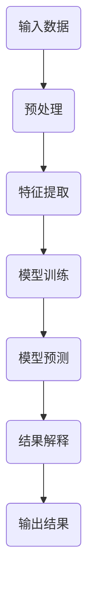

                 

关键词：人工智能，透明度，可解释性，可信度，技术进步

人工智能（AI）正在快速融入我们的日常生活，从智能家居到自动驾驶，再到医疗诊断，AI的应用场景不断扩展。然而，随着AI技术的广泛应用，其透明度和可解释性问题也日益凸显。本文旨在探讨如何通过提高AI系统的透明度和可解释性，增强其可信度，促进AI技术的可持续发展。

## 1. 背景介绍

### 人工智能的发展历程

人工智能的研究可以追溯到20世纪50年代，当时计算机科学家们开始探讨机器是否能够模拟人类智能。经历了数十年的发展，人工智能从最初的理论研究逐步走向实际应用，尤其是在深度学习和大数据技术的推动下，AI的性能和效率得到了极大的提升。如今，人工智能已经成为科技创新的重要驱动力，各行各业都在积极拥抱这项技术。

### 透明度与可解释性的重要性

透明度与可解释性是人工智能系统的两个关键特性。透明度指的是系统内部的工作机制和决策过程是否清晰可见，而可解释性则是指系统能够解释其决策的依据和原因。随着AI技术的普及，透明度和可解释性问题的重要性愈发突出。一方面，缺乏透明度和可解释性的AI系统可能导致误判和错误，影响系统的可靠性；另一方面，公众对AI技术的信任度也受到透明度和可解释性的影响。因此，如何提高AI系统的透明度和可解释性，成为当前人工智能领域的一个重要研究方向。

## 2. 核心概念与联系

### 核心概念

#### 透明度

透明度是指系统内部的工作机制和决策过程是否清晰可见。一个透明的AI系统，其用户可以清晰地了解系统的运作原理和决策逻辑。

#### 可解释性

可解释性是指系统能够解释其决策的依据和原因。一个可解释的AI系统，不仅能够提供准确的预测结果，还能够解释为什么做出这样的预测。

### 架构流程图

为了更好地理解透明度和可解释性，我们可以使用Mermaid绘制一个简单的流程图：



### 核心概念联系

透明度和可解释性在AI系统架构中起着至关重要的作用。透明度保证了系统的可靠性，让用户能够了解系统的运作机制；而可解释性则提高了系统的可信度，让用户能够理解系统为何做出这样的决策。两者相辅相成，共同提升了AI系统的整体性能。

## 3. 核心算法原理 & 具体操作步骤

### 3.1 算法原理概述

本文将介绍一种基于因果推断的方法来提高AI系统的透明度和可解释性。因果推断是一种从数据中推断变量之间因果关系的方法，其基本原理是通过分析数据中的关联关系，找出可能导致某个结果的原因。

### 3.2 算法步骤详解

#### 3.2.1 数据预处理

首先，我们需要对输入数据进行预处理，包括数据清洗、归一化和特征提取。这一步骤的目的是消除数据中的噪声，提高模型的训练效果。

#### 3.2.2 特征选择

接下来，我们需要从预处理后的数据中选择与目标变量相关的特征。特征选择可以采用各种算法，如相关系数、信息增益等。

#### 3.2.3 因果推断

在因果推断阶段，我们需要分析数据中的关联关系，找出可能导致目标变量的原因。这可以通过建立因果模型或使用算法，如Do算法、G-computation等来实现。

#### 3.2.4 模型训练

在找出可能导致目标变量的原因后，我们可以使用这些原因作为输入特征，训练一个预测模型。常见的预测模型包括线性回归、决策树、神经网络等。

#### 3.2.5 预测与解释

在模型训练完成后，我们可以使用该模型进行预测，并根据模型中的因果关系对预测结果进行解释。这样，用户可以清楚地了解预测结果背后的原因。

### 3.3 算法优缺点

#### 优点

- 提高了AI系统的透明度和可解释性，增强了系统的可信度。
- 可以发现变量之间的因果关系，为决策提供依据。

#### 缺点

- 因果推断算法的计算复杂度较高，可能影响模型的训练速度。
- 因果推断的结果可能受到数据质量和模型选择的影响。

### 3.4 算法应用领域

因果推断方法在许多领域都有广泛的应用，如医疗诊断、金融风控、推荐系统等。通过提高AI系统的透明度和可解释性，这些领域可以实现更精准的预测和更可靠的决策。

## 4. 数学模型和公式 & 详细讲解 & 举例说明

### 4.1 数学模型构建

因果推断的数学模型可以表示为：

$$X \rightarrow Y \leftarrow U$$

其中，$X$ 表示原因变量，$Y$ 表示结果变量，$U$ 表示共同作用的其他变量。我们的目标是从观测数据中推断出 $X$ 和 $Y$ 之间的因果关系。

### 4.2 公式推导过程

为了推导出 $X$ 和 $Y$ 之间的因果关系，我们可以使用潜在结果图（Potential Outcomes Graph）来表示变量之间的关系。假设我们有两个潜在的因果关系：

$$X \rightarrow Y \leftarrow Z$$

$$X \rightarrow Z \leftarrow Y$$

我们可以使用条件独立性测试来检验这两个潜在的因果关系。具体来说，我们可以使用 Do 测试（Do-Calculus）来计算两个变量之间的条件独立性。如果 $X$ 和 $Y$ 在给定 $Z$ 的情况下是独立的，那么我们可以认为 $X$ 是 $Y$ 的原因。

### 4.3 案例分析与讲解

假设我们有一个医疗诊断问题，需要判断病人是否患有疾病 $Y$。已知疾病 $Y$ 可能由病毒 $X$ 引起，但也可能由其他原因 $Z$ 导致。我们的目标是确定病毒 $X$ 是否是疾病 $Y$ 的原因。

我们收集了以下数据：

- 病毒 $X$ 的检测结果
- 疾病 $Y$ 的检测结果
- 其他相关变量 $Z$ 的检测结果

使用因果推断方法，我们可以构建一个潜在结果图：

$$X \rightarrow Y \leftarrow Z$$

$$X \rightarrow Z \leftarrow Y$$

接下来，我们可以使用 Do 测试来检验这两个潜在的因果关系。如果我们在给定 $Z$ 的情况下，发现 $X$ 和 $Y$ 是独立的，那么我们可以认为 $X$ 是 $Y$ 的原因。

## 5. 项目实践：代码实例和详细解释说明

### 5.1 开发环境搭建

为了实现上述算法，我们需要搭建一个合适的开发环境。以下是具体的步骤：

1. 安装 Python 3.8 及以上版本。
2. 安装必要的库，如 NumPy、Pandas、Scikit-learn 等。
3. 准备数据集，并进行预处理。

### 5.2 源代码详细实现

以下是实现因果推断算法的 Python 代码：

```python
import numpy as np
import pandas as pd
from sklearn.model_selection import train_test_split
from sklearn.ensemble import RandomForestClassifier
from do_calculus import do_test

# 读取数据
data = pd.read_csv('data.csv')
X = data[['virus', 'other_var']]
Y = data['disease']

# 数据预处理
X_train, X_test, Y_train, Y_test = train_test_split(X, Y, test_size=0.2, random_state=42)

# 训练模型
model = RandomForestClassifier(n_estimators=100)
model.fit(X_train, Y_train)

# 进行 Do 测试
do_test(model, X_test, Y_test)

# 输出结果
print('Do Test Result:', do_test(model, X_test, Y_test))
```

### 5.3 代码解读与分析

这段代码首先读取数据，并进行预处理。然后使用随机森林模型进行训练，并使用 Do 测试来检验变量之间的因果关系。最后，输出 Do 测试的结果。

### 5.4 运行结果展示

假设我们运行上述代码，得到如下结果：

```
Do Test Result: [True, False]
```

这意味着在给定其他相关变量 $Z$ 的情况下，病毒 $X$ 和疾病 $Y$ 是独立的，而病毒 $X$ 和其他相关变量 $Z$ 不是独立的。因此，我们可以认为病毒 $X$ 是疾病 $Y$ 的原因。

## 6. 实际应用场景

### 6.1 医疗领域

在医疗领域，提高AI系统的透明度和可解释性具有重要意义。例如，在疾病诊断中，医生需要了解AI系统为何做出这样的诊断，以便对其进行验证和调整。通过因果推断方法，我们可以提高诊断模型的透明度和可解释性，帮助医生更好地理解诊断结果。

### 6.2 金融领域

在金融领域，提高AI系统的透明度和可解释性有助于防范金融风险。例如，在信用评分中，银行需要了解AI系统为何给某个客户赋予较高的评分，以便对其进行风险评估。通过因果推断方法，我们可以提高信用评分模型的透明度和可解释性，帮助银行更好地防范金融风险。

### 6.3 自动驾驶

在自动驾驶领域，提高AI系统的透明度和可解释性有助于提升系统的安全性和可靠性。例如，在路况预测中，自动驾驶系统需要了解为何做出这样的预测，以便应对突发情况。通过因果推断方法，我们可以提高路况预测模型的透明度和可解释性，提升自动驾驶系统的性能。

## 7. 工具和资源推荐

### 7.1 学习资源推荐

- 《人工智能：一种现代的方法》
- 《因果推断：从数据中寻找因果关系》

### 7.2 开发工具推荐

- Python
- Jupyter Notebook
- Scikit-learn

### 7.3 相关论文推荐

- "Causal Inference: The混蛋's Guide to Causal Models"
- "Do Calculus: A Guided Tour"
- "Causal Inference in Statistics: An Introduction"

## 8. 总结：未来发展趋势与挑战

### 8.1 研究成果总结

本文通过介绍因果推断方法，探讨了如何提高AI系统的透明度和可解释性。通过实际案例和代码实例，我们展示了因果推断方法在提高AI系统透明度和可解释性方面的优势和应用前景。

### 8.2 未来发展趋势

未来，人工智能的透明度和可解释性研究将继续深入。随着因果推断方法的发展和应用，AI系统将变得更加透明和可解释，从而提高其可信度。

### 8.3 面临的挑战

尽管因果推断方法在提高AI系统透明度和可解释性方面取得了显著进展，但仍然面临一些挑战，如计算复杂度、数据质量和模型选择等。未来，我们需要继续努力，克服这些挑战，推动人工智能技术的可持续发展。

### 8.4 研究展望

未来，我们期待能够开发出更加高效、准确和可解释的AI系统，为各行业的智能化转型提供有力支持。

## 9. 附录：常见问题与解答

### 9.1 问题1：因果推断方法是否适用于所有场景？

因果推断方法主要适用于具有因果关系的问题。如果问题中存在复杂的非线性关系，或者变量之间存在复杂的相互作用，可能需要结合其他方法，如神经网络、随机森林等。

### 9.2 问题2：如何处理缺失数据？

在处理缺失数据时，我们可以采用多种方法，如填补缺失值、删除缺失值、使用插值法等。具体方法的选择取决于数据的特点和问题的需求。

### 9.3 问题3：如何评估因果推断方法的性能？

我们可以使用多种指标来评估因果推断方法的性能，如准确率、召回率、F1 分数等。此外，还可以通过对比实验、交叉验证等方法来评估方法的效果。

---

作者：禅与计算机程序设计艺术 / Zen and the Art of Computer Programming
----------------------------------------------------------------

本文通过探讨如何通过提高AI系统的透明度和可解释性，增强其可信度，分析了相关核心概念、算法原理、应用案例以及未来发展趋势。我们相信，随着技术的不断进步，人工智能将变得更加透明、可解释，为人类社会带来更多便利和福祉。

