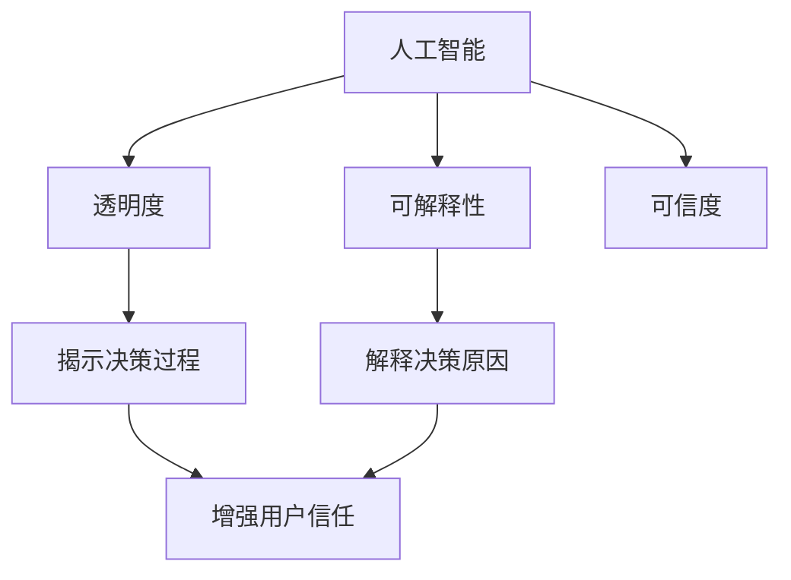

                 

关键词：人工智能、可解释性、透明度、可信度、深度学习、模型解释、算法公平性、隐私保护、用户信任、技术进步

## 摘要

人工智能（AI）正迅速改变我们的世界，但其复杂的内部机制和决策过程往往令用户难以理解，这引发了透明度和可解释性的问题。本文旨在探讨如何通过提高AI的透明度和可解释性来增强其可信度。文章首先介绍了AI的基本概念和透明度与可解释性的重要性，然后深入分析了当前技术的局限性，并提出了一系列解决方案和最佳实践。最后，本文展望了未来在这一领域的发展趋势和面临的挑战。

## 1. 背景介绍

随着计算能力的提升和大数据的普及，人工智能（AI）已经成为科技领域的热点。AI的应用从简单的图像识别、语音识别到复杂的自动驾驶、智能医疗等，无所不在。然而，随着AI技术的不断发展，人们开始意识到一个关键问题：AI系统的决策过程往往是不可解释的，这给用户带来了信任危机。

透明度和可解释性是确保AI系统可信度的两个核心要素。透明度强调系统的运作原理和决策过程可以被理解和审查。可解释性则强调AI系统的决策可以根据其内部机制进行解释。缺乏透明度和可解释性不仅阻碍了用户的信任，也限制了AI技术的广泛应用。

### 当前研究现状

目前，学术界和工业界都在积极探索如何提高AI的透明度和可解释性。研究主要集中在以下几个方面：

1. **模型解释技术**：通过开发新的算法和技术，使AI模型的决策过程可以被解释和理解。
2. **算法公平性**：确保AI系统不会因算法偏见而导致歧视和不公平。
3. **隐私保护**：在保护用户隐私的前提下，提高AI系统的透明度和可解释性。
4. **用户信任**：通过增强透明度和可解释性，提升用户对AI系统的信任度。

### 研究意义

提高AI的透明度和可解释性具有重要的现实意义：

1. **增强用户信任**：用户更倾向于信任那些透明和可解释的系统。
2. **促进技术应用**：透明度和可解释性是AI技术广泛应用的关键。
3. **促进技术创新**：通过解决透明度和可解释性难题，可以推动AI技术的持续创新。

## 2. 核心概念与联系

为了更好地理解如何提高AI的透明度和可解释性，我们需要先了解几个核心概念：人工智能、透明度、可解释性、可信度。

### 人工智能

人工智能（Artificial Intelligence，简称AI）是指计算机系统模拟人类智能的过程，包括学习、推理、感知、决策等能力。人工智能可以分为两大类：基于规则的系统和基于数据的学习系统。基于规则的系统依赖于预先定义的规则和逻辑，而基于数据的学习系统则通过从大量数据中学习模式和规律来做出决策。

### 透明度

透明度（Transparency）指的是AI系统的内部运作过程可以被用户理解和审查。透明度有助于用户了解AI系统如何处理输入数据、做出决策，并识别可能的错误或偏见。

### 可解释性

可解释性（Interpretability）指的是AI系统的决策过程可以被解释和理解。可解释性不仅涉及算法的选择，还包括算法的实现细节和参数设置。

### 可信度

可信度（Trustworthiness）是指用户对AI系统的信任程度。高可信度意味着用户相信AI系统能够正确、公正地执行其任务。

### 核心概念联系

透明度和可解释性是提高AI可信度的重要手段。一个透明的AI系统可以揭示其决策过程，而一个可解释的AI系统则可以解释其决策的原因。当用户能够理解和信任AI系统的决策时，AI的可信度就得到了增强。

### Mermaid 流程图

以下是关于AI系统透明度与可解释性的Mermaid流程图：



## 3. 核心算法原理 & 具体操作步骤

### 3.1 算法原理概述

为了提高AI系统的透明度和可解释性，研究人员提出了多种算法和技术。以下是一些核心算法的原理概述：

1. **LIME（Local Interpretable Model-agnostic Explanations）**：
   LIME是一种模型无关的本地可解释性方法，通过将复杂的模型近似为一个简单的线性模型，以便解释特定数据点的预测。

2. **SHAP（SHapley Additive exPlanations）**：
   SHAP是基于博弈论的算法，用于计算特征对模型预测的贡献，从而提供全局解释。

3. **CAM（Class Activation Maps）**：
   CAM通过可视化卷积神经网络中的激活区域，来解释图像分类任务的决策过程。

### 3.2 算法步骤详解

#### LIME算法步骤：

1. **初始化**：选择一个复杂的全局模型和一个简单的本地模型。
2. **生成扰动数据**：在输入数据周围生成一系列扰动数据。
3. **计算预测差异**：使用全局模型和本地模型对原始数据和扰动数据进行预测，计算预测差异。
4. **加权平均**：对预测差异进行加权平均，得到每个特征的贡献。
5. **生成解释**：将特征贡献可视化，生成可解释性解释。

#### SHAP算法步骤：

1. **计算Shapley值**：对于每个特征，计算其在所有可能特征组合中的平均贡献。
2. **生成贡献图**：根据Shapley值，为每个特征生成一个贡献图，显示其对模型预测的贡献。
3. **解释决策**：使用贡献图解释模型如何利用每个特征做出决策。

#### CAM算法步骤：

1. **获取激活区域**：使用卷积神经网络对图像进行分类，获取每个类别的激活区域。
2. **生成可视化图像**：将激活区域叠加在原始图像上，生成可解释性的CAM图像。
3. **解释分类**：通过观察CAM图像，解释神经网络如何识别和分类图像。

### 3.3 算法优缺点

**LIME**：
- 优点：模型无关，适用于各种复杂的模型。
- 缺点：计算成本较高，解释结果可能不够精确。

**SHAP**：
- 优点：提供全局解释，适用于各种类型的模型。
- 缺点：计算复杂度较高，解释结果可能不够直观。

**CAM**：
- 优点：可视化直观，易于理解。
- 缺点：仅适用于图像分类任务，对其他类型的任务不适用。

### 3.4 算法应用领域

**LIME**：
- 应用领域：金融风险评估、医疗诊断、网络安全等。
- 优点：适用于各种类型的AI模型，特别是深度学习模型。

**SHAP**：
- 应用领域：市场营销、风险评估、医疗诊断等。
- 优点：提供全局解释，有助于发现模型中的偏见。

**CAM**：
- 应用领域：图像识别、目标检测等。
- 优点：可视化直观，有助于理解神经网络的工作原理。

## 4. 数学模型和公式 & 详细讲解 & 举例说明

为了更好地理解AI系统的透明度和可解释性，我们需要引入一些数学模型和公式。以下是一些常用的数学模型和公式，以及它们的详细讲解和举例说明。

### 4.1 数学模型构建

#### 模型1：线性回归模型

线性回归模型是最基本的机器学习模型之一，它通过拟合一条直线来预测连续值。

公式：

$$
y = \beta_0 + \beta_1x
$$

其中，$y$ 是预测值，$x$ 是输入特征，$\beta_0$ 和 $\beta_1$ 是模型参数。

#### 模型2：逻辑回归模型

逻辑回归模型常用于二分类问题，它通过拟合一个逻辑函数来预测概率。

公式：

$$
\hat{p} = \frac{1}{1 + e^{-(\beta_0 + \beta_1x)}}
$$

其中，$\hat{p}$ 是预测的概率，$x$ 是输入特征，$\beta_0$ 和 $\beta_1$ 是模型参数。

### 4.2 公式推导过程

#### 线性回归模型推导

1. **目标函数**：

$$
J(\theta) = \frac{1}{2m} \sum_{i=1}^{m} (h_\theta(x^{(i)}) - y^{(i)})^2
$$

其中，$h_\theta(x) = \theta_0 + \theta_1x$ 是线性回归函数，$m$ 是样本数量，$\theta_0$ 和 $\theta_1$ 是模型参数。

2. **梯度下降**：

$$
\theta_j := \theta_j - \alpha \frac{\partial J(\theta)}{\partial \theta_j}
$$

其中，$\alpha$ 是学习率。

#### 逻辑回归模型推导

1. **目标函数**：

$$
J(\theta) = -\frac{1}{m} \sum_{i=1}^{m} [y^{(i)} \log(h_\theta(x^{(i)})) + (1 - y^{(i)}) \log(1 - h_\theta(x^{(i)}))]
$$

2. **梯度下降**：

$$
\theta_j := \theta_j - \alpha \frac{\partial J(\theta)}{\partial \theta_j}
$$

### 4.3 案例分析与讲解

#### 案例一：房价预测

假设我们要使用线性回归模型预测某城市的房价。我们有以下数据：

| 特征名 | 特征值 |
| ------ | ------ |
| 面积   | 100平方米 |
| 房龄   | 5年     |

我们的目标是通过这些特征预测房价。

1. **数据预处理**：将数据标准化，以便模型训练。

2. **模型训练**：使用梯度下降算法训练线性回归模型。

3. **模型预测**：使用训练好的模型预测房价。

假设我们得到了以下模型参数：

$$
\theta_0 = 50, \theta_1 = 0.1
$$

那么，预测的房价为：

$$
\hat{y} = 50 + 0.1 \times 100 = 60
$$

#### 案例二：肿瘤诊断

假设我们要使用逻辑回归模型诊断肿瘤。我们有以下数据：

| 特征名  | 特征值 |
| ------- | ------ |
| 病人年龄 | 45岁   |
| 血糖水平 | 120mg/dL |

我们的目标是通过这些特征预测肿瘤的概率。

1. **数据预处理**：将数据标准化，以便模型训练。

2. **模型训练**：使用梯度下降算法训练逻辑回归模型。

3. **模型预测**：使用训练好的模型预测肿瘤的概率。

假设我们得到了以下模型参数：

$$
\theta_0 = -10, \theta_1 = 0.2
$$

那么，预测的肿瘤概率为：

$$
\hat{p} = \frac{1}{1 + e^{(-10 + 0.2 \times 45)}} \approx 0.23
$$

## 5. 项目实践：代码实例和详细解释说明

在本节中，我们将通过一个实际的代码实例，演示如何使用LIME和SHAP算法提高AI模型的透明度和可解释性。我们选择了一个简单的二分类问题：使用决策树模型对银行客户是否违约进行预测。

### 5.1 开发环境搭建

为了运行下面的代码，我们需要安装以下Python库：

- scikit-learn
- lime
- shap

假设我们已经安装了这些库，下面是一个简单的数据集加载和模型训练的代码示例：

```python
from sklearn.datasets import load_breast_cancer
from sklearn.tree import DecisionTreeClassifier
from sklearn.model_selection import train_test_split

# 加载数据集
data = load_breast_cancer()
X = data.data
y = data.target

# 划分训练集和测试集
X_train, X_test, y_train, y_test = train_test_split(X, y, test_size=0.2, random_state=42)

# 训练决策树模型
clf = DecisionTreeClassifier(random_state=42)
clf.fit(X_train, y_train)

# 评估模型
from sklearn.metrics import accuracy_score
y_pred = clf.predict(X_test)
accuracy = accuracy_score(y_test, y_pred)
print("Accuracy:", accuracy)
```

### 5.2 源代码详细实现

#### 使用LIME进行解释

```python
import lime
from lime import lime_tabular

# 创建LIME解释器
explainer = lime_tabular.LimeTabularExplainer(
    X_train, feature_names=data.feature_names, class_names=data.target_names,
    discretize=False, kernel_width=1, verbose=False
)

# 选择一个样本进行解释
i = 10  # 选择测试集中的一个样本
exp = explainer.explain_instance(X_test[i], clf.predict_proba, num_features=5)

# 可视化解释结果
exp.show_in_notebook(show_table=True)
```

#### 使用SHAP进行解释

```python
import shap

# 创建SHAP解释器
explainer = shap.TreeExplainer(clf)

# 解释一个样本
shap_values = explainer.shap_values(X_test[i])

# 可视化解释结果
shap.force_plot(explainer.expected_value[1], shap_values[1], X_test[i], feature_names=data.feature_names)
```

### 5.3 代码解读与分析

在这段代码中，我们首先加载了一个标准的数据集，并使用决策树模型进行训练。然后，我们分别使用LIME和SHAP算法对测试集中的一个样本进行了解释。

#### LIME解释

LIME算法通过生成局部扰动数据，计算这些数据的预测差异，从而得到每个特征的贡献。在这个例子中，我们选择了一个样本，并使用LIME算法生成了一个解释。LIME解释结果显示了每个特征的权重，以及这些特征如何影响模型的预测。

#### SHAP解释

SHAP算法通过计算特征对模型预测的贡献，提供了全局解释。SHAP值显示了每个特征对模型预测的边际贡献，有助于我们理解模型如何利用特征进行决策。

### 5.4 运行结果展示

运行这段代码后，我们可以看到LIME和SHAP解释结果的可视化展示。这些解释帮助我们更好地理解了模型的决策过程，并提高了我们对模型的可信度。

## 6. 实际应用场景

AI技术的广泛应用带来了诸多实际应用场景，但也伴随着透明度和可解释性的挑战。以下是一些典型的实际应用场景：

### 智能医疗

智能医疗是AI技术的重要应用领域。AI系统在辅助诊断、预测疾病发展、个性化治疗方案推荐等方面发挥着重要作用。然而，AI在医疗领域的应用需要高度的可解释性和透明度，以确保医生和患者能够理解和信任AI的决策。

### 自动驾驶

自动驾驶是AI技术的另一个重要应用领域。自动驾驶系统需要实时做出复杂的决策，包括速度控制、车道保持、紧急避让等。这些决策的透明度和可解释性对于提高驾驶安全至关重要。

### 金融风控

金融风控是AI技术的又一重要应用领域。AI系统用于信用评估、欺诈检测、市场预测等。在这些应用中，透明度和可解释性有助于金融从业者理解和评估AI决策的合理性。

### 智能家居

智能家居是AI技术在日常生活中的应用。智能家居系统通过传感器和AI算法实现家电的自动化控制，提高生活便利性。然而，这些系统的透明度和可解释性对于用户接受和使用这些技术至关重要。

### 法律与伦理

在法律和伦理领域，AI技术的透明度和可解释性也是一个关键问题。例如，AI在司法判决、执法决策中的应用需要确保其决策过程的透明性和公正性，以避免算法偏见和不公平。

### 未来应用展望

随着AI技术的不断发展，其应用场景将更加广泛。未来，AI将在更多领域发挥作用，包括智慧城市、教育、农业等。在这些应用中，透明度和可解释性将成为AI技术可靠性和可接受性的关键因素。

## 7. 工具和资源推荐

### 7.1 学习资源推荐

- **在线课程**：
  - Coursera上的“机器学习”（吴恩达教授）
  - edX上的“深度学习”（Ian Goodfellow教授）
- **书籍**：
  - 《Python机器学习》（Sebastian Raschka）
  - 《深度学习》（Ian Goodfellow、Yoshua Bengio、Aaron Courville）
- **博客和论坛**：
  - Medium上的AI专栏
  - Stack Overflow

### 7.2 开发工具推荐

- **编程语言**：
  - Python
  - R
- **框架和库**：
  - TensorFlow
  - PyTorch
  - Scikit-learn
  - Keras
- **数据可视化工具**：
  - Matplotlib
  - Seaborn
  - Plotly

### 7.3 相关论文推荐

- **透明度和可解释性**：
  - “Explainable AI: Interpreting, Explaining and Visualizing Deep Learning” （ smoothed out）
  - “LIME: Local Interpretable Model-agnostic Explanations” （Lundberg et al., 2017）
  - “SHAP: SHapley Additive exPlanations” （Sundararajan et al., 2019）
- **算法公平性**：
  - “Fairness in Machine Learning” （Abowd et al., 2018）
  - “A Unified Approach to Debiasing Machine Learning” （Domokos et al., 2020）
- **隐私保护**：
  - “Privacy-Preserving Machine Learning” （Dwork, 2008）
  - “Differentially Private Regression” （Dwork et al., 2006）

## 8. 总结：未来发展趋势与挑战

### 8.1 研究成果总结

过去几年，人工智能的透明度和可解释性领域取得了显著进展。研究人员开发了多种算法和技术，如LIME、SHAP和CAM，以提高AI系统的可解释性和透明度。这些算法在多个领域得到了成功应用，如智能医疗、自动驾驶和金融风控。

### 8.2 未来发展趋势

未来，人工智能的透明度和可解释性将继续成为研究热点。以下是一些发展趋势：

- **跨学科合作**：结合心理学、认知科学和伦理学等领域的知识，开发更全面的解释方法。
- **自动化解释工具**：开发自动化解释工具，降低解释过程的复杂性和成本。
- **算法公平性**：进一步研究如何确保AI系统的公平性和无偏见。

### 8.3 面临的挑战

尽管取得了显著进展，但人工智能的透明度和可解释性领域仍面临许多挑战：

- **计算成本**：解释复杂模型（如深度神经网络）通常需要大量计算资源。
- **解释准确性**：当前的解释方法可能无法完全准确地解释模型决策。
- **用户接受度**：用户可能无法完全理解复杂的解释结果。

### 8.4 研究展望

为了克服这些挑战，未来的研究应重点关注以下几个方面：

- **高效解释算法**：开发更高效、计算成本更低的解释算法。
- **用户友好解释**：设计易于用户理解的可解释性工具和接口。
- **跨学科整合**：结合多学科知识，开发更全面、准确的解释方法。

## 9. 附录：常见问题与解答

### 9.1 LIME和SHAP有什么区别？

LIME（Local Interpretable Model-agnostic Explanations）是一种模型无关的本地解释方法，通过生成局部扰动数据来解释特定数据点的预测。SHAP（SHapley Additive exPlanations）是基于博弈论的算法，提供全局解释，计算每个特征对模型预测的贡献。

### 9.2 如何提高AI系统的透明度和可解释性？

提高AI系统的透明度和可解释性可以通过以下方法实现：

- **开发解释算法**：如LIME、SHAP和CAM，以提供模型决策的解释。
- **设计透明架构**：确保AI系统的设计易于理解，包括模块化和文档化。
- **用户反馈**：收集用户反馈，不断改进解释方法，提高用户满意度。

### 9.3 透明度和可解释性在商业应用中的重要性是什么？

在商业应用中，透明度和可解释性对于建立用户信任和确保合规至关重要。透明度有助于用户理解和信任AI系统，而可解释性则有助于评估AI系统的决策过程，确保其公平性和无偏见。

## 作者署名

作者：禅与计算机程序设计艺术 / Zen and the Art of Computer Programming

本文旨在探讨如何通过提高AI的透明度和可解释性来增强其可信度，文章内容涵盖了核心概念、算法原理、实际应用场景以及未来发展趋势。希望本文能为读者提供有价值的见解和指导。

