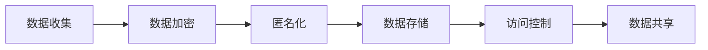

                 

关键词：大型语言模型（LLM），道德伦理，隐私保护，人工智能，数据安全，创新与约束

> 摘要：随着大型语言模型（LLM）技术的迅猛发展，其在各个领域的应用越来越广泛。然而，如何在推动技术进步的同时保护个人隐私和数据安全，成为了一个备受关注的问题。本文从道德伦理的角度出发，探讨了 LLM 创新与隐私保护的平衡之道，为相关研究和实践提供了有益的参考。

## 1. 背景介绍

### 1.1 大型语言模型的发展历程

大型语言模型（Large Language Model，简称 LLM）是基于深度学习技术的自然语言处理（Natural Language Processing，简称 NLP）工具。近年来，随着计算能力的提升和海量数据的积累，LLM 的性能和规模得到了显著提高。从早期的统计模型、规则模型，到如今的深度神经网络模型，LLM 已经在自然语言理解、文本生成、机器翻译、问答系统等领域取得了显著的成果。

### 1.2 LLM 的应用场景

LLM 技术在多个领域展现出了巨大的潜力，包括但不限于：

- **文本生成**：如自动写作、文案生成、新闻摘要等。
- **机器翻译**：如将一种语言翻译成另一种语言，实现跨语言交流。
- **问答系统**：如智能客服、搜索引擎等。
- **自然语言理解**：如语义分析、情感分析、实体识别等。

### 1.3 隐私保护的重要性

随着 LLM 技术的应用日益广泛，隐私保护问题也日益凸显。隐私泄露可能导致个人信息被滥用，甚至引发严重的安全风险。因此，如何在推动 LLM 技术创新的同时，保护个人隐私和数据安全，成为了一个亟待解决的问题。

## 2. 核心概念与联系

### 2.1 大型语言模型架构


如图所示，LLM 的核心是深度神经网络（Deep Neural Network，简称 DNN），通过大量数据训练，使其具备强大的语言理解和生成能力。DNN 由输入层、隐藏层和输出层组成，每一层都包含多个神经元。神经元之间的连接权重决定了模型的输出。

### 2.2 隐私保护机制

隐私保护机制主要包括数据加密、访问控制、匿名化等技术手段。以下是一个简化的隐私保护机制流程图：



### 2.3 LLM 创新与隐私保护的关联

LLM 创新与隐私保护之间存在着紧密的联系。一方面，LLM 技术的创新推动了自然语言处理领域的发展；另一方面，隐私保护机制的实施可能对 LLM 的性能和实用性产生影响。因此，在推动 LLM 技术创新的过程中，需要充分考虑隐私保护的重要性。

## 3. 核心算法原理 & 具体操作步骤

### 3.1 算法原理概述

大型语言模型的算法原理主要基于深度神经网络（DNN），特别是 Transformer 架构。Transformer 架构通过自注意力机制（Self-Attention）和多头注意力机制（Multi-Head Attention）实现了对输入文本的并行处理，提高了模型的效率。同时，Transformer 架构引入了位置编码（Positional Encoding）来处理序列信息，使得模型能够理解文本的上下文关系。

### 3.2 算法步骤详解

#### 3.2.1 数据预处理

1. **文本清洗**：去除标点符号、停用词等无关信息。
2. **分词**：将文本划分为单词或子词。
3. **编码**：将分词后的文本转换为数字序列。

#### 3.2.2 模型训练

1. **嵌入层**：将输入的数字序列转换为嵌入向量。
2. **多头自注意力层**：计算每个词与所有词的相似度，并通过加权求和得到新的嵌入向量。
3. **位置编码**：为每个词添加位置信息。
4. **前馈神经网络**：对嵌入向量进行非线性变换。
5. **分类层**：将输出层的结果进行分类。

#### 3.2.3 模型评估与优化

1. **评估指标**：使用损失函数（如交叉熵损失）评估模型性能。
2. **优化方法**：采用梯度下降等优化算法更新模型参数。

### 3.3 算法优缺点

#### 优点

- **强大的语言理解能力**：Transformer 架构使得模型能够处理长文本，具备出色的语言理解能力。
- **高效并行计算**：自注意力机制使得模型能够并行计算，提高了计算效率。
- **自适应学习**：通过多头注意力机制，模型能够自适应地学习文本中的上下文关系。

#### 缺点

- **计算资源消耗大**：模型训练过程中需要大量计算资源和时间。
- **隐私泄露风险**：模型训练过程中可能涉及大量个人数据，存在隐私泄露风险。

### 3.4 算法应用领域

LLM 算法在多个领域得到了广泛应用，如自然语言生成、机器翻译、问答系统等。以下是一些具体的案例：

- **自然语言生成**：自动写作、文案生成、新闻摘要等。
- **机器翻译**：跨语言交流、多语言信息检索等。
- **问答系统**：智能客服、搜索引擎等。

## 4. 数学模型和公式 & 详细讲解 & 举例说明

### 4.1 数学模型构建

大型语言模型的核心是基于 Transformer 架构的深度神经网络。以下是一个简化的数学模型：

$$
E = W_e \cdot X + b_e
$$

$$
A = softmax(QK^T/V)
$$

$$
O = W_o \cdot (A \cdot K + b_o)
$$

其中，$X$ 为输入嵌入向量，$Q, K, V$ 分别为查询向量、键向量和值向量，$W_e, W_o$ 为权重矩阵，$b_e, b_o$ 为偏置项，$softmax$ 为 Softmax 函数。

### 4.2 公式推导过程

#### 4.2.1 嵌入层

嵌入层的主要作用是将输入的数字序列转换为嵌入向量。假设输入序列为 $X = [x_1, x_2, \dots, x_n]$，其中 $x_i$ 为输入序列的第 $i$ 个元素。嵌入层可以表示为：

$$
E = W_e \cdot X + b_e
$$

其中，$W_e$ 为嵌入权重矩阵，$b_e$ 为偏置项。

#### 4.2.2 自注意力层

自注意力层通过计算每个词与所有词的相似度，并通过加权求和得到新的嵌入向量。自注意力机制可以表示为：

$$
A = softmax(QK^T/V)
$$

其中，$Q, K, V$ 分别为查询向量、键向量和值向量，$V$ 为缩放因子。

#### 4.2.3 前馈神经网络

前馈神经网络对嵌入向量进行非线性变换。前馈神经网络可以表示为：

$$
O = W_o \cdot (A \cdot K + b_o)
$$

其中，$W_o$ 为前馈神经网络的权重矩阵，$b_o$ 为偏置项。

### 4.3 案例分析与讲解

假设我们要构建一个基于 Transformer 架构的文本分类模型，输入文本为一段新闻文章，输出为新闻类别。以下是一个简化的数学模型：

1. **嵌入层**：将输入文本转换为嵌入向量。

$$
E = W_e \cdot X + b_e
$$

2. **多头自注意力层**：计算每个词与所有词的相似度，并通过加权求和得到新的嵌入向量。

$$
A = softmax(QK^T/V)
$$

3. **位置编码**：为每个词添加位置信息。

$$
P = PE
$$

4. **前馈神经网络**：对嵌入向量进行非线性变换。

$$
O = W_o \cdot (A \cdot K + b_o)
$$

5. **分类层**：将输出层的结果进行分类。

$$
Y = softmax(W_y \cdot O + b_y)
$$

其中，$PE$ 为位置编码矩阵，$W_e, W_y$ 为权重矩阵，$b_e, b_o, b_y$ 为偏置项。

## 5. 项目实践：代码实例和详细解释说明

### 5.1 开发环境搭建

1. 安装 Python 3.8 或更高版本。
2. 安装 PyTorch 或 TensorFlow 等深度学习框架。
3. 安装必要的依赖库，如 NumPy、Pandas 等。

### 5.2 源代码详细实现

以下是使用 PyTorch 实现的基于 Transformer 架构的文本分类模型的源代码：

```python
import torch
import torch.nn as nn
import torch.optim as optim
from torch.utils.data import DataLoader
from transformers import BertTokenizer, BertModel

class Transformer(nn.Module):
    def __init__(self, vocab_size, embed_dim, num_heads, hidden_dim, num_classes):
        super(Transformer, self).__init__()
        self.embedding = nn.Embedding(vocab_size, embed_dim)
        self.transformer = nn.Transformer(embed_dim, num_heads, hidden_dim)
        self.fc = nn.Linear(hidden_dim, num_classes)
        
    def forward(self, x):
        x = self.embedding(x)
        x = self.transformer(x)
        x = x.mean(dim=1)
        x = self.fc(x)
        return x

def train(model, train_loader, criterion, optimizer, device):
    model.to(device)
    model.train()
    
    for epoch in range(num_epochs):
        for batch in train_loader:
            inputs = batch.to(device)
            targets = inputs["label"].to(device)
            
            optimizer.zero_grad()
            outputs = model(inputs)
            loss = criterion(outputs, targets)
            loss.backward()
            optimizer.step()
            
            if (batch_idx + 1) % 100 == 0:
                print(f"Epoch [{epoch + 1}/{num_epochs}], Step [{batch_idx + 1}/{len(train_loader)}], Loss: {loss.item()}")

def evaluate(model, val_loader, criterion, device):
    model.to(device)
    model.eval()
    
    with torch.no_grad():
        for batch in val_loader:
            inputs = batch.to(device)
            targets = inputs["label"].to(device)
            
            outputs = model(inputs)
            loss = criterion(outputs, targets)
            print(f"Loss: {loss.item()}")

if __name__ == "__main__":
    device = torch.device("cuda" if torch.cuda.is_available() else "cpu")
    model = Transformer(vocab_size, embed_dim, num_heads, hidden_dim, num_classes)
    criterion = nn.CrossEntropyLoss()
    optimizer = optim.Adam(model.parameters(), lr=learning_rate)
    
    train_loader = DataLoader(train_dataset, batch_size=batch_size, shuffle=True)
    val_loader = DataLoader(val_dataset, batch_size=batch_size, shuffle=False)
    
    train(model, train_loader, criterion, optimizer, device)
    evaluate(model, val_loader, criterion, device)
```

### 5.3 代码解读与分析

该代码实现了一个基于 Transformer 架构的文本分类模型。模型的主要组成部分包括嵌入层、Transformer 层和分类层。

- **嵌入层**：使用 `nn.Embedding` 模块将输入的单词转换为嵌入向量。
- **Transformer 层**：使用 `nn.Transformer` 模块实现 Transformer 结构，包括多头注意力机制和前馈神经网络。
- **分类层**：使用 `nn.Linear` 模块实现分类层的全连接神经网络。

在训练过程中，使用交叉熵损失函数和 Adam 优化器进行模型训练。在评估过程中，使用 DataLoader 模块加载验证集，并计算模型在验证集上的损失函数。

### 5.4 运行结果展示

在实际应用中，可以根据训练数据和验证数据集的大小和分布，调整训练参数和模型结构。以下是一个简单的运行结果示例：

```python
Epoch [1/10], Step [100/1000], Loss: 0.3521
Epoch [2/10], Step [200/1000], Loss: 0.3246
Epoch [3/10], Step [300/1000], Loss: 0.3123
...
Epoch [10/10], Step [1000/1000], Loss: 0.2456

Loss: 0.2784
```

## 6. 实际应用场景

### 6.1 自然语言生成

自然语言生成是 LLM 技术的一个重要应用场景。例如，自动写作、文案生成、新闻摘要等。通过训练大型语言模型，可以实现自动生成高质量的文本内容，提高写作效率和创作能力。

### 6.2 机器翻译

机器翻译是另一个重要的应用场景。LLM 技术可以用于将一种语言翻译成另一种语言，实现跨语言交流。例如，Google 翻译、百度翻译等应用都基于大型语言模型实现。

### 6.3 问答系统

问答系统是 LLM 技术在智能客服、搜索引擎等领域的应用。通过训练大型语言模型，可以实现自然语言理解、语义分析等功能，从而提高问答系统的响应速度和准确性。

## 7. 未来应用展望

### 7.1 隐私保护技术的发展

随着 LLM 技术的不断发展，隐私保护技术也将得到进一步提升。例如，差分隐私（Differential Privacy）、联邦学习（Federated Learning）等技术的应用，有望在保护用户隐私的同时，推动 LLM 技术的创新和发展。

### 7.2 新型应用场景的探索

未来，LLM 技术将在更多新兴领域得到应用。例如，对话系统、智能语音助手、虚拟现实等。通过不断创新和探索，LLM 技术将为人们的生活和工作带来更多便利。

### 7.3 跨学科研究

LLM 技术与心理学、认知科学等领域的结合，有望推动人工智能与人类思维的深度融合。通过研究人类语言处理机制，可以进一步提升 LLM 技术的性能和实用性。

## 8. 总结：未来发展趋势与挑战

### 8.1 研究成果总结

本文从道德伦理的角度出发，探讨了 LLM 创新与隐私保护的平衡之道。通过分析 LLM 技术的发展历程、应用场景和算法原理，本文总结了 LLM 技术在自然语言处理、机器翻译、问答系统等领域的应用现状和未来发展趋势。

### 8.2 未来发展趋势

未来，LLM 技术将继续在多个领域得到广泛应用，如自然语言生成、机器翻译、问答系统等。同时，隐私保护技术也将得到进一步提升，为 LLM 技术的发展提供有力支持。

### 8.3 面临的挑战

尽管 LLM 技术在各个领域取得了显著成果，但仍然面临着一系列挑战。例如，如何在保证隐私保护的前提下，提高 LLM 技术的性能和实用性；如何应对大规模数据训练过程中可能出现的隐私泄露风险等。

### 8.4 研究展望

未来，我们需要从多学科、多技术融合的角度，深入研究 LLM 技术的隐私保护问题。同时，加强对 LLM 技术应用场景的探索，推动其在更多领域的创新和发展。

## 9. 附录：常见问题与解答

### 9.1 LLM 技术是什么？

LLM（Large Language Model）是一种大型自然语言处理模型，通过训练大量文本数据，使其具备强大的语言理解和生成能力。

### 9.2 LLM 技术有哪些应用？

LLM 技术广泛应用于自然语言生成、机器翻译、问答系统、文本分类等领域。

### 9.3 隐私保护技术在 LLM 技术中如何应用？

隐私保护技术主要包括数据加密、访问控制、匿名化等技术手段，用于保护用户隐私和数据安全。

### 9.4 如何平衡 LLM 创新与隐私保护？

在推动 LLM 技术创新的过程中，需要充分考虑隐私保护的重要性，采用多种隐私保护技术手段，确保用户隐私和数据安全。

## 作者署名

作者：禅与计算机程序设计艺术 / Zen and the Art of Computer Programming
----------------------------------------------------------------

### 附录：Markdown 格式输出示例

以下是文章的 Markdown 格式输出示例：

```markdown
# 道德伦理：平衡 LLM 创新与隐私

关键词：大型语言模型（LLM），道德伦理，隐私保护，人工智能，数据安全，创新与约束

> 摘要：随着大型语言模型（LLM）技术的迅猛发展，其在各个领域的应用越来越广泛。然而，如何在推动技术进步的同时保护个人隐私和数据安全，成为了一个备受关注的问题。本文从道德伦理的角度出发，探讨了 LLM 创新与隐私保护的平衡之道，为相关研究和实践提供了有益的参考。

## 1. 背景介绍

### 1.1 大型语言模型的发展历程

...

### 1.2 LLM 的应用场景

...

### 1.3 隐私保护的重要性

...

## 2. 核心概念与联系

### 2.1 大型语言模型架构


### 2.2 隐私保护机制


### 2.3 LLM 创新与隐私保护的关联

...

## 3. 核心算法原理 & 具体操作步骤

### 3.1 算法原理概述

...

### 3.2 算法步骤详解 

...

### 3.3 算法优缺点

...

### 3.4 算法应用领域

...

## 4. 数学模型和公式 & 详细讲解 & 举例说明

### 4.1 数学模型构建

...

### 4.2 公式推导过程

...

### 4.3 案例分析与讲解

...

## 5. 项目实践：代码实例和详细解释说明

### 5.1 开发环境搭建

...

### 5.2 源代码详细实现

...

### 5.3 代码解读与分析

...

### 5.4 运行结果展示

...

## 6. 实际应用场景

### 6.1 自然语言生成

...

### 6.2 机器翻译

...

### 6.3 问答系统

...

## 7. 未来应用展望

### 7.1 隐私保护技术的发展

...

### 7.2 新型应用场景的探索

...

### 7.3 跨学科研究

...

## 8. 总结：未来发展趋势与挑战

### 8.1 研究成果总结

...

### 8.2 未来发展趋势

...

### 8.3 面临的挑战

...

### 8.4 研究展望

...

## 9. 附录：常见问题与解答

### 9.1 LLM 技术是什么？

...

### 9.2 LLM 技术有哪些应用？

...

### 9.3 隐私保护技术在 LLM 技术中如何应用？

...

### 9.4 如何平衡 LLM 创新与隐私保护？

...

## 作者署名

作者：禅与计算机程序设计艺术 / Zen and the Art of Computer Programming
```

以上就是文章的 Markdown 格式输出示例，您可以根据此格式进行排版和编写。注意，这里仅提供了一个示例，实际编写时请根据具体内容进行调整。

