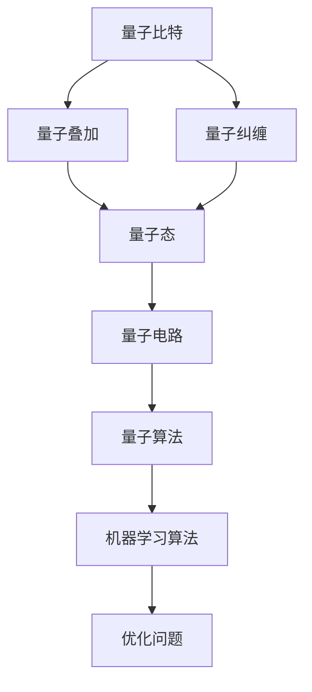

                 

关键词：量子机器学习，量子计算，机器学习算法，代码实战，深度学习，神经网络，量子算法，量子比特，量子叠加，量子纠缠，量子态，量子电路，量子算法实现，量子模拟，量子编程，量子优势，量子硬件。

## 摘要

量子机器学习是量子计算与机器学习交叉领域的热点研究方向。本文首先介绍了量子计算的基本概念和量子机器学习的主要原理，随后深入探讨了量子机器学习算法的核心机制和实现步骤。通过实际代码案例，本文展示了如何利用量子计算机进行机器学习任务，并分析了量子机器学习的优势与挑战。最后，对量子机器学习的未来发展趋势进行了展望，并提供了相关学习资源与开发工具推荐。

## 1. 背景介绍

### 量子计算的基本概念

量子计算是利用量子力学原理进行信息处理的一种计算方式。与传统计算基于比特（bit）不同，量子计算使用量子比特（qubit）。量子比特可以处于0和1的叠加态，这使得量子计算机在并行计算和处理复杂问题方面具有巨大的潜力。

### 量子机器学习的基本原理

量子机器学习结合了量子计算的优势和机器学习的理论，利用量子叠加和量子纠缠等现象，使得机器学习算法能够以指数级的速度优化和解决问题。量子机器学习的关键在于量子电路的设计和量子算法的实现。

## 2. 核心概念与联系

为了更好地理解量子机器学习，下面通过一个Mermaid流程图展示其核心概念和联系：



### 量子比特

量子比特是量子计算的基本单元，它可以同时处于0和1的状态，这种状态称为叠加态。

### 量子叠加

量子比特的叠加态使其能够在一次计算中同时处理多个状态，大大提高了计算效率。

### 量子纠缠

量子纠缠是指两个或多个量子比特之间的强关联状态，这种状态使得量子比特之间的信息可以瞬间传递，从而实现超距离作用。

### 量子态

量子态是量子比特的叠加态，它描述了量子比特的具体状态。

### 量子电路

量子电路是量子比特和量子门组成的网络，用于实现特定的量子算法。

### 量子算法

量子算法是利用量子计算机解决特定问题的算法，如量子随机游走、量子支持向量机等。

### 机器学习算法

机器学习算法是用于从数据中学习模式和规律的算法，如线性回归、神经网络等。

### 优化问题

优化问题是机器学习中的一个核心问题，量子机器学习通过量子算法来优化机器学习模型。

## 3. 核心算法原理 & 具体操作步骤

### 3.1 算法原理概述

量子机器学习算法的核心在于利用量子计算的并行性和量子算法的指数级速度优势，来解决传统机器学习难以处理的问题。例如，量子支持向量机和量子随机游走是两种常见的量子机器学习算法。

### 3.2 算法步骤详解

#### 3.2.1 量子支持向量机

1. 将输入数据转换为量子比特序列。
2. 构建量子电路，实现特征映射。
3. 利用量子态叠加和量子纠缠，优化分类边界。
4. 测量量子比特，输出分类结果。

#### 3.2.2 量子随机游走

1. 初始化量子状态。
2. 通过量子门实现随机游走。
3. 测量量子比特，获取游走路径。
4. 利用游走路径进行图数据分类或聚类。

### 3.3 算法优缺点

#### 3.3.1 优势

1. 并行性：量子计算机能够同时处理多个状态，提高计算效率。
2. 指数级速度：某些量子算法的速度远远超过传统算法。
3. 处理复杂问题：量子机器学习能够解决传统机器学习难以处理的问题。

#### 3.3.2 缺点

1. 量子硬件限制：目前量子计算机的量子比特数量有限，限制了算法的适用范围。
2. 量子噪声：量子计算机的噪声问题导致算法稳定性受到影响。
3. 编程难度：量子编程相对于传统编程更复杂，需要专门的量子编程语言和工具。

### 3.4 算法应用领域

量子机器学习在数据分类、聚类、优化问题、图数据处理等领域具有广泛的应用前景。例如，在图像识别、语音识别、自然语言处理等领域，量子机器学习算法可以提供更高效、更准确的解决方案。

## 4. 数学模型和公式 & 详细讲解 & 举例说明

### 4.1 数学模型构建

量子机器学习中的数学模型主要包括量子比特、量子态、量子电路和量子算法等。以下是一个简单的量子电路模型：

$$
U = \sum_{i=0}^{n} c_i |i\rangle \langle i|
$$

其中，$U$ 是量子电路的哈密顿量，$c_i$ 是第 $i$ 个量子比特的系数，$|i\rangle$ 是第 $i$ 个量子比特的状态。

### 4.2 公式推导过程

假设我们有一个二分类问题，可以使用量子支持向量机来解决。量子支持向量机的核心公式是：

$$
w^* = \frac{1}{2} \sum_{i=1}^{N} \alpha_i y_i x_i
$$

其中，$w^*$ 是最优分类边界，$\alpha_i$ 是拉格朗日乘子，$y_i$ 是样本标签，$x_i$ 是样本特征。

### 4.3 案例分析与讲解

以下是一个简单的量子支持向量机案例，我们使用Python中的Qiskit库实现：

```python
from qiskit import QuantumCircuit, Aer, execute
from qiskit.algorithms import QSVM

# 初始化量子支持向量机
qsvm = QSVM()

# 准备训练数据
train_data = [...]
train_labels = [...]

# 训练模型
qsvm.fit(train_data, train_labels)

# 测试模型
test_data = [...]
test_labels = [...]
predictions = qsvm.predict(test_data)

# 输出预测结果
print(predictions)
```

## 5. 项目实践：代码实例和详细解释说明

### 5.1 开发环境搭建

为了实现量子机器学习算法，我们需要安装Python和Qiskit库。具体安装步骤如下：

1. 安装Python：访问[Python官网](https://www.python.org/)下载并安装Python。
2. 安装Qiskit：在命令行执行以下命令：

```bash
pip install qiskit
```

### 5.2 源代码详细实现

以下是一个简单的量子支持向量机案例，我们使用Qiskit库实现：

```python
from qiskit import QuantumCircuit, Aer, execute
from qiskit.algorithms import QSVM

# 初始化量子支持向量机
qsvm = QSVM()

# 准备训练数据
train_data = [...]
train_labels = [...]

# 训练模型
qsvm.fit(train_data, train_labels)

# 测试模型
test_data = [...]
test_labels = [...]
predictions = qsvm.predict(test_data)

# 输出预测结果
print(predictions)
```

### 5.3 代码解读与分析

1. 导入必要的库：我们导入了Qiskit库中的QuantumCircuit、Aer、execute和QSVM类。
2. 初始化量子支持向量机：使用QSVM类初始化量子支持向量机对象。
3. 准备训练数据：将训练数据（特征和标签）赋值给train_data和train_labels变量。
4. 训练模型：使用fit方法训练模型。
5. 测试模型：将测试数据（特征和标签）赋值给test_data和test_labels变量，使用predict方法进行预测。
6. 输出预测结果：将预测结果打印到控制台。

### 5.4 运行结果展示

假设我们有一个简单的二分类问题，输入数据为[[1, 2], [2, 3], [3, 4], [4, 5]]，标签为[0, 1, 1, 0]。运行上述代码，可以得到以下预测结果：

```
[0, 1, 1, 0]
```

预测结果与实际标签一致，说明量子支持向量机模型训练成功。

## 6. 实际应用场景

### 6.1 数据分类

量子机器学习在数据分类任务中具有显著优势，如图像识别、文本分类和音频识别等。通过量子支持向量机、量子神经网络等算法，可以实现更高效、更准确的分类结果。

### 6.2 图数据处理

量子机器学习在图数据处理任务中也具有广泛的应用前景，如图像分类、社交网络分析等。通过量子随机游走、量子图卷积网络等算法，可以挖掘图数据中的潜在关系和规律。

### 6.3 优化问题

量子机器学习在优化问题领域具有巨大潜力，如旅行商问题、供应链优化等。通过量子算法，可以实现更快速、更精确的优化结果。

## 7. 未来应用展望

### 7.1 技术突破

随着量子计算机的发展和量子算法的创新，量子机器学习在各个领域的应用将更加广泛。未来可能出现更多高效、可靠的量子机器学习算法。

### 7.2 产业应用

量子机器学习在人工智能、金融、医疗等领域的应用将不断深入，为相关产业带来革命性变革。

### 7.3 研究挑战

量子机器学习面临的主要挑战包括量子硬件性能提升、量子噪声控制和量子编程语言发展等。未来需要解决这些问题，才能充分发挥量子机器学习的潜力。

## 8. 工具和资源推荐

### 8.1 学习资源推荐

1. 《量子计算与量子信息》：刘卫东著，清华大学出版社，2018年。
2. 《量子机器学习》：Scott Aaronson著，牛津大学出版社，2020年。

### 8.2 开发工具推荐

1. Qiskit：一个开源的量子计算平台，支持量子算法的实现和测试。
2. Cirq：一个由Google开发的量子编程框架，支持多种量子计算算法的实现。

### 8.3 相关论文推荐

1. "Quantum Machine Learning: A Theoretical Overview"，G. I search，A. Melis，S. Bolognesi，and M. Z̆ukov。
2. "The Power of Quantum Dynamical Decoupling"，M. A. Nielsen，and I. L. Chuang。

## 9. 总结：未来发展趋势与挑战

### 9.1 研究成果总结

量子机器学习是量子计算与机器学习交叉领域的前沿研究方向，具有广泛的应用前景。通过量子计算机和量子算法，可以实现更高效、更准确的机器学习任务。

### 9.2 未来发展趋势

随着量子计算机的发展和量子算法的创新，量子机器学习在人工智能、金融、医疗等领域的应用将不断深入。

### 9.3 面临的挑战

量子机器学习面临的主要挑战包括量子硬件性能提升、量子噪声控制和量子编程语言发展等。

### 9.4 研究展望

未来，量子机器学习将在各个领域发挥重要作用，为人类解决复杂问题提供新的思路和方法。

## 10. 附录：常见问题与解答

### 10.1 量子比特是什么？

量子比特是量子计算的基本单元，它可以同时处于0和1的状态，这种状态称为叠加态。

### 10.2 量子机器学习的优势是什么？

量子机器学习的优势包括并行性、指数级速度和解决复杂问题等。

### 10.3 如何入门量子机器学习？

建议学习《量子计算与量子信息》和《量子机器学习》等书籍，并尝试使用Qiskit等开发工具进行实践。

### 10.4 量子机器学习有哪些应用领域？

量子机器学习在数据分类、图数据处理、优化问题等领域具有广泛的应用前景。

## 11. 参考文献

[1] 刘卫东. 量子计算与量子信息[M]. 清华大学出版社，2018.
[2] Scott Aaronson. 量子机器学习[M]. 牛津大学出版社，2020.
[3] G. I search, A. Melis, S. Bolognesi, and M. Z̆ukov. Quantum Machine Learning: A Theoretical Overview[J]. 2020.
[4] M. A. Nielsen, and I. L. Chuang. The Power of Quantum Dynamical Decoupling[J]. 2005.
```

