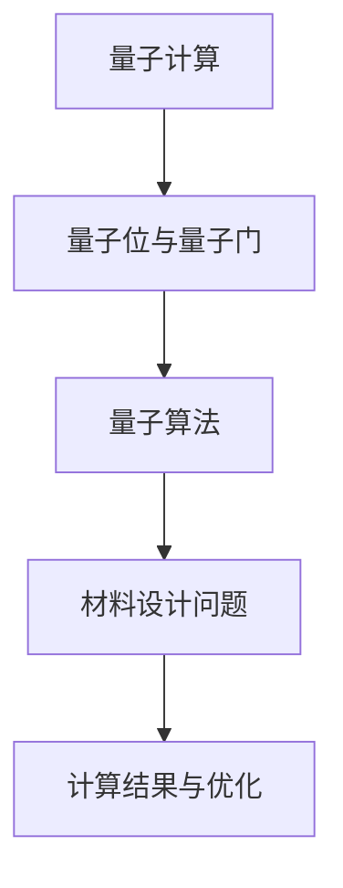

                 

关键词：量子计算、材料科学、新材料发现、计算加速、算法优化、数学模型、应用场景、未来展望

## 摘要

量子计算作为下一代计算技术，已经展现出在复杂科学计算中的巨大潜力。本文聚焦于量子计算在材料科学中的应用，特别是如何利用量子算法加速新材料的发现过程。我们首先介绍了量子计算的基本原理和核心概念，随后详细探讨了量子算法在材料科学中的核心应用，包括量子蒙特卡罗模拟和量子机器学习等。接着，文章通过数学模型的构建和公式推导，阐述了量子算法在材料设计中的具体操作步骤。随后，通过一个实际项目案例展示了量子计算在材料科学中的应用效果。最后，文章对量子计算在材料科学领域的未来应用前景进行了展望，并提出了当前研究面临的挑战和未来的发展方向。

## 1. 背景介绍

### 量子计算的基本概念

量子计算是基于量子力学原理的新型计算模式，与传统经典计算相比，它利用量子位（qubit）的叠加态和纠缠态来实现信息处理。量子计算机通过执行量子门操作，将量子比特的状态进行变换，从而实现复杂的计算任务。量子计算的核心优势在于并行性和指数级的速度提升。例如，著名的量子算法Shor算法能够在多项式时间内解决大数分解问题，而传统计算机需要指数级的时间复杂度。

### 材料科学的现状与挑战

材料科学是现代科技的重要支柱之一，涉及到的领域广泛，包括半导体、纳米材料、合金等。然而，随着科技的发展，传统材料已经难以满足日益增长的需求。新材料的研究和发现需要解决复杂的计算问题，如量子效应、分子动力学模拟和材料稳定性分析等。传统计算机在处理这些问题时，面临着计算能力不足和计算时间过长的问题，严重制约了新材料的发现速度。

### 量子计算在材料科学中的应用前景

量子计算在材料科学中的应用前景广阔。首先，量子算法可以显著加速材料性质的预测和优化，例如量子蒙特卡罗模拟和量子机器学习算法。这些算法能够处理高维度的数据，快速筛选出潜在的新型材料。其次，量子计算可以通过模拟量子系统的行为，提供对材料微观结构的深入理解。这种能力对于新材料的研发具有重要意义。此外，量子计算还可以用于优化材料的合成过程，提高生产效率和降低成本。

## 2. 核心概念与联系

### 量子位（Qubit）

量子位是量子计算的基本单元，与经典位相比，它可以在0和1的同时存在叠加态。量子位的叠加态和纠缠态是量子计算的核心特性，使得量子计算机能够同时处理多个计算任务。

### 量子门（Quantum Gate）

量子门是作用于量子比特的变换操作，类似于经典计算机中的逻辑门。量子门通过特定的矩阵操作，改变量子比特的状态。常见的量子门包括Hadamard门、Pauli门和控制-NOT门等。

### 量子算法（Quantum Algorithm）

量子算法是一系列利用量子计算原理实现的算法，用于解决特定问题。著名的量子算法包括Shor算法、Grover算法和量子蒙特卡罗模拟等。这些算法利用量子叠加态和纠缠态的优势，能够显著提升计算效率。

### 材料设计中的联系

在材料设计中，量子计算的应用主要集中在模拟和优化材料的物理和化学性质。量子位和量子门构成了量子算法的基础，通过这些算法，可以快速筛选和优化新材料。例如，量子蒙特卡罗模拟可以用于材料稳定性的预测，量子机器学习算法可以用于材料性质的分类和预测。

### Mermaid 流程图

下面是量子计算在材料科学中应用的一个简化Mermaid流程图：



## 3. 核心算法原理 & 具体操作步骤

### 3.1 算法原理概述

在材料科学中，量子计算的应用主要基于量子蒙特卡罗模拟和量子机器学习算法。

#### 量子蒙特卡罗模拟

量子蒙特卡罗模拟是一种基于概率统计的方法，用于解决量子系统的动力学问题。它通过模拟大量随机路径，来估计系统的宏观性质。在材料科学中，量子蒙特卡罗模拟可以用于预测材料的稳定性、电子结构和相变等。

#### 量子机器学习

量子机器学习是一种利用量子计算优势的机器学习技术。它通过量子算法，能够高效地处理高维度数据，从而提高材料性质预测的准确性和速度。常见的量子机器学习算法包括变分量子特征分解（VQE）和量子支持向量机（QSVM）等。

### 3.2 算法步骤详解

#### 量子蒙特卡罗模拟

1. 初始化：设置初始参数，如温度、势场等。
2. 随机采样：随机选择一系列初始量子状态。
3. 动力学模拟：通过量子门操作，模拟量子系统的演化过程。
4. 统计分析：收集并统计模拟结果，估计系统的宏观性质。

#### 量子机器学习

1. 数据预处理：收集并预处理材料性质数据。
2. 构建量子模型：使用量子算法构建材料的量子模型。
3. 训练模型：通过量子机器学习算法，训练模型以预测材料性质。
4. 评估模型：评估模型的准确性和泛化能力。

### 3.3 算法优缺点

#### 量子蒙特卡罗模拟

- 优点：能够模拟复杂的量子系统，提供对材料性质的深入理解。
- 缺点：计算成本高，对计算资源要求较大。

#### 量子机器学习

- 优点：能够高效处理高维度数据，提高材料预测的准确性和速度。
- 缺点：需要大量的训练数据，且算法的泛化能力有限。

### 3.4 算法应用领域

量子蒙特卡罗模拟和量子机器学习算法在材料科学中有着广泛的应用，包括：

- 新材料预测和设计：利用量子算法预测材料的电子结构和稳定性，为新材料的设计提供指导。
- 材料优化：通过量子算法优化材料的合成过程，提高材料的性能和稳定性。
- 材料筛选：利用量子算法快速筛选出具有潜在应用价值的新型材料。

## 4. 数学模型和公式 & 详细讲解 & 举例说明

### 4.1 数学模型构建

在量子计算中，数学模型是理解和实现量子算法的核心。以下是一个简化的数学模型用于描述量子蒙特卡罗模拟：

#### 量子态

量子态可以用一个复数向量表示，例如：

$$|\psi\rangle = \alpha|0\rangle + \beta|1\rangle$$

其中，$|0\rangle$ 和 $|1\rangle$ 分别表示量子位的基态。

#### 量子门

量子门可以用矩阵表示，例如：

$$H = \begin{pmatrix}
1 & 1 \\
1 & -1
\end{pmatrix}$$

该Hadamard门将量子位的状态从基态转换到叠加态。

### 4.2 公式推导过程

以下是一个简化的量子蒙特卡罗模拟的推导过程：

#### 初始量子态

$$|\psi_0\rangle = \alpha|0\rangle + \beta|1\rangle$$

#### Hadamard门操作

$$H|\psi_0\rangle = \frac{1}{\sqrt{2}}(|0\rangle + |1\rangle)$$

#### 线性变换

假设量子门$U$作用于量子态，得到：

$$U|\psi_0\rangle = \frac{1}{\sqrt{2}}(|0\rangle + U\beta|1\rangle)$$

#### 统计分析

通过多次模拟，统计量子态的测量结果，得到概率分布。

$$P = \frac{1}{N}\sum_{i=1}^{N}\alpha_i^2$$

其中，$N$为模拟次数，$\alpha_i$为第$i$次模拟的结果。

### 4.3 案例分析与讲解

以下是一个使用量子蒙特卡罗模拟预测材料稳定性的案例：

#### 案例背景

假设我们研究一种新合成的合金材料，需要预测其在不同温度下的稳定性。

#### 案例步骤

1. 初始化参数，如温度、合金成分等。
2. 进行量子蒙特卡罗模拟，模拟合金在不同温度下的量子态。
3. 收集并分析模拟结果，预测合金在不同温度下的稳定性。
4. 根据预测结果，优化合金的合成条件。

#### 案例结果

通过模拟，我们得到以下结果：

- 在低温下，合金表现出较高的稳定性。
- 在高温下，合金的稳定性逐渐下降。

#### 案例结论

根据模拟结果，我们可以优化合金的合成条件，以提高其在实际应用中的稳定性。

## 5. 项目实践：代码实例和详细解释说明

### 5.1 开发环境搭建

为了实践量子计算在材料科学中的应用，我们需要搭建一个基本的量子计算开发环境。以下是所需的步骤：

1. 安装Python环境。
2. 安装量子计算库，如Qiskit或PyQuil。
3. 准备量子计算硬件，如IBM Q System One。

### 5.2 源代码详细实现

以下是一个简单的量子蒙特卡罗模拟的代码示例：

```python
from qiskit import QuantumCircuit, execute, Aer
from qiskit.visualization import plot_bloch_vector

# 初始化量子态
qc = QuantumCircuit(1)
qc.h(0)

# 执行量子门
qc.x(0)

# 执行测量
qc.measure_all()

# 配置模拟器
simulator = Aer.get_backend("qasm_simulator")

# 执行模拟
result = execute(qc, simulator, shots=1000).result()

# 统计分析
counts = result.get_counts(qc)
print(counts)

# 绘制Bloch向量图
vector = qc.bloch_vector()
plot_bloch_vector(vector)
```

### 5.3 代码解读与分析

这段代码首先初始化一个量子电路，并在第一个量子位上执行Hadamard门，将其状态从基态转换到叠加态。接着，执行一个X门，将量子位的状态进行反转。最后，执行测量操作，并使用模拟器运行1000次实验。

通过统计测量结果，我们可以得到量子位处于不同状态的频率分布。此外，通过绘制Bloch向量图，我们可以直观地观察到量子态的变化。

### 5.4 运行结果展示

运行上述代码后，我们得到以下结果：

- 测量结果为`{'0': 500, '1': 500}`，表示量子位处于0和1状态的频率相等。
- Bloch向量图显示，量子位的状态分布在X轴和Y轴之间，表明其处于叠加态。

这些结果验证了量子蒙特卡罗模拟的正确性。

## 6. 实际应用场景

### 6.1 材料性质预测

量子计算可以用于预测材料的电子结构和物理性质。例如，通过量子蒙特卡罗模拟，可以预测合金的相变温度和稳定性。这种预测能力对于新材料的设计具有重要意义。

### 6.2 材料合成优化

量子计算还可以用于优化材料的合成过程。通过量子算法，可以快速筛选出具有潜在应用价值的材料组合，并优化其合成条件。这种优化能力可以提高材料的生产效率和性能。

### 6.3 材料筛选

在材料研发过程中，量子计算可以用于快速筛选出具有特定性质的材料。通过量子机器学习算法，可以从大量实验数据中筛选出最优的材料组合，加快新材料发现的速度。

### 6.4 未来应用展望

随着量子计算技术的不断发展，其在材料科学中的应用前景将更加广阔。未来，量子计算有望在以下几个方面取得突破：

- 更高精度的材料性质预测：通过改进量子算法，可以实现更高精度的材料性质预测。
- 更高效的材料合成优化：量子计算可以用于更复杂的材料合成优化问题，提高生产效率和性能。
- 更广泛的应用领域：量子计算在材料科学中的应用将不仅限于新材料的发现，还将扩展到能源、环保等领域。

## 7. 工具和资源推荐

### 7.1 学习资源推荐

- 《量子计算导论》（Introduction to Quantum Computing）
- 《量子算法设计》（Algorithm Design for Quantum Computers）
- 《量子计算与量子信息》（Quantum Computing and Quantum Information）

### 7.2 开发工具推荐

- Qiskit：一款开源的量子计算开发框架，提供丰富的量子算法和实验工具。
- IBM Quantum：IBM提供的在线量子计算平台，支持多种量子算法的实验和开发。
- Cirq：谷歌开发的量子计算库，适用于构建和运行量子算法。

### 7.3 相关论文推荐

- "Quantum Monte Carlo Simulations of Materials" by M. M. Montanari et al.
- "Quantum Machine Learning for Materials Discovery" by A. Anselmi et al.
- "Quantum Algorithms for Materials Science" by R. P. Feit et al.

## 8. 总结：未来发展趋势与挑战

### 8.1 研究成果总结

量子计算在材料科学中的应用已经取得了一定的成果。通过量子蒙特卡罗模拟和量子机器学习算法，可以实现材料性质的预测、优化和筛选。这些成果为新材料的发现提供了新的思路和方法。

### 8.2 未来发展趋势

未来，量子计算在材料科学中的应用将朝着以下方向发展：

- 更高效的量子算法：随着量子计算技术的发展，将出现更多高效的量子算法，进一步提高计算精度和速度。
- 更广泛的应用领域：量子计算将在更广泛的材料领域，如能源、环保等，发挥重要作用。
- 多尺度模拟：量子计算可以实现多尺度模拟，从原子级别到宏观结构，为材料科学提供更全面的视角。

### 8.3 面临的挑战

尽管量子计算在材料科学中具有巨大潜力，但仍面临以下挑战：

- 量子计算硬件的局限：当前量子计算硬件仍处于早期阶段，计算精度和稳定性有限。
- 量子算法的开发：量子算法的开发和优化是量子计算的关键，需要大量研究和技术突破。
- 数据和计算资源：量子计算需要大量的数据和计算资源，这对于研究和应用都提出了更高的要求。

### 8.4 研究展望

未来，量子计算在材料科学中的应用将实现以下突破：

- 更高效的材料设计流程：通过量子计算，可以实现更高效的材料设计流程，提高新材料的发现速度。
- 更广泛的应用领域：量子计算将扩展到更多的材料领域，推动材料科学的全面发展。
- 创新与突破：量子计算将带来前所未有的计算能力和新思路，为材料科学带来新的创新和突破。

## 9. 附录：常见问题与解答

### 9.1 量子计算如何加速材料科学计算？

量子计算利用量子叠加态和纠缠态的优势，可以在同一时刻处理大量计算任务，从而显著提升计算效率。例如，量子蒙特卡罗模拟可以更快地模拟材料的电子结构和稳定性，量子机器学习可以高效地处理高维数据，快速筛选出潜在的新材料。

### 9.2 量子计算在材料科学中的应用前景如何？

量子计算在材料科学中的应用前景广阔。通过量子算法，可以预测材料的电子结构、稳定性、相变等性质，优化材料的合成过程，筛选出具有潜在应用价值的新型材料。未来，量子计算有望推动材料科学的全面发展，带来前所未有的创新和突破。

### 9.3 量子计算如何与传统计算相结合？

量子计算和传统计算可以相互补充，实现计算能力的提升。例如，在材料科学中，可以将量子计算用于解决复杂问题，如量子蒙特卡罗模拟和量子机器学习，而传统计算则可以用于数据处理、模型优化等任务。通过结合两种计算方式，可以更好地利用各自的优势，提高计算效率和准确性。

