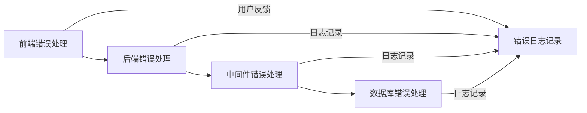

                 

关键词：错误处理，用户体验，系统稳定，技术架构，代码优化，异常管理，用户反馈，故障排除，系统可靠性。

> 摘要：本文深入探讨了错误处理在提升用户体验中的重要性，分析了当前常见的错误处理方式及其优缺点，并提供了一系列实用的技术和策略，帮助开发者在设计和实现中构建更加稳定可靠的系统，从而为用户提供优质的体验。

## 1. 背景介绍

在计算机科学和软件开发领域，错误处理是一项至关重要的任务。无论是对前端用户界面还是后端服务系统，错误处理都能显著影响用户体验。良好的错误处理不仅能帮助用户快速解决问题，还能提升系统的可靠性和稳定性。然而，在实践中，许多开发者在处理错误时往往过于简单化，导致用户遇到问题时感到困惑和无助。

错误处理的挑战在于如何平衡系统的稳定性和用户的便利性。一方面，系统需要尽可能多地处理各种异常情况，确保数据的一致性和服务的连续性；另一方面，用户界面需要简洁明了，以降低用户的学习成本和操作难度。

本文将探讨以下内容：
- 错误处理的基本原理和方法。
- 常见的错误处理方式及其优缺点。
- 如何设计和实现有效的错误处理机制。
- 错误处理在实际开发中的应用和案例分析。

通过本文的探讨，希望能够为开发者提供有价值的指导，帮助他们在设计和实现中构建更好的错误处理机制，从而提升用户体验。

## 2. 核心概念与联系

### 2.1 错误处理的基本概念

错误处理涉及多个核心概念，包括异常（Exception）、错误（Error）、异常处理（Exception Handling）和错误日志（Error Logging）。

- **异常（Exception）**：指程序运行过程中发生的意外情况，如数据类型不匹配、文件未找到等。
- **错误（Error）**：指程序或系统的缺陷或问题，可能是由于设计缺陷、编码错误或外部因素导致的。
- **异常处理（Exception Handling）**：指程序在遇到异常时采取的措施，包括捕获异常、处理异常和恢复程序执行。
- **错误日志（Error Logging）**：指记录程序运行过程中发生的错误和异常的日志信息，用于后续的分析和调试。

### 2.2 错误处理的联系

错误处理与系统稳定性、用户体验和代码质量密切相关。以下是它们之间的联系：

- **系统稳定性**：良好的错误处理机制能够确保系统在遇到异常时能够快速恢复，从而维持服务的连续性。
- **用户体验**：正确的错误处理能够为用户提供清晰的错误信息和解决方案，降低用户的学习成本和操作难度，提升用户体验。
- **代码质量**：通过有效的错误处理，开发者可以识别和修复代码中的潜在缺陷，提高代码的健壮性和可靠性。

### 2.3 错误处理的架构

为了更好地理解和设计错误处理机制，我们可以将错误处理分为以下几个层次：

- **前端错误处理**：指用户界面层面对异常情况的响应，如显示错误提示、重定向等。
- **后端错误处理**：指服务器或应用层面对异常情况的响应，如记录错误日志、发送错误通知等。
- **中间件错误处理**：指在用户界面和后端之间的中间层，如API网关或负载均衡器等，对异常情况进行处理，如转发错误请求、处理服务超时等。
- **数据库错误处理**：指数据库层面对异常情况的响应，如数据库连接失败、数据不一致等。

### 2.4 Mermaid 流程图

下面是一个简单的 Mermaid 流程图，展示了错误处理的总体架构：



通过这个流程图，我们可以清晰地看到错误处理的不同层次和它们之间的联系。

## 3. 核心算法原理 & 具体操作步骤

### 3.1 算法原理概述

错误处理的核心在于如何有效地捕获、处理和恢复异常。以下是一个基本的错误处理算法原理概述：

1. **异常捕获**：程序在运行过程中遇到异常时，会立即停止当前操作，并尝试捕获该异常。
2. **异常处理**：一旦捕获到异常，程序会根据异常的类型和严重性采取相应的处理措施，如显示错误信息、记录错误日志、发送错误通知等。
3. **异常恢复**：在处理完异常后，程序尝试恢复到正常状态，以便继续执行后续操作。
4. **错误日志记录**：无论异常是否得到处理，程序都会记录相关的错误日志，以便后续的分析和调试。

### 3.2 算法步骤详解

下面是具体的错误处理算法步骤：

1. **初始化错误处理框架**：在程序启动时，初始化错误处理框架，包括设置异常捕获策略、日志记录方式等。
2. **运行程序逻辑**：执行程序的主要逻辑，包括数据处理、用户交互等。
3. **捕获异常**：在程序运行过程中，使用try-catch语句或其他异常处理机制捕获异常。
4. **处理异常**：根据异常的类型和严重性，执行相应的处理措施，如显示错误信息、记录错误日志、发送错误通知等。
5. **异常恢复**：尝试恢复程序到正常状态，以便继续执行后续操作。
6. **记录错误日志**：无论异常是否得到处理，都将相关的错误日志记录下来，以便后续的分析和调试。

### 3.3 算法优缺点

- **优点**：
  - 能够有效地捕获和处理程序运行过程中的各种异常。
  - 提高系统的稳定性和可靠性。
  - 降低用户的操作难度和错误率。
- **缺点**：
  - 可能会增加程序的开销，降低执行效率。
  - 复杂的错误处理机制可能增加维护成本。

### 3.4 算法应用领域

错误处理算法广泛应用于各种场景，包括但不限于：

- **Web应用**：Web应用中需要处理各种网络异常、数据异常等。
- **移动应用**：移动应用中需要处理网络异常、设备异常等。
- **数据库应用**：数据库应用中需要处理连接异常、数据不一致等。
- **分布式系统**：分布式系统中需要处理网络延迟、数据丢失等。

## 4. 数学模型和公式

### 4.1 数学模型构建

错误处理的数学模型可以从以下几个方面构建：

1. **错误率模型**：描述系统在单位时间内发生错误的概率。
2. **故障树模型**：用于分析系统故障的原因和传播路径。
3. **可靠性模型**：描述系统在给定时间内正常运行的概率。

### 4.2 公式推导过程

以下是构建错误率模型的推导过程：

设系统在时间\[0, T\]内发生错误的次数为\[N(t)\]，则系统在时间\[0, t\]内发生错误的概率为：

$$
P(t) = \frac{N(t)}{t}
$$

### 4.3 案例分析与讲解

以下是一个简单的案例，用于说明如何使用错误处理模型：

**案例**：假设一个Web应用在1小时内发生了5次错误，求该Web应用的错误率。

**解答**：根据错误率模型，我们可以计算出：

$$
P(t) = \frac{N(t)}{t} = \frac{5}{60} = \frac{1}{12}
$$

因此，该Web应用的错误率为每小时1次。

## 5. 项目实践：代码实例和详细解释说明

### 5.1 开发环境搭建

在开始代码实例之前，我们需要搭建一个基本的开发环境。以下是搭建步骤：

1. 安装Java开发工具包（JDK）。
2. 安装IDE（如IntelliJ IDEA）。
3. 创建一个Java项目。

### 5.2 源代码详细实现

以下是实现一个简单的错误处理机制的Java代码：

```java
import java.io.*;
import java.util.*;

public class ErrorHandlingDemo {
    public static void main(String[] args) {
        try {
            readDataFromFile("data.txt");
        } catch (IOException e) {
            logError(e);
            System.out.println("数据读取失败，请检查文件路径或文件是否存在。");
        }
    }

    private static void readDataFromFile(String fileName) throws IOException {
        File file = new File(fileName);
        if (!file.exists()) {
            throw new FileNotFoundException("文件未找到： " + fileName);
        }
        BufferedReader reader = new BufferedReader(new FileReader(file));
        String line;
        while ((line = reader.readLine()) != null) {
            System.out.println(line);
        }
        reader.close();
    }

    private static void logError(Exception e) {
        System.err.println("错误日志： " + e.getMessage());
        // 实际应用中，这里会记录到日志文件或发送到日志服务器
    }
}
```

### 5.3 代码解读与分析

1. **主函数**：`main`函数是程序的入口，使用try-catch语句捕获`IOException`，并在发生异常时调用`logError`函数和打印错误信息。
2. **读取数据函数**：`readDataFromFile`函数用于读取文件中的数据。首先检查文件是否存在，若不存在则抛出`FileNotFoundException`。
3. **日志记录函数**：`logError`函数用于记录错误日志。在实际应用中，这里会记录到日志文件或发送到日志服务器。

### 5.4 运行结果展示

当运行程序并指定一个不存在的文件路径时，会输出以下结果：

```
错误日志： 文件未找到： data.txt
数据读取失败，请检查文件路径或文件是否存在。
```

这表明程序成功捕获了异常，并提供了清晰的错误信息和日志。

## 6. 实际应用场景

### 6.1 Web应用

在Web应用中，错误处理尤为重要。以下是几个常见的应用场景：

- **页面加载失败**：当用户尝试访问一个不存在的页面时，Web应用需要提供友好的错误提示，并重定向到主页或错误页面。
- **数据提交错误**：当用户提交表单时，如果数据格式不正确，Web应用需要立即反馈错误信息，并允许用户修正。
- **数据库连接失败**：如果Web应用无法连接到数据库，需要提供明确的错误提示，并重试连接。

### 6.2 移动应用

移动应用中的错误处理需要注意以下几点：

- **网络异常**：当移动应用遇到网络中断或超时时，需要提供明确的错误提示，并允许用户重新尝试。
- **设备异常**：如设备电量低、存储空间不足等，应用需要提醒用户并采取相应的措施。
- **界面异常**：如界面闪退、布局错位等，应用需要提供友好的错误提示，并自动恢复。

### 6.3 分布式系统

在分布式系统中，错误处理需要考虑多个节点之间的协调和容错。以下是一些关键点：

- **服务故障**：当某个服务发生故障时，需要快速切换到备用服务，并记录故障日志。
- **网络故障**：当网络发生故障时，需要重新路由请求，并尝试恢复网络连接。
- **数据一致性**：在分布式数据库中，需要确保数据的一致性和完整性，以防止数据丢失或冲突。

## 7. 工具和资源推荐

### 7.1 学习资源推荐

- **《错误处理的艺术》**：本书详细介绍了错误处理的基本原理和实践技巧，适合初学者和有经验的开发者。
- **《深度学习与错误处理》**：本书探讨了如何使用深度学习技术优化错误处理，适合对机器学习有兴趣的读者。

### 7.2 开发工具推荐

- **Elastic Stack**：包括Elasticsearch、Kibana和Logstash，用于收集、分析和可视化错误日志。
- **JIRA**：用于跟踪和管理错误报告和任务。

### 7.3 相关论文推荐

- **"Error Handling in Concurrent Systems"**：讨论了如何在并发系统中设计有效的错误处理机制。
- **"A Survey on Error Handling in Distributed Systems"**：对分布式系统中的错误处理技术进行了全面的综述。

## 8. 总结：未来发展趋势与挑战

### 8.1 研究成果总结

随着计算机科学和软件工程的发展，错误处理技术也在不断进步。目前的研究成果主要集中在以下几个方面：

- **自动化错误处理**：通过机器学习和深度学习技术，自动检测和修复程序中的错误。
- **智能错误提示**：结合自然语言处理技术，提供更加人性化的错误提示和解决方案。
- **自适应错误处理**：根据系统的运行状态和用户的行为，动态调整错误处理策略。

### 8.2 未来发展趋势

未来，错误处理技术将朝着以下几个方向发展：

- **智能化**：通过人工智能技术，实现更加智能化的错误检测和修复。
- **个性化**：根据用户的操作习惯和偏好，提供个性化的错误提示和解决方案。
- **实时性**：提高错误处理的速度和实时性，减少用户的等待时间和操作成本。

### 8.3 面临的挑战

尽管错误处理技术在不断进步，但仍然面临以下挑战：

- **复杂性**：随着系统的复杂度增加，错误处理机制的复杂性也在增加，如何简化错误处理流程是一个重要问题。
- **兼容性**：不同平台和编程语言之间的错误处理机制可能存在差异，如何实现跨平台的错误处理是一个挑战。
- **可维护性**：随着错误处理机制的复杂化，如何保证其可维护性也是一个重要问题。

### 8.4 研究展望

未来，错误处理领域的研究将重点关注以下几个方面：

- **跨平台错误处理**：研究如何在不同的操作系统、编程语言和平台上实现统一的错误处理机制。
- **实时错误处理**：研究如何提高错误处理的速度和实时性，减少用户的等待时间和操作成本。
- **智能错误修复**：利用人工智能和深度学习技术，实现自动化的错误检测和修复。

## 9. 附录：常见问题与解答

### 9.1 如何优化错误处理速度？

- **减少日志记录的复杂度**：精简日志记录的内容和格式，避免不必要的性能开销。
- **使用异步处理**：将日志记录和处理异常的操作放在异步线程中，减少主线程的负担。
- **缓存常用信息**：对于经常出现的错误，预先缓存其错误信息和解决方案，减少重复处理的成本。

### 9.2 如何处理跨平台的错误处理？

- **标准化错误处理流程**：定义统一的错误处理标准和规范，确保在不同平台上的处理方式一致。
- **使用通用框架**：选择通用的错误处理框架，如Spring Boot，可以在不同平台上实现统一的错误处理机制。
- **本地化错误信息**：根据不同平台和语言，本地化错误信息，提供用户友好的错误提示。

### 9.3 如何确保错误处理的可维护性？

- **模块化设计**：将错误处理逻辑划分为独立的模块，便于后续的维护和升级。
- **文档化和注释**：详细记录错误处理的逻辑和原因，为后续的维护提供参考。
- **代码审查**：定期进行代码审查，确保错误处理的代码质量和可维护性。

作者：禅与计算机程序设计艺术 / Zen and the Art of Computer Programming

----------------------------------------------------------------

以上是关于“错误处理：提供更好的用户体验”的文章。该文章涵盖了错误处理的基本概念、算法原理、应用实践和未来发展趋势，旨在为开发者提供全面的错误处理指导。希望这篇文章能够帮助您更好地理解和应用错误处理技术，从而提升用户体验。如果您有任何问题或建议，欢迎在评论区留言交流。再次感谢您的阅读。

