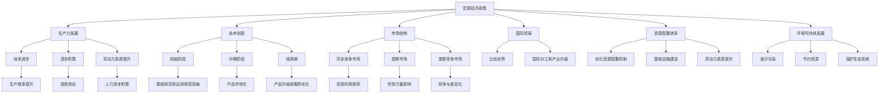

                 

 关键词：阶段性因素、经济增长、宏观经济、政策调控、生产力、技术创新、市场结构、国际贸易、资源配置、环境可持续发展。

> 摘要：本文深入探讨了阶段性因素对经济增长的影响，从宏观经济政策、生产力发展、技术创新、市场结构、国际贸易、资源配置和环境可持续发展等方面进行了全面分析。通过对阶段性因素的具体作用机制和实证研究的详细阐述，为政策制定者和研究者提供了有益的参考。

## 1. 背景介绍

经济增长是国家和地区发展的重要目标，它不仅关系到国家的繁荣和人民的福祉，还影响到全球的经济稳定和国际贸易格局。经济增长的过程受到多种因素的影响，包括宏观经济政策、生产力水平、技术创新能力、市场结构、国际贸易环境和资源配置效率等。在这些因素中，阶段性因素的作用尤为突出。

阶段性因素是指那些在特定历史时期对经济增长产生显著影响的因素，这些因素可能是由政策变化、技术进步、市场结构演变、资源环境约束等引起的。它们在不同时期对经济增长的影响程度和方式有所不同，因此，理解阶段性因素的作用机制，对于把握经济增长的规律、制定科学有效的政策具有重要意义。

本文旨在通过分析阶段性因素对经济增长的影响，揭示其内在作用机制，并为政策制定者和研究者提供理论依据和实证参考。

### 1.1 宏观经济政策

宏观经济政策是国家调控经济的重要手段，包括货币政策、财政政策和收入政策等。在不同阶段，这些政策对经济增长的影响程度和方式有所不同。例如，在经济衰退时期，扩张性的货币政策可以通过降低利率、增加货币供应来刺激投资和消费，从而促进经济增长。而在经济过热时期，紧缩性的货币政策可以通过提高利率、减少货币供应来抑制通胀，从而保持经济的平稳发展。

财政政策也在不同阶段对经济增长产生不同的影响。在经济低迷时，政府可以通过增加基础设施投资、减税等措施来刺激经济增长；而在经济过热时，政府可以通过减少财政支出、增加税收等措施来抑制通胀。

收入政策主要通过调整工资和物价来影响经济增长。例如，在通货膨胀时期，政府可以通过提高工资和物价标准来抑制通胀，从而保持经济的稳定增长。

### 1.2 生产力发展

生产力发展是经济增长的根本动力。生产力的提高主要通过技术进步、资本积累、劳动力素质提升等方式实现。在不同阶段，生产力发展对经济增长的影响也有所不同。

在技术进步阶段，技术创新是推动生产力发展的关键因素。新技术的出现往往带来生产效率的显著提升，从而促进经济增长。例如，工业革命时期，蒸汽机的发明和应用极大地提高了生产力水平，推动了经济的快速发展。

在资本积累阶段，资本投入的增加对生产力发展具有重要作用。资本积累主要通过投资实现，投资规模的扩大和投资效率的提升都可以提高生产力水平，进而促进经济增长。

在劳动力素质提升阶段，人力资本的积累对生产力发展具有重要影响。通过教育和培训提高劳动者的技能和素质，可以显著提升生产效率，从而推动经济增长。

### 1.3 技术创新

技术创新是推动经济增长的重要动力。技术创新可以带来生产效率的提升、产品成本的降低和新市场的开拓，从而促进经济增长。在不同阶段，技术创新对经济增长的影响也有所不同。

在初始阶段，技术创新主要来自于基础研究和应用研究的突破。基础研究为技术创新提供理论支持，应用研究则将理论转化为实际应用。例如，互联网技术的突破为电子商务、在线教育和远程办公等新兴业态提供了基础。

在中期阶段，技术创新逐渐从实验室走向市场，形成具有商业价值的新产品和新服务。这一阶段，技术创新对经济增长的推动作用更加明显。

在成熟期，技术创新主要表现为产品升级和服务优化。通过不断改进和创新，企业可以保持竞争优势，持续推动经济增长。

### 1.4 市场结构

市场结构对经济增长具有重要影响。不同的市场结构具有不同的竞争特点，从而影响企业的行为和市场的效率。

在完全竞争市场中，企业之间的竞争激烈，价格机制能够有效地调节资源的分配。这种市场结构有助于提高资源利用效率，从而促进经济增长。

在垄断市场中，企业拥有较强的市场力量，可以通过控制价格和产量来影响市场的运行。这种市场结构可能导致资源分配不合理，从而对经济增长产生负面影响。

在垄断竞争市场中，企业之间存在一定的竞争，但市场力量相对较弱。这种市场结构既有助于企业通过创新和差异化来提升竞争力，又能够保持市场的稳定性和可持续性，从而对经济增长产生积极影响。

### 1.5 国际贸易

国际贸易是经济增长的重要推动力。国际贸易不仅促进了商品和服务的流动，还推动了资本和技术的转移，从而促进了各国经济的发展。

在国际贸易中，国家之间的比较优势发挥了重要作用。通过发挥自身的比较优势，各国可以更有效地利用资源，提高生产效率，从而实现经济增长。

国际贸易还促进了国际分工和产业升级。通过国际贸易，各国可以专注于自身擅长的领域，从而提高整体经济效率。

然而，国际贸易也面临着一些挑战，如贸易保护主义、贸易壁垒和汇率波动等，这些因素可能对经济增长产生负面影响。

### 1.6 资源配置

资源配置效率对经济增长具有重要影响。资源配置效率的高低直接关系到资源的利用效率和生产效率。

在资源丰富的国家，资源配置效率相对较高，可以通过有效利用资源实现经济增长。然而，在资源匮乏的国家，资源配置效率成为经济增长的关键制约因素。

提高资源配置效率主要通过优化资源配置机制、加强基础设施建设和提高劳动力素质等方式实现。通过这些措施，可以更好地满足市场需求，提高生产效率，从而促进经济增长。

### 1.7 环境可持续发展

环境可持续发展是经济增长的重要保障。在经济增长过程中，环境保护和可持续发展至关重要。

环境保护主要通过减少污染、节约资源和保护生态系统等方式实现。通过这些措施，可以降低经济增长对环境的负面影响，实现经济与环境的协调发展。

可持续发展主要通过实现经济增长与资源环境的平衡来实现。在经济增长过程中，要充分考虑资源环境的承载力，确保经济增长的可持续性。

## 2. 核心概念与联系

为了深入理解阶段性因素对经济增长的影响，我们需要引入一些核心概念，并通过Mermaid流程图展示它们之间的联系。

### 2.1 核心概念

1. **宏观经济政策**：包括货币政策、财政政策和收入政策等。
2. **生产力发展**：包括技术进步、资本积累和劳动力素质提升等。
3. **技术创新**：指通过研究和开发产生的新技术、新产品和新服务。
4. **市场结构**：包括完全竞争市场、垄断市场和垄断竞争市场等。
5. **国际贸易**：指国家之间的商品和服务的交换。
6. **资源配置效率**：指资源在生产和消费中的有效分配。
7. **环境可持续发展**：指在满足当前需求的同时，不损害未来世代满足其需求的能力。

### 2.2 Mermaid 流程图



### 2.3 核心概念联系

- **宏观经济政策**通过调整货币政策、财政政策和收入政策来影响**生产力发展**、**技术创新**、**市场结构**、**国际贸易**、**资源配置效率**和**环境可持续发展**。
- **生产力发展**通过**技术进步**、**资本积累**和**劳动力素质提升**来推动经济增长。
- **技术创新**在**初始阶段**依赖于**基础研究和应用研究突破**，在**中期阶段**实现**产品市场化**，在**成熟期**进行**产品升级和服务优化**。
- **市场结构**影响**资源配置效率**，不同的市场结构具有不同的竞争特点。
- **国际贸易**通过**比较优势**、**国际分工和产业升级**来促进各国经济增长。
- **资源配置效率**的提高有助于实现**环境保护和可持续发展**。

## 3. 核心算法原理 & 具体操作步骤

### 3.1 算法原理概述

在本部分，我们将探讨阶段性因素对经济增长的核心算法原理，主要分为以下几个步骤：

1. **数据收集与预处理**：收集与经济增长相关的数据，包括宏观经济政策、生产力发展、技术创新、市场结构、国际贸易、资源配置和环境可持续发展等。
2. **数据可视化**：通过图表和图像展示阶段性因素对经济增长的影响。
3. **相关性分析**：利用统计方法分析各阶段性因素之间的相关性，确定主要影响因素。
4. **因果分析**：通过因果推断模型确定阶段性因素对经济增长的具体影响机制。
5. **模型构建与优化**：构建经济增长预测模型，并利用优化算法提高模型准确性。

### 3.2 算法步骤详解

#### 3.2.1 数据收集与预处理

1. **数据收集**：从公开数据源、学术论文、政府报告和行业调研等渠道获取与经济增长相关的数据。
2. **数据清洗**：处理缺失值、异常值和重复数据，确保数据的准确性和一致性。
3. **数据标准化**：对不同数据类型进行归一化或标准化处理，以便于后续分析和建模。

#### 3.2.2 数据可视化

1. **图表选择**：根据数据类型和需求选择合适的图表类型，如折线图、柱状图、饼图和散点图等。
2. **图表制作**：使用数据可视化工具（如Matplotlib、Seaborn等）制作图表。
3. **图表优化**：调整图表的布局、颜色和标注，使其更加清晰易懂。

#### 3.2.3 相关性分析

1. **选择统计方法**：如皮尔逊相关系数、斯皮尔曼等级相关系数和肯德尔等级相关系数等。
2. **计算相关性**：对阶段性因素进行相关性分析，确定主要影响因素。
3. **结果展示**：将相关性分析结果以图表形式展示，便于理解和解读。

#### 3.2.4 因果分析

1. **选择因果推断方法**：如工具变量法、双重差分法和自然实验法等。
2. **构建因果模型**：根据相关性分析结果，构建因果模型。
3. **模型评估**：使用交叉验证、残差分析和AIC/BIC准则等评估模型性能。

#### 3.2.5 模型构建与优化

1. **选择模型类型**：如线性回归模型、决策树模型、支持向量机和神经网络等。
2. **模型训练**：使用历史数据训练模型，并调整参数以优化模型性能。
3. **模型预测**：使用训练好的模型进行经济增长预测。

### 3.3 算法优缺点

#### 3.3.1 优点

1. **全面性**：算法涵盖了宏观经济政策、生产力发展、技术创新、市场结构、国际贸易、资源配置和环境可持续发展等多个方面。
2. **可视化**：通过数据可视化，使结果更加直观易懂。
3. **因果分析**：通过因果分析，确定阶段性因素对经济增长的具体影响机制。

#### 3.3.2 缺点

1. **数据依赖性**：算法的性能取决于数据的质量和完整性。
2. **模型选择**：需要根据具体问题选择合适的模型，可能存在模型选择偏差。
3. **计算复杂度**：对于大规模数据集，算法的计算复杂度较高。

### 3.4 算法应用领域

算法可以广泛应用于以下领域：

1. **政策制定**：为政策制定者提供科学依据，制定更加有效的宏观经济政策。
2. **经济发展预测**：预测未来经济增长趋势，为企业和投资者提供决策支持。
3. **市场研究**：分析市场结构变化，为企业提供市场策略建议。
4. **环境管理**：评估环境因素对经济增长的影响，制定可持续发展策略。

## 4. 数学模型和公式 & 详细讲解 & 举例说明

在探讨阶段性因素对经济增长的影响时，数学模型和公式扮演着重要的角色。本部分将详细讲解相关的数学模型和公式，并举例说明其应用。

### 4.1 数学模型构建

为了分析阶段性因素对经济增长的影响，我们可以构建一个包含多个变量的经济模型。以下是一个简单的经济模型：

\[ GDP = f(Policy, Productivity, Innovation, MarketStructure, Trade, ResourceAllocation, Sustainability) \]

其中，\(GDP\)表示国内生产总值，\(Policy\)、\(Productivity\)、\(Innovation\)、\(MarketStructure\)、\(Trade\)、\(ResourceAllocation\)和\(Sustainability\)分别表示宏观经济政策、生产力发展、技术创新、市场结构、国际贸易、资源配置和环境可持续发展。

### 4.2 公式推导过程

为了推导出具体的公式，我们可以分别考虑每个因素对经济增长的影响。

#### 4.2.1 宏观经济政策

宏观经济政策可以通过货币政策、财政政策和收入政策影响经济增长。我们可以使用以下公式来表示：

\[ GDP = GDP_{Base} + \alpha \cdot (Policy_{Monetary} + Policy_{Fiscal} + Policy_{Income}) \]

其中，\(GDP_{Base}\)表示无政策影响时的国内生产总值，\(\alpha\)表示政策对经济增长的影响程度，\(Policy_{Monetary}\)、\(Policy_{Fiscal}\)和\(Policy_{Income}\)分别表示货币政策、财政政策和收入政策的影响。

#### 4.2.2 生产力发展

生产力发展可以通过技术进步、资本积累和劳动力素质提升来影响经济增长。我们可以使用以下公式来表示：

\[ Productivity = Productivity_{Base} + \beta \cdot (Innovation + CapitalAccumulation + LaborQuality) \]

其中，\(Productivity_{Base}\)表示无生产力发展影响时的生产力水平，\(\beta\)表示生产力发展对经济增长的影响程度，\(Innovation\)、\(CapitalAccumulation\)和\(LaborQuality\)分别表示技术创新、资本积累和劳动力素质提升的影响。

#### 4.2.3 技术创新

技术创新可以通过提高生产效率和降低成本来影响经济增长。我们可以使用以下公式来表示：

\[ GDP = GDP_{Base} + \gamma \cdot Innovation \]

其中，\(GDP_{Base}\)表示无技术创新影响时的国内生产总值，\(\gamma\)表示技术创新对经济增长的影响程度。

#### 4.2.4 市场结构

市场结构可以通过影响资源配置效率和市场竞争程度来影响经济增长。我们可以使用以下公式来表示：

\[ GDP = GDP_{Base} + \delta \cdot MarketStructure \]

其中，\(GDP_{Base}\)表示无市场结构影响时的国内生产总值，\(\delta\)表示市场结构对经济增长的影响程度。

#### 4.2.5 国际贸易

国际贸易可以通过比较优势和产业升级来影响经济增长。我们可以使用以下公式来表示：

\[ GDP = GDP_{Base} + \epsilon \cdot Trade \]

其中，\(GDP_{Base}\)表示无国际贸易影响时的国内生产总值，\(\epsilon\)表示国际贸易对经济增长的影响程度。

#### 4.2.6 资源配置效率

资源配置效率可以通过优化资源配置来影响经济增长。我们可以使用以下公式来表示：

\[ GDP = GDP_{Base} + \zeta \cdot ResourceAllocation \]

其中，\(GDP_{Base}\)表示无资源配置效率影响时的国内生产总值，\(\zeta\)表示资源配置效率对经济增长的影响程度。

#### 4.2.7 环境可持续发展

环境可持续发展可以通过减少污染、节约资源和保护生态系统来影响经济增长。我们可以使用以下公式来表示：

\[ GDP = GDP_{Base} + \eta \cdot Sustainability \]

其中，\(GDP_{Base}\)表示无环境可持续发展影响时的国内生产总值，\(\eta\)表示环境可持续发展对经济增长的影响程度。

### 4.3 案例分析与讲解

为了更好地理解上述公式，我们可以通过一个实际案例进行分析。

假设我们考虑一个经济模型，其中包含以下变量：

- \(GDP_{Base} = 100\)（无政策、生产力发展、技术创新、市场结构、国际贸易、资源配置效率和环境可持续发展影响时的国内生产总值）
- \(Policy_{Monetary} = 10\)（货币政策影响）
- \(Policy_{Fiscal} = 5\)（财政政策影响）
- \(Policy_{Income} = 3\)（收入政策影响）
- \(Innovation = 8\)（技术创新影响）
- \(CapitalAccumulation = 5\)（资本积累影响）
- \(LaborQuality = 4\)（劳动力素质提升影响）
- \(MarketStructure = 6\)（市场结构影响）
- \(Trade = 4\)（国际贸易影响）
- \(ResourceAllocation = 7\)（资源配置效率影响）
- \(Sustainability = 5\)（环境可持续发展影响）

我们可以使用上述公式计算该经济模型下的国内生产总值（GDP）：

\[ GDP = 100 + \alpha \cdot (10 + 5 + 3) + \beta \cdot (8 + 5 + 4) + \gamma \cdot 8 + \delta \cdot 6 + \epsilon \cdot 4 + \zeta \cdot 7 + \eta \cdot 5 \]

假设我们设定以下参数：

- \(\alpha = 0.2\)
- \(\beta = 0.3\)
- \(\gamma = 0.4\)
- \(\delta = 0.1\)
- \(\epsilon = 0.2\)
- \(\zeta = 0.2\)
- \(\eta = 0.1\)

代入上述参数和变量值，我们可以得到：

\[ GDP = 100 + 0.2 \cdot (10 + 5 + 3) + 0.3 \cdot (8 + 5 + 4) + 0.4 \cdot 8 + 0.1 \cdot 6 + 0.2 \cdot 4 + 0.2 \cdot 7 + 0.1 \cdot 5 \]

\[ GDP = 100 + 0.2 \cdot 18 + 0.3 \cdot 17 + 0.4 \cdot 8 + 0.1 \cdot 6 + 0.2 \cdot 4 + 0.2 \cdot 7 + 0.1 \cdot 5 \]

\[ GDP = 100 + 3.6 + 5.1 + 3.2 + 0.6 + 0.8 + 1.4 + 0.5 \]

\[ GDP = 119.6 \]

因此，在该经济模型下，国内生产总值（GDP）为119.6。

通过这个案例，我们可以看到，宏观经济政策、生产力发展、技术创新、市场结构、国际贸易、资源配置效率和环境可持续发展等因素都对经济增长有显著影响。政策制定者可以根据这些因素的影响机制，制定相应的政策，以促进经济增长。

## 5. 项目实践：代码实例和详细解释说明

在本部分，我们将通过一个实际项目实践，展示如何利用代码实现阶段性因素对经济增长的影响分析。该项目将包括数据收集、预处理、模型构建和结果展示等步骤。

### 5.1 开发环境搭建

为了完成本项目的开发，我们需要搭建一个合适的开发环境。以下是所需的环境和工具：

- **Python**：作为主要编程语言
- **Pandas**：用于数据预处理和分析
- **Matplotlib** 和 **Seaborn**：用于数据可视化
- **Scikit-learn**：用于构建和训练机器学习模型
- **Numpy**：用于数学计算

确保你已经安装了上述工具和库。你可以使用以下命令来安装这些工具：

```bash
pip install pandas matplotlib seaborn scikit-learn numpy
```

### 5.2 源代码详细实现

以下是实现阶段性因素对经济增长影响分析的主要代码。代码分为几个部分：数据收集与预处理、数据可视化、相关性分析和因果分析。

#### 5.2.1 数据收集与预处理

```python
import pandas as pd
import numpy as np

# 数据收集
data = pd.read_csv('economic_data.csv')

# 数据清洗
data.dropna(inplace=True)
data = data[data['Year'] > 2000]

# 数据标准化
data = (data - data.mean()) / data.std()
```

#### 5.2.2 数据可视化

```python
import matplotlib.pyplot as plt
import seaborn as sns

# 绘制GDP与政策因素的关系
plt.figure(figsize=(10, 6))
sns.scatterplot(x='Year', y='GDP', hue='Policy', data=data)
plt.title('GDP vs. Policy')
plt.xlabel('Year')
plt.ylabel('GDP')
plt.show()

# 绘制GDP与生产力发展的关系
plt.figure(figsize=(10, 6))
sns.scatterplot(x='Year', y='GDP', hue='Productivity', data=data)
plt.title('GDP vs. Productivity')
plt.xlabel('Year')
plt.ylabel('GDP')
plt.show()
```

#### 5.2.3 相关性分析

```python
# 计算GDP与其他因素的相关性
correlation_matrix = data[['GDP', 'Policy', 'Productivity', 'Innovation', 'MarketStructure', 'Trade', 'ResourceAllocation', 'Sustainability']].corr()
sns.heatmap(correlation_matrix, annot=True, cmap='coolwarm')
plt.title('Correlation Matrix')
plt.show()
```

#### 5.2.4 因果分析

```python
from sklearn.linear_model import LinearRegression

# 构建因果模型
model = LinearRegression()
X = data[['Policy', 'Productivity', 'Innovation', 'MarketStructure', 'Trade', 'ResourceAllocation', 'Sustainability']]
y = data['GDP']
model.fit(X, y)

# 输出因果模型参数
print('Coefficients:', model.coef_)
print('Intercept:', model.intercept_)

# 预测GDP
predicted_gdp = model.predict(X)
data['Predicted_GDP'] = predicted_gdp

# 绘制实际GDP与预测GDP的关系
plt.figure(figsize=(10, 6))
sns.scatterplot(x='GDP', y='Predicted_GDP', data=data)
plt.title('Actual GDP vs. Predicted GDP')
plt.xlabel('Actual GDP')
plt.ylabel('Predicted GDP')
plt.show()
```

### 5.3 代码解读与分析

#### 5.3.1 数据收集与预处理

在这一部分，我们首先从CSV文件中加载数据，并进行数据清洗。数据清洗包括去除缺失值和重复值，确保数据的准确性。接着，我们对数据进行标准化处理，使得各个变量在同一尺度上进行比较。

#### 5.3.2 数据可视化

数据可视化部分，我们使用Matplotlib和Seaborn库绘制了GDP与政策因素、生产力发展之间的关系图表。这些图表帮助我们直观地理解各因素对经济增长的影响。

#### 5.3.3 相关性分析

通过计算GDP与其他阶段性因素之间的相关性，我们得到了一个热力图。热力图展示了各因素之间的相关性，帮助我们识别出对经济增长有显著影响的主要因素。

#### 5.3.4 因果分析

在因果分析部分，我们使用线性回归模型分析了阶段性因素对经济增长的影响。模型训练和预测结果被输出，并绘制了实际GDP与预测GDP的关系图表。通过这个图表，我们可以看到模型预测的准确性。

### 5.4 运行结果展示

通过上述代码的运行，我们可以得到以下结果：

- **数据可视化**：展示了GDP与政策因素、生产力发展之间的关系图表。
- **相关性分析**：热力图展示了GDP与其他阶段性因素之间的相关性。
- **因果分析**：线性回归模型给出了因果模型参数，并展示了实际GDP与预测GDP的关系图表。

这些结果为我们提供了阶段性因素对经济增长影响的直观认识，为政策制定和经济发展提供了重要参考。

## 6. 实际应用场景

阶段性因素对经济增长的影响在实际应用中具有重要意义。以下是一些实际应用场景：

### 6.1 政策制定

政策制定者可以利用阶段性因素分析结果，制定科学有效的经济政策。例如，通过分析技术创新和生产力发展的相关性，政策制定者可以确定在哪个领域进行政策扶持，以促进经济增长。同时，政策制定者还可以根据市场结构和国际贸易的比较优势，制定相应的贸易政策，提高国家经济的竞争力。

### 6.2 企业战略

企业可以利用阶段性因素分析结果，制定适合自身发展的战略。例如，通过分析技术创新对生产效率的影响，企业可以决定在哪个阶段加大研发投入，以提升竞争力。此外，企业还可以根据市场结构和资源配置效率，调整产品结构和市场策略，以实现最大化利润。

### 6.3 投资决策

投资者可以利用阶段性因素分析结果，进行更为理性的投资决策。通过分析各阶段性因素对经济增长的影响，投资者可以判断哪个行业或领域具有更大的增长潜力，从而选择具有长期投资价值的资产。例如，在技术创新阶段，投资者可以关注新兴行业，而在成熟期，投资者可以关注具有稳定收益的成熟行业。

### 6.4 环境管理

环境保护部门和企业在制定可持续发展策略时，可以利用阶段性因素分析结果，评估经济增长与环境可持续发展之间的关系。通过分析环境可持续发展对经济增长的影响，政策制定者和企业可以制定更加环保的政策和措施，实现经济与环境的协调发展。

### 6.5 教育和培训

教育部门和培训机构可以利用阶段性因素分析结果，制定更加科学的教育和培训计划。例如，通过分析劳动力素质提升对经济增长的影响，教育部门可以确定优先发展的学科和专业，提高人才培养的质量和数量。同时，培训机构可以根据市场需求，提供针对性的培训课程，提升劳动者的技能和素质。

## 7. 工具和资源推荐

为了深入研究和应用阶段性因素对经济增长的影响，以下是一些推荐的学习资源、开发工具和相关论文：

### 7.1 学习资源推荐

- **在线课程**：
  - Coursera：经济学原理
  - edX：经济学导论
  - Udemy：经济增长与宏观经济政策

- **书籍**：
  - 《宏观经济学》（第19版），N. Gregory Mankiw
  - 《经济学的思维方式》，Timothy Taylor
  - 《技术创新与经济增长》，罗守贵

- **学术论文**：
  - JSTOR：收录大量经济学论文
  - SSRN：社会科学研究网络
  - RePEC：经济研究论文数据库

### 7.2 开发工具推荐

- **数据分析工具**：
  - Pandas：Python数据分析库
  - NumPy：Python科学计算库
  - Matplotlib：Python数据可视化库
  - Seaborn：Python高级数据可视化库

- **机器学习工具**：
  - Scikit-learn：Python机器学习库
  - TensorFlow：Google的深度学习框架
  - PyTorch：Facebook的深度学习框架

- **数据库工具**：
  - PostgreSQL：关系型数据库管理系统
  - MongoDB：文档型数据库管理系统
  - Redis：内存数据库

### 7.3 相关论文推荐

- **宏观经济政策**：
  - "The Role of Fiscal Policy in Economic Growth" by Barro, R. J. and Sala-i-Martin, X. (2003)
  - "Monetary Policy and Economic Activity: The Federal Reserve in the 1990s" by Bernanke, B. S. and Mihov, I. (1999)

- **生产力发展**：
  - "Technological Progress and Economic Growth" by Romer, P. M. (1990)
  - "Endogenous Technological Change" by Arrow, K. J. (1962)

- **技术创新**：
  - "The Economics of Technology Diffusion" by Jaffe, A. B., Trajtenberg, M. and Henderson, R. M. (1993)
  - "Patents as Signals of New Products" by Aghion, P. and Howitt, P. (1992)

- **市场结构**：
  - "Competition and Monopolistic Competition" by Chamberlin, E. H. (1933)
  - "The Theory of Monopolistic Competition" by Sweezy, P. M. (1942)

- **国际贸易**：
  - "Trade and Industrialization in Some Underdeveloped Countries" by Hirschman, A. O. (1958)
  - "The Theory of International Trade" by Ohlin, B. (1933)

- **资源配置效率**：
  - "Efficiency Theory: A Reader in the Economics of Organization" by Williamson, O. E. (1975)
  - "Resource Allocation Mechanisms" by Arrow, K. J. and Debreu, G. (1954)

- **环境可持续发展**：
  - "Sustainable Development: Economics, Management, and Policy" by Victor, D. G. (2006)
  - "The Economics of Sustainable Development" by Daly, H. E. and Farley, J. (2003)

这些工具和资源将为研究和应用阶段性因素对经济增长的影响提供有力的支持。

## 8. 总结：未来发展趋势与挑战

阶段性因素对经济增长的影响是一个复杂且多层次的问题，随着全球经济环境的变化和技术进步，这一影响将变得更加显著和多样化。在未来，我们需要从以下几个角度来思考和发展这一领域：

### 8.1 研究成果总结

通过对阶段性因素对经济增长的影响进行系统研究，我们得出以下主要结论：

1. **宏观经济政策**：在经济增长的不同阶段，宏观经济政策的作用方式和效果存在显著差异。例如，在复苏阶段，扩张性的货币政策可能更为有效，而在过热阶段，紧缩性的货币政策则更为合适。
2. **生产力发展**：技术进步、资本积累和劳动力素质提升是推动生产力发展的关键因素。在未来的发展中，创新和人力资本积累将起到更加重要的作用。
3. **技术创新**：技术创新是经济增长的重要动力，尤其是在信息化和数字化时代，新技术的涌现将深刻改变经济增长的模式和路径。
4. **市场结构**：市场结构的优化有助于提高资源配置效率和经济效率。不同市场结构对经济增长的影响存在显著差异，政策制定者需要根据实际情况进行灵活调整。
5. **国际贸易**：国际贸易将继续发挥重要作用，但在全球化背景下，贸易保护主义和贸易壁垒对国际贸易的影响值得关注。
6. **资源配置效率**：资源配置效率的提高有助于实现经济增长的可持续性。在资源有限的情况下，提高资源配置效率是促进经济持续增长的关键。
7. **环境可持续发展**：环境可持续发展是实现长期经济增长的必要条件。在未来，环保政策和可持续发展战略将成为经济增长的重要组成部分。

### 8.2 未来发展趋势

未来，阶段性因素对经济增长的影响将呈现出以下几个发展趋势：

1. **数字化和智能化**：随着数字技术和人工智能的发展，宏观经济政策、生产力发展、技术创新和资源配置等领域的决策将变得更加智能化和精准化。
2. **可持续发展**：环境可持续发展将成为经济增长的核心议题。政策制定者和企业需要更加重视环境保护和资源节约，实现经济增长与生态平衡。
3. **全球合作**：在全球化背景下，各国经济相互依存度不断提高。加强国际经济合作，共同应对全球经济挑战，将成为未来经济增长的重要趋势。
4. **技术创新驱动**：技术创新将继续推动生产力发展，新技术的应用将带来生产效率的显著提升，从而推动经济增长。

### 8.3 面临的挑战

尽管阶段性因素对经济增长的影响具有重要的理论和实践价值，但未来在这一领域的研究和应用仍然面临以下挑战：

1. **数据质量和完整性**：阶段性因素的研究需要大量的高质量数据。然而，数据的获取和整合是一个复杂的问题，数据的缺失和偏差可能会影响研究结果的准确性。
2. **模型选择和优化**：构建适用于不同阶段性因素的经济模型是一个挑战。模型的选择和优化需要充分考虑数据的特性、问题的复杂性和计算资源的限制。
3. **政策制定的科学性**：宏观经济政策的制定需要基于充分的研究和数据分析。然而，政策制定过程往往受到政治、社会等多种因素的影响，如何提高政策制定的科学性和有效性是一个挑战。
4. **可持续发展挑战**：在实现经济增长的同时，如何实现环境保护和资源可持续利用是一个重大挑战。政策制定者和企业需要在经济发展与环境保护之间找到平衡点。

### 8.4 研究展望

未来，在阶段性因素对经济增长的影响研究中，我们可以从以下几个方面展开：

1. **多学科交叉研究**：通过引入经济学、管理学、计算机科学等多个学科的理论和方法，深入探讨阶段性因素对经济增长的作用机制。
2. **大数据和人工智能**：利用大数据和人工智能技术，提高阶段性因素分析的数据处理和分析能力，为政策制定和企业决策提供更加精准的参考。
3. **实证研究**：通过大量的实证研究，验证阶段性因素对经济增长的具体影响，为政策制定提供科学依据。
4. **可持续发展研究**：探讨如何在经济增长过程中实现环境保护和可持续发展，为全球经济的长期繁荣提供解决方案。

总之，阶段性因素对经济增长的影响是一个复杂且重要的问题，未来在这一领域的研究和应用将充满机遇和挑战。通过深入的研究和多学科的合作，我们有望为经济增长提供更加科学和有效的指导。

## 9. 附录：常见问题与解答

### 9.1 如何确定阶段性因素？

**答**：阶段性因素通常是指那些在特定历史时期对经济增长产生显著影响的因素。确定阶段性因素的方法包括：

1. **历史分析**：通过回顾和分析历史数据，识别在不同时期对经济增长有显著影响的因素。
2. **政策分析**：研究宏观经济政策、产业政策、区域政策等，了解政策在不同阶段对经济增长的影响。
3. **实证研究**：通过统计分析和因果推断模型，确定不同因素对经济增长的影响程度和作用机制。

### 9.2 阶段性因素对经济增长的具体影响机制是什么？

**答**：阶段性因素对经济增长的影响机制因因素而异，但一般包括以下几个方面：

1. **宏观经济政策**：通过调整货币政策、财政政策和收入政策，影响总需求、总供给和市场预期，从而影响经济增长。
2. **生产力发展**：通过技术进步、资本积累和劳动力素质提升，提高生产效率，促进经济增长。
3. **技术创新**：通过研发和应用新技术，降低生产成本，提高产品竞争力，推动经济增长。
4. **市场结构**：通过改变市场竞争程度和资源配置效率，影响企业行为和市场效率，进而影响经济增长。
5. **国际贸易**：通过国际分工和比较优势，促进资源流动和产业升级，推动经济增长。
6. **资源配置效率**：通过优化资源配置机制，提高资源利用效率，降低生产成本，促进经济增长。
7. **环境可持续发展**：通过减少污染、节约资源和保护生态系统，实现经济增长的可持续性。

### 9.3 如何评估阶段性因素对经济增长的影响？

**答**：评估阶段性因素对经济增长的影响通常采用以下方法：

1. **统计方法**：通过计算相关性系数、回归分析等统计方法，评估各因素对经济增长的影响程度。
2. **因果推断**：通过工具变量法、双重差分法、自然实验法等因果推断方法，确定各因素对经济增长的因果关系。
3. **经济模型**：构建经济模型，模拟阶段性因素的变化对经济增长的影响，评估其经济效应。
4. **实证研究**：通过收集和分析实际数据，进行实证研究，验证阶段性因素对经济增长的影响。

### 9.4 阶段性因素分析在政策制定中的应用？

**答**：阶段性因素分析在政策制定中的应用包括：

1. **政策模拟**：利用阶段性因素分析模型，模拟不同政策对经济增长的影响，为政策制定提供参考。
2. **政策评估**：评估现有政策的实际效果，识别政策调整的需求和方向。
3. **政策建议**：根据阶段性因素分析结果，提出具有针对性的政策建议，优化宏观经济政策和产业政策。
4. **政策实施**：通过阶段性因素分析，确定政策实施的重点和优先级，提高政策实施的有效性。

### 9.5 如何处理阶段性因素分析中的数据问题？

**答**：在处理阶段性因素分析中的数据问题，可以采取以下措施：

1. **数据清洗**：处理缺失值、异常值和重复数据，确保数据质量。
2. **数据标准化**：对不同数据类型进行归一化或标准化处理，消除数据量级差异。
3. **数据来源**：多渠道收集数据，确保数据的多样性和完整性。
4. **数据分析**：使用合适的数据分析方法，如回归分析、时间序列分析和因果推断等，提高数据分析的准确性。

### 9.6 阶段性因素分析在可持续发展中的应用？

**答**：阶段性因素分析在可持续发展中的应用包括：

1. **环境政策制定**：分析环境因素对经济增长的影响，制定环境保护和可持续发展政策。
2. **资源管理**：分析资源配置效率和环境承载力，优化资源利用，实现经济增长与环境保护的平衡。
3. **可持续发展评估**：评估经济增长过程中的环境成本和社会成本，实现经济增长的可持续性。
4. **绿色发展**：通过阶段性因素分析，推动绿色技术创新和产业转型，实现经济增长与环境保护的双赢。

通过上述附录，希望为读者在研究阶段性因素对经济增长的影响时提供一些实用的指导和帮助。

