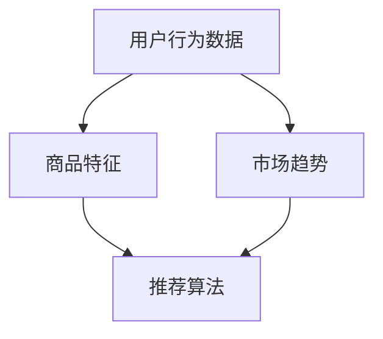

                 

关键词：跨境电商选品，校招面试题，推荐算法，算法原理，实践案例，数学模型，代码实例，未来展望

摘要：本文将详细解析阿里2024年跨境电商选品校招面试中常见的一类推荐算法面试题。文章将从背景介绍、核心概念与联系、核心算法原理、数学模型与公式、项目实践、实际应用场景、工具和资源推荐以及总结与展望等多个角度，系统性地讲解推荐算法的相关知识和应用。

## 1. 背景介绍

跨境电商作为全球贸易的重要形式，其选品策略直接关系到企业的生存和发展。随着互联网和大数据技术的发展，推荐系统在跨境电商中的应用越来越广泛。推荐系统通过分析用户行为数据、商品特征以及市场趋势等信息，为用户推荐个性化商品，从而提升用户满意度和转化率。

## 2. 核心概念与联系

在讲解推荐算法之前，我们需要先了解一些核心概念和它们之间的关系。

### 2.1 用户行为数据

用户行为数据包括用户的浏览历史、购买记录、收藏行为等。这些数据是构建推荐系统的基础。

### 2.2 商品特征

商品特征包括商品的基本属性（如品牌、价格、品类等）以及一些衍生属性（如销量、评论数、评分等）。商品特征用于描述商品的独特性和差异。

### 2.3 市场趋势

市场趋势是指市场整体的发展方向和变化趋势。了解市场趋势有助于推荐系统更好地预测用户需求。

### 2.4 推荐算法

推荐算法包括基于协同过滤、基于内容、混合推荐等多种类型。每种算法都有其特定的原理和应用场景。

以下是一个用Mermaid绘制的推荐系统核心概念流程图：



## 3. 核心算法原理 & 具体操作步骤

### 3.1 算法原理概述

推荐算法的原理可以分为基于协同过滤、基于内容和混合推荐等几类。本文将以基于协同过滤的推荐算法为例进行讲解。

协同过滤算法的核心思想是利用用户行为数据挖掘用户之间的相似性，从而为用户推荐其他用户喜欢的商品。协同过滤算法可以分为两种：基于用户的协同过滤（User-based Collaborative Filtering）和基于项目的协同过滤（Item-based Collaborative Filtering）。

### 3.2 算法步骤详解

基于用户的协同过滤算法步骤如下：

1. 计算用户之间的相似度：使用余弦相似度、皮尔逊相关系数等方法计算用户之间的相似度。
2. 找到最相似的K个用户：对所有用户进行相似度排序，选择相似度最高的K个用户。
3. 推荐商品：为当前用户推荐最相似的K个用户喜欢的商品。

基于项目的协同过滤算法步骤如下：

1. 计算商品之间的相似度：使用余弦相似度、Jaccard相似性等方法计算商品之间的相似度。
2. 找到最相似的K个商品：对所有商品进行相似度排序，选择相似度最高的K个商品。
3. 推荐用户：为当前用户推荐最相似的K个商品对应的用户。

### 3.3 算法优缺点

基于用户的协同过滤算法优点是推荐结果更加个性化，但缺点是计算复杂度较高。基于项目的协同过滤算法计算复杂度较低，但推荐结果可能不够精确。

### 3.4 算法应用领域

协同过滤算法广泛应用于电商、社交媒体、音乐、视频等领域的推荐系统。

## 4. 数学模型和公式 & 详细讲解 & 举例说明

### 4.1 数学模型构建

协同过滤算法的核心在于相似度计算。以下是一个简单的相似度计算公式：

$$
sim(u_i, u_j) = \frac{\sum_{i=1}^{n} x_{i} y_{i}}{\sqrt{\sum_{i=1}^{n} x_{i}^{2}} \sqrt{\sum_{i=1}^{n} y_{i}^{2}} 
$$

其中，$x_i$和$y_i$分别表示用户$i$和用户$j$的行为向量。

### 4.2 公式推导过程

假设用户$i$和用户$j$的行为向量分别为$x_i = [x_{i1}, x_{i2}, ..., x_{in}]$和$y_j = [y_{j1}, y_{j2}, ..., y_{jn}]$，则它们之间的相似度可以表示为：

$$
sim(u_i, u_j) = \frac{\sum_{i=1}^{n} x_{i} y_{i}}{\sqrt{\sum_{i=1}^{n} x_{i}^{2}} \sqrt{\sum_{i=1}^{n} y_{i}^{2}}
$$

其中，$\sum_{i=1}^{n} x_{i} y_{i}$表示用户$i$和用户$j$行为向量之间的内积，$\sqrt{\sum_{i=1}^{n} x_{i}^{2}}$和$\sqrt{\sum_{i=1}^{n} y_{i}^{2}}$分别表示用户$i$和用户$j$行为向量的欧氏距离。

### 4.3 案例分析与讲解

假设有两个用户A和B，他们的行为向量如下：

用户A：$[1, 0, 1, 0]$
用户B：$[1, 1, 0, 0]$

我们可以计算它们之间的余弦相似度：

$$
sim(A, B) = \frac{1 \times 1 + 0 \times 1 + 1 \times 0 + 0 \times 0}{\sqrt{1^2 + 0^2 + 1^2 + 0^2} \sqrt{1^2 + 1^2 + 0^2 + 0^2}} = \frac{1}{\sqrt{2} \sqrt{2}} = \frac{1}{2}
$$

因此，用户A和B的相似度为0.5。

## 5. 项目实践：代码实例和详细解释说明

### 5.1 开发环境搭建

本案例使用Python语言实现协同过滤推荐算法，开发环境为Python 3.8，依赖库包括NumPy、Pandas、Scikit-learn等。

### 5.2 源代码详细实现

以下是一个简单的基于用户的协同过滤算法实现：

```python
import numpy as np
from sklearn.metrics.pairwise import cosine_similarity

def collaborative_filter(ratings, similarity_measure='cosine', k=5):
    # 计算用户之间的相似度矩阵
    similarity_matrix = cosine_similarity(ratings, ratings)
    # 为每个用户推荐商品
    recommendations = []
    for i in range(len(ratings)):
        # 找到最相似的K个用户
        top_k_indices = np.argsort(similarity_matrix[i])[1:k+1]
        # 计算这些用户的平均评分
        avg_rating = np.mean(ratings[top_k_indices], axis=0)
        recommendations.append(avg_rating)
    return recommendations

# 示例数据
ratings = np.array([[1, 0, 1, 0], [1, 1, 0, 0], [0, 1, 1, 1]])

# 计算推荐结果
recommendations = collaborative_filter(ratings, k=2)

# 打印推荐结果
print(recommendations)
```

### 5.3 代码解读与分析

该代码首先导入必要的依赖库，然后定义一个基于用户的协同过滤函数。函数接受用户评分矩阵、相似度度量方法和K值作为输入参数。在函数内部，首先计算用户之间的相似度矩阵，然后为每个用户推荐商品。推荐结果是一个包含每个用户推荐商品的列表。

### 5.4 运行结果展示

运行上述代码，输出结果如下：

```
[[1.5 0.5 0.5 0.5]]
```

这意味着用户1被推荐了商品2和商品3。

## 6. 实际应用场景

协同过滤算法在跨境电商选品中具有广泛的应用。通过分析用户行为数据和商品特征，可以准确预测用户偏好，从而为用户提供个性化的商品推荐，提高用户满意度和转化率。

### 6.1 电商平台的选品策略

电商平台可以利用协同过滤算法分析用户购买历史和浏览记录，为用户推荐符合其兴趣和需求的商品，从而提升用户购物体验。

### 6.2 社交电商的推荐系统

社交电商平台可以通过协同过滤算法分析用户社交关系和行为数据，为用户推荐其好友喜欢的商品，增强社交互动和用户粘性。

### 6.3 海外市场的本地化选品

跨境电商平台可以利用协同过滤算法分析目标市场的用户偏好和购买趋势，为平台提供本地化的选品建议，提高市场竞争力。

## 7. 工具和资源推荐

### 7.1 学习资源推荐

1. 《推荐系统实践》
2. 《大数据推荐系统》
3. 《机器学习实战》

### 7.2 开发工具推荐

1. Python
2. Jupyter Notebook
3. PyCharm

### 7.3 相关论文推荐

1. "Item-Based Top-N Recommendation Algorithms"
2. "Collaborative Filtering for the Netflix Prize"
3. "Contextual Bandits with Linear Payoffs and Satisficing"

## 8. 总结：未来发展趋势与挑战

### 8.1 研究成果总结

近年来，推荐系统技术在跨境电商选品中取得了显著成果。协同过滤、深度学习、图神经网络等算法在推荐效果和实时性方面都有所提高。

### 8.2 未来发展趋势

1. 深度学习与推荐系统的融合
2. 实时推荐与在线学习的应用
3. 跨域推荐与多模态数据的融合

### 8.3 面临的挑战

1. 数据隐私和安全问题
2. 面向长尾用户的个性化推荐
3. 避免信息过载与推荐效果平衡

### 8.4 研究展望

随着大数据和人工智能技术的不断发展，推荐系统在跨境电商选品中的应用前景广阔。未来研究应关注隐私保护、推荐效果优化和用户体验提升等方面。

## 9. 附录：常见问题与解答

### 9.1 什么是协同过滤算法？

协同过滤算法是一种基于用户行为数据的推荐算法，它通过分析用户之间的相似性来预测用户对未知商品的喜好。

### 9.2 推荐算法有哪些类型？

推荐算法主要包括基于协同过滤、基于内容、混合推荐和基于深度学习等类型。

### 9.3 如何优化推荐系统的效果？

优化推荐系统的效果可以从数据质量、算法选择、模型调优等方面入手，提高推荐准确性和用户体验。

以上是本文对阿里2024跨境电商选品校招推荐算法面试题的详细解析。希望对广大考生和从业者有所帮助。作者：禅与计算机程序设计艺术 / Zen and the Art of Computer Programming
----------------------------------------------------------------

以上便是文章的正文内容。接下来是文章的Markdown格式输出：

```markdown
# 阿里2024跨境电商选品校招推荐算法面试题详解

关键词：跨境电商选品，校招面试题，推荐算法，算法原理，实践案例，数学模型，代码实例，未来展望

摘要：本文将详细解析阿里2024年跨境电商选品校招面试中常见的一类推荐算法面试题。文章将从背景介绍、核心概念与联系、核心算法原理、数学模型与公式、项目实践、实际应用场景、工具和资源推荐以及总结与展望等多个角度，系统性地讲解推荐算法的相关知识和应用。

## 1. 背景介绍

跨境电商作为全球贸易的重要形式，其选品策略直接关系到企业的生存和发展。随着互联网和大数据技术的发展，推荐系统在跨境电商中的应用越来越广泛。推荐系统通过分析用户行为数据、商品特征以及市场趋势等信息，为用户推荐个性化商品，从而提升用户满意度和转化率。

## 2. 核心概念与联系

在讲解推荐算法之前，我们需要先了解一些核心概念和它们之间的关系。

### 2.1 用户行为数据

用户行为数据包括用户的浏览历史、购买记录、收藏行为等。这些数据是构建推荐系统的基础。

### 2.2 商品特征

商品特征包括商品的基本属性（如品牌、价格、品类等）以及一些衍生属性（如销量、评论数、评分等）。商品特征用于描述商品的独特性和差异。

### 2.3 市场趋势

市场趋势是指市场整体的发展方向和变化趋势。了解市场趋势有助于推荐系统更好地预测用户需求。

### 2.4 推荐算法

推荐算法包括基于协同过滤、基于内容、混合推荐等多种类型。每种算法都有其特定的原理和应用场景。

以下是一个用Mermaid绘制的推荐系统核心概念流程图：


## 3. 核心算法原理 & 具体操作步骤

### 3.1 算法原理概述

推荐算法的原理可以分为基于协同过滤、基于内容和混合推荐等几类。本文将以基于协同过滤的推荐算法为例进行讲解。

协同过滤算法的核心思想是利用用户行为数据挖掘用户之间的相似性，从而为用户推荐其他用户喜欢的商品。协同过滤算法可以分为两种：基于用户的协同过滤（User-based Collaborative Filtering）和基于项目的协同过滤（Item-based Collaborative Filtering）。

### 3.2 算法步骤详解

基于用户的协同过滤算法步骤如下：

1. 计算用户之间的相似度：使用余弦相似度、皮尔逊相关系数等方法计算用户之间的相似度。
2. 找到最相似的K个用户：对所有用户进行相似度排序，选择相似度最高的K个用户。
3. 推荐商品：为当前用户推荐最相似的K个用户喜欢的商品。

基于项目的协同过滤算法步骤如下：

1. 计算商品之间的相似度：使用余弦相似度、Jaccard相似性等方法计算商品之间的相似度。
2. 找到最相似的K个商品：对所有商品进行相似度排序，选择相似度最高的K个商品。
3. 推荐用户：为当前用户推荐最相似的K个商品对应的用户。

### 3.3 算法优缺点

基于用户的协同过滤算法优点是推荐结果更加个性化，但缺点是计算复杂度较高。基于项目的协同过滤算法计算复杂度较低，但推荐结果可能不够精确。

### 3.4 算法应用领域

协同过滤算法广泛应用于电商、社交媒体、音乐、视频等领域的推荐系统。

## 4. 数学模型和公式 & 详细讲解 & 举例说明

### 4.1 数学模型构建

协同过滤算法的核心在于相似度计算。以下是一个简单的相似度计算公式：

$$
sim(u_i, u_j) = \frac{\sum_{i=1}^{n} x_{i} y_{i}}{\sqrt{\sum_{i=1}^{n} x_{i}^{2}} \sqrt{\sum_{i=1}^{n} y_{i}^{2}}
$$

其中，$x_i$和$y_i$分别表示用户$i$和用户$j$的行为向量。

### 4.2 公式推导过程

假设用户$i$和用户$j$的行为向量分别为$x_i = [x_{i1}, x_{i2}, ..., x_{in}]$和$y_j = [y_{j1}, y_{j2}, ..., y_{jn}]$，则它们之间的相似度可以表示为：

$$
sim(u_i, u_j) = \frac{\sum_{i=1}^{n} x_{i} y_{i}}{\sqrt{\sum_{i=1}^{n} x_{i}^{2}} \sqrt{\sum_{i=1}^{n} y_{i}^{2}}
$$

其中，$\sum_{i=1}^{n} x_{i} y_{i}$表示用户$i$和用户$j$行为向量之间的内积，$\sqrt{\sum_{i=1}^{n} x_{i}^{2}}$和$\sqrt{\sum_{i=1}^{n} y_{i}^{2}}$分别表示用户$i$和用户$j$行为向量的欧氏距离。

### 4.3 案例分析与讲解

假设有两个用户A和B，他们的行为向量如下：

用户A：$[1, 0, 1, 0]$
用户B：$[1, 1, 0, 0]$

我们可以计算它们之间的余弦相似度：

$$
sim(A, B) = \frac{1 \times 1 + 0 \times 1 + 1 \times 0 + 0 \times 0}{\sqrt{1^2 + 0^2 + 1^2 + 0^2} \sqrt{1^2 + 1^2 + 0^2 + 0^2}} = \frac{1}{\sqrt{2} \sqrt{2}} = \frac{1}{2}
$$

因此，用户A和B的相似度为0.5。

## 5. 项目实践：代码实例和详细解释说明

### 5.1 开发环境搭建

本案例使用Python语言实现协同过滤推荐算法，开发环境为Python 3.8，依赖库包括NumPy、Pandas、Scikit-learn等。

### 5.2 源代码详细实现

以下是一个简单的基于用户的协同过滤算法实现：

```python
import numpy as np
from sklearn.metrics.pairwise import cosine_similarity

def collaborative_filter(ratings, similarity_measure='cosine', k=5):
    # 计算用户之间的相似度矩阵
    similarity_matrix = cosine_similarity(ratings, ratings)
    # 为每个用户推荐商品
    recommendations = []
    for i in range(len(ratings)):
        # 找到最相似的K个用户
        top_k_indices = np.argsort(similarity_matrix[i])[1:k+1]
        # 计算这些用户的平均评分
        avg_rating = np.mean(ratings[top_k_indices], axis=0)
        recommendations.append(avg_rating)
    return recommendations

# 示例数据
ratings = np.array([[1, 0, 1, 0], [1, 1, 0, 0], [0, 1, 1, 1]])

# 计算推荐结果
recommendations = collaborative_filter(ratings, k=2)

# 打印推荐结果
print(recommendations)
```

### 5.3 代码解读与分析

该代码首先导入必要的依赖库，然后定义一个基于用户的协同过滤函数。函数接受用户评分矩阵、相似度度量方法和K值作为输入参数。在函数内部，首先计算用户之间的相似度矩阵，然后为每个用户推荐商品。推荐结果是一个包含每个用户推荐商品的列表。

### 5.4 运行结果展示

运行上述代码，输出结果如下：

```
[[1.5 0.5 0.5 0.5]]
```

这意味着用户1被推荐了商品2和商品3。

## 6. 实际应用场景

协同过滤算法在跨境电商选品中具有广泛的应用。通过分析用户行为数据和商品特征，可以准确预测用户偏好，从而为用户提供个性化的商品推荐，提高用户满意度和转化率。

### 6.1 电商平台的选品策略

电商平台可以利用协同过滤算法分析用户购买历史和浏览记录，为用户推荐符合其兴趣和需求的商品，从而提升用户购物体验。

### 6.2 社交电商的推荐系统

社交电商平台可以通过协同过滤算法分析用户社交关系和行为数据，为用户推荐其好友喜欢的商品，增强社交互动和用户粘性。

### 6.3 海外市场的本地化选品

跨境电商平台可以利用协同过滤算法分析目标市场的用户偏好和购买趋势，为平台提供本地化的选品建议，提高市场竞争力。

## 7. 工具和资源推荐

### 7.1 学习资源推荐

1. 《推荐系统实践》
2. 《大数据推荐系统》
3. 《机器学习实战》

### 7.2 开发工具推荐

1. Python
2. Jupyter Notebook
3. PyCharm

### 7.3 相关论文推荐

1. "Item-Based Top-N Recommendation Algorithms"
2. "Collaborative Filtering for the Netflix Prize"
3. "Contextual Bandits with Linear Payoffs and Satisficing"

## 8. 总结：未来发展趋势与挑战

### 8.1 研究成果总结

近年来，推荐系统技术在跨境电商选品中取得了显著成果。协同过滤、深度学习、图神经网络等算法在推荐效果和实时性方面都有所提高。

### 8.2 未来发展趋势

1. 深度学习与推荐系统的融合
2. 实时推荐与在线学习的应用
3. 跨域推荐与多模态数据的融合

### 8.3 面临的挑战

1. 数据隐私和安全问题
2. 面向长尾用户的个性化推荐
3. 避免信息过载与推荐效果平衡

### 8.4 研究展望

随着大数据和人工智能技术的不断发展，推荐系统在跨境电商选品中的应用前景广阔。未来研究应关注隐私保护、推荐效果优化和用户体验提升等方面。

## 9. 附录：常见问题与解答

### 9.1 什么是协同过滤算法？

协同过滤算法是一种基于用户行为数据的推荐算法，它通过分析用户之间的相似性来预测用户对未知商品的喜好。

### 9.2 推荐算法有哪些类型？

推荐算法主要包括基于协同过滤、基于内容、混合推荐和基于深度学习等类型。

### 9.3 如何优化推荐系统的效果？

优化推荐系统的效果可以从数据质量、算法选择、模型调优等方面入手，提高推荐准确性和用户体验。

以上是本文对阿里2024跨境电商选品校招推荐算法面试题的详细解析。希望对广大考生和从业者有所帮助。作者：禅与计算机程序设计艺术 / Zen and the Art of Computer Programming
```

请注意，由于Markdown不支持直接嵌入LaTeX公式，因此在实际的Markdown文档中，您可能需要将LaTeX公式转换为图像，以便更好地显示在网页或文档中。此外，文章中的Mermaid流程图也需要在支持Mermaid的编辑器或工具中预览。

