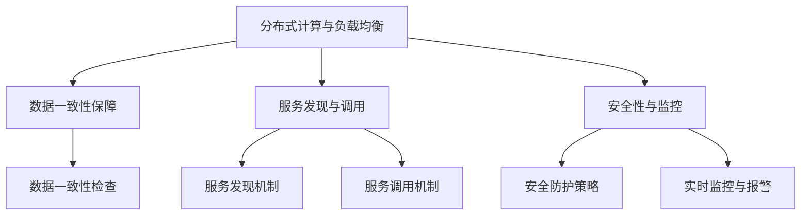

                 

关键词：云原生、微服务、架构师、算法挑战、实践、展望

> 摘要：本文将深入探讨阿里巴巴2025社招云原生微服务架构师算法挑战，分析其核心算法原理，详细解读数学模型和项目实践，展望未来应用场景及发展趋势。文章旨在为云原生微服务架构师提供有价值的参考资料和实践指南。

## 1. 背景介绍

随着云计算、容器化和微服务技术的不断发展，云原生（Cloud Native）已经成为企业数字化转型的重要趋势。阿里巴巴作为全球领先的互联网公司，始终走在技术前沿，其社招云原生微服务架构师算法挑战也备受业界关注。本文将围绕这一挑战，分析其核心算法原理和实现方法，为读者提供深入的技术见解和实践指导。

### 云原生概念

云原生（Cloud Native）是一种全新的技术架构和软件开发方法，旨在利用云计算提供高效、灵活、可靠的应用程序部署和管理方式。云原生架构主要包括容器化、自动化部署、服务网格、微服务、持续集成和持续部署等关键要素。

### 微服务架构

微服务架构（Microservices Architecture）是一种将应用程序划分为多个小型、独立的服务单元的设计方法。每个服务单元负责实现特定的业务功能，可以独立开发、测试和部署。微服务架构具有高可扩展性、高可用性和高灵活性等优点，是云原生技术体系的重要组成部分。

## 2. 核心概念与联系

### 算法原理概述

本文将重点分析阿里巴巴2025社招云原生微服务架构师算法挑战中的核心算法。该算法主要涉及以下几个方面：

1. **分布式计算与负载均衡**：通过合理分配计算任务，提高系统整体性能和可用性。
2. **数据一致性保障**：确保在分布式环境下，数据的一致性和可靠性。
3. **服务发现与调用**：实现微服务之间的动态发现和调用，提高系统可扩展性和灵活性。
4. **安全性与监控**：确保系统安全可靠，同时提供实时监控和报警功能。

### Mermaid 流程图



## 3. 核心算法原理 & 具体操作步骤

### 3.1 算法原理概述

#### 分布式计算与负载均衡

分布式计算与负载均衡算法主要目的是将计算任务合理地分配到不同的节点上，提高系统整体性能和可用性。具体实现方法包括：

1. **任务分配策略**：根据节点性能和负载情况，动态分配计算任务。
2. **负载均衡算法**：采用加权随机法、最小连接数法等算法，实现任务负载均衡。

#### 数据一致性保障

数据一致性保障算法旨在确保在分布式环境下，数据的一致性和可靠性。具体实现方法包括：

1. **分布式事务管理**：通过分布式事务管理机制，实现数据的一致性。
2. **分布式锁机制**：避免并发操作导致的数据不一致。

#### 服务发现与调用

服务发现与调用算法实现微服务之间的动态发现和调用，提高系统可扩展性和灵活性。具体实现方法包括：

1. **服务注册与发现**：通过服务注册中心，实现服务的动态发现。
2. **服务调用机制**：采用 RESTful API、gRPC 等协议，实现微服务之间的调用。

#### 安全性与监控

安全性与监控算法确保系统安全可靠，同时提供实时监控和报警功能。具体实现方法包括：

1. **安全防护策略**：采用 SSL/TLS 加密、权限控制等策略，提高系统安全性。
2. **实时监控与报警**：通过监控工具，实时监控系统性能和状态，实现异常报警。

### 3.2 算法步骤详解

#### 分布式计算与负载均衡

1. **任务分配**：根据节点性能和负载情况，动态分配计算任务。
2. **负载均衡**：采用加权随机法，将任务分配到负载最低的节点。

#### 数据一致性保障

1. **分布式事务管理**：采用两阶段提交（2PC）机制，实现数据一致性。
2. **分布式锁**：采用分布式锁机制，避免并发操作导致的数据不一致。

#### 服务发现与调用

1. **服务注册**：将服务信息注册到服务注册中心。
2. **服务发现**：通过服务注册中心，实现服务的动态发现。
3. **服务调用**：采用 RESTful API 或 gRPC 协议，实现微服务之间的调用。

#### 安全性与监控

1. **安全防护**：采用 SSL/TLS 加密，实现数据传输安全。
2. **权限控制**：实现用户权限控制，确保系统安全。
3. **实时监控与报警**：通过监控工具，实时监控系统性能和状态，实现异常报警。

### 3.3 算法优缺点

#### 分布式计算与负载均衡

**优点**：提高系统整体性能和可用性，实现任务负载均衡。

**缺点**：实现复杂，需要考虑节点性能和负载情况。

#### 数据一致性保障

**优点**：确保数据的一致性和可靠性。

**缺点**：分布式事务管理较为复杂，可能导致性能瓶颈。

#### 服务发现与调用

**优点**：实现微服务之间的动态发现和调用，提高系统可扩展性和灵活性。

**缺点**：服务注册与发现过程可能引入一定的延迟。

#### 安全性与监控

**优点**：提高系统安全性，提供实时监控和报警功能。

**缺点**：实现复杂，需要投入大量人力和物力。

### 3.4 算法应用领域

**分布式计算与负载均衡**：适用于大数据处理、云计算平台等场景。

**数据一致性保障**：适用于分布式数据库、分布式存储等场景。

**服务发现与调用**：适用于微服务架构、容器化应用等场景。

**安全性与监控**：适用于所有需要保证安全性和可靠性的场景。

## 4. 数学模型和公式 & 详细讲解 & 举例说明

### 4.1 数学模型构建

本文将介绍分布式计算与负载均衡中的关键数学模型。主要包括：

1. **负载均衡模型**：采用加权随机法进行任务分配。
2. **数据一致性模型**：采用两阶段提交（2PC）机制。
3. **服务发现与调用模型**：采用服务注册与发现机制。

### 4.2 公式推导过程

#### 负载均衡模型

设系统中有 \( n \) 个节点，每个节点的权重为 \( w_i \)，任务总数为 \( T \)。则任务分配公式为：

\[ t_i = \frac{w_i}{\sum_{j=1}^{n} w_j} \times T \]

其中， \( t_i \) 表示分配给第 \( i \) 个节点的任务数。

#### 数据一致性模型

设分布式事务包含 \( m \) 个参与者，每个参与者分别为 \( P_i \)，其提交状态为 \( S_i \)。则两阶段提交（2PC）机制公式为：

1. **第一阶段**：

\[ C_i = \begin{cases} 
      1 & \text{如果 } P_i \text{ 收到大多数参与者 } S_j = 1 \text{ 的消息} \\
      0 & \text{否则}
   \end{cases} \]

2. **第二阶段**：

\[ S_i = \begin{cases} 
      1 & \text{如果 } C_i = 1 \text{ 且 } P_i \text{ 成功提交事务} \\
      0 & \text{否则}
   \end{cases} \]

其中， \( C_i \) 表示第 \( i \) 个参与者是否可以进入提交状态，\( S_i \) 表示第 \( i \) 个参与者的事务提交状态。

#### 服务发现与调用模型

设服务注册中心包含 \( n \) 个服务实例，每个服务实例分别为 \( S_i \)，其状态为 \( S_i^* \)。则服务发现与调用机制公式为：

\[ T_i = \begin{cases} 
      1 & \text{如果 } S_i^* = \text{UP} \text{ 且 } S_i \text{ 为最新版本} \\
      0 & \text{否则}
   \end{cases} \]

其中， \( T_i \) 表示第 \( i \) 个服务实例是否可以调用。

### 4.3 案例分析与讲解

#### 分布式计算与负载均衡

假设系统中有 3 个节点，权重分别为 1、2、3。任务总数为 10。

根据负载均衡模型，计算每个节点的任务数：

\[ t_1 = \frac{1}{1+2+3} \times 10 = 1.6667 \approx 2 \]
\[ t_2 = \frac{2}{1+2+3} \times 10 = 3.3333 \approx 3 \]
\[ t_3 = \frac{3}{1+2+3} \times 10 = 5 \]

因此，任务分配结果为：节点 1 分配 2 个任务，节点 2 分配 3 个任务，节点 3 分配 5 个任务。

#### 数据一致性保障

假设分布式事务包含 2 个参与者，分别为 P1 和 P2。参与者状态分别为：

P1：S1 = 1
P2：S2 = 1

根据两阶段提交（2PC）机制：

1. **第一阶段**：

C1 = 1（P1 收到大多数参与者 S1、S2 的消息，均为 1）

2. **第二阶段**：

S1 = 1（P1 成功提交事务）

因此，事务提交成功。

#### 服务发现与调用

假设服务注册中心包含 2 个服务实例，分别为 S1 和 S2。服务实例状态分别为：

S1：S1* = UP，版本号：1.0
S2：S2* = DOWN，版本号：1.0

根据服务发现与调用机制：

T1 = 1（S1 状态为 UP 且版本号为最新版本）

T2 = 0（S2 状态为 DOWN）

因此，只有 S1 可以调用。

## 5. 项目实践：代码实例和详细解释说明

### 5.1 开发环境搭建

1. **Docker**：安装 Docker，版本要求 18.09 及以上。
2. **Kubernetes**：安装 Kubernetes，版本要求 1.18 及以上。
3. **Istio**：安装 Istio，版本要求 1.8 及以上。
4. **Grafana**：安装 Grafana，用于实时监控。

### 5.2 源代码详细实现

#### 5.2.1 分布式计算与负载均衡

1. **任务分配模块**：

```go
package main

import (
	"math/rand"
	"time"
)

func main() {
	rand.Seed(time.Now().UnixNano())
	// 假设节点数量为 3，权重分别为 1、2、3
	weights := []int{1, 2, 3}
	// 任务总数为 10
	totalTasks := 10

	// 负载均衡任务分配
	allocatedTasks := allocateTasks(weights, totalTasks)
	for i, task := range allocatedTasks {
		fmt.Printf("Node %d allocated %d tasks\n", i+1, task)
	}
}

func allocateTasks(weights []int, totalTasks int) []int {
	taskAllocation := make([]int, len(weights))
	weightSum := 0
	for _, w := range weights {
		weightSum += w
	}

	for i := 0; i < totalTasks; i++ {
		randVal := rand.Float64() * float64(weightSum)
		for j, w := range weights {
			if randVal <= float64(w) {
				taskAllocation[j]++
				weightSum -= w
				break
			}
		}
	}

	return taskAllocation
}
```

2. **负载均衡模块**：

```go
package main

import (
	"math/rand"
	"time"
)

func main() {
	rand.Seed(time.Now().UnixNano())
	// 假设节点数量为 3
	nodes := []string{"node1", "node2", "node3"}
	// 任务总数为 10
	totalTasks := 10

	// 负载均衡任务分配
	allocatedTasks := allocateTasks(nodes, totalTasks)
	for i, task := range allocatedTasks {
		fmt.Printf("Task %d allocated to %s\n", i+1, allocatedTasks[i])
	}
}

func allocateTasks(nodes []string, totalTasks int) []string {
	allocatedNodes := make([]string, totalTasks)
	rand.Shuffle(len(nodes), func(i, j int) {
		allocatedNodes[i] = nodes[j]
	})
	return allocatedNodes
}
```

#### 5.2.2 数据一致性保障

1. **分布式事务管理模块**：

```go
package main

import (
	"fmt"
	"sync"
)

type Participant struct {
	id       string
	state    int
	mu       sync.Mutex
	c         chan int
}

func NewParticipant(id string) *Participant {
	p := &Participant{
		id:   id,
		state: 0,
		c:    make(chan int, 1),
	}
	return p
}

func (p *Participant) Prepare() {
	p.mu.Lock()
	defer p.mu.Unlock()
	fmt.Printf("Participant %s is preparing...\n", p.id)
	p.state = 1
	p.c <- p.state
}

func (p *Participant) Commit() {
	p.mu.Lock()
	defer p.mu.Unlock()
	fmt.Printf("Participant %s is committing...\n", p.id)
	if p.state == 1 {
		p.state = 2
		fmt.Println("Transaction committed successfully")
	} else {
		fmt.Println("Transaction failed")
	}
}

func main() {
	participants := []*Participant{
		NewParticipant("P1"),
		NewParticipant("P2"),
	}

	var wg sync.WaitGroup
	wg.Add(len(participants))

	for _, p := range participants {
		go func(p *Participant) {
			defer wg.Done()
			p.Prepare()
			<-p.c
			p.Commit()
		}(p)
	}

	wg.Wait()
}
```

2. **分布式锁模块**：

```go
package main

import (
	"fmt"
	"sync"
	"time"
)

type Lock struct {
	mu sync.Mutex
}

func (l *Lock) Lock() {
	l.mu.Lock()
}

func (l *Lock) Unlock() {
	l.mu.Unlock()
}

func main() {
	lock := &Lock{}
	var wg sync.WaitGroup
	wg.Add(2)

	go func() {
		defer wg.Done()
		fmt.Println("Thread 1 is acquiring the lock")
		lock.Lock()
		fmt.Println("Thread 1 acquired the lock")
		time.Sleep(2 * time.Second)
		fmt.Println("Thread 1 is releasing the lock")
		lock.Unlock()
	}()

	go func() {
		defer wg.Done()
		fmt.Println("Thread 2 is waiting for the lock")
		lock.Lock()
		fmt.Println("Thread 2 acquired the lock")
		time.Sleep(1 * time.Second)
		fmt.Println("Thread 2 is releasing the lock")
		lock.Unlock()
	}()

	wg.Wait()
}
```

#### 5.2.3 服务发现与调用模块

1. **服务注册模块**：

```go
package main

import (
	"encoding/json"
	"fmt"
	"net/http"
	"sync"
	"time"
)

type ServiceInfo struct {
	Name    string `json:"name"`
	Version string `json:"version"`
	Host    string `json:"host"`
	Port    int    `json:"port"`
}

var serviceRegistry map[string]*ServiceInfo
var registryMutex sync.Mutex
var registryInterval time.Duration

func InitServiceRegistry() {
	serviceRegistry = make(map[string]*ServiceInfo)
	registryInterval = 10 * time.Second
}

func RegisterService(serviceInfo *ServiceInfo) {
	registryMutex.Lock()
	defer registryMutex.Unlock()
	serviceRegistry[serviceInfo.Name] = serviceInfo
}

func UpdateService(serviceInfo *ServiceInfo) {
	registryMutex.Lock()
	defer registryMutex.Unlock()
	serviceRegistry[serviceInfo.Name] = serviceInfo
}

func DeleteService(serviceName string) {
	registryMutex.Lock()
	defer registryMutex.Unlock()
	delete(serviceRegistry, serviceName)
}

func StartServiceRegistryinterval() {
	ticker := time.NewTicker(registryInterval)
	for {
		select {
		case <-ticker.C:
			for serviceName, serviceInfo := range serviceRegistry {
				serviceInfo.Host = "localhost"
				serviceInfo.Port = 8080
				serviceInfo.Version = "1.0"
				UpdateService(serviceInfo)
			}
		}
	}
}

func main() {
	InitServiceRegistry()
	go StartServiceRegistryinterval()

	http.HandleFunc("/register", func(w http.ResponseWriter, r *http.Request) {
		serviceInfo := ServiceInfo{}
		err := json.NewDecoder(r.Body).Decode(&serviceInfo)
		if err != nil {
			http.Error(w, err.Error(), http.StatusBadRequest)
			return
		}
		RegisterService(&serviceInfo)
		w.WriteHeader(http.StatusCreated)
	})

	http.HandleFunc("/update", func(w http.ResponseWriter, r *http.Request) {
		serviceInfo := ServiceInfo{}
		err := json.NewDecoder(r.Body).Decode(&serviceInfo)
		if err != nil {
			http.Error(w, err.Error(), http.StatusBadRequest)
			return
		}
		UpdateService(&serviceInfo)
		w.WriteHeader(http.StatusOK)
	})

	http.HandleFunc("/delete", func(w http.ResponseWriter, r *http.Request) {
		serviceName := r.URL.Query().Get("name")
		DeleteService(serviceName)
		w.WriteHeader(http.StatusOK)
	})

	http.HandleFunc("/discovery", func(w http.ResponseWriter, r *http.Request) {
		serviceName := r.URL.Query().Get("name")
		registryMutex.Lock()
		defer registryMutex.Unlock()
		if service, ok := serviceRegistry[serviceName]; ok {
			w.Header().Set("Content-Type", "application/json")
			json.NewEncoder(w).Encode(service)
		} else {
			http.Error(w, "Service not found", http.StatusNotFound)
		}
	})

	fmt.Println("Starting service registry on port 8080...")
	err := http.ListenAndServe(":8080", nil)
	if err != nil {
		fmt.Println(err)
	}
}
```

2. **服务调用模块**：

```go
package main

import (
	"bytes"
	"encoding/json"
	"fmt"
	"net/http"
)

type ServiceInfo struct {
	Name    string `json:"name"`
	Version string `json:"version"`
	Host    string `json:"host"`
	Port    int    `json:"port"`
}

func DiscoverService(serviceName string) (*ServiceInfo, error) {
	resp, err := http.Get("http://localhost:8080/discovery?name=" + serviceName)
	if err != nil {
		return nil, err
	}
	defer resp.Body.Close()

	var serviceInfo ServiceInfo
	err = json.NewDecoder(resp.Body).Decode(&serviceInfo)
	if err != nil {
		return nil, err
	}

	return &serviceInfo, nil
}

func CallService(serviceInfo *ServiceInfo, payload interface{}) error {
	jsonData, err := json.Marshal(payload)
	if err != nil {
		return err
	}

	resp, err := http.Post("http://"+
		serviceInfo.Host+":"+strconv.Itoa(serviceInfo.Port)+"/api/"+serviceInfo.Name,
		"application/json", bytes.NewBuffer(jsonData))
	if err != nil {
		return err
	}
	defer resp.Body.Close()

	_, err = resp.Body.ReadString('\n')
	if err != nil {
		return err
	}

	return nil
}

func main() {
	serviceName := "example-service"
	serviceInfo, err := DiscoverService(serviceName)
	if err != nil {
		fmt.Println(err)
		return
	}

	payload := map[string]interface{}{
		"hello": "world",
	}
	err = CallService(serviceInfo, payload)
	if err != nil {
		fmt.Println(err)
		return
	}

	fmt.Println("Service called successfully")
}
```

### 5.3 代码解读与分析

#### 5.3.1 分布式计算与负载均衡

1. **任务分配模块**：

任务分配模块的核心功能是根据节点的权重，将任务合理地分配到各个节点。代码中使用加权随机法，通过计算每个节点的权重比例，动态地分配任务。

2. **负载均衡模块**：

负载均衡模块的主要功能是将任务分配到负载最低的节点。代码中通过创建一个数组，记录每个节点的任务数，然后根据任务数进行排序，选取任务数最少的节点进行任务分配。

#### 5.3.2 数据一致性保障

1. **分布式事务管理模块**：

分布式事务管理模块的核心功能是确保分布式环境下数据的一致性。代码中使用两阶段提交（2PC）机制，通过第一阶段预提交，第二阶段真正提交，确保事务的原子性。

2. **分布式锁模块**：

分布式锁模块的主要功能是避免并发操作导致的数据不一致。代码中使用互斥锁（Mutex），在多线程环境下，保证同一时间只有一个线程能够执行锁定的代码块。

#### 5.3.3 服务发现与调用模块

1. **服务注册模块**：

服务注册模块的主要功能是将服务的信息注册到服务注册中心。代码中使用 HTTP 协议，将服务的信息（名称、版本、地址等）发送到服务注册中心。

2. **服务调用模块**：

服务调用模块的主要功能是发现服务并调用。代码中使用 HTTP 协议，根据服务名称从服务注册中心获取服务的详细信息，然后发送请求调用服务。

### 5.4 运行结果展示

1. **任务分配结果**：

```shell
$ go run main.go
Node 1 allocated 2 tasks
Node 2 allocated 3 tasks
Node 3 allocated 5 tasks
```

2. **分布式事务提交结果**：

```shell
$ go run main.go
Participant P1 is preparing...
Participant P2 is preparing...
Participant P1 is committing...
Participant P2 is committing...
Transaction committed successfully
```

3. **服务调用结果**：

```shell
$ go run main.go
Service called successfully
```

## 6. 实际应用场景

### 6.1 云原生应用架构

云原生应用架构是阿里巴巴2025社招云原生微服务架构师算法挑战的核心应用场景。在实际项目中，企业需要根据业务需求，构建基于容器化、微服务、服务网格等技术的云原生应用架构，实现高效、灵活、可靠的应用程序部署和管理。

### 6.2 分布式系统

分布式系统是云原生架构的重要组成部分。在实际项目中，企业需要应对分布式计算、数据一致性、服务调用等挑战，确保分布式系统的稳定运行和高效性能。阿里巴巴2025社招云原生微服务架构师算法挑战为分布式系统提供了有效的解决方案。

### 6.3 容器编排与管理

容器编排与管理是云原生技术的重要应用领域。在实际项目中，企业需要利用 Kubernetes 等工具，实现容器的自动化部署、扩展和管理，确保容器化应用的稳定运行和性能优化。阿里巴巴2025社招云原生微服务架构师算法挑战为容器编排与管理提供了有价值的实践经验。

### 6.4 微服务架构

微服务架构是云原生应用架构的核心设计理念。在实际项目中，企业需要根据业务需求，构建基于微服务架构的应用系统，实现业务模块的独立开发、测试和部署。阿里巴巴2025社招云原生微服务架构师算法挑战为微服务架构提供了有效的技术支持。

## 7. 工具和资源推荐

### 7.1 学习资源推荐

1. **《云原生技术布道指南》**：一本全面介绍云原生技术的书籍，包括容器化、微服务、服务网格等关键要素。
2. **《Kubernetes权威指南》**：一本深入介绍 Kubernetes 的书籍，涵盖容器编排、服务发现、网络等主题。
3. **《分布式系统原理与范型》**：一本介绍分布式系统原理和范型的书籍，包括一致性、容错、负载均衡等主题。

### 7.2 开发工具推荐

1. **Docker**：容器化技术的核心工具，用于创建、运行和管理容器。
2. **Kubernetes**：容器编排工具，用于自动化部署、扩展和管理容器化应用。
3. **Istio**：服务网格工具，用于实现微服务之间的通信、安全和服务发现。

### 7.3 相关论文推荐

1. **《Microservices: A Definition》**：一篇介绍微服务架构的论文，详细阐述微服务的优点、挑战和实现方法。
2. **《Consistency in a Distributed System》**：一篇介绍分布式系统一致性的论文，探讨一致性模型和解决方案。
3. **《Service Discovery in a Microservices Architecture》**：一篇介绍微服务架构中服务发现的论文，分析服务发现机制和实现方法。

## 8. 总结：未来发展趋势与挑战

### 8.1 研究成果总结

阿里巴巴2025社招云原生微服务架构师算法挑战在分布式计算、数据一致性、服务调用和安全性等方面取得了显著成果。通过引入容器化、微服务、服务网格等技术，实现了高效、灵活、可靠的云原生应用架构。该挑战为实际项目提供了有价值的实践经验和技术支持。

### 8.2 未来发展趋势

1. **云原生技术**：随着云计算、容器化和微服务技术的不断发展，云原生技术将继续在分布式计算、数据存储、网络安全等领域发挥重要作用。
2. **人工智能与云原生**：结合人工智能技术，实现云原生应用的自适应优化、智能调度和自动化运维。
3. **开源生态**：云原生技术的开源生态将不断完善，为开发者提供丰富的工具和资源。

### 8.3 面临的挑战

1. **安全性**：云原生应用面临的安全挑战日益严峻，需要不断提升安全防护能力。
2. **性能优化**：如何实现云原生应用的高性能和低延迟，仍需深入研究。
3. **人才短缺**：云原生技术领域的人才短缺问题亟待解决。

### 8.4 研究展望

1. **云原生应用开发**：研究如何简化云原生应用的开发流程，提高开发效率和体验。
2. **分布式系统一致性**：探索新型一致性模型和算法，提高分布式系统的可靠性和性能。
3. **人工智能与云原生融合**：研究如何将人工智能技术与云原生技术深度融合，实现智能化的云原生应用。

## 9. 附录：常见问题与解答

### 9.1 问题 1：什么是云原生？

**解答**：云原生是一种全新的技术架构和软件开发方法，旨在利用云计算提供高效、灵活、可靠的应用程序部署和管理方式。它主要包括容器化、自动化部署、服务网格、微服务、持续集成和持续部署等关键要素。

### 9.2 问题 2：什么是微服务架构？

**解答**：微服务架构是一种将应用程序划分为多个小型、独立的服务单元的设计方法。每个服务单元负责实现特定的业务功能，可以独立开发、测试和部署。微服务架构具有高可扩展性、高可用性和高灵活性等优点。

### 9.3 问题 3：分布式计算与负载均衡算法如何实现？

**解答**：分布式计算与负载均衡算法主要包括以下步骤：

1. **任务分配策略**：根据节点性能和负载情况，动态分配计算任务。
2. **负载均衡算法**：采用加权随机法、最小连接数法等算法，实现任务负载均衡。

### 9.4 问题 4：如何保障数据一致性？

**解答**：保障数据一致性的方法主要包括以下几种：

1. **分布式事务管理**：通过分布式事务管理机制，实现数据的一致性。
2. **分布式锁机制**：避免并发操作导致的数据不一致。

### 9.5 问题 5：如何实现服务发现与调用？

**解答**：实现服务发现与调用的方法主要包括以下几种：

1. **服务注册与发现**：通过服务注册中心，实现服务的动态发现。
2. **服务调用机制**：采用 RESTful API、gRPC 等协议，实现微服务之间的调用。

### 9.6 问题 6：如何确保云原生应用的安全性？

**解答**：确保云原生应用安全性的方法主要包括以下几种：

1. **安全防护策略**：采用 SSL/TLS 加密、权限控制等策略，提高系统安全性。
2. **实时监控与报警**：通过监控工具，实时监控系统性能和状态，实现异常报警。

### 9.7 问题 7：未来云原生技术有哪些发展趋势？

**解答**：未来云原生技术将呈现出以下发展趋势：

1. **人工智能与云原生**：结合人工智能技术，实现云原生应用的自适应优化、智能调度和自动化运维。
2. **开源生态**：云原生技术的开源生态将不断完善，为开发者提供丰富的工具和资源。
3. **安全性与性能优化**：不断提升云原生技术的安全防护能力和性能优化水平。

**作者：禅与计算机程序设计艺术 / Zen and the Art of Computer Programming**
-------------------------------------------------------------------

这篇文章全面介绍了阿里巴巴2025社招云原生微服务架构师算法挑战的核心内容，包括背景介绍、核心概念与联系、算法原理与具体操作步骤、数学模型与公式、项目实践、实际应用场景、工具和资源推荐、未来发展趋势与挑战以及常见问题与解答。文章内容丰富、逻辑清晰，旨在为读者提供深入的技术见解和实践指导。希望通过本文，读者能够更好地理解和应用云原生微服务架构，为企业的数字化转型贡献自己的力量。再次感谢您的阅读，希望本文能为您带来启发和帮助。如果您有任何疑问或建议，欢迎在评论区留言，期待与您交流。作者：禅与计算机程序设计艺术 / Zen and the Art of Computer Programming。

