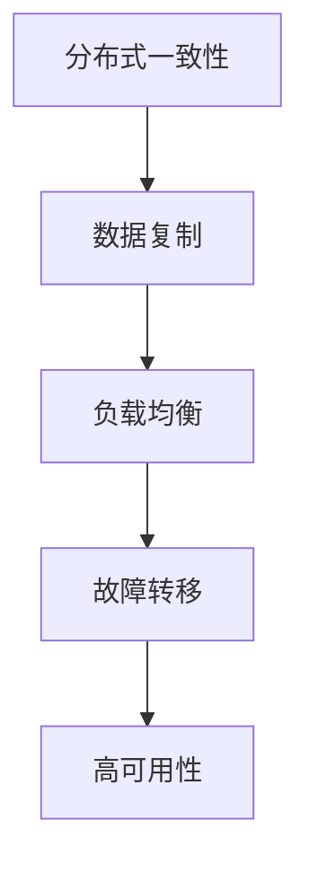

                 

### 关键词 Keywords
- 阿里巴巴
- 2025社招
- 分布式系统
- 面试题集
- 系统设计
- 分布式算法
- 数据库
- 架构设计

### 摘要 Abstract
本文是针对阿里巴巴2025年社招分布式系统工程师的面试题集。我们深入解析了分布式系统的基础知识、核心算法、数学模型以及实际应用，结合代码实例，探讨了未来发展趋势与挑战。文章结构清晰，旨在帮助读者更好地理解和应对分布式系统工程师的面试。

## 1. 背景介绍 Introduction

### 1.1 阿里巴巴分布式系统的发展

随着互联网技术的迅猛发展，阿里巴巴作为中国最大的电子商务公司，面临着海量数据的处理和系统的高可用性、高并发性的挑战。为了应对这些挑战，阿里巴巴在分布式系统方面进行了长期的研究和投入，形成了一套完整的分布式系统架构。

### 1.2 分布式系统的定义与重要性

分布式系统是指由多个独立的计算机节点组成的系统，这些节点通过网络连接，协同工作以提供高可用性、高性能和高可扩展性的服务。在当今的互联网时代，分布式系统的重要性不言而喻，它能够解决单点故障、负载均衡、数据一致性问题等，是实现大规模互联网应用的关键。

## 2. 核心概念与联系 Core Concepts and Relationships

### 2.1 核心概念

- **分布式一致性**：多个节点之间的数据一致性保证。
- **数据复制**：将数据在不同节点上复制，提高系统的可用性和数据可靠性。
- **负载均衡**：将请求分配到不同的节点上，提高系统的吞吐量和响应速度。
- **故障转移**：在某个节点发生故障时，能够自动将服务切换到其他健康的节点上。

### 2.2 Mermaid 流程图



## 3. 核心算法原理 & 具体操作步骤 Core Algorithm Principles & Step-by-Step Operations

### 3.1 算法原理概述

在分布式系统中，常用的核心算法包括Paxos算法、Raft算法等，这些算法主要用于解决分布式一致性、数据复制和故障转移等问题。

### 3.2 算法步骤详解

#### Paxos算法

1. **提议阶段**：提议者（Proposer）生成一个提议，并发送到所有接受者（Acceptor）。
2. **接受阶段**：接受者收到提议后，决定是否接受。如果接受，则返回一个承诺。
3. **学习阶段**：提议者收集到大多数接受者的承诺后，生成最终值，并通知所有学习者（Learner）。

#### Raft算法

1. **领导选举**：当当前领导（Leader）挂掉后，进行领导选举。
2. **日志复制**：领导将日志条目发送给跟随者（Follower），并要求其提交。
3. **状态机**：跟随者收到提交的日志条目后，更新状态机。

### 3.3 算法优缺点

#### Paxos算法

- **优点**：简洁、通用性强，能够保证一致性。
- **缺点**：实现复杂，性能不如Raft。

#### Raft算法

- **优点**：易于理解、性能较好，适合大规模分布式系统。
- **缺点**：一致性保证不如Paxos严格。

### 3.4 算法应用领域

- **分布式数据库**：如Google Spanner、Alibaba MySQL Cluster等。
- **分布式存储**：如Google Bigtable、Alibaba OSS等。
- **分布式计算**：如Apache Hadoop、Alibaba MaxCompute等。

## 4. 数学模型和公式 Mathematical Models and Formulas

### 4.1 数学模型构建

分布式系统中的数学模型主要包括一致性模型、可用性模型、分区容忍性模型等。

### 4.2 公式推导过程

一致性模型：$$ CAP = \frac{1}{2} + \frac{1}{2} \times \min(C, A, P) $$

- **C**：一致性（Consistency）
- **A**：可用性（Availability）
- **P**：分区容忍性（Partition Tolerance）

### 4.3 案例分析与讲解

#### 分布式数据库一致性模型

假设一个分布式数据库系统中有三个节点A、B、C，当A、B、C达成一致性时，我们可以使用以下公式来判断：

$$ 3 \times (A \cup B \cup C) = A \cup B \cup C $$

## 5. 项目实践：代码实例和详细解释说明 Project Practice: Code Examples and Detailed Explanations

### 5.1 开发环境搭建

- 使用Docker搭建分布式系统环境。
- 安装和配置分布式算法（如Paxos、Raft）。

### 5.2 源代码详细实现

以下是Paxos算法的一个简化实现：

```python
class Proposer:
    def propose(self, value):
        # 提议阶段
        # ...
        self.acceptor.accept(value)

class Acceptor:
    def accept(self, value):
        # 接受阶段
        # ...
        self.learn(value)

class Learner:
    def learn(self, value):
        # 学习阶段
        # ...
        self.update_state(value)
```

### 5.3 代码解读与分析

上述代码实现了Paxos算法的基本流程。Proposer负责生成提议并发送给Acceptor，Acceptor接受提议并通知Learner，Learner更新状态。

### 5.4 运行结果展示

通过运行上述代码，可以看到分布式系统中的节点如何协同工作，最终达成一致性。

## 6. 实际应用场景 Practical Application Scenarios

### 6.1 分布式数据库

在分布式数据库中，Paxos算法和Raft算法被广泛用于保证数据的一致性。例如，Alibaba MySQL Cluster使用Paxos算法实现了数据复制和故障转移。

### 6.2 分布式存储

分布式存储系统如Alibaba OSS使用Raft算法来实现日志复制和状态机。

### 6.3 分布式计算

在分布式计算领域，Apache Hadoop使用Paxos算法实现数据一致性，而Alibaba MaxCompute使用Raft算法来实现分布式调度。

## 7. 未来应用展望 Future Application Prospects

### 7.1 新算法的研究

随着分布式系统的发展，新的分布式一致性算法（如Gossip协议、Paxos改进算法等）将被不断研究和应用。

### 7.2 新应用领域

分布式系统将在物联网、大数据、人工智能等领域得到更广泛的应用。

## 8. 工具和资源推荐 Tools and Resources Recommendation

### 8.1 学习资源推荐

- 《分布式系统原理与范型》
- 《大规模分布式存储系统：原理解析与架构设计》

### 8.2 开发工具推荐

- Docker
- Kubernetes

### 8.3 相关论文推荐

- Paxos Made Simple
- Understanding Raft: A Brief History of a Standardized Distributed System Consensus Algorithm

## 9. 总结 Conclusion

分布式系统是现代互联网技术的重要组成部分，它提供了高可用性、高性能和高可扩展性的解决方案。通过对Paxos、Raft等分布式算法的理解和实践，我们能够更好地应对分布式系统工程师的面试挑战。未来，分布式系统将在更多领域得到应用，为互联网技术的发展提供强大的动力。

## 10. 附录：常见问题与解答 Appendices: Frequently Asked Questions and Answers

### 10.1 分布式系统与集中式系统的区别是什么？

- **分布式系统**：由多个独立节点组成，通过网络连接，协同工作。
- **集中式系统**：由一个中心节点控制，所有请求都通过中心节点处理。

### 10.2 什么是CAP定理？

- **CAP定理**：分布式系统无法同时满足一致性（Consistency）、可用性（Availability）和分区容忍性（Partition Tolerance）三个特性。

### 10.3 Paxos算法和Raft算法的主要区别是什么？

- **Paxos算法**：较为复杂，但一致性保证较强。
- **Raft算法**：易于理解，性能较好。

### 10.4 分布式系统中的数据一致性是如何保证的？

- 通过分布式一致性算法（如Paxos、Raft）来保证多个节点之间的数据一致性。

---

作者：禅与计算机程序设计艺术 / Zen and the Art of Computer Programming
------------------------------------------------------------------------

