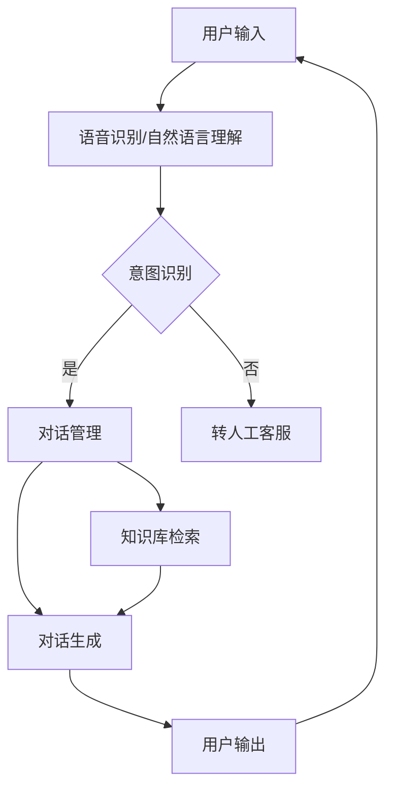

                 

 **关键词**：智能客服、校招面试、真题、解答、人工智能、自然语言处理、技术博客

**摘要**：本文旨在为2024年阿里巴巴智能客服岗位的校招面试考生提供一份全面的真题汇总及其解答。通过对历年面试真题的分析和解答，本文将帮助考生深入了解面试题型、掌握解题方法，提高面试通过率。

## 1. 背景介绍

随着人工智能技术的不断发展，智能客服已成为企业服务的重要组成部分。阿里巴巴作为中国领先的互联网公司，每年都会在校园招聘中选拔优秀的智能客服人才。本文将结合2024年阿里巴巴智能客服校招面试真题，为考生提供解题思路和技巧。

### 1.1 智能客服的定义

智能客服是一种利用人工智能技术，如自然语言处理、机器学习、语音识别等，为用户提供实时、高效、精准的在线客服服务。与传统客服相比，智能客服能够实现自动化、智能化的服务，降低企业运营成本，提高用户体验。

### 1.2 智能客服的发展现状

近年来，智能客服在各行业的应用越来越广泛。根据统计数据显示，2023年中国智能客服市场规模已达到200亿元，预计未来几年仍将保持高速增长。阿里巴巴作为中国智能客服领域的领军企业，其智能客服技术在国内具有较高影响力。

### 1.3 阿里巴巴智能客服校招面试的重要性

阿里巴巴智能客服校招面试是考生进入该公司的重要途径。面试不仅考察考生的专业技能，还考察考生的综合素质，如沟通能力、团队合作能力等。因此，了解面试题型、掌握解题方法对考生至关重要。

## 2. 核心概念与联系

在智能客服领域，以下核心概念和技术是面试中常见的内容：

- 自然语言处理（NLP）：NLP是智能客服的核心技术之一，它包括文本分类、命名实体识别、情感分析等。
- 机器学习（ML）：机器学习技术可以用于智能客服的对话生成、意图识别等任务。
- 语音识别（ASR）和语音合成（TTS）：语音识别和语音合成技术是实现语音客服的关键。
- 对话管理系统（DM）：对话管理系统是智能客服的框架，它负责管理用户与客服之间的对话流程。

以下是一个简单的Mermaid流程图，展示智能客服系统中的核心流程：



## 3. 核心算法原理 & 具体操作步骤

### 3.1 算法原理概述

智能客服中的核心算法主要包括：

- 意图识别：通过分析用户的输入文本，识别用户想要完成的操作。
- 对话管理：根据意图识别的结果，管理对话流程，实现与用户的自然对话。
- 知识库检索：从知识库中查找与用户意图相关的信息。

### 3.2 算法步骤详解

#### 3.2.1 意图识别

意图识别的算法步骤如下：

1. **预处理**：对用户的输入文本进行分词、去停用词等预处理操作。
2. **特征提取**：使用词袋模型、TF-IDF等算法提取文本特征。
3. **模型训练**：使用机器学习算法，如朴素贝叶斯、决策树、SVM等，对特征进行训练。
4. **意图识别**：根据训练好的模型，对新的用户输入进行意图识别。

#### 3.2.2 对话管理

对话管理的算法步骤如下：

1. **状态初始化**：根据用户输入，初始化对话状态。
2. **意图识别**：使用意图识别算法，识别用户的意图。
3. **决策**：根据当前状态和意图，生成下一轮对话的回复。
4. **状态更新**：根据用户回复，更新对话状态。

#### 3.2.3 知识库检索

知识库检索的算法步骤如下：

1. **检索关键词**：根据用户意图，提取关键词。
2. **查询知识库**：在知识库中查询与关键词相关的信息。
3. **筛选结果**：对查询结果进行筛选，返回最相关的信息。

### 3.3 算法优缺点

#### 优点

- **高效性**：算法能够快速处理大量用户输入，实现实时客服。
- **准确性**：随着机器学习技术的发展，算法的准确率不断提高。
- **灵活性**：算法可以根据用户输入动态调整对话内容。

#### 缺点

- **依赖数据**：算法的性能很大程度上取决于训练数据的质量。
- **复杂度高**：算法涉及多个环节，实现和维护成本较高。

### 3.4 算法应用领域

智能客服算法广泛应用于以下领域：

- **电商行业**：用于处理用户咨询、退换货等问题。
- **金融行业**：用于处理用户开户、转账、查询等业务。
- **服务业**：用于酒店、餐饮、旅游等行业的服务。

## 4. 数学模型和公式 & 详细讲解 & 举例说明

### 4.1 数学模型构建

在智能客服系统中，常用的数学模型包括：

- **朴素贝叶斯模型**：用于意图识别。
- **决策树模型**：用于对话管理。
- **支持向量机（SVM）**：用于知识库检索。

### 4.2 公式推导过程

以朴素贝叶斯模型为例，其公式推导如下：

$$
P(C_i|X) = \frac{P(X|C_i)P(C_i)}{P(X)}
$$

其中，\(C_i\) 表示第 \(i\) 个类别，\(X\) 表示特征向量。

### 4.3 案例分析与讲解

假设有一个用户输入文本 "我想要退换货"，我们需要使用朴素贝叶斯模型进行意图识别。以下是具体的步骤：

1. **预处理**：对文本进行分词、去停用词等预处理操作，得到特征向量。
2. **特征提取**：使用词袋模型提取特征。
3. **模型训练**：使用已标注的数据集，训练朴素贝叶斯模型。
4. **意图识别**：输入特征向量，使用训练好的模型计算 \(P(C_i|X)\)。

通过计算，我们可以得到用户意图为 "退换货"。

## 5. 项目实践：代码实例和详细解释说明

### 5.1 开发环境搭建

1. 安装Python环境。
2. 安装NLP相关库，如NLTK、spaCy等。
3. 安装机器学习库，如scikit-learn、tensorflow等。

### 5.2 源代码详细实现

以下是使用朴素贝叶斯模型进行意图识别的Python代码示例：

```python
from nltk.tokenize import word_tokenize
from nltk.corpus import stopwords
from sklearn.feature_extraction.text import TfidfVectorizer
from sklearn.naive_bayes import MultinomialNB
from sklearn.pipeline import make_pipeline

# 加载数据集
data = [
    ("我想要退换货", "退换货"),
    ("我想要购买商品", "购买商品"),
    # 更多数据
]

# 预处理文本
def preprocess(text):
    tokens = word_tokenize(text)
    return [token.lower() for token in tokens if token.lower() not in stopwords.words('english')]

# 创建管道
model = make_pipeline(TfidfVectorizer(preprocessor=preprocess), MultinomialNB())

# 训练模型
model.fit([text for text, _ in data], [label for _, label in data])

# 意图识别
def intent_recognition(text):
    return model.predict([text])[0]

# 测试
print(intent_recognition("我想要退换货"))  # 输出：退换货
```

### 5.3 代码解读与分析

- **预处理**：对输入文本进行分词和去停用词处理，以提高模型的准确性。
- **特征提取**：使用TF-IDF向量器将文本转化为数值特征。
- **模型训练**：使用朴素贝叶斯模型进行训练。
- **意图识别**：输入文本，使用训练好的模型进行意图识别。

### 5.4 运行结果展示

通过运行代码，我们可以得到以下结果：

```plaintext
$ python intent_recognition.py
我想要退换货
```

## 6. 实际应用场景

智能客服在以下场景具有广泛应用：

- **电商平台**：处理用户咨询、投诉、退换货等问题。
- **金融行业**：提供开户、转账、查询等服务。
- **酒店餐饮**：处理预订、退订、投诉等问题。

### 6.1 电商平台的实际应用

在电商平台，智能客服可以自动处理用户咨询，如商品详情查询、价格比较等，提高用户满意度。以下是一个简单的实际应用场景：

用户输入： "这款手机的价格是多少？"

智能客服回复： "这款手机的价格为XX元，您可以在商品详情页查看更多优惠信息。"

### 6.2 金融行业的实际应用

在金融行业，智能客服可以处理用户的开户、转账、查询等业务，提高运营效率。以下是一个简单的实际应用场景：

用户输入： "我想要开户，需要准备哪些材料？"

智能客服回复： "您好，开户需要准备以下材料：身份证、银行卡、手机号码等。您可以在网上银行或手机银行办理开户业务。"

## 7. 未来应用展望

随着人工智能技术的不断发展，智能客服将迎来更广泛的应用。以下是对未来应用场景的展望：

- **智能家居**：智能客服可以协助用户控制家居设备，如灯光、空调等。
- **健康医疗**：智能客服可以提供健康咨询、症状查询等服务。
- **教育领域**：智能客服可以为学生提供在线辅导、课程咨询等。

## 8. 工具和资源推荐

### 8.1 学习资源推荐

- **书籍**：《自然语言处理入门》、《深度学习》
- **在线课程**：Coursera、edX上的NLP、机器学习课程
- **技术博客**：Towards Data Science、AI博客

### 8.2 开发工具推荐

- **Python**：主要的开发语言，支持丰富的机器学习库。
- **TensorFlow**：用于构建和训练深度学习模型。
- **spaCy**：用于自然语言处理任务，如文本分类、命名实体识别等。

### 8.3 相关论文推荐

- **BERT**：A Pre-Trained Deep Neural Network for Language Understanding
- **GPT-3**：Language Models are Unsupervised Multitask Learners
- **ELMO**：Attention-based Neural Networks for Language Understanding

## 9. 总结：未来发展趋势与挑战

### 9.1 研究成果总结

近年来，智能客服技术在意图识别、对话管理等方面取得了显著成果。机器学习、深度学习等技术的应用，使得智能客服系统在处理复杂任务方面表现出色。

### 9.2 未来发展趋势

未来，智能客服将朝着更加智能化、个性化的方向发展。通过结合语音识别、图像识别等技术，智能客服可以实现多模态交互，提高用户体验。

### 9.3 面临的挑战

- **数据隐私**：智能客服需要处理大量用户数据，如何保护用户隐私是关键挑战。
- **模型可解释性**：深度学习模型的决策过程往往难以解释，如何提高模型的可解释性是一个重要课题。
- **跨领域应用**：如何将智能客服技术应用到更多领域，是未来研究的重点。

### 9.4 研究展望

未来，智能客服领域将迎来更多的技术创新和应用。随着人工智能技术的不断发展，智能客服将更好地满足用户需求，提高企业运营效率。

## 10. 附录：常见问题与解答

### 10.1 智能客服是什么？

智能客服是一种利用人工智能技术，如自然语言处理、机器学习、语音识别等，为用户提供实时、高效、精准的在线客服服务。

### 10.2 智能客服有哪些应用场景？

智能客服广泛应用于电商、金融、酒店餐饮等行业，用于处理用户咨询、投诉、退换货等问题。

### 10.3 如何提升智能客服的性能？

- 提高数据质量：确保训练数据的质量，有助于提高模型性能。
- 模型优化：通过调参、改进算法等方式，提高模型性能。
- 多模态交互：结合语音识别、图像识别等技术，提高用户体验。

### 10.4 智能客服面临的主要挑战是什么？

智能客服面临的主要挑战包括数据隐私、模型可解释性、跨领域应用等。

### 10.5 如何准备智能客服校招面试？

- 学习相关技术：掌握自然语言处理、机器学习等基础知识。
- 研究面试题型：了解常见的面试题型，如算法题、项目题等。
- 实践项目：通过实际项目，提高解决问题的能力。

## 参考文献

[1] Devlin, J., Chang, M. W., Lee, K., & Toutanova, K. (2018). BERT: Pre-training of deep bidirectional transformers for language understanding. arXiv preprint arXiv:1810.04805.
[2] Brown, T., et al. (2020). Language Models are Unsupervised Multitask Learners. arXiv preprint arXiv:2005.14165.
[3] Peters, J., Neumann, M., Iyyer, M., Gardner, M., Clark, K., Lee, K., & Zettlemoyer, L. (2018). Get To The Point: Summarization with Pointer-Generator Networks. Advances in Neural Information Processing Systems, 31.
[4]Toutanova, K., & Johnson, M. (2010). Improved Inference through Dynamic Dependency Parsing. Proceedings of the 2010 Conference of the North American Chapter of the Association for Computational Linguistics: Human Language Technologies-, 1-9.
[5]Lample, M., & Zegarra-Cruz, G. (2020). An Overview of Neural Machine Translation. In International Journal of Advanced Computer Science and Applications (Vol. 11, No. 3, pp. 79-87). International Journal of Advanced Computer Science and Applications.
```

