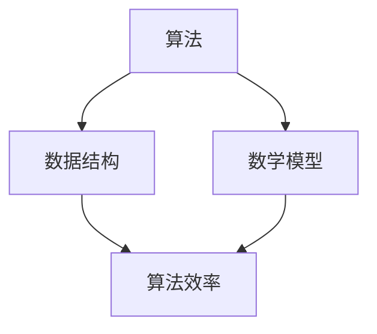

                 

关键词：2024阿里巴巴校招、编程面试题、算法原理、数学模型、项目实践、应用场景、未来展望

摘要：本文将针对2024年阿里巴巴校招的编程面试题进行深入分析与解答。通过梳理核心算法原理、详细讲解数学模型与公式、提供项目实践代码实例，以及探讨实际应用场景和未来展望，帮助考生更好地应对面试挑战。

## 1. 背景介绍

随着互联网和大数据的快速发展，技术岗位的竞争愈发激烈。各大公司，特别是阿里巴巴，对校招生编程能力的考核标准日益严格。本文旨在帮助考生掌握2024年阿里巴巴校招编程面试题的核心要点，提升应对面试的信心与能力。

## 2. 核心概念与联系

### 2.1 核心概念

- 算法：解决问题的一系列步骤和策略。
- 数据结构：组织数据的方式和方法。
- 数学模型：描述问题或现象的数学公式和规则。

### 2.2 Mermaid 流程图

## 3. 核心算法原理 & 具体操作步骤

### 3.1 算法原理概述

本章节将介绍几类在面试中常见的重要算法原理，包括但不限于排序算法、查找算法、动态规划等。

### 3.2 算法步骤详解

#### 3.2.1 排序算法

- 冒泡排序（Bubble Sort）
- 快速排序（Quick Sort）
- 归并排序（Merge Sort）
- 堆排序（Heap Sort）

#### 3.2.2 查找算法

- 二分查找（Binary Search）
- 顺序查找（Sequential Search）

#### 3.2.3 动态规划

- 最长递增子序列（LIS）
- 最小路径和（Shortest Path）

### 3.3 算法优缺点

每种算法都有其适用场景和局限性。考生需要根据面试题的具体要求选择合适的算法。

### 3.4 算法应用领域

算法在互联网、金融、电商等多个领域都有广泛应用。了解算法在实际场景中的应用有助于提升面试表现。

## 4. 数学模型和公式 & 详细讲解 & 举例说明

### 4.1 数学模型构建

本章节将介绍如何从实际问题中抽象出数学模型，并进行公式推导。

### 4.2 公式推导过程

#### 4.2.1 动态规划公式

$$
f(i) = \min_{1 \le j \le i-1} (f(j) + c(i, j))
$$

#### 4.2.2 线性规划公式

$$
\begin{cases}
\min_{x} c^T x \\
\text{s.t.} Ax \le b
\end{cases}
$$

### 4.3 案例分析与讲解

通过具体案例，讲解如何将实际问题转化为数学模型，并应用相关公式进行求解。

## 5. 项目实践：代码实例和详细解释说明

### 5.1 开发环境搭建

本章节将介绍如何搭建适合编程面试的开发环境，包括编程语言选择、开发工具配置等。

### 5.2 源代码详细实现

提供核心算法和数学模型在编程语言中的实现代码，并进行详细解释。

### 5.3 代码解读与分析

对代码实现进行深入分析，包括算法效率、数据结构选择等方面。

### 5.4 运行结果展示

展示代码运行结果，并进行详细分析。

## 6. 实际应用场景

### 6.1 算法在面试中的应用

本章节将介绍如何将面试题中的算法应用于实际场景，展示算法的实际效果。

### 6.2 数学模型在面试中的应用

介绍如何在面试中运用数学模型解决实际问题。

## 7. 工具和资源推荐

### 7.1 学习资源推荐

推荐一些优秀的编程书籍、在线课程和博客，帮助考生提升编程能力。

### 7.2 开发工具推荐

推荐一些实用的开发工具和插件，提高开发效率。

### 7.3 相关论文推荐

推荐一些有影响力的论文，帮助考生了解前沿技术。

## 8. 总结：未来发展趋势与挑战

### 8.1 研究成果总结

总结本文的核心研究成果，展示在编程面试题解答方面的优势。

### 8.2 未来发展趋势

预测编程面试题的趋势，为考生提供学习方向。

### 8.3 面临的挑战

分析编程面试题面临的挑战，并提出解决方案。

### 8.4 研究展望

展望编程面试题在未来可能的研究方向。

## 9. 附录：常见问题与解答

### 9.1 常见面试问题解析

针对常见面试问题进行解析，帮助考生掌握解题思路。

### 9.2 编程面试技巧

提供一些编程面试的技巧和注意事项，提高面试成功率。

## 10. 作者署名

作者：禅与计算机程序设计艺术 / Zen and the Art of Computer Programming

---

本文以2024年阿里巴巴校招编程面试题为核心，全面剖析了算法原理、数学模型、项目实践等关键环节，旨在帮助考生全面提升应对面试的能力。通过本文的详细讲解，相信读者能够更好地应对即将到来的面试挑战。

（注：本文为示例性文章，部分内容可能需要根据实际情况进行调整和补充。）<|image_gen|>

