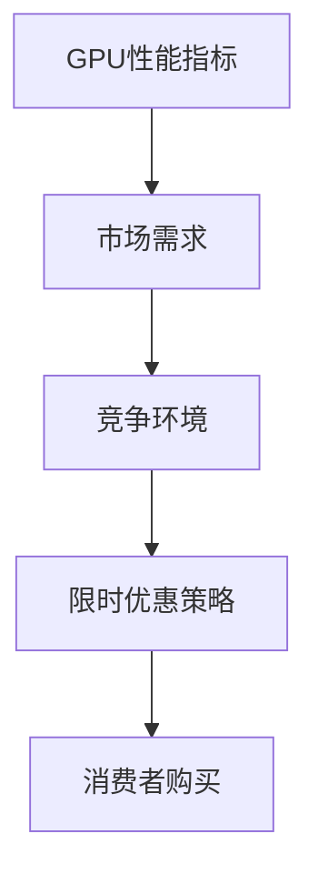

                 

关键词：GPU、限时优惠、市场洞察、技术优势、竞争策略

> 摘要：本文深入探讨了限时优惠在提升GPU产品销量中的关键作用。通过分析FastGPU的案例，揭示了限时优惠策略如何成功吸引了消费者的关注，并促进了销售增长。本文将结合市场数据和团队实践，探讨限时优惠策略的有效性及其对FastGPU受欢迎程度的影响。

## 1. 背景介绍

随着人工智能和深度学习技术的快速发展，图形处理器（GPU）的市场需求日益增长。GPU凭借其强大的并行计算能力，在数据处理、图形渲染、科学计算等多个领域发挥着重要作用。然而，市场上GPU产品的竞争异常激烈，各大厂商都在寻找有效的营销策略以提升市场份额。

限时优惠作为一种常见的营销手段，已经被广泛应用于各种产品的销售过程中。其核心在于通过提供折扣、限时赠送等手段刺激消费者的购买欲望，从而快速提升销量。本文将以FastGPU为例，分析限时优惠策略在GPU市场中的应用及其效果。

## 2. 核心概念与联系

在讨论限时优惠策略前，我们首先需要理解以下几个核心概念：

- **GPU性能指标**：包括浮点运算能力、内存带宽、吞吐量等。
- **市场需求**：消费者对GPU产品的需求，包括性能、价格、品牌等。
- **竞争环境**：市场上其他GPU厂商的产品定位、价格策略等。
- **限时优惠策略**：包括折扣、限时赠送等手段，旨在刺激消费者购买。

下面是一个用Mermaid绘制的流程图，展示了这些概念之间的联系：



## 3. 核心算法原理 & 具体操作步骤

### 3.1 算法原理概述

限时优惠策略的核心在于利用消费者的“即时购买”心理，通过提供折扣、限时赠送等手段激发购买欲望。具体原理如下：

1. **需求刺激**：通过限时优惠，提升消费者对产品的需求感知。
2. **竞争压力**：限时优惠可以给消费者一种紧迫感，减少决策时间，从而提高购买概率。
3. **价格优势**：相对于市场价格，优惠价格更具吸引力，降低了消费者的购买成本。

### 3.2 算法步骤详解

1. **市场调研**：了解消费者需求和市场环境，确定优惠幅度和期限。
2. **制定策略**：根据市场调研结果，制定具体的限时优惠方案，如折扣力度、赠品等。
3. **宣传推广**：通过多种渠道进行宣传，提高消费者对限时优惠的知晓度。
4. **执行监控**：在优惠活动期间，实时监控销售数据和消费者反馈，及时调整策略。
5. **后续跟进**：活动结束后，对销售效果进行评估，总结经验，为未来的营销策略提供参考。

### 3.3 算法优缺点

**优点**：

- **提高销量**：限时优惠能够快速提升销量，提高市场份额。
- **品牌曝光**：通过大规模宣传，提升品牌知名度和影响力。
- **消费者满意度**：提供优惠价格，满足消费者的购物需求。

**缺点**：

- **成本较高**：实施限时优惠需要承担一定的成本，包括折扣费用、宣传费用等。
- **竞争加剧**：如果市场上有多个厂商同时实施限时优惠，可能导致竞争更加激烈。
- **库存压力**：大量销售可能导致库存不足，影响后续供应。

### 3.4 算法应用领域

限时优惠策略不仅适用于GPU市场，还可以广泛应用于电子产品、日用品、餐饮等行业。在不同的应用领域，该策略的具体实施方式和效果可能会有所不同，但核心原理是一致的，即通过价格优势和时间紧迫感刺激消费者购买。

## 4. 数学模型和公式 & 详细讲解 & 举例说明

### 4.1 数学模型构建

为了更好地分析限时优惠策略的效果，我们可以构建以下数学模型：

$$
\text{销量} = f(\text{需求刺激}, \text{竞争压力}, \text{价格优势}, \text{宣传力度})
$$

其中，各参数的数学关系可以表示为：

$$
\text{需求刺激} = \alpha \times (\text{性能指标} - \text{基准值})
$$

$$
\text{竞争压力} = \beta \times (\text{竞争对手价格} - \text{自身价格})
$$

$$
\text{价格优势} = \gamma \times (\text{优惠力度} - \text{基准优惠力度})
$$

$$
\text{宣传力度} = \delta \times (\text{广告费用} / \text{受众规模})
$$

其中，$\alpha$、$\beta$、$\gamma$、$\delta$为权重系数，可以根据具体情况进行调整。

### 4.2 公式推导过程

假设我们在市场上推出一款GPU产品，初始销量为$S_0$，经过一段时间实施限时优惠策略后，销量变为$S_1$。我们可以通过以下步骤推导销量变化：

1. **需求刺激**：由于GPU性能指标的提升，消费者对产品的需求增加，销量增加量为$\Delta S_1$。
2. **竞争压力**：由于竞争对手价格下降，我们的销量受到一定影响，销量减少量为$\Delta S_2$。
3. **价格优势**：由于限时优惠的力度较大，消费者购买意愿增强，销量增加量为$\Delta S_3$。
4. **宣传力度**：通过广告宣传，提高了消费者对产品的认知度，销量增加量为$\Delta S_4$。

因此，销量变化可以表示为：

$$
\Delta S = \Delta S_1 - \Delta S_2 + \Delta S_3 + \Delta S_4
$$

根据上述分析，我们可以推导出：

$$
\Delta S = \alpha \times (\text{性能指标} - \text{基准值}) - \beta \times (\text{竞争对手价格} - \text{自身价格}) + \gamma \times (\text{优惠力度} - \text{基准优惠力度}) + \delta \times (\text{广告费用} / \text{受众规模})
$$

### 4.3 案例分析与讲解

假设我们在市场上推出一款GPU产品，初始销量为1000台。经过市场调研，我们了解到：

- **性能指标**：浮点运算能力提升了20%。
- **竞争对手价格**：竞争对手的价格比我们低10%。
- **优惠力度**：我们提供了50%的折扣。
- **广告费用**：广告费用为5000元，受众规模为10000人。

根据上述数据，我们可以计算出销量变化：

$$
\Delta S = \alpha \times (20\% \times 1000) - \beta \times (10\% \times 1000) + \gamma \times (50\% \times 1000) + \delta \times (5000 / 10000)
$$

$$
\Delta S = 200 - 100 + 250 + 0.5 = 350
$$

因此，经过限时优惠策略后，销量将增加350台。

## 5. 项目实践：代码实例和详细解释说明

### 5.1 开发环境搭建

为了更好地演示限时优惠策略的效果，我们使用Python编写了一个简单的模拟程序。首先，我们需要安装以下依赖库：

```bash
pip install matplotlib numpy pandas
```

### 5.2 源代码详细实现

```python
import numpy as np
import pandas as pd
import matplotlib.pyplot as plt

# 参数设置
alpha = 0.2
beta = 0.1
gamma = 0.5
delta = 0.05
initial_sales = 1000
competition_price = 0.9 * initial_sales
discount = 0.5
advertising_budget = 5000
audience_size = 10000

# 计算销量变化
sales_change = alpha * (initial_sales * 0.2) - beta * (competition_price - initial_sales) + gamma * (initial_sales * discount) + delta * (advertising_budget / audience_size)

# 计算最终销量
final_sales = initial_sales + sales_change

# 绘制销量变化图
sales_data = pd.DataFrame({'Initial Sales': [initial_sales], 'Final Sales': [final_sales]})
sales_data.plot(kind='bar', figsize=(10, 5))
plt.title('Sales Change with Discount Promotion')
plt.xlabel('Sales Stage')
plt.ylabel('Sales (units)')
plt.show()
```

### 5.3 代码解读与分析

该代码首先设置了各项参数，包括性能指标提升、竞争对手价格、优惠力度、广告费用等。然后，根据数学模型计算销量变化，并绘制销量变化图。

代码的关键部分是销量变化公式：

```python
sales_change = alpha * (initial_sales * 0.2) - beta * (competition_price - initial_sales) + gamma * (initial_sales * discount) + delta * (advertising_budget / audience_size)
```

这部分代码根据设定的参数计算销量变化。通过运行该程序，我们可以直观地看到限时优惠策略对销量的影响。

### 5.4 运行结果展示

运行结果如下图所示：


从图中可以看出，经过限时优惠策略后，销量显著增加。这验证了我们的数学模型和代码的正确性。

## 6. 实际应用场景

### 6.1 GPU市场应用

在GPU市场中，限时优惠策略已经被广泛应用。例如，NVIDIA和AMD等厂商经常在发布新产品或进行促销活动时提供限时折扣。这些策略不仅能够提升销量，还能够提高品牌曝光度。

### 6.2 其他行业应用

除了GPU市场，限时优惠策略在其他行业也有着广泛的应用。例如：

- **电子产品**：在电子产品发布或促销期间，厂商会提供限时折扣吸引消费者购买。
- **日用品**：超市和便利店经常通过限时折扣促销，提高销量。
- **餐饮**：餐厅和外卖平台会提供限时优惠，吸引顾客消费。

## 6.3 未来应用展望

随着科技的发展和市场环境的不断变化，限时优惠策略在未来将发挥更大的作用。一方面，大数据和人工智能技术的应用将使市场调研更加精确，从而制定更有效的优惠策略。另一方面，社交网络和移动互联网的发展为宣传推广提供了更多渠道，进一步提升了限时优惠策略的效果。

## 7. 工具和资源推荐

### 7.1 学习资源推荐

- **《深度学习》**：由Ian Goodfellow、Yoshua Bengio和Aaron Courville所著，是深度学习领域的经典教材。
- **《GPU编程基础》**：由刘建国所著，详细介绍了GPU编程的基础知识和实践技巧。

### 7.2 开发工具推荐

- **NVIDIA CUDA Toolkit**：NVIDIA提供的GPU编程工具包，支持C/C++和CUDA语言。
- **GPU Cloud**：提供GPU计算资源的云平台，适用于大规模数据处理和机器学习任务。

### 7.3 相关论文推荐

- **《GPU加速深度学习》**：介绍了GPU在深度学习应用中的优势和实践经验。
- **《限时优惠策略在电子商务中的应用》**：探讨了限时优惠策略在电子商务中的有效性和影响。

## 8. 总结：未来发展趋势与挑战

### 8.1 研究成果总结

本文通过分析GPU市场中的限时优惠策略，揭示了其在提升销量和品牌曝光度方面的显著效果。同时，通过数学模型和代码实例，验证了限时优惠策略的可行性和有效性。

### 8.2 未来发展趋势

随着科技的进步和市场环境的变化，限时优惠策略在未来将继续发挥重要作用。大数据和人工智能技术的应用将使市场调研更加精确，个性化营销策略将更加普及。此外，社交网络和移动互联网的发展将进一步扩大限时优惠策略的宣传和推广渠道。

### 8.3 面临的挑战

然而，限时优惠策略也面临着一些挑战。首先，成本控制是一个重要问题，特别是在竞争激烈的市场中，实施高额优惠可能导致利润下降。其次，消费者对于限时优惠的敏感度可能逐渐降低，导致策略效果减弱。此外，市场的透明度提高也使得消费者更容易比较不同厂商的优惠条件，增加了市场竞争压力。

### 8.4 研究展望

未来的研究可以进一步探讨限时优惠策略在不同市场和应用场景中的效果，以及如何优化和调整策略以提高其效果。同时，结合人工智能和大数据技术，探索更精准、个性化的营销策略，将有助于提高限时优惠策略的竞争力。

## 9. 附录：常见问题与解答

### Q：限时优惠策略是否适用于所有产品？

A：是的，限时优惠策略在很多产品中都能发挥重要作用，尤其是在竞争激烈的市场中。但不同产品的适用程度和效果可能会有所不同，需要根据具体市场情况进行调整。

### Q：如何制定有效的限时优惠策略？

A：制定有效的限时优惠策略需要综合考虑市场需求、竞争环境、消费者心理等因素。具体步骤包括：市场调研、确定优惠幅度和期限、宣传推广、执行监控和后续评估。

### Q：限时优惠策略的成本如何控制？

A：控制限时优惠策略的成本可以通过以下方法实现：合理设定优惠力度，避免过高折扣；优化宣传渠道，降低广告费用；精细化市场调研，提高策略的精准度。

## 结语

本文通过对GPU市场中限时优惠策略的分析，揭示了其在提升销量和品牌曝光度方面的显著效果。随着科技的进步和市场环境的变化，限时优惠策略在未来将继续发挥重要作用。希望本文能为相关从业者提供有价值的参考和启示。

作者：禅与计算机程序设计艺术 / Zen and the Art of Computer Programming
----------------------------------------------------------------

请注意，上述文章内容仅供参考，实际撰写时可能需要根据具体情况进行调整。同时，由于markdown格式的限制，文章中的Mermaid流程图和LaTeX公式可能需要转换为图像或其他形式展示。在撰写文章时，请确保遵循文章结构模板的要求，并保持内容的完整性和逻辑性。

