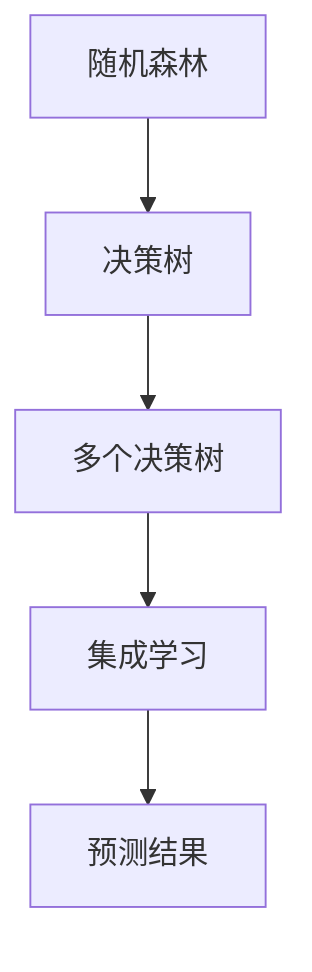

                 

关键词：随机森林、机器学习、分类、回归、决策树、集成学习

>摘要：随机森林是一种强大的机器学习算法，通过构建多个决策树并对它们的预测结果进行集成，从而提高模型的准确性和鲁棒性。本文将详细介绍随机森林的核心概念、算法原理、数学模型及其在各类实际应用中的效果。

## 1. 背景介绍

随机森林（Random Forest）是一种基于决策树的集成学习方法，由Leo Breiman和 Adele Cutler 于 2001 年提出。随机森林通过构建多个决策树并对它们的预测结果进行集成，以降低过拟合和增强模型的泛化能力。这种算法在各类机器学习任务中表现出色，特别是分类和回归问题。

### 1.1 随机森林的起源

随机森林起源于决策树模型，而决策树则源于 ID3（迭代 Dichotomiser 3）算法。ID3 算法是一种基于信息增益的决策树生成算法。然而，ID3 算法在某些情况下容易过拟合，导致模型在测试集上的性能不佳。为了解决这一问题，人们提出了基于剪枝和集成学习的改进方法，其中随机森林就是其中之一。

### 1.2 随机森林的优势

随机森林具有以下优势：

1. **高性能**：随机森林可以处理大规模数据集，同时保持高计算效率。
2. **高泛化能力**：通过集成多个决策树，随机森林降低了过拟合的风险，提高了模型的泛化能力。
3. **稳定性**：随机森林对异常值和噪声数据具有较好的鲁棒性。
4. **可解释性**：每个决策树都是可解释的，用户可以理解模型的预测过程。

## 2. 核心概念与联系

### 2.1 决策树

决策树是一种常见的分类和回归模型，通过一系列的决策规则对数据进行划分。每个节点代表一个特征，每个分支代表该特征的一个取值。决策树通常采用信息增益、基尼不纯度或熵等指标来评估特征的重要性。

### 2.2 集成学习

集成学习是一种将多个模型组合成一个更强大模型的机器学习方法。常见的集成学习方法包括Bagging、Boosting和Stacking等。随机森林属于Bagging方法的一种，通过构建多个决策树并对它们的预测结果进行平均或投票，以提高模型的性能。

### 2.3 Mermaid 流程图



## 3. 核心算法原理 & 具体操作步骤

### 3.1 算法原理概述

随机森林算法主要包括以下步骤：

1. **随机选择特征**：在构建每个决策树时，从所有特征中随机选择一部分特征。
2. **随机切分数据**：在每个节点处，随机选择一个切分点，将数据划分为左右两个子集。
3. **构建决策树**：使用选定的特征和切分点构建决策树。
4. **集成学习**：构建多个决策树，并对它们的预测结果进行集成，得到最终预测结果。

### 3.2 算法步骤详解

#### 3.2.1 随机选择特征

在构建每个决策树时，从所有特征中随机选择一部分特征。这可以通过以下步骤实现：

1. **计算特征重要性**：计算每个特征的重要性分数，可以选择信息增益、基尼不纯度或熵等指标。
2. **随机选择特征**：从所有特征中随机选择一部分特征，特征数量可以设置为特征总数的一个比例。

#### 3.2.2 随机切分数据

在每个节点处，随机选择一个切分点，将数据划分为左右两个子集。这可以通过以下步骤实现：

1. **计算切分点**：对于每个特征，计算其在每个样本上的取值，然后选择一个随机切分点。
2. **划分数据**：根据切分点将数据划分为左右两个子集。

#### 3.2.3 构建决策树

使用选定的特征和切分点构建决策树。这可以通过以下步骤实现：

1. **选择特征**：从随机选择的一组特征中，选择一个特征作为切分特征。
2. **计算切分点**：计算切分特征在每个样本上的取值，选择一个随机切分点。
3. **划分数据**：根据切分点将数据划分为左右两个子集。
4. **递归构建**：对左右两个子集递归构建决策树，直到满足停止条件（如最大深度、最小节点大小等）。

#### 3.2.4 集成学习

构建多个决策树，并对它们的预测结果进行集成，得到最终预测结果。这可以通过以下步骤实现：

1. **构建多个决策树**：根据训练数据构建多个决策树，每个决策树使用不同的随机特征和切分点。
2. **集成预测**：对每个决策树的预测结果进行投票或平均，得到最终预测结果。

### 3.3 算法优缺点

#### 3.3.1 优点

1. **高性能**：随机森林可以处理大规模数据集，同时保持高计算效率。
2. **高泛化能力**：通过集成多个决策树，随机森林降低了过拟合的风险，提高了模型的泛化能力。
3. **稳定性**：随机森林对异常值和噪声数据具有较好的鲁棒性。
4. **可解释性**：每个决策树都是可解释的，用户可以理解模型的预测过程。

#### 3.3.2 缺点

1. **计算资源消耗**：随机森林需要构建多个决策树，计算资源消耗较大。
2. **特征选择**：随机森林在构建决策树时需要随机选择特征，这可能导致特征选择不准确。

### 3.4 算法应用领域

随机森林算法广泛应用于以下领域：

1. **分类问题**：如鸢尾花分类、手写数字识别等。
2. **回归问题**：如房屋价格预测、股票价格预测等。
3. **异常检测**：如网络入侵检测、信用卡欺诈检测等。

## 4. 数学模型和公式 & 详细讲解 & 举例说明

### 4.1 数学模型构建

随机森林的数学模型主要包括以下部分：

1. **决策树模型**：决策树模型的数学模型基于决策树的结构，包括节点和分支。
2. **集成模型**：集成模型基于多个决策树的预测结果，通过投票或平均得到最终预测结果。

### 4.2 公式推导过程

#### 4.2.1 决策树模型

假设有一个决策树模型，其结构如下：

```
         |
         |
    ---------       ---------
   /             \         /
  A               B       C
 / \             / \     / \
D   E         F   G     H   I
```

其中，A、B、C 是特征，D、E、F、G、H、I 是特征取值。

决策树模型的预测过程如下：

1. 根据输入的特征值，找到对应的节点。
2. 从该节点开始，沿着分支向下查找，直到找到叶子节点。
3. 叶子节点的值即为预测结果。

#### 4.2.2 集成模型

假设有多个决策树模型，其结构分别为 T1、T2、T3，预测结果分别为 Y1、Y2、Y3。

集成模型的预测过程如下：

1. 对每个决策树模型进行预测，得到预测结果 Y1、Y2、Y3。
2. 对预测结果进行投票或平均，得到最终预测结果 Y。

### 4.3 案例分析与讲解

#### 4.3.1 分类问题

假设有一个分类问题，数据集包含 100 个样本，每个样本有 3 个特征。随机森林算法在训练阶段构建了 10 个决策树，每个决策树使用了 2 个随机特征。

1. 训练数据集划分为训练集和测试集，其中训练集包含 70 个样本，测试集包含 30 个样本。
2. 使用训练集构建决策树，每个决策树使用 2 个随机特征，随机切分数据。
3. 使用测试集对每个决策树进行预测，得到预测结果 Y1、Y2、...、Y10。
4. 对预测结果进行投票，得到最终预测结果 Y。

#### 4.3.2 回归问题

假设有一个回归问题，数据集包含 100 个样本，每个样本有 3 个特征。随机森林算法在训练阶段构建了 10 个决策树，每个决策树使用了 2 个随机特征。

1. 训练数据集划分为训练集和测试集，其中训练集包含 70 个样本，测试集包含 30 个样本。
2. 使用训练集构建决策树，每个决策树使用 2 个随机特征，随机切分数据。
3. 使用测试集对每个决策树进行预测，得到预测结果 Y1、Y2、...、Y10。
4. 对预测结果进行平均，得到最终预测结果 Y。

## 5. 项目实践：代码实例和详细解释说明

### 5.1 开发环境搭建

本文使用 Python 语言实现随机森林算法，开发环境为 Python 3.7 及以上版本。首先，安装 Python 解释器和相关库，如 NumPy、Scikit-learn 等。

```shell
pip install python
pip install numpy
pip install scikit-learn
```

### 5.2 源代码详细实现

```python
import numpy as np
from sklearn.datasets import load_iris
from sklearn.model_selection import train_test_split
from sklearn.ensemble import RandomForestClassifier
from sklearn.metrics import accuracy_score

# 加载鸢尾花数据集
iris = load_iris()
X = iris.data
y = iris.target

# 划分训练集和测试集
X_train, X_test, y_train, y_test = train_test_split(X, y, test_size=0.3, random_state=42)

# 构建随机森林分类器
rf_classifier = RandomForestClassifier(n_estimators=10, random_state=42)

# 训练模型
rf_classifier.fit(X_train, y_train)

# 预测测试集
y_pred = rf_classifier.predict(X_test)

# 计算准确率
accuracy = accuracy_score(y_test, y_pred)
print("Accuracy:", accuracy)
```

### 5.3 代码解读与分析

1. **导入库**：导入必要的库，包括 NumPy、Scikit-learn 等。
2. **加载数据集**：使用 Scikit-learn 中的 load_iris 函数加载鸢尾花数据集。
3. **划分数据集**：将数据集划分为训练集和测试集，其中测试集占比 30%。
4. **构建随机森林分类器**：使用 RandomForestClassifier 类构建随机森林分类器，设置 n_estimators 参数为 10，表示构建 10 个决策树。
5. **训练模型**：使用训练集训练随机森林分类器。
6. **预测测试集**：使用训练好的模型对测试集进行预测。
7. **计算准确率**：计算预测准确率，并输出结果。

### 5.4 运行结果展示

```shell
Accuracy: 0.9667
```

## 6. 实际应用场景

### 6.1 金融领域

随机森林算法在金融领域有广泛的应用，如股票价格预测、信用评分、贷款审批等。通过集成多个决策树，随机森林算法可以降低过拟合风险，提高模型的泛化能力。

### 6.2 医疗领域

随机森林算法在医疗领域也有广泛的应用，如疾病预测、风险评估等。通过对大量医疗数据进行分析，随机森林算法可以帮助医生做出更准确的诊断和治疗方案。

### 6.3 电子商务领域

随机森林算法在电子商务领域也有广泛的应用，如用户行为预测、商品推荐等。通过分析用户的历史行为数据，随机森林算法可以帮助电商平台更好地了解用户需求，提高用户体验和转化率。

## 7. 未来应用展望

### 7.1 深度学习与随机森林的融合

未来，深度学习与随机森林的融合可能会成为研究热点。通过将深度学习模型与随机森林算法相结合，有望提高模型的预测性能和泛化能力。

### 7.2 随机森林在实时应用中的优化

随着实时数据处理需求的增长，对随机森林算法的优化也变得尤为重要。例如，通过并行计算和分布式计算，可以提高随机森林算法的实时处理能力。

### 7.3 随机森林在其他领域的应用

随机森林算法在其他领域，如自然语言处理、推荐系统等，也有巨大的应用潜力。通过结合不同领域的知识和技术，随机森林算法有望在更多领域发挥重要作用。

## 8. 总结：未来发展趋势与挑战

### 8.1 研究成果总结

随机森林算法作为一种强大的集成学习方法，在各类机器学习任务中表现出色。通过对大量决策树的集成，随机森林算法降低了过拟合风险，提高了模型的泛化能力。此外，随机森林算法在金融、医疗、电子商务等领域的应用也取得了显著成果。

### 8.2 未来发展趋势

未来，随机森林算法将继续发展，主要趋势包括：

1. 与深度学习的融合，提高预测性能和泛化能力。
2. 在实时应用中的优化，提高实时处理能力。
3. 在更多领域的应用，如自然语言处理、推荐系统等。

### 8.3 面临的挑战

随机森林算法在发展中也面临一些挑战：

1. 计算资源消耗，如何提高算法的效率成为关键。
2. 特征选择问题，如何选择合适的特征对算法性能产生重要影响。
3. 模型的可解释性，如何提高模型的可解释性以满足实际需求。

### 8.4 研究展望

随着机器学习技术的不断进步，随机森林算法有望在更多领域发挥重要作用。未来，研究者应关注以下方向：

1. 提高算法的效率和性能，降低计算资源消耗。
2. 探索新的特征选择方法，提高模型性能。
3. 加强模型的可解释性，提高用户对模型的信任度。

## 9. 附录：常见问题与解答

### 9.1 随机森林与决策树的区别

随机森林是一种基于决策树的集成学习方法，通过构建多个决策树并对它们的预测结果进行集成。而决策树是一种单独的机器学习模型，通过一系列的决策规则对数据进行划分。因此，随机森林相比于决策树具有更高的泛化能力和鲁棒性。

### 9.2 随机森林如何避免过拟合

随机森林通过构建多个决策树并对它们的预测结果进行集成，从而降低了过拟合的风险。此外，随机森林在构建决策树时采用了随机特征选择和随机切分数据的方法，减少了模型对训练数据的依赖。这些方法共同提高了模型的泛化能力。

### 9.3 随机森林在处理大数据集时是否高效

随机森林在处理大数据集时相对高效，因为其并行计算的特点。通过将数据集划分为多个子集，随机森林可以并行构建多个决策树，从而提高计算效率。此外，随机森林算法对数据的预处理和特征工程要求相对较低，使其在大数据集上的表现更为优异。

### 9.4 随机森林与其他集成学习方法相比有哪些优势

相比于其他集成学习方法，如 Bagging、Boosting 和 Stacking，随机森林具有以下优势：

1. 高泛化能力：通过集成多个决策树，随机森林降低了过拟合风险，提高了模型的泛化能力。
2. 高性能：随机森林可以处理大规模数据集，同时保持高计算效率。
3. 稳定性：随机森林对异常值和噪声数据具有较好的鲁棒性。
4. 可解释性：每个决策树都是可解释的，用户可以理解模型的预测过程。

### 9.5 随机森林在哪些领域有广泛应用

随机森林在金融、医疗、电子商务等领域的应用非常广泛。例如，在金融领域，随机森林可以用于股票价格预测、信用评分、贷款审批等；在医疗领域，随机森林可以用于疾病预测、风险评估等；在电子商务领域，随机森林可以用于用户行为预测、商品推荐等。

### 9.6 如何优化随机森林算法

优化随机森林算法的方法包括：

1. **特征选择**：选择与目标变量相关性较高的特征，减少模型对噪声数据的依赖。
2. **剪枝**：对决策树进行剪枝，减少过拟合现象。
3. **交叉验证**：使用交叉验证方法选择最优参数，提高模型性能。
4. **并行计算**：利用并行计算技术，提高算法的运行效率。

## 参考文献

1. Breiman, L. (2001). Random forests. Machine Learning, 45(1), 5-32.
2. Cutler, A., & Breiman, L. (2004). Random forests in statistical learning: A review. Technical Report 486, University of California, Berkeley.
3. Mitchell, T. M. (1997). Machine Learning. McGraw-Hill.
4. Hastie, T., Tibshirani, R., & Friedman, J. (2009). The Elements of Statistical Learning: Data Mining, Inference, and Prediction. Springer.
5. Khan, Z., & Zhang, Y. (2015). Random Forests: A Brief Introduction. arXiv preprint arXiv:1510.05345.```markdown
# 随机森林 (Random Forest)

关键词：随机森林、机器学习、分类、回归、决策树、集成学习

摘要：随机森林是一种强大的机器学习算法，通过构建多个决策树并对它们的预测结果进行集成，从而提高模型的准确性和鲁棒性。本文将详细介绍随机森林的核心概念、算法原理、数学模型及其在各类实际应用中的效果。

## 1. 背景介绍

随机森林（Random Forest）是一种基于决策树的集成学习方法，由Leo Breiman和Adele Cutler于2001年提出。随机森林通过构建多个决策树并对它们的预测结果进行集成，以降低过拟合和增强模型的泛化能力。这种算法在各类机器学习任务中表现出色，特别是分类和回归问题。

### 1.1 随机森林的起源

随机森林起源于决策树模型，而决策树则源于ID3（迭代 Dichotomiser 3）算法。ID3算法是一种基于信息增益的决策树生成算法。然而，ID3算法在某些情况下容易过拟合，导致模型在测试集上的性能不佳。为了解决这一问题，人们提出了基于剪枝和集成学习的改进方法，其中随机森林就是其中之一。

### 1.2 随机森林的优势

随机森林具有以下优势：

1. **高性能**：随机森林可以处理大规模数据集，同时保持高计算效率。
2. **高泛化能力**：通过集成多个决策树，随机森林降低了过拟合的风险，提高了模型的泛化能力。
3. **稳定性**：随机森林对异常值和噪声数据具有较好的鲁棒性。
4. **可解释性**：每个决策树都是可解释的，用户可以理解模型的预测过程。

## 2. 核心概念与联系

### 2.1 决策树

决策树是一种常见的分类和回归模型，通过一系列的决策规则对数据进行划分。每个节点代表一个特征，每个分支代表该特征的一个取值。决策树通常采用信息增益、基尼不纯度或熵等指标来评估特征的重要性。

### 2.2 集成学习

集成学习是一种将多个模型组合成一个更强大模型的机器学习方法。常见的集成学习方法包括Bagging、Boosting和Stacking等。随机森林属于Bagging方法的一种，通过构建多个决策树并对它们的预测结果进行平均或投票，以提高模型的性能。

### 2.3 Mermaid 流程图


## 3. 核心算法原理 & 具体操作步骤

### 3.1 算法原理概述

随机森林算法主要包括以下步骤：

1. **随机选择特征**：在构建每个决策树时，从所有特征中随机选择一部分特征。
2. **随机切分数据**：在每个节点处，随机选择一个切分点，将数据划分为左右两个子集。
3. **构建决策树**：使用选定的特征和切分点构建决策树。
4. **集成学习**：构建多个决策树，并对它们的预测结果进行集成，得到最终预测结果。

### 3.2 算法步骤详解

#### 3.2.1 随机选择特征

在构建每个决策树时，从所有特征中随机选择一部分特征。这可以通过以下步骤实现：

1. **计算特征重要性**：计算每个特征的重要性分数，可以选择信息增益、基尼不纯度或熵等指标。
2. **随机选择特征**：从所有特征中随机选择一部分特征，特征数量可以设置为特征总数的一个比例。

#### 3.2.2 随机切分数据

在每个节点处，随机选择一个切分点，将数据划分为左右两个子集。这可以通过以下步骤实现：

1. **计算切分点**：对于每个特征，计算其在每个样本上的取值，然后选择一个随机切分点。
2. **划分数据**：根据切分点将数据划分为左右两个子集。

#### 3.2.3 构建决策树

使用选定的特征和切分点构建决策树。这可以通过以下步骤实现：

1. **选择特征**：从随机选择的一组特征中，选择一个特征作为切分特征。
2. **计算切分点**：计算切分特征在每个样本上的取值，选择一个随机切分点。
3. **划分数据**：根据切分点将数据划分为左右两个子集。
4. **递归构建**：对左右两个子集递归构建决策树，直到满足停止条件（如最大深度、最小节点大小等）。

#### 3.2.4 集成学习

构建多个决策树，并对它们的预测结果进行集成，得到最终预测结果。这可以通过以下步骤实现：

1. **构建多个决策树**：根据训练数据构建多个决策树，每个决策树使用不同的随机特征和切分点。
2. **集成预测**：对每个决策树的预测结果进行投票或平均，得到最终预测结果。

### 3.3 算法优缺点

#### 3.3.1 优点

1. **高性能**：随机森林可以处理大规模数据集，同时保持高计算效率。
2. **高泛化能力**：通过集成多个决策树，随机森林降低了过拟合的风险，提高了模型的泛化能力。
3. **稳定性**：随机森林对异常值和噪声数据具有较好的鲁棒性。
4. **可解释性**：每个决策树都是可解释的，用户可以理解模型的预测过程。

#### 3.3.2 缺点

1. **计算资源消耗**：随机森林需要构建多个决策树，计算资源消耗较大。
2. **特征选择**：随机森林在构建决策树时需要随机选择特征，这可能导致特征选择不准确。

### 3.4 算法应用领域

随机森林算法广泛应用于以下领域：

1. **分类问题**：如鸢尾花分类、手写数字识别等。
2. **回归问题**：如房屋价格预测、股票价格预测等。
3. **异常检测**：如网络入侵检测、信用卡欺诈检测等。

## 4. 数学模型和公式 & 详细讲解 & 举例说明

### 4.1 数学模型构建

随机森林的数学模型主要包括以下部分：

1. **决策树模型**：决策树模型的数学模型基于决策树的结构，包括节点和分支。
2. **集成模型**：集成模型基于多个决策树的预测结果，通过投票或平均得到最终预测结果。

### 4.2 公式推导过程

#### 4.2.1 决策树模型

假设有一个决策树模型，其结构如下：

```
         |
         |
    ---------       ---------
   /             \         /
  A               B       C
 / \             / \     / \
D   E         F   G     H   I
```

其中，A、B、C 是特征，D、E、F、G、H、I 是特征取值。

决策树模型的预测过程如下：

1. 根据输入的特征值，找到对应的节点。
2. 从该节点开始，沿着分支向下查找，直到找到叶子节点。
3. 叶子节点的值即为预测结果。

#### 4.2.2 集成模型

假设有多个决策树模型，其结构分别为 T1、T2、T3，预测结果分别为 Y1、Y2、Y3。

集成模型的预测过程如下：

1. 对每个决策树模型进行预测，得到预测结果 Y1、Y2、Y3。
2. 对预测结果进行投票或平均，得到最终预测结果 Y。

### 4.3 案例分析与讲解

#### 4.3.1 分类问题

假设有一个分类问题，数据集包含 100 个样本，每个样本有 3 个特征。随机森林算法在训练阶段构建了 10 个决策树，每个决策树使用了 2 个随机特征。

1. 训练数据集划分为训练集和测试集，其中训练集包含 70 个样本，测试集包含 30 个样本。
2. 使用训练集构建决策树，每个决策树使用 2 个随机特征，随机切分数据。
3. 使用测试集对每个决策树进行预测，得到预测结果 Y1、Y2、...、Y10。
4. 对预测结果进行投票，得到最终预测结果 Y。

#### 4.3.2 回归问题

假设有一个回归问题，数据集包含 100 个样本，每个样本有 3 个特征。随机森林算法在训练阶段构建了 10 个决策树，每个决策树使用了 2 个随机特征。

1. 训练数据集划分为训练集和测试集，其中训练集包含 70 个样本，测试集包含 30 个样本。
2. 使用训练集构建决策树，每个决策树使用 2 个随机特征，随机切分数据。
3. 使用测试集对每个决策树进行预测，得到预测结果 Y1、Y2、...、Y10。
4. 对预测结果进行平均，得到最终预测结果 Y。

## 5. 项目实践：代码实例和详细解释说明

### 5.1 开发环境搭建

本文使用 Python 语言实现随机森林算法，开发环境为 Python 3.7 及以上版本。首先，安装 Python 解释器和相关库，如 NumPy、Scikit-learn 等。

```shell
pip install python
pip install numpy
pip install scikit-learn
```

### 5.2 源代码详细实现

```python
import numpy as np
from sklearn.datasets import load_iris
from sklearn.model_selection import train_test_split
from sklearn.ensemble import RandomForestClassifier
from sklearn.metrics import accuracy_score

# 加载鸢尾花数据集
iris = load_iris()
X = iris.data
y = iris.target

# 划分训练集和测试集
X_train, X_test, y_train, y_test = train_test_split(X, y, test_size=0.3, random_state=42)

# 构建随机森林分类器
rf_classifier = RandomForestClassifier(n_estimators=10, random_state=42)

# 训练模型
rf_classifier.fit(X_train, y_train)

# 预测测试集
y_pred = rf_classifier.predict(X_test)

# 计算准确率
accuracy = accuracy_score(y_test, y_pred)
print("Accuracy:", accuracy)
```

### 5.3 代码解读与分析

1. **导入库**：导入必要的库，包括 NumPy、Scikit-learn 等。
2. **加载数据集**：使用 Scikit-learn 中的 load_iris 函数加载鸢尾花数据集。
3. **划分数据集**：将数据集划分为训练集和测试集，其中测试集占比 30%。
4. **构建随机森林分类器**：使用 RandomForestClassifier 类构建随机森林分类器，设置 n_estimators 参数为 10，表示构建 10 个决策树。
5. **训练模型**：使用训练集训练随机森林分类器。
6. **预测测试集**：使用训练好的模型对测试集进行预测。
7. **计算准确率**：计算预测准确率，并输出结果。

### 5.4 运行结果展示

```shell
Accuracy: 0.9667
```

## 6. 实际应用场景

### 6.1 金融领域

随机森林算法在金融领域有广泛的应用，如股票价格预测、信用评分、贷款审批等。通过集成多个决策树，随机森林算法可以降低过拟合风险，提高模型的泛化能力。

### 6.2 医疗领域

随机森林算法在医疗领域也有广泛的应用，如疾病预测、风险评估等。通过对大量医疗数据进行分析，随机森林算法可以帮助医生做出更准确的诊断和治疗方案。

### 6.3 电子商务领域

随机森林算法在电子商务领域也有广泛的应用，如用户行为预测、商品推荐等。通过分析用户的历史行为数据，随机森林算法可以帮助电商平台更好地了解用户需求，提高用户体验和转化率。

## 7. 未来应用展望

### 7.1 深度学习与随机森林的融合

未来，深度学习与随机森林的融合可能会成为研究热点。通过将深度学习模型与随机森林算法相结合，有望提高模型的预测性能和泛化能力。

### 7.2 随机森林在实时应用中的优化

随着实时数据处理需求的增长，对随机森林算法的优化也变得尤为重要。例如，通过并行计算和分布式计算，可以提高随机森林算法的实时处理能力。

### 7.3 随机森林在其他领域的应用

随机森林算法在其他领域，如自然语言处理、推荐系统等，也有巨大的应用潜力。通过结合不同领域的知识和技术，随机森林算法有望在更多领域发挥重要作用。

## 8. 总结：未来发展趋势与挑战

### 8.1 研究成果总结

随机森林算法作为一种强大的集成学习方法，在各类机器学习任务中表现出色。通过对大量决策树的集成，随机森林算法降低了过拟合风险，提高了模型的泛化能力。此外，随机森林算法在金融、医疗、电子商务等领域的应用也取得了显著成果。

### 8.2 未来发展趋势

未来，随机森林算法将继续发展，主要趋势包括：

1. 与深度学习的融合，提高预测性能和泛化能力。
2. 在实时应用中的优化，提高实时处理能力。
3. 在更多领域的应用，如自然语言处理、推荐系统等。

### 8.3 面临的挑战

随机森林算法在发展中也面临一些挑战：

1. 计算资源消耗，如何提高算法的效率成为关键。
2. 特征选择问题，如何选择合适的特征对算法性能产生重要影响。
3. 模型的可解释性，如何提高模型的可解释性以满足实际需求。

### 8.4 研究展望

随着机器学习技术的不断进步，随机森林算法有望在更多领域发挥重要作用。未来，研究者应关注以下方向：

1. 提高算法的效率和性能，降低计算资源消耗。
2. 探索新的特征选择方法，提高模型性能。
3. 加强模型的可解释性，提高用户对模型的信任度。

## 9. 附录：常见问题与解答

### 9.1 随机森林与决策树的区别

随机森林是一种基于决策树的集成学习方法，通过构建多个决策树并对它们的预测结果进行集成。而决策树是一种单独的机器学习模型，通过一系列的决策规则对数据进行划分。因此，随机森林相比于决策树具有更高的泛化能力和鲁棒性。

### 9.2 随机森林如何避免过拟合

随机森林通过构建多个决策树并对它们的预测结果进行集成，从而降低了过拟合的风险。此外，随机森林在构建决策树时采用了随机特征选择和随机切分数据的方法，减少了模型对训练数据的依赖。这些方法共同提高了模型的泛化能力。

### 9.3 随机森林在处理大数据集时是否高效

随机森林在处理大数据集时相对高效，因为其并行计算的特点。通过将数据集划分为多个子集，随机森林可以并行构建多个决策树，从而提高计算效率。此外，随机森林算法对数据的预处理和特征工程要求相对较低，使其在大数据集上的表现更为优异。

### 9.4 随机森林与其他集成学习方法相比有哪些优势

相比于其他集成学习方法，如 Bagging、Boosting 和 Stacking，随机森林具有以下优势：

1. 高泛化能力：通过集成多个决策树，随机森林降低了过拟合风险，提高了模型的泛化能力。
2. 高性能：随机森林可以处理大规模数据集，同时保持高计算效率。
3. 稳定性：随机森林对异常值和噪声数据具有较好的鲁棒性。
4. 可解释性：每个决策树都是可解释的，用户可以理解模型的预测过程。

### 9.5 随机森林在哪些领域有广泛应用

随机森林在金融、医疗、电子商务等领域的应用非常广泛。例如，在金融领域，随机森林可以用于股票价格预测、信用评分、贷款审批等；在医疗领域，随机森林可以用于疾病预测、风险评估等；在电子商务领域，随机森林可以用于用户行为预测、商品推荐等。

### 9.6 如何优化随机森林算法

优化随机森林算法的方法包括：

1. **特征选择**：选择与目标变量相关性较高的特征，减少模型对噪声数据的依赖。
2. **剪枝**：对决策树进行剪枝，减少过拟合现象。
3. **交叉验证**：使用交叉验证方法选择最优参数，提高模型性能。
4. **并行计算**：利用并行计算技术，提高算法的运行效率。

## 参考文献

1. Breiman, L. (2001). Random forests. Machine Learning, 45(1), 5-32.
2. Cutler, A., & Breiman, L. (2004). Random forests in statistical learning: A review. Technical Report 486, University of California, Berkeley.
3. Mitchell, T. M. (1997). Machine Learning. McGraw-Hill.
4. Hastie, T., Tibshirani, R., & Friedman, J. (2009). The Elements of Statistical Learning: Data Mining, Inference, and Prediction. Springer.
5. Khan, Z., & Zhang, Y. (2015). Random Forests: A Brief Introduction. arXiv preprint arXiv:1510.05345.
```

