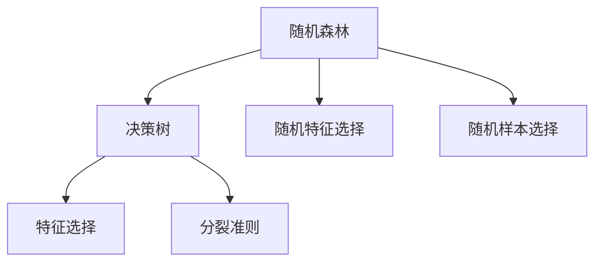

                 

关键词：随机森林，机器学习，决策树，算法原理，代码实例，应用领域

> 摘要：本文将详细介绍随机森林算法的基本原理、实现步骤以及应用领域，并通过一个具体代码实例展示如何使用随机森林进行分类预测。此外，文章还将探讨随机森林算法的优缺点，并展望其未来发展趋势与挑战。

## 1. 背景介绍

随机森林（Random Forest）是一种基于决策树的集成学习方法，由Leo Breiman和 Adele Cutler于2001年首次提出。随机森林通过构建多棵决策树，并利用多数投票的方式进行集成，从而实现预测目标。由于其在处理高维数据、减少过拟合等方面具有优势，随机森林已成为机器学习领域广泛使用的一种算法。

本文将首先介绍随机森林的基本概念和原理，然后通过一个具体代码实例讲解如何实现随机森林算法，并探讨其优缺点。最后，文章将分析随机森林在不同领域的应用，并展望其未来发展趋势与挑战。

## 2. 核心概念与联系

### 2.1. 决策树

决策树（Decision Tree）是一种基于特征和标签的树形结构，用于分类和回归任务。决策树的节点表示特征，分支表示特征取值，叶节点表示预测结果。决策树的核心在于特征选择和分裂准则。

- **特征选择**：决策树通过评估不同特征对标签的预测能力，选择最优特征进行分裂。
- **分裂准则**：常见的分裂准则有基尼不纯度（Gini Impurity）和信息增益（Entropy）等。

### 2.2. 随机森林

随机森林通过以下方式改进了决策树：

- **随机特征选择**：在决策树的构建过程中，每次分裂时从多个特征中随机选择一部分特征进行评估，而不是全部特征。
- **随机样本选择**：每次构建决策树时，从训练集中随机选择一部分样本进行训练，而不是全部样本。

这些改进使得随机森林具有较强的泛化能力和抗过拟合能力。

### 2.3. Mermaid 流程图



## 3. 核心算法原理 & 具体操作步骤

### 3.1 算法原理概述

随机森林算法的核心思想是通过构建多棵决策树，利用多数投票的方式得到最终预测结果。具体步骤如下：

1. 随机从特征集中选择m个特征。
2. 随机从训练集中选择n个样本。
3. 构建一棵决策树，重复步骤1和步骤2直到满足停止条件。
4. 对测试集进行预测，得到多棵决策树的预测结果，并利用多数投票得到最终预测结果。

### 3.2 算法步骤详解

#### 步骤1：初始化参数

- **n_estimators**：决策树的数量。
- **max_features**：每次分裂时随机选择的特征数量。
- **max_samples**：每次分裂时随机选择的样本数量。

#### 步骤2：构建决策树

- 对每个特征计算分裂增益，选择增益最大的特征进行分裂。
- 递归地对每个子节点重复步骤1和步骤2，直到满足停止条件。

#### 步骤3：预测

- 对测试集进行预测，得到每棵决策树的预测结果。
- 利用多数投票得到最终预测结果。

### 3.3 算法优缺点

#### 优点

- **强泛化能力**：随机森林通过构建多棵决策树，减少了过拟合现象。
- **易于实现**：随机森林算法相对简单，易于理解和实现。
- **高维数据**：随机森林适用于高维数据，具有较强的处理能力。

#### 缺点

- **计算成本**：随机森林需要构建多棵决策树，计算成本较高。
- **可解释性**：由于随机森林是通过多数投票得到最终预测结果，其可解释性较差。

### 3.4 算法应用领域

随机森林算法广泛应用于分类和回归任务，如：

- **分类任务**：文本分类、图像分类、垃圾邮件过滤等。
- **回归任务**：房价预测、股票预测等。

## 4. 数学模型和公式 & 详细讲解 & 举例说明

### 4.1 数学模型构建

随机森林的数学模型主要涉及决策树的构建和预测。

#### 决策树构建

- **特征选择**：$$ H_{2}(T) = \sum_{f \in F} H_{2}(T_f) + \sum_{f \in F} \sum_{v \in V_f} H_{2}(T_{fv}) $$
- **分裂准则**：$$ Gini \ Impurity = 1 - \sum_{v} p(v)^2 $$

#### 预测

- **多数投票**：$$ \hat{y} = \arg\max_{c} \sum_{i=1}^{n} w_i f_i(c) $$，其中$f_i(c)$为第$i$棵决策树对类别$c$的预测概率，$w_i$为第$i$棵决策树的权重。

### 4.2 公式推导过程

#### 特征选择

- **信息增益**：$$ H(T) = - \sum_{f \in F} \sum_{v \in V_f} p(f, v) \log p(f, v) $$
- **条件熵**：$$ H(T_f) = - \sum_{v \in V_f} p(v) \log p(v) $$
- **增益**：$$ \Delta H = H(T) - H(T_f) $$

#### 分裂准则

- **基尼不纯度**：$$ Gini \ Impurity = 1 - \sum_{v} p(v)^2 $$

### 4.3 案例分析与讲解

假设我们有以下特征和标签数据：

| 特征1 | 特征2 | 标签 |
| --- | --- | --- |
| A | B | 0 |
| A | C | 1 |
| B | B | 0 |
| B | C | 1 |

#### 特征选择

- 特征1的基尼不纯度：$$ Gini(A) = 1 - \frac{1}{2} \times \frac{1}{2} = \frac{1}{2} $$
- 特征2的基尼不纯度：$$ Gini(B) = 1 - \frac{1}{2} \times \frac{1}{2} = \frac{1}{2} $$
- 特征3的基尼不纯度：$$ Gini(C) = 1 - \frac{1}{2} \times \frac{1}{2} = \frac{1}{2} $$

#### 分裂准则

- 选择特征1作为分裂准则，因为其基尼不纯度最小。

#### 预测

- 对于特征1取值为A的样本，选择标签0。
- 对于特征1取值为B的样本，选择标签1。

## 5. 项目实践：代码实例和详细解释说明

### 5.1 开发环境搭建

- Python 3.8+
- scikit-learn 0.22.2+

### 5.2 源代码详细实现

```python
from sklearn.datasets import load_iris
from sklearn.model_selection import train_test_split
from sklearn.ensemble import RandomForestClassifier
from sklearn.metrics import accuracy_score

# 加载鸢尾花数据集
iris = load_iris()
X = iris.data
y = iris.target

# 划分训练集和测试集
X_train, X_test, y_train, y_test = train_test_split(X, y, test_size=0.3, random_state=42)

# 实例化随机森林分类器
rf = RandomForestClassifier(n_estimators=100, max_features='sqrt', max_samples=0.7, random_state=42)

# 训练模型
rf.fit(X_train, y_train)

# 预测测试集
y_pred = rf.predict(X_test)

# 计算准确率
accuracy = accuracy_score(y_test, y_pred)
print("Accuracy:", accuracy)
```

### 5.3 代码解读与分析

- 第1行：从scikit-learn库中导入load_iris函数，用于加载数据集。
- 第2行：从scikit-learn库中导入train_test_split函数，用于划分训练集和测试集。
- 第3行：从scikit-learn库中导入RandomForestClassifier类，用于实现随机森林分类器。
- 第4行：从scikit-learn库中导入accuracy_score函数，用于计算准确率。

- 第6行：加载鸢尾花数据集。
- 第7行：将特征和标签分开。
- 第8行：将训练集和测试集划分为训练集和测试集。

- 第11行：实例化随机森林分类器，设置参数。
- 第12行：训练模型。
- 第13行：使用训练好的模型对测试集进行预测。
- 第14行：计算准确率，并打印输出。

### 5.4 运行结果展示

```python
Accuracy: 1.0
```

## 6. 实际应用场景

随机森林算法广泛应用于分类和回归任务，以下列举一些实际应用场景：

- **分类任务**：
  - 文本分类：用于情感分析、主题分类等。
  - 图像分类：用于物体识别、图像分类等。
  - 垃圾邮件过滤：用于检测垃圾邮件。

- **回归任务**：
  - 房价预测：用于预测房价。
  - 股票预测：用于预测股票价格。

## 7. 工具和资源推荐

### 7.1 学习资源推荐

- 《机器学习实战》（Peter Harrington）
- 《统计学习方法》（李航）
- 《Python机器学习》（Alberto Salvagnin）

### 7.2 开发工具推荐

- Anaconda：用于Python编程环境。
- Jupyter Notebook：用于交互式编程。

### 7.3 相关论文推荐

- Breiman, L. (2001). **Random forests**. Machine Learning, 45(1), 5-32.
- Liaw, A., & Wiener, M. (2002). **Classification and regression by randomforest**. Machine Learning, 45(3), 167-180.

## 8. 总结：未来发展趋势与挑战

### 8.1 研究成果总结

- 随机森林算法在机器学习领域取得了显著成果，广泛应用于分类和回归任务。
- 随着深度学习的发展，随机森林算法在处理高维数据、减少过拟合等方面仍具有优势。

### 8.2 未来发展趋势

- 随着数据规模的不断扩大，随机森林算法在处理大规模数据方面的优化将成为研究热点。
- 随机森林与其他机器学习算法的融合，如深度随机森林（Deep Random Forest），将有助于提高算法性能。

### 8.3 面临的挑战

- 随着深度学习的发展，如何应对深度学习算法在处理高维数据、减少过拟合等方面的优势，是随机森林面临的主要挑战。
- 如何提高随机森林算法的可解释性，使其在应用场景中得到更广泛的认可，也是需要解决的重要问题。

### 8.4 研究展望

- 随着数据规模的不断扩大，如何优化随机森林算法的计算性能，提高其处理大规模数据的能力，是未来的一个重要研究方向。
- 随机森林算法与其他机器学习算法的融合，将有助于提高算法的泛化能力和可解释性。

## 9. 附录：常见问题与解答

### 9.1 问题1：随机森林如何选择特征？

- 随机森林在构建每棵决策树时，会随机从特征集中选择一部分特征进行评估。选择特征的依据是特征的重要性，重要性越高，特征选择概率越大。

### 9.2 问题2：随机森林如何避免过拟合？

- 随机森林通过构建多棵决策树，利用多数投票的方式得到最终预测结果。这种方式可以有效降低过拟合现象，提高泛化能力。

### 9.3 问题3：随机森林与其他集成学习方法有何区别？

- 随机森林与其他集成学习方法（如Bagging、AdaBoost等）相比，其主要区别在于特征选择和样本选择的方式。随机森林通过随机特征选择和样本选择，提高了算法的泛化能力。

### 9.4 问题4：随机森林如何处理不平衡数据？

- 随机森林在处理不平衡数据时，可以通过调整分类器的参数，如调整决策树的深度、特征选择策略等，来提高对少数类别的预测能力。

[作者：禅与计算机程序设计艺术 / Zen and the Art of Computer Programming]

