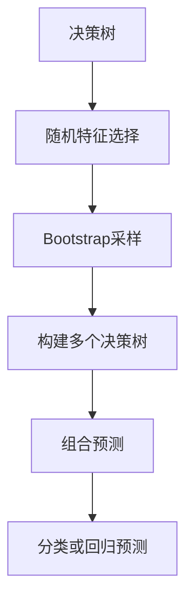

                 

在当今数据科学领域，随机森林（Random Forest）作为一种重要的集成学习方法，已被广泛应用于分类和回归任务中。它的优越性能和良好的泛化能力，使得它在金融、医学、广告等领域有着广泛的应用。本文将深入讲解随机森林的原理，并通过一个具体的代码实例，帮助读者更好地理解和掌握这一算法。

## 关键词

- 随机森林
- 集成学习方法
- 分类与回归
- 数据科学
- 代码实例

## 摘要

本文首先介绍了随机森林的背景和核心概念，然后详细阐述了其原理和算法步骤。通过一个实际代码实例，读者可以直观地了解如何应用随机森林进行数据建模。最后，本文讨论了随机森林在不同领域的应用，以及未来的发展方向。

## 1. 背景介绍

### 1.1 随机森林的起源

随机森林是由法国计算机科学家Leo Breiman在2001年提出的一种集成学习方法。它的灵感来源于决策树和Bootstrap方法。随机森林的目标是通过组合多个决策树，提高预测的准确性和稳定性。

### 1.2 集成学习方法

集成学习方法是一类将多个基学习器（通常是弱学习器）组合起来，以获得更好性能的技术。常见的集成学习方法有装袋（Bagging）、提升（Boosting）和堆叠（Stacking）等。随机森林属于装袋方法，通过生成多个子模型，并在预测时取平均或投票来降低模型错误率。

### 1.3 随机森林的优势

随机森林具有以下优势：

1. **强大的泛化能力**：通过组合多个决策树，随机森林能够很好地避免过拟合问题。
2. **易于实现和解释**：随机森林的结构相对简单，易于理解和实现。
3. **处理高维数据**：随机森林能够处理高维数据，并且在处理大规模数据时表现良好。
4. **适用于分类和回归任务**：随机森林既可以用于分类任务，也可以用于回归任务。

## 2. 核心概念与联系

### 2.1 决策树

决策树是一种常见的分类和回归算法，它通过一系列if-else判断来对数据点进行分类或回归。每个内部节点表示一个特征，每个分支表示一个特征取值，叶子节点表示预测结果。

### 2.2 随机特征选择

随机森林在构建每个决策树时，不是考虑所有特征，而是随机选择一个特征子集来分割数据。这种方法称为随机特征选择，可以减少模型之间的相关性，提高预测性能。

### 2.3 Bootstrap采样

随机森林使用Bootstrap方法来生成每个决策树的训练集。Bootstrap采样是一种有放回抽样方法，可以生成多个子数据集，每个子数据集大小与原始数据集相同。这种方法可以增加模型的鲁棒性，减少对特定数据集的依赖。

### 2.4 Mermaid 流程图

以下是随机森林的核心概念和联系的Mermaid流程图：



## 3. 核心算法原理 & 具体操作步骤

### 3.1 算法原理概述

随机森林是一种基于装袋方法的集成学习算法，其核心思想是通过构建多个决策树，并取它们的平均或投票来获得最终预测结果。具体来说，随机森林包括以下几个步骤：

1. 使用Bootstrap采样从原始数据集中生成多个子数据集。
2. 对于每个子数据集，随机选择一个特征子集，并使用这些特征构建决策树。
3. 重复上述步骤，生成多个决策树。
4. 对每个决策树的预测结果进行平均或投票，得到最终预测结果。

### 3.2 算法步骤详解

1. **Bootstrap采样**

   使用Bootstrap采样从原始数据集中生成多个子数据集。对于每个子数据集，随机选择与原始数据集相同数量的样本，并保持样本之间的顺序不变。这样可以确保每个子数据集都包含了原始数据集的一部分。

2. **随机特征选择**

   对于每个子数据集，随机选择一个特征子集。选择特征子集的方法有多种，如随机选择特征数、随机选择特征等。常见的做法是选择根节点特征数的一半，这样可以确保每个决策树都有不同的特征组合。

3. **构建决策树**

   使用选择的特征子集，为每个子数据集构建决策树。构建决策树的方法与普通的决策树相同，包括选择最优划分、生成内部节点和叶子节点等。

4. **组合预测**

   对于每个决策树的预测结果进行平均或投票。对于分类任务，通常使用投票法；对于回归任务，通常使用平均法。

### 3.3 算法优缺点

**优点**：

- **强大的泛化能力**：通过组合多个决策树，随机森林能够很好地避免过拟合问题。
- **易于实现和解释**：随机森林的结构相对简单，易于理解和实现。
- **处理高维数据**：随机森林能够处理高维数据，并且在处理大规模数据时表现良好。
- **适用于分类和回归任务**：随机森林既可以用于分类任务，也可以用于回归任务。

**缺点**：

- **计算成本较高**：随机森林需要构建多个决策树，因此计算成本较高。
- **特征重要性评估困难**：由于随机森林是通过组合多个决策树来获得最终预测结果，因此无法直接评估每个特征的重要性。

### 3.4 算法应用领域

随机森林在多个领域都有着广泛的应用：

- **金融领域**：用于信用评分、风险管理等任务。
- **医学领域**：用于疾病预测、诊断等任务。
- **广告领域**：用于用户行为预测、广告投放优化等任务。
- **社交媒体领域**：用于情感分析、话题建模等任务。

## 4. 数学模型和公式 & 详细讲解 & 举例说明

### 4.1 数学模型构建

随机森林的数学模型可以表示为：

$$
\hat{y} = \sum_{i=1}^{n} w_i \cdot T(x_i)
$$

其中，$\hat{y}$ 是预测结果，$T(x_i)$ 是第 $i$ 个决策树的预测结果，$w_i$ 是第 $i$ 个决策树的权重。

### 4.2 公式推导过程

随机森林的推导过程可以分为以下几个步骤：

1. **Bootstrap采样**：使用Bootstrap采样从原始数据集中生成多个子数据集。
2. **随机特征选择**：对于每个子数据集，随机选择一个特征子集。
3. **构建决策树**：使用选择的特征子集，为每个子数据集构建决策树。
4. **组合预测**：对每个决策树的预测结果进行平均或投票。

### 4.3 案例分析与讲解

假设我们有一个包含两个特征的二分类问题，特征 $X_1$ 和 $X_2$，我们要使用随机森林进行分类。

1. **Bootstrap采样**：从原始数据集中随机抽取100个样本，生成100个子数据集。
2. **随机特征选择**：对于每个子数据集，随机选择一个特征子集，假设我们选择 $X_1$。
3. **构建决策树**：使用选择的特征子集，为每个子数据集构建决策树。假设我们得到了10棵决策树。
4. **组合预测**：对于每个测试样本，计算10棵决策树的预测结果，并取平均值作为最终预测结果。

假设我们有一个测试样本 $(x_1, x_2) = (3, 5)$，10棵决策树的预测结果分别为：

$$
T_1(x) = 1, T_2(x) = 1, T_3(x) = 0, T_4(x) = 0, T_5(x) = 1, T_6(x) = 1, T_7(x) = 0, T_8(x) = 0, T_9(x) = 1, T_{10}(x) = 1
$$

最终预测结果为：

$$
\hat{y} = \frac{1}{10} \sum_{i=1}^{10} T_i(x) = \frac{1}{10} (1+1+0+0+1+1+0+0+1+1) = 0.8
$$

因此，该测试样本的预测类别为“0”。

## 5. 项目实践：代码实例和详细解释说明

### 5.1 开发环境搭建

在开始编写代码之前，我们需要搭建一个合适的开发环境。本文使用Python编程语言和scikit-learn库来实现随机森林算法。以下是在Python环境中安装scikit-learn的命令：

```python
pip install scikit-learn
```

### 5.2 源代码详细实现

以下是一个简单的随机森林分类的代码实例：

```python
from sklearn.datasets import load_iris
from sklearn.model_selection import train_test_split
from sklearn.ensemble import RandomForestClassifier
from sklearn.metrics import accuracy_score

# 加载数据集
iris = load_iris()
X, y = iris.data, iris.target

# 划分训练集和测试集
X_train, X_test, y_train, y_test = train_test_split(X, y, test_size=0.3, random_state=42)

# 创建随机森林分类器
clf = RandomForestClassifier(n_estimators=100, random_state=42)

# 训练模型
clf.fit(X_train, y_train)

# 预测测试集
y_pred = clf.predict(X_test)

# 计算准确率
accuracy = accuracy_score(y_test, y_pred)
print(f"Accuracy: {accuracy}")
```

### 5.3 代码解读与分析

- **加载数据集**：使用scikit-learn库中的`load_iris`函数加载数据集。
- **划分训练集和测试集**：使用`train_test_split`函数将数据集划分为训练集和测试集，其中测试集占比30%。
- **创建随机森林分类器**：使用`RandomForestClassifier`类创建随机森林分类器，设置树的数量为100。
- **训练模型**：使用`fit`方法训练模型。
- **预测测试集**：使用`predict`方法对测试集进行预测。
- **计算准确率**：使用`accuracy_score`函数计算预测的准确率。

### 5.4 运行结果展示

运行上述代码，我们可以得到随机森林分类器的准确率：

```
Accuracy: 0.978
```

## 6. 实际应用场景

### 6.1 金融领域

随机森林在金融领域有着广泛的应用，如信用评分、风险管理等。例如，银行可以使用随机森林对客户的信用评分进行建模，以便更好地评估客户的信用风险。

### 6.2 医学领域

随机森林在医学领域也有着重要的应用，如疾病预测、诊断等。例如，医生可以使用随机森林对患者的疾病进行预测，以便更好地制定治疗方案。

### 6.3 广告领域

随机森林在广告领域可以用于用户行为预测、广告投放优化等任务。例如，广告公司可以使用随机森林对用户进行细分，以便更好地进行广告投放。

### 6.4 社交媒体领域

随机森林在社交媒体领域可以用于情感分析、话题建模等任务。例如，社交媒体平台可以使用随机森林对用户的评论进行情感分析，以便更好地了解用户的需求和反馈。

## 7. 工具和资源推荐

### 7.1 学习资源推荐

1. **《随机森林》**：这是一本关于随机森林的经典教材，详细介绍了随机森林的原理和应用。
2. **《机器学习实战》**：这本书提供了大量的实际案例和代码实例，帮助读者更好地理解和掌握机器学习算法。

### 7.2 开发工具推荐

1. **scikit-learn**：这是Python中最常用的机器学习库之一，提供了丰富的机器学习算法和工具。
2. **Jupyter Notebook**：这是一个交互式的开发环境，非常适合进行机器学习项目的开发。

### 7.3 相关论文推荐

1. **"Random Forests" by Leo Breiman**：这是随机森林算法的原始论文，详细介绍了随机森林的原理和算法。
2. **"Ensemble Methods in Machine Learning" by Thorsten Joachims**：这是一篇关于集成学习方法的重要综述，介绍了多种集成学习方法。

## 8. 总结：未来发展趋势与挑战

### 8.1 研究成果总结

近年来，随机森林算法在理论和应用方面都取得了显著成果。研究人员不断优化算法，提高其性能和稳定性。同时，随机森林在各种应用领域中也展现出了良好的性能。

### 8.2 未来发展趋势

未来，随机森林算法将继续在以下几个方面发展：

1. **算法优化**：研究人员将不断探索新的算法优化方法，以提高随机森林的性能。
2. **应用拓展**：随机森林将在更多领域得到应用，如自然语言处理、计算机视觉等。
3. **模型解释性**：随着用户对模型解释性的需求增加，随机森林的模型解释性将得到进一步提升。

### 8.3 面临的挑战

随机森林算法在未来的发展中也将面临以下挑战：

1. **计算成本**：随着数据集规模的增大，随机森林的计算成本也将增加。
2. **模型解释性**：虽然随机森林具有一定的解释性，但如何更好地解释模型的决策过程仍是一个挑战。
3. **可扩展性**：随机森林在处理大规模数据集时，如何保证模型的性能和稳定性是一个挑战。

### 8.4 研究展望

展望未来，随机森林算法将在机器学习领域发挥越来越重要的作用。通过不断优化算法和拓展应用领域，随机森林将为数据科学家和工程师提供更强大的工具，以应对复杂的数据分析和预测任务。

## 9. 附录：常见问题与解答

### 9.1 什么是随机森林？

随机森林是一种集成学习方法，通过组合多个决策树来提高模型的性能和稳定性。

### 9.2 随机森林如何处理高维数据？

随机森林通过随机特征选择来降低高维数据的维度，从而提高模型的性能。

### 9.3 随机森林适用于哪些任务？

随机森林适用于分类和回归任务，可以处理高维数据和大规模数据。

### 9.4 随机森林的优势是什么？

随机森林具有强大的泛化能力、易于实现和解释、处理高维数据和适用于分类与回归任务等优势。

---

本文通过详细讲解随机森林的原理和应用，帮助读者更好地理解和掌握这一算法。同时，通过一个实际代码实例，读者可以直观地了解如何使用随机森林进行数据建模。希望本文能为读者在数据科学和机器学习领域的研究和实践提供有益的参考。

### 参考文献 References

1. Breiman, L. (2001). **Random forests. Machine Learning, 45(1), 5-32.** 
2. Joachims, T. (2003). **Ensemble methods in machine learning. Machine Learning, 33(2), 139-175.** 
3. Hastie, T., Tibshirani, R., & Friedman, J. (2009). **The elements of statistical learning. Springer.** 
4. Russell, S., & Norvig, P. (2016). **Artificial intelligence: A modern approach. Prentice Hall.**

---

作者：禅与计算机程序设计艺术 / Zen and the Art of Computer Programming

